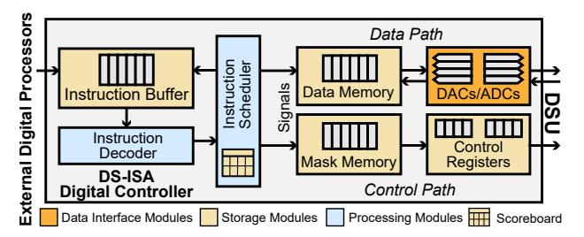
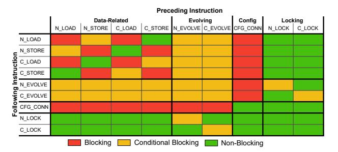
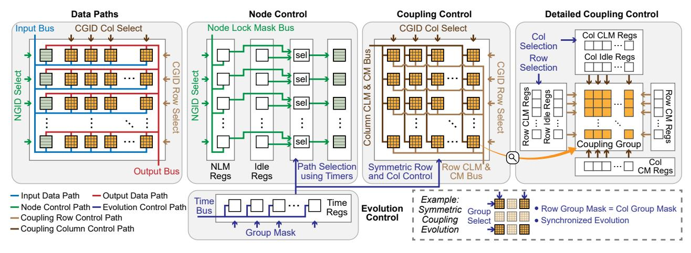
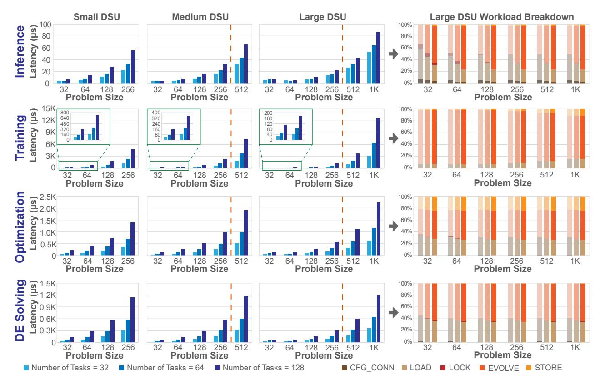
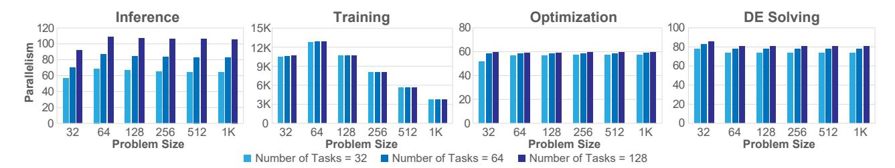
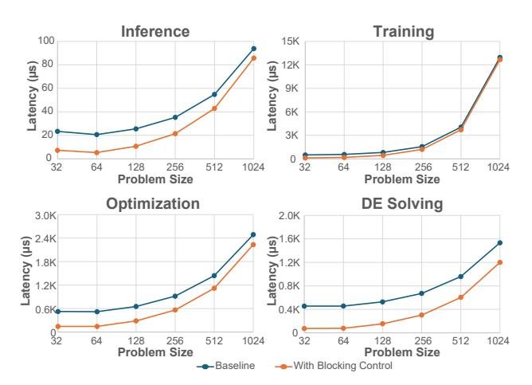

# IV. ISA MICROARCHITECTURE

#### *A. Overview*

The DS-ISA microarchitecture is shown in Figure 8 as a digital controller connecting a traditional processor and a DSU. The controller's front-end fetches instructions from the processor into an Instruction Buffer. An Instruction Decoder then parses the instruction, and an Instruction Scheduler detects data and control hazards, stalling subsequent instructions to enforce dependencies. The detailed operation of this blocking logic will be discussed in Section IV-B.

The decoded instructions are executed by two primary hardware paths. The Data Path provides the primary datapath for load and store instructions. It uses Data Memory to stage data and the DACs/ADCs block to convert data between the digital controller and the analog DSU. The Control Path provides the hardware for the ISA's "label-and-trigger" mechanism. It is

Fig. 7. Example: DSU behavior upon executing ML inference with the corresponding instructions.

Fig. 8. Overview of the proposed ISA digital controller for DSU.

Fig. 9. Blocking policy from preceding instructions to following instructions. The instructions are categorized into data-related, evolving, config, and locking to clearly demonstrate blocking relations.

composed of the Mask Memory (on-chip SRAM), which stores the large, scalable masks (e.g., NLM, GM) pointed to by an instruction's Imm\_address, and the Control Registers, which hold the active masks and configuration bits (e.g., NGID) that are physically applied to the DSU's selector logic.

#### B. Instruction Blocking

DS-ISA presents inherent data and control dependencies. For example, an N\_EVOLVE trigger must not execute until its corresponding N\_LOCK labels are in place. To manage these hazards, the Instruction scheduler in Figure 8 maintains an internal scoreboard that tracks the execution status of inflight instructions. It schedules instructions based on the policy summarized in Figure 9. This policy defines three relations: (1) Blocking (red) indicates a hard, unconditional stall. (2) Conditional Blocking (yellow) is a stall for a control or data hazard, where the following instruction is stalled only until a specific condition is met. (3) Non-Blocking (green) means the instructions are independent to execute.

The blocking relations in Figure 10 are most clearly understood by analyzing the instructions based on their four functional categories: data-related, evolving, config, and locking.

- (1) The data-related instructions serialize access to the Data Memory and its associated DAC/ADC arrays. This creates a blocking (red) structural hazard against any other data-related instruction. These instructions also pose a conditional blocking (yellow) data hazard, e.g., Read-After-Write (RAW) or Write-After-Read (WAR), to a following evolving instruction. However, they are non-blocking (green) against locking instructions, as the microarchitecture provides separate, parallel paths for data and masks.
- (2) The evolving instructions also have potential conflict with most other instructions. While an evolving instruction is being executed on some target components, all other following instructions that access or reconfigure the evolving components are blocked (yellow).
- (3) The config instruction imposes the strictest limitations. Due to the risk of global disturbance when reconfiguring system connectivity, this instruction issues a hard blocking (red) stall against all data-related and evolving instructions for safety. It is only non-blocking against locking instructions, as they operate on independent hardware.
- (4) The locking instructions are the most permissive. They are non-blocking (green) against data-related, config, and other locking instructions, which allows the controller to efficiently set up DSU state in parallel. Their single, most critical interaction is the conditional block (yellow) they impose on a following \_EVOLVE instruction. This is a classic RAW data hazard, ensuring the \_EVOLVE stalls until the \_LOCK has finished writing its mask to the Control Registers.

While the above blocking relations share similarities with conventional pipeline stall logic, the underlying dependency structure is fundamentally shaped by the DSU execution model. In traditional processors, hazards primarily arise from register or memory data dependencies between discrete operations. In contrast, DSU execution introduces additional constraints tied to the physical evolution process and system configuration. For example, an \_EVOLVE instruction operates on a set of dynamically configured nodes and couplings over a continuous-time evolution interval, during which reconfiguration or data modification of the participating components must be prevented. Similarly, configuration instructions affect global connectivity and therefore impose system-level ordering constraints that are absent in conventional instruction streams. The blocking policy therefore extends standard hazard handling to enforce correctness under these evolution- and configurationdriven dependencies specific to DSU computation.

Fig. 10. Data and control paths of DS-ISA hardware. NGID/CGID: Node/Column Group ID; NLM/CLM: Node/Coupling Lock Mask; CM: Connection Mask.

#### *C. Instruction Execution Flow*

The data and control paths of the designed instructions are shown in Figure 10, categorized by their functions.

Data Paths. The data-related instructions are implemented in the Data Paths block. Recall the instruction definition in Figure 6, for N LOAD, the NGID is sent to the NGID Select logic, which activates the corresponding node group. The address operand points to the data in Data Memory (not shown), and the fetched data is then broadcast along the Input Bus and captured by the selected nodes. N STORE operates in reverse: the NGID Select activates a node group, which drives its data onto the Output Bus to be written to the memory location specified in the instruction.

The C LOAD and C STORE instructions use the same datapath, as they all rely on the ADC/DAC array for programming. Unlike NGID, the CGID col and CGID row are separately used to activate the column and row Selections, pinpointing a specific coupling group to either receive data from the Input Bus or send data to the Output Bus. Additionally, as coupling groups have more elements than a node group, a coupling group is programmed in multiple steps (this level of detail is omitted in the figure).

Node Control. The N LOCK instruction uses the Node Control block to label a group's state for a future evolution. The NLM Address is used to fetch the Node Lock Mask from Mask Memory, which is then placed on the Node Lock Mask Bus. The NGID is used to select a specific node group, and this mask is then written into that group's NLM Registers. These registers are not used immediately – by default, a set of Idle Registers are active, delivering a "locking" signal that prevents evolution in the idle state. Only when an N EVOLVE instruction is executed will the selection logic switch to the NLM Registers, applying the stored mask to synchronously control which nodes evolve and which remain locked.

Coupling Control. The C LOCK and CFG CONN instructions use the Coupling Control datapath. In both cases, the CGID col and CGID row together select a specific coupling group. For CFG CONN, the CM Address is used to fetch a connection mask, which is written to the Col/Row CM Registers to define the group's active topology. For C LOCK, the CLM Address is used to fetches a lock mask, which is written to the Col/Row CLM Registers. As shown in the Detailed Coupling Control diagram, each coupling group contains a set of CLM Registers acting as labels. Similar to node control, they are only selected and applied during a C EVOLVE instruction, while an idle state keeps the couplings locked.

Evolution Control. The N EVOLVE and C EVOLVE instructions act as the "triggers" for computation and share the Evolution Control datapath. The GM Address fetches the Group Mask from Mask Memory. This inter-group mask is used to determine which node or coupling groups will receive the evolution signal. This signal initiates the evolution by switching the selection logic in the selected groups from their default Idle Registers to their labeling registers NLM or CLM.

Simultaneously, the Time signal is placed on the Time Bus and written into the Time Registers for each participating group, initiating a countdown. The evolution proceeds for this specified duration. Once a group's timer reaches zero, its selection logic reverts to the Idle Registers, which re-applies the default locking signal to lock the components in their evolved state. This timer-based mechanism is shared by both node and coupling control.

For C EVOLVE, the control mechanism features a crucial hardware optimization, as shown in the bottom-right subfigure. The same 1D group mask used for node evolution is applied symmetrically to the couplings, serving as both the row group selection and the column group selection. This symmetric deployment reflects the physical meaning of couplings in a DSU. A coupling represents the interaction between a pair of nodes rather than an independent computational element. Therefore, when a set of nodes is selected for evolution, all pairwise couplings among those nodes must be considered simultaneously. Applying the same 1D group mask to both row and column dimensions activates the corresponding interaction sub-matrix, ensuring that all relevant pairwise interactions participate in the evolution. Combined with the connectivity configuration specified by CFG CONN, this mechanism enables evolution over the appropriate subset of couplings without requiring explicit enumeration of individual coupling pairs. This symmetric deployment is a key design feature that preserves the simplicity and elegance of the ISA. It allows C EVOLVE to reuse the same single GM Addr field as N EVOLVE, avoiding the architectural complexity of adding a second, potentially large, address pointer to the instruction format just for coupling evolution.

Functionally, the mechanism activates the entire sub-matrix of couplings associated with the node groups indicated by the 1D mask. This ensures that all relevant interactions are enabled without requiring explicit enumeration, naturally supporting dynamic and fragmented resource allocation. This also enables the system to efficiently utilize scattered, unused "bubbles" of nodes and couplings that appear after repeated task execution, thus mitigating resource fragmentation. This flexibility can also be leveraged by a runtime to implement wear-leveling strategies, distributing computation across the hardware to avoid overusing specific components and thereby extending the DSU's operational lifespan.

While convergence-detection mechanisms could be incorporated to determine when the dynamical system reaches equilibrium (e.g., a variation-detection module could reuse idle ADC resources or dedicated ADCs to monitor states), DS-ISA intentionally adopts time-controlled evolution as a more fundamental mechanism to handle various applications that may not require equilibrium. This design keeps the instruction interface clean and deterministic while leaving convergence monitoring as a possible extension.

#### *D. Programming Portability*

DS-ISA is designed to improve programming portability by abstracting the fundamental operational phases common to DSU computation. Across representative applications, DSU execution generally follows a recurring sequence: configuring system connectivity, loading or clamping input data, triggering system evolution, and retrieving results after evolution completes. DS-ISA encodes these phases through a small set of instructions.

Importantly, this abstraction is defined at the level of coupled state evolution under configured constraints rather than the specific circuit implementation of the DSU. While this work evaluates a CMOS-based DSU realization, the same operational phases appear as long as the underlying system supports programmable interactions among state variables and time-driven evolution dynamics.

#### *E. Comparison with Prior DSU Control Approaches*

Prior representative DS systems (BRIM [1], DS-GL [30], DS-TPU [36], and DS-TIDE [15]) are tailored to specific application workflows, and therefore implicitly embed the following assumptions: (1) Uniform coupling configuration. Prior DSU designs configure couplings in a column-wise manner using shared control signals, where couplings are distinguished only by their parameter values. Prior designs do not expose selective control over subsets of couplings (e.g., masking), whereas DS-ISA enables such flexibility through instruction-level abstractions. (2) Global coupling evolution. Coupling evolution in prior designs is applied collectively via global control signals or switches, as an entire DSU is designed for a specific application. DS-ISA supports selective control over coupling subsets while retaining groupbased operations, enabling partitioning of a DSU for multiple tasks or a task with multiple stages. (3) One-time node initialization. Prior DSU designs treat node states primarily as initial conditions, with limited support for capturing and reusing intermediate states during execution. DS-ISA enables explicit loading and reuse of node states across execution phases through store-and-reload operations, supporting multiphase workflows such as solving PDEs with varying boundary conditions within a unified execution. (4) Lack of overlapaware execution control. Prior DSU designs do not expose mechanisms to exploit overlapping operations, resulting in effectively serialized execution, whereas DS-ISA enables instruction overlapping through explicit blocking control in Section IV-C. To compare the efficiency of two controlling mechanisms, experimental results are provided in Section V-D.

#### V. EXPERIMENTAL RESULTS

## *A. Experimental Setup*

Digital Implementation and Physical Design. The digital control logic for the proposed ISA was described in SystemVerilog and implemented using a fully open-source EDA flow. We utilized Yosys [35] for logic synthesis and the Open-ROAD framework [2] for physical design. The design targets the SkyWater 130 nm (SKY130) process, a widely accessible, general-purpose technology. SKY130 provides robust support for analog and mixed-signal designs, making it more suitable than processes optimized purely for digital performance. The process has been employed in multiple recent mixed-signal design publications [12], [20], [21], establishing it as an appropriate reference platform for this work.

Analog Interface Estimation. To provide a comprehensive evaluation of the total system overhead, we incorporated area and power estimates for the mixed-signal interface components based on state-of-the-art implementations in similar 130 nm processes. Specifically, we modeled the 8-bit ADCs based on a 1 GS/s design occupying 0.72 mm2 with a power consumption of 13.3 mW [40]. For the DACs, we utilized reference metrics from a 600 MS/s implementation measuring 0.27mm2 and consuming 2.4 mW [6].

Evaluation Configuration. The number of node groups is set to 32 and the number of nodes per group is swept among 8 (small DSU), 16 (medium DSU), and 32 (large DSU), as performance is sensitive to group size. The number of ADCs and DACs are scaled to match the number of nodes per group, enabling concurrent data loading and retrieval for the active group. The controller runs at 200 MHz, which is used in the following performance evaluations. For inference, we use a typical evolving time of 100 ns. For optimization, the evolution, store, and load loop is executed 100 times with 10 ns duration per evolution, with 10% nodes selected for annealing per loop. For differential equation solving, we consider the case that the boundary condition varies with time, thus the evolution-load loop in Figure 5. The loop is executed 100 times with 10 ns duration for each evolution. For training, each model is trained for 100 iterations, with 10 ns duration for each iteration. For all tasks, the number of input nodes (condition nodes) equals that of output nodes (evolving nodes).

The evolution durations used in this evaluation are chosen based on time scales reported in prior DSU studies. For example,  $\sim \! 100$  ns-level inference latency and  $\mu s$ -level training latency were reported in [14], while  $\mu s$ -level execution times were reported for differential equation solving [15] and optimization workloads [1]. Considering the 200 MHz controller frequency in our architecture, we adopt 10 ns as a representative minimal evolution duration and construct longer execution phases through repeated evolution loops. The specific values used in our evaluation are therefore not intended to represent optimal convergence parameters for each application, but rather to reflect realistic time scales reported in prior work while providing a controlled setup to isolate the overhead of the proposed ISA and control architecture.

#### B. Benchmarks

Fig. 11. Single task latency on DSUs of different capacities. Problem size: the total number of nodes in a task. All DSUs have 32 node groups.

In this evaluation, the evolution time is intentionally kept fixed across different problem sizes. This choice is made to provide a controlled experimental setup that isolates the architectural overhead of instruction execution and controller operation from the application-dependent convergence dynamics of the DSU. In practical deployments, the evolution duration can be tuned based on the problem characteristics, system dynamics, or convergence criteria. Our goal here is to evaluate the scalability and efficiency of the proposed ISA and control architecture under consistent evolution parameters.

**Single Task Evaluation.** Figure 11 shows that for all four applications, the latency generally scales linearly with the number of nodes employed for a task (problem size). An

exception to this trend occurs in the large DSU configuration (32 nodes per group) when the problem size is 32. Although the 16 input nodes and 16 output nodes can share a single 32-node group, the instructions must be applied to the entire group, resulting in a total latency comparable to that of a 64-node problem, where instructions mainly execute on the output node group, or the coupling group.

Parallel Tasks Evaluation. Figure 12 presents the latency results (in  $\mu$ s) for the four target applications, evaluated across multiple problem sizes and three distinct DSU capacity configurations. The analysis reveals that the latency scaling characteristics are highly application-dependent. Inference exhibits excellent scalability with the number of tasks. The latency scales sub-linearly because the coupling parameters can be loaded once and reused for all subsequent tasks, effectively amortizing the initial configuration overhead. In contrast, training latency scales approximately quadratically  $(O(N^2))$  with the problem size (N). This behavior is expected, as the dominant workloads are initializing and storing the coupling parameters, and the number of couplings in the DSU scales with the square of the node count. It is worth noting that if a DSU is used in lifelong learning, i.e., the couplings constantly evolve upon observing new node data, the expensive coupling initialization and storing are bypassed. Here, we only focus on general cases. The latency for optimization and DE solving scales linearly with both the problem size and the number of tasks. This is because their execution loops are dominated by data exchange operations (loading and storing node states), which are O(N) operations that must be repeated for each task or loop iteration.

The different parallel scaling behaviors arise from how coupling parameters are handled across tasks. For inference, optimization, and DE solving, the same coupling configuration is reused for all tasks once initialized, so the dominant cost lies in evolving node states and exchanging node data. In contrast, training requires updating coupling parameters after each task, which introduces additional  $C_{\rm LOAD}$  and  $C_{\rm STORE}$  operations. Since the number of couplings grows quadratically with the number of nodes, these operations increasingly dominate the execution time as the problem size increases, thus decreasing parallelism. When the number of coupling is small, the overhead is not obvious, and the parallelism is dominated by the increasing number of evolving couplings, thus the peak.

**Parallelism Evaluation.** Figure 12 also provides the workload distribution for the experiments on the large DSU configuration (1K nodes with 32 groups and 32 nodes per group). We define the total workload of an instruction as the sum of all active component-cycles, expressed as  $\sum_{t=1}^{T} n(t)$ , where n(t) is the number of active components (e.g., nodes or couplings) targeted by the instruction at cycle t over a total of T cycles. We observe that the EVOLVE instructions are among the leading workloads in all scenarios. This is particularly evident in the Training application, where the C\_EVOLVE workload is the primary contributor, reflecting the high degree of parallelism inherent in updating the coupling matrix. Figure 13 quantifies this parallelism for the EVOLVE

Fig. 12. Latency comparisons and workload breakdown for the test cases on Large DSU. We calculate an instruction's workload by summing the number of active components it targets during each of its active cycles. For example, the workload for C\_EVOLVE in a cycle is the total count of evolving couplings. blue bars on the right of the orange dashed lines are additional results compared to small DSU.

Fig. 13. Evolution parallelism on large DSU with 1024 nodes. Evolution parallelism: average number of evolving nodes or couplings per cycle.

instructions, defined as the average number of active components per cycle  $(\sum_{t=1}^T n(t)/T)$ . The results demonstrate that the microarchitecture sustains a high level of concurrent operation, with an average of over 60 nodes and 3K couplings simultaneously active during evolution across the evaluated applications.

**Stall Evaluation.** Figure 14 quantifies the stall cycle overhead as a proportion of total operating cycles for the large DSU configuration. For the iterative workloads (Training, Optimization, and DE Solving), the stall ratio remains low, consistently below 25%, which also shows a clear trend of decreasing as the problem size scales. For inference, the one-time C\_LOAD structural hazard required to program the couplings is not sufficiently amortized over multiple iterations, given the fast 100 ns evolution. Despite that, the inference

workload demonstrates a clear downward trend in its stall ratio as the problem size scales, confirming that the architecture's efficiency improves as the computational demands increase.

#### C. Power and Area Evaluation

Table I quantifies the power and area of the digital controller. The results highlight that for a large-scale 32x32 DSU, the entire digital control logic to manage 1K nodes and 1M couplings consumes only 4.6W and occupies a modest  $\sim 80$  mm2 area in the SKY130 process.

In Table II, the DS-ISA controller power and area corresponding to analog DSUs are listed to provide a comparative view. Even with 130 nm process, the DS-ISA controller power cost is relatively comparable to the 45 nm DS-TPU, where the evolving coupling mechanism contributes to the majority

Fig. 14. Proportion of stall cycles in total operating cycles for the large DSU configuration.

TABLE I
POWER AND AREA RESULTS FOR EXAMPLE DSU CONFIGURATIONS

| DSU Configuration a | 8×8   | 16×16 | 32×8  | 32×16 | 32×32 |
|--------------------------------|-------|-------|-------|-------|-------|
| Power (mW)                     | 375.6 | 3097  | 2714  | 3254  | 4642  |
| Area (mm 2 )        | 15.42 | 37.46 | 28.16 | 37.64 | 79.58 |

&lt;sup>a Number of groups × group size.

of power consumption compared to BRIM and DS-GL with fixed couplings. Compared to DS-TPU, DS-TIDE utilizes a highly sparse architecture, resulting in considerably reduced power and area utilization despite more nodes. In this work, to support a broad range of workloads, the DS-ISA controller accommodates a general dense coupling structure.

#### D. Scheduling Efficiency Evaluation

Fig. 15. Scheduling effectiveness comparison with serialized baseline.

To evaluate the effectiveness of instruction scheduling, we compare the hazard-aware blocking policy with a conservative serialized baseline that mimics the behavior of prior DSU controllers that do not exploit overlapping operations, assuming their ability to selectively program and execute nodes and couplings. The baseline enforces blocking after each instruction to avoid potential conflicts. This baseline ensures correctness but prevents overlapping operations across instruction phases. Figure 15 shows the latency comparison across four workloads. The results demonstrate that the proposed blocking policy consistently reduces execution latency by allowing

independent instructions to proceed without unnecessary stalls.

#### VI. RELATED WORK

#### A. Recent Advancements in DSU

Graph Learning: Foundational work [30], [37] first demonstrated how to extend binary-only Ising machines to support the real-valued data essential for modern applications. This was achieved by modifying the system's underlying energy function to allow node values to stabilize at continuous, real-valued equilibrium points. This real-valued dynamical system is particularly well-suited for graph learning, as its underlying model is inherently a fully-connected graph, providing strong expressivity and the long-range cascading ability to propagate information, properties that are highly compatible for graph learning. This approach was successfully applied to a wide range of spatial-temporal graph learning tasks, e.g., traffic flow prediction, air quality forecasting, and pandemic progression.

On-Device Training: Subsequent works built on this real-valued foundation to add on-device training capabilities, addressing the lack of a native training solution on DS hardware. DS-TPU [36] and InstaTrain [14] both introduced novel mechanisms for on-device parameter updates to support rapid, lifelong learning. DS-TPU also integrated a method for modeling nonlinear node interactions using Chebyshev polynomials to enhance model expressivity and improve training quality.

Other DSU Applications: The DSU paradigm has also been mapped to additional domains. DS-TIDE [15] leverages the intrinsic connection between dynamical systems and time-independent differential equations, as both find solutions by converging to an equilibrium state. It solves equations through DSU's natural evolution, and uses an on-device auto-alignment mechanism to adapt the hardware to different equations. DS-LLM [29] provided the first framework for mapping conventional LLM operations onto DS machines by mathematically transforming them into optimization problems that the DSU's natural process can solve.

Despite their success, they remain ad-hoc and applicationspecific. To address this, our work is the first to analyze and abstract diverse implementations and application patterns into a standardized, programmable interface (DS-ISA).

## B. Conventional and Emerging ISAs

Our work is differentiated from the ISAs of conventional processors and other accelerators by its fundamental compu-

TABLE II COMPARATIVE SUMMARY OF EXISTING ANALOG DSUS AND THE DIGITAL DS-ISA CONTROLLER

| Architecture                  | Node # | Process | Evolving Couplings | Power  | Controller Power* | Area     | Controller Area* |
|-------------------------------|--------|---------|--------------------|--------|-------------------|----------|------------------|
| BRIM [1]                      | 2000   | 45 nm   | No                 | 250 mW | 9.0 W             | 5 mm2    | 160 mm2          |
| DS-GL [30]                    | 8000   | 45 nm   | No                 | 550 mW | 36 W              | 6.5 mm2  | 628 mm2          |
| DS-TPU [36]                   | 2000   | 45 nm   | Yes                | 5.7 W  | 9.0 W             | 34.1 mm2 | 190 mm2          |
| DS-TIDE [15]                  | 4608   | 45 nm   | Yes                | 1.5 W  | 21 W              | 12.7 mm2 | 371 mm2          |
| DS-ISA Controller (this work) | 1024   | 130 nm  | Supported          | 4.6 W  | -                 | 79.6 mm2 | -                |

\* DS-ISA Controller cost, linearly scaled to the number of nodes in existing DSU architectures.

tational model. ISAs for conventional CPUs, such as RISC-V [4] or x86 [19], are built on a sequential, "fetch-decodeexecute" model. They are prescriptive, meaning the program explicitly defines a sequence of discrete, digital operations (e.g., load, add, store) that manipulate data in registers and memory. While programming models like CUDA [22] for GPUs are parallelized (e.g., SIMT), they remain prescriptive, orchestrating explicit digital operations on parallel hardware.

Other emerging paradigms, such as those for neuromorphic computers (e.g., Intel's Loihi [5] or IBM's TrueNorth [3]), offer another distinct model. These brain-inspired architectures are not based on processing continuous values or clocked digital logic, but on an event-based paradigm. Their computation is driven by the asynchronous propagation of discrete "spikes" through a network of configurable neurons. Therefore, their ISA is not arithmetic, but a mechanism for defining neuron parameters (e.g., firing thresholds and leak rates), mapping network topology, and setting synaptic weights. Computation in this model occurs only when a spike arrives.

In contrast to the prescriptive model of conventional processors, the DS-ISA is configurative. While this high-level approach of configuring a system's behavior is also a characteristic of neuromorphic computing, the underlying computational model is fundamentally different. Neuromorphic systems are event-based and designed to process asynchronous, transient spikes. The DS-ISA, conversely, is built upon the load-lockevolve-store execution model, where computation is initiated as a single, triggered collective physical evolution. The system's state then evolves in continuous time for a specified duration, as set by the EVOLVE instruction. This label-andtrigger mechanism, focused on synchronous, continuous-time physical dynamics, is fundamentally distinct from both digital processors and neuromorphic systems.

Another related line of work explores Computing-In-Memory (CIM) architectures based on memristor or ReRAM crossbar arrays. In these systems, computation is performed through analog matrix–vector multiplication (MVM) within the crossbar array, enabling high parallelism and reduced data movement [33]. Building on this computational model, some studies further propose ISA that expose explicit arithmetic kernels (e.g., MVM or convolution) executed on the crossbar fabric [38]. In contrast, the DS-ISA follows a different execution model. Instead of issuing arithmetic operations, programs configure the system topology, boundary conditions, and evolution duration, after which computation emerges from the collective physical evolution of node states. Thus, while CIM-based systems remain operation-centric at the ISA level,

DS-ISA provides a dynamics-centric abstraction tailored to evolution-based computation.

## VII. CONCLUSION

DSUs represent a promising post-Moore's computing paradigm, leveraging CMOS-compatible electronics and natural evolution to achieve orders-of-magnitude efficiency gains. However, the broad adoption of this technology is severely hindered by the absence of standardized abstraction layers, forcing reliance on ad-hoc, implementation-specific control methods that are inadequate for programming these DSUs. This work presents a pioneering effort to establish these crucial abstractions. Through a systematic analysis of diverse application requirements, we propose the unified load-lockevolve-store execution model. Based on this foundational model, we design DS-ISA, the first minimalist 9-instruction ISA for controlling both DSU nodes and couplings. We further propose a supporting microarchitecture that employs groupbased execution and a two-level masking scheme to efficiently manage the DSU's unique control complexity, synchronization, and fine-grained manipulation challenges.

By providing the first standardized ISA and the supporting digital controller design, this work establishes a fundamental backbone for a complete DSU computing ecosystem. This contribution paves the way for scalable DSU hardware development and enables the creation of essential software tools, such as compilers and intermediate representations necessary to automate application mapping. Experimental results confirm the efficiency of this approach, demonstrating that our proposed controller can manage a large-scale 1K-node, 1Mcoupling DSU while consuming only 4.6 Watts, effectively unlocking the potential of this powerful computing paradigm.

# IV. ISA MICROARCHITECTURE

#### *A. Overview*

The DS-ISA microarchitecture is shown in Figure 8 as a digital controller connecting a traditional processor and a DSU. The controller's front-end fetches instructions from the processor into an Instruction Buffer. An Instruction Decoder then parses the instruction, and an Instruction Scheduler detects data and control hazards, stalling subsequent instructions to enforce dependencies. The detailed operation of this blocking logic will be discussed in Section IV-B.

The decoded instructions are executed by two primary hardware paths. The Data Path provides the primary datapath for load and store instructions. It uses Data Memory to stage data and the DACs/ADCs block to convert data between the digital controller and the analog DSU. The Control Path provides the hardware for the ISA's "label-and-trigger" mechanism. It is

Fig. 7. Example: DSU behavior upon executing ML inference with the corresponding instructions.

Fig. 8. Overview of the proposed ISA digital controller for DSU.

Fig. 9. Blocking policy from preceding instructions to following instructions. The instructions are categorized into data-related, evolving, config, and locking to clearly demonstrate blocking relations.

composed of the Mask Memory (on-chip SRAM), which stores the large, scalable masks (e.g., NLM, GM) pointed to by an instruction's Imm\_address, and the Control Registers, which hold the active masks and configuration bits (e.g., NGID) that are physically applied to the DSU's selector logic.

#### B. Instruction Blocking

DS-ISA presents inherent data and control dependencies. For example, an N\_EVOLVE trigger must not execute until its corresponding N\_LOCK labels are in place. To manage these hazards, the Instruction scheduler in Figure 8 maintains an internal scoreboard that tracks the execution status of inflight instructions. It schedules instructions based on the policy summarized in Figure 9. This policy defines three relations: (1) Blocking (red) indicates a hard, unconditional stall. (2) Conditional Blocking (yellow) is a stall for a control or data hazard, where the following instruction is stalled only until a specific condition is met. (3) Non-Blocking (green) means the instructions are independent to execute.

The blocking relations in Figure 10 are most clearly understood by analyzing the instructions based on their four functional categories: data-related, evolving, config, and locking.

- (1) The data-related instructions serialize access to the Data Memory and its associated DAC/ADC arrays. This creates a blocking (red) structural hazard against any other data-related instruction. These instructions also pose a conditional blocking (yellow) data hazard, e.g., Read-After-Write (RAW) or Write-After-Read (WAR), to a following evolving instruction. However, they are non-blocking (green) against locking instructions, as the microarchitecture provides separate, parallel paths for data and masks.
- (2) The evolving instructions also have potential conflict with most other instructions. While an evolving instruction is being executed on some target components, all other following instructions that access or reconfigure the evolving components are blocked (yellow).
- (3) The config instruction imposes the strictest limitations. Due to the risk of global disturbance when reconfiguring system connectivity, this instruction issues a hard blocking (red) stall against all data-related and evolving instructions for safety. It is only non-blocking against locking instructions, as they operate on independent hardware.
- (4) The locking instructions are the most permissive. They are non-blocking (green) against data-related, config, and other locking instructions, which allows the controller to efficiently set up DSU state in parallel. Their single, most critical interaction is the conditional block (yellow) they impose on a following \_EVOLVE instruction. This is a classic RAW data hazard, ensuring the \_EVOLVE stalls until the \_LOCK has finished writing its mask to the Control Registers.

While the above blocking relations share similarities with conventional pipeline stall logic, the underlying dependency structure is fundamentally shaped by the DSU execution model. In traditional processors, hazards primarily arise from register or memory data dependencies between discrete operations. In contrast, DSU execution introduces additional constraints tied to the physical evolution process and system configuration. For example, an \_EVOLVE instruction operates on a set of dynamically configured nodes and couplings over a continuous-time evolution interval, during which reconfiguration or data modification of the participating components must be prevented. Similarly, configuration instructions affect global connectivity and therefore impose system-level ordering constraints that are absent in conventional instruction streams. The blocking policy therefore extends standard hazard handling to enforce correctness under these evolution- and configurationdriven dependencies specific to DSU computation.

Fig. 10. Data and control paths of DS-ISA hardware. NGID/CGID: Node/Column Group ID; NLM/CLM: Node/Coupling Lock Mask; CM: Connection Mask.

#### *C. Instruction Execution Flow*

The data and control paths of the designed instructions are shown in Figure 10, categorized by their functions.

Data Paths. The data-related instructions are implemented in the Data Paths block. Recall the instruction definition in Figure 6, for N LOAD, the NGID is sent to the NGID Select logic, which activates the corresponding node group. The address operand points to the data in Data Memory (not shown), and the fetched data is then broadcast along the Input Bus and captured by the selected nodes. N STORE operates in reverse: the NGID Select activates a node group, which drives its data onto the Output Bus to be written to the memory location specified in the instruction.

The C LOAD and C STORE instructions use the same datapath, as they all rely on the ADC/DAC array for programming. Unlike NGID, the CGID col and CGID row are separately used to activate the column and row Selections, pinpointing a specific coupling group to either receive data from the Input Bus or send data to the Output Bus. Additionally, as coupling groups have more elements than a node group, a coupling group is programmed in multiple steps (this level of detail is omitted in the figure).

Node Control. The N LOCK instruction uses the Node Control block to label a group's state for a future evolution. The NLM Address is used to fetch the Node Lock Mask from Mask Memory, which is then placed on the Node Lock Mask Bus. The NGID is used to select a specific node group, and this mask is then written into that group's NLM Registers. These registers are not used immediately – by default, a set of Idle Registers are active, delivering a "locking" signal that prevents evolution in the idle state. Only when an N EVOLVE instruction is executed will the selection logic switch to the NLM Registers, applying the stored mask to synchronously control which nodes evolve and which remain locked.

Coupling Control. The C LOCK and CFG CONN instructions use the Coupling Control datapath. In both cases, the CGID col and CGID row together select a specific coupling group. For CFG CONN, the CM Address is used to fetch a connection mask, which is written to the Col/Row CM Registers to define the group's active topology. For C LOCK, the CLM Address is used to fetches a lock mask, which is written to the Col/Row CLM Registers. As shown in the Detailed Coupling Control diagram, each coupling group contains a set of CLM Registers acting as labels. Similar to node control, they are only selected and applied during a C EVOLVE instruction, while an idle state keeps the couplings locked.

Evolution Control. The N EVOLVE and C EVOLVE instructions act as the "triggers" for computation and share the Evolution Control datapath. The GM Address fetches the Group Mask from Mask Memory. This inter-group mask is used to determine which node or coupling groups will receive the evolution signal. This signal initiates the evolution by switching the selection logic in the selected groups from their default Idle Registers to their labeling registers NLM or CLM.

Simultaneously, the Time signal is placed on the Time Bus and written into the Time Registers for each participating group, initiating a countdown. The evolution proceeds for this specified duration. Once a group's timer reaches zero, its selection logic reverts to the Idle Registers, which re-applies the default locking signal to lock the components in their evolved state. This timer-based mechanism is shared by both node and coupling control.

For C EVOLVE, the control mechanism features a crucial hardware optimization, as shown in the bottom-right subfigure. The same 1D group mask used for node evolution is applied symmetrically to the couplings, serving as both the row group selection and the column group selection. This symmetric deployment reflects the physical meaning of couplings in a DSU. A coupling represents the interaction between a pair of nodes rather than an independent computational element. Therefore, when a set of nodes is selected for evolution, all pairwise couplings among those nodes must be considered simultaneously. Applying the same 1D group mask to both row and column dimensions activates the corresponding interaction sub-matrix, ensuring that all relevant pairwise interactions participate in the evolution. Combined with the connectivity configuration specified by CFG CONN, this mechanism enables evolution over the appropriate subset of couplings without requiring explicit enumeration of individual coupling pairs. This symmetric deployment is a key design feature that preserves the simplicity and elegance of the ISA. It allows C EVOLVE to reuse the same single GM Addr field as N EVOLVE, avoiding the architectural complexity of adding a second, potentially large, address pointer to the instruction format just for coupling evolution.

Functionally, the mechanism activates the entire sub-matrix of couplings associated with the node groups indicated by the 1D mask. This ensures that all relevant interactions are enabled without requiring explicit enumeration, naturally supporting dynamic and fragmented resource allocation. This also enables the system to efficiently utilize scattered, unused "bubbles" of nodes and couplings that appear after repeated task execution, thus mitigating resource fragmentation. This flexibility can also be leveraged by a runtime to implement wear-leveling strategies, distributing computation across the hardware to avoid overusing specific components and thereby extending the DSU's operational lifespan.

While convergence-detection mechanisms could be incorporated to determine when the dynamical system reaches equilibrium (e.g., a variation-detection module could reuse idle ADC resources or dedicated ADCs to monitor states), DS-ISA intentionally adopts time-controlled evolution as a more fundamental mechanism to handle various applications that may not require equilibrium. This design keeps the instruction interface clean and deterministic while leaving convergence monitoring as a possible extension.

#### *D. Programming Portability*

DS-ISA is designed to improve programming portability by abstracting the fundamental operational phases common to DSU computation. Across representative applications, DSU execution generally follows a recurring sequence: configuring system connectivity, loading or clamping input data, triggering system evolution, and retrieving results after evolution completes. DS-ISA encodes these phases through a small set of instructions.

Importantly, this abstraction is defined at the level of coupled state evolution under configured constraints rather than the specific circuit implementation of the DSU. While this work evaluates a CMOS-based DSU realization, the same operational phases appear as long as the underlying system supports programmable interactions among state variables and time-driven evolution dynamics.

#### *E. Comparison with Prior DSU Control Approaches*

Prior representative DS systems (BRIM [1], DS-GL [30], DS-TPU [36], and DS-TIDE [15]) are tailored to specific application workflows, and therefore implicitly embed the following assumptions: (1) Uniform coupling configuration. Prior DSU designs configure couplings in a column-wise manner using shared control signals, where couplings are distinguished only by their parameter values. Prior designs do not expose selective control over subsets of couplings (e.g., masking), whereas DS-ISA enables such flexibility through instruction-level abstractions. (2) Global coupling evolution. Coupling evolution in prior designs is applied collectively via global control signals or switches, as an entire DSU is designed for a specific application. DS-ISA supports selective control over coupling subsets while retaining groupbased operations, enabling partitioning of a DSU for multiple tasks or a task with multiple stages. (3) One-time node initialization. Prior DSU designs treat node states primarily as initial conditions, with limited support for capturing and reusing intermediate states during execution. DS-ISA enables explicit loading and reuse of node states across execution phases through store-and-reload operations, supporting multiphase workflows such as solving PDEs with varying boundary conditions within a unified execution. (4) Lack of overlapaware execution control. Prior DSU designs do not expose mechanisms to exploit overlapping operations, resulting in effectively serialized execution, whereas DS-ISA enables instruction overlapping through explicit blocking control in Section IV-C. To compare the efficiency of two controlling mechanisms, experimental results are provided in Section V-D.

#### V. EXPERIMENTAL RESULTS

## *A. Experimental Setup*

Digital Implementation and Physical Design. The digital control logic for the proposed ISA was described in SystemVerilog and implemented using a fully open-source EDA flow. We utilized Yosys [35] for logic synthesis and the Open-ROAD framework [2] for physical design. The design targets the SkyWater 130 nm (SKY130) process, a widely accessible, general-purpose technology. SKY130 provides robust support for analog and mixed-signal designs, making it more suitable than processes optimized purely for digital performance. The process has been employed in multiple recent mixed-signal design publications [12], [20], [21], establishing it as an appropriate reference platform for this work.

Analog Interface Estimation. To provide a comprehensive evaluation of the total system overhead, we incorporated area and power estimates for the mixed-signal interface components based on state-of-the-art implementations in similar 130 nm processes. Specifically, we modeled the 8-bit ADCs based on a 1 GS/s design occupying 0.72 mm2 with a power consumption of 13.3 mW [40]. For the DACs, we utilized reference metrics from a 600 MS/s implementation measuring 0.27mm2 and consuming 2.4 mW [6].

Evaluation Configuration. The number of node groups is set to 32 and the number of nodes per group is swept among 8 (small DSU), 16 (medium DSU), and 32 (large DSU), as performance is sensitive to group size. The number of ADCs and DACs are scaled to match the number of nodes per group, enabling concurrent data loading and retrieval for the active group. The controller runs at 200 MHz, which is used in the following performance evaluations. For inference, we use a typical evolving time of 100 ns. For optimization, the evolution, store, and load loop is executed 100 times with 10 ns duration per evolution, with 10% nodes selected for annealing per loop. For differential equation solving, we consider the case that the boundary condition varies with time, thus the evolution-load loop in Figure 5. The loop is executed 100 times with 10 ns duration for each evolution. For training, each model is trained for 100 iterations, with 10 ns duration for each iteration. For all tasks, the number of input nodes (condition nodes) equals that of output nodes (evolving nodes).

The evolution durations used in this evaluation are chosen based on time scales reported in prior DSU studies. For example,  $\sim \! 100$  ns-level inference latency and  $\mu s$ -level training latency were reported in [14], while  $\mu s$ -level execution times were reported for differential equation solving [15] and optimization workloads [1]. Considering the 200 MHz controller frequency in our architecture, we adopt 10 ns as a representative minimal evolution duration and construct longer execution phases through repeated evolution loops. The specific values used in our evaluation are therefore not intended to represent optimal convergence parameters for each application, but rather to reflect realistic time scales reported in prior work while providing a controlled setup to isolate the overhead of the proposed ISA and control architecture.

#### B. Benchmarks

Fig. 11. Single task latency on DSUs of different capacities. Problem size: the total number of nodes in a task. All DSUs have 32 node groups.

In this evaluation, the evolution time is intentionally kept fixed across different problem sizes. This choice is made to provide a controlled experimental setup that isolates the architectural overhead of instruction execution and controller operation from the application-dependent convergence dynamics of the DSU. In practical deployments, the evolution duration can be tuned based on the problem characteristics, system dynamics, or convergence criteria. Our goal here is to evaluate the scalability and efficiency of the proposed ISA and control architecture under consistent evolution parameters.

**Single Task Evaluation.** Figure 11 shows that for all four applications, the latency generally scales linearly with the number of nodes employed for a task (problem size). An

exception to this trend occurs in the large DSU configuration (32 nodes per group) when the problem size is 32. Although the 16 input nodes and 16 output nodes can share a single 32-node group, the instructions must be applied to the entire group, resulting in a total latency comparable to that of a 64-node problem, where instructions mainly execute on the output node group, or the coupling group.

Parallel Tasks Evaluation. Figure 12 presents the latency results (in  $\mu$ s) for the four target applications, evaluated across multiple problem sizes and three distinct DSU capacity configurations. The analysis reveals that the latency scaling characteristics are highly application-dependent. Inference exhibits excellent scalability with the number of tasks. The latency scales sub-linearly because the coupling parameters can be loaded once and reused for all subsequent tasks, effectively amortizing the initial configuration overhead. In contrast, training latency scales approximately quadratically  $(O(N^2))$  with the problem size (N). This behavior is expected, as the dominant workloads are initializing and storing the coupling parameters, and the number of couplings in the DSU scales with the square of the node count. It is worth noting that if a DSU is used in lifelong learning, i.e., the couplings constantly evolve upon observing new node data, the expensive coupling initialization and storing are bypassed. Here, we only focus on general cases. The latency for optimization and DE solving scales linearly with both the problem size and the number of tasks. This is because their execution loops are dominated by data exchange operations (loading and storing node states), which are O(N) operations that must be repeated for each task or loop iteration.

The different parallel scaling behaviors arise from how coupling parameters are handled across tasks. For inference, optimization, and DE solving, the same coupling configuration is reused for all tasks once initialized, so the dominant cost lies in evolving node states and exchanging node data. In contrast, training requires updating coupling parameters after each task, which introduces additional  $C_{\rm LOAD}$  and  $C_{\rm STORE}$  operations. Since the number of couplings grows quadratically with the number of nodes, these operations increasingly dominate the execution time as the problem size increases, thus decreasing parallelism. When the number of coupling is small, the overhead is not obvious, and the parallelism is dominated by the increasing number of evolving couplings, thus the peak.

**Parallelism Evaluation.** Figure 12 also provides the workload distribution for the experiments on the large DSU configuration (1K nodes with 32 groups and 32 nodes per group). We define the total workload of an instruction as the sum of all active component-cycles, expressed as  $\sum_{t=1}^{T} n(t)$ , where n(t) is the number of active components (e.g., nodes or couplings) targeted by the instruction at cycle t over a total of T cycles. We observe that the EVOLVE instructions are among the leading workloads in all scenarios. This is particularly evident in the Training application, where the C\_EVOLVE workload is the primary contributor, reflecting the high degree of parallelism inherent in updating the coupling matrix. Figure 13 quantifies this parallelism for the EVOLVE

Fig. 12. Latency comparisons and workload breakdown for the test cases on Large DSU. We calculate an instruction's workload by summing the number of active components it targets during each of its active cycles. For example, the workload for C\_EVOLVE in a cycle is the total count of evolving couplings. blue bars on the right of the orange dashed lines are additional results compared to small DSU.

Fig. 13. Evolution parallelism on large DSU with 1024 nodes. Evolution parallelism: average number of evolving nodes or couplings per cycle.

instructions, defined as the average number of active components per cycle  $(\sum_{t=1}^T n(t)/T)$ . The results demonstrate that the microarchitecture sustains a high level of concurrent operation, with an average of over 60 nodes and 3K couplings simultaneously active during evolution across the evaluated applications.

**Stall Evaluation.** Figure 14 quantifies the stall cycle overhead as a proportion of total operating cycles for the large DSU configuration. For the iterative workloads (Training, Optimization, and DE Solving), the stall ratio remains low, consistently below 25%, which also shows a clear trend of decreasing as the problem size scales. For inference, the one-time C\_LOAD structural hazard required to program the couplings is not sufficiently amortized over multiple iterations, given the fast 100 ns evolution. Despite that, the inference

workload demonstrates a clear downward trend in its stall ratio as the problem size scales, confirming that the architecture's efficiency improves as the computational demands increase.

#### C. Power and Area Evaluation

Table I quantifies the power and area of the digital controller. The results highlight that for a large-scale 32x32 DSU, the entire digital control logic to manage 1K nodes and 1M couplings consumes only 4.6W and occupies a modest  $\sim 80$  mm2 area in the SKY130 process.

In Table II, the DS-ISA controller power and area corresponding to analog DSUs are listed to provide a comparative view. Even with 130 nm process, the DS-ISA controller power cost is relatively comparable to the 45 nm DS-TPU, where the evolving coupling mechanism contributes to the majority

Fig. 14. Proportion of stall cycles in total operating cycles for the large DSU configuration.

TABLE I
POWER AND AREA RESULTS FOR EXAMPLE DSU CONFIGURATIONS

| DSU Configuration a | 8×8   | 16×16 | 32×8  | 32×16 | 32×32 |
|--------------------------------|-------|-------|-------|-------|-------|
| Power (mW)                     | 375.6 | 3097  | 2714  | 3254  | 4642  |
| Area (mm 2 )        | 15.42 | 37.46 | 28.16 | 37.64 | 79.58 |

&lt;sup>a Number of groups × group size.

of power consumption compared to BRIM and DS-GL with fixed couplings. Compared to DS-TPU, DS-TIDE utilizes a highly sparse architecture, resulting in considerably reduced power and area utilization despite more nodes. In this work, to support a broad range of workloads, the DS-ISA controller accommodates a general dense coupling structure.

#### D. Scheduling Efficiency Evaluation

Fig. 15. Scheduling effectiveness comparison with serialized baseline.

To evaluate the effectiveness of instruction scheduling, we compare the hazard-aware blocking policy with a conservative serialized baseline that mimics the behavior of prior DSU controllers that do not exploit overlapping operations, assuming their ability to selectively program and execute nodes and couplings. The baseline enforces blocking after each instruction to avoid potential conflicts. This baseline ensures correctness but prevents overlapping operations across instruction phases. Figure 15 shows the latency comparison across four workloads. The results demonstrate that the proposed blocking policy consistently reduces execution latency by allowing

independent instructions to proceed without unnecessary stalls.

#### VI. RELATED WORK

#### A. Recent Advancements in DSU

Graph Learning: Foundational work [30], [37] first demonstrated how to extend binary-only Ising machines to support the real-valued data essential for modern applications. This was achieved by modifying the system's underlying energy function to allow node values to stabilize at continuous, real-valued equilibrium points. This real-valued dynamical system is particularly well-suited for graph learning, as its underlying model is inherently a fully-connected graph, providing strong expressivity and the long-range cascading ability to propagate information, properties that are highly compatible for graph learning. This approach was successfully applied to a wide range of spatial-temporal graph learning tasks, e.g., traffic flow prediction, air quality forecasting, and pandemic progression.

On-Device Training: Subsequent works built on this real-valued foundation to add on-device training capabilities, addressing the lack of a native training solution on DS hardware. DS-TPU [36] and InstaTrain [14] both introduced novel mechanisms for on-device parameter updates to support rapid, lifelong learning. DS-TPU also integrated a method for modeling nonlinear node interactions using Chebyshev polynomials to enhance model expressivity and improve training quality.

Other DSU Applications: The DSU paradigm has also been mapped to additional domains. DS-TIDE [15] leverages the intrinsic connection between dynamical systems and time-independent differential equations, as both find solutions by converging to an equilibrium state. It solves equations through DSU's natural evolution, and uses an on-device auto-alignment mechanism to adapt the hardware to different equations. DS-LLM [29] provided the first framework for mapping conventional LLM operations onto DS machines by mathematically transforming them into optimization problems that the DSU's natural process can solve.

Despite their success, they remain ad-hoc and applicationspecific. To address this, our work is the first to analyze and abstract diverse implementations and application patterns into a standardized, programmable interface (DS-ISA).

## B. Conventional and Emerging ISAs

Our work is differentiated from the ISAs of conventional processors and other accelerators by its fundamental compu-

TABLE II COMPARATIVE SUMMARY OF EXISTING ANALOG DSUS AND THE DIGITAL DS-ISA CONTROLLER

| Architecture                  | Node # | Process | Evolving Couplings | Power  | Controller Power* | Area     | Controller Area* |
|-------------------------------|--------|---------|--------------------|--------|-------------------|----------|------------------|
| BRIM [1]                      | 2000   | 45 nm   | No                 | 250 mW | 9.0 W             | 5 mm2    | 160 mm2          |
| DS-GL [30]                    | 8000   | 45 nm   | No                 | 550 mW | 36 W              | 6.5 mm2  | 628 mm2          |
| DS-TPU [36]                   | 2000   | 45 nm   | Yes                | 5.7 W  | 9.0 W             | 34.1 mm2 | 190 mm2          |
| DS-TIDE [15]                  | 4608   | 45 nm   | Yes                | 1.5 W  | 21 W              | 12.7 mm2 | 371 mm2          |
| DS-ISA Controller (this work) | 1024   | 130 nm  | Supported          | 4.6 W  | -                 | 79.6 mm2 | -                |

\* DS-ISA Controller cost, linearly scaled to the number of nodes in existing DSU architectures.

tational model. ISAs for conventional CPUs, such as RISC-V [4] or x86 [19], are built on a sequential, "fetch-decodeexecute" model. They are prescriptive, meaning the program explicitly defines a sequence of discrete, digital operations (e.g., load, add, store) that manipulate data in registers and memory. While programming models like CUDA [22] for GPUs are parallelized (e.g., SIMT), they remain prescriptive, orchestrating explicit digital operations on parallel hardware.

Other emerging paradigms, such as those for neuromorphic computers (e.g., Intel's Loihi [5] or IBM's TrueNorth [3]), offer another distinct model. These brain-inspired architectures are not based on processing continuous values or clocked digital logic, but on an event-based paradigm. Their computation is driven by the asynchronous propagation of discrete "spikes" through a network of configurable neurons. Therefore, their ISA is not arithmetic, but a mechanism for defining neuron parameters (e.g., firing thresholds and leak rates), mapping network topology, and setting synaptic weights. Computation in this model occurs only when a spike arrives.

In contrast to the prescriptive model of conventional processors, the DS-ISA is configurative. While this high-level approach of configuring a system's behavior is also a characteristic of neuromorphic computing, the underlying computational model is fundamentally different. Neuromorphic systems are event-based and designed to process asynchronous, transient spikes. The DS-ISA, conversely, is built upon the load-lockevolve-store execution model, where computation is initiated as a single, triggered collective physical evolution. The system's state then evolves in continuous time for a specified duration, as set by the EVOLVE instruction. This label-andtrigger mechanism, focused on synchronous, continuous-time physical dynamics, is fundamentally distinct from both digital processors and neuromorphic systems.

Another related line of work explores Computing-In-Memory (CIM) architectures based on memristor or ReRAM crossbar arrays. In these systems, computation is performed through analog matrix–vector multiplication (MVM) within the crossbar array, enabling high parallelism and reduced data movement [33]. Building on this computational model, some studies further propose ISA that expose explicit arithmetic kernels (e.g., MVM or convolution) executed on the crossbar fabric [38]. In contrast, the DS-ISA follows a different execution model. Instead of issuing arithmetic operations, programs configure the system topology, boundary conditions, and evolution duration, after which computation emerges from the collective physical evolution of node states. Thus, while CIM-based systems remain operation-centric at the ISA level,

DS-ISA provides a dynamics-centric abstraction tailored to evolution-based computation.

## VII. CONCLUSION

DSUs represent a promising post-Moore's computing paradigm, leveraging CMOS-compatible electronics and natural evolution to achieve orders-of-magnitude efficiency gains. However, the broad adoption of this technology is severely hindered by the absence of standardized abstraction layers, forcing reliance on ad-hoc, implementation-specific control methods that are inadequate for programming these DSUs. This work presents a pioneering effort to establish these crucial abstractions. Through a systematic analysis of diverse application requirements, we propose the unified load-lockevolve-store execution model. Based on this foundational model, we design DS-ISA, the first minimalist 9-instruction ISA for controlling both DSU nodes and couplings. We further propose a supporting microarchitecture that employs groupbased execution and a two-level masking scheme to efficiently manage the DSU's unique control complexity, synchronization, and fine-grained manipulation challenges.

By providing the first standardized ISA and the supporting digital controller design, this work establishes a fundamental backbone for a complete DSU computing ecosystem. This contribution paves the way for scalable DSU hardware development and enables the creation of essential software tools, such as compilers and intermediate representations necessary to automate application mapping. Experimental results confirm the efficiency of this approach, demonstrating that our proposed controller can manage a large-scale 1K-node, 1Mcoupling DSU while consuming only 4.6 Watts, effectively unlocking the potential of this powerful computing paradigm.

