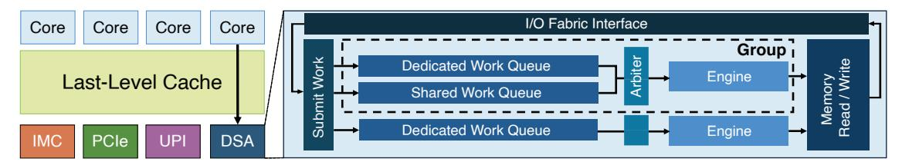

# DarkStream: Exploiting Internal Throughput Contention in Data Streaming Accelerator for Timing Attacks

Hyosang Kim *DGIST* Daegu, Republic of Korea hyosangkim@dgist.ac.kr

Ki-Dong Kang *ETRI* Daejeon, Republic of Korea kd kang@etri.re.kr

Gyeongseo Park *ETRI* Daejeon, Republic of Korea gspark@etri.re.kr

Sungju Kim *Yonsei University* Seoul, Republic of Korea sungju.kim@yonsei.ac.kr

Daehoon Kim∗ *Yonsei University* Seoul, Republic of Korea daehoonkim@yonsei.ac.kr

*Abstract*—Modern Intel processors integrate a variety of off-core accelerators to enhance data movement efficiency for memory-intensive workloads in data centers. Among them, the Data Streaming Accelerator (DSA) offloads repetitive memory operations such as copying and integrity checking to improve performance and energy efficiency. The DSA employs the group abstraction to isolate each client's work queues, engines, and arbiters, thereby aiming to prevent interference and performance degradation among concurrent tenants. Despite the isolation provided by the group abstraction, our analysis reveals that an I/O fabric interface beneath the group boundary remains shared across all clients in the DSA. As a result, this microarchitectural design can trigger performance contention among clients, leading to timing variations across them. In this paper, we present DarkStream, which exposes vulnerabilities arising from the DSA's internal throughput contention. We demonstrate that these timing differences can be exploited to construct a covert channel with a bandwidth of up to 129 Kbps and to perform website and deep learning model fingerprinting with 97.03% and 99.17% accuracy, respectively.

*Index Terms*—Data Streaming Accelerator, side-channel, fingerprinting attack.

## I. INTRODUCTION

Accelerating modern data center workloads, ranging from large-scale data processing and storage services to High-Performance Computing (HPC) and Machine Learning (ML), has become a defining challenge for today's systems. As model sizes, data intensity, and real-time processing demands continue to grow, CPU vendors have shifted from relying solely on core-resident execution units to integrating a diverse set of specialized accelerators. Intel's recent generations exemplify this trend by incorporating AMX, IAA, and the Data Streaming Accelerator (DSA), on-chip accelerators designed to handle increasingly heavy data-movement and transformation tasks that conventional CPU pipelines struggle to sustain.

The Intel DSA is a high-performance engine for bulk memory copying, transformation, and integrity operations, integrated into the 4th Generation Xeon Scalable processors. Rather than routing these operations through the CPU pipeline, DSA executes them through a dedicated off-core datapath with its own queues and engines, and I/O fabric interface. By avoiding cache pollution and eliminating per-core software overheads, DSA delivers substantial throughput gains for storage, networking, HPC, and ML applications whose performance is dominated by data movement.

However, placing accelerators off-core fundamentally changes the sharing landscape: these devices become globally visible resources accessed by processes on different cores. This shared access introduces new microarchitectural contention points, the same type of bottlenecks that have repeatedly enabled covert and side-channel attacks in prior shared units. Prior studies have shown that contention in caches, memory controllers, and interconnects, as well as variations in power consumption, can leak sensitive information or reveal private user activity [8], [10], [11], [13]–[18]. Yet the security implications of shared off-core accelerators remain almost entirely unexplored.

In this paper, we reveal that Intel DSA, a shared off-core accelerator previously regarded as a performance-only component, introduces a previously unexplored microarchitectural attack surface. The DSA assigns each client its own work queues, engines, and arbiters through the group abstraction, creating the appearance of strong isolation with no explicitly shared microarchitectural components. Such strong resource isolation not only prevents performance interference across clients but also appears to significantly limit its potential as an attack vector for covert or side-channel leakage. However, our analysis shows that this isolation does not fully prevent cross-client interaction. Although clients are assigned isolated work queues and engines, they can still influence one another through contention on a shared I/O fabric interface that lies beneath the group boundary and is used by all DSA groups. Leveraging this insight, we demonstrate that concurrent DSA

∗ Corresponding author.

TABLE I COMPARISON OF ATTACKS WITH RESPECT TO HARDWARE ISOLATION MECHANISMS.

| Channel                | Domain   | Shared Resource                  | HW Isolation | Attack under Isolation | Threat Model under Isolation                            |
|------------------------|----------|----------------------------------|--------------|------------------------|---------------------------------------------------------|
| Cache [1], [2]         | CPU      | LLC sets                         | Yes (CAT)    | Yes [3], [4]           | TLB/interconnect timing leaks despite LLC partitioning  |
| Interconnect [5], [6]  | On-chip  | Ring/Mesh NoC                    | No           | —                      | —                                                       |
| GPU [7], [8]           | GPU      | GPU NoC/GPU cache                | Yes (MIG)    | Yes [9]                | Shared TLB leaks across MIG instances                   |
| FPGA [10], [11]        | Off-chip | PCIe bus usage/Power supply unit | No           | —                      | —                                                       |
| Power-gating [12]      | On-core  | AMX power gating                 | No           | —                      | —                                                       |
| DarkStream (this work) | Off-core | I/O fabric interface             | Yes (Group)  | Yes                    | I/O fabric interface throughput beneath group isolation |

operations issued from isolated queues and engines nonetheless introduce measurable, repeatable latency variations.

Building on this observation, we design DarkStream, which exploits these contention-induced timing differences to construct both high-bandwidth covert channels and practical sidechannels. For covert channels, DarkStream modulates DSA traffic to encode bits, while a receiver decodes them by measuring resultant latency shifts. For side-channels, continuous probe requests allow DarkStream to capture latency signatures that fingerprint a victim's workload. On a Xeon Platinum 8558 system, DarkStream achieves up to 129 Kbps of covertchannel bandwidth and performs website fingerprinting and deep learning model fingerprinting with 97.03% and 99.17% accuracy, respectively, demonstrating that DSA contention is a powerful and previously overlooked source of microarchitectural leakage. To mitigate these threats, we discuss several defenses, including exclusive DSA allocation, temporal engine isolation, and performance counter–based detection, but all incur inherent performance–security trade-offs, making it challenging to fully suppress DSA-based contention channels in practice.

Our contributions are as follows:

- 1) We perform the detailed analysis of DSA's shared internal resources and uncover the precise contention points whose throughput bottlenecks give rise to a cross-client timing channel, even under the DSA's internal isolation mechanisms that assign each client a dedicated work queue and engine.
- 2) We propose DarkStream, which leverages contentioninduced copying-latency variations within the DSA to construct a robust covert channel, and we show through real-system experiments that it achieves up to 129 Kbps of bandwidth.
- 3) We demonstrate practical side-channel leakage through DSA contention, achieving 97.03% and 99.17% accuracy in website and deep learning model fingerprinting, respectively, and establishing off-core accelerators as a new class of security-critical components.

Table I compares DarkStream among prior attacks. Notably, hardware isolation mechanisms such as Cache Allocation Technology (CAT) and Multi-Instance GPU (MIG) have been introduced to partition shared resources in the CPU and GPU domains, respectively. However, subsequent studies have demonstrated that these mechanisms leave certain internal resources unprotected: TLBleed [3] and MeshUp [4] showed that CAT's LLC partitioning does not cover TLB and mesh interconnect timing; and TunneLs for Bootlegging [9] showed that MIG does not partition the shared GPU TLB. In each case, identifying a shared resource outside the isolation boundary constituted a significant contribution. DarkStream extends this line of inquiry to off-core accelerators: DSA's group isolation partitions work queues, engines, and arbiters, yet the I/O fabric interface throughput beneath this boundary remains shared across all clients.

#### II. BACKGROUND

#### *A. Intel Data Streaming Accelerator*

The continuous advancement of semiconductor technology has brought significant changes to CPU architecture, notably the integration of specialized accelerators designed to improve performance and efficiency. These advancements are particularly important for supporting HPC and ML workloads. One notable advancement in this field is the Intel DSA, introduced in the 4th Generation Intel Xeon Scalable Processors (previously called Sapphire Rapids). DSA addresses the growing demands for efficient data movement and transformation in modern data centers.

In traditional server systems, repetitive and memoryintensive tasks (*e.g.,* memory copying, hashing, and data integrity checks) consume a significant amount of CPU cycles. These tasks decrease the computational resources available for primary application workloads. To alleviate this, offloading these tasks to dedicated hardware accelerators has become a crucial strategy. DSA accelerates these data-related tasks, offering a range of functions such as memory copying, Cyclic Redundancy Check (CRC) calculation, delta record creation/merge, and Data Integrity Field (DIF) operations.

Figure 1 plots an overview of DSA hardware architecture. As shown on the left side of Figure 1, DSA is located outside the core area to offload memory-related tasks and is a hardware resource shared by multiple cores. As shown on the right side of Figure 1, DSA primarily comprises work queues (WQs) and processing engines, which are organized into groups where each group consists of one or more queues and engines. The WQs receive requests from clients via the I/O fabric interface, which are submitted in the form of work descriptors to offload memory-related operations. The per-group arbiter then dispatches descriptors from the WQs to the processing engines, which sequentially execute them and perform corresponding read/write operations on the main memory via the I/O fabric interface. The DSA supports two types of WQs: dedicated and shared. A dedicated work queue (DWQ) can be used exclusively by a single client, while a shared work queue (SWQ) allows multiple clients to concurrently submit tasks.

Fig. 1. The overview of DSA hardware.

By configuring the queue type and grouping strategy, system administrators can achieve for either high resource utilization or performance isolation, depending on the requirements.

## *B. Covert and Side-channels*

In computer security, a covert channel represents a method of transmitting information that violates the system's security policy. Unlike explicit communication channels intended for legitimate data exchange, covert channels abuse shared system resources to secretly transfer information between entities that are not supposed to communicate. When isolated processes exploit such mechanisms, they can leak information across isolation boundaries, undermining system isolation. These channels pose a significant threat, as they can leak crucial information from data centers, including corporate secrets, financial data, encryption keys, and other sensitive information.

In contrast to covert channels that require active coordination between two parties, a side-channel attack targets an unsuspecting victim whose normal use of shared resources unintentionally exposes information. Rather than directly compromising system defenses, the attacker observes externally measurable behaviors to infer sensitive details about the victim's operations or data being processed.

Various shared system resources can act as potential media for covert or side-channel communication. Depending on the architectural layer involved, such channels have been demonstrated across diverse components — including shared caches [19]–[23], non-volatile memories [17], [24], interconnects [4]–[6], [8], [25], and even power and frequency management units [26]–[30]. In essence, any resource that is concurrently accessible by multiple processes and exhibits data-dependent performance variability can become a conduit for information flow, whether intentional or not.

# DarkStream: Exploiting Internal Throughput Contention in Data Streaming Accelerator for Timing Attacks

Hyosang Kim *DGIST* Daegu, Republic of Korea hyosangkim@dgist.ac.kr

Ki-Dong Kang *ETRI* Daejeon, Republic of Korea kd kang@etri.re.kr

Gyeongseo Park *ETRI* Daejeon, Republic of Korea gspark@etri.re.kr

Sungju Kim *Yonsei University* Seoul, Republic of Korea sungju.kim@yonsei.ac.kr

Daehoon Kim∗ *Yonsei University* Seoul, Republic of Korea daehoonkim@yonsei.ac.kr

*Abstract*—Modern Intel processors integrate a variety of off-core accelerators to enhance data movement efficiency for memory-intensive workloads in data centers. Among them, the Data Streaming Accelerator (DSA) offloads repetitive memory operations such as copying and integrity checking to improve performance and energy efficiency. The DSA employs the group abstraction to isolate each client's work queues, engines, and arbiters, thereby aiming to prevent interference and performance degradation among concurrent tenants. Despite the isolation provided by the group abstraction, our analysis reveals that an I/O fabric interface beneath the group boundary remains shared across all clients in the DSA. As a result, this microarchitectural design can trigger performance contention among clients, leading to timing variations across them. In this paper, we present DarkStream, which exposes vulnerabilities arising from the DSA's internal throughput contention. We demonstrate that these timing differences can be exploited to construct a covert channel with a bandwidth of up to 129 Kbps and to perform website and deep learning model fingerprinting with 97.03% and 99.17% accuracy, respectively.

*Index Terms*—Data Streaming Accelerator, side-channel, fingerprinting attack.

## I. INTRODUCTION

Accelerating modern data center workloads, ranging from large-scale data processing and storage services to High-Performance Computing (HPC) and Machine Learning (ML), has become a defining challenge for today's systems. As model sizes, data intensity, and real-time processing demands continue to grow, CPU vendors have shifted from relying solely on core-resident execution units to integrating a diverse set of specialized accelerators. Intel's recent generations exemplify this trend by incorporating AMX, IAA, and the Data Streaming Accelerator (DSA), on-chip accelerators designed to handle increasingly heavy data-movement and transformation tasks that conventional CPU pipelines struggle to sustain.

The Intel DSA is a high-performance engine for bulk memory copying, transformation, and integrity operations, integrated into the 4th Generation Xeon Scalable processors. Rather than routing these operations through the CPU pipeline, DSA executes them through a dedicated off-core datapath with its own queues and engines, and I/O fabric interface. By avoiding cache pollution and eliminating per-core software overheads, DSA delivers substantial throughput gains for storage, networking, HPC, and ML applications whose performance is dominated by data movement.

However, placing accelerators off-core fundamentally changes the sharing landscape: these devices become globally visible resources accessed by processes on different cores. This shared access introduces new microarchitectural contention points, the same type of bottlenecks that have repeatedly enabled covert and side-channel attacks in prior shared units. Prior studies have shown that contention in caches, memory controllers, and interconnects, as well as variations in power consumption, can leak sensitive information or reveal private user activity [8], [10], [11], [13]–[18]. Yet the security implications of shared off-core accelerators remain almost entirely unexplored.

In this paper, we reveal that Intel DSA, a shared off-core accelerator previously regarded as a performance-only component, introduces a previously unexplored microarchitectural attack surface. The DSA assigns each client its own work queues, engines, and arbiters through the group abstraction, creating the appearance of strong isolation with no explicitly shared microarchitectural components. Such strong resource isolation not only prevents performance interference across clients but also appears to significantly limit its potential as an attack vector for covert or side-channel leakage. However, our analysis shows that this isolation does not fully prevent cross-client interaction. Although clients are assigned isolated work queues and engines, they can still influence one another through contention on a shared I/O fabric interface that lies beneath the group boundary and is used by all DSA groups. Leveraging this insight, we demonstrate that concurrent DSA

∗ Corresponding author.

TABLE I COMPARISON OF ATTACKS WITH RESPECT TO HARDWARE ISOLATION MECHANISMS.

| Channel                | Domain   | Shared Resource                  | HW Isolation | Attack under Isolation | Threat Model under Isolation                            |
|------------------------|----------|----------------------------------|--------------|------------------------|---------------------------------------------------------|
| Cache [1], [2]         | CPU      | LLC sets                         | Yes (CAT)    | Yes [3], [4]           | TLB/interconnect timing leaks despite LLC partitioning  |
| Interconnect [5], [6]  | On-chip  | Ring/Mesh NoC                    | No           | —                      | —                                                       |
| GPU [7], [8]           | GPU      | GPU NoC/GPU cache                | Yes (MIG)    | Yes [9]                | Shared TLB leaks across MIG instances                   |
| FPGA [10], [11]        | Off-chip | PCIe bus usage/Power supply unit | No           | —                      | —                                                       |
| Power-gating [12]      | On-core  | AMX power gating                 | No           | —                      | —                                                       |
| DarkStream (this work) | Off-core | I/O fabric interface             | Yes (Group)  | Yes                    | I/O fabric interface throughput beneath group isolation |

operations issued from isolated queues and engines nonetheless introduce measurable, repeatable latency variations.

Building on this observation, we design DarkStream, which exploits these contention-induced timing differences to construct both high-bandwidth covert channels and practical sidechannels. For covert channels, DarkStream modulates DSA traffic to encode bits, while a receiver decodes them by measuring resultant latency shifts. For side-channels, continuous probe requests allow DarkStream to capture latency signatures that fingerprint a victim's workload. On a Xeon Platinum 8558 system, DarkStream achieves up to 129 Kbps of covertchannel bandwidth and performs website fingerprinting and deep learning model fingerprinting with 97.03% and 99.17% accuracy, respectively, demonstrating that DSA contention is a powerful and previously overlooked source of microarchitectural leakage. To mitigate these threats, we discuss several defenses, including exclusive DSA allocation, temporal engine isolation, and performance counter–based detection, but all incur inherent performance–security trade-offs, making it challenging to fully suppress DSA-based contention channels in practice.

Our contributions are as follows:

- 1) We perform the detailed analysis of DSA's shared internal resources and uncover the precise contention points whose throughput bottlenecks give rise to a cross-client timing channel, even under the DSA's internal isolation mechanisms that assign each client a dedicated work queue and engine.
- 2) We propose DarkStream, which leverages contentioninduced copying-latency variations within the DSA to construct a robust covert channel, and we show through real-system experiments that it achieves up to 129 Kbps of bandwidth.
- 3) We demonstrate practical side-channel leakage through DSA contention, achieving 97.03% and 99.17% accuracy in website and deep learning model fingerprinting, respectively, and establishing off-core accelerators as a new class of security-critical components.

Table I compares DarkStream among prior attacks. Notably, hardware isolation mechanisms such as Cache Allocation Technology (CAT) and Multi-Instance GPU (MIG) have been introduced to partition shared resources in the CPU and GPU domains, respectively. However, subsequent studies have demonstrated that these mechanisms leave certain internal resources unprotected: TLBleed [3] and MeshUp [4] showed that CAT's LLC partitioning does not cover TLB and mesh interconnect timing; and TunneLs for Bootlegging [9] showed that MIG does not partition the shared GPU TLB. In each case, identifying a shared resource outside the isolation boundary constituted a significant contribution. DarkStream extends this line of inquiry to off-core accelerators: DSA's group isolation partitions work queues, engines, and arbiters, yet the I/O fabric interface throughput beneath this boundary remains shared across all clients.

#### II. BACKGROUND

#### *A. Intel Data Streaming Accelerator*

The continuous advancement of semiconductor technology has brought significant changes to CPU architecture, notably the integration of specialized accelerators designed to improve performance and efficiency. These advancements are particularly important for supporting HPC and ML workloads. One notable advancement in this field is the Intel DSA, introduced in the 4th Generation Intel Xeon Scalable Processors (previously called Sapphire Rapids). DSA addresses the growing demands for efficient data movement and transformation in modern data centers.

In traditional server systems, repetitive and memoryintensive tasks (*e.g.,* memory copying, hashing, and data integrity checks) consume a significant amount of CPU cycles. These tasks decrease the computational resources available for primary application workloads. To alleviate this, offloading these tasks to dedicated hardware accelerators has become a crucial strategy. DSA accelerates these data-related tasks, offering a range of functions such as memory copying, Cyclic Redundancy Check (CRC) calculation, delta record creation/merge, and Data Integrity Field (DIF) operations.

Figure 1 plots an overview of DSA hardware architecture. As shown on the left side of Figure 1, DSA is located outside the core area to offload memory-related tasks and is a hardware resource shared by multiple cores. As shown on the right side of Figure 1, DSA primarily comprises work queues (WQs) and processing engines, which are organized into groups where each group consists of one or more queues and engines. The WQs receive requests from clients via the I/O fabric interface, which are submitted in the form of work descriptors to offload memory-related operations. The per-group arbiter then dispatches descriptors from the WQs to the processing engines, which sequentially execute them and perform corresponding read/write operations on the main memory via the I/O fabric interface. The DSA supports two types of WQs: dedicated and shared. A dedicated work queue (DWQ) can be used exclusively by a single client, while a shared work queue (SWQ) allows multiple clients to concurrently submit tasks.

Fig. 1. The overview of DSA hardware.

By configuring the queue type and grouping strategy, system administrators can achieve for either high resource utilization or performance isolation, depending on the requirements.

## *B. Covert and Side-channels*

In computer security, a covert channel represents a method of transmitting information that violates the system's security policy. Unlike explicit communication channels intended for legitimate data exchange, covert channels abuse shared system resources to secretly transfer information between entities that are not supposed to communicate. When isolated processes exploit such mechanisms, they can leak information across isolation boundaries, undermining system isolation. These channels pose a significant threat, as they can leak crucial information from data centers, including corporate secrets, financial data, encryption keys, and other sensitive information.

In contrast to covert channels that require active coordination between two parties, a side-channel attack targets an unsuspecting victim whose normal use of shared resources unintentionally exposes information. Rather than directly compromising system defenses, the attacker observes externally measurable behaviors to infer sensitive details about the victim's operations or data being processed.

Various shared system resources can act as potential media for covert or side-channel communication. Depending on the architectural layer involved, such channels have been demonstrated across diverse components — including shared caches [19]–[23], non-volatile memories [17], [24], interconnects [4]–[6], [8], [25], and even power and frequency management units [26]–[30]. In essence, any resource that is concurrently accessible by multiple processes and exhibits data-dependent performance variability can become a conduit for information flow, whether intentional or not.

