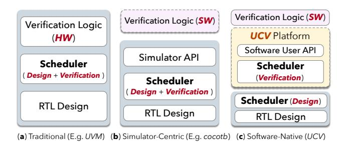
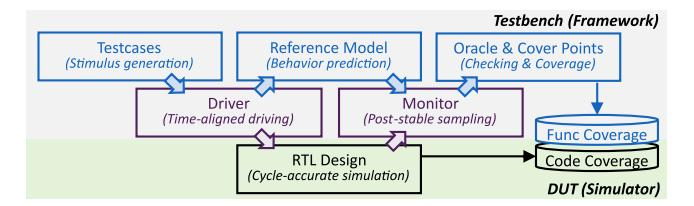

# Democratizing and Accelerating Hardware Verification with Software-Native Optimization

Yunlong Xie1,2, Zhicheng Yao1, Fangyuan Song1, Jincheng Liu1,2, Junyue Wang1,2, Haojin Tang1,2, Lu Chen1,2 Yinan Xu1, Ziqing Zhang1,2, Ziyuan Gao1,2, Duan Yu3, Ḥongtao Zhou3, Jiayi Rao1,2, Junyu Yue1,2, Xiaolong Li1,2 Yunqi Lu1,2, Zechen Yang1,2, Hang Zhu1, Shan Liu3, Xu An3, Qi Ge3, Jiuyue Ma3, Jianyi Meng3, Kan Shi1,2 Dan Tang3, Tianyi Liu1, Sa Wang1,2, Yungang Bao1,2

1State Key Lab of Processors, Institute of Computing Technology, Chinese Academy of Sciences 2University of Chinese Academy of Sciences, 3Beijing Institute of Open Source Chip Emails: xieyunlong22@mails.ucas.ac.cn, {yaozhicheng, wangsa, baoyg}@ict.ac.cn

Abstract—Hardware verification accounts for a substantial portion of chip development effort, and improving its efficiency remains an ongoing challenge. Traditional hardware verification emphasizes reuse of verification assets, while emerging software-based frameworks embed verification in general-purpose programming languages to improve usability and attract a broader range of developers. However, these frameworks remain simulator-centric, relying heavily on simulator-controlled timing, transaction lifecycles, and observability, which limits further democratization and acceleration of verification.

We present UnityChip Verification (UCV), a software-native verification platform that recenters event scheduling and control within an explicit software event loop while treating simulators as pluggable backends. UCV identifies and addresses three key challenges: the programming paradigm gap between software and hardware timing, the difficulty of composing established verification components, and the performance-debuggability tradeoff. Evaluation on XiangShan and RocketChip shows that UCV improves both acceleration and democratization. UCV delivers up to 25× faster runtime and 76% lower memory usage than Cocotb, and achieves 16.6% higher throughput when reusing existing components. In community deployments, newcomers with software backgrounds contributed meaningful verification artifacts, with 26.3% producing runnable tests and 11 collectively uncovering 30 previously unknown bugs, indicating that UCV significantly lowers the entry barrier and broadens participation.

#### I. INTRODUCTION

Hardware verification is critical in chip development, accounting for approximately 70% of project timelines [40]. In CPU design, verification engineers often outnumber designers and can reach 5:1. The high demand for verification drives research on methodology and tooling that improve efficiency.

A large body of prior work has focused on improving the reusability of verification assets such as testbenches and reference models, motivating several widely adopted standards. Universal Verification Methodology (UVM) [1], the predominant framework for reusable testbenches, extends SystemVerilog [3] with standardized components such as drivers, monitors, and scoreboards. Similarly, SystemC [2] extends C++ with features for building and integrating executable reference models, supporting early system-level validation.

Fig. 1: Comparison of different verification architecture.

In practice, these environments are typically built around hardware description languages (HDL) and RTL simulators, forming the conventional verification architecture in Fig. 1(a).

Another line of work, illustrated in Fig. 1(b), aims to lower the barrier to constructing verification environments by *decoupling the verification programming language* from traditional verification languages such as SystemVerilog. Tools such as Cocotb [37], PyMTL [29], Fault [44], and ChiselTest [35] embed verification in general-purpose programming languages (e.g., Python and Scala), allowing testbenches, checkers, and reference models to be written in an easier-to-use style. Through language bindings and high-level APIs, these frameworks leverage rich software ecosystems to improve developer productivity, enabling a wider range of contributors to engage in hardware verification [19].

However, despite this language-level decoupling, current frameworks remain fundamentally simulator-centric. Timing, transaction lifecycles, and observability are still managed inside the simulator, while software-side logic is often limited to coarse cycle stepping or opaque boundary callbacks. As a result, verification logic remains tightly coupled to simulator capabilities and control flow, which limits how naturally broader groups of developers can contribute. Motivated by recent perspectives on broadening participation in hardware development [26], [32], this paper aims to further democratize and accelerate hardware verification. We identify three key challenges on the path forward.

- O Programming paradigm gap. Hardware follows a clocked event-driven timing model [3], whereas software executes sequentially with no native notion of clock. Bridging this gap requires a mechanism that is both *expressive* and *timing-correct*. Existing mechanisms based on the simulator execution primitives satisfy only one side. Cycle-accurate *step-peek* (e.g., PyMTL, ChiselTest) offers predictable, synchronous semantics but restricts interaction to coarse cycle boundaries, limiting the ability to express asynchronous or mid-cycle behavior. *Callback-driven* mechanism in Cocotb expands expressiveness, yet delegates callback timing to the simulator, which may resume the software coroutine before signals stabilize and yield transient or stale observations. We demonstrate such a case in cocotb (Issue#3110 [20]) and analyze the underlying timing mismatch in §III-A.
- **Omposability of existing verification components.** Existing verification assets from the traditional hardware verification ecosystem are well established and widely adopted in industrial practice across a broad range of designs. However, these components are coupled with RTL simulator, rely on their event-driven control flow and transaction-based data transfer, whereas software-based frameworks assume that all verification logic executes entirely in software and therefore lack such mechanisms. Reusing existing verification components in such environments consequently introduces two key requirements: event synchronization for execution alignment and transaction scheduling for data interaction. This challenge is further discussed in §III-B.
- **©** Performance and debuggability trade-off. As design complexity increases, both simulation speed and observability demands grow. However, these goals conflict in simulator provided interface(e.g., DPI/VPI). High-performance simulators optimize performance by merging computation flows and reducing intermediate states [8], [12], [42], [46], [53]. Enabling debugging requires inserting debug code and tracking intermediate states, which counters performance. For example, even the state-of-the-art simulator Verilator, enabling VPI debugging, results in a 70% performance loss and doubles the program size. We present a detailed analysis of this challenge in §III-C.

To address these challenges, we argue that verification execution should be decoupled from the simulator runtime, allowing verification logic to evolve independently of simulator-driven control flow. Guided by this principle, we propose UNITYCHIP VERIFICATION (UCV), a software-native verification platform that provides native software interface for verification scheduling and design-state access, rather than relying on simulator-provided mechanisms. As illustrated in Fig. 1(c), UCV exposes software-friendly native APIs for verification scheduling and design-state access, allowing upper-layer verification logic to operate through explicit software interfaces instead of simulator-driven callbacks or cycle stepping. At the same time, RTL simulators remain fully compatible with this architecture, serving simply as pluggable backends responsible for executing the hardware design.

Accordingly, the UCV platform implements a software-

TABLE I: Verification Functionality and Performance

|               | SW-native Packaging | Event-driven Verification | HW VIPs | Debugger | Speed         |
|---------------|------------------------|------------------------------|------------|----------|---------------|
| UVM [21]      | ×                      | V                            | ~          | V        | *             |
| Fault [44]    | W.                     | ×                            | X          | ×        | <b>→</b>      |
| ChiselTest [3 | 35] 🗸                  | ×                            | ×          | X        | $\rightarrow$ |
| PyMTL [29]    | V                      | ×                            | ×          | X        | ×             |
| Cocotb [37]   | W.                     | N.                           | X          | <b>~</b> | <b>S</b>      |
| UCV           | <b>~</b>               | <b>~</b>                     | <b>V</b>   | <b>V</b> | ×             |
|               |                        | ial support 🗶: no            |            | ort      |               |
| ✓: fast       | →: med                 | ium 🥦 sl                     | ow         |          |               |

native architecture in which timing management, cross-domain coordination, and observability are managed by the platform rather than by the simulator. We realize this through three key techniques.

- ① Software-native timing and interaction. We introduce a software-native timing model that provides event-level expressiveness while guaranteeing cycle-accurate, clock-aligned semantics for software testbenches across backend simulators. With this model, RTL designs behave as software packages containing asynchronous logic, further enabling the direct use of software testing frameworks, thereby bridging hardware verification with modern software ecosystems.
- ② Transparent hardware-software mapping. We design a cross-domain synchronize mechanism that lifts hardware components instantiated in the simulator into managed software objects with preserved scheduling, enabling direct reuse of existing components from software-native verification.
- ③ Non-intrusive introspection method. We implement introspection and debugging at a software-native layer, where stable low-level pointer hooks enable on-demand computation of debugging signals directly from states within the optimized circuit, avoiding the creation of intermediate states and preserving performance.

UCV organizes these mechanisms into a software-native, event-driven verification workflow that is independent of any specific software language. With UCV, users (i) encapsulate RTL designs into language-native software packages that can be imported and versioned like ordinary dependencies, (ii) register these packages to the language's asynchronous event runtime, exposing the design as a software object with explicit, cycle-accurate event operations, and (iii) write and run tests using existing testing frameworks (e.g., pytest, JUnit). This workflow preserves cycle-accurate behavior within backend simulators while allowing developers to verify hardware using familiar software testing practices. As shown in Table I, UCV is the first hardware verification framework that jointly provides software-native packaging, event-driven software timing, direct reuse of HDL verification IP, and low-overhead debugging and hot patching while retaining fast simulation.

We evaluate UCV through both community deployments and performance measurements on XiangShan [48] and RocketChip [7]. In a six-month community study around XiangShan, the UCV community has attracted 520 interested followers, of whom 95 (18.3%) enroll as contributors. Among

these contributors, 25 (26.3%) produce runnable test cases, and 11 of them collectively uncover 30 previously unknown bugs in XiangShan, an industrial-grade CPU already validated for tapeout by multiple companies. Notably, 5 undergraduates with software backgrounds confirm 10 branch-prediction bugs within 2 months, whereas an experienced hardware engineer require up to 5 months to identify 2 comparable bugs. In terms of acceleration, UCV preserves internal signal visibility while achieving up to 25× runtime speedup and 76% lower peak memory usage compared to Cocotb. When reusing existing verification components, it maintains low integration overhead, yielding 16.6% higher verification throughput and 12% fewer verification lines of code (LOC) than manual signal-relay schemes. Overall, UCV lowers the entry barrier for broadening participation and accelerates hardware verification.

To summarize, this paper makes the following contributions:

- UCV platform. We develop UNITYCHIP VERIFICATION (UCV), an open-source software-native verification platform1 that packages RTL design as pluggable backend packages and exposes a uniform interface to mainstream languages and testing frameworks.
- Software-native mechanisms. We formulate and realize a software-native verification architecture that recenters control on an explicit software event loop outside of the simulator, providing a common basis for timing alignment, VIP composition, and non-intrusive introspection.
- Acceleration and democratization. We evaluate UCV on open-source processors and in community deployments, and show that this architecture jointly improves performance, composability, and sustained participation from software developers.

## II. BACKGROUND

#### *A. Simulation-Based Verification*

Hardware verification determines whether the design under test (DUT) conforms to its specification. A standard simulation based testbench contains test logic for stimulus and checking, and interface logic that connects DUT. (Fig. 2) [10], [34]

On the test logic side, the testbench instantiates *testcases* that generate stimuli, a *reference model* (RM) that predicts expected behavior, and an *oracle & cover points* block that performs checking and functional coverage collection. The oracle typically combines assertions, checkers, and a scoreboard that compares the DUT with RM to decide pass or fail. Functional coverage complements code coverage from the simulator and guides regression.

On the interface logic side that connects the testbench to the DUT. A *driver* performs *time-aligned driving*: it translates stimulus (often in the form of abstract transactions) into signal-level waveforms and assigns them precisely so they are sampled correctly by the cycle-accurate RTL simulation. A *monitor* performs *post-stable sampling*: it observes signal values only after they settle for a given cycle and reconstructs higher-level transactions for the RM, oracle, and coverage.

1https://github.com/XS-MLVP/picker

Fig. 2: Simulation-based Verification Workflow.

Given that components like stimulus generators, drivers, monitors, and RM are common across many similar designs, *Verification Intellectual Property* (VIP) [43] encapsulates these reusable testbench-side components. A typical VIP bundles some of these components and is implemented within HDL verification frameworks, allowing testbenches to reuse rather than reimplement them.

#### *B. Timing Discipline for Testbench-Simulator Interaction*

Cycle-accurate simulation models digital logic in an eventdriven flow that alternates between combinational computation and state updates at clock edges. Mainstream simulators realize this using event phases that include value changes, zerodelay propagation to a stable state (often via delta cycles for convergence) [10], and sampling/commit at clock edges.

Traditional HDL testbenchs such as UVM are scheduled around these phases. Stimuli that affect sequential logic must be driven before the sampling edge, and observations of updated state become valid only after propagation settles. For example, in a request-acknowledge handshake, the driver asserts req before the rising edge; the DUT samples it at the edge; the monitor observes a stable ack only after propagation. This timing discipline determines when drivers and monitors place their read/write, and HDL testbenches generally depend on the simulator's scheduling to enforce it.

# Democratizing and Accelerating Hardware Verification with Software-Native Optimization

Yunlong Xie1,2, Zhicheng Yao1, Fangyuan Song1, Jincheng Liu1,2, Junyue Wang1,2, Haojin Tang1,2, Lu Chen1,2 Yinan Xu1, Ziqing Zhang1,2, Ziyuan Gao1,2, Duan Yu3, Ḥongtao Zhou3, Jiayi Rao1,2, Junyu Yue1,2, Xiaolong Li1,2 Yunqi Lu1,2, Zechen Yang1,2, Hang Zhu1, Shan Liu3, Xu An3, Qi Ge3, Jiuyue Ma3, Jianyi Meng3, Kan Shi1,2 Dan Tang3, Tianyi Liu1, Sa Wang1,2, Yungang Bao1,2

1State Key Lab of Processors, Institute of Computing Technology, Chinese Academy of Sciences 2University of Chinese Academy of Sciences, 3Beijing Institute of Open Source Chip Emails: xieyunlong22@mails.ucas.ac.cn, {yaozhicheng, wangsa, baoyg}@ict.ac.cn

Abstract—Hardware verification accounts for a substantial portion of chip development effort, and improving its efficiency remains an ongoing challenge. Traditional hardware verification emphasizes reuse of verification assets, while emerging software-based frameworks embed verification in general-purpose programming languages to improve usability and attract a broader range of developers. However, these frameworks remain simulator-centric, relying heavily on simulator-controlled timing, transaction lifecycles, and observability, which limits further democratization and acceleration of verification.

We present UnityChip Verification (UCV), a software-native verification platform that recenters event scheduling and control within an explicit software event loop while treating simulators as pluggable backends. UCV identifies and addresses three key challenges: the programming paradigm gap between software and hardware timing, the difficulty of composing established verification components, and the performance-debuggability tradeoff. Evaluation on XiangShan and RocketChip shows that UCV improves both acceleration and democratization. UCV delivers up to 25× faster runtime and 76% lower memory usage than Cocotb, and achieves 16.6% higher throughput when reusing existing components. In community deployments, newcomers with software backgrounds contributed meaningful verification artifacts, with 26.3% producing runnable tests and 11 collectively uncovering 30 previously unknown bugs, indicating that UCV significantly lowers the entry barrier and broadens participation.

#### I. INTRODUCTION

Hardware verification is critical in chip development, accounting for approximately 70% of project timelines [40]. In CPU design, verification engineers often outnumber designers and can reach 5:1. The high demand for verification drives research on methodology and tooling that improve efficiency.

A large body of prior work has focused on improving the reusability of verification assets such as testbenches and reference models, motivating several widely adopted standards. Universal Verification Methodology (UVM) [1], the predominant framework for reusable testbenches, extends SystemVerilog [3] with standardized components such as drivers, monitors, and scoreboards. Similarly, SystemC [2] extends C++ with features for building and integrating executable reference models, supporting early system-level validation.

Fig. 1: Comparison of different verification architecture.

In practice, these environments are typically built around hardware description languages (HDL) and RTL simulators, forming the conventional verification architecture in Fig. 1(a).

Another line of work, illustrated in Fig. 1(b), aims to lower the barrier to constructing verification environments by *decoupling the verification programming language* from traditional verification languages such as SystemVerilog. Tools such as Cocotb [37], PyMTL [29], Fault [44], and ChiselTest [35] embed verification in general-purpose programming languages (e.g., Python and Scala), allowing testbenches, checkers, and reference models to be written in an easier-to-use style. Through language bindings and high-level APIs, these frameworks leverage rich software ecosystems to improve developer productivity, enabling a wider range of contributors to engage in hardware verification [19].

However, despite this language-level decoupling, current frameworks remain fundamentally simulator-centric. Timing, transaction lifecycles, and observability are still managed inside the simulator, while software-side logic is often limited to coarse cycle stepping or opaque boundary callbacks. As a result, verification logic remains tightly coupled to simulator capabilities and control flow, which limits how naturally broader groups of developers can contribute. Motivated by recent perspectives on broadening participation in hardware development [26], [32], this paper aims to further democratize and accelerate hardware verification. We identify three key challenges on the path forward.

- O Programming paradigm gap. Hardware follows a clocked event-driven timing model [3], whereas software executes sequentially with no native notion of clock. Bridging this gap requires a mechanism that is both *expressive* and *timing-correct*. Existing mechanisms based on the simulator execution primitives satisfy only one side. Cycle-accurate *step-peek* (e.g., PyMTL, ChiselTest) offers predictable, synchronous semantics but restricts interaction to coarse cycle boundaries, limiting the ability to express asynchronous or mid-cycle behavior. *Callback-driven* mechanism in Cocotb expands expressiveness, yet delegates callback timing to the simulator, which may resume the software coroutine before signals stabilize and yield transient or stale observations. We demonstrate such a case in cocotb (Issue#3110 [20]) and analyze the underlying timing mismatch in §III-A.
- **Omposability of existing verification components.** Existing verification assets from the traditional hardware verification ecosystem are well established and widely adopted in industrial practice across a broad range of designs. However, these components are coupled with RTL simulator, rely on their event-driven control flow and transaction-based data transfer, whereas software-based frameworks assume that all verification logic executes entirely in software and therefore lack such mechanisms. Reusing existing verification components in such environments consequently introduces two key requirements: event synchronization for execution alignment and transaction scheduling for data interaction. This challenge is further discussed in §III-B.
- **©** Performance and debuggability trade-off. As design complexity increases, both simulation speed and observability demands grow. However, these goals conflict in simulator provided interface(e.g., DPI/VPI). High-performance simulators optimize performance by merging computation flows and reducing intermediate states [8], [12], [42], [46], [53]. Enabling debugging requires inserting debug code and tracking intermediate states, which counters performance. For example, even the state-of-the-art simulator Verilator, enabling VPI debugging, results in a 70% performance loss and doubles the program size. We present a detailed analysis of this challenge in §III-C.

To address these challenges, we argue that verification execution should be decoupled from the simulator runtime, allowing verification logic to evolve independently of simulator-driven control flow. Guided by this principle, we propose UNITYCHIP VERIFICATION (UCV), a software-native verification platform that provides native software interface for verification scheduling and design-state access, rather than relying on simulator-provided mechanisms. As illustrated in Fig. 1(c), UCV exposes software-friendly native APIs for verification scheduling and design-state access, allowing upper-layer verification logic to operate through explicit software interfaces instead of simulator-driven callbacks or cycle stepping. At the same time, RTL simulators remain fully compatible with this architecture, serving simply as pluggable backends responsible for executing the hardware design.

Accordingly, the UCV platform implements a software-

TABLE I: Verification Functionality and Performance

|               | SW-native Packaging | Event-driven Verification | HW VIPs | Debugger | Speed         |
|---------------|------------------------|------------------------------|------------|----------|---------------|
| UVM [21]      | ×                      | V                            | ~          | V        | *             |
| Fault [44]    | W.                     | ×                            | X          | ×        | <b>→</b>      |
| ChiselTest [3 | 35] 🗸                  | ×                            | ×          | X        | $\rightarrow$ |
| PyMTL [29]    | V                      | ×                            | ×          | X        | ×             |
| Cocotb [37]   | W.                     | N.                           | X          | <b>~</b> | <b>S</b>      |
| UCV           | <b>~</b>               | <b>~</b>                     | <b>V</b>   | <b>V</b> | ×             |
|               |                        | ial support 🗶: no            |            | ort      |               |
| ✓: fast       | →: med                 | ium 🥦 sl                     | ow         |          |               |

native architecture in which timing management, cross-domain coordination, and observability are managed by the platform rather than by the simulator. We realize this through three key techniques.

- ① Software-native timing and interaction. We introduce a software-native timing model that provides event-level expressiveness while guaranteeing cycle-accurate, clock-aligned semantics for software testbenches across backend simulators. With this model, RTL designs behave as software packages containing asynchronous logic, further enabling the direct use of software testing frameworks, thereby bridging hardware verification with modern software ecosystems.
- ② Transparent hardware-software mapping. We design a cross-domain synchronize mechanism that lifts hardware components instantiated in the simulator into managed software objects with preserved scheduling, enabling direct reuse of existing components from software-native verification.
- ③ Non-intrusive introspection method. We implement introspection and debugging at a software-native layer, where stable low-level pointer hooks enable on-demand computation of debugging signals directly from states within the optimized circuit, avoiding the creation of intermediate states and preserving performance.

UCV organizes these mechanisms into a software-native, event-driven verification workflow that is independent of any specific software language. With UCV, users (i) encapsulate RTL designs into language-native software packages that can be imported and versioned like ordinary dependencies, (ii) register these packages to the language's asynchronous event runtime, exposing the design as a software object with explicit, cycle-accurate event operations, and (iii) write and run tests using existing testing frameworks (e.g., pytest, JUnit). This workflow preserves cycle-accurate behavior within backend simulators while allowing developers to verify hardware using familiar software testing practices. As shown in Table I, UCV is the first hardware verification framework that jointly provides software-native packaging, event-driven software timing, direct reuse of HDL verification IP, and low-overhead debugging and hot patching while retaining fast simulation.

We evaluate UCV through both community deployments and performance measurements on XiangShan [48] and RocketChip [7]. In a six-month community study around XiangShan, the UCV community has attracted 520 interested followers, of whom 95 (18.3%) enroll as contributors. Among

these contributors, 25 (26.3%) produce runnable test cases, and 11 of them collectively uncover 30 previously unknown bugs in XiangShan, an industrial-grade CPU already validated for tapeout by multiple companies. Notably, 5 undergraduates with software backgrounds confirm 10 branch-prediction bugs within 2 months, whereas an experienced hardware engineer require up to 5 months to identify 2 comparable bugs. In terms of acceleration, UCV preserves internal signal visibility while achieving up to 25× runtime speedup and 76% lower peak memory usage compared to Cocotb. When reusing existing verification components, it maintains low integration overhead, yielding 16.6% higher verification throughput and 12% fewer verification lines of code (LOC) than manual signal-relay schemes. Overall, UCV lowers the entry barrier for broadening participation and accelerates hardware verification.

To summarize, this paper makes the following contributions:

- UCV platform. We develop UNITYCHIP VERIFICATION (UCV), an open-source software-native verification platform1 that packages RTL design as pluggable backend packages and exposes a uniform interface to mainstream languages and testing frameworks.
- Software-native mechanisms. We formulate and realize a software-native verification architecture that recenters control on an explicit software event loop outside of the simulator, providing a common basis for timing alignment, VIP composition, and non-intrusive introspection.
- Acceleration and democratization. We evaluate UCV on open-source processors and in community deployments, and show that this architecture jointly improves performance, composability, and sustained participation from software developers.

## II. BACKGROUND

#### *A. Simulation-Based Verification*

Hardware verification determines whether the design under test (DUT) conforms to its specification. A standard simulation based testbench contains test logic for stimulus and checking, and interface logic that connects DUT. (Fig. 2) [10], [34]

On the test logic side, the testbench instantiates *testcases* that generate stimuli, a *reference model* (RM) that predicts expected behavior, and an *oracle & cover points* block that performs checking and functional coverage collection. The oracle typically combines assertions, checkers, and a scoreboard that compares the DUT with RM to decide pass or fail. Functional coverage complements code coverage from the simulator and guides regression.

On the interface logic side that connects the testbench to the DUT. A *driver* performs *time-aligned driving*: it translates stimulus (often in the form of abstract transactions) into signal-level waveforms and assigns them precisely so they are sampled correctly by the cycle-accurate RTL simulation. A *monitor* performs *post-stable sampling*: it observes signal values only after they settle for a given cycle and reconstructs higher-level transactions for the RM, oracle, and coverage.

1https://github.com/XS-MLVP/picker

Fig. 2: Simulation-based Verification Workflow.

Given that components like stimulus generators, drivers, monitors, and RM are common across many similar designs, *Verification Intellectual Property* (VIP) [43] encapsulates these reusable testbench-side components. A typical VIP bundles some of these components and is implemented within HDL verification frameworks, allowing testbenches to reuse rather than reimplement them.

#### *B. Timing Discipline for Testbench-Simulator Interaction*

Cycle-accurate simulation models digital logic in an eventdriven flow that alternates between combinational computation and state updates at clock edges. Mainstream simulators realize this using event phases that include value changes, zerodelay propagation to a stable state (often via delta cycles for convergence) [10], and sampling/commit at clock edges.

Traditional HDL testbenchs such as UVM are scheduled around these phases. Stimuli that affect sequential logic must be driven before the sampling edge, and observations of updated state become valid only after propagation settles. For example, in a request-acknowledge handshake, the driver asserts req before the rising edge; the DUT samples it at the edge; the monitor observes a stable ack only after propagation. This timing discipline determines when drivers and monitors place their read/write, and HDL testbenches generally depend on the simulator's scheduling to enforce it.

