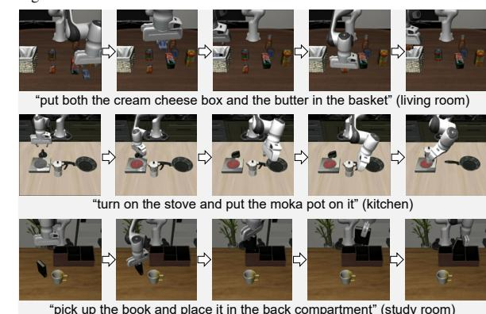
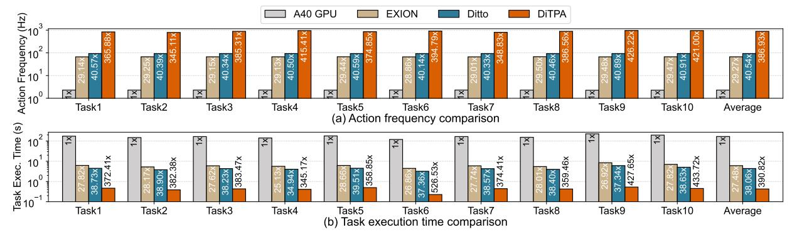
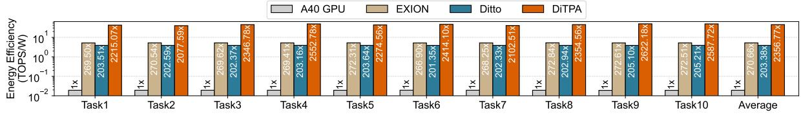
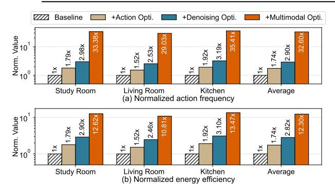

# A. Evaluation Methodology

Workloads. To evaluate the manipulation capabilities of DiTPA, we conduct experiments on the LIBERO-Long taskset, which comprises 10 complex long-horizon and multi-stage tasks, including 50 diverse environment configurations for each task [34]. These tasks involve complex activities, such as tabletop organization, that demand the coordinated execution of multiple low-level skills and generalization to varying object appearances, physical properties, and spatial layouts. These task configurations are detailed in TABLE III. We focus on three representative scenes: the living room, kitchen, and study room. Object target highlights the property recognition, such as color, while spatial target concentrates on spatial relationship understanding, such as direction. The core skills assessed include standard pick-and-place and turn-on-and-off operations. We implement the DiTPA software framework in Pytorch using the DiT-based action planner from the Dita model [19]. We adopt the default LIBERO control frequency of 20 Hz, with a maximum of 520 environment steps.

**Implementation.** We implemented DiTPA in 28nm technology. The clock frequency is 500MHz, operating at 0.88V. We use the Synopsys Design Compiler to complete the synthesis to generate the netlist for area estimation. Power and latency are measured by PrimeTime PX and Synopsys VCS. For external DRAM, we adopt LPDDR5 and evaluate memory access energy based on specifications provided by the DRAM vendor [24], [29].

DiTPA's total power and area are 1.05W and 4.37mm2, respectively, which only account for 2.63% power and 2.19% area of SOTA embodied AI compute platforms (e.g., Unitree G1-EDU: 40W power, 200mm2 die area) [49], ensuring

 $^{\left(2\right)}$  p&p and on&off indicate pick-and-place and turn-on-and-off.

TABLE IV
Breakdown of Power and Area Consumption

| Components           | Power       | r (mW)      | Area                    | (mm 2 ) |  |
|----------------------|-------------|-------------|-------------------------|--------------------|--|
| Action Predictor     | 0.54        | 0.05%       | 0.01                    | 0.23%              |  |
| PE Array             | 623.80      | 59.63%      | 1.42                    | 32.49%             |  |
| SFU                  | 104.58      | 10.00%      | 0.34                    | 7.78%              |  |
| Multimodal Scheduler | 29.54       | 2.82%       | 0.06                    | 1.37%              |  |
| On-chip SRAM         | 233.28      | 22.30%      | 2.44                    | 55.84%             |  |
| Noise Scheduler      | 41.54       | 3.97%       | 0.06                    | 1.37%              |  |
| Ctrl. & Others       | 12.84 1.23% |             | 0.04 0.92%              |                    |  |
| Total                | Pow         | er=1.05W, A | rea=4.37mm 2 |                    |  |

efficient deployment on resource-constrained edge robotic platforms [22]. TABLE IV details the breakdown. For the action predictor, only 0.05% in power and 0.23% in area are incurred due to its lightweight logic with reduced prediction complexity. The reconfigurable PE array is developed to handle the changing token lengths with 59.63% in power and 32.49% in area. The multimodal scheduler for dynamic data control costs 2.82% in power and 1.37% in area.

Hardware Baselines. To evaluate the benefits of DiTPA, we deploy the robot workloads on the general computing platform GPU and two SOTA DiT accelerators. For the GPU device, we select the NVIDIA A40 GPU, where the latency is obtained by estimating the actual inference time, and the power is measured using NVIDIA SMI tools. For the accelerator baselines, we adopt two accelerators, EXION [16] and Ditto [27], utilizing inter-intra iteration sparsity and quantized differential computing, to accelerate the DiT model, respectively. We develop a custom simulator to model their execution in the action planners. All hardware baselines operate at INT8 precision based on the PTQ4DiT method [53], with tensorwise quantization for activations and channel-wise quantization for weights. We use the same metrics for evaluation across the baselines. We normalize all accelerators to A40 GPU's peak performance (37.4 TFLOPS), enabling fair comparison of architectures. Without hardware scale differences, superior architecture's actual performance is higher due to better VLA co-design techniques and higher resource utilization.

## B. Automated Threshold Search

DiTPA framework integrates an automated search algorithm to identify suitable thresholds for diverse robotic scenarios with varying accuracy-performance requirements. Using a scenario-specific calibration taskset (3% of the total scenario tasks), it samples candidate thresholds and performs a multi-objective Pareto optimization over accuracy and latency to obtain the Pareto front. It then adaptively selects an appropriate threshold along this front based on current task demands, balancing trade-off between accuracy and speedup. Moreover, tasks in same scenarios share similar action-space dynamics and trajectory patterns, allowing fixed orientation threshold. In

Fig. 16. Visualization across various instructions on diverse scenes.

future work, we plan to explore highly-dynamic environment. Thresholds can be adaptively adjusted based on average optical flow magnitude between consecutive visual token frames.

In deployment of DiTPA, we classify application scenarios into two categories, similar to [31]. Latency-sensitive scenarios (e.g., sorting robots) prioritize high throughput (≥200 Hz) while tolerating minor success rate degradation ( $\leq 2\%$ ). This tolerance stems from the fact that errors in such environments can be effectively remedied via re-planning. In mission-critical scenarios (e.g., rescue robots), task failures cannot be mitigated through re-planning; therefore, they necessitate strict accuracy constraints (almost no accuracy degradation). Our scenario definitions and acceptable loss ranges align with stateof-the-art VLA acceleration frameworks (typically 1-4% reported losses) [40], [48]. The LIBERO-Long taskset, centered on object grasping, aligns with latency-sensitive scenarios. Automated search yields optimal thresholds of 2° (orientation) and 40% (iteration-skip). A full denoising is inserted every 20 skipped iterations to recover accumulated errors.

#### C. Accuracy Evaluation

**Success Rate.** As shown in Fig. 15, DiTPA achieves comparable average success rate to the baseline, confirming that targeted redundancy elimination preserves task accuracy. Virtual replays (Fig. 16) further verify error-free execution across scenes. For individual strategies, action redundancy exploitation reduces action inferences by 42.28% under a 2° orientation threshold while maintaining high success rates for most tasks. However, tasks 5 and 7, which require careful consideration of object properties and spatial relationships, are occasionally affected by skipped actions, slightly lowering success rates. Denoising redundancy optimization eliminates approximately 40% of redundant iterations and even achieves a marginally higher success rate than the baseline. This improvement arises from feature reuse introducing a mild mo-

Fig. 17. Normalized action frequency and task execution time comparison versus GPU and DiT accelerators.

Fig. 18. Normalized energy efficiency comparison versus GPU and DiT accelerators.

mentum in the denoising process, enhancing the prominence of final action features [52]. Multimodality redundancy exploitation reduces 91.74% of redundant token computations while achieving results comparable to the baseline. Overall, each redundancy elimination strategy maintains a high task success rate, validating the effectiveness of redundancy exploitation across action, iteration, and multimodal levels.

### D. Performance Evaluation

Action Frequency. Overall, DiTPA can achieve an action frequency of 217.65Hz on average, meeting the real-time requirements of robot applications. Fig. 17(a) illustrates the normalized speedup in action frequency achieved by DiTPA compared to GPU and accelerator baselines. On average, DiTPA provides a 386.93× speedup over the GPU, mainly attributed to avoiding the underutilized computational resource and long data operation latency issues in GPUs. Firstly, through reconfigurable PE array design, the average utilization of computing resources has been increased to 98.36%, far higher than the GPU, which is less than 20%. In addition, through the dedicated multimodal scheduler design, it efficiently supports dynamic data operations, such as calibration data buffering and reuse, through the index tables and sequence generator with negligible latency. Unlike in GPUs, it is severely blocked by the CPU, accounting for 35.37% of the total inference time. Thanks to these efficient hardware designs, the multi-level redundancies can be fully exploited with higher speedup. Compared to the EXION and Ditto accelerators, DiTPA can still achieve  $13.22 \times$  and  $9.54 \times$ acceleration on average, respectively, since EXION and Ditto mainly utilize the inter-iteration redundancy and don't consider the redundancy existing in the action and multimodal tokens, which occupy 73.94% of the three-level redundancy.

**Task Execution Time.** Overall, DiTPA only requires 1.73s to complete the inference for single task on average, far less than the few minutes required by GPUs. Fig. 17(b)

shows normalized task execution time reduction by DiTPA compared to GPU and accelerator baselines. On average, DiTPA provides 390.82× latency reduction over the GPU, and 14.22× and 10.27× latency reduction compared to EXION and Ditto, respectively. Nevertheless, unlike improvements in action frequency, approximation in redundancy exploitation may increase the total number of actions required to complete the task, thereby slightly increasing the task execution time. Specifically, the task execution time speedup of EXION and Ditto is lower than the action frequency. On the contrary, DiTPA exploits the redundancy at the action level, skipping 42.28% of redundant actions, thereby the overall improvement is not degraded.

Energy Efficiency. As shown in Fig. 18, DiTPA achieves an average 2356.77× improvement over the GPU. Compared to existing DiT accelerators, DiTPA achieves energy efficiency gains of 8.71× and 11.59×, respectively. These improvements stem primarily from reductions in external memory access and the compact architecture design. First, redundancy exploitation reduces external weight reloading by 65.37%, substantially lowering DRAM access energy. Moreover, the action predictor and multimodal scheduler consume only 2.87% of onchip power, yet reduce computations by 42.28% and 31.66% through action- and multimodality-level redundancy elimination, respectively. Together, these design strategies significantly enhance the overall energy efficiency of DiTPA.

#### E. Ablation Study

Fig. 19 shows the results of our ablation experiment. We select the most challenging tasks under three different scenes for evaluation, and the baseline is the accelerator without any redundancy utilization. Fig. 19(a) shows the speed up of the action frequency, where action redundancy exploitation can provide an average acceleration of  $1.74\times$ , attributed to the skip of redundant action inference and efficient action predictor design with only 4 cycles for each prediction. By further utilizing

TABLE V
TRAJECTORY QUALITY AND LENGTH COMPARISON

| Trajectory Metrics      | Models   | LIBERO Tasks |         |         |         |         |         |         | Average |         |         |         |
|----------------------------|----------|--------------|---------|---------|---------|---------|---------|---------|---------|---------|---------|---------|
|                            |          | Task1        | Task2   | Task3   | Task4   | Task5   | Task6   | Task7   | Task8   | Task9   | Task10  |         |
| Position Instability       | Baseline | 0.431        | 0.627   | 0.424   | 0.500   | 0.406   | 0.447   | 0.364   | 0.512   | 0.304   | 0.348   | 0.436   |
| (cm) ↓                     | DiTPA    | 0.372        | 0.608   | 0.401   | 0.457   | 0.366   | 0.447   | 0.344   | 0.461   | 0.315   | 0.373   | 0.414   |
| Velocity Instability       | Baseline | 0.038        | 0.042   | 0.029   | 0.029   | 0.029   | 0.025   | 0.025   | 0.037   | 0.023   | 0.040   | 0.032   |
| $(cm/\Delta t) \downarrow$ | DiTPA    | 0.021        | 0.036   | 0.024   | 0.021   | 0.020   | 0.020   | 0.020   | 0.029   | 0.015   | 0.021   | 0.023   |
| Total Length               | Baseline | 151.290      | 170.699 | 138.445 | 126.353 | 119.663 | 92.487  | 124.083 | 143.218 | 177.222 | 118.003 | 136.146 |
| (cm) ↓                     | DiTPA    | 150.785      | 182.519 | 128.457 | 134.314 | 120.357 | 86.228  | 116.579 | 147.941 | 178.188 | 124.550 | 136.992 |
| Total Time                 | Baseline | 173.740      | 148.160 | 165.460 | 141.320 | 178.480 | 119.460 | 165.580 | 153.000 | 227.320 | 195.740 | 166.826 |
| (s) ↓                      | DiTPA    | 1.893        | 1.572   | 1.751   | 1.661   | 2.018   | 0.921   | 1.795   | 1.727   | 2.157   | 1.831   | 1.732   |

Fig. 19. Ablation study across multi-level redundancy exploitation.

the denoising redundancy, a  $2.90\times$  speedup can be achieved, thanks to the removal of attention and FFN computation in redundant denoising steps, which can reduce both computation and weight reloading latency. In addition, the reconfigurable PE design can improve resource utilization to 98.36% for the matrix multiplication under different token lengths. The exploitation of multimodal redundancy can eliminate 91.74% of redundant token computations, and the efficient multimodal data scheduler avoids high latency in data operations, thus achieving a  $32.60\times$  performance improvement in total.

Fig. 19(b) presents the energy efficiency improvement. Utilizing action redundancy improves 1.74× energy efficiency on average, which is basically consistent with the acceleration of action frequency. The main reason is that the power consumption of the action predictor is only 0.54mW, less than 0.1% of the on-chip power. The exploitation of denoising redundancy can further lead to an average energy efficiency improvement of 2.82×, slightly lower than the action frequency improvement, mainly due to the overhead of external memory access from attention and FFN features during residual computation. Leveraging multimodal redundancy significantly reduces computation, pushing average energy efficiency to 12.30×. But the DRAM access energy consumed by weight remains unchanged, which rises from 16.67% to 67.68% of total energy, limiting further energy efficiency gains.

# A. Evaluation Methodology

Workloads. To evaluate the manipulation capabilities of DiTPA, we conduct experiments on the LIBERO-Long taskset, which comprises 10 complex long-horizon and multi-stage tasks, including 50 diverse environment configurations for each task [34]. These tasks involve complex activities, such as tabletop organization, that demand the coordinated execution of multiple low-level skills and generalization to varying object appearances, physical properties, and spatial layouts. These task configurations are detailed in TABLE III. We focus on three representative scenes: the living room, kitchen, and study room. Object target highlights the property recognition, such as color, while spatial target concentrates on spatial relationship understanding, such as direction. The core skills assessed include standard pick-and-place and turn-on-and-off operations. We implement the DiTPA software framework in Pytorch using the DiT-based action planner from the Dita model [19]. We adopt the default LIBERO control frequency of 20 Hz, with a maximum of 520 environment steps.

**Implementation.** We implemented DiTPA in 28nm technology. The clock frequency is 500MHz, operating at 0.88V. We use the Synopsys Design Compiler to complete the synthesis to generate the netlist for area estimation. Power and latency are measured by PrimeTime PX and Synopsys VCS. For external DRAM, we adopt LPDDR5 and evaluate memory access energy based on specifications provided by the DRAM vendor [24], [29].

DiTPA's total power and area are 1.05W and 4.37mm2, respectively, which only account for 2.63% power and 2.19% area of SOTA embodied AI compute platforms (e.g., Unitree G1-EDU: 40W power, 200mm2 die area) [49], ensuring

 $^{\left(2\right)}$  p&p and on&off indicate pick-and-place and turn-on-and-off.

TABLE IV
Breakdown of Power and Area Consumption

| Components           | Power       | r (mW)      | Area                    | (mm 2 ) |  |
|----------------------|-------------|-------------|-------------------------|--------------------|--|
| Action Predictor     | 0.54        | 0.05%       | 0.01                    | 0.23%              |  |
| PE Array             | 623.80      | 59.63%      | 1.42                    | 32.49%             |  |
| SFU                  | 104.58      | 10.00%      | 0.34                    | 7.78%              |  |
| Multimodal Scheduler | 29.54       | 2.82%       | 0.06                    | 1.37%              |  |
| On-chip SRAM         | 233.28      | 22.30%      | 2.44                    | 55.84%             |  |
| Noise Scheduler      | 41.54       | 3.97%       | 0.06                    | 1.37%              |  |
| Ctrl. & Others       | 12.84 1.23% |             | 0.04 0.92%              |                    |  |
| Total                | Pow         | er=1.05W, A | rea=4.37mm 2 |                    |  |

efficient deployment on resource-constrained edge robotic platforms [22]. TABLE IV details the breakdown. For the action predictor, only 0.05% in power and 0.23% in area are incurred due to its lightweight logic with reduced prediction complexity. The reconfigurable PE array is developed to handle the changing token lengths with 59.63% in power and 32.49% in area. The multimodal scheduler for dynamic data control costs 2.82% in power and 1.37% in area.

Hardware Baselines. To evaluate the benefits of DiTPA, we deploy the robot workloads on the general computing platform GPU and two SOTA DiT accelerators. For the GPU device, we select the NVIDIA A40 GPU, where the latency is obtained by estimating the actual inference time, and the power is measured using NVIDIA SMI tools. For the accelerator baselines, we adopt two accelerators, EXION [16] and Ditto [27], utilizing inter-intra iteration sparsity and quantized differential computing, to accelerate the DiT model, respectively. We develop a custom simulator to model their execution in the action planners. All hardware baselines operate at INT8 precision based on the PTQ4DiT method [53], with tensorwise quantization for activations and channel-wise quantization for weights. We use the same metrics for evaluation across the baselines. We normalize all accelerators to A40 GPU's peak performance (37.4 TFLOPS), enabling fair comparison of architectures. Without hardware scale differences, superior architecture's actual performance is higher due to better VLA co-design techniques and higher resource utilization.

## B. Automated Threshold Search

DiTPA framework integrates an automated search algorithm to identify suitable thresholds for diverse robotic scenarios with varying accuracy-performance requirements. Using a scenario-specific calibration taskset (3% of the total scenario tasks), it samples candidate thresholds and performs a multi-objective Pareto optimization over accuracy and latency to obtain the Pareto front. It then adaptively selects an appropriate threshold along this front based on current task demands, balancing trade-off between accuracy and speedup. Moreover, tasks in same scenarios share similar action-space dynamics and trajectory patterns, allowing fixed orientation threshold. In

Fig. 16. Visualization across various instructions on diverse scenes.

future work, we plan to explore highly-dynamic environment. Thresholds can be adaptively adjusted based on average optical flow magnitude between consecutive visual token frames.

In deployment of DiTPA, we classify application scenarios into two categories, similar to [31]. Latency-sensitive scenarios (e.g., sorting robots) prioritize high throughput (≥200 Hz) while tolerating minor success rate degradation ( $\leq 2\%$ ). This tolerance stems from the fact that errors in such environments can be effectively remedied via re-planning. In mission-critical scenarios (e.g., rescue robots), task failures cannot be mitigated through re-planning; therefore, they necessitate strict accuracy constraints (almost no accuracy degradation). Our scenario definitions and acceptable loss ranges align with stateof-the-art VLA acceleration frameworks (typically 1-4% reported losses) [40], [48]. The LIBERO-Long taskset, centered on object grasping, aligns with latency-sensitive scenarios. Automated search yields optimal thresholds of 2° (orientation) and 40% (iteration-skip). A full denoising is inserted every 20 skipped iterations to recover accumulated errors.

#### C. Accuracy Evaluation

**Success Rate.** As shown in Fig. 15, DiTPA achieves comparable average success rate to the baseline, confirming that targeted redundancy elimination preserves task accuracy. Virtual replays (Fig. 16) further verify error-free execution across scenes. For individual strategies, action redundancy exploitation reduces action inferences by 42.28% under a 2° orientation threshold while maintaining high success rates for most tasks. However, tasks 5 and 7, which require careful consideration of object properties and spatial relationships, are occasionally affected by skipped actions, slightly lowering success rates. Denoising redundancy optimization eliminates approximately 40% of redundant iterations and even achieves a marginally higher success rate than the baseline. This improvement arises from feature reuse introducing a mild mo-

Fig. 17. Normalized action frequency and task execution time comparison versus GPU and DiT accelerators.

Fig. 18. Normalized energy efficiency comparison versus GPU and DiT accelerators.

mentum in the denoising process, enhancing the prominence of final action features [52]. Multimodality redundancy exploitation reduces 91.74% of redundant token computations while achieving results comparable to the baseline. Overall, each redundancy elimination strategy maintains a high task success rate, validating the effectiveness of redundancy exploitation across action, iteration, and multimodal levels.

### D. Performance Evaluation

Action Frequency. Overall, DiTPA can achieve an action frequency of 217.65Hz on average, meeting the real-time requirements of robot applications. Fig. 17(a) illustrates the normalized speedup in action frequency achieved by DiTPA compared to GPU and accelerator baselines. On average, DiTPA provides a 386.93× speedup over the GPU, mainly attributed to avoiding the underutilized computational resource and long data operation latency issues in GPUs. Firstly, through reconfigurable PE array design, the average utilization of computing resources has been increased to 98.36%, far higher than the GPU, which is less than 20%. In addition, through the dedicated multimodal scheduler design, it efficiently supports dynamic data operations, such as calibration data buffering and reuse, through the index tables and sequence generator with negligible latency. Unlike in GPUs, it is severely blocked by the CPU, accounting for 35.37% of the total inference time. Thanks to these efficient hardware designs, the multi-level redundancies can be fully exploited with higher speedup. Compared to the EXION and Ditto accelerators, DiTPA can still achieve  $13.22 \times$  and  $9.54 \times$ acceleration on average, respectively, since EXION and Ditto mainly utilize the inter-iteration redundancy and don't consider the redundancy existing in the action and multimodal tokens, which occupy 73.94% of the three-level redundancy.

**Task Execution Time.** Overall, DiTPA only requires 1.73s to complete the inference for single task on average, far less than the few minutes required by GPUs. Fig. 17(b)

shows normalized task execution time reduction by DiTPA compared to GPU and accelerator baselines. On average, DiTPA provides 390.82× latency reduction over the GPU, and 14.22× and 10.27× latency reduction compared to EXION and Ditto, respectively. Nevertheless, unlike improvements in action frequency, approximation in redundancy exploitation may increase the total number of actions required to complete the task, thereby slightly increasing the task execution time. Specifically, the task execution time speedup of EXION and Ditto is lower than the action frequency. On the contrary, DiTPA exploits the redundancy at the action level, skipping 42.28% of redundant actions, thereby the overall improvement is not degraded.

Energy Efficiency. As shown in Fig. 18, DiTPA achieves an average 2356.77× improvement over the GPU. Compared to existing DiT accelerators, DiTPA achieves energy efficiency gains of 8.71× and 11.59×, respectively. These improvements stem primarily from reductions in external memory access and the compact architecture design. First, redundancy exploitation reduces external weight reloading by 65.37%, substantially lowering DRAM access energy. Moreover, the action predictor and multimodal scheduler consume only 2.87% of onchip power, yet reduce computations by 42.28% and 31.66% through action- and multimodality-level redundancy elimination, respectively. Together, these design strategies significantly enhance the overall energy efficiency of DiTPA.

#### E. Ablation Study

Fig. 19 shows the results of our ablation experiment. We select the most challenging tasks under three different scenes for evaluation, and the baseline is the accelerator without any redundancy utilization. Fig. 19(a) shows the speed up of the action frequency, where action redundancy exploitation can provide an average acceleration of  $1.74\times$ , attributed to the skip of redundant action inference and efficient action predictor design with only 4 cycles for each prediction. By further utilizing

TABLE V
TRAJECTORY QUALITY AND LENGTH COMPARISON

| Trajectory Metrics      | Models   | LIBERO Tasks |         |         |         |         |         |         | Average |         |         |         |
|----------------------------|----------|--------------|---------|---------|---------|---------|---------|---------|---------|---------|---------|---------|
|                            |          | Task1        | Task2   | Task3   | Task4   | Task5   | Task6   | Task7   | Task8   | Task9   | Task10  |         |
| Position Instability       | Baseline | 0.431        | 0.627   | 0.424   | 0.500   | 0.406   | 0.447   | 0.364   | 0.512   | 0.304   | 0.348   | 0.436   |
| (cm) ↓                     | DiTPA    | 0.372        | 0.608   | 0.401   | 0.457   | 0.366   | 0.447   | 0.344   | 0.461   | 0.315   | 0.373   | 0.414   |
| Velocity Instability       | Baseline | 0.038        | 0.042   | 0.029   | 0.029   | 0.029   | 0.025   | 0.025   | 0.037   | 0.023   | 0.040   | 0.032   |
| $(cm/\Delta t) \downarrow$ | DiTPA    | 0.021        | 0.036   | 0.024   | 0.021   | 0.020   | 0.020   | 0.020   | 0.029   | 0.015   | 0.021   | 0.023   |
| Total Length               | Baseline | 151.290      | 170.699 | 138.445 | 126.353 | 119.663 | 92.487  | 124.083 | 143.218 | 177.222 | 118.003 | 136.146 |
| (cm) ↓                     | DiTPA    | 150.785      | 182.519 | 128.457 | 134.314 | 120.357 | 86.228  | 116.579 | 147.941 | 178.188 | 124.550 | 136.992 |
| Total Time                 | Baseline | 173.740      | 148.160 | 165.460 | 141.320 | 178.480 | 119.460 | 165.580 | 153.000 | 227.320 | 195.740 | 166.826 |
| (s) ↓                      | DiTPA    | 1.893        | 1.572   | 1.751   | 1.661   | 2.018   | 0.921   | 1.795   | 1.727   | 2.157   | 1.831   | 1.732   |

Fig. 19. Ablation study across multi-level redundancy exploitation.

the denoising redundancy, a  $2.90\times$  speedup can be achieved, thanks to the removal of attention and FFN computation in redundant denoising steps, which can reduce both computation and weight reloading latency. In addition, the reconfigurable PE design can improve resource utilization to 98.36% for the matrix multiplication under different token lengths. The exploitation of multimodal redundancy can eliminate 91.74% of redundant token computations, and the efficient multimodal data scheduler avoids high latency in data operations, thus achieving a  $32.60\times$  performance improvement in total.

Fig. 19(b) presents the energy efficiency improvement. Utilizing action redundancy improves 1.74× energy efficiency on average, which is basically consistent with the acceleration of action frequency. The main reason is that the power consumption of the action predictor is only 0.54mW, less than 0.1% of the on-chip power. The exploitation of denoising redundancy can further lead to an average energy efficiency improvement of 2.82×, slightly lower than the action frequency improvement, mainly due to the overhead of external memory access from attention and FFN features during residual computation. Leveraging multimodal redundancy significantly reduces computation, pushing average energy efficiency to 12.30×. But the DRAM access energy consumed by weight remains unchanged, which rises from 16.67% to 67.68% of total energy, limiting further energy efficiency gains.

