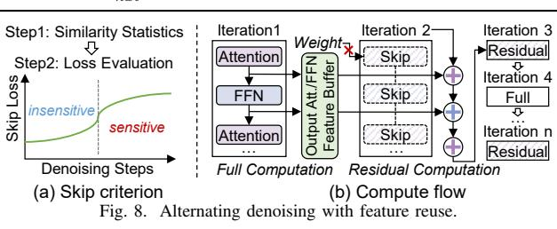
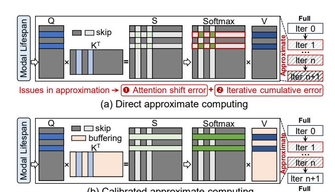
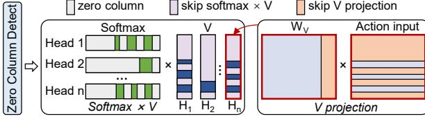

# A. Orientation-conditioned Action Prediction

As discussed in Section II-B1, adjacent actions exhibit minimal orientation variations and high local concentration. Motivated by this, we compare the absolute orientation difference between consecutive actions. When the difference is small, the next action is likely consistent with the current one, allowing us to reuse the current action and skip the corresponding full inference. Additionally, the small distance variation between adjacent actions ensures that this reuse does not alter the overall trajectory. However, potential prediction errors may arise, such as adjacent actions at the boundary of continuous trajectory segments that show small orientation variations but large subsequent deviations. Therefore, DiTPA alternates between full action inference and approximate action prediction to enable timely correction of inaccuracies.

#### **Algorithm 1:** Action Prediction Mechanism.

```
Input: Act_{cur}: Current output action
   Output: Act_{nxt}: Next output action
 1 if Skip_{flag} == False then
        Act_{nxt} = Full DiT Inference
 2
3 end
 4
   else if Skip_{flag} == True then
        Rad_{rel} = ROTATION EXTRACT(Act_{cur})
 5
        Rad_{acc} += Rad_{rel}
                                                           // Step 1
        Deg_{abs} = 180/\pi \cdot (Rad_{acc})
 7
        Deg_{abs}^{sim} = \frac{Deg_{abs}}{||Deg_{abs}^{i}|| \cdot ||Deg_{abs}^{i-1}||}
                                                           // Step 2
 8
        Deg_{diff} = 180/\pi \cdot arccos(Deg_{abs}^{sim})
                                                           // Step 3
 9
                                                           // Step 4
        if Deg_{diff} \leq th then
10
11
            Act_{nxt} = Act_{cur}
12
        else if Deg_{diff} > th then
13
             Act_{nxt} = Full Dit Inference
15
        end
16
   end
17 Skip_{flag} = !Skip_{flag}
18 return Act_{nxt}
```



Algorithm 1 illustrates the proposed action prediction process. Given the current action, the algorithm determines the next action to be executed in four steps. **Step 1:** Extracts the rotation vector of the current action to compute relative radians, accumulates them to obtain absolute radians, and converts them to angular space. **Step 2:** Calculates the orientation similarity, where higher similarity indicates smaller orientation variation. **Step 3:** Computes the specific orientation difference via trigonometric transformation. **Step 4:** Compares the difference with a predefined threshold. If it is below the threshold, the current action is reused; otherwise, a full DiT inference is performed. Additionally, the  $Skip_{flag}$  is adopted to alternate prediction and full inference.

#### B. Alternating Denoising with Feature Reuse

Section II-B2 has analyzed the denoising feature similarity of the DiT action planner. Building on this pattern, we exploit redundancy in the denoising process to reduce both computation and external memory access. As illustrated in Fig. 8(a), we first compute the attention and FFN feature similarity between adjacent denoising steps and use a threshold-based criterion to identify candidate steps where these computations may be omitted. We then assess the MSE loss incurred by skipping each candidate step. Since early denoising steps are less sensitive to such loss, the final selected steps are those in which attention and FFN computations can be safely skipped.

Fig. 8(b) illustrates the computation flow after applying alternating denoising with feature reuse. First, a full denoising computation is performed. If the next denoising step is deter-



(b) Calibrated approximate computing Fig. 9. Calibrated approximation for vision and language modality.



Fig. 10. Column sparsity exploitation for action modality.

mined to be skipped, the current attention and FFN features are buffered. For a skipped step, the full attention and FFN computations are omitted, and the associated external memory access for weight updates is accordingly eliminated. As a result, the iterative process for noise updating only performs the low-cost residual computation.

# A. Orientation-conditioned Action Prediction

As discussed in Section II-B1, adjacent actions exhibit minimal orientation variations and high local concentration. Motivated by this, we compare the absolute orientation difference between consecutive actions. When the difference is small, the next action is likely consistent with the current one, allowing us to reuse the current action and skip the corresponding full inference. Additionally, the small distance variation between adjacent actions ensures that this reuse does not alter the overall trajectory. However, potential prediction errors may arise, such as adjacent actions at the boundary of continuous trajectory segments that show small orientation variations but large subsequent deviations. Therefore, DiTPA alternates between full action inference and approximate action prediction to enable timely correction of inaccuracies.

#### **Algorithm 1:** Action Prediction Mechanism.

```
Input: Act_{cur}: Current output action
   Output: Act_{nxt}: Next output action
 1 if Skip_{flag} == False then
        Act_{nxt} = Full DiT Inference
 2
3 end
 4
   else if Skip_{flag} == True then
        Rad_{rel} = ROTATION EXTRACT(Act_{cur})
 5
        Rad_{acc} += Rad_{rel}
                                                           // Step 1
        Deg_{abs} = 180/\pi \cdot (Rad_{acc})
 7
        Deg_{abs}^{sim} = \frac{Deg_{abs}}{||Deg_{abs}^{i}|| \cdot ||Deg_{abs}^{i-1}||}
                                                           // Step 2
 8
        Deg_{diff} = 180/\pi \cdot arccos(Deg_{abs}^{sim})
                                                           // Step 3
 9
                                                           // Step 4
        if Deg_{diff} \leq th then
10
11
            Act_{nxt} = Act_{cur}
12
        else if Deg_{diff} > th then
13
             Act_{nxt} = Full Dit Inference
15
        end
16
   end
17 Skip_{flag} = !Skip_{flag}
18 return Act_{nxt}
```


Algorithm 1 illustrates the proposed action prediction process. Given the current action, the algorithm determines the next action to be executed in four steps. **Step 1:** Extracts the rotation vector of the current action to compute relative radians, accumulates them to obtain absolute radians, and converts them to angular space. **Step 2:** Calculates the orientation similarity, where higher similarity indicates smaller orientation variation. **Step 3:** Computes the specific orientation difference via trigonometric transformation. **Step 4:** Compares the difference with a predefined threshold. If it is below the threshold, the current action is reused; otherwise, a full DiT inference is performed. Additionally, the  $Skip_{flag}$  is adopted to alternate prediction and full inference.

#### B. Alternating Denoising with Feature Reuse

Section II-B2 has analyzed the denoising feature similarity of the DiT action planner. Building on this pattern, we exploit redundancy in the denoising process to reduce both computation and external memory access. As illustrated in Fig. 8(a), we first compute the attention and FFN feature similarity between adjacent denoising steps and use a threshold-based criterion to identify candidate steps where these computations may be omitted. We then assess the MSE loss incurred by skipping each candidate step. Since early denoising steps are less sensitive to such loss, the final selected steps are those in which attention and FFN computations can be safely skipped.

Fig. 8(b) illustrates the computation flow after applying alternating denoising with feature reuse. First, a full denoising computation is performed. If the next denoising step is deter-


(b) Calibrated approximate computing Fig. 9. Calibrated approximation for vision and language modality.


Fig. 10. Column sparsity exploitation for action modality.

mined to be skipped, the current attention and FFN features are buffered. For a skipped step, the full attention and FFN computations are omitted, and the associated external memory access for weight updates is accordingly eliminated. As a result, the iterative process for noise updating only performs the low-cost residual computation.

