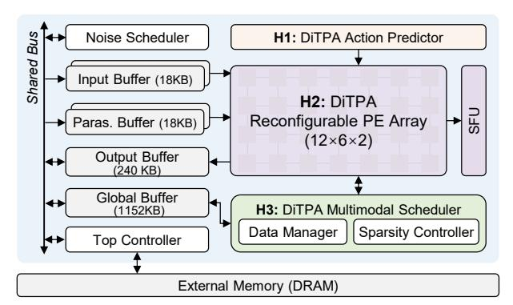

# *B. DiTPA Action Predictor*

Fig. 12 presents the proposed run-time action predictor, which completes prediction in only 4 cycles with negligible latency. First, the prediction process of Algorithm 1 is simplified by removing redundant calculations and complex operators. Specifically, in the similarity calculation, the modulus from the previous action remains unchanged, allowing the reuse of the previous result and skipping redundant computation, as

Fig. 11. Hardware architecture of DiTPA.

Fig. 12. DiTPA action predictor design.

shown in Eq. 1. Additionally, since the orientation threshold is determined offline, the calculation of orientation difference and threshold comparison can be reduced to a single comparison operation, avoiding trigonometric transformations, as shown in Eq. 2. Combining these simplifications, the final orientation variation computation and comparison are performed as in Eq. 3 without any division operations.

$$Deg_{abs}^{sim} = \frac{\Phi_1 \cdot \Phi_2 + \Theta_1 \cdot \Theta_2 + \Psi_1 \cdot \Psi_2}{\sqrt{\Phi_1^2 + \Theta_1^2 + \Psi_1^2} \cdot C_1}$$
 (1)

$$Deg_{abs}^{sim} > cos(th \cdot \frac{180}{\pi}) = C_2 \tag{2}$$

$$(\Phi_1 \cdot \Phi_2 + \Theta_1 \cdot \Theta_2 + \Psi_1 \cdot \Psi_2)^2 > C_1^2 \cdot C_2^2 \cdot (\Phi_1^2 + \Theta_1^2 + \Psi_1^2)$$
 (3)

In hardware operation, the action predictor is triggered when the skip flag is true. The radian generator first accumulates and outputs absolute radians, while shift registers simultaneously produce adjacent action radians for subsequent calculations. Relevant variables, such as modulus and threshold, are stored in a local buffer for immediate access. The orientation judger then computes the orientation variation, with two compute units evaluating both sides of Eq. 3 in parallel. If the comparison condition is satisfied, the predictor reuses the current action and skips the next full DiT inference, thereby reducing redundant computation. Compared to performing full inference for each action, this optimized predictor adds only 0.23% resource overhead and 4 cycles of latency, while eliminating roughly 42% of the computation for the entire robotic task.

# *B. DiTPA Action Predictor*

Fig. 12 presents the proposed run-time action predictor, which completes prediction in only 4 cycles with negligible latency. First, the prediction process of Algorithm 1 is simplified by removing redundant calculations and complex operators. Specifically, in the similarity calculation, the modulus from the previous action remains unchanged, allowing the reuse of the previous result and skipping redundant computation, as

Fig. 11. Hardware architecture of DiTPA.

Fig. 12. DiTPA action predictor design.

shown in Eq. 1. Additionally, since the orientation threshold is determined offline, the calculation of orientation difference and threshold comparison can be reduced to a single comparison operation, avoiding trigonometric transformations, as shown in Eq. 2. Combining these simplifications, the final orientation variation computation and comparison are performed as in Eq. 3 without any division operations.

$$Deg_{abs}^{sim} = \frac{\Phi_1 \cdot \Phi_2 + \Theta_1 \cdot \Theta_2 + \Psi_1 \cdot \Psi_2}{\sqrt{\Phi_1^2 + \Theta_1^2 + \Psi_1^2} \cdot C_1}$$
 (1)

$$Deg_{abs}^{sim} > cos(th \cdot \frac{180}{\pi}) = C_2 \tag{2}$$

$$(\Phi_1 \cdot \Phi_2 + \Theta_1 \cdot \Theta_2 + \Psi_1 \cdot \Psi_2)^2 > C_1^2 \cdot C_2^2 \cdot (\Phi_1^2 + \Theta_1^2 + \Psi_1^2)$$
 (3)

In hardware operation, the action predictor is triggered when the skip flag is true. The radian generator first accumulates and outputs absolute radians, while shift registers simultaneously produce adjacent action radians for subsequent calculations. Relevant variables, such as modulus and threshold, are stored in a local buffer for immediate access. The orientation judger then computes the orientation variation, with two compute units evaluating both sides of Eq. 3 in parallel. If the comparison condition is satisfied, the predictor reuses the current action and skips the next full DiT inference, thereby reducing redundant computation. Compared to performing full inference for each action, this optimized predictor adds only 0.23% resource overhead and 4 cycles of latency, while eliminating roughly 42% of the computation for the entire robotic task.

