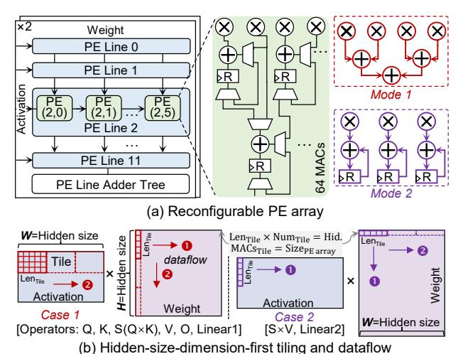

# C. DiTPA Reconfigurable PE Array

Despite matrix operations with dynamically changing token lengths across iterations due to multi-level redundancy exploitation, the hidden-size dimension remains unchanged.

Fig. 13. DiTPA reconfigurable PE array and compute scheme.

Based on this insight, we develop a hidden-size-dimension-first tiling scheme that tiles along the invariant hidden-size dimension, without being limited by token length. To efficiently support this tiling, a  $12\times6\times2$  reconfigurable PE array is designed, equipped with multiple PE lines and line adder trees, as shown in Fig. 13(a). Each PE can operate in mode 1 or mode 2 through reconfiguration to match the compute tiles, performing 64 MACs per cycle. Reconfiguration is handled by a single-cycle state machine transition, which is fully hidden in the pipeline through overlapping buffer data reads.

Here, tiling is performed in two cases, depending on the hidden-size dimension of each operator:

Case 1: As shown in Fig. 13(b), in the Q projection, the width (W) of the activation and the height (H) of the weight correspond to the hidden size. We tile the activation and weight inputs along the W and H dimensions, respectively, to fit the PE array. To maximize PE utilization, each tile is designed so that its total length equals the hidden size, and the number of MAC operations per tile matches the PE array size. During matrix computation, PEs operate in mode 1. The activation tile is broadcast along the row dimension of the PE array, while the weight tile is broadcast along the column dimension and shared by all PE lines. The activation remains stationary while sliding rightward each cycle, multiplying with the corresponding weight columns until the last column of the weight is processed (1). After finishing an activation tile, both the activation and weight switch to the next tile, and the process repeats (2). To hide the latency of loading new activation tiles, a ping-pong buffer is employed, enabling seamless pipelined computation. This tiling strategy and dataflow are similarly applied to other operators in Case 1, ensuring consistent and efficient PE execution.

Case 2: For the second Linear operator in the FFN block, only the width (W) of the weight corresponds to the hidden size. Such that, the weight is tiled along the W direction to ensure full utilization of both the hidden size and the PE array resources. During matrix computation, PEs operate in mode 2. Both the activation and weight tiles are shared

Fig. 14. DiTPA multimodal scheduler.

across PEs, meaning that each element in the activation tile is multiplied by all elements in the weight tile to produce intermediate results, which are stored in the register. In the next cycle, the activation tile slides to the right while the weight tile slides downward, and the outputs are accumulated with the previously stored intermediate results. This process continues until the last row of the weight is processed ( $\bullet$ ), after which the computation moves to the next tile ( $\bullet$ ). For the S×V operator, the input includes multiple attention heads. To handle this, the computations for all heads are performed simultaneously, leveraging parallelism to maximize hardware utilization and throughput.

#### D. DiTPA Multimodal Scheduler

Fig. 14(a) illustrates the data manager within the multimodal scheduler, designed to optimize dynamic data operations during inference. Two index tables are first employed to store general skip configurations for denoising steps and multimodal tokens. To handle dynamically modified input tokens and calibrated data, we implement a lifespan-based sequence generator with two levels of state registers. The action-level registers maintain the action skip states from the action predictor and the update states from the iteration index table, while the iteration-level registers track counter states used to eliminate accumulated approximation errors. Based on these states, the sequence generator decodes the token sequence, which is then logically combined with the default token sequence from the index tables. The resulting sequence is sent to the feature and calibrated data address generators, which update the input tokens and calibrated data for subsequent computations.

The column sparsity controller within the multimodal scheduler (Fig. 14(b)) detects and skips zero-column computations in the action modality. In the column sparsity detector, each attention head unit contains multiple sets of column comparators, which determine whether attention scores are close to zero. The results are stored in bit registers, where a value of 1 indicates proximity to zero. An OR logic operation then identifies the sparsity of each column. Zero columns are

TABLE III ROBOT TASKSET CONFIGURATION

| Task | Scene       |      | Targets (1) | Skills (2) |          |          |
|------|-------------|------|------------------------|-----------------------|----------|----------|
| No.  | Scelle      | Num. | Object                 | Spatial               | р&р      | on&off   |
| 1    | Living Room | 3    | ✓                      | -                     | ✓        | -        |
| 2    | Living Room | 3    | <b>√</b>               | -                     | <b>√</b> | -        |
| 3    | Kitchen     | 2    | ✓                      | -                     | ✓        | <b>√</b> |
| 4    | Kitchen     | 3    | <b>√</b>               | ✓                     | <b>√</b> | ✓        |
| 5    | Living Room | 4    | ✓                      | <b>√</b>              | ✓        | -        |
| 6    | Study Room  | 2    | <b>√</b>               | ✓                     | <b>√</b> | -        |
| 7    | Living Room | 3    | ✓                      | ✓                     | ✓        | -        |
| 8    | Living Room | 3    | ✓                      | -                     | <b>√</b> | -        |
| 9    | Kitchen     | 3    | <b>√</b>               | -                     | <b>√</b> | -        |
| 10   | Kitchen     | 3    | ✓                      | -                     | ✓        | ✓        |

(1) Num. indicates the number of objects that interact with in the task.

bypassed, while indices of non-sparse columns are enqueued for subsequent computation. During computation, column indices are sequentially dequeued. For the S×V operator, which performs column- and row-wise matrix multiplication (as discussed in Section IV-C), operations corresponding to sparse columns are directly skipped under the guidance of the column sparsity controller. To balance the computation latency across all attention heads, the dispatcher redistributes workloads by averaging the longest and shortest sequences, ensuring that processing time is evenly distributed.

#### V. EXPERIMENTAL RESULTS

# C. DiTPA Reconfigurable PE Array

Despite matrix operations with dynamically changing token lengths across iterations due to multi-level redundancy exploitation, the hidden-size dimension remains unchanged.

Fig. 13. DiTPA reconfigurable PE array and compute scheme.

Based on this insight, we develop a hidden-size-dimension-first tiling scheme that tiles along the invariant hidden-size dimension, without being limited by token length. To efficiently support this tiling, a  $12\times6\times2$  reconfigurable PE array is designed, equipped with multiple PE lines and line adder trees, as shown in Fig. 13(a). Each PE can operate in mode 1 or mode 2 through reconfiguration to match the compute tiles, performing 64 MACs per cycle. Reconfiguration is handled by a single-cycle state machine transition, which is fully hidden in the pipeline through overlapping buffer data reads.

Here, tiling is performed in two cases, depending on the hidden-size dimension of each operator:

Case 1: As shown in Fig. 13(b), in the Q projection, the width (W) of the activation and the height (H) of the weight correspond to the hidden size. We tile the activation and weight inputs along the W and H dimensions, respectively, to fit the PE array. To maximize PE utilization, each tile is designed so that its total length equals the hidden size, and the number of MAC operations per tile matches the PE array size. During matrix computation, PEs operate in mode 1. The activation tile is broadcast along the row dimension of the PE array, while the weight tile is broadcast along the column dimension and shared by all PE lines. The activation remains stationary while sliding rightward each cycle, multiplying with the corresponding weight columns until the last column of the weight is processed (1). After finishing an activation tile, both the activation and weight switch to the next tile, and the process repeats (2). To hide the latency of loading new activation tiles, a ping-pong buffer is employed, enabling seamless pipelined computation. This tiling strategy and dataflow are similarly applied to other operators in Case 1, ensuring consistent and efficient PE execution.

Case 2: For the second Linear operator in the FFN block, only the width (W) of the weight corresponds to the hidden size. Such that, the weight is tiled along the W direction to ensure full utilization of both the hidden size and the PE array resources. During matrix computation, PEs operate in mode 2. Both the activation and weight tiles are shared

Fig. 14. DiTPA multimodal scheduler.

across PEs, meaning that each element in the activation tile is multiplied by all elements in the weight tile to produce intermediate results, which are stored in the register. In the next cycle, the activation tile slides to the right while the weight tile slides downward, and the outputs are accumulated with the previously stored intermediate results. This process continues until the last row of the weight is processed ( $\bullet$ ), after which the computation moves to the next tile ( $\bullet$ ). For the S×V operator, the input includes multiple attention heads. To handle this, the computations for all heads are performed simultaneously, leveraging parallelism to maximize hardware utilization and throughput.

#### D. DiTPA Multimodal Scheduler

Fig. 14(a) illustrates the data manager within the multimodal scheduler, designed to optimize dynamic data operations during inference. Two index tables are first employed to store general skip configurations for denoising steps and multimodal tokens. To handle dynamically modified input tokens and calibrated data, we implement a lifespan-based sequence generator with two levels of state registers. The action-level registers maintain the action skip states from the action predictor and the update states from the iteration index table, while the iteration-level registers track counter states used to eliminate accumulated approximation errors. Based on these states, the sequence generator decodes the token sequence, which is then logically combined with the default token sequence from the index tables. The resulting sequence is sent to the feature and calibrated data address generators, which update the input tokens and calibrated data for subsequent computations.

The column sparsity controller within the multimodal scheduler (Fig. 14(b)) detects and skips zero-column computations in the action modality. In the column sparsity detector, each attention head unit contains multiple sets of column comparators, which determine whether attention scores are close to zero. The results are stored in bit registers, where a value of 1 indicates proximity to zero. An OR logic operation then identifies the sparsity of each column. Zero columns are

TABLE III ROBOT TASKSET CONFIGURATION

| Task | Scene       |      | Targets (1) | Skills (2) |          |          |
|------|-------------|------|------------------------|-----------------------|----------|----------|
| No.  | Scelle      | Num. | Object                 | Spatial               | р&р      | on&off   |
| 1    | Living Room | 3    | ✓                      | -                     | ✓        | -        |
| 2    | Living Room | 3    | <b>√</b>               | -                     | <b>√</b> | -        |
| 3    | Kitchen     | 2    | ✓                      | -                     | ✓        | <b>√</b> |
| 4    | Kitchen     | 3    | <b>√</b>               | ✓                     | <b>√</b> | ✓        |
| 5    | Living Room | 4    | ✓                      | <b>√</b>              | ✓        | -        |
| 6    | Study Room  | 2    | <b>√</b>               | ✓                     | <b>√</b> | -        |
| 7    | Living Room | 3    | ✓                      | ✓                     | ✓        | -        |
| 8    | Living Room | 3    | ✓                      | -                     | <b>√</b> | -        |
| 9    | Kitchen     | 3    | <b>√</b>               | -                     | <b>√</b> | -        |
| 10   | Kitchen     | 3    | ✓                      | -                     | ✓        | ✓        |

(1) Num. indicates the number of objects that interact with in the task.

bypassed, while indices of non-sparse columns are enqueued for subsequent computation. During computation, column indices are sequentially dequeued. For the S×V operator, which performs column- and row-wise matrix multiplication (as discussed in Section IV-C), operations corresponding to sparse columns are directly skipped under the guidance of the column sparsity controller. To balance the computation latency across all attention heads, the dispatcher redistributes workloads by averaging the longest and shortest sequences, ensuring that processing time is evenly distributed.

#### V. EXPERIMENTAL RESULTS

