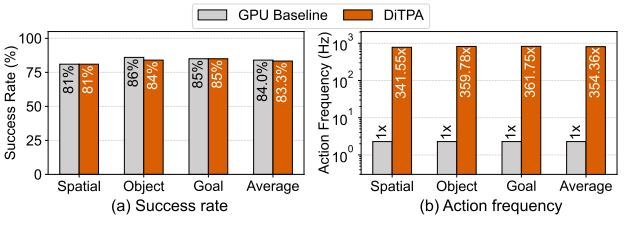

# F. Accuracy and Performance Tradeoff Analysis

1) Application Scenario Tradeoff: Fig. 20 shows the tradeoff between success rate and action frequency speedup (normalized to GPU) across different thresholds. In general, larger thresholds yield higher speedups at the cost of increased

Fig. 20. Accuracy and normalized performance tradeoff.

success-rate loss. Specifically, for latency-sensitive scenarios, DiTPA achieves an action frequency of 217.65Hz ( $386.93 \times 50$  speedup) with an average  $\leq 2\%$  success-rate loss. Furthermore, the re-planning latency for failed tasks requires only 4.6ms/per action, fully satisfying high throughput demands. Starting from the current optimal thresholds, DiTPA can seamlessly switch to mission-critical scenarios by adjusting either the orientation or iteration-skip threshold. As shown in Fig. 20(a), tightening the orientation threshold alone delivers  $226.68 \times 50$  speedup with zero loss. Similarly, tuning the iteration-skip threshold yields an average of  $245.69 \times 50$  speedup (Fig. 20(b)). This tunable Pareto-based parameter search makes DiTPA flexible across different application demands.

2) Trajectory Tradeoff: **Trajectory Quality.** Following [50], we evaluate trajectory quality using position instability (first-order difference of end-effector positions) and velocity instability (second-order difference). Lower values indicate smoother and more stable trajectories. TABLE V (top) shows that DiTPA achieves an average position instability of 0.414cm, outperforming the baseline in overall smoothness. In addition, velocity instability remains low  $(0.023\text{cm}/\Delta t \text{ on average})$ , further confirming consistent and stable motion.

**Trajectory Length.** TABLE V (bottom) reports total trajectory lengths for successful tasks. On average, trajectory length (136.992cm) increases by only 0.62%, while inference time (1.732s) reduces by 96.32× on DiTPA. Specifically, tasks involving fine-grained motions (e.g., gripping cup handles) require extra actions to compensate, leading to longer trajectories. In contrast, tasks involving translational motions (e.g., transferring objects) induce redundant actions which can be skipped, achieving shorter trajectories. Regarding task execution time, the primary bottleneck is DiT model inference, while actuation time contributes <0.3% of the total and is ignored in our evaluation [33], [38]. On average, inference time (1.732s)

Fig. 21. Trajectory accuracy and performance evaluation.

Fig. 22. Visualization of action trajectory under different thresholds. (a) Threshold= $0^{\circ}$ ; (b) Threshold= $2^{\circ}$ ; (c) Threshold= $3^{\circ}$ ; (4) Threshold= $4^{\circ}$ .

is reduced by 96.32× via redundancy exploitation.

Trajectory Sensitivity on Orientation Threshold. Complex and disordered motion trajectories can affect action prediction performance. Fig. 21(a) presents the success rate and speedup under different orientation variation thresholds  $(0^{\circ})$  denotes full inference without action prediction). The success rate remains stable when the threshold increases to below 3°, but exceeding 3° causes a rapid decline. This is primarily due to looser orientation constraints reducing spatial localization accuracy, particularly during precise operations such as grasping, where gripper deviation may lead to task failure. For speedup, action frequency initially increases with the threshold but plateaus when it surpasses 2°. To analyze this, total actions are divided into actual actions requiring full inference and skipped actions (Fig. 21(b)). Although the number of skipped actions rises, the actual actions count remains largely unchanged, resulting in stable overall latency. Most additional skipped actions correspond to ineffective operations, such as repeated grasping. As a result, maintaining orientation variation  $\leq 2^{\circ}$  enables both high success rates and speedup. Exceeding this threshold, however, degrades accuracy.

Case Study: To verify that trajectory characteristics under different conditions align with the previous analysis, we select task 1 for visualization, which includes a cylinder object grasping stage that is highly sensitive to precision. Fig. 22(a)

TABLE VI ACTION FREQUENCY UNDER LONGER TOKEN LENGTH

| Metrics  | Number          | of Tokens | Action    |
|----------|-----------------|-----------|-----------|
|          | Vision Language |           | Frequency |
| Baseline | 64              | 77        | 217.65Hz  |
| Increase | 128             | 77        | 193.85Hz  |
| Vision   | 256             | 77        | 157.61Hz  |
| Token    | 512             | 77        | 115.48Hz  |
| Increase | 64              | 154       | 217.46Hz  |
| Language | 64              | 308       | 217.13Hz  |
| Token    | 64              | 616       | 216.42Hz  |

Fig. 23. Accuracy and performance evaluation on LIBERO-Spatial, Object, and Goal tasksets.

shows the trajectory during full inference, with two colored points indicating the start and end positions. The trajectory enclosed in the red dashed box corresponds to the grasping stage. Fig. 22(b) depicts the trajectory when using action prediction with a 2° threshold. The trajectory closely matches that of full inference, confirming that rational action prediction does not alter the overall action path. Exceeding the 2° threshold causes gripper deviation from the target object and repetitive grasping attempts (Fig. 22(c)). Further increasing to 4° amplifies localization errors, causing the trajectory endpoint to miss the target and resulting in task failure (Fig. 22(d)).

# F. Accuracy and Performance Tradeoff Analysis

1) Application Scenario Tradeoff: Fig. 20 shows the tradeoff between success rate and action frequency speedup (normalized to GPU) across different thresholds. In general, larger thresholds yield higher speedups at the cost of increased

Fig. 20. Accuracy and normalized performance tradeoff.

success-rate loss. Specifically, for latency-sensitive scenarios, DiTPA achieves an action frequency of 217.65Hz ( $386.93 \times 50$  speedup) with an average  $\leq 2\%$  success-rate loss. Furthermore, the re-planning latency for failed tasks requires only 4.6ms/per action, fully satisfying high throughput demands. Starting from the current optimal thresholds, DiTPA can seamlessly switch to mission-critical scenarios by adjusting either the orientation or iteration-skip threshold. As shown in Fig. 20(a), tightening the orientation threshold alone delivers  $226.68 \times 50$  speedup with zero loss. Similarly, tuning the iteration-skip threshold yields an average of  $245.69 \times 50$  speedup (Fig. 20(b)). This tunable Pareto-based parameter search makes DiTPA flexible across different application demands.

2) Trajectory Tradeoff: **Trajectory Quality.** Following [50], we evaluate trajectory quality using position instability (first-order difference of end-effector positions) and velocity instability (second-order difference). Lower values indicate smoother and more stable trajectories. TABLE V (top) shows that DiTPA achieves an average position instability of 0.414cm, outperforming the baseline in overall smoothness. In addition, velocity instability remains low  $(0.023\text{cm}/\Delta t \text{ on average})$ , further confirming consistent and stable motion.

**Trajectory Length.** TABLE V (bottom) reports total trajectory lengths for successful tasks. On average, trajectory length (136.992cm) increases by only 0.62%, while inference time (1.732s) reduces by 96.32× on DiTPA. Specifically, tasks involving fine-grained motions (e.g., gripping cup handles) require extra actions to compensate, leading to longer trajectories. In contrast, tasks involving translational motions (e.g., transferring objects) induce redundant actions which can be skipped, achieving shorter trajectories. Regarding task execution time, the primary bottleneck is DiT model inference, while actuation time contributes <0.3% of the total and is ignored in our evaluation [33], [38]. On average, inference time (1.732s)

Fig. 21. Trajectory accuracy and performance evaluation.

Fig. 22. Visualization of action trajectory under different thresholds. (a) Threshold= $0^{\circ}$ ; (b) Threshold= $2^{\circ}$ ; (c) Threshold= $3^{\circ}$ ; (4) Threshold= $4^{\circ}$ .

is reduced by 96.32× via redundancy exploitation.

Trajectory Sensitivity on Orientation Threshold. Complex and disordered motion trajectories can affect action prediction performance. Fig. 21(a) presents the success rate and speedup under different orientation variation thresholds  $(0^{\circ})$  denotes full inference without action prediction). The success rate remains stable when the threshold increases to below 3°, but exceeding 3° causes a rapid decline. This is primarily due to looser orientation constraints reducing spatial localization accuracy, particularly during precise operations such as grasping, where gripper deviation may lead to task failure. For speedup, action frequency initially increases with the threshold but plateaus when it surpasses 2°. To analyze this, total actions are divided into actual actions requiring full inference and skipped actions (Fig. 21(b)). Although the number of skipped actions rises, the actual actions count remains largely unchanged, resulting in stable overall latency. Most additional skipped actions correspond to ineffective operations, such as repeated grasping. As a result, maintaining orientation variation  $\leq 2^{\circ}$  enables both high success rates and speedup. Exceeding this threshold, however, degrades accuracy.

Case Study: To verify that trajectory characteristics under different conditions align with the previous analysis, we select task 1 for visualization, which includes a cylinder object grasping stage that is highly sensitive to precision. Fig. 22(a)

TABLE VI ACTION FREQUENCY UNDER LONGER TOKEN LENGTH

| Metrics  | Number          | of Tokens | Action    |
|----------|-----------------|-----------|-----------|
|          | Vision Language |           | Frequency |
| Baseline | 64              | 77        | 217.65Hz  |
| Increase | 128             | 77        | 193.85Hz  |
| Vision   | 256             | 77        | 157.61Hz  |
| Token    | 512             | 77        | 115.48Hz  |
| Increase | 64              | 154       | 217.46Hz  |
| Language | 64              | 308       | 217.13Hz  |
| Token    | 64              | 616       | 216.42Hz  |

Fig. 23. Accuracy and performance evaluation on LIBERO-Spatial, Object, and Goal tasksets.

shows the trajectory during full inference, with two colored points indicating the start and end positions. The trajectory enclosed in the red dashed box corresponds to the grasping stage. Fig. 22(b) depicts the trajectory when using action prediction with a 2° threshold. The trajectory closely matches that of full inference, confirming that rational action prediction does not alter the overall action path. Exceeding the 2° threshold causes gripper deviation from the target object and repetitive grasping attempts (Fig. 22(c)). Further increasing to 4° amplifies localization errors, causing the trajectory endpoint to miss the target and resulting in task failure (Fig. 22(d)).

