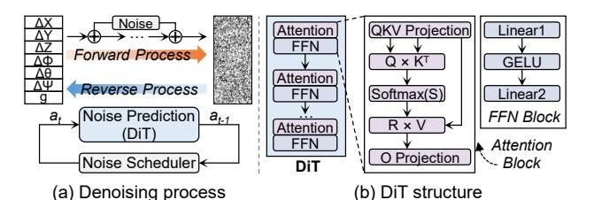
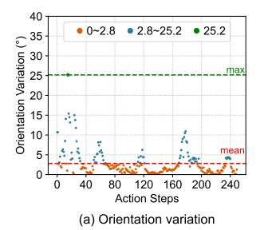
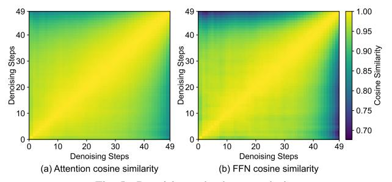

# I. Introduction

Embodied Artificial Intelligence (Embodied AI) plays a vital role in achieving Artificial General Intelligence (AGI) and serves as a critical foundation bridging cyberspace and the physical world [36], [37]. Recently, the emergence of multimodal Vision-Language-Action (VLA) models [3], [4], [19], [25], [26], [30], [59] has attracted significant attention

(b) DiT action planner with three-level computation
Fig. 1. Overview of the VLA system and DiT action planner.
due to their perception, reasoning, and planning capabilities,
making them a promising solution for the brain of robots.

As shown in Fig. 1(a), state-of-the-art VLA systems [54] typically comprise a vision-language model [11], [32] for semantic reasoning and a diffusion transformer (DiT) model [9], [39] for action planning, such as Physical Intelligence's  $\pi 0.5$  [23], NVIDIA's GR00T N1.5 [2], and Figure's Helix [13]. The vision-language model is less latency-sensitive and can even be offloaded to the cloud [21]. In contrast, the DiT-based action planner requires a high action frequency to enable real-time interactions with the environment. For instance, service robots typically demand at least a 50Hz action frequency, while industrial applications may require up to 200Hz [38], [45], [58]. However, even with high-performance GPUs, current DiT action planners are still constrained by low computational efficiency. For example, a DiT action planner with approximately 300M parameters and 50 iterative steps achieves only 2.6Hz on an NVIDIA A40 GPU, causing each robot task to take several minutes, which is far from the requirements of real-world deployment [19], [34].

The limited computational speed of DiT action planners primarily stems from their inherently three-level computation at trajectory, iteration, and model levels (Fig. 1(b)). At the trajectory level, each inference produces one action, and hundreds of inferences are commonly required to complete a task. For example, an average of 376 actions on the LIBERO

Fig. 2. Challenges and co-design solutions to accelerate DiT action planners.

simulation platform [34] leads to a long task execution time. At the iteration level, multiple denoising steps (typically 10-50) are required to refine an action from random noise, which significantly limits achievable action frequency. At the model level, multiple attention and feed-forward network (FFN) blocks are executed within each denoising step, further compounding the computational burden.

These three nested computing levels introduce extensive **redundancy** (see Fig. 2-Top), resulting in severe latency accumulation and highlighting the need for efficient optimization.

- (C1) Action redundancy at the trajectory level: A task trajectory usually contains hundreds of actions with complex and irregular paths. However, adjacent actions exhibit high consistency, where 55.2% of rotation vector variations are less than 2° and 97.2% of translation vector changes are smaller than 1cm, indicating a large number of redundant inferences.
- (C2) Denoising redundancy at the iteration level: Despite each action inference containing 10-50 denoising steps, the consecutive iteration features of attention and FFN show more than 98% similarity, with only minor data changes. Moreover, identical weight reloading in each iteration leads to 60.1% duplicate external memory accesses.
- (C3) Multimodality redundancy at the model level: Different input modalities exhibit distinct update frequencies. For example, language input remains unchanged throughout an entire task, while action input tokens vary at each iteration, having the shortest lifespan. Consequently, averaging 91.7% of multimodal inputs remains unchanged per iteration [19], leading to significant repeated computations. Additionally, action tokens demonstrate high column sparsity in attention scores, where over 52.0% of columns are near zero, offering opportunities to skip redundant attention operations.

Existing software- and hardware-based optimizations for DiT models primarily exploit iteration-level redundancy [14], [17], [28], [35], [42], [55], [57]. These methods skip the computation of regions with minimal changes in the image

TABLE I
DIT ACCELERATOR COMPARISON ON REDUNDANCY EXPLOITATION

| DiT Accelerators  | Trajectory Level | Iteration Level | Model Level |
|-------------------|---------------------|--------------------|----------------|
| Cambricon-D [28]  | ×                   | <b>V</b>           | ×              |
| Ditto [27]        | ×                   | <b>V</b>           | ×              |
| EXION [16]        | ×                   | V                  | V              |
| DiTPA (this work) | V                   | V                  | V              |

diffusion process, such as the background or contour. But they can not be directly applied to the action planner since actions do not have these attributes of images [6], [56]. Considering hardware solutions, as summarized in TABLE I, Cambricon-D [28] reduces the computational overhead by only computing the difference between adjacent iterations. Ditto [27] further combines the differential computing with the 4/8-bit quantization method. It substantially reduces the bandwidth requirements and skips nearly half of the zerovalue operations. Nevertheless, these accelerators with a differential computing method cannot effectively support the highprecision nonlinear operators such as GELU. Thereby, leading to severe external memory access traffic. In addition, EXION [16] exploits both the iteration and model-level redundancy to reduce FFN and attention computation, respectively. Despite identifying redundant FFN computations via GELU outputs and adopting the approximation method [41] to avoid the redundant high-precision attention computation, the resulting fine-grained sparsity challenges the hardware architecture with significant control overhead.

In this work, we present DiTPA, a DiT-based action-planner accelerator that exploits action-denoising-multimodality redundancy ( $C1\sim C3$ ) through software-hardware co-design.

The software framework of DiTPA is shown in Fig. 2-Middle. (S1) For the action redundancy at the trajectory level, an orientation-conditioned action prediction mechanism is introduced. It reduces the number of action inferences by

evaluating the orientation variation between adjacent actions. When the orientations remain consistent, the next inference is skipped, and the current action is reused based on the local concentration principle. (S2) For the iteration-level denoising redundancy, an alternating denoising with featurereuse method is developed. By evaluating the similarity of output features and their contribution to the loss, this method identifies iterations that can be safely skipped and replaces the full denoising computation with lightweight residual updates. Unlike existing fine-grained differential computing or unstructured sparsity approaches which merely reduce arithmetic operations. This method deploys feature reuse across both the attention and FFN blocks, simultaneously eliminating computation and memory access overhead. (S3) For the multimodality redundancy at the model level, a calibrated multimodal approximate computing scheme is designed. It dynamically determines unchanged vision and language modalities based on their lifespan and applies calibrated approximate computations to avoid attention-shift and cumulative errors. Meanwhile, column sparsity in the action modality is exploited to skip redundant attention computations.

To fully exploit the software optimization benefits, we design the DiTPA hardware architecture with three features shown in Fig. 2-Bottom. (H1) An action predictor is designed to efficiently exploit action redundancy with minimal overhead by reducing prediction complexity. (H2) A reconfigurable processing-element (PE) array is proposed to support various tiling scenarios. It allows matrix operations to be tiled along the invariant hidden-size dimension, independent of the changing token length among iterations, thereby improving computational resource utilization. (H3) A multimodal scheduler is developed to handle dynamic multimodal data buffering, reuse, and updates. It also integrates a column sparsity controller that detects sparse attention columns and dynamically skips corresponding computations.

The contributions of this work are summarized as follows:

- (1) We demystify computational redundancy of the DiT action planner in three dimensions: action redundancy at the trajectory-level, denoising redundancy at the iteration-level, and multimodality redundancy at the model-level.
- (2) We propose the DiTPA software framework to eliminate multi-level redundancies. The key strategies are orientation-conditioned action prediction, alternating denoising with feature-reuse, and calibrated multimodal approximate computing, which effectively exploit the redundancies in actions, denoising steps, and multimodality.
- (3) We develop a DiTPA hardware architecture to efficiently support the software framework. It features an action predictor with reduced prediction complexity, a reconfigurable PE array supporting varied token lengths with high utilization, and a multimodal scheduler handling dynamic and sparse data operations with low latency.
- (4) Experimental results show that the DiTPA obtains an action frequency of 217.65Hz and a task execution time of 1.73s. In addition, it achieves averagely  $386.93 \times$ ,  $13.22 \times$ ,  $9.54 \times$  speedups and  $2356.77 \times$ ,  $8.71 \times$ ,  $11.59 \times$  energy-efficiency

Fig. 3. DiT action planner's denoising process and detailed structure.

IABLE II

COMPARISON OF IMAGE GENERATION DIT AND ACTION PLANNING DIT

| Domain               | Image Generation   | Action Planning                          |
|----------------------|--------------------|------------------------------------------|
| Computation Level | Iteration-Model    | Trajectory- Iteration-Model           |
| Modality             | Vision, Language   | Vision, Language, Action, State, etc. |
| Input Length         | $\sim 10^2 - 10^3$ | $\sim 10^1 - 10^2$                       |

improvements over NVIDIA A40, EXION and Ditto, while maintaining the task success rate.

#### II. BACKGROUND AND MOTIVATION

#### A. DiT Action Planner

DiT-based action planners [9], [44] excel at modeling continuous action generation, making them suitable for complex long-horizon robot tasks. In this paper, we mainly focus on mainstream robotic arms for manipulation. Each output action includes 7 degrees of freedom (DoF), which can be divided into the translation vector  $(\Delta X, \Delta Y, \Delta Z)$ , rotation vector  $(\Delta \Phi, \Delta \Theta, \Delta \Psi)$ , and gripper state (g) [5], [43], [46], [51]. The translation vector represents the distance offset of the current action in Cartesian, the rotation vector indicates the orientation offset along each coordinate axis, and the gripper state can be open or closed.

Fig. 3(a) illustrates the denoising computation of the DiT action planner, consisting of forward and reverse diffusion processes [18], [47], similar to the DiT models for image generation [8], [15]. Forward diffusion adds noise to the original action, while reverse diffusion iteratively predicts and removes noise to obtain the final action, guided by the noise scheduler. In actual deployments, only the reverse process is performed to generate actions from input noise. The detailed structure of DiT is shown in Fig. 3(b), which comprises multiple attention and FFN blocks.

Compared to the image-generation DiTs, the DiT action planner exhibits several unique features, as summarized in TABLE II. First, its computation process is organized across three levels, including trajectory, iteration, and model, introducing additional temporal and spatial dependencies (Fig. 1), whereas image-generation DiTs only operate at the iteration-model level [10]. Second, while image-generation DiTs handle vision and language modalities, the action planner incorporates an additional action modality, and some robots further include state, tactile, and other modalities, enabling optimization opportunities for multimodality [1], [20]. Third, input token lengths vary significantly across modalities. For image-generation DiTs, vision and language token lengths typically range from hundreds to thousands [12], whereas action tokens

Fig. 4. Action redundancy analysis.

are less than one-tenth of this length, making token pruning for the action modality challenging [3]. These characteristics prevent the direct applicability of the existing image-generation DiT optimization method to DiT action planners.

#### B. Motivation

To fully explore the design space of the DiT action planner, we systematically analyze potential redundancies at each computation level, revealing that various data exhibit high redundancy during inference and may provide opportunities to improve the real-time performance of the DiT action planner.

1) Action Redundancy at the Trajectory-Level: During task execution, robots must maneuver around diverse obstacles to interact with targets, resulting in complex and disordered action trajectories that constrain the optimization space for action inference. Nevertheless, analysis of transitions between adjacent actions reveals high local concentration with minimal variation. To quantify this, we visualize the trends of action changes, extract rotation and translation vectors from 7 DoF actions, and compute absolute orientation and distance variations in 3D space [34], shown in Fig.4. Although the maximum orientation difference reaches 25.2°, the average is only 2.8°, covering 67.6% of the trajectory, indicating that most adjacent actions exhibit small orientation variations and form continuous trajectory segments without frequent oscillations. We refer to this phenomenon as local concentration. For trajectories with frequent abrupt orientation changes, such changes typically occur only during initialization and object-interaction phases. These orientation changes are further decomposed into coordinated multi-joint movements, allowing the robot to reach suitable poses for fine-grained operations, such as grasping. The maximum distance change between adjacent actions is only 1.1cm, and approximately 40% of movements vary by less than 0.6cm, reflecting in-place operations, such as releasing objects, that do not require movement of the end effector. These characteristics indicate that both orientation and distance variations are limited, enabling the prediction of future actions based on current small variations.

To verify the universality of orientation and distance variation trends in action trajectories, we evaluate 10 challenging robot tasks under 50 different initialization environments. We find that average orientation variation is only 2° with high local concentration, while average distance variation is only 0.5cm [34]. The trends in adjacent actions can be summarized as follows: (1) overall distance variation is small; (2) orientation exhibits strong local concentration with minimal variation.

Fig. 5. Denoising redundancy analysis.

Meanwhile, actions are more sensitive to orientation variations, which are prone to trajectory drift. These characteristics motivate the exploitation of action redundancy by inferring slowly changing actions based on locally concentrated orientations with small variations, thereby allowing the inference for future redundant actions to be skipped.

2) Denoising Redundancy at the Iteration-Level: Based on the characteristics of the reverse diffusion process, features of adjacent denoising steps generally exhibit a high degree of similarity, providing an opportunity to eliminate redundant computations and avoid duplicate weight reloading. Fig. 5 illustrates the attention and FFN output features similarity between adjacent denoising steps in the action planner. It is evident that adjacent denoising steps share very high similarity, exceeding 98%, indicating that the feature differences between consecutive iterations are minimal, similar to observations in other DiT applications, such as image-generation DiTs [39].

Meanwhile, the action planner exhibits several distinct redundancy patterns. (1) The similarity gradually decreases over the course of the denoising process, remaining very high in the early stages and becoming noticeably lower in the later stages. This indicates the potential to exploit the redundancy at the beginning of the process. (2) Despite the decreasing trend, the lowest similarity remains above 70%, reflecting substantial redundancy throughout the process. In contrast, the image-generation DiT only demonstrates high similarity at the diagonal, and rapidly decreases to around 0 in non-diagonal areas [39]. (3) The similarity trends of attention and FFN features are consistent, providing opportunities for iteration-wise optimization of both computation and memory access. These observations motivate the design of a mechanism that exploits iteration-wise redundancy at a coarse granularity, skipping the early, highly similar denoising steps while retaining later computations to ensure accuracy. This approach differs from fine-grained similarity utilization in existing diffusion architectures, which introduces complex control overhead and cannot fully avoid weight reloading.

3) Multimodality Redundancy at the Model-Level: During each denoising step, the input consists of action tokens and vision-language tokens from a pretrained vision-language model, forming a multimodal input, as shown in Fig. 6(a). Different modalities have varying token lengths and lifespans, leading to differences in computational workload and update frequency. Vision and language tokens account for about 90% of the input and are updated infrequently [19],

Fig. 6. Multimodality redundancy analysis.

Fig. 7. DiTPA software framework

with language tokens remaining unchanged throughout a task  $(L \times K \text{ model computations})$  and vision tokens stable across multiple denoising steps, while historical visual frames have even longer lifespans. In contrast, action tokens are updated every model computation, having the shortest lifespan. This analysis indicates that vision and language tokens dominate the input while incurring redundant computations, motivating dynamic skipping of computations for duplicate tokens.

Directly skipping action-modality tokens is difficult due to the lack of duplicate data. Nevertheless, we observe strong column sparsity in the action attention score map (Fig. 6(b), red box), with attention focused on few columns and near-zero elsewhere. To validate this attention distribution pattern, we evaluate it across the robot taskset and find an average column sparsity of approximately 52%. This observation motivates further removal of computations corresponding to sparse columns in the action modality.

# I. Introduction

Embodied Artificial Intelligence (Embodied AI) plays a vital role in achieving Artificial General Intelligence (AGI) and serves as a critical foundation bridging cyberspace and the physical world [36], [37]. Recently, the emergence of multimodal Vision-Language-Action (VLA) models [3], [4], [19], [25], [26], [30], [59] has attracted significant attention

(b) DiT action planner with three-level computation
Fig. 1. Overview of the VLA system and DiT action planner.
due to their perception, reasoning, and planning capabilities,
making them a promising solution for the brain of robots.

As shown in Fig. 1(a), state-of-the-art VLA systems [54] typically comprise a vision-language model [11], [32] for semantic reasoning and a diffusion transformer (DiT) model [9], [39] for action planning, such as Physical Intelligence's  $\pi 0.5$  [23], NVIDIA's GR00T N1.5 [2], and Figure's Helix [13]. The vision-language model is less latency-sensitive and can even be offloaded to the cloud [21]. In contrast, the DiT-based action planner requires a high action frequency to enable real-time interactions with the environment. For instance, service robots typically demand at least a 50Hz action frequency, while industrial applications may require up to 200Hz [38], [45], [58]. However, even with high-performance GPUs, current DiT action planners are still constrained by low computational efficiency. For example, a DiT action planner with approximately 300M parameters and 50 iterative steps achieves only 2.6Hz on an NVIDIA A40 GPU, causing each robot task to take several minutes, which is far from the requirements of real-world deployment [19], [34].

The limited computational speed of DiT action planners primarily stems from their inherently three-level computation at trajectory, iteration, and model levels (Fig. 1(b)). At the trajectory level, each inference produces one action, and hundreds of inferences are commonly required to complete a task. For example, an average of 376 actions on the LIBERO

Fig. 2. Challenges and co-design solutions to accelerate DiT action planners.

simulation platform [34] leads to a long task execution time. At the iteration level, multiple denoising steps (typically 10-50) are required to refine an action from random noise, which significantly limits achievable action frequency. At the model level, multiple attention and feed-forward network (FFN) blocks are executed within each denoising step, further compounding the computational burden.

These three nested computing levels introduce extensive **redundancy** (see Fig. 2-Top), resulting in severe latency accumulation and highlighting the need for efficient optimization.

- (C1) Action redundancy at the trajectory level: A task trajectory usually contains hundreds of actions with complex and irregular paths. However, adjacent actions exhibit high consistency, where 55.2% of rotation vector variations are less than 2° and 97.2% of translation vector changes are smaller than 1cm, indicating a large number of redundant inferences.
- (C2) Denoising redundancy at the iteration level: Despite each action inference containing 10-50 denoising steps, the consecutive iteration features of attention and FFN show more than 98% similarity, with only minor data changes. Moreover, identical weight reloading in each iteration leads to 60.1% duplicate external memory accesses.
- (C3) Multimodality redundancy at the model level: Different input modalities exhibit distinct update frequencies. For example, language input remains unchanged throughout an entire task, while action input tokens vary at each iteration, having the shortest lifespan. Consequently, averaging 91.7% of multimodal inputs remains unchanged per iteration [19], leading to significant repeated computations. Additionally, action tokens demonstrate high column sparsity in attention scores, where over 52.0% of columns are near zero, offering opportunities to skip redundant attention operations.

Existing software- and hardware-based optimizations for DiT models primarily exploit iteration-level redundancy [14], [17], [28], [35], [42], [55], [57]. These methods skip the computation of regions with minimal changes in the image

TABLE I
DIT ACCELERATOR COMPARISON ON REDUNDANCY EXPLOITATION

| DiT Accelerators  | Trajectory Level | Iteration Level | Model Level |
|-------------------|---------------------|--------------------|----------------|
| Cambricon-D [28]  | ×                   | <b>V</b>           | ×              |
| Ditto [27]        | ×                   | <b>V</b>           | ×              |
| EXION [16]        | ×                   | V                  | V              |
| DiTPA (this work) | V                   | V                  | V              |

diffusion process, such as the background or contour. But they can not be directly applied to the action planner since actions do not have these attributes of images [6], [56]. Considering hardware solutions, as summarized in TABLE I, Cambricon-D [28] reduces the computational overhead by only computing the difference between adjacent iterations. Ditto [27] further combines the differential computing with the 4/8-bit quantization method. It substantially reduces the bandwidth requirements and skips nearly half of the zerovalue operations. Nevertheless, these accelerators with a differential computing method cannot effectively support the highprecision nonlinear operators such as GELU. Thereby, leading to severe external memory access traffic. In addition, EXION [16] exploits both the iteration and model-level redundancy to reduce FFN and attention computation, respectively. Despite identifying redundant FFN computations via GELU outputs and adopting the approximation method [41] to avoid the redundant high-precision attention computation, the resulting fine-grained sparsity challenges the hardware architecture with significant control overhead.

In this work, we present DiTPA, a DiT-based action-planner accelerator that exploits action-denoising-multimodality redundancy ( $C1\sim C3$ ) through software-hardware co-design.

The software framework of DiTPA is shown in Fig. 2-Middle. (S1) For the action redundancy at the trajectory level, an orientation-conditioned action prediction mechanism is introduced. It reduces the number of action inferences by

evaluating the orientation variation between adjacent actions. When the orientations remain consistent, the next inference is skipped, and the current action is reused based on the local concentration principle. (S2) For the iteration-level denoising redundancy, an alternating denoising with featurereuse method is developed. By evaluating the similarity of output features and their contribution to the loss, this method identifies iterations that can be safely skipped and replaces the full denoising computation with lightweight residual updates. Unlike existing fine-grained differential computing or unstructured sparsity approaches which merely reduce arithmetic operations. This method deploys feature reuse across both the attention and FFN blocks, simultaneously eliminating computation and memory access overhead. (S3) For the multimodality redundancy at the model level, a calibrated multimodal approximate computing scheme is designed. It dynamically determines unchanged vision and language modalities based on their lifespan and applies calibrated approximate computations to avoid attention-shift and cumulative errors. Meanwhile, column sparsity in the action modality is exploited to skip redundant attention computations.

To fully exploit the software optimization benefits, we design the DiTPA hardware architecture with three features shown in Fig. 2-Bottom. (H1) An action predictor is designed to efficiently exploit action redundancy with minimal overhead by reducing prediction complexity. (H2) A reconfigurable processing-element (PE) array is proposed to support various tiling scenarios. It allows matrix operations to be tiled along the invariant hidden-size dimension, independent of the changing token length among iterations, thereby improving computational resource utilization. (H3) A multimodal scheduler is developed to handle dynamic multimodal data buffering, reuse, and updates. It also integrates a column sparsity controller that detects sparse attention columns and dynamically skips corresponding computations.

The contributions of this work are summarized as follows:

- (1) We demystify computational redundancy of the DiT action planner in three dimensions: action redundancy at the trajectory-level, denoising redundancy at the iteration-level, and multimodality redundancy at the model-level.
- (2) We propose the DiTPA software framework to eliminate multi-level redundancies. The key strategies are orientation-conditioned action prediction, alternating denoising with feature-reuse, and calibrated multimodal approximate computing, which effectively exploit the redundancies in actions, denoising steps, and multimodality.
- (3) We develop a DiTPA hardware architecture to efficiently support the software framework. It features an action predictor with reduced prediction complexity, a reconfigurable PE array supporting varied token lengths with high utilization, and a multimodal scheduler handling dynamic and sparse data operations with low latency.
- (4) Experimental results show that the DiTPA obtains an action frequency of 217.65Hz and a task execution time of 1.73s. In addition, it achieves averagely  $386.93 \times$ ,  $13.22 \times$ ,  $9.54 \times$  speedups and  $2356.77 \times$ ,  $8.71 \times$ ,  $11.59 \times$  energy-efficiency

Fig. 3. DiT action planner's denoising process and detailed structure.

IABLE II

COMPARISON OF IMAGE GENERATION DIT AND ACTION PLANNING DIT

| Domain               | Image Generation   | Action Planning                          |
|----------------------|--------------------|------------------------------------------|
| Computation Level | Iteration-Model    | Trajectory- Iteration-Model           |
| Modality             | Vision, Language   | Vision, Language, Action, State, etc. |
| Input Length         | $\sim 10^2 - 10^3$ | $\sim 10^1 - 10^2$                       |

improvements over NVIDIA A40, EXION and Ditto, while maintaining the task success rate.

#### II. BACKGROUND AND MOTIVATION

#### A. DiT Action Planner

DiT-based action planners [9], [44] excel at modeling continuous action generation, making them suitable for complex long-horizon robot tasks. In this paper, we mainly focus on mainstream robotic arms for manipulation. Each output action includes 7 degrees of freedom (DoF), which can be divided into the translation vector  $(\Delta X, \Delta Y, \Delta Z)$ , rotation vector  $(\Delta \Phi, \Delta \Theta, \Delta \Psi)$ , and gripper state (g) [5], [43], [46], [51]. The translation vector represents the distance offset of the current action in Cartesian, the rotation vector indicates the orientation offset along each coordinate axis, and the gripper state can be open or closed.

Fig. 3(a) illustrates the denoising computation of the DiT action planner, consisting of forward and reverse diffusion processes [18], [47], similar to the DiT models for image generation [8], [15]. Forward diffusion adds noise to the original action, while reverse diffusion iteratively predicts and removes noise to obtain the final action, guided by the noise scheduler. In actual deployments, only the reverse process is performed to generate actions from input noise. The detailed structure of DiT is shown in Fig. 3(b), which comprises multiple attention and FFN blocks.

Compared to the image-generation DiTs, the DiT action planner exhibits several unique features, as summarized in TABLE II. First, its computation process is organized across three levels, including trajectory, iteration, and model, introducing additional temporal and spatial dependencies (Fig. 1), whereas image-generation DiTs only operate at the iteration-model level [10]. Second, while image-generation DiTs handle vision and language modalities, the action planner incorporates an additional action modality, and some robots further include state, tactile, and other modalities, enabling optimization opportunities for multimodality [1], [20]. Third, input token lengths vary significantly across modalities. For image-generation DiTs, vision and language token lengths typically range from hundreds to thousands [12], whereas action tokens

Fig. 4. Action redundancy analysis.

are less than one-tenth of this length, making token pruning for the action modality challenging [3]. These characteristics prevent the direct applicability of the existing image-generation DiT optimization method to DiT action planners.

#### B. Motivation

To fully explore the design space of the DiT action planner, we systematically analyze potential redundancies at each computation level, revealing that various data exhibit high redundancy during inference and may provide opportunities to improve the real-time performance of the DiT action planner.

1) Action Redundancy at the Trajectory-Level: During task execution, robots must maneuver around diverse obstacles to interact with targets, resulting in complex and disordered action trajectories that constrain the optimization space for action inference. Nevertheless, analysis of transitions between adjacent actions reveals high local concentration with minimal variation. To quantify this, we visualize the trends of action changes, extract rotation and translation vectors from 7 DoF actions, and compute absolute orientation and distance variations in 3D space [34], shown in Fig.4. Although the maximum orientation difference reaches 25.2°, the average is only 2.8°, covering 67.6% of the trajectory, indicating that most adjacent actions exhibit small orientation variations and form continuous trajectory segments without frequent oscillations. We refer to this phenomenon as local concentration. For trajectories with frequent abrupt orientation changes, such changes typically occur only during initialization and object-interaction phases. These orientation changes are further decomposed into coordinated multi-joint movements, allowing the robot to reach suitable poses for fine-grained operations, such as grasping. The maximum distance change between adjacent actions is only 1.1cm, and approximately 40% of movements vary by less than 0.6cm, reflecting in-place operations, such as releasing objects, that do not require movement of the end effector. These characteristics indicate that both orientation and distance variations are limited, enabling the prediction of future actions based on current small variations.

To verify the universality of orientation and distance variation trends in action trajectories, we evaluate 10 challenging robot tasks under 50 different initialization environments. We find that average orientation variation is only 2° with high local concentration, while average distance variation is only 0.5cm [34]. The trends in adjacent actions can be summarized as follows: (1) overall distance variation is small; (2) orientation exhibits strong local concentration with minimal variation.

Fig. 5. Denoising redundancy analysis.

Meanwhile, actions are more sensitive to orientation variations, which are prone to trajectory drift. These characteristics motivate the exploitation of action redundancy by inferring slowly changing actions based on locally concentrated orientations with small variations, thereby allowing the inference for future redundant actions to be skipped.

2) Denoising Redundancy at the Iteration-Level: Based on the characteristics of the reverse diffusion process, features of adjacent denoising steps generally exhibit a high degree of similarity, providing an opportunity to eliminate redundant computations and avoid duplicate weight reloading. Fig. 5 illustrates the attention and FFN output features similarity between adjacent denoising steps in the action planner. It is evident that adjacent denoising steps share very high similarity, exceeding 98%, indicating that the feature differences between consecutive iterations are minimal, similar to observations in other DiT applications, such as image-generation DiTs [39].

Meanwhile, the action planner exhibits several distinct redundancy patterns. (1) The similarity gradually decreases over the course of the denoising process, remaining very high in the early stages and becoming noticeably lower in the later stages. This indicates the potential to exploit the redundancy at the beginning of the process. (2) Despite the decreasing trend, the lowest similarity remains above 70%, reflecting substantial redundancy throughout the process. In contrast, the image-generation DiT only demonstrates high similarity at the diagonal, and rapidly decreases to around 0 in non-diagonal areas [39]. (3) The similarity trends of attention and FFN features are consistent, providing opportunities for iteration-wise optimization of both computation and memory access. These observations motivate the design of a mechanism that exploits iteration-wise redundancy at a coarse granularity, skipping the early, highly similar denoising steps while retaining later computations to ensure accuracy. This approach differs from fine-grained similarity utilization in existing diffusion architectures, which introduces complex control overhead and cannot fully avoid weight reloading.

3) Multimodality Redundancy at the Model-Level: During each denoising step, the input consists of action tokens and vision-language tokens from a pretrained vision-language model, forming a multimodal input, as shown in Fig. 6(a). Different modalities have varying token lengths and lifespans, leading to differences in computational workload and update frequency. Vision and language tokens account for about 90% of the input and are updated infrequently [19],

Fig. 6. Multimodality redundancy analysis.

Fig. 7. DiTPA software framework

with language tokens remaining unchanged throughout a task  $(L \times K \text{ model computations})$  and vision tokens stable across multiple denoising steps, while historical visual frames have even longer lifespans. In contrast, action tokens are updated every model computation, having the shortest lifespan. This analysis indicates that vision and language tokens dominate the input while incurring redundant computations, motivating dynamic skipping of computations for duplicate tokens.

Directly skipping action-modality tokens is difficult due to the lack of duplicate data. Nevertheless, we observe strong column sparsity in the action attention score map (Fig. 6(b), red box), with attention focused on few columns and near-zero elsewhere. To validate this attention distribution pattern, we evaluate it across the robot taskset and find an average column sparsity of approximately 52%. This observation motivates further removal of computations corresponding to sparse columns in the action modality.

