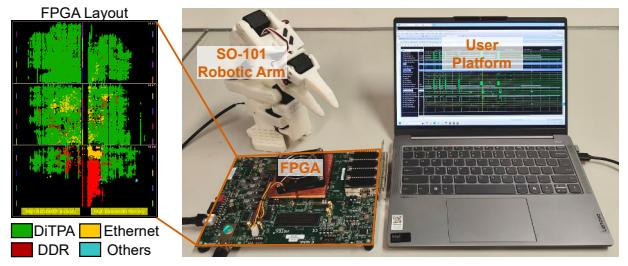

# VI. DISCUSSION

**Transfer to Higher-dimensional Actions.** Scaling DiTPA to higher-dimensional action spaces, such as bimanual robotic systems, may complicate the exploitation of action-level redundancy. In the current single-arm setting, DiTPA identifies

TABLE IX Success Rate of  $\pi 0.5$  and GR00T N1.5

| Models       | Methods     |         | LIBERO Tasks |      |      |         |  |  |
|--------------|-------------|---------|--------------|------|------|---------|--|--|
| 11104015     | 11101110110 | Spatial | Object       | Goal | Long | Average |  |  |
| $\pi 0.5$    | Baseline    | 96%     | 82%          | 90%  | 74%  | 85.5%   |  |  |
| NO.5         | DiTPA       | 96%     | 81%          | 90%  | 73%  | 85.0%   |  |  |
| GR00T N1 5   | Baseline    | 99%     | 96%          | 95%  | 81%  | 92.8%   |  |  |
| 011001 111.5 | DiTPA       | 97%     | 96%          | 95%  | 80%  | 92.0%   |  |  |

Fig. 24. Normalized action frequency of  $\pi 0.5$  and GR00T N1.5.

Fig. 25. Deployment on Lerobot SO-101 robotic arm.

redundant actions based on small orientation variations along the action trajectory. However, in bimanual manipulation, the two arms may exhibit different motion patterns and redundancy characteristics, making it difficult to directly reuse the single-arm redundancy-exploitation strategy. A potential direction to address this challenge is to decouple the action trajectories of the two arms and exploit their redundancy independently, so that action reuse can be determined in an arm-specific manner rather than using a unified criterion for the entire bimanual action space.

Transfer to Other Transformer-based VLAs. Since consecutive action similarity and multimodal redundancy are inherent robotic characteristics, DiTPA's co-design methodology can be transferred to future VLA models. In other domains, DiTPA can be potentially extended to navigation-oriented VLA models, such as NaVILA [7]. In these models, both action-level and multimodal redundancies may be exploited: smooth actions can be skipped during uniform or straightline motion, while the multimodal processing pipeline provides opportunities for redundancy-aware computation reduction.

## VII. CONCLUSION

We present DiTPA, a software-hardware co-designed accelerator for DiT-based action planners. It achieves high action frequency by exploiting three levels of redundancy: action, denoising, and multimodality. The DiTPA software framework includes: Orientation-conditioned action prediction to skip inference when orientation variation is minimal. Alternating denoising with feature reuse to eliminate computation of nearidentical features. Calibrated multimodal approximate computing that removes redundant modalities using lifespan analysis and column sparsity. Consequently, the designed DiTPA hardware architecture integrates a dedicated action predictor, reconfigurable PE array, and multimodal scheduler, fully converting redundancy into performance and energy gains. Results show that DiTPA achieves averagely 386.93×, 13.22×, 9.54× speedups and  $2356.77 \times$ ,  $8.71 \times$ ,  $11.59 \times$  energy-efficiency improvements over NVIDIA A40, EXION, and Ditto.

### ACKNOWLEDGEMENTS

This research was supported in part by NSFC Grant 62422407, RGC Grant 26204424, STG3/E-605/25-N, and partially conducted by ACCESS - AI Chip Center for Emerging Smart Systems, supported by the InnoHK initiative of the Innovation and Technology Commission of the Hong Kong Special Administrative Region Government.

# VI. DISCUSSION

**Transfer to Higher-dimensional Actions.** Scaling DiTPA to higher-dimensional action spaces, such as bimanual robotic systems, may complicate the exploitation of action-level redundancy. In the current single-arm setting, DiTPA identifies

TABLE IX Success Rate of  $\pi 0.5$  and GR00T N1.5

| Models       | Methods     |         | LIBERO Tasks |      |      |         |  |  |
|--------------|-------------|---------|--------------|------|------|---------|--|--|
| 11104015     | 11101110110 | Spatial | Object       | Goal | Long | Average |  |  |
| $\pi 0.5$    | Baseline    | 96%     | 82%          | 90%  | 74%  | 85.5%   |  |  |
| NO.5         | DiTPA       | 96%     | 81%          | 90%  | 73%  | 85.0%   |  |  |
| GR00T N1 5   | Baseline    | 99%     | 96%          | 95%  | 81%  | 92.8%   |  |  |
| 011001 111.5 | DiTPA       | 97%     | 96%          | 95%  | 80%  | 92.0%   |  |  |

Fig. 24. Normalized action frequency of  $\pi 0.5$  and GR00T N1.5.

Fig. 25. Deployment on Lerobot SO-101 robotic arm.

redundant actions based on small orientation variations along the action trajectory. However, in bimanual manipulation, the two arms may exhibit different motion patterns and redundancy characteristics, making it difficult to directly reuse the single-arm redundancy-exploitation strategy. A potential direction to address this challenge is to decouple the action trajectories of the two arms and exploit their redundancy independently, so that action reuse can be determined in an arm-specific manner rather than using a unified criterion for the entire bimanual action space.

Transfer to Other Transformer-based VLAs. Since consecutive action similarity and multimodal redundancy are inherent robotic characteristics, DiTPA's co-design methodology can be transferred to future VLA models. In other domains, DiTPA can be potentially extended to navigation-oriented VLA models, such as NaVILA [7]. In these models, both action-level and multimodal redundancies may be exploited: smooth actions can be skipped during uniform or straightline motion, while the multimodal processing pipeline provides opportunities for redundancy-aware computation reduction.

## VII. CONCLUSION

We present DiTPA, a software-hardware co-designed accelerator for DiT-based action planners. It achieves high action frequency by exploiting three levels of redundancy: action, denoising, and multimodality. The DiTPA software framework includes: Orientation-conditioned action prediction to skip inference when orientation variation is minimal. Alternating denoising with feature reuse to eliminate computation of nearidentical features. Calibrated multimodal approximate computing that removes redundant modalities using lifespan analysis and column sparsity. Consequently, the designed DiTPA hardware architecture integrates a dedicated action predictor, reconfigurable PE array, and multimodal scheduler, fully converting redundancy into performance and energy gains. Results show that DiTPA achieves averagely 386.93×, 13.22×, 9.54× speedups and  $2356.77 \times$ ,  $8.71 \times$ ,  $11.59 \times$  energy-efficiency improvements over NVIDIA A40, EXION, and Ditto.

### ACKNOWLEDGEMENTS

This research was supported in part by NSFC Grant 62422407, RGC Grant 26204424, STG3/E-605/25-N, and partially conducted by ACCESS - AI Chip Center for Emerging Smart Systems, supported by the InnoHK initiative of the Innovation and Technology Commission of the Hong Kong Special Administrative Region Government.

