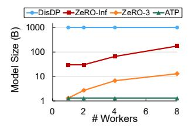
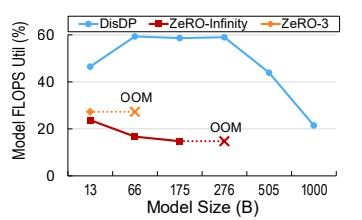

# *A. Experimental Setup*

Workloads. We choose OPT models [\[115\]](#page-15-13) and our custom models of different sizes listed in Table [V.](#page-8-0) Our results can be generalized to other LLMs such as Llama [\[8\]](#page-13-13) since their computation/collective patterns are similar.

In each of the evaluation experiments, we select the largest model size that the baselines can train under the corresponding configuration, which is 175B for Subsection [IV-C,](#page-9-1) [IV-E,](#page-10-0) and end-to-end breakdown and MPS comparison in Subsection [IV-D,](#page-9-2) 30B for SHARP comparison in Subsection [IV-D,](#page-9-2) 13B for Subsection [IV-G.](#page-11-0) The sequence length is set to 1024 for all experiments.

Evaluated Cluster. We evaluate DisDP and baselines on an 8-worker cluster, each worker with dual Intel Xeon Silver 4214 CPUs, 256 GB DDR4 memory, 1× NVIDIA A100 40GB GPU, and system-specific network and SSDs. All machines are connected by 100Gbps network. We will introduce the network and SSD settings of DisDP and baselines below.

DisDP's Configurations. We evaluate DisDP on the cluster with 8 machines (each with 1 GPU and 1 SmartNIC connected to a SmartSwitch [\[116\]](#page-15-14)) plus a PS. The PS equips dual Intel Xeon Gold 5320 CPUs, 12 SSDs, and a SmartNIC. We implement SmartNICs on Xilinx Alveo U50 FPGAs. Tables [VI](#page-8-1) and [VII](#page-8-2) show the resource consumption of SmartNICs and the SmartSwitch logic. DisDP enables activation checkpointing [\[117\]](#page-15-15), [\[118\]](#page-15-16) and bf16 training [\[113\]](#page-15-11).

Baselines. We use four systems as our baselines.

The first baseline is ZeRO-Infinity [\[57\]](#page-14-6), an MSDP system that distributes the model states in workers' SSDs. We evaluate ZeRO-Infinity on the cluster with 8 machines, and 1 Mellanox SN2700 switch [\[119\]](#page-15-17). Each machine features 2 SSDs (16 in total[6](#page-8-3) ), 1 GPU, and 1 CX-5 NIC connected to the switch. We run ZeRO-Infinity on DeepSpeed 0.9.3 [\[120\]](#page-15-18) and NCCL 2.20.5 with activation checkpointing and bf16 training.

The second baseline is ZeRO-Offload [\[56\]](#page-14-22), which is used as an alternative to ZeRO-Infinity for experiments on the NVLink machine (Subsection [IV-G\)](#page-11-0), because the NVLink machine we rent does not support plugging ad-hoc SSDs and thus

6ZeRO-Infinity equips 4 more SSDs than DisDP because our SSDs provide different I/O bandwidth on PCIe Gen 3 worker machine of ZeRO-Infinity and Gen 4 PS machine of DisDP. Our configuration ensures both systems have 26 GB/s aggregated I/O bandwidth per direction with 1:1 mixed read/write.

TABLE VI HARDWARE RESOURCE CONSUMPTION OF SMARTNIC.

| LUT     | FF      | BRAM    | URAM    |
|---------|---------|---------|---------|
| 135K    | 225K    | 354     | 128     |
| (15.5%) | (12.9%) | (26.3%) | (20.0%) |

TABLE VII HARDWARE RESOURCE CONSUMPTION OF SMARTSWITCH.

| Stage   | MAT     | TCAM    | VLIW    | Register | SRAM    |
|---------|---------|---------|---------|----------|---------|
| 11      | 99      | 111B    | 1.64Kb  | 37       | 48 MiB  |
| (91.7%) | (51.6%) | (28.9%) | (12.0%) | (77.1%)  | (39.5%) |

Fig. 14. Maximum trainable model size.

Fig. 15. Maximum MFU on different models.

we cannot achieve high performance from ZeRO-Infinity that relies on more SSDs to efficiently train a large model. We run ZeRO-Offload with the same configuration as ZeRO-Infinity, except that the model states are stored in CPU memory rather than SSDs.

The third baseline is ZeRO-3 [\[50\]](#page-14-26), which adopts MSDP but keeps the model state shard in GPU memory instead of CPU memory or SSDs. We run ZeRO-3 on the same cluster and with the same configuration as that in ZeRO-Infinity, except that model states are kept in GPU memory.

The fourth baseline is ATP [\[66\]](#page-14-7), a SmartSwitch-enhanced MRDP system that provides coupled push-pull primitives (same semantics as AllReduce). We run ATP on the cluster with 8 machines, 8 GPUs, 8 CX-5 NICs, and 1 SmartSwitch. Each machine has 1 GPU and 1 NIC connected to the SmartSwitch. We run ATP on PyTorch 1.9.1 [\[121\]](#page-15-19) with activation checkpointing and bf16 training.

# *A. Experimental Setup*

Workloads. We choose OPT models [\[115\]](#page-15-13) and our custom models of different sizes listed in Table [V.](#page-8-0) Our results can be generalized to other LLMs such as Llama [\[8\]](#page-13-13) since their computation/collective patterns are similar.

In each of the evaluation experiments, we select the largest model size that the baselines can train under the corresponding configuration, which is 175B for Subsection [IV-C,](#page-9-1) [IV-E,](#page-10-0) and end-to-end breakdown and MPS comparison in Subsection [IV-D,](#page-9-2) 30B for SHARP comparison in Subsection [IV-D,](#page-9-2) 13B for Subsection [IV-G.](#page-11-0) The sequence length is set to 1024 for all experiments.

Evaluated Cluster. We evaluate DisDP and baselines on an 8-worker cluster, each worker with dual Intel Xeon Silver 4214 CPUs, 256 GB DDR4 memory, 1× NVIDIA A100 40GB GPU, and system-specific network and SSDs. All machines are connected by 100Gbps network. We will introduce the network and SSD settings of DisDP and baselines below.

DisDP's Configurations. We evaluate DisDP on the cluster with 8 machines (each with 1 GPU and 1 SmartNIC connected to a SmartSwitch [\[116\]](#page-15-14)) plus a PS. The PS equips dual Intel Xeon Gold 5320 CPUs, 12 SSDs, and a SmartNIC. We implement SmartNICs on Xilinx Alveo U50 FPGAs. Tables [VI](#page-8-1) and [VII](#page-8-2) show the resource consumption of SmartNICs and the SmartSwitch logic. DisDP enables activation checkpointing [\[117\]](#page-15-15), [\[118\]](#page-15-16) and bf16 training [\[113\]](#page-15-11).

Baselines. We use four systems as our baselines.

The first baseline is ZeRO-Infinity [\[57\]](#page-14-6), an MSDP system that distributes the model states in workers' SSDs. We evaluate ZeRO-Infinity on the cluster with 8 machines, and 1 Mellanox SN2700 switch [\[119\]](#page-15-17). Each machine features 2 SSDs (16 in total[6](#page-8-3) ), 1 GPU, and 1 CX-5 NIC connected to the switch. We run ZeRO-Infinity on DeepSpeed 0.9.3 [\[120\]](#page-15-18) and NCCL 2.20.5 with activation checkpointing and bf16 training.

The second baseline is ZeRO-Offload [\[56\]](#page-14-22), which is used as an alternative to ZeRO-Infinity for experiments on the NVLink machine (Subsection [IV-G\)](#page-11-0), because the NVLink machine we rent does not support plugging ad-hoc SSDs and thus

6ZeRO-Infinity equips 4 more SSDs than DisDP because our SSDs provide different I/O bandwidth on PCIe Gen 3 worker machine of ZeRO-Infinity and Gen 4 PS machine of DisDP. Our configuration ensures both systems have 26 GB/s aggregated I/O bandwidth per direction with 1:1 mixed read/write.

TABLE VI HARDWARE RESOURCE CONSUMPTION OF SMARTNIC.

| LUT     | FF      | BRAM    | URAM    |
|---------|---------|---------|---------|
| 135K    | 225K    | 354     | 128     |
| (15.5%) | (12.9%) | (26.3%) | (20.0%) |

TABLE VII HARDWARE RESOURCE CONSUMPTION OF SMARTSWITCH.

| Stage   | MAT     | TCAM    | VLIW    | Register | SRAM    |
|---------|---------|---------|---------|----------|---------|
| 11      | 99      | 111B    | 1.64Kb  | 37       | 48 MiB  |
| (91.7%) | (51.6%) | (28.9%) | (12.0%) | (77.1%)  | (39.5%) |

Fig. 14. Maximum trainable model size.

Fig. 15. Maximum MFU on different models.

we cannot achieve high performance from ZeRO-Infinity that relies on more SSDs to efficiently train a large model. We run ZeRO-Offload with the same configuration as ZeRO-Infinity, except that the model states are stored in CPU memory rather than SSDs.

The third baseline is ZeRO-3 [\[50\]](#page-14-26), which adopts MSDP but keeps the model state shard in GPU memory instead of CPU memory or SSDs. We run ZeRO-3 on the same cluster and with the same configuration as that in ZeRO-Infinity, except that model states are kept in GPU memory.

The fourth baseline is ATP [\[66\]](#page-14-7), a SmartSwitch-enhanced MRDP system that provides coupled push-pull primitives (same semantics as AllReduce). We run ATP on the cluster with 8 machines, 8 GPUs, 8 CX-5 NICs, and 1 SmartSwitch. Each machine has 1 GPU and 1 NIC connected to the SmartSwitch. We run ATP on PyTorch 1.9.1 [\[121\]](#page-15-19) with activation checkpointing and bf16 training.

