# *B. Maximum Trainable Model Size*

We compare the maximum trainable model sizes between DisDP and baselines when varying the number of workers, as shown in Figure [14.](#page-8-4) We make three observations.

First, DisDP allows the constant, maximum trainable model size 1T that is bounded by the size of a single layer to fit in GPU memory, because DisDP disaggregates storage so that both worker CPU and GPU do not have to accommodate the entire model state shard. In contrast, ZeRO-Infinity with 8 worker machines can train only a 175B model, whose size is smaller than that of DisDP, because the sharded model states require each worker to prepare auxiliary temporary buffers on the CPU memory for GPU-CPU-SSD communications, and thus limits the maximum trainable model size. Second, when employing an increasing number of workers, ZeRO-3 and ZeRO-Infinity increase the trainable model size, because they rely on aggregated GPU, CPU memory, and NVMe storage of worker machines to execute the distributed optimizer. However, its maximum trainable model size cannot exceed that

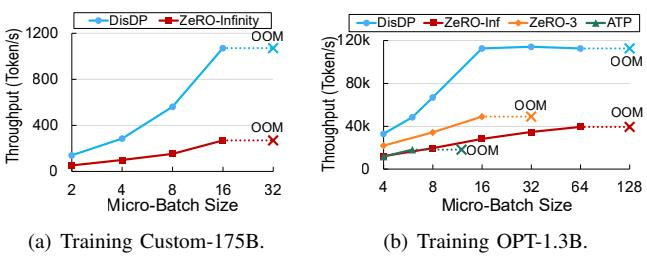

Fig. 16. Throughput comparison when training on 8 distributed GPUs with different micro-batch sizes.

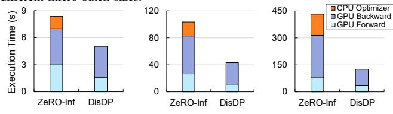

(a) Training OPT-1.3B (b) Training OPT-30B (c) Training Customwith a micro-batch size with a micro-batch size 175B with a micro-batch of 64. of 32. size of 16.

Fig. 17. Execution breakdown comparison.

of DisDP's to accommodate a single layer on GPU memory. Third, ATP is only able to train a 1.3B model, because it is based on MRDP which replicates the entire model states across all GPUs, bounding its maximum trainable model size.

## C. End-to-End Throughput/MFU Comparison

Throughput w.r.t. Batch Size. Figure 16(a) shows the comparison of DisDP and ZeRO-Infinity on the 175B model. DisDP achieves up to 134 token/s, 3.98× larger than ZeRO-Infinity. The execution breakdown of an iteration in Figure 17 shows the sources of performance gain: 1) DisDP achieves a significantly shorter time for the forward and the backward stages than ZeRO-Infinity because the heavy collectives bottlenecks in the two stages of ZeRO-Infinity. In contrast, DisDP eliminates the interference between compute and collectives by performing collectives on SmartNICs, and uses SmartSwitch-assisted reliable protocol to further reduce the collective traffic, thus achieving high GPU utilization. 2) The PS additionally hides the CPU optimizer behind the GPU backward stage. Notably, DisDP has more benefits as model size increases.

Figure 16(b) shows a comparison of DisDP and the baselines on the OPT-1.3B model. DisDP achieves up to 14.1K tokens/s, which is  $2.90\times$ ,  $2.33\times$ , and  $6.28\times$  larger than ZeRO-Infinity, ZeRO-3, and ATP at their peak throughput respectively. We make two observations.

First, DisDP achieves even higher throughput than ZeRO-3 and ATP, though DisDP stores the model states in slow SSDs in PS, while ZeRO-3 and ATP accommodate the model states in fast GPU memory, because DisDP completely eliminates compute-network interference, while the baselines do not due to partial aggregation of compute, network, and storage.

Second, DisDP's throughput saturates when the micro-batch size is larger than 16. Figure 18(b) shows the source of the saturation: DisDP's computation time within an iteration grows linearly as micro-batch size grows, and is roughly the same as collective time at micro-batch size of 16. Since

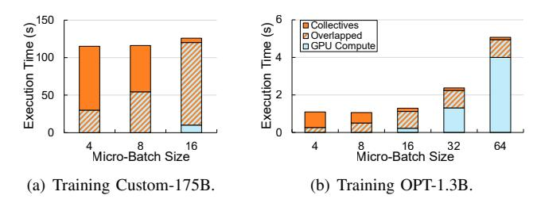

Fig. 18. Breakdown of compute and collectives running DisDP.

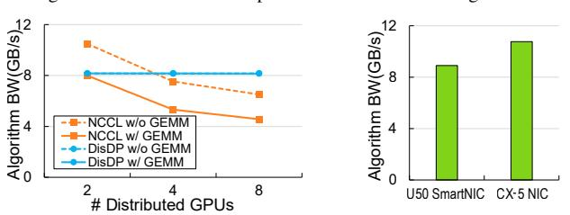

Fig. 19. Algorithm bandwidth of different collective primitives.

Fig. 20. DMA capability comparison.

collective traffic is decided only by the model, the collective time within an iteration does not change when the microbatch size changes. Thus, collectives are almost fully hidden behind computation at micro-batch sizes larger than 16 when there is no interference, and the training time is bounded by GPU computation instead of network bandwidth. Therefore, the saturated throughput at micro-batch sizes greater than 16 represents the maximum throughput provided by the GPUs.

MFU under Different Model Sizes. Figure 15 shows the end-to-end MFU of DisDP and baselines on different models at their maximum trainable micro-batch sizes. We observe that 1) DisDP achieves at least 2.04× and 2.34× MFU over ZeRO-3 and ZeRO-Infinity when model size varies from 13B to 175B, and 2) DisDP still maintains high MFU (59%) when training on a 276B model. Even though the MFU significantly drops on 505B and 1T models due to the small trainable micro-batch size (16 and 8, respectively) per GPU, DisDP still achieves comparable MFU on a 1000B model to ZeRO-Infinity on a 13B model.

## D. Effect of SmartNIC-Managed Collectives

To validate the effect of the SmartNIC-managed interference-free collectives, we run DisDP push and pull and NCCL AllReduce to aggregate data with and without concurrent GPU GEMM kernels (experimental setup in Subsection II-A). Figure 19 shows the algorithm bandwidth of DisDP and NCCL. We make three observations.

First, the concurrent GEMM does not incur overhead to DisDP because DisDP offloads the collectives from GPU to SmartNIC, thus minimizing the interference between collectives and GEMM. Therefore, DisDP with concurrent GEMM achieves 2%, 35%, and 44% higher algorithm bandwidth than that of NCCL on 2, 4, and 8 distributed GPUs, respectively. Second, DisDP increases the algorithm bandwidth by 8% and 20% on 4 and 8 GPUs without concurrent GEMM compared to NCCL because the push-pull primitives reduce the collective traffic by at most half compared to NCCL AllReduce. Third,

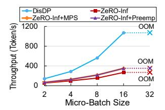

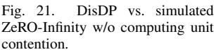

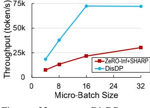

Fig. 22. DisDP vs. ZeRO-Infinity w/ SHARP.

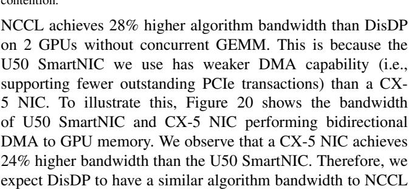

Effect on End-to-End Training. We break down an iteration of DisDP for training Custom-175B, whose experimental setup is the same as Subsection [II-A.](#page-1-2) The result is in Figure [18\(a\)](#page-9-8) and shows that 1) DisDP almost fully overlaps computation and collectives, while ZeRO-Infinity (Figure [3\(a\)\)](#page-2-0) does not; and 2) DisDP reduces the collective time by 20%.

on SmartNICs with better DMA capability.

Comparison to ZeRO-Infinity with Improved GPU Scheduling. To further break down the effect of GPU computing unit contention in compute-collective interference, we conduct a simulation comparison between DisDP and ZeRO-Infinity with two hypothetical GPU scheduling optimizations: ZeRO-Infinity with MPS (ZeRO-Inf+MPS) that isolates GPU SMs, and ZeRO-Infinity with GPU SM preemption (ZeRO-Inf+Preemp). We simulate the two baselines' collectives by inserting virtual collectives with predefined bandwidth (Figure [19\)](#page-9-6) to ZeRO-Infinity's computation traces, and simulate ZeRO-Inf+MPS's computation kernel by adding MPS overhead coefficient to computation traces.

Figure [21](#page-10-1) shows the systems' throughput for training Custom-175B. We make two observations. First, both ZeRO-Inf+MPS and ZeRO-Inf+Preemp increase ZeRO-Infinity's throughput by 30%, and their throughput are almost overlapped (only 0.1%~0.4% throughput differences), because both optimizations remove GPU computing unit contention, thus achieving similar effects. Second, ZeRO-Inf+MPS and ZeRO-Inf+Preemp only achieve 32.7% and 32.8% of DisDP's throughput, because these optimizations do not address GPU memory bandwidth contention between GEMM and collective kernels demonstrated in Subsection [II-A,](#page-1-2) so there is still interference between computation and collectives. In contrast, DisDP's disaggregated design fully overlaps computation and collectives. In conclusion, we need full disaggregation, rather than a better GPU computing unit scheduling.

Comparison to ZeRO-Infinity with SHARP. To eliminate the impact of in-network aggregation, we compare DisDP and ZeRO-Infinity with NVIDIA SHARP [\[122\]](#page-15-20), [\[123\]](#page-15-21), so that the main difference between the two systems is GPU-/SmartNIC-

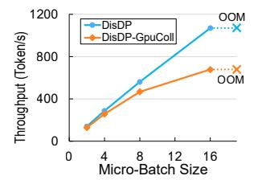

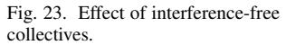

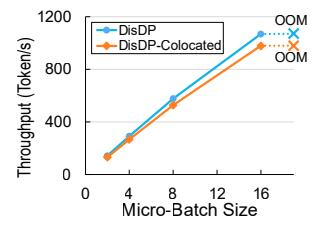

Fig. 24. Effect of many-to-one reliable protocol.

managed collectives. Because we only have 4× 100Gbps CX-6 NICs that SHARP requires, we run ZeRO-Infinity on 4 workers, each has 1× GPU, 4× SSDs (to ensure SSD bandwidth is the same as DisDP), 1× CX-6 NICs connected to an Infiniband switch [\[124\]](#page-15-22). Figure [22](#page-10-2) shows their throughput when training on the OPT-30 B model.

We observe that DisDP achieves 2.38~3.35× throughput over ZeRO-Infinity+SHARP, because ZeRO-Infinity+SHARP still suffers from GEMM-collective interference due to partial disaggregation of compute and network. In conclusion, we need full disaggregation from DisDP, rather than only using in-switch aggregation.

## *E. Ablation Study*

*1) Inteference-Free Collectives Ablation:* To assess the contribution of the interference-free collectives, we compare DisDP with DisDP-GpuColl that uses a GPU kernel to issue push/pull requests to SmartNIC and poll completion, so that GEMM and push/pull kernels compete for GPU computing units. Since the collectives are coupled with many-to-one protocol, we cannot actually run DisDP-GpuColl, so we simulate the throughput of DisDP-GpuColl training Custom-175B on our 8-worker cluster, as Figure [23](#page-10-3) shows.

We make two observations. First, DisDP achieves 1.58× maximum throughput over DisDP-GpuColl, because DisDP-GpuColl fails to fully overlap computation and network communication due to computing unit contention. Second, when a small micro-batch size is (2 and 4) leads to a trivial throughput gain because a small micro-batch size takes much shorter computation time compared to collectives (shown in Figure [18\(a\)\)](#page-9-8), so the benefit of compute-network overlapping is not significant. However, the performance gain at large microbatch size (16) is significant, because compute and network then take roughly the same time and are fully overlapped, thus bringing the most significant benefit.

*2) Many-to-One Reliable Protocol Ablation:* To examine the effect of the many-to-one reliable protocol, we compare DisDP with DisDP-Colocated, a baseline that uses conventional colocated PS architecture, rather than DisDP's scalable PS to execute optimizer. Since DisDP's many-to-one protocol is coupled with SmartNIC-centric collectives, we cannot actually run DisDP-Colocated, so we simulate DisDP-Colocated by inserting virtual collectives to DisDP's compute traces.

Figure [24](#page-10-4) shows the simulated throughput of two implementations on the Custom-175B model. DisDP achieves 1.10× throughput over DisDP-Colocated at different batch sizes, because colocated PS incurs both worker and PS traffic

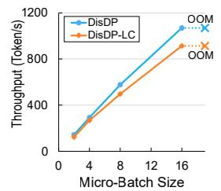

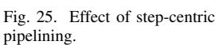

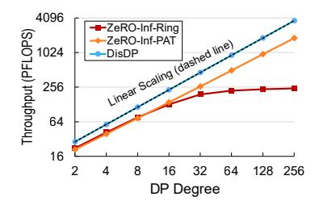

Fig. 26. Scaling of DisDP: ASTRAsim simulation on 175B model with TP8, PP16, and varying DP degree.

on the same machine, leading to heavier collective traffic during backward propagation. During backward propagation, a SmartNIC has 1 worker push and 1 worker pulls for each layer, incurring S send receive. Additionally, the SmartNIC has 1 PS push and 1 PS pull, incurring  $\frac{S}{N}$  send receives on each PS. Therefore, DisDP-Colocated has  $(1+\frac{1}{N})$  send receives in total, which is  $1.13\times$  collective traffic than DisDP on 8 workers (1 push and 1 pulls during backward stage for worker, which is S send receives. Similarly, PS also has S send receives) on each NIC, leading to longer collective time. At micro-batch sizes up to 16, DisDP-Colocated's collectives take longer than computation, thus the overall throughput is bounded by collective time. Therefore, DisDP-Colocated's heavier collective traffic causes lower throughput.

3) Step-Centric Optimizer Pipelining Ablation: To examine the effect of the step-centric optimizer pipelining, we compare DisDP with DisDP-LC that implements naïve layer-centric pipelining for PS.

Figure 25 shows the throughput of two implementations on the Custom-175B model. We observe that DisDP achieves 1.10~1.17× higher throughput than DisDP-LC, because DisDP-LC's throughput at large batch sizes is bottlenecked by the layer-centric optimizer that fails to serve linerate packets. In contrast, DisDP with step-centric pipelining can serve line-rate packets, because the throughput is bottlenecked by the network rather than the optimizer execution.

## F. Scaling Out of DisDP

To show the horizontal scalability of DisDP, we simulate DisDP and ZeRO-Infinity using ASTRA-sim [125], [126] on industrial-scale clusters. We follow the existing industrial practices [47], [64] with 3D parallelism [70], [127] to employ 8-degree TP [128]–[133] over 600GB/s scale-up networks, and 16-degree 1F1B PP [129], [134]–[143] and varying-degree DP over 100Gbps scale-out networks. We vary the DP degree to up to 256, which covers the largest DP degree that industrial practices like Llama-3 [64] (128 DP degree) and MegaScale [47] (192 DP degree) adopts. We run ZeRO-Infinity's collectives on two algorithms: The typical ring algorithms (ZeRO-Inf-Ring), and PAT [144] (ZeRO-Inf-PAT) that performs hierarchical tree-based RS and AG. Figure 26 shows the global TFLOPS with micro-batch sizes of 16 (the same setting in Llama [8]).

We make two observations. First, ZeRO-Infinity with ring algorithm scales poorly with >16 DP degree, because ring collectives introduce a long dependency tree at a large net-

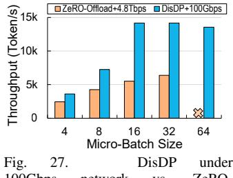

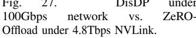

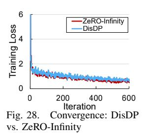

work communication scale [145] and thus is vulnerable to interference [51], [53]. In contrast, DisDP linearly scales out because its hardware-accelerated SmartSwitch-assisted many-to-one collectives compress the dependency chain into a few hops between each worker and the PS. Second, DisDP achieves higher throughput than ZeRO-Infinity with both algorithms. On 256-degree DP, DisDP achieves 2.0× throughput over ZeRO-Infinity with PAT and 15.1× throughput over that with the ring algorithm, because ZeRO-Infinity with both algorithms suffers from GEMM-collective interference, while DisDP eliminates the interference by SmartNIC-managed collectives. In conclusion, DisDP's disaggregation of compute, network, and storage enables efficient 3D parallelism with a large DP degree.

## G. Effect of Faster Network

We validate the benefit of DisDP over baselines with higher network bandwidth. Due to a lack of 400Gbps NICs, we choose 8× A100-40GB GPUs fully connected by 600GB/s NVLink, which is an order of magnitude faster than 100Gb/s of DisDP. We compare DisDP on 100Gbps Ethernet with ZeRO-Offload on a 600GB/s (4.8Tbps) fast network when training the OPT-13B model. Figure 27 shows the results. We make two observations. First, DisDP achieves  $2.22 \times$ throughput over NVLink-enhanced ZeRO-Offload, mainly because ZeRO-Offload suffers from severe interference between GEMM and collectives, while DisDP addresses this by disaggregating compute and collectives. Second, DisDP achieves saturated throughput at micro-batch sizes greater than 16 due to GPU compute bottleneck (as demonstrated in Subsection IV-C). Thus, a 100Gbps network rather than highbandwidth NVLink is sufficient when 1) the micro-batch size is large so that computation takes longer than collectives, and 2) computation and collectives are fully overlapped so collective overhead are completely hidden by computation. In conclusion, we argue for a fully disaggregated design with a relatively slow network, rather than simply upgrading to a faster network under an aggregated infrastructure, to fully address the communication bottleneck in LLM training.

#### H. Cost-Efficiency Comparison

To show cost-efficiency benefits of DisDP, we compare the price and throughput of DisDP on a 32-GPU commodity cluster to ZeRO-Infinity on both the 32-GPU commodity cluster and a 32-GPU DGX cluster (intra-machine GPUs are fully connected with 600GB/s NVLink). We use

TABLE VIII
PRICE OF EACH COMPONENT.

| Component           | Price (\$)   | Component   | Price (\$)   |
|---------------------|--------------|-------------|--------------|
| Worker w/ CPU       | 9,060 [147]  | SSD         | 850 [148]    |
| and Memory          | 9,000 [147]  | GPU         | 8,800 [149]  |
| PS w/ CPU           | 10,588 [150] | CX-5 NIC    | 755 [151]    |
| and Memory          | 10,566 [150] | SmartNIC    | 2,965 [152]  |
| Conventional Switch | 18,990 [153] | SmartSwitch | 10,020 [154] |

TABLE IX

COST-EFFICIENCY: TRAINING 175B MODEL ON 32 GPUs.

|                         | DisDP on Ours       | ZeRO-Infinity on Ours | ZeRO-Infinity on DGX  |
|-------------------------|------------------------|--------------------------|--------------------------|
| Machine Price (\$)      | 10,600×4 + 17,000×1 | 10,600×4                 | 154,800×4 (4 machines |
| GPU Price (\$)          | $8,000 \times 32$      | $8,000 \times 32$        | + 32 GPUs                |
| NIC Price (\$)          | $1,600 \times 33$      | $1,000 \times 32$        | + 32 NICs                |
| SSD Price (\$)          | 310×12                 | 310×16                   | + 16 SSDs)               |
| Switch Price (\$)       | $10,000 \times 1$      | $19,000 \times 1$        | $19,000 \times 1$        |
| Total Price (\$)        | 381,920                | 354,360                  | 638,200                  |
| Throughput (Token/s)    | 4,386                  | 822                      | 3,745                    |
| Relative Throughput     | 1.17×                  | 0.22×                    | 1×                       |
| Relative Price          | 0.60×                  | 0.56×                    | 1×                       |
| Throughput/Dollar Ratio | 1.96×                  | 0.40×                    | 1×                       |

throughput-per-dollar as the cost-efficiency metric, so the costefficiency benefit is calculated by throughput-per-dollar ratio  $=\frac{\text{Relative Throughput}}{\text{Polative Price}}$ . We gather the price of a DGX machine Relative Price with 8× A100-40GB GPUs from [146] and the remaining components from wholesalers' public quotes,7 as listed in Table VIII. Due to a lack of GPUs, we use ASTRA-sim [125] to simulate the throughput of DisDP and ZeRO-Infinity when training the 175B model. Table IX shows that DisDP only costs 60% of that of a DGX cluster, while achieving 1.17× throughput than ZeRO-Infinity on DGX. As a result, DisDP achieves a competitive 1.96× throughput-per-dollar over ZeRO-Infinity on the DGX cluster mainly due to DisDP's fully disaggregated design. In contrast, ZeRO-Infinity on the commodity cluster only achieves  $0.22\times$  throughput and  $0.40\times$ cost-efficiency over that on the DGX cluster.

## I. Training Convergence

To validate that DisDP does not affect the training convergence, we fine-tune the OPT-66B model (the largest pretrained model we can access) on the 8-GPU cluster with the rmstatic dataset [155]. During the fine-tuning process, we set the micro-batch size to 8 per worker and the data format to bf16. The fine-tuning process takes ~3 days for ZeRO-Infinity and ~12 hours for DisDP. We compare the training loss of DisDP and ZeRO-Infinity, as shown in Figure 28. We observe that DisDP and ZeRO-Infinity have roughly overlapped loss curves, indicating DisDP keeps the same convergence rate.

## V. RELATED WORK

**SmartNIC-Offloaded Collectives.** Recent works [84]–[86] offload collective scheduling from CPU to SoC-based Smart-NICs to overlap network communication and computation. However, they build on the RDMA protocol that only supports reliable one-to-one connections and cannot be applied to

many-to-one push/pull. Khalilov et al. [87] enable one-to-many broadcast with SoC-based SmartNIC. However, it does not simultaneously support many-to-one aggregation because an SoC-based SmartNIC cannot process line-rate push and pull simultaneously due to its limited internal switch link and Arm memory bandwidth constraints (Subsection III-B1). In contrast, DisDP uses FPGA-based SmartNICs to enable concurrent many-to-one push and pull for efficient FSDP training.

Compute-Network Overlapping. Recent systems propose kernel decomposition [156]–[162] for computation and collectives kernels, so as to enable fine-grained overlapping for TP and expert parallelism where compute and network cannot overlap due to data dependency. However, they do not address the compute-network interference in MSDP, so they still suffer from GPU computing unit contention that prevents compute and network from fully overlapping. In contrast, DisDP enables full compute-network disaggregation with SmartNICs.

Some works enable compute-network overlapping by GPU kernel fusion [163]–[166], which addresses GPU computing unit contention by manually allocating appropriate GPU threads for GEMM and collectives. However, kernel fusion does not address GPU memory bandwidth and L2 contention, so they still suffer from collective bandwidth drop, as shown in Subsection II-A. In contrast, DisDP eliminates the interference with SmartNIC-centric collectives.

In-Switch Aggregation. Recent works [66], [67], [114], [167]–[175] leverage SmartSwitches to reduce the network data volume during DNN training. However, these systems only support AllReduce-like semantics, thus not compatible with LLM training. SHARP [122], [123], [176] integrates collective logics on dedicated InfiniBand switches, However, SHARP relies on GPUs for data chunk management and consequently suffers from computation-collective interference. In contrast, DisDP proposes novel smart network-managed collectives to improve GPU utilization.

#### VI. CONCLUSION

In this paper, we propose DisDP, a fully disaggregated data-parallel architecture for 100B-scale distributed training. The key idea is 1) offloading collectives to SmartNICs to avoid interference between GEMM kernels and collective kernels, and 2) offloading the optimizer to a scalable PS that supports serving arbitrary numbers of workers. The experimental results show that DisDP achieves  $1.96\times$  throughput-per-dollar over ZeRO-Offload on DGX when training on a 175B model.

#### ACKNOWLEDGEMENT.

We thank the anonymous ISCA reviewers for improving this paper. The work is supported by the following grants: the Major Project of the Zhejiang Provincial Natural Science Foundation under Grant No. LD26F020002, the National Natural Science Foundation of China under the grant numbers (62472384, 62441236, U24A20326). Zeke Wang is the corresponding author.

&lt;sup>7Quote of worker and PS machines is the total price after configuring CPU, memory, system storage, and labor.

## REFERENCES

- [1] J. Devlin, M.-W. Chang, K. Lee, and K. Toutanova, "Bert: Pre-training of deep bidirectional transformers for language understanding," *arXiv preprint*, 2018.
- [2] C. Raffel, N. Shazeer, A. Roberts, K. Lee, S. Narang, M. Matena, Y. Zhou, W. Li, and P. J. Liu, "Exploring the limits of transfer learning with a unified text-to-text transformer." *J. Mach. Learn. Res.*, 2020.
- [3] M. Zhong, F. Lv, L. Wang, L. Qiu, Y. Wang, Y. Liu, H. Cui, X. Feng, and J. Xue, "Vega: Automatically generating compiler backends using a pre-trained transformer model," in *CGO*, 2025.
- [4] A. Dosovitskiy, L. Beyer, A. Kolesnikov, D. Weissenborn, X. Zhai, T. Unterthiner, M. Dehghani, M. Minderer, G. Heigold, S. Gelly, J. Uszkoreit, and N. Houlsby, "An image is worth 16x16 words: Transformers for image recognition at scale," *arXiv preprint*, 2020.
- [5] Z. Liu, Y. Lin, Y. Cao, H. Hu, Y. Wei, Z. Zhang, S. Lin, and B. Guo, "Swin transformer: Hierarchical vision transformer using shifted windows," in *ICCV*, 2021.
- [6] M. D. M. Reddy, M. S. M. Basha, M. M. C. Hari, and M. N. Penchalaiah, "Dall-e: Creating images from text," *UGC Care Group I Journal*, 2021.
- [7] T. Brown, B. Mann, N. Ryder, M. Subbiah, J. D. Kaplan, P. Dhariwal, A. Neelakantan, P. Shyam, G. Sastry, A. Askell, S. Agarwal, A. Herbert-Voss, G. Krueger, T. Henighan, R. Child, A. Ramesh, D. Ziegler, J. Wu, C. Winter, C. Hesse, M. Chen, E. Sigler, M. Litwin, S. Gray, B. Chess, J. Clark, C. Berner, S. McCandlish, A. Radford, I. Sutskever, and D. Amodei, "Language models are few-shot learners," in *NeurIPS*, 2020.
- [8] LlamaTeam, "The llama 3 herd of models," *arXiv preprint*, 2024.
- [9] S. Smith, M. Patwary, B. Norick, P. LeGresley, S. Rajbhandari, J. Casper, Z. Liu, S. Prabhumoye, G. Zerveas, V. Korthikanti, E. Zhang, R. Child, R. Y. Aminabadi, J. Bernauer, X. Song, M. Shoeybi, Y. He, M. Houston, S. Tiwary, and B. Catanzaro, "Using deepspeed and megatron to train megatron-turing nlg 530b, a large-scale generative language model," *arXiv preprint*, 2022.
- [10] A. Chowdhery, S. Narang, J. Devlin, M. Bosma, G. Mishra, A. Roberts, P. Barham, H. W. Chung, C. Sutton, S. Gehrmann, P. Schuh, K. Shi, S. Tsvyashchenko, J. Maynez, A. Rao, P. Barnes, Y. Tay, N. Shazeer, V. Prabhakaran, E. Reif, N. Du, B. Hutchinson, R. Pope, J. Bradbury, J. Austin, M. Isard, G. Gur-Ari, P. Yin, T. Duke, A. Levskaya, S. Ghemawat, S. Dev, H. Michalewski, X. Garcia, V. Misra, K. Robinson, L. Fedus, D. Zhou, D. Ippolito, D. Luan, H. Lim, B. Zoph, A. Spiridonov, R. Sepassi, D. Dohan, S. Agrawal, M. Omernick, A. M. Dai, T. S. Pillai, M. Pellat, A. Lewkowycz, E. Moreira, R. Child, O. Polozov, K. Lee, Z. Zhou, X. Wang, B. Saeta, M. Diaz, O. Firat, M. Catasta, J. Wei, K. Meier-Hellstern, D. Eck, J. Dean, S. Petrov, and N. Fiedel, "Palm: Scaling language modeling with pathways," *JMLR*, 2023.
- [11] S. Kim, G.-I. Yu, H. Park, S. Cho, E. Jeong, H. Ha, S. Lee, J. S. Jeong, and B.-G. Chun, "Parallax: Sparsity-aware data parallel training of deep neural networks," in *EuroSys*, 2019.
- [12] S. H. Hashemi, S. A. Noghabi, W. Gropp, and R. H. Campbell, "Performance modeling of distributed deep neural networks," *arXiv preprint*, 2016.
- [13] P. Watcharapichat, V. L. Morales, R. C. Fernandez, and P. Pietzuch, "Ako: Decentralised deep learning with partial gradient exchange," in *SoCC*, 2016.
- [14] Y. Li, J. Park, M. Alian, Y. Yuan, Z. Qu, P. Pan, R. Wang, A. Schwing, H. Esmaeilzadeh, and N. S. Kim, "A network-centric hardware/algorithm co-design to accelerate distributed training of deep neural networks," in *MICRO*, 2018.
- [15] L. Luo, P. West, J. Nelson, A. Krishnamurthy, and L. Ceze, "Plink: Efficient cloud-based training with topology-aware dynamic hierarchical aggregation," in *MLSys*, 2020.
- [16] S. Wang, D. Li, Y. Cheng, J. Geng, Y. Wang, S. Wang, S.-T. Xia, and J. Wu, "Bml: A high-performance, low-cost gradient synchronization algorithm for dml training," in *NIPS*, 2018.
- [17] F. Li, S. Zhao, Y. Qing, X. Chen, X. Guan, S. Wang, G. Zhang, and H. Cui, "Fold3d: Rethinking and parallelizing computational and communicational tasks in the training of large dnn models," *TPDS*, 2023.
- [18] T. Huang, L. Sun, X. Hou, X. Zhu, X. Xia, Y. Wang, M. Chen, and C. Li, "Sub-model parallelism: A scale-out deployment method for large multi-modal dnns," in *CCGrid*, 2024.

- [19] E. Warraich, O. Shabtai, K. Manaa, S. Vargaftik, Y. Piasetzky, M. Kadosh, L. Suresh, and M. Shahbaz, "Ultima: Robust and tail-optimal allreduce for distributed deep learning in the cloud," *arXiv preprint*, 2023.
- [20] Z. Zhu, C. Giannoula, M. Andoorveedu, Q. Su, K. Mangalam, B. Zheng, and G. Pekhimenko, "Mist: Efficient distributed training of large language models via memory-parallelism co-optimization," *arXiv preprint*, 2025.
- [21] Z. Wang, A. Cai, X. Xie, Z. Pan, Y. Guan, W. Chu, J. Wang, S. Li, J. Huang, C. Cai, Y. Hao, and Y. Ding, "Wlb-llm: Workload-balanced 4d parallelism for large language model training," *arXiv preprint*, 2025.
- [22] A. Mohan, R. Walkup, B. Karacali, M. hung Chen, A. Kayi, L. Schour, S. Salaria, S. Wen, I. hsin Chung, A. Alim, C. Evangelinos, L. Luo, M. Dombrowa, L. Schares, A. Sydney, P. Maniotis, S. Koteshwara, B. Tang, J. Belog, R. Odaira, V. Tarasov, E. Gampel, D. Thorstensen, T. Gershon, and S. Seelam, "Vela: A virtualized llm training system with gpu direct roce," in *ASPLOS*, 2025.
- [23] Z. Zhu, C. Giannoula, M. Andoorveedu, Q. Su, K. Mangalam, B. Zheng, and G. Pekhimenko, "Mist: Efficient distributed training of large language models via memory-parallelism co-optimization," in *EuroSys*, 2025.
- [24] Z. Jia, L. N. Bhuyan, and D. Wong, "Pccl: Energy-efficient llm training with power-aware collective communication," in *ICCD*, 2024.
- [25] R. Chen, G. Lu, Y. Wang, R. Zhang, Z. Hu, Y. Miao, Z. Cai, J. Leng, and M. Guo, "Baft: bubble-aware fault-tolerant framework for distributed dnn training with hybrid parallelism," *Frontiers of Computer Science*, 2025.
- [26] L. Qin, J. Cui, W. Cai, and J. Huang, "Chimera: Communication fusion for hybrid parallelism in large language models," in *ISCA*, 2025.
- [27] G. Huang, H. Li, L. Qin, J. Huang, Y. Kang, Y. Ding, and Y. Xie, "Traci: Network acceleration of input-dynamic communication for large-scale deep learning recommendation model," in *ISCA*, 2025.
- [28] Z. Zhang, Y. Zhong, Y. Jiang, H. Hu, J. Sun, Z. Ge, Y. Zhu, D. Jiang, and X. Jin, "Disttrain: Addressing model and data heterogeneity with disaggregated training for multimodal large language models," in *SIGCOMM*, 2025.
- [29] H. Ge, J. Feng, Q. Huang, F. Fu, X. Nie, L. Zuo, H. Lin, B. Cui, and X. Liu, "Bytescale: Communication-efficient scaling of llm training with a 2048k context length on 16384 gpus," in *SIGCOMM*, 2025.
- [30] L. G. Valiant, "A bridging model for parallel computation," *Communications of the ACM*, 1990.
- [31] P. Patarasuk and X. Yuan, "Bandwidth optimal all-reduce algorithms for clusters of workstations," *Journal of Parallel and Distributed Computing*, 2009.
- [32] T. Chilimbi, Y. Suzue, J. Apacible, and K. Kalyanaraman, "Project adam: Building an efficient and scalable deep learning training system," in *OSDI*, 2014.
- [33] M. Li, D. G. Andersen, J. W. Park, A. J. Smola, A. Ahmed, V. Josifovski, J. Long, E. J. Shekita, and B.-Y. Su, "Scaling distributed machine learning with the parameter server," in *OSDI*, 2014.
- [34] M. Li, D. G. Andersen, A. J. Smola, and K. Yu, "Communication efficient distributed machine learning with the parameter server," in *NIPS*, 2014.
- [35] M. Abadi, P. Barham, J. Chen, Z. Chen, A. Davis, J. Dean, M. Devin, S. Ghemawat, G. Irving, M. Isard, M. Kudlur, J. Levenberg, R. Monga, S. Moore, D. G. Murray, B. Steiner, P. Tucker, V. Vasudevan, P. Warden, M. Wicke, Y. Yu, and X. Zheng, "Tensorflow: a system for large-scale machine learning," in *OSDI*, 2016.
- [36] T. Chen, M. Li, Y. Li, M. Lin, N. Wang, M. Wang, T. Xiao, B. Xu, C. Zhang, and Z. Zhang, "Mxnet: A flexible and efficient machine learning library for heterogeneous distributed systems," *arXiv preprint*, 2015.
- [37] S. Li, Y. Zhao, R. Varma, O. Salpekar, P. Noordhuis, T. Li, A. Paszke, J. Smith, B. Vaughan, P. Damania, and S. Chintala, "Pytorch distributed: Experiences on accelerating data parallel training," in *VLDB*, 2020.
- [38] J. Huang, P. Majumder, S. Kim, A. Muzahid, K. H. Yum, and E. J. Kim, "Communication algorithm-architecture co-design for distributed deep learning," in *ISCA*, 2021.
- [39] L. Luo, J. Nelson, L. Ceze, A. Phanishayee, and A. Krishnamurthy, "Parameter hub: a rack-scale parameter server for distributed deep neural network training," in *SoCC*, 2018.
- [40] A.-L. Jin, W. Xu, S. Guo, B. Hu, and K. Yeung, "Ps+: A simple yet effective framework for fast training on parameter server," *TPDS*, 2022.

- [41] I. Thangakrishnan, D. Cavdar, C. Karakus, P. Ghai, Y. Selivonchyk, and C. Pruce, "Herring: Rethinking the parameter server at scale for the cloud," in *SC*, 2020.
- [42] H. Cui, H. Zhang, G. R. Ganger, P. B. Gibbons, and E. P. Xing, "Geeps: Scalable deep learning on distributed gpus with a gpu-specialized parameter server," in *EuroSys*, 2016.
- [43] Y. Jiang, Y. Zhu, C. Lan, B. Yi, Y. Cui, and C. Guo, "A unified architecture for accelerating distributed dnn training in heterogeneous gpu/cpu clusters," in *OSDI*, 2020.
- [44] C. Xie, O. Koyejo, and I. Gupta, "Zenops: A distributed learning system integrating communication efficiency and security," *Algorithms*, 2022.
- [45] Y. Peng, Y. Bao, Y. Chen, C. Wu, and C. Guo, "Optimus: an efficient dynamic resource scheduler for deep learning clusters," in *EuroSys*, 2018.
- [46] W. Wang, M. Khazraee, Z. Zhong, M. Ghobadi, Z. Jia, D. Mudigere, Y. Zhang, and A. Kewitsch, "Topoopt: Co-optimizing network topology and parallelization strategy for distributed training jobs," in *NSDI*, 2023.
- [47] Z. Jiang, H. Lin, Y. Zhong, Q. Huang, Y. Chen, Z. Zhang, Y. Peng, X. Li, C. Xie, S. Nong, Y. Jia, S. He, H. Chen, Z. Bai, Q. Hou, S. Yan, D. Zhou, Y. Sheng, Z. Jiang, H. Xu, H. Wei, Z. Zhang, P. Nie, L. Zou, S. Zhao, L. Xiang, Z. Liu, Z. Li, X. Jia, J. Ye, X. Jin, and X. Liu, "Megascale: Scaling large language model training to more than 10,000 gpus," *arXiv preprint*, 2024.
- [48] J. B. Park, K. Wu, V. S. Mailthody, Z. Quresh, S. Mahlke, and W.-m. Hwu, "Lsm-gnn: Large-scale storage-based multi-gpu gnn training by optimizing data transfer scheme," *arXiv preprint*, 2024.
- [49] Y. Xu, H. Lee, D. Chen, H. Choi, B. Hechtman, and S. Wang, "Automatic cross-replica sharding of weight update in data-parallel training," *arXiv preprint*, 2020.
- [50] S. Rajbhandari, J. Rasley, O. Ruwase, and Y. He, "Zero: Memory optimizations toward training trillion parameter models," in *SC*, 2020.
- [51] Y. Zhao, A. Gu, R. Varma, L. Luo, C.-C. Huang, M. Xu, L. Wright, H. Shojanazeri, M. Ott, S. Shleifer, A. Desmaison, C. Balioglu, P. Damania, B. Nguyen, G. Chauhan, Y. Hao, A. Mathews, and S. Li, "Pytorch fsdp: Experiences on scaling fully sharded data parallel," in *VLDB*, 2023.
- [52] G. Wang, H. Qin, S. A. Jacobs, C. Holmes, S. Rajbhandari, O. Ruwase, F. Yan, L. Yang, and Y. He, "Zero++: Extremely efficient collective communication for giant model training," in *arXiv preprint*, 2023.
- [53] Z. Zhang, S. Zheng, Y. Wang, J. Chiu, G. Karypis, T. Chilimbi, M. Li, and X. Jin, "Mics: near-linear scaling for training gigantic model on public cloud," in *VLDB*, 2022.
- [54] Q. Chen, Q. Hu, Z. Ye, G. Wang, P. Sun, Y. Wen, and T. Zhang, "Amsp: Super-scaling llm training via advanced model states partitioning," *arXiv preprint*, 2023.
- [55] D. K. Kadiyala, S. Rashidi, T. Heo, A. R. Bambhaniya, T. Krishna, and A. Daglis, "Comet: A comprehensive cluster design methodology for distributed deep learning training," *arXiv preprint*, 2022.
- [56] J. Ren, S. Rajbhandari, R. Y. Aminabadi, O. Ruwase, S. Yang, M. Zhang, D. Li, and Y. He, "Zero-offload: Democratizing billionscale model training," in *ATC*, 2021.
- [57] S. Rajbhandari, O. Ruwase, J. Rasley, S. Smith, and Y. He, "Zeroinfinity: Breaking the gpu memory wall for extreme scale deep learning," in *SC*, 2021.
- [58] J. Fang, Y. Yu, Z. Zhu, S. Li, Y. You, and J. Zhou, "Patrickstar: Parallel training of pre-trained models via chunk-based memory management," *arXiv preprint*, 2021.
- [59] Z. Bian, H. Liu, B. Wang, H. Huang, Y. Li, C. Wang, F. Cui, and Y. You, "Colossal-ai: A unified deep learning system for large-scale parallel training," *arXiv preprint*, 2021.
- [60] Y. Liu, S. Li, J. Fang, Y. Shao, B. Yao, and Y. You, "Colossal-auto: Unified automation of parallelization and activation checkpoint for large-scale models," *arXiv preprint*, 2023.
- [61] J. Ren, J. Luo, K. Wu, M. Zhang, H. Jeon, and D. Li, "Sentinel: Efficient tensor migration and allocation on heterogeneous memory systems for deep learning," in *HPCA*, 2021.
- [62] J. Ren, D. Xu, S. Yang, J. Zhao, Z. Li, C. Navasca, C. Wang, H. Xu, and D. Li, "Enabling large dynamic neural network training with learningbased memory management," in *HPCA*, 2024.
- [63] DeepSeek-AI, "Deepseek-v3 technical report," *arXiv preprint*, 2024.
- [64] W. Chu, X. Xie, J. Yu, J. Wang, A. Phanishayee, C. Tang, Y. Hao, J. Huang, M. Ozdal, J. Wang, V. Goswami, N. Goyal, A. Kadian, A. Gu, C. Cai, F. Tian, X. Wang, M. Si, P. Balaji, C.-H. Chu, and

- J. Park, "Scaling llama 3 training with efficient parallelism strategies," in *ISCA*, 2025.
- [65] W. Xiong, J. Liu, I. Molybog, H. Zhang, P. Bhargava, R. Hou, L. Martin, R. Rungta, K. A. Sankararaman, B. Oguz, M. Khabsa, H. Fang, Y. Mehdad, S. Narang, K. Malik, A. Fan, S. Bhosale, S. Edunov, M. Lewis, S. Wang, and H. Ma, "Effective long-context scaling of foundation models," in *NAACL-HLT*, 2024.
- [66] C. Lao, Y. Le, K. Mahajan, Y. Chen, W. Wu, A. Akella, and M. Swift, "Atp: In-network aggregation for multi-tenant learning," in *NSDI*, 2021.
- [67] Z. Li, J. Huang, Y. Li, A. Xu, S. Zhou, J. Liu, and J. Wang, "A2tp: Aggregator-aware in-network aggregation for multi-tenant learning," in *EuroSys*, 2023.
- [68] Intel, "Intel tofino programmable ethernet switch asic," [https://www.intel.com/content/www/us/en/products/network](https://www.intel.com/content/www/us/en/products/network-io/programmable-ethernet-switch/tofino-series.html)[io/programmable-ethernet-switch/tofino-series.html,](https://www.intel.com/content/www/us/en/products/network-io/programmable-ethernet-switch/tofino-series.html) 2020.
- [69] P. Bosshart, G. Gibb, H.-S. Kim, G. Varghese, N. McKeown, M. Izzard, F. Mujica, and M. Horowitz, "Forwarding metamorphosis: Fast programmable match-action processing in hardware for sdn," *ACM SIGCOMM Computer Communication Review*, 2013.
- [70] C. Zhao, C. Deng, C. Ruan, D. Dai, H. Gao, J. Li, L. Zhang, P. Huang, S. Zhou, S. Ma, W. Liang, Y. He, Y. Wang, Y. Liu, and Y. Wei, "Insights into deepseek-v3: Scaling challenges and reflections on hardware for ai architectures," in *ISCA*, 2025.
- [71] NVIDIA, "Nvidia collective communications library," [https://developer.](https://developer.nvidia.com/nccl) [nvidia.com/nccl,](https://developer.nvidia.com/nccl) 2017.
- [72] T. Liu, C. Hei, F. Li, C. Gao, J. Cao, T. Wang, E. Zhai, and X. Wang, "Resccl: Resource-efficient scheduling for collective communication," in *SIGCOMM*, 2025.
- [73] I. S. Olmedo, N. Capodieci, J. L. Martinez, A. Marongiu, and M. Bertogna, "Dissecting the cuda scheduling hierarchy: a performance and predictability perspective," in *RTAS*, 2020.
- [74] S. Rashidi, M. Denton, S. Sridharan, S. Srinivasan, A. Suresh, J. Nie, and T. Krishna, "Enabling compute-communication overlap in distributed deep learning training platforms," in *ISCA*, 2021.
- [75] NVIDIA, "Multi-process service documentation," [https://docs.nvidia.](https://docs.nvidia.com/deploy/mps/) [com/deploy/mps/,](https://docs.nvidia.com/deploy/mps/) 2017.
- [76] Z. Xiong and N. Zilberman, "Do switches dream of machine learning? toward in-network classification," in *HotNets*, 2019.
- [77] Y. Tokusashi, H. T. Dang, F. Pedone, R. Soule, and N. Zilberman, "The ´ case for in-network computing on demand," in *EuroSys*, 2019.
- [78] J. Liu, W. Hallahan, C. Schlesinger, M. Sharif, J. Lee, R. Soule,´ H. Wang, C. Cas¸caval, N. McKeown, and N. Foster, "P4v: Practical verification for programmable data planes," in *SIGCOMM*, 2018.
- [79] Z. Yue, X. Xiang, F. Tu, Y. Wang, Y. Wang, S. Wei, Y. Hu, and S. Yin, "15.1 a 0.795 fj/bit physically-unclonable function-protected tcam for a software-defined networking switch," in *ISSCC*, 2024.
- [80] X. Gao, J. Gao, K. K. G, M. Haseeb, E. Zhai, B. Dong, J. Tassarotti, S. Narayana, and A. Sivaraman, "Parserhawk: Hardware-aware parser generator using program synthesis," in *SIGCOMM*, 2025.
- [81] NVIDIA, "Using nvidia sharp with nvidia nccl," [https:](https://docs.nvidia.com/networking/display/sharpv300/using+nvidia+sharp+with+nvidia+nccl) [//docs.nvidia.com/networking/display/sharpv300/using+nvidia+sharp+](https://docs.nvidia.com/networking/display/sharpv300/using+nvidia+sharp+with+nvidia+nccl) [with+nvidia+nccl.](https://docs.nvidia.com/networking/display/sharpv300/using+nvidia+sharp+with+nvidia+nccl)
- [82] W. An, X. Bi, G. Chen, S. Chen, C. Deng, H. Ding, K. Dong, Q. Du, W. Gao, K. Guan, J. Guo, Y. Guo, Z. Fu, Y. He, P. Huang, J. Li, W. Liang, X. Liu, X. Liu, Y. Liu, Y. Liu, S. Lu, X. Lu, X. Nie, T. Pei, J. Qiu, H. Qu, Z. Ren, Z. Sha, X. Su, X. Sun, Y. Tan, M. Tang, S. Wang, Y. Wang, Y. Wang, Z. Xie, Y. Xiong, Y. Xu, S. Ye, S. Yu, Y. Zha, L. Zhang, H. Zhang, M. Zhang, W. Zhang, Y. Zhang, C. Zhao, Y. Zhao, S. Zhou, S. Zhou, and Y. Zou, "Fire-flyer ai-hpc: A costeffective software-hardware co-design for deep learning," in *SC*, 2024.
- [83] NVIDIA, "Nvidia bluefield platform," [https://www.nvidia.com/en-us/](https://www.nvidia.com/en-us/networking/products/data-processing-unit/) [networking/products/data-processing-unit/](https://www.nvidia.com/en-us/networking/products/data-processing-unit/) (accessed Feb. 21, 2026).
- [84] K. K. Suresh, B. Michalowicz, B. Ramesh, N. Contini, J. Yao, S. Xu, A. Shafi, H. Subramoni, and D. Panda, "A novel framework for efficient offloading of communication operations to bluefield smartnics," in *IPDPS*, 2023.
- [85] R. Graham, G. Bosilca, Y. Qin, B. Settlemyer, G. Shainer, C. Stunkel, G. Vallee, B. Williams, G. Cisneros-Stoianowski, S. Ohlmann, and M. Rampp, "Optimizing application performance with bluefield: accelerating large-message blocking and nonblocking collective operations," in *ISC*, 2024.
- [86] M. Usman, M. Benito, S. Iserte, and A. J. Pena, "Odos-mpi: Hpc- ˜ friendly smartnic offloading of computation/communication kernels," in *SC*, 2025.

- [87] M. Khalilov, S. Di Girolamo, M. Chrapek, R. Nudelman, G. Bloch, and T. Hoefler, "Network-offloaded bandwidth-optimal broadcast and allgather for distributed ai," in *SC*, 2024.
- [88] P. Fleming, C. Chang, D. Collier, A. Singhai, S. Doyle, E. Louzoun, D. Lee, V. Ayyavu, S. Livne, R. Hathaway, T. Hurson, J. Ellis, T. Bar-Kanarik, J. Kenny, C. Dumitrescu, and Y. Wolberger, "Intel® ipu e2200: Second generation infrastructure processing unit (ipu)," in *HCS*, 2025.
- [89] X. Chen, J. Zhang, B. Zhu, X. Zhu, Z. Chen, T. Fu, S. Ma, L. Zhu, C. Shi, Y. Zhang, Y. Shu, P. Cheng, and Z. Wang, "Flexins: A smartniccentric, line-rate and flexible network stack," in *EuroSys*, 2026.
- [90] NVIDIA, "Nvidia bluefield-2 infiniband/ethernet dpu specifications," [https://docs.nvidia.com/networking/display/bluefield2dpuvpi/](https://docs.nvidia.com/networking/display/bluefield2dpuvpi/specifications) [specifications](https://docs.nvidia.com/networking/display/bluefield2dpuvpi/specifications) (accessed Mar. 6, 2026).
- [91] ——, "Nvidia bluefield-3 networking platform specifications," [https:](https://docs.nvidia.com/networking/display/bf3dpu/specifications) [//docs.nvidia.com/networking/display/bf3dpu/specifications](https://docs.nvidia.com/networking/display/bf3dpu/specifications) (accessed Feb. 21, 2026).
- [92] Y. Yuan, J. Huang, Y. Sun, T. Wang, J. Nelson, D. R. Ports, Y. Wang, R. Wang, C. Tai, and N. S. Kim, "Rambda: Rdma-driven acceleration framework for memory-intensive µs-scale datacenter applications," in *HPCA*, 2023.
- [93] J. Zhang, H. Huang, L. Zhu, S. Ma, D. Rong, Y. Hou, M. Sun, C. Gu, P. Cheng, C. Shi, and Z. Wang, "Smartds: Middle-tier-centric smartnic enabling application-aware message split for disaggregated block storage," in *ISCA*, 2023.
- [94] J. Cong, Z. Fang, M. Lo, H. Wang, J. Xu, and S. Zhang, "Understanding performance differences of fpgas and gpus," in *FCCM*, 2018.
- [95] A. Caulfield, P. Costa, and M. Ghobadi, "Beyond smartnics: Towards a fully programmable cloud," in *HPSR*, 2018.
- [96] D. Firestone, A. Putnam, S. Mundkur, D. Chiou, A. Dabagh, M. Andrewartha, H. Angepat, V. Bhanu, A. Caulfield, E. Chung, H. K. Chandrappa, S. Chaturmohta, M. Humphrey, J. Lavier, N. Lam, F. Liu, K. Ovtcharov, J. Padhye, G. Popuri, S. Raindel, T. Sapre, M. Shaw, G. Silva, M. Sivakumar, N. Srivastava, A. Verma, Q. Zuhair, D. Bansal, D. Burger, K. Vaid, D. A. Maltz, and A. Greenberg, "Azure accelerated networking: Smartnics in the public cloud," in *NSDI*, 2018.
- [97] B. Li, Z. Ruan, W. Xiao, Y. Lu, Y. Xiong, A. Putnam, E. Chen, and L. Zhang, "Kv-direct: High-performance in-memory key-value store with programmable nic," in *SOSP*, 2017.
- [98] S. Choi, M. Shahbaz, B. Prabhakar, and M. Rosenblum, "λ-nic: Interactive serverless compute on programmable smartnics," in *ICDCS*, 2020.
- [99] A. Guo, T. Geng, Y. Zhang, P. Haghi, C. Wu, C. Tan, Y. Lin, A. Li, and M. Herbordt, "A framework for neural network inference on fpgacentric smartnics," in *FPL*, 2022.
- [100] H. Ji, M. Mansi, Y. Sun, Y. Yuan, J. Huang, R. Kuper, M. M. Swift, and N. S. Kim, "Styx: Exploiting smartnic capability to reduce datacenter memory tax," in *ATC*, 2023.
- [101] Z. Guo, J. Lin, Y. Bai, D. Kim, M. Swift, A. Akella, and M. Liu, "Lognic: A high-level performance model for smartnics," in *MICRO*, 2023.
- [102] J. Lin, Z. Guo, M. Shah, T. Ji, Y. Zhang, D. Kim, and A. Akella, "Enabling portable and high-performance smartnic programs with alkali," in *NSDI*, 2025.
- [103] J. Lu, S. Zhu, J. Liang, Y. Lin, T. Pan, Y. Qiao, Y. Song, W. Su, Y. Xie, Y. Li, E. Song, S. Zhang, X. Sun, R. Wen, X. Wei, B. Lyu, and X. Li, "Albatross: A containerized cloud gateway platform with fpga-accelerated packet-level load balancing," in *SIGCOMM*, 2025.
- [104] X. Li, E. Song, B. Yang, T. Pan, Y. Yang, Q. Fu, Y. Song, Y. Lv, Z. Chen, J. Lu, S. Zhang, X. Sun, R. Wen, X. Wei, B. Lyu, Z. Zong, Q. He, and S. Zhu, "Nezha: Smartnic-based virtual switch load sharing," in *SIGCOMM*, 2025.
- [105] D. Cock, A. Ramdas, D. Schwyn, M. Giardino, A. Turowski, Z. He, N. Hossle, D. Korolija, M. Licciardello, K. Martsenko, R. Achermann, G. Alonso, and T. Roscoe, "Enzian: an open, general, cpu/fpga platform for systems software research," in *ASPLOS*, 2022.
- [106] D. Korolija, T. Roscoe, and G. Alonso, "Do OS abstractions make sense on FPGAs?" in *OSDI*, 2020.
- [107] J. Lin, K. Patel, B. E. Stephens, A. Sivaraman, and A. Akella, "Panic: A high-performance programmable nic for multi-tenant networks," in *OSDI*, 2020.
- [108] A. Guo, T. Geng, Y. Zhang, P. Haghi, C. Wu, C. Tan, Y. Lin, A. Li, and M. Herbordt, "Fcsn: A fpga-centric smartnic framework for neural networks," in *FCCM*, 2022.

- [109] Y. Li, J. Lou, S. Vanavasam, and N. S. Kim, "Hint: A hardware platform for intra-host nic traffic and smartnic emulation," *IEEE Computer Architecture Letters*, 2025.
- [110] Z. He, D. Korolija, Y. Zhu, B. Ramhorst, T. Laan, L. Petrica, M. Blott, and G. Alonso, "Accl+: an fpga-based collective engine for distributed applications," in *OSDI*, 2024.
- [111] Z. Wang, H. Huang, J. Zhang, F. Wu, and G. Alonso, "Fpganic: An fpga-based versatile 100gb smartnic for gpus," in *ATC*, 2022.
- [112] D. Sidler, Z. Wang, M. Chiosa, A. Kulkarni, and G. Alonso, "Strom: Smart remote memory," in *EuroSys*, 2020.
- [113] P. Micikevicius, S. Narang, J. Alben, G. Diamos, E. Elsen, D. Garcia, B. Ginsburg, M. Houston, O. Kuchaiev, G. Venkatesh, and H. Wu, "Mixed precision training," *arXiv preprint*, 2017.
- [114] A. Sapio, M. Canini, C.-Y. Ho, J. Nelson, P. Kalnis, C. Kim, A. Krishnamurthy, M. Moshref, D. Ports, and P. Richtarik, "Scaling distributed ´ machine learning with in-network aggregation," in *NSDI*, 2021.
- [115] S. Zhang, S. Roller, N. Goyal, M. Artetxe, M. Chen, S. Chen, C. Dewan, M. Diab, X. Li, X. V. Lin, T. Mihaylov, M. Ott, S. Shleifer, K. Shuster, D. Simig, P. S. Koura, A. Sridhar, T. Wang, and L. Zettlemoyer, "Opt: Open pre-trained transformer language models," *arXiv preprint*, 2022.
- [116] Edgecore, "Edgecore wedge100bf-32x product info," [https://www.](https://www.edge-core.com/productsInfo.php?cls=1&cls2=5&cls3=181&id=335) [edge-core.com/productsInfo.php?cls=1&cls2=5&cls3=181&id=335,](https://www.edge-core.com/productsInfo.php?cls=1&cls2=5&cls3=181&id=335) 2020.
- [117] T. Chen, B. Xu, C. Zhang, and C. Guestrin, "Training deep nets with sublinear memory cost," *arXiv preprint*, 2016.
- [118] P. Jain, A. Jain, A. Nrusimha, A. Gholami, P. Abbeel, J. Gonzalez, K. Keutzer, and I. Stoica, "Checkmate: Breaking the memory wall with optimal tensor rematerialization," *MLSys*, 2020.
- [119] NVIDIA, "Sn2700 open ethernet switch," [https://network.nvidia.com/](https://network.nvidia.com/files/doc-2020/pb-sn2700.pdf) [files/doc-2020/pb-sn2700.pdf,](https://network.nvidia.com/files/doc-2020/pb-sn2700.pdf) 2022.
- [120] J. Rasley, S. Rajbhandari, O. Ruwase, and Y. He, "Deepspeed: System optimizations enable training deep learning models with over 100 billion parameters," in *SIGKDD*, 2020.
- [121] A. Paszke, S. Gross, S. Chintala, G. Chanan, E. Yang, Z. DeVito, Z. Lin, A. Desmaison, L. Antiga, and A. Lerer, "Automatic differentiation in pytorch," in *Autodiff@NIPS*, 2017.
- [122] R. L. Graham, D. Bureddy, P. Lui, H. Rosenstock, G. Shainer, G. Bloch, D. Goldenerg, M. Dubman, S. Kotchubievsky, V. Koushnir, L. Levi, A. Margolin, T. Ronen, A. Shpiner, O. Wertheim, and E. Zahavi, "Scalable hierarchical aggregation protocol (sharp): A hardware architecture for efficient data reduction," in *COMHPC@SC*. IEEE, 2016, pp. 1–10.
- [123] R. L. Graham, L. Levi, D. Burredy, G. Bloch, D. C. Gilad Shainer, G. Elias, D. Klein, J. Ladd, O. Maor, V. P. Ami Marelli, E. Romlet, Y. Qin, and I. Zemah, "Scalable hierarchical aggregation and reduction protocol (sharp) streaming-aggregation hardware design and evaluation," in *ISC High Performance*, 2020.
- [124] NVIDIA, "Qm8790 mellanox quantum™ hdr edge switch," [https:](https://network.nvidia.com/files/doc-2020/pb-qm8790.pdf) [//network.nvidia.com/files/doc-2020/pb-qm8790.pdf,](https://network.nvidia.com/files/doc-2020/pb-qm8790.pdf) 2022.
- [125] W. Won, T. Heo, S. Rashidi, S. Sridharan, S. Srinivasan, and T. Krishna, "Astra-sim2.0: Modeling hierarchical networks and disaggregated systems for large-model training at scale," in *ISPASS*, 2023.
- [126] S. Sridharan, T. Heo, L. Feng, Z. Wang, M. Bergeron, W. Fu, S. Zheng, B. Coutinho, S. Rashidi, C. Man, and T. Krishna, "Chakra: Advancing performance benchmarking and co-design using standardized execution traces," in *Benchmarking Machine Learning Workloads on Emerging Hardware@MLSys*, 2023.
- [127] S. Rashidi, W. Won, S. Srinivasan, P. Gupta, and T. Krishna, "Fred: A wafer-scale fabric for 3d parallel dnn training," in *ISCA*, 2025.
- [128] M. Shoeybi, M. Patwary, R. Puri, P. LeGresley, J. Casper, and B. Catanzaro, "Megatron-lm: Training multi-billion parameter language models using model parallelism," *arXiv preprint*, 2019.
- [129] D. Narayanan, M. Shoeybi, J. Casper, P. LeGresley, M. Patwary, V. Korthikanti, D. Vainbrand, P. Kashinkunti, J. Bernauer, B. Catanzaro, and A. Phanishayee, "Efficient large-scale language model training on gpu clusters using megatron-lm," in *SC*, 2021.
- [130] Q. Xu, S. Li, C. Gong, and Y. You, "An efficient 2d method for training super-large deep learning models," *arXiv preprint*, 2021.
- [131] Z. Bian, Q. Xu, B. Wang, and Y. You, "Maximizing parallelism in distributed training for huge neural networks," *arXiv preprint*, 2021.
- [132] A. Agrawal, A. Panwar, J. Mohan, N. Kwatra, B. S. Gulavani, and R. Ramjee, "Sarathi: Efficient llm inference by piggybacking decodes with chunked prefills," *arXiv preprint*, 2023.

- [133] H. Nam, G. Gerogiannis, and J. Torrellas, "Meshslice: Efficient 2d tensor parallelism for distributed dnn training," in *ISCA*, 2025.
- [134] Y. Huang, Y. Cheng, A. Bapna, O. Firat, D. Chen, M. Chen, H. Lee, J. Ngiam, Q. V. Le, Y. Wu, and zhifeng Chen, "Gpipe: Efficient training of giant neural networks using pipeline parallelism," in *NeurIPS*, 2019.
- [135] D. Narayanan, A. Phanishayee, K. Shi, and X. Chen, "Memory-efficient pipeline-parallel dnn training," in *ICML*, 2021.
- [136] S. Fan, Y. Rong, C. Meng, Z. Cao, S. Wang, Z. Zheng, C. Wu, G. Long, J. Yang, L. Xia, L. Diao, X. Liu, and W. Li, "Dapple: A pipelined data parallel approach for training large models," in *PPoPP*, 2021.
- [137] Y. Feng, M. Xie, Z. Tian, S. Wang, Y. Lu, and J. Shu, "Mobius: Fine tuning large-scale models on commodity gpu servers," in *ASPLOS*, 2023.
- [138] P. Qi, X. Wan, G. Huang, and M. Lin, "Zero bubble pipeline parallelism," *arXiv preprint*, 2023.
- [139] D. Narayanan, A. Phanishayee, K. Shi, X. Chen, and M. Zaharia, "Memory-efficient pipeline-parallel dnn training," in *ICML*, 2021.
- [140] Z. Sun, H. Cao, Y. Wang, G. Feng, S. Chen, H. Wang, and W. Chen, "Adapipe: Optimizing pipeline parallelism with adaptive recomputation and partitioning," in *ASPLOS*, 2024.
- [141] S. Zhao, F. Li, X. Chen, X. Guan, J. Jiang, D. Huang, Y. Qing, S. Wang, P. Wang, G. Zhang, C. Li, P. Luo, and H. Cui, "vpipe: A virtualized acceleration system for achieving efficient and scalable pipeline parallel dnn training," *TPDS*, 2021.
- [142] J. H. Park, G. Yun, M. Y. Chang, N. T. Nguyen, S. Lee, J. Choi, S. H. Noh, and Y.-r. Choi, "Hetpipe: Enabling large dnn training on (whimpy) heterogeneous gpu clusters through integration of pipelined model parallelism and data parallelism," in *ATC*, 2020.
- [143] Z. Qu, D. Niu, S. Li, H. Zheng, and Y. Xie, "Tt-gnn: Efficient on-chip graph neural network training via embedding reformation and hardware optimization," in *MICRO*, 2023.
- [144] S. Jeaugey, "Pat: a new algorithm for all-gather and reduce-scatter operations at scale," *arXiv preprint*, 2025.
- [145] Z. Chen, X. Liu, M. Li, Y. Hu, H. Mei, H. Xing, H. Wang, W. Shi, S. Liu, and Y. Xu, "Rina: Enhancing ring-allreduce with in-network aggregation in distributed model training," in *ICNP*, 2024.
- [146] Router-switch, "Dell dgx a100 price list," [https://itprice.com/dell-price](https://itprice.com/dell-price-list/a100%20p3687%20320gb.html)[list/a100%20p3687%20320gb.html](https://itprice.com/dell-price-list/a100%20p3687%20320gb.html) (accessed Nov. 13, 2025).
- [147] Acme Micro Systems, "Supermicro superserver 4029gp-trt 4u dual socket," [https://www.acmemicro.com/Product/16479/Supermicro-](https://www.acmemicro.com/Product/16479/Supermicro-SuperServer-4029GP-TRT-4U-Dual-socket-P-(LGA-3647)-24xDDR4-8xGPU-2x10GbE-11xPCIe-R2000W-SYS-4029GP-TRT)[SuperServer-4029GP-TRT-4U-Dual-socket-P-\(LGA-3647\)-](https://www.acmemicro.com/Product/16479/Supermicro-SuperServer-4029GP-TRT-4U-Dual-socket-P-(LGA-3647)-24xDDR4-8xGPU-2x10GbE-11xPCIe-R2000W-SYS-4029GP-TRT) [24xDDR4-8xGPU-2x10GbE-11xPCIe-R2000W-SYS-4029GP-TRT](https://www.acmemicro.com/Product/16479/Supermicro-SuperServer-4029GP-TRT-4U-Dual-socket-P-(LGA-3647)-24xDDR4-8xGPU-2x10GbE-11xPCIe-R2000W-SYS-4029GP-TRT) (accessed Nov. 13, 2025).
- [148] ——, "Intel ssdpf2kx038t11z - 3.84tb ssd nvme u.2 15mm," [https://www.acmemicro.com/Product/18775/Intel-](https://www.acmemicro.com/Product/18775/Intel-SSDPF2KX038T11Z---3-84TB-SSD-NVMe-U-2-15mm-PCIe-4-0-D7-P5520-Series-6500-MB-s-Read-3D4-TLC-NAND)[SSDPF2KX038T11Z---3-84TB-SSD-NVMe-U-2-15mm-PCIe-4-](https://www.acmemicro.com/Product/18775/Intel-SSDPF2KX038T11Z---3-84TB-SSD-NVMe-U-2-15mm-PCIe-4-0-D7-P5520-Series-6500-MB-s-Read-3D4-TLC-NAND) [0-D7-P5520-Series-6500-MB-s-Read-3D4-TLC-NAND](https://www.acmemicro.com/Product/18775/Intel-SSDPF2KX038T11Z---3-84TB-SSD-NVMe-U-2-15mm-PCIe-4-0-D7-P5520-Series-6500-MB-s-Read-3D4-TLC-NAND) (accessed Nov. 13, 2025).
- [149] Network Outlet, "Nvidia a100 40gb pcie gpu," [https:](https://networkoutlet.com/products/nvidia-a100-40gb-pcie-gpu-ampere-architecture-with-nvlink-mig) [//networkoutlet.com/products/nvidia-a100-40gb-pcie-gpu-ampere](https://networkoutlet.com/products/nvidia-a100-40gb-pcie-gpu-ampere-architecture-with-nvlink-mig)[architecture-with-nvlink-mig](https://networkoutlet.com/products/nvidia-a100-40gb-pcie-gpu-ampere-architecture-with-nvlink-mig) (accessed Nov. 13, 2025).
- [150] Acme Micro Systems, "Superworksta sys-740a-t tower xeon dual socket p+," [https://www.acmemicro.com/Product/18368/](https://www.acmemicro.com/Product/18368/SuperWorksta-SYS-740A-T-Tower-Xeon-Dual-Socket-P+-(LGA-4189)-DDR4-8x-3-5-SATA-2x-1GbE-6-PCI-E-Dual-1200W) [SuperWorksta-SYS-740A-T-Tower-Xeon-Dual-Socket-P+-\(LGA-](https://www.acmemicro.com/Product/18368/SuperWorksta-SYS-740A-T-Tower-Xeon-Dual-Socket-P+-(LGA-4189)-DDR4-8x-3-5-SATA-2x-1GbE-6-PCI-E-Dual-1200W)[4189\)-DDR4-8x-3-5-SATA-2x-1GbE-6-PCI-E-Dual-1200W](https://www.acmemicro.com/Product/18368/SuperWorksta-SYS-740A-T-Tower-Xeon-Dual-Socket-P+-(LGA-4189)-DDR4-8x-3-5-SATA-2x-1GbE-6-PCI-E-Dual-1200W) (accessed Nov. 13, 2025).
- [151] ——, "Mellanox mcx515a-ccat connectx-5 en network interface card 100gbe single-port qsfp28 pcie3.0 x16 tall bracket," [https://www.acmemicro.com/Product/16314/Mellanox-MCX515A-](https://www.acmemicro.com/Product/16314/Mellanox-MCX515A-CCAT-ConnectX-5-EN-Network-Interface-Card-100GbE-Single-Port-QSFP28-PCIe3-0-x16-Tall-Bracket)[CCAT-ConnectX-5-EN-Network-Interface-Card-100GbE-Single-](https://www.acmemicro.com/Product/16314/Mellanox-MCX515A-CCAT-ConnectX-5-EN-Network-Interface-Card-100GbE-Single-Port-QSFP28-PCIe3-0-x16-Tall-Bracket)[Port-QSFP28-PCIe3-0-x16-Tall-Bracket](https://www.acmemicro.com/Product/16314/Mellanox-MCX515A-CCAT-ConnectX-5-EN-Network-Interface-Card-100GbE-Single-Port-QSFP28-PCIe3-0-x16-Tall-Bracket) (accessed Nov. 13, 2025).
- [152] AMD, "Amd alveo u50 data center accelerator card," [https://www.amd.com/en/products/accelerators/alveo/u50/a-u50](https://www.amd.com/en/products/accelerators/alveo/u50/a-u50-p00g-pq-g.html) [p00g-pq-g.html](https://www.amd.com/en/products/accelerators/alveo/u50/a-u50-p00g-pq-g.html) (accessed Nov. 13, 2025).
- [153] Acme Micro Systems, "Mellanox msn2700-cs2f 100gbe, 1u open ethernet switch w/mlnx-os,32 qsfp28 ports," [https://www.acmemicro.com/Product/15874/Mellanox-MSN2700-](https://www.acmemicro.com/Product/15874/Mellanox-MSN2700-CS2F-100GbE-1U-Open-Ethernet-Switch-w-MLNX-OS-32-QSFP28-ports-2-PS(AC)-x86-CPU-Standardepth-P2C-airflow) [CS2F-100GbE-1U-Open-Ethernet-Switch-w-MLNX-OS-32-](https://www.acmemicro.com/Product/15874/Mellanox-MSN2700-CS2F-100GbE-1U-Open-Ethernet-Switch-w-MLNX-OS-32-QSFP28-ports-2-PS(AC)-x86-CPU-Standardepth-P2C-airflow) [QSFP28-ports-2-PS\(AC\)-x86-CPU-Standardepth-P2C-airflow](https://www.acmemicro.com/Product/15874/Mellanox-MSN2700-CS2F-100GbE-1U-Open-Ethernet-Switch-w-MLNX-OS-32-QSFP28-ports-2-PS(AC)-x86-CPU-Standardepth-P2C-airflow) (accessed Nov. 13, 2025).
- [154] Colfax Direct, "Edgecore wedge 100bf-32x 32-port 100gbe bare metal switch with onie," [https://www.colfaxdirect.com/store/pc/viewPrd.asp?](https://www.colfaxdirect.com/store/pc/viewPrd.asp?idproduct=3485) [idproduct=3485](https://www.colfaxdirect.com/store/pc/viewPrd.asp?idproduct=3485) (accessed Nov. 13, 2025).

- [155] "rm-static dataset at huggingface," [https://huggingface.co/datasets/](https://huggingface.co/datasets/Dahoas/rm-static) [Dahoas/rm-static.](https://huggingface.co/datasets/Dahoas/rm-static)
- [156] S. Wang, J. Wei, A. Sabne, A. Davis, B. Ilbeyi, B. Hechtman, D. Chen, K. S. Murthy, M. Maggioni, Q. Zhang, S. Kumar, T. Guo, Y. Xu, and Z. Zhou, "Overlap communication with dependent computation via decomposition in large deep learning models," in *ASPLOS*, 2022.
- [157] C. Chen, X. Li, Q. Zhu, J. Duan, P. Sun, X. Zhang, and C. Yang, "Centauri: Enabling efficient scheduling for communication-computation overlap in large model training via communication partitioning," in *ASPLOS*, 2024.
- [158] C. Jiang, Y. Tian, Z. Jia, C. Wu, Y. Wang, and S. Zheng, "Lancet: Accelerating mixture-of-experts training by overlapping weight gradient computation and all-to-all communication," in *MLSys*, 2024.
- [159] K. Hong, X. Li, M. Liu, Q. Mao, T. Wu, Z. Huang, L. Chen, Z. Wang, Y. Zhang, Z. Zhu, G. Dai, and Y. Wang, "Efficient and adaptable overlapping for computation and communication via signaling and reordering," in *EuroSys*, 2026.
- [160] H. Huang, Y. Li, J. Sun, X. Zhu, J. Zhang, L. Luo, J. Li, and Z. Wang, "P4sgd: Programmable switch enhanced model-parallel training on generalized linear models on distributed fpgas," *IEEE Transactions on Parallel and Distributed Systems*, vol. 34, no. 8, pp. 2311–2324, 2023.
- [161] S. A. Fahmy, Z. Yang, Y. Chen, G. Alonso, Z. Istvan, and M. Canini, ´ "Fpgas are the hero in-network computing needs," in *APSys*, 2025.
- [162] M. Venere, G. Sorrentino, B. Ramhorst, M. J. Heer, L. Petrica, D. Korolija, M. D. Santambrogio, D. Conficconi, G. Alonso, and K. O'Brien, "Ropeerto: A datacenter-scale architecture for peer-to-peer dma between gpus and fpgas," in *EuroSys*, 2026.
- [163] A. Jangda, J. Huang, G. Liu, A. H. N. Sabet, S. Maleki, Y. Miao, M. Musuvathi, T. Mytkowicz, and O. Saarikivi, "Breaking the computation and communication abstraction barrier in distributed machine learning workloads," in *ASPLOS*, 2022.
- [164] S. Zheng, J. Fang, X. Zheng, Q. Hou, W. Bao, N. Zheng, Z. Jiang, D. Wang, J. Ye, H. Lin, L.-W. Chang, and X. Liu, "Tilelink: Generating efficient compute-communication overlapping kernels using tile-centric primitives," in *MLSys*, 2025.
- [165] K. Punniyamurthy, K. Hamidouche, and B. M. Beckmann, "Optimizing distributed ml communication with fused computation-collective operations," in *SC*, 2024.
- [166] X. Cheng, Z. Zhang, Y. Zhou, J. Ji, J. Jiang, Z. Zhao, Z. Xiao, Z. Ye, Y. Huang, R. Lai, H. Jin, B. Hou, M. Wu, Y. Dong, A. Yip, Z. Ye, S. Wang, W. Yang, X. Miao, T. Chen, and Z. Jia, "Mirage persistent kernel: A compiler and runtime for mega-kernelizing tensor programs," *arXiv preprint*, 2025.
- [167] L. Mai, L. Rupprecht, A. Alim, P. Costa, M. Migliavacca, P. Pietzuch, and A. L. Wolf, "Netagg: Using middleboxes for application-specific on-path aggregation in data centres," in *CoNEXT*, 2014.
- [168] M. Liu, L. Luo, J. Nelson, L. Ceze, A. Krishnamurthy, and K. Atreya, "Incbricks: Toward in-network computation with an in-network cache," in *ASPLOS*, 2017.
- [169] H. Wang, Y. Qin, C. Lao, Y. Le, W. Wu, and K. Chen, "Efficient dataplane memory scheduling for in-network aggregation," *arXiv preprint*, 2022.
- [170] M. Scazzariello, T. Caiazzi, H. Ghasemirahni, T. Barbette, D. Kostic,´ and M. Chiesa, "A high-speed stateful packet processing approach for tbps programmable switches," in *NSDI*, 2023.
- [171] Y. Li, I.-J. Liu, Y. Yuan, D. Chen, A. Schwing, and J. Huang, "Accelerating distributed reinforcement learning with in-switch computing," in *ISCA*, 2019.
- [172] B. Reidys, Y. Xue, D. Li, B. Sukhwani, W.-M. Hwu, D. Chen, S. Asaad, and J. Huang, "Rackblox: A software-defined rack-scale storage system with network-storage co-design," in *SOSP*, 2023.
- [173] T. Swamy, A. Rucker, M. Shahbaz, I. Gaur, and K. Olukotun, "Taurus: a data plane architecture for per-packet ml," in *ASPLOS*, 2022.
- [174] B. Klenk, N. Jiang, G. Thorson, and L. Dennison, "An in-network architecture for accelerating shared-memory multiprocessor collectives," in *ISCA*, 2020.
- [175] S. Liu, Q. Wang, J. Zhang, W. Wu, Q. Lin, Y. Liu, M. Xu, M. Canini, R. C. Cheung, and J. He, "In-network aggregation with transport transparency for distributed training," in *ASPLOS*, 2023.
- [176] S. Dong, Z. Niu, M. Zhang, Z. Xu, C. Hu, W. Wang, P. Zhu, Q. Song, L. Qu, P. Cheng, Y. Xiong, C. Tian, C. Nguyen, and X. Wang, "Mina: Auto-scale in-network aggregation for machine learning service," in *APNet*, 2023.# *B. Maximum Trainable Model Size*

We compare the maximum trainable model sizes between DisDP and baselines when varying the number of workers, as shown in Figure [14.](#page-8-4) We make three observations.

First, DisDP allows the constant, maximum trainable model size 1T that is bounded by the size of a single layer to fit in GPU memory, because DisDP disaggregates storage so that both worker CPU and GPU do not have to accommodate the entire model state shard. In contrast, ZeRO-Infinity with 8 worker machines can train only a 175B model, whose size is smaller than that of DisDP, because the sharded model states require each worker to prepare auxiliary temporary buffers on the CPU memory for GPU-CPU-SSD communications, and thus limits the maximum trainable model size. Second, when employing an increasing number of workers, ZeRO-3 and ZeRO-Infinity increase the trainable model size, because they rely on aggregated GPU, CPU memory, and NVMe storage of worker machines to execute the distributed optimizer. However, its maximum trainable model size cannot exceed that

Fig. 16. Throughput comparison when training on 8 distributed GPUs with different micro-batch sizes.

(a) Training OPT-1.3B (b) Training OPT-30B (c) Training Customwith a micro-batch size with a micro-batch size 175B with a micro-batch of 64. of 32. size of 16.

Fig. 17. Execution breakdown comparison.

of DisDP's to accommodate a single layer on GPU memory. Third, ATP is only able to train a 1.3B model, because it is based on MRDP which replicates the entire model states across all GPUs, bounding its maximum trainable model size.

## C. End-to-End Throughput/MFU Comparison

Throughput w.r.t. Batch Size. Figure 16(a) shows the comparison of DisDP and ZeRO-Infinity on the 175B model. DisDP achieves up to 134 token/s, 3.98× larger than ZeRO-Infinity. The execution breakdown of an iteration in Figure 17 shows the sources of performance gain: 1) DisDP achieves a significantly shorter time for the forward and the backward stages than ZeRO-Infinity because the heavy collectives bottlenecks in the two stages of ZeRO-Infinity. In contrast, DisDP eliminates the interference between compute and collectives by performing collectives on SmartNICs, and uses SmartSwitch-assisted reliable protocol to further reduce the collective traffic, thus achieving high GPU utilization. 2) The PS additionally hides the CPU optimizer behind the GPU backward stage. Notably, DisDP has more benefits as model size increases.

Figure 16(b) shows a comparison of DisDP and the baselines on the OPT-1.3B model. DisDP achieves up to 14.1K tokens/s, which is  $2.90\times$ ,  $2.33\times$ , and  $6.28\times$  larger than ZeRO-Infinity, ZeRO-3, and ATP at their peak throughput respectively. We make two observations.

First, DisDP achieves even higher throughput than ZeRO-3 and ATP, though DisDP stores the model states in slow SSDs in PS, while ZeRO-3 and ATP accommodate the model states in fast GPU memory, because DisDP completely eliminates compute-network interference, while the baselines do not due to partial aggregation of compute, network, and storage.

Second, DisDP's throughput saturates when the micro-batch size is larger than 16. Figure 18(b) shows the source of the saturation: DisDP's computation time within an iteration grows linearly as micro-batch size grows, and is roughly the same as collective time at micro-batch size of 16. Since

Fig. 18. Breakdown of compute and collectives running DisDP.

Fig. 19. Algorithm bandwidth of different collective primitives.

Fig. 20. DMA capability comparison.

collective traffic is decided only by the model, the collective time within an iteration does not change when the microbatch size changes. Thus, collectives are almost fully hidden behind computation at micro-batch sizes larger than 16 when there is no interference, and the training time is bounded by GPU computation instead of network bandwidth. Therefore, the saturated throughput at micro-batch sizes greater than 16 represents the maximum throughput provided by the GPUs.

MFU under Different Model Sizes. Figure 15 shows the end-to-end MFU of DisDP and baselines on different models at their maximum trainable micro-batch sizes. We observe that 1) DisDP achieves at least 2.04× and 2.34× MFU over ZeRO-3 and ZeRO-Infinity when model size varies from 13B to 175B, and 2) DisDP still maintains high MFU (59%) when training on a 276B model. Even though the MFU significantly drops on 505B and 1T models due to the small trainable micro-batch size (16 and 8, respectively) per GPU, DisDP still achieves comparable MFU on a 1000B model to ZeRO-Infinity on a 13B model.

## D. Effect of SmartNIC-Managed Collectives

To validate the effect of the SmartNIC-managed interference-free collectives, we run DisDP push and pull and NCCL AllReduce to aggregate data with and without concurrent GPU GEMM kernels (experimental setup in Subsection II-A). Figure 19 shows the algorithm bandwidth of DisDP and NCCL. We make three observations.

First, the concurrent GEMM does not incur overhead to DisDP because DisDP offloads the collectives from GPU to SmartNIC, thus minimizing the interference between collectives and GEMM. Therefore, DisDP with concurrent GEMM achieves 2%, 35%, and 44% higher algorithm bandwidth than that of NCCL on 2, 4, and 8 distributed GPUs, respectively. Second, DisDP increases the algorithm bandwidth by 8% and 20% on 4 and 8 GPUs without concurrent GEMM compared to NCCL because the push-pull primitives reduce the collective traffic by at most half compared to NCCL AllReduce. Third,

Fig. 22. DisDP vs. ZeRO-Infinity w/ SHARP.

Effect on End-to-End Training. We break down an iteration of DisDP for training Custom-175B, whose experimental setup is the same as Subsection [II-A.](#page-1-2) The result is in Figure [18\(a\)](#page-9-8) and shows that 1) DisDP almost fully overlaps computation and collectives, while ZeRO-Infinity (Figure [3\(a\)\)](#page-2-0) does not; and 2) DisDP reduces the collective time by 20%.

on SmartNICs with better DMA capability.

Comparison to ZeRO-Infinity with Improved GPU Scheduling. To further break down the effect of GPU computing unit contention in compute-collective interference, we conduct a simulation comparison between DisDP and ZeRO-Infinity with two hypothetical GPU scheduling optimizations: ZeRO-Infinity with MPS (ZeRO-Inf+MPS) that isolates GPU SMs, and ZeRO-Infinity with GPU SM preemption (ZeRO-Inf+Preemp). We simulate the two baselines' collectives by inserting virtual collectives with predefined bandwidth (Figure [19\)](#page-9-6) to ZeRO-Infinity's computation traces, and simulate ZeRO-Inf+MPS's computation kernel by adding MPS overhead coefficient to computation traces.

Figure [21](#page-10-1) shows the systems' throughput for training Custom-175B. We make two observations. First, both ZeRO-Inf+MPS and ZeRO-Inf+Preemp increase ZeRO-Infinity's throughput by 30%, and their throughput are almost overlapped (only 0.1%~0.4% throughput differences), because both optimizations remove GPU computing unit contention, thus achieving similar effects. Second, ZeRO-Inf+MPS and ZeRO-Inf+Preemp only achieve 32.7% and 32.8% of DisDP's throughput, because these optimizations do not address GPU memory bandwidth contention between GEMM and collective kernels demonstrated in Subsection [II-A,](#page-1-2) so there is still interference between computation and collectives. In contrast, DisDP's disaggregated design fully overlaps computation and collectives. In conclusion, we need full disaggregation, rather than a better GPU computing unit scheduling.

Comparison to ZeRO-Infinity with SHARP. To eliminate the impact of in-network aggregation, we compare DisDP and ZeRO-Infinity with NVIDIA SHARP [\[122\]](#page-15-20), [\[123\]](#page-15-21), so that the main difference between the two systems is GPU-/SmartNIC-

Fig. 24. Effect of many-to-one reliable protocol.

managed collectives. Because we only have 4× 100Gbps CX-6 NICs that SHARP requires, we run ZeRO-Infinity on 4 workers, each has 1× GPU, 4× SSDs (to ensure SSD bandwidth is the same as DisDP), 1× CX-6 NICs connected to an Infiniband switch [\[124\]](#page-15-22). Figure [22](#page-10-2) shows their throughput when training on the OPT-30 B model.

We observe that DisDP achieves 2.38~3.35× throughput over ZeRO-Infinity+SHARP, because ZeRO-Infinity+SHARP still suffers from GEMM-collective interference due to partial disaggregation of compute and network. In conclusion, we need full disaggregation from DisDP, rather than only using in-switch aggregation.

## *E. Ablation Study*

*1) Inteference-Free Collectives Ablation:* To assess the contribution of the interference-free collectives, we compare DisDP with DisDP-GpuColl that uses a GPU kernel to issue push/pull requests to SmartNIC and poll completion, so that GEMM and push/pull kernels compete for GPU computing units. Since the collectives are coupled with many-to-one protocol, we cannot actually run DisDP-GpuColl, so we simulate the throughput of DisDP-GpuColl training Custom-175B on our 8-worker cluster, as Figure [23](#page-10-3) shows.

We make two observations. First, DisDP achieves 1.58× maximum throughput over DisDP-GpuColl, because DisDP-GpuColl fails to fully overlap computation and network communication due to computing unit contention. Second, when a small micro-batch size is (2 and 4) leads to a trivial throughput gain because a small micro-batch size takes much shorter computation time compared to collectives (shown in Figure [18\(a\)\)](#page-9-8), so the benefit of compute-network overlapping is not significant. However, the performance gain at large microbatch size (16) is significant, because compute and network then take roughly the same time and are fully overlapped, thus bringing the most significant benefit.

*2) Many-to-One Reliable Protocol Ablation:* To examine the effect of the many-to-one reliable protocol, we compare DisDP with DisDP-Colocated, a baseline that uses conventional colocated PS architecture, rather than DisDP's scalable PS to execute optimizer. Since DisDP's many-to-one protocol is coupled with SmartNIC-centric collectives, we cannot actually run DisDP-Colocated, so we simulate DisDP-Colocated by inserting virtual collectives to DisDP's compute traces.

Figure [24](#page-10-4) shows the simulated throughput of two implementations on the Custom-175B model. DisDP achieves 1.10× throughput over DisDP-Colocated at different batch sizes, because colocated PS incurs both worker and PS traffic

Fig. 26. Scaling of DisDP: ASTRAsim simulation on 175B model with TP8, PP16, and varying DP degree.

on the same machine, leading to heavier collective traffic during backward propagation. During backward propagation, a SmartNIC has 1 worker push and 1 worker pulls for each layer, incurring S send receive. Additionally, the SmartNIC has 1 PS push and 1 PS pull, incurring  $\frac{S}{N}$  send receives on each PS. Therefore, DisDP-Colocated has  $(1+\frac{1}{N})$  send receives in total, which is  $1.13\times$  collective traffic than DisDP on 8 workers (1 push and 1 pulls during backward stage for worker, which is S send receives. Similarly, PS also has S send receives) on each NIC, leading to longer collective time. At micro-batch sizes up to 16, DisDP-Colocated's collectives take longer than computation, thus the overall throughput is bounded by collective time. Therefore, DisDP-Colocated's heavier collective traffic causes lower throughput.

3) Step-Centric Optimizer Pipelining Ablation: To examine the effect of the step-centric optimizer pipelining, we compare DisDP with DisDP-LC that implements naïve layer-centric pipelining for PS.

Figure 25 shows the throughput of two implementations on the Custom-175B model. We observe that DisDP achieves 1.10~1.17× higher throughput than DisDP-LC, because DisDP-LC's throughput at large batch sizes is bottlenecked by the layer-centric optimizer that fails to serve linerate packets. In contrast, DisDP with step-centric pipelining can serve line-rate packets, because the throughput is bottlenecked by the network rather than the optimizer execution.

## F. Scaling Out of DisDP

To show the horizontal scalability of DisDP, we simulate DisDP and ZeRO-Infinity using ASTRA-sim [125], [126] on industrial-scale clusters. We follow the existing industrial practices [47], [64] with 3D parallelism [70], [127] to employ 8-degree TP [128]–[133] over 600GB/s scale-up networks, and 16-degree 1F1B PP [129], [134]–[143] and varying-degree DP over 100Gbps scale-out networks. We vary the DP degree to up to 256, which covers the largest DP degree that industrial practices like Llama-3 [64] (128 DP degree) and MegaScale [47] (192 DP degree) adopts. We run ZeRO-Infinity's collectives on two algorithms: The typical ring algorithms (ZeRO-Inf-Ring), and PAT [144] (ZeRO-Inf-PAT) that performs hierarchical tree-based RS and AG. Figure 26 shows the global TFLOPS with micro-batch sizes of 16 (the same setting in Llama [8]).

We make two observations. First, ZeRO-Infinity with ring algorithm scales poorly with >16 DP degree, because ring collectives introduce a long dependency tree at a large net-

work communication scale [145] and thus is vulnerable to interference [51], [53]. In contrast, DisDP linearly scales out because its hardware-accelerated SmartSwitch-assisted many-to-one collectives compress the dependency chain into a few hops between each worker and the PS. Second, DisDP achieves higher throughput than ZeRO-Infinity with both algorithms. On 256-degree DP, DisDP achieves 2.0× throughput over ZeRO-Infinity with PAT and 15.1× throughput over that with the ring algorithm, because ZeRO-Infinity with both algorithms suffers from GEMM-collective interference, while DisDP eliminates the interference by SmartNIC-managed collectives. In conclusion, DisDP's disaggregation of compute, network, and storage enables efficient 3D parallelism with a large DP degree.

## G. Effect of Faster Network

We validate the benefit of DisDP over baselines with higher network bandwidth. Due to a lack of 400Gbps NICs, we choose 8× A100-40GB GPUs fully connected by 600GB/s NVLink, which is an order of magnitude faster than 100Gb/s of DisDP. We compare DisDP on 100Gbps Ethernet with ZeRO-Offload on a 600GB/s (4.8Tbps) fast network when training the OPT-13B model. Figure 27 shows the results. We make two observations. First, DisDP achieves  $2.22 \times$ throughput over NVLink-enhanced ZeRO-Offload, mainly because ZeRO-Offload suffers from severe interference between GEMM and collectives, while DisDP addresses this by disaggregating compute and collectives. Second, DisDP achieves saturated throughput at micro-batch sizes greater than 16 due to GPU compute bottleneck (as demonstrated in Subsection IV-C). Thus, a 100Gbps network rather than highbandwidth NVLink is sufficient when 1) the micro-batch size is large so that computation takes longer than collectives, and 2) computation and collectives are fully overlapped so collective overhead are completely hidden by computation. In conclusion, we argue for a fully disaggregated design with a relatively slow network, rather than simply upgrading to a faster network under an aggregated infrastructure, to fully address the communication bottleneck in LLM training.

#### H. Cost-Efficiency Comparison

To show cost-efficiency benefits of DisDP, we compare the price and throughput of DisDP on a 32-GPU commodity cluster to ZeRO-Infinity on both the 32-GPU commodity cluster and a 32-GPU DGX cluster (intra-machine GPUs are fully connected with 600GB/s NVLink). We use

TABLE VIII
PRICE OF EACH COMPONENT.

| Component           | Price (\$)   | Component   | Price (\$)   |
|---------------------|--------------|-------------|--------------|
| Worker w/ CPU       | 9,060 [147]  | SSD         | 850 [148]    |
| and Memory          | 9,000 [147]  | GPU         | 8,800 [149]  |
| PS w/ CPU           | 10,588 [150] | CX-5 NIC    | 755 [151]    |
| and Memory          | 10,566 [150] | SmartNIC    | 2,965 [152]  |
| Conventional Switch | 18,990 [153] | SmartSwitch | 10,020 [154] |

TABLE IX

COST-EFFICIENCY: TRAINING 175B MODEL ON 32 GPUs.

|                         | DisDP on Ours       | ZeRO-Infinity on Ours | ZeRO-Infinity on DGX  |
|-------------------------|------------------------|--------------------------|--------------------------|
| Machine Price (\$)      | 10,600×4 + 17,000×1 | 10,600×4                 | 154,800×4 (4 machines |
| GPU Price (\$)          | $8,000 \times 32$      | $8,000 \times 32$        | + 32 GPUs                |
| NIC Price (\$)          | $1,600 \times 33$      | $1,000 \times 32$        | + 32 NICs                |
| SSD Price (\$)          | 310×12                 | 310×16                   | + 16 SSDs)               |
| Switch Price (\$)       | $10,000 \times 1$      | $19,000 \times 1$        | $19,000 \times 1$        |
| Total Price (\$)        | 381,920                | 354,360                  | 638,200                  |
| Throughput (Token/s)    | 4,386                  | 822                      | 3,745                    |
| Relative Throughput     | 1.17×                  | 0.22×                    | 1×                       |
| Relative Price          | 0.60×                  | 0.56×                    | 1×                       |
| Throughput/Dollar Ratio | 1.96×                  | 0.40×                    | 1×                       |

throughput-per-dollar as the cost-efficiency metric, so the costefficiency benefit is calculated by throughput-per-dollar ratio  $=\frac{\text{Relative Throughput}}{\text{Polative Price}}$ . We gather the price of a DGX machine Relative Price with 8× A100-40GB GPUs from [146] and the remaining components from wholesalers' public quotes,7 as listed in Table VIII. Due to a lack of GPUs, we use ASTRA-sim [125] to simulate the throughput of DisDP and ZeRO-Infinity when training the 175B model. Table IX shows that DisDP only costs 60% of that of a DGX cluster, while achieving 1.17× throughput than ZeRO-Infinity on DGX. As a result, DisDP achieves a competitive 1.96× throughput-per-dollar over ZeRO-Infinity on the DGX cluster mainly due to DisDP's fully disaggregated design. In contrast, ZeRO-Infinity on the commodity cluster only achieves  $0.22\times$  throughput and  $0.40\times$ cost-efficiency over that on the DGX cluster.

## I. Training Convergence

To validate that DisDP does not affect the training convergence, we fine-tune the OPT-66B model (the largest pretrained model we can access) on the 8-GPU cluster with the rmstatic dataset [155]. During the fine-tuning process, we set the micro-batch size to 8 per worker and the data format to bf16. The fine-tuning process takes ~3 days for ZeRO-Infinity and ~12 hours for DisDP. We compare the training loss of DisDP and ZeRO-Infinity, as shown in Figure 28. We observe that DisDP and ZeRO-Infinity have roughly overlapped loss curves, indicating DisDP keeps the same convergence rate.

## V. RELATED WORK

**SmartNIC-Offloaded Collectives.** Recent works [84]–[86] offload collective scheduling from CPU to SoC-based Smart-NICs to overlap network communication and computation. However, they build on the RDMA protocol that only supports reliable one-to-one connections and cannot be applied to

many-to-one push/pull. Khalilov et al. [87] enable one-to-many broadcast with SoC-based SmartNIC. However, it does not simultaneously support many-to-one aggregation because an SoC-based SmartNIC cannot process line-rate push and pull simultaneously due to its limited internal switch link and Arm memory bandwidth constraints (Subsection III-B1). In contrast, DisDP uses FPGA-based SmartNICs to enable concurrent many-to-one push and pull for efficient FSDP training.

Compute-Network Overlapping. Recent systems propose kernel decomposition [156]–[162] for computation and collectives kernels, so as to enable fine-grained overlapping for TP and expert parallelism where compute and network cannot overlap due to data dependency. However, they do not address the compute-network interference in MSDP, so they still suffer from GPU computing unit contention that prevents compute and network from fully overlapping. In contrast, DisDP enables full compute-network disaggregation with SmartNICs.

Some works enable compute-network overlapping by GPU kernel fusion [163]–[166], which addresses GPU computing unit contention by manually allocating appropriate GPU threads for GEMM and collectives. However, kernel fusion does not address GPU memory bandwidth and L2 contention, so they still suffer from collective bandwidth drop, as shown in Subsection II-A. In contrast, DisDP eliminates the interference with SmartNIC-centric collectives.

In-Switch Aggregation. Recent works [66], [67], [114], [167]–[175] leverage SmartSwitches to reduce the network data volume during DNN training. However, these systems only support AllReduce-like semantics, thus not compatible with LLM training. SHARP [122], [123], [176] integrates collective logics on dedicated InfiniBand switches, However, SHARP relies on GPUs for data chunk management and consequently suffers from computation-collective interference. In contrast, DisDP proposes novel smart network-managed collectives to improve GPU utilization.

#### VI. CONCLUSION

In this paper, we propose DisDP, a fully disaggregated data-parallel architecture for 100B-scale distributed training. The key idea is 1) offloading collectives to SmartNICs to avoid interference between GEMM kernels and collective kernels, and 2) offloading the optimizer to a scalable PS that supports serving arbitrary numbers of workers. The experimental results show that DisDP achieves  $1.96\times$  throughput-per-dollar over ZeRO-Offload on DGX when training on a 175B model.

#### ACKNOWLEDGEMENT.

We thank the anonymous ISCA reviewers for improving this paper. The work is supported by the following grants: the Major Project of the Zhejiang Provincial Natural Science Foundation under Grant No. LD26F020002, the National Natural Science Foundation of China under the grant numbers (62472384, 62441236, U24A20326). Zeke Wang is the corresponding author.

&lt;sup>7Quote of worker and PS machines is the total price after configuring CPU, memory, system storage, and labor.

## REFERENCES

- [1] J. Devlin, M.-W. Chang, K. Lee, and K. Toutanova, "Bert: Pre-training of deep bidirectional transformers for language understanding," *arXiv preprint*, 2018.
- [2] C. Raffel, N. Shazeer, A. Roberts, K. Lee, S. Narang, M. Matena, Y. Zhou, W. Li, and P. J. Liu, "Exploring the limits of transfer learning with a unified text-to-text transformer." *J. Mach. Learn. Res.*, 2020.
- [3] M. Zhong, F. Lv, L. Wang, L. Qiu, Y. Wang, Y. Liu, H. Cui, X. Feng, and J. Xue, "Vega: Automatically generating compiler backends using a pre-trained transformer model," in *CGO*, 2025.
- [4] A. Dosovitskiy, L. Beyer, A. Kolesnikov, D. Weissenborn, X. Zhai, T. Unterthiner, M. Dehghani, M. Minderer, G. Heigold, S. Gelly, J. Uszkoreit, and N. Houlsby, "An image is worth 16x16 words: Transformers for image recognition at scale," *arXiv preprint*, 2020.
- [5] Z. Liu, Y. Lin, Y. Cao, H. Hu, Y. Wei, Z. Zhang, S. Lin, and B. Guo, "Swin transformer: Hierarchical vision transformer using shifted windows," in *ICCV*, 2021.
- [6] M. D. M. Reddy, M. S. M. Basha, M. M. C. Hari, and M. N. Penchalaiah, "Dall-e: Creating images from text," *UGC Care Group I Journal*, 2021.
- [7] T. Brown, B. Mann, N. Ryder, M. Subbiah, J. D. Kaplan, P. Dhariwal, A. Neelakantan, P. Shyam, G. Sastry, A. Askell, S. Agarwal, A. Herbert-Voss, G. Krueger, T. Henighan, R. Child, A. Ramesh, D. Ziegler, J. Wu, C. Winter, C. Hesse, M. Chen, E. Sigler, M. Litwin, S. Gray, B. Chess, J. Clark, C. Berner, S. McCandlish, A. Radford, I. Sutskever, and D. Amodei, "Language models are few-shot learners," in *NeurIPS*, 2020.
- [8] LlamaTeam, "The llama 3 herd of models," *arXiv preprint*, 2024.
- [9] S. Smith, M. Patwary, B. Norick, P. LeGresley, S. Rajbhandari, J. Casper, Z. Liu, S. Prabhumoye, G. Zerveas, V. Korthikanti, E. Zhang, R. Child, R. Y. Aminabadi, J. Bernauer, X. Song, M. Shoeybi, Y. He, M. Houston, S. Tiwary, and B. Catanzaro, "Using deepspeed and megatron to train megatron-turing nlg 530b, a large-scale generative language model," *arXiv preprint*, 2022.
- [10] A. Chowdhery, S. Narang, J. Devlin, M. Bosma, G. Mishra, A. Roberts, P. Barham, H. W. Chung, C. Sutton, S. Gehrmann, P. Schuh, K. Shi, S. Tsvyashchenko, J. Maynez, A. Rao, P. Barnes, Y. Tay, N. Shazeer, V. Prabhakaran, E. Reif, N. Du, B. Hutchinson, R. Pope, J. Bradbury, J. Austin, M. Isard, G. Gur-Ari, P. Yin, T. Duke, A. Levskaya, S. Ghemawat, S. Dev, H. Michalewski, X. Garcia, V. Misra, K. Robinson, L. Fedus, D. Zhou, D. Ippolito, D. Luan, H. Lim, B. Zoph, A. Spiridonov, R. Sepassi, D. Dohan, S. Agrawal, M. Omernick, A. M. Dai, T. S. Pillai, M. Pellat, A. Lewkowycz, E. Moreira, R. Child, O. Polozov, K. Lee, Z. Zhou, X. Wang, B. Saeta, M. Diaz, O. Firat, M. Catasta, J. Wei, K. Meier-Hellstern, D. Eck, J. Dean, S. Petrov, and N. Fiedel, "Palm: Scaling language modeling with pathways," *JMLR*, 2023.
- [11] S. Kim, G.-I. Yu, H. Park, S. Cho, E. Jeong, H. Ha, S. Lee, J. S. Jeong, and B.-G. Chun, "Parallax: Sparsity-aware data parallel training of deep neural networks," in *EuroSys*, 2019.
- [12] S. H. Hashemi, S. A. Noghabi, W. Gropp, and R. H. Campbell, "Performance modeling of distributed deep neural networks," *arXiv preprint*, 2016.
- [13] P. Watcharapichat, V. L. Morales, R. C. Fernandez, and P. Pietzuch, "Ako: Decentralised deep learning with partial gradient exchange," in *SoCC*, 2016.
- [14] Y. Li, J. Park, M. Alian, Y. Yuan, Z. Qu, P. Pan, R. Wang, A. Schwing, H. Esmaeilzadeh, and N. S. Kim, "A network-centric hardware/algorithm co-design to accelerate distributed training of deep neural networks," in *MICRO*, 2018.
- [15] L. Luo, P. West, J. Nelson, A. Krishnamurthy, and L. Ceze, "Plink: Efficient cloud-based training with topology-aware dynamic hierarchical aggregation," in *MLSys*, 2020.
- [16] S. Wang, D. Li, Y. Cheng, J. Geng, Y. Wang, S. Wang, S.-T. Xia, and J. Wu, "Bml: A high-performance, low-cost gradient synchronization algorithm for dml training," in *NIPS*, 2018.
- [17] F. Li, S. Zhao, Y. Qing, X. Chen, X. Guan, S. Wang, G. Zhang, and H. Cui, "Fold3d: Rethinking and parallelizing computational and communicational tasks in the training of large dnn models," *TPDS*, 2023.
- [18] T. Huang, L. Sun, X. Hou, X. Zhu, X. Xia, Y. Wang, M. Chen, and C. Li, "Sub-model parallelism: A scale-out deployment method for large multi-modal dnns," in *CCGrid*, 2024.

- [19] E. Warraich, O. Shabtai, K. Manaa, S. Vargaftik, Y. Piasetzky, M. Kadosh, L. Suresh, and M. Shahbaz, "Ultima: Robust and tail-optimal allreduce for distributed deep learning in the cloud," *arXiv preprint*, 2023.
- [20] Z. Zhu, C. Giannoula, M. Andoorveedu, Q. Su, K. Mangalam, B. Zheng, and G. Pekhimenko, "Mist: Efficient distributed training of large language models via memory-parallelism co-optimization," *arXiv preprint*, 2025.
- [21] Z. Wang, A. Cai, X. Xie, Z. Pan, Y. Guan, W. Chu, J. Wang, S. Li, J. Huang, C. Cai, Y. Hao, and Y. Ding, "Wlb-llm: Workload-balanced 4d parallelism for large language model training," *arXiv preprint*, 2025.
- [22] A. Mohan, R. Walkup, B. Karacali, M. hung Chen, A. Kayi, L. Schour, S. Salaria, S. Wen, I. hsin Chung, A. Alim, C. Evangelinos, L. Luo, M. Dombrowa, L. Schares, A. Sydney, P. Maniotis, S. Koteshwara, B. Tang, J. Belog, R. Odaira, V. Tarasov, E. Gampel, D. Thorstensen, T. Gershon, and S. Seelam, "Vela: A virtualized llm training system with gpu direct roce," in *ASPLOS*, 2025.
- [23] Z. Zhu, C. Giannoula, M. Andoorveedu, Q. Su, K. Mangalam, B. Zheng, and G. Pekhimenko, "Mist: Efficient distributed training of large language models via memory-parallelism co-optimization," in *EuroSys*, 2025.
- [24] Z. Jia, L. N. Bhuyan, and D. Wong, "Pccl: Energy-efficient llm training with power-aware collective communication," in *ICCD*, 2024.
- [25] R. Chen, G. Lu, Y. Wang, R. Zhang, Z. Hu, Y. Miao, Z. Cai, J. Leng, and M. Guo, "Baft: bubble-aware fault-tolerant framework for distributed dnn training with hybrid parallelism," *Frontiers of Computer Science*, 2025.
- [26] L. Qin, J. Cui, W. Cai, and J. Huang, "Chimera: Communication fusion for hybrid parallelism in large language models," in *ISCA*, 2025.
- [27] G. Huang, H. Li, L. Qin, J. Huang, Y. Kang, Y. Ding, and Y. Xie, "Traci: Network acceleration of input-dynamic communication for large-scale deep learning recommendation model," in *ISCA*, 2025.
- [28] Z. Zhang, Y. Zhong, Y. Jiang, H. Hu, J. Sun, Z. Ge, Y. Zhu, D. Jiang, and X. Jin, "Disttrain: Addressing model and data heterogeneity with disaggregated training for multimodal large language models," in *SIGCOMM*, 2025.
- [29] H. Ge, J. Feng, Q. Huang, F. Fu, X. Nie, L. Zuo, H. Lin, B. Cui, and X. Liu, "Bytescale: Communication-efficient scaling of llm training with a 2048k context length on 16384 gpus," in *SIGCOMM*, 2025.
- [30] L. G. Valiant, "A bridging model for parallel computation," *Communications of the ACM*, 1990.
- [31] P. Patarasuk and X. Yuan, "Bandwidth optimal all-reduce algorithms for clusters of workstations," *Journal of Parallel and Distributed Computing*, 2009.
- [32] T. Chilimbi, Y. Suzue, J. Apacible, and K. Kalyanaraman, "Project adam: Building an efficient and scalable deep learning training system," in *OSDI*, 2014.
- [33] M. Li, D. G. Andersen, J. W. Park, A. J. Smola, A. Ahmed, V. Josifovski, J. Long, E. J. Shekita, and B.-Y. Su, "Scaling distributed machine learning with the parameter server," in *OSDI*, 2014.
- [34] M. Li, D. G. Andersen, A. J. Smola, and K. Yu, "Communication efficient distributed machine learning with the parameter server," in *NIPS*, 2014.
- [35] M. Abadi, P. Barham, J. Chen, Z. Chen, A. Davis, J. Dean, M. Devin, S. Ghemawat, G. Irving, M. Isard, M. Kudlur, J. Levenberg, R. Monga, S. Moore, D. G. Murray, B. Steiner, P. Tucker, V. Vasudevan, P. Warden, M. Wicke, Y. Yu, and X. Zheng, "Tensorflow: a system for large-scale machine learning," in *OSDI*, 2016.
- [36] T. Chen, M. Li, Y. Li, M. Lin, N. Wang, M. Wang, T. Xiao, B. Xu, C. Zhang, and Z. Zhang, "Mxnet: A flexible and efficient machine learning library for heterogeneous distributed systems," *arXiv preprint*, 2015.
- [37] S. Li, Y. Zhao, R. Varma, O. Salpekar, P. Noordhuis, T. Li, A. Paszke, J. Smith, B. Vaughan, P. Damania, and S. Chintala, "Pytorch distributed: Experiences on accelerating data parallel training," in *VLDB*, 2020.
- [38] J. Huang, P. Majumder, S. Kim, A. Muzahid, K. H. Yum, and E. J. Kim, "Communication algorithm-architecture co-design for distributed deep learning," in *ISCA*, 2021.
- [39] L. Luo, J. Nelson, L. Ceze, A. Phanishayee, and A. Krishnamurthy, "Parameter hub: a rack-scale parameter server for distributed deep neural network training," in *SoCC*, 2018.
- [40] A.-L. Jin, W. Xu, S. Guo, B. Hu, and K. Yeung, "Ps+: A simple yet effective framework for fast training on parameter server," *TPDS*, 2022.

- [41] I. Thangakrishnan, D. Cavdar, C. Karakus, P. Ghai, Y. Selivonchyk, and C. Pruce, "Herring: Rethinking the parameter server at scale for the cloud," in *SC*, 2020.
- [42] H. Cui, H. Zhang, G. R. Ganger, P. B. Gibbons, and E. P. Xing, "Geeps: Scalable deep learning on distributed gpus with a gpu-specialized parameter server," in *EuroSys*, 2016.
- [43] Y. Jiang, Y. Zhu, C. Lan, B. Yi, Y. Cui, and C. Guo, "A unified architecture for accelerating distributed dnn training in heterogeneous gpu/cpu clusters," in *OSDI*, 2020.
- [44] C. Xie, O. Koyejo, and I. Gupta, "Zenops: A distributed learning system integrating communication efficiency and security," *Algorithms*, 2022.
- [45] Y. Peng, Y. Bao, Y. Chen, C. Wu, and C. Guo, "Optimus: an efficient dynamic resource scheduler for deep learning clusters," in *EuroSys*, 2018.
- [46] W. Wang, M. Khazraee, Z. Zhong, M. Ghobadi, Z. Jia, D. Mudigere, Y. Zhang, and A. Kewitsch, "Topoopt: Co-optimizing network topology and parallelization strategy for distributed training jobs," in *NSDI*, 2023.
- [47] Z. Jiang, H. Lin, Y. Zhong, Q. Huang, Y. Chen, Z. Zhang, Y. Peng, X. Li, C. Xie, S. Nong, Y. Jia, S. He, H. Chen, Z. Bai, Q. Hou, S. Yan, D. Zhou, Y. Sheng, Z. Jiang, H. Xu, H. Wei, Z. Zhang, P. Nie, L. Zou, S. Zhao, L. Xiang, Z. Liu, Z. Li, X. Jia, J. Ye, X. Jin, and X. Liu, "Megascale: Scaling large language model training to more than 10,000 gpus," *arXiv preprint*, 2024.
- [48] J. B. Park, K. Wu, V. S. Mailthody, Z. Quresh, S. Mahlke, and W.-m. Hwu, "Lsm-gnn: Large-scale storage-based multi-gpu gnn training by optimizing data transfer scheme," *arXiv preprint*, 2024.
- [49] Y. Xu, H. Lee, D. Chen, H. Choi, B. Hechtman, and S. Wang, "Automatic cross-replica sharding of weight update in data-parallel training," *arXiv preprint*, 2020.
- [50] S. Rajbhandari, J. Rasley, O. Ruwase, and Y. He, "Zero: Memory optimizations toward training trillion parameter models," in *SC*, 2020.
- [51] Y. Zhao, A. Gu, R. Varma, L. Luo, C.-C. Huang, M. Xu, L. Wright, H. Shojanazeri, M. Ott, S. Shleifer, A. Desmaison, C. Balioglu, P. Damania, B. Nguyen, G. Chauhan, Y. Hao, A. Mathews, and S. Li, "Pytorch fsdp: Experiences on scaling fully sharded data parallel," in *VLDB*, 2023.
- [52] G. Wang, H. Qin, S. A. Jacobs, C. Holmes, S. Rajbhandari, O. Ruwase, F. Yan, L. Yang, and Y. He, "Zero++: Extremely efficient collective communication for giant model training," in *arXiv preprint*, 2023.
- [53] Z. Zhang, S. Zheng, Y. Wang, J. Chiu, G. Karypis, T. Chilimbi, M. Li, and X. Jin, "Mics: near-linear scaling for training gigantic model on public cloud," in *VLDB*, 2022.
- [54] Q. Chen, Q. Hu, Z. Ye, G. Wang, P. Sun, Y. Wen, and T. Zhang, "Amsp: Super-scaling llm training via advanced model states partitioning," *arXiv preprint*, 2023.
- [55] D. K. Kadiyala, S. Rashidi, T. Heo, A. R. Bambhaniya, T. Krishna, and A. Daglis, "Comet: A comprehensive cluster design methodology for distributed deep learning training," *arXiv preprint*, 2022.
- [56] J. Ren, S. Rajbhandari, R. Y. Aminabadi, O. Ruwase, S. Yang, M. Zhang, D. Li, and Y. He, "Zero-offload: Democratizing billionscale model training," in *ATC*, 2021.
- [57] S. Rajbhandari, O. Ruwase, J. Rasley, S. Smith, and Y. He, "Zeroinfinity: Breaking the gpu memory wall for extreme scale deep learning," in *SC*, 2021.
- [58] J. Fang, Y. Yu, Z. Zhu, S. Li, Y. You, and J. Zhou, "Patrickstar: Parallel training of pre-trained models via chunk-based memory management," *arXiv preprint*, 2021.
- [59] Z. Bian, H. Liu, B. Wang, H. Huang, Y. Li, C. Wang, F. Cui, and Y. You, "Colossal-ai: A unified deep learning system for large-scale parallel training," *arXiv preprint*, 2021.
- [60] Y. Liu, S. Li, J. Fang, Y. Shao, B. Yao, and Y. You, "Colossal-auto: Unified automation of parallelization and activation checkpoint for large-scale models," *arXiv preprint*, 2023.
- [61] J. Ren, J. Luo, K. Wu, M. Zhang, H. Jeon, and D. Li, "Sentinel: Efficient tensor migration and allocation on heterogeneous memory systems for deep learning," in *HPCA*, 2021.
- [62] J. Ren, D. Xu, S. Yang, J. Zhao, Z. Li, C. Navasca, C. Wang, H. Xu, and D. Li, "Enabling large dynamic neural network training with learningbased memory management," in *HPCA*, 2024.
- [63] DeepSeek-AI, "Deepseek-v3 technical report," *arXiv preprint*, 2024.
- [64] W. Chu, X. Xie, J. Yu, J. Wang, A. Phanishayee, C. Tang, Y. Hao, J. Huang, M. Ozdal, J. Wang, V. Goswami, N. Goyal, A. Kadian, A. Gu, C. Cai, F. Tian, X. Wang, M. Si, P. Balaji, C.-H. Chu, and

- J. Park, "Scaling llama 3 training with efficient parallelism strategies," in *ISCA*, 2025.
- [65] W. Xiong, J. Liu, I. Molybog, H. Zhang, P. Bhargava, R. Hou, L. Martin, R. Rungta, K. A. Sankararaman, B. Oguz, M. Khabsa, H. Fang, Y. Mehdad, S. Narang, K. Malik, A. Fan, S. Bhosale, S. Edunov, M. Lewis, S. Wang, and H. Ma, "Effective long-context scaling of foundation models," in *NAACL-HLT*, 2024.
- [66] C. Lao, Y. Le, K. Mahajan, Y. Chen, W. Wu, A. Akella, and M. Swift, "Atp: In-network aggregation for multi-tenant learning," in *NSDI*, 2021.
- [67] Z. Li, J. Huang, Y. Li, A. Xu, S. Zhou, J. Liu, and J. Wang, "A2tp: Aggregator-aware in-network aggregation for multi-tenant learning," in *EuroSys*, 2023.
- [68] Intel, "Intel tofino programmable ethernet switch asic," [https://www.intel.com/content/www/us/en/products/network](https://www.intel.com/content/www/us/en/products/network-io/programmable-ethernet-switch/tofino-series.html)[io/programmable-ethernet-switch/tofino-series.html,](https://www.intel.com/content/www/us/en/products/network-io/programmable-ethernet-switch/tofino-series.html) 2020.
- [69] P. Bosshart, G. Gibb, H.-S. Kim, G. Varghese, N. McKeown, M. Izzard, F. Mujica, and M. Horowitz, "Forwarding metamorphosis: Fast programmable match-action processing in hardware for sdn," *ACM SIGCOMM Computer Communication Review*, 2013.
- [70] C. Zhao, C. Deng, C. Ruan, D. Dai, H. Gao, J. Li, L. Zhang, P. Huang, S. Zhou, S. Ma, W. Liang, Y. He, Y. Wang, Y. Liu, and Y. Wei, "Insights into deepseek-v3: Scaling challenges and reflections on hardware for ai architectures," in *ISCA*, 2025.
- [71] NVIDIA, "Nvidia collective communications library," [https://developer.](https://developer.nvidia.com/nccl) [nvidia.com/nccl,](https://developer.nvidia.com/nccl) 2017.
- [72] T. Liu, C. Hei, F. Li, C. Gao, J. Cao, T. Wang, E. Zhai, and X. Wang, "Resccl: Resource-efficient scheduling for collective communication," in *SIGCOMM*, 2025.
- [73] I. S. Olmedo, N. Capodieci, J. L. Martinez, A. Marongiu, and M. Bertogna, "Dissecting the cuda scheduling hierarchy: a performance and predictability perspective," in *RTAS*, 2020.
- [74] S. Rashidi, M. Denton, S. Sridharan, S. Srinivasan, A. Suresh, J. Nie, and T. Krishna, "Enabling compute-communication overlap in distributed deep learning training platforms," in *ISCA*, 2021.
- [75] NVIDIA, "Multi-process service documentation," [https://docs.nvidia.](https://docs.nvidia.com/deploy/mps/) [com/deploy/mps/,](https://docs.nvidia.com/deploy/mps/) 2017.
- [76] Z. Xiong and N. Zilberman, "Do switches dream of machine learning? toward in-network classification," in *HotNets*, 2019.
- [77] Y. Tokusashi, H. T. Dang, F. Pedone, R. Soule, and N. Zilberman, "The ´ case for in-network computing on demand," in *EuroSys*, 2019.
- [78] J. Liu, W. Hallahan, C. Schlesinger, M. Sharif, J. Lee, R. Soule,´ H. Wang, C. Cas¸caval, N. McKeown, and N. Foster, "P4v: Practical verification for programmable data planes," in *SIGCOMM*, 2018.
- [79] Z. Yue, X. Xiang, F. Tu, Y. Wang, Y. Wang, S. Wei, Y. Hu, and S. Yin, "15.1 a 0.795 fj/bit physically-unclonable function-protected tcam for a software-defined networking switch," in *ISSCC*, 2024.
- [80] X. Gao, J. Gao, K. K. G, M. Haseeb, E. Zhai, B. Dong, J. Tassarotti, S. Narayana, and A. Sivaraman, "Parserhawk: Hardware-aware parser generator using program synthesis," in *SIGCOMM*, 2025.
- [81] NVIDIA, "Using nvidia sharp with nvidia nccl," [https:](https://docs.nvidia.com/networking/display/sharpv300/using+nvidia+sharp+with+nvidia+nccl) [//docs.nvidia.com/networking/display/sharpv300/using+nvidia+sharp+](https://docs.nvidia.com/networking/display/sharpv300/using+nvidia+sharp+with+nvidia+nccl) [with+nvidia+nccl.](https://docs.nvidia.com/networking/display/sharpv300/using+nvidia+sharp+with+nvidia+nccl)
- [82] W. An, X. Bi, G. Chen, S. Chen, C. Deng, H. Ding, K. Dong, Q. Du, W. Gao, K. Guan, J. Guo, Y. Guo, Z. Fu, Y. He, P. Huang, J. Li, W. Liang, X. Liu, X. Liu, Y. Liu, Y. Liu, S. Lu, X. Lu, X. Nie, T. Pei, J. Qiu, H. Qu, Z. Ren, Z. Sha, X. Su, X. Sun, Y. Tan, M. Tang, S. Wang, Y. Wang, Y. Wang, Z. Xie, Y. Xiong, Y. Xu, S. Ye, S. Yu, Y. Zha, L. Zhang, H. Zhang, M. Zhang, W. Zhang, Y. Zhang, C. Zhao, Y. Zhao, S. Zhou, S. Zhou, and Y. Zou, "Fire-flyer ai-hpc: A costeffective software-hardware co-design for deep learning," in *SC*, 2024.
- [83] NVIDIA, "Nvidia bluefield platform," [https://www.nvidia.com/en-us/](https://www.nvidia.com/en-us/networking/products/data-processing-unit/) [networking/products/data-processing-unit/](https://www.nvidia.com/en-us/networking/products/data-processing-unit/) (accessed Feb. 21, 2026).
- [84] K. K. Suresh, B. Michalowicz, B. Ramesh, N. Contini, J. Yao, S. Xu, A. Shafi, H. Subramoni, and D. Panda, "A novel framework for efficient offloading of communication operations to bluefield smartnics," in *IPDPS*, 2023.
- [85] R. Graham, G. Bosilca, Y. Qin, B. Settlemyer, G. Shainer, C. Stunkel, G. Vallee, B. Williams, G. Cisneros-Stoianowski, S. Ohlmann, and M. Rampp, "Optimizing application performance with bluefield: accelerating large-message blocking and nonblocking collective operations," in *ISC*, 2024.
- [86] M. Usman, M. Benito, S. Iserte, and A. J. Pena, "Odos-mpi: Hpc- ˜ friendly smartnic offloading of computation/communication kernels," in *SC*, 2025.

- [87] M. Khalilov, S. Di Girolamo, M. Chrapek, R. Nudelman, G. Bloch, and T. Hoefler, "Network-offloaded bandwidth-optimal broadcast and allgather for distributed ai," in *SC*, 2024.
- [88] P. Fleming, C. Chang, D. Collier, A. Singhai, S. Doyle, E. Louzoun, D. Lee, V. Ayyavu, S. Livne, R. Hathaway, T. Hurson, J. Ellis, T. Bar-Kanarik, J. Kenny, C. Dumitrescu, and Y. Wolberger, "Intel® ipu e2200: Second generation infrastructure processing unit (ipu)," in *HCS*, 2025.
- [89] X. Chen, J. Zhang, B. Zhu, X. Zhu, Z. Chen, T. Fu, S. Ma, L. Zhu, C. Shi, Y. Zhang, Y. Shu, P. Cheng, and Z. Wang, "Flexins: A smartniccentric, line-rate and flexible network stack," in *EuroSys*, 2026.
- [90] NVIDIA, "Nvidia bluefield-2 infiniband/ethernet dpu specifications," [https://docs.nvidia.com/networking/display/bluefield2dpuvpi/](https://docs.nvidia.com/networking/display/bluefield2dpuvpi/specifications) [specifications](https://docs.nvidia.com/networking/display/bluefield2dpuvpi/specifications) (accessed Mar. 6, 2026).
- [91] ——, "Nvidia bluefield-3 networking platform specifications," [https:](https://docs.nvidia.com/networking/display/bf3dpu/specifications) [//docs.nvidia.com/networking/display/bf3dpu/specifications](https://docs.nvidia.com/networking/display/bf3dpu/specifications) (accessed Feb. 21, 2026).
- [92] Y. Yuan, J. Huang, Y. Sun, T. Wang, J. Nelson, D. R. Ports, Y. Wang, R. Wang, C. Tai, and N. S. Kim, "Rambda: Rdma-driven acceleration framework for memory-intensive µs-scale datacenter applications," in *HPCA*, 2023.
- [93] J. Zhang, H. Huang, L. Zhu, S. Ma, D. Rong, Y. Hou, M. Sun, C. Gu, P. Cheng, C. Shi, and Z. Wang, "Smartds: Middle-tier-centric smartnic enabling application-aware message split for disaggregated block storage," in *ISCA*, 2023.
- [94] J. Cong, Z. Fang, M. Lo, H. Wang, J. Xu, and S. Zhang, "Understanding performance differences of fpgas and gpus," in *FCCM*, 2018.
- [95] A. Caulfield, P. Costa, and M. Ghobadi, "Beyond smartnics: Towards a fully programmable cloud," in *HPSR*, 2018.
- [96] D. Firestone, A. Putnam, S. Mundkur, D. Chiou, A. Dabagh, M. Andrewartha, H. Angepat, V. Bhanu, A. Caulfield, E. Chung, H. K. Chandrappa, S. Chaturmohta, M. Humphrey, J. Lavier, N. Lam, F. Liu, K. Ovtcharov, J. Padhye, G. Popuri, S. Raindel, T. Sapre, M. Shaw, G. Silva, M. Sivakumar, N. Srivastava, A. Verma, Q. Zuhair, D. Bansal, D. Burger, K. Vaid, D. A. Maltz, and A. Greenberg, "Azure accelerated networking: Smartnics in the public cloud," in *NSDI*, 2018.
- [97] B. Li, Z. Ruan, W. Xiao, Y. Lu, Y. Xiong, A. Putnam, E. Chen, and L. Zhang, "Kv-direct: High-performance in-memory key-value store with programmable nic," in *SOSP*, 2017.
- [98] S. Choi, M. Shahbaz, B. Prabhakar, and M. Rosenblum, "λ-nic: Interactive serverless compute on programmable smartnics," in *ICDCS*, 2020.
- [99] A. Guo, T. Geng, Y. Zhang, P. Haghi, C. Wu, C. Tan, Y. Lin, A. Li, and M. Herbordt, "A framework for neural network inference on fpgacentric smartnics," in *FPL*, 2022.
- [100] H. Ji, M. Mansi, Y. Sun, Y. Yuan, J. Huang, R. Kuper, M. M. Swift, and N. S. Kim, "Styx: Exploiting smartnic capability to reduce datacenter memory tax," in *ATC*, 2023.
- [101] Z. Guo, J. Lin, Y. Bai, D. Kim, M. Swift, A. Akella, and M. Liu, "Lognic: A high-level performance model for smartnics," in *MICRO*, 2023.
- [102] J. Lin, Z. Guo, M. Shah, T. Ji, Y. Zhang, D. Kim, and A. Akella, "Enabling portable and high-performance smartnic programs with alkali," in *NSDI*, 2025.
- [103] J. Lu, S. Zhu, J. Liang, Y. Lin, T. Pan, Y. Qiao, Y. Song, W. Su, Y. Xie, Y. Li, E. Song, S. Zhang, X. Sun, R. Wen, X. Wei, B. Lyu, and X. Li, "Albatross: A containerized cloud gateway platform with fpga-accelerated packet-level load balancing," in *SIGCOMM*, 2025.
- [104] X. Li, E. Song, B. Yang, T. Pan, Y. Yang, Q. Fu, Y. Song, Y. Lv, Z. Chen, J. Lu, S. Zhang, X. Sun, R. Wen, X. Wei, B. Lyu, Z. Zong, Q. He, and S. Zhu, "Nezha: Smartnic-based virtual switch load sharing," in *SIGCOMM*, 2025.
- [105] D. Cock, A. Ramdas, D. Schwyn, M. Giardino, A. Turowski, Z. He, N. Hossle, D. Korolija, M. Licciardello, K. Martsenko, R. Achermann, G. Alonso, and T. Roscoe, "Enzian: an open, general, cpu/fpga platform for systems software research," in *ASPLOS*, 2022.
- [106] D. Korolija, T. Roscoe, and G. Alonso, "Do OS abstractions make sense on FPGAs?" in *OSDI*, 2020.
- [107] J. Lin, K. Patel, B. E. Stephens, A. Sivaraman, and A. Akella, "Panic: A high-performance programmable nic for multi-tenant networks," in *OSDI*, 2020.
- [108] A. Guo, T. Geng, Y. Zhang, P. Haghi, C. Wu, C. Tan, Y. Lin, A. Li, and M. Herbordt, "Fcsn: A fpga-centric smartnic framework for neural networks," in *FCCM*, 2022.

- [109] Y. Li, J. Lou, S. Vanavasam, and N. S. Kim, "Hint: A hardware platform for intra-host nic traffic and smartnic emulation," *IEEE Computer Architecture Letters*, 2025.
- [110] Z. He, D. Korolija, Y. Zhu, B. Ramhorst, T. Laan, L. Petrica, M. Blott, and G. Alonso, "Accl+: an fpga-based collective engine for distributed applications," in *OSDI*, 2024.
- [111] Z. Wang, H. Huang, J. Zhang, F. Wu, and G. Alonso, "Fpganic: An fpga-based versatile 100gb smartnic for gpus," in *ATC*, 2022.
- [112] D. Sidler, Z. Wang, M. Chiosa, A. Kulkarni, and G. Alonso, "Strom: Smart remote memory," in *EuroSys*, 2020.
- [113] P. Micikevicius, S. Narang, J. Alben, G. Diamos, E. Elsen, D. Garcia, B. Ginsburg, M. Houston, O. Kuchaiev, G. Venkatesh, and H. Wu, "Mixed precision training," *arXiv preprint*, 2017.
- [114] A. Sapio, M. Canini, C.-Y. Ho, J. Nelson, P. Kalnis, C. Kim, A. Krishnamurthy, M. Moshref, D. Ports, and P. Richtarik, "Scaling distributed ´ machine learning with in-network aggregation," in *NSDI*, 2021.
- [115] S. Zhang, S. Roller, N. Goyal, M. Artetxe, M. Chen, S. Chen, C. Dewan, M. Diab, X. Li, X. V. Lin, T. Mihaylov, M. Ott, S. Shleifer, K. Shuster, D. Simig, P. S. Koura, A. Sridhar, T. Wang, and L. Zettlemoyer, "Opt: Open pre-trained transformer language models," *arXiv preprint*, 2022.
- [116] Edgecore, "Edgecore wedge100bf-32x product info," [https://www.](https://www.edge-core.com/productsInfo.php?cls=1&cls2=5&cls3=181&id=335) [edge-core.com/productsInfo.php?cls=1&cls2=5&cls3=181&id=335,](https://www.edge-core.com/productsInfo.php?cls=1&cls2=5&cls3=181&id=335) 2020.
- [117] T. Chen, B. Xu, C. Zhang, and C. Guestrin, "Training deep nets with sublinear memory cost," *arXiv preprint*, 2016.
- [118] P. Jain, A. Jain, A. Nrusimha, A. Gholami, P. Abbeel, J. Gonzalez, K. Keutzer, and I. Stoica, "Checkmate: Breaking the memory wall with optimal tensor rematerialization," *MLSys*, 2020.
- [119] NVIDIA, "Sn2700 open ethernet switch," [https://network.nvidia.com/](https://network.nvidia.com/files/doc-2020/pb-sn2700.pdf) [files/doc-2020/pb-sn2700.pdf,](https://network.nvidia.com/files/doc-2020/pb-sn2700.pdf) 2022.
- [120] J. Rasley, S. Rajbhandari, O. Ruwase, and Y. He, "Deepspeed: System optimizations enable training deep learning models with over 100 billion parameters," in *SIGKDD*, 2020.
- [121] A. Paszke, S. Gross, S. Chintala, G. Chanan, E. Yang, Z. DeVito, Z. Lin, A. Desmaison, L. Antiga, and A. Lerer, "Automatic differentiation in pytorch," in *Autodiff@NIPS*, 2017.
- [122] R. L. Graham, D. Bureddy, P. Lui, H. Rosenstock, G. Shainer, G. Bloch, D. Goldenerg, M. Dubman, S. Kotchubievsky, V. Koushnir, L. Levi, A. Margolin, T. Ronen, A. Shpiner, O. Wertheim, and E. Zahavi, "Scalable hierarchical aggregation protocol (sharp): A hardware architecture for efficient data reduction," in *COMHPC@SC*. IEEE, 2016, pp. 1–10.
- [123] R. L. Graham, L. Levi, D. Burredy, G. Bloch, D. C. Gilad Shainer, G. Elias, D. Klein, J. Ladd, O. Maor, V. P. Ami Marelli, E. Romlet, Y. Qin, and I. Zemah, "Scalable hierarchical aggregation and reduction protocol (sharp) streaming-aggregation hardware design and evaluation," in *ISC High Performance*, 2020.
- [124] NVIDIA, "Qm8790 mellanox quantum™ hdr edge switch," [https:](https://network.nvidia.com/files/doc-2020/pb-qm8790.pdf) [//network.nvidia.com/files/doc-2020/pb-qm8790.pdf,](https://network.nvidia.com/files/doc-2020/pb-qm8790.pdf) 2022.
- [125] W. Won, T. Heo, S. Rashidi, S. Sridharan, S. Srinivasan, and T. Krishna, "Astra-sim2.0: Modeling hierarchical networks and disaggregated systems for large-model training at scale," in *ISPASS*, 2023.
- [126] S. Sridharan, T. Heo, L. Feng, Z. Wang, M. Bergeron, W. Fu, S. Zheng, B. Coutinho, S. Rashidi, C. Man, and T. Krishna, "Chakra: Advancing performance benchmarking and co-design using standardized execution traces," in *Benchmarking Machine Learning Workloads on Emerging Hardware@MLSys*, 2023.
- [127] S. Rashidi, W. Won, S. Srinivasan, P. Gupta, and T. Krishna, "Fred: A wafer-scale fabric for 3d parallel dnn training," in *ISCA*, 2025.
- [128] M. Shoeybi, M. Patwary, R. Puri, P. LeGresley, J. Casper, and B. Catanzaro, "Megatron-lm: Training multi-billion parameter language models using model parallelism," *arXiv preprint*, 2019.
- [129] D. Narayanan, M. Shoeybi, J. Casper, P. LeGresley, M. Patwary, V. Korthikanti, D. Vainbrand, P. Kashinkunti, J. Bernauer, B. Catanzaro, and A. Phanishayee, "Efficient large-scale language model training on gpu clusters using megatron-lm," in *SC*, 2021.
- [130] Q. Xu, S. Li, C. Gong, and Y. You, "An efficient 2d method for training super-large deep learning models," *arXiv preprint*, 2021.
- [131] Z. Bian, Q. Xu, B. Wang, and Y. You, "Maximizing parallelism in distributed training for huge neural networks," *arXiv preprint*, 2021.
- [132] A. Agrawal, A. Panwar, J. Mohan, N. Kwatra, B. S. Gulavani, and R. Ramjee, "Sarathi: Efficient llm inference by piggybacking decodes with chunked prefills," *arXiv preprint*, 2023.

- [133] H. Nam, G. Gerogiannis, and J. Torrellas, "Meshslice: Efficient 2d tensor parallelism for distributed dnn training," in *ISCA*, 2025.
- [134] Y. Huang, Y. Cheng, A. Bapna, O. Firat, D. Chen, M. Chen, H. Lee, J. Ngiam, Q. V. Le, Y. Wu, and zhifeng Chen, "Gpipe: Efficient training of giant neural networks using pipeline parallelism," in *NeurIPS*, 2019.
- [135] D. Narayanan, A. Phanishayee, K. Shi, and X. Chen, "Memory-efficient pipeline-parallel dnn training," in *ICML*, 2021.
- [136] S. Fan, Y. Rong, C. Meng, Z. Cao, S. Wang, Z. Zheng, C. Wu, G. Long, J. Yang, L. Xia, L. Diao, X. Liu, and W. Li, "Dapple: A pipelined data parallel approach for training large models," in *PPoPP*, 2021.
- [137] Y. Feng, M. Xie, Z. Tian, S. Wang, Y. Lu, and J. Shu, "Mobius: Fine tuning large-scale models on commodity gpu servers," in *ASPLOS*, 2023.
- [138] P. Qi, X. Wan, G. Huang, and M. Lin, "Zero bubble pipeline parallelism," *arXiv preprint*, 2023.
- [139] D. Narayanan, A. Phanishayee, K. Shi, X. Chen, and M. Zaharia, "Memory-efficient pipeline-parallel dnn training," in *ICML*, 2021.
- [140] Z. Sun, H. Cao, Y. Wang, G. Feng, S. Chen, H. Wang, and W. Chen, "Adapipe: Optimizing pipeline parallelism with adaptive recomputation and partitioning," in *ASPLOS*, 2024.
- [141] S. Zhao, F. Li, X. Chen, X. Guan, J. Jiang, D. Huang, Y. Qing, S. Wang, P. Wang, G. Zhang, C. Li, P. Luo, and H. Cui, "vpipe: A virtualized acceleration system for achieving efficient and scalable pipeline parallel dnn training," *TPDS*, 2021.
- [142] J. H. Park, G. Yun, M. Y. Chang, N. T. Nguyen, S. Lee, J. Choi, S. H. Noh, and Y.-r. Choi, "Hetpipe: Enabling large dnn training on (whimpy) heterogeneous gpu clusters through integration of pipelined model parallelism and data parallelism," in *ATC*, 2020.
- [143] Z. Qu, D. Niu, S. Li, H. Zheng, and Y. Xie, "Tt-gnn: Efficient on-chip graph neural network training via embedding reformation and hardware optimization," in *MICRO*, 2023.
- [144] S. Jeaugey, "Pat: a new algorithm for all-gather and reduce-scatter operations at scale," *arXiv preprint*, 2025.
- [145] Z. Chen, X. Liu, M. Li, Y. Hu, H. Mei, H. Xing, H. Wang, W. Shi, S. Liu, and Y. Xu, "Rina: Enhancing ring-allreduce with in-network aggregation in distributed model training," in *ICNP*, 2024.
- [146] Router-switch, "Dell dgx a100 price list," [https://itprice.com/dell-price](https://itprice.com/dell-price-list/a100%20p3687%20320gb.html)[list/a100%20p3687%20320gb.html](https://itprice.com/dell-price-list/a100%20p3687%20320gb.html) (accessed Nov. 13, 2025).
- [147] Acme Micro Systems, "Supermicro superserver 4029gp-trt 4u dual socket," [https://www.acmemicro.com/Product/16479/Supermicro-](https://www.acmemicro.com/Product/16479/Supermicro-SuperServer-4029GP-TRT-4U-Dual-socket-P-(LGA-3647)-24xDDR4-8xGPU-2x10GbE-11xPCIe-R2000W-SYS-4029GP-TRT)[SuperServer-4029GP-TRT-4U-Dual-socket-P-\(LGA-3647\)-](https://www.acmemicro.com/Product/16479/Supermicro-SuperServer-4029GP-TRT-4U-Dual-socket-P-(LGA-3647)-24xDDR4-8xGPU-2x10GbE-11xPCIe-R2000W-SYS-4029GP-TRT) [24xDDR4-8xGPU-2x10GbE-11xPCIe-R2000W-SYS-4029GP-TRT](https://www.acmemicro.com/Product/16479/Supermicro-SuperServer-4029GP-TRT-4U-Dual-socket-P-(LGA-3647)-24xDDR4-8xGPU-2x10GbE-11xPCIe-R2000W-SYS-4029GP-TRT) (accessed Nov. 13, 2025).
- [148] ——, "Intel ssdpf2kx038t11z - 3.84tb ssd nvme u.2 15mm," [https://www.acmemicro.com/Product/18775/Intel-](https://www.acmemicro.com/Product/18775/Intel-SSDPF2KX038T11Z---3-84TB-SSD-NVMe-U-2-15mm-PCIe-4-0-D7-P5520-Series-6500-MB-s-Read-3D4-TLC-NAND)[SSDPF2KX038T11Z---3-84TB-SSD-NVMe-U-2-15mm-PCIe-4-](https://www.acmemicro.com/Product/18775/Intel-SSDPF2KX038T11Z---3-84TB-SSD-NVMe-U-2-15mm-PCIe-4-0-D7-P5520-Series-6500-MB-s-Read-3D4-TLC-NAND) [0-D7-P5520-Series-6500-MB-s-Read-3D4-TLC-NAND](https://www.acmemicro.com/Product/18775/Intel-SSDPF2KX038T11Z---3-84TB-SSD-NVMe-U-2-15mm-PCIe-4-0-D7-P5520-Series-6500-MB-s-Read-3D4-TLC-NAND) (accessed Nov. 13, 2025).
- [149] Network Outlet, "Nvidia a100 40gb pcie gpu," [https:](https://networkoutlet.com/products/nvidia-a100-40gb-pcie-gpu-ampere-architecture-with-nvlink-mig) [//networkoutlet.com/products/nvidia-a100-40gb-pcie-gpu-ampere](https://networkoutlet.com/products/nvidia-a100-40gb-pcie-gpu-ampere-architecture-with-nvlink-mig)[architecture-with-nvlink-mig](https://networkoutlet.com/products/nvidia-a100-40gb-pcie-gpu-ampere-architecture-with-nvlink-mig) (accessed Nov. 13, 2025).
- [150] Acme Micro Systems, "Superworksta sys-740a-t tower xeon dual socket p+," [https://www.acmemicro.com/Product/18368/](https://www.acmemicro.com/Product/18368/SuperWorksta-SYS-740A-T-Tower-Xeon-Dual-Socket-P+-(LGA-4189)-DDR4-8x-3-5-SATA-2x-1GbE-6-PCI-E-Dual-1200W) [SuperWorksta-SYS-740A-T-Tower-Xeon-Dual-Socket-P+-\(LGA-](https://www.acmemicro.com/Product/18368/SuperWorksta-SYS-740A-T-Tower-Xeon-Dual-Socket-P+-(LGA-4189)-DDR4-8x-3-5-SATA-2x-1GbE-6-PCI-E-Dual-1200W)[4189\)-DDR4-8x-3-5-SATA-2x-1GbE-6-PCI-E-Dual-1200W](https://www.acmemicro.com/Product/18368/SuperWorksta-SYS-740A-T-Tower-Xeon-Dual-Socket-P+-(LGA-4189)-DDR4-8x-3-5-SATA-2x-1GbE-6-PCI-E-Dual-1200W) (accessed Nov. 13, 2025).
- [151] ——, "Mellanox mcx515a-ccat connectx-5 en network interface card 100gbe single-port qsfp28 pcie3.0 x16 tall bracket," [https://www.acmemicro.com/Product/16314/Mellanox-MCX515A-](https://www.acmemicro.com/Product/16314/Mellanox-MCX515A-CCAT-ConnectX-5-EN-Network-Interface-Card-100GbE-Single-Port-QSFP28-PCIe3-0-x16-Tall-Bracket)[CCAT-ConnectX-5-EN-Network-Interface-Card-100GbE-Single-](https://www.acmemicro.com/Product/16314/Mellanox-MCX515A-CCAT-ConnectX-5-EN-Network-Interface-Card-100GbE-Single-Port-QSFP28-PCIe3-0-x16-Tall-Bracket)[Port-QSFP28-PCIe3-0-x16-Tall-Bracket](https://www.acmemicro.com/Product/16314/Mellanox-MCX515A-CCAT-ConnectX-5-EN-Network-Interface-Card-100GbE-Single-Port-QSFP28-PCIe3-0-x16-Tall-Bracket) (accessed Nov. 13, 2025).
- [152] AMD, "Amd alveo u50 data center accelerator card," [https://www.amd.com/en/products/accelerators/alveo/u50/a-u50](https://www.amd.com/en/products/accelerators/alveo/u50/a-u50-p00g-pq-g.html) [p00g-pq-g.html](https://www.amd.com/en/products/accelerators/alveo/u50/a-u50-p00g-pq-g.html) (accessed Nov. 13, 2025).
- [153] Acme Micro Systems, "Mellanox msn2700-cs2f 100gbe, 1u open ethernet switch w/mlnx-os,32 qsfp28 ports," [https://www.acmemicro.com/Product/15874/Mellanox-MSN2700-](https://www.acmemicro.com/Product/15874/Mellanox-MSN2700-CS2F-100GbE-1U-Open-Ethernet-Switch-w-MLNX-OS-32-QSFP28-ports-2-PS(AC)-x86-CPU-Standardepth-P2C-airflow) [CS2F-100GbE-1U-Open-Ethernet-Switch-w-MLNX-OS-32-](https://www.acmemicro.com/Product/15874/Mellanox-MSN2700-CS2F-100GbE-1U-Open-Ethernet-Switch-w-MLNX-OS-32-QSFP28-ports-2-PS(AC)-x86-CPU-Standardepth-P2C-airflow) [QSFP28-ports-2-PS\(AC\)-x86-CPU-Standardepth-P2C-airflow](https://www.acmemicro.com/Product/15874/Mellanox-MSN2700-CS2F-100GbE-1U-Open-Ethernet-Switch-w-MLNX-OS-32-QSFP28-ports-2-PS(AC)-x86-CPU-Standardepth-P2C-airflow) (accessed Nov. 13, 2025).
- [154] Colfax Direct, "Edgecore wedge 100bf-32x 32-port 100gbe bare metal switch with onie," [https://www.colfaxdirect.com/store/pc/viewPrd.asp?](https://www.colfaxdirect.com/store/pc/viewPrd.asp?idproduct=3485) [idproduct=3485](https://www.colfaxdirect.com/store/pc/viewPrd.asp?idproduct=3485) (accessed Nov. 13, 2025).

- [155] "rm-static dataset at huggingface," [https://huggingface.co/datasets/](https://huggingface.co/datasets/Dahoas/rm-static) [Dahoas/rm-static.](https://huggingface.co/datasets/Dahoas/rm-static)
- [156] S. Wang, J. Wei, A. Sabne, A. Davis, B. Ilbeyi, B. Hechtman, D. Chen, K. S. Murthy, M. Maggioni, Q. Zhang, S. Kumar, T. Guo, Y. Xu, and Z. Zhou, "Overlap communication with dependent computation via decomposition in large deep learning models," in *ASPLOS*, 2022.
- [157] C. Chen, X. Li, Q. Zhu, J. Duan, P. Sun, X. Zhang, and C. Yang, "Centauri: Enabling efficient scheduling for communication-computation overlap in large model training via communication partitioning," in *ASPLOS*, 2024.
- [158] C. Jiang, Y. Tian, Z. Jia, C. Wu, Y. Wang, and S. Zheng, "Lancet: Accelerating mixture-of-experts training by overlapping weight gradient computation and all-to-all communication," in *MLSys*, 2024.
- [159] K. Hong, X. Li, M. Liu, Q. Mao, T. Wu, Z. Huang, L. Chen, Z. Wang, Y. Zhang, Z. Zhu, G. Dai, and Y. Wang, "Efficient and adaptable overlapping for computation and communication via signaling and reordering," in *EuroSys*, 2026.
- [160] H. Huang, Y. Li, J. Sun, X. Zhu, J. Zhang, L. Luo, J. Li, and Z. Wang, "P4sgd: Programmable switch enhanced model-parallel training on generalized linear models on distributed fpgas," *IEEE Transactions on Parallel and Distributed Systems*, vol. 34, no. 8, pp. 2311–2324, 2023.
- [161] S. A. Fahmy, Z. Yang, Y. Chen, G. Alonso, Z. Istvan, and M. Canini, ´ "Fpgas are the hero in-network computing needs," in *APSys*, 2025.
- [162] M. Venere, G. Sorrentino, B. Ramhorst, M. J. Heer, L. Petrica, D. Korolija, M. D. Santambrogio, D. Conficconi, G. Alonso, and K. O'Brien, "Ropeerto: A datacenter-scale architecture for peer-to-peer dma between gpus and fpgas," in *EuroSys*, 2026.
- [163] A. Jangda, J. Huang, G. Liu, A. H. N. Sabet, S. Maleki, Y. Miao, M. Musuvathi, T. Mytkowicz, and O. Saarikivi, "Breaking the computation and communication abstraction barrier in distributed machine learning workloads," in *ASPLOS*, 2022.
- [164] S. Zheng, J. Fang, X. Zheng, Q. Hou, W. Bao, N. Zheng, Z. Jiang, D. Wang, J. Ye, H. Lin, L.-W. Chang, and X. Liu, "Tilelink: Generating efficient compute-communication overlapping kernels using tile-centric primitives," in *MLSys*, 2025.
- [165] K. Punniyamurthy, K. Hamidouche, and B. M. Beckmann, "Optimizing distributed ml communication with fused computation-collective operations," in *SC*, 2024.
- [166] X. Cheng, Z. Zhang, Y. Zhou, J. Ji, J. Jiang, Z. Zhao, Z. Xiao, Z. Ye, Y. Huang, R. Lai, H. Jin, B. Hou, M. Wu, Y. Dong, A. Yip, Z. Ye, S. Wang, W. Yang, X. Miao, T. Chen, and Z. Jia, "Mirage persistent kernel: A compiler and runtime for mega-kernelizing tensor programs," *arXiv preprint*, 2025.
- [167] L. Mai, L. Rupprecht, A. Alim, P. Costa, M. Migliavacca, P. Pietzuch, and A. L. Wolf, "Netagg: Using middleboxes for application-specific on-path aggregation in data centres," in *CoNEXT*, 2014.
- [168] M. Liu, L. Luo, J. Nelson, L. Ceze, A. Krishnamurthy, and K. Atreya, "Incbricks: Toward in-network computation with an in-network cache," in *ASPLOS*, 2017.
- [169] H. Wang, Y. Qin, C. Lao, Y. Le, W. Wu, and K. Chen, "Efficient dataplane memory scheduling for in-network aggregation," *arXiv preprint*, 2022.
- [170] M. Scazzariello, T. Caiazzi, H. Ghasemirahni, T. Barbette, D. Kostic,´ and M. Chiesa, "A high-speed stateful packet processing approach for tbps programmable switches," in *NSDI*, 2023.
- [171] Y. Li, I.-J. Liu, Y. Yuan, D. Chen, A. Schwing, and J. Huang, "Accelerating distributed reinforcement learning with in-switch computing," in *ISCA*, 2019.
- [172] B. Reidys, Y. Xue, D. Li, B. Sukhwani, W.-M. Hwu, D. Chen, S. Asaad, and J. Huang, "Rackblox: A software-defined rack-scale storage system with network-storage co-design," in *SOSP*, 2023.
- [173] T. Swamy, A. Rucker, M. Shahbaz, I. Gaur, and K. Olukotun, "Taurus: a data plane architecture for per-packet ml," in *ASPLOS*, 2022.
- [174] B. Klenk, N. Jiang, G. Thorson, and L. Dennison, "An in-network architecture for accelerating shared-memory multiprocessor collectives," in *ISCA*, 2020.
- [175] S. Liu, Q. Wang, J. Zhang, W. Wu, Q. Lin, Y. Liu, M. Xu, M. Canini, R. C. Cheung, and J. He, "In-network aggregation with transport transparency for distributed training," in *ASPLOS*, 2023.
- [176] S. Dong, Z. Niu, M. Zhang, Z. Xu, C. Hu, W. Wang, P. Zhu, Q. Song, L. Qu, P. Cheng, Y. Xiong, C. Tian, C. Nguyen, and X. Wang, "Mina: Auto-scale in-network aggregation for machine learning service," in *APNet*, 2023.