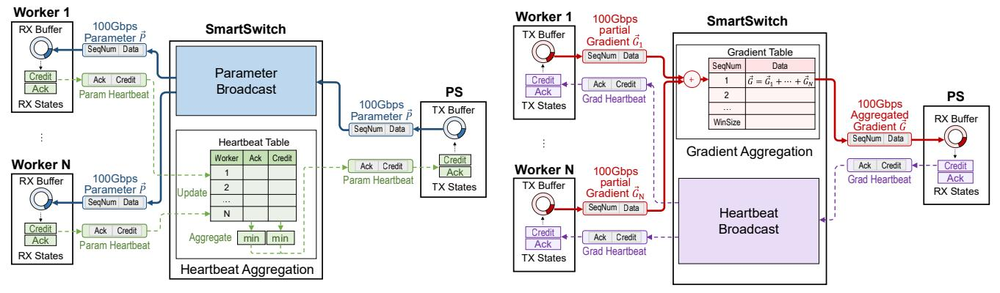
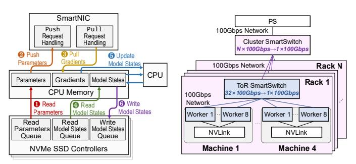
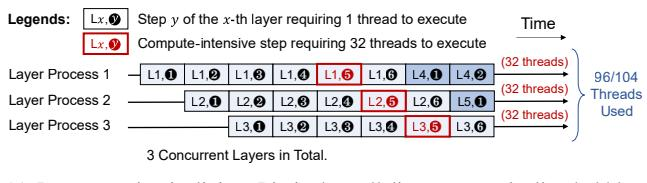

# C. SmartSwitch-Assisted Many-to-One Reliable Protocol

To address C2, we propose a SmartSwitch-assisted reliable protocol that uses SmartSwitch to aggregate ACKs from

(a) PS broadcasts the parameters to all workers.

(b) PS receives aggregated gradients from workers.

Fig. 10. SmartSwitch-assisted many-to-one reliable protocol that reduces the acknowledgement traffic between the SmartSwitch and the PS.

workers to the parameter server and broadcast ACKs reversely. A reliable protocol requires 1) flow control that ensures the sender sends data at the same rate as the receiver receives data to prevent a fast sender from overwhelming the receiver, and 2) reliability assurance that the primitives can detect and recover packet loss or data error.

1) Naïve Solutions: Establishing One-to-One Reliable Connections: A straightforward solution is to establish a one-to-one reliable connection between the SmartSwitch and each worker/PS. However, this solution requires the switch to act as an endpoint executing heavy reliable protocol, which is impractical due to insufficient hardware resources. Specifically, a Tofino SmartSwitch processes a packet in a pipeline with  $\leq$ 20 hardware stages [68], whereas a reliable RDMA or TCP packet requires more than 50 hardware stages to process.

Another solution is to establish a one-to-one reliable connection between each worker and the PS, such that the SmartSwitch only forwards the acknowledgment packets without any processing. However, this method has two issues: First, a PS that executes reliable protocols with many (e.g., 64) workers simultaneously incurs high implementation complexity to SmartNICs; Second, existing TCP and RDMA adopt per-packet acknowledgment, so the PS must receive many acknowledgment packets from workers after sending one data packet. Consequently, massive acknowledgment packets occupy non-negligible network bandwidth, lowering the throughput. To demonstrate this, we simulate the maximum achievable data throughput with different numbers of workers under 100Gbps network. The orange line in Figure 8 shows that the throughput drops to 30Gbps with 32 workers, and only 18Gbps with 64 workers.

2) Our Solution: SmartSwitch-Assisted Many-to-One Reliable Protocol: To this end, we propose a SmartSwitch-assisted many-to-one reliable protocol that 1) uses periodical heartbeat packets to reduce the acknowledgment traffic between workers and the PS, and 2) uses SmartSwitch to aggregate many heartbeat packets from workers to one heartbeat packet to the PS, and broadcast one heartbeat packet from PS to many heartbeat packets to workers. Thus, the PS only sends and receives one acknowledgment packet for each heartbeat cycle, regardless of the number of workers to maintain good scalability. The

blue line in Figure 8 shows that our SmartSwitch-assisted protocol achieves a higher data throughput than one-to-one reliable connections, and the throughput does not drop as the number of workers scales.

Packet Transport Procedure. Figure 10 illustrates the packet transport procedure of DisDP. The SmartSwitch follows SwitchML [114] to broadcast parameters and aggregate gradients. Additionally, each worker and the PS periodically send heartbeat packets containing two connection states: Ack that indicates the next expected sequence number, and Credit field that indicates the maximum sequence number the heartbeat sender can accept. The SmartSwitch broadcasts the gradient heartbeat from the PS to all workers. Meanwhile, it maintains a heartbeat table to record the latest parameter heartbeat from each worker, and periodically performs minimum aggregation to Ack and Credit in the table and sends a heartbeat packet containing the aggregated states to the PS.

For flow control, a worker/PS ceases sending packets once it sends a packet with a sequence number equal to its TX Credit value, and resumes only after TX Credit value is updated by the heartbeat packets; for reliability assurance, once a Worker/PS detects that its TX Ack value has not increased for a user-defined period (e.g., 1 second) while there are still packets not acknowledged, it resends packets starting from the sequence number Ack. Upon receiving a resent packet, the SmartSwitch forwards the corresponding aggregated gradient packet to the PS.

## D. Step-Centric Optimizer Pipelining

Thanks to the SmartSwitch-assisted many-to-one reliable protocol that provides reliable aggregated gradients, our PS needs to perform Adam optimizer on the line-rate aggregated gradients and provide on-demand parameters to GPUs. However, it is not trivial to achieve. The main challenge is that the size of model states is way larger than the host memory size, so it is generally assumed that a 100B model needs many CPU servers to implement the corresponding CPU optimizer [43]. To this end, to address C3, we propose the *step-centric pipelining technology* to 1) allocate PS's CPU threads by optimizer steps, instead of by layers, and 2) deeply pipeline SSD accesses, CPU Adam, and collectives to enable an out-

Fig. 11. Data path of the in-network optimizer during the backward stage.

Fig. 12. Multi-rack topology of DisDP.

TABLE III
RESOURCE REQUIREMENTS FOR ADAM OPTIMIZER.

| Network Thpt | Stage | Compute FLOPS | Mem Bandwidth (Read+Write Total) | SSD Bandwidth (Per Direction) |
|-----------------|-------|------------------|-------------------------------------|----------------------------------|
| 100Gbps         | Fwd   | 0                | 23.3 GB/s                           | 11.6 GB/s                        |
| Toognps         | Bwd   | 99.0 GFLOPS      | 349 GB/s                            | 81.4 GB/s                        |
| 200Gbps         | Fwd   | 0                | 46.6 GB/s                           | 23.3 GB/s                        |
| 200Gups         | Bwd   | 198 GFLOPS       | 698 GB/s                            | 163 GB/s                         |

of-core optimizer to consume 100Gbps aggregated gradients. Figure 11 illustrates a simplified data path of our out-of-core optimizer. In the following, we present the resource requirement of a training iteration that consists of two stages: forward and backward, followed by the detailed design of *step-centric pipelining technology*.

**Forward Stage.** During this stage, the optimizer needs to provide on-demand parameters to GPUs. It undergoes two steps: ● Reading 2-byte parameters from the SSDs to the CPU memory, and ● pushing 2-byte parameters from CPU memory to SmartNIC. Therefore, providing 100Gbps (11.6 GB/s) ondemand parameters to GPUs requires 23.3 GB/s memory bandwidth and 11.6 GB/s SSD bandwidth in Table III.5

Backward Stage. During this stage, the optimizer provides on-demand parameters to GPUs and performs the Adam operation on the aggregated gradients. It undergoes the two steps (1) and 2) and four additional steps: 3 pulling 2-byte gradients from the SmartNIC to the CPU memory, 4 reading 12-byte model states from SSDs to the CPU memory, 5 performing the compute-intensive CPU Adam, where the CPU reads 2-byte gradients and 12-byte model states from the memory, performs 17 floating-point operations to update model states [56], and writes 12-byte updated model states and 2-byte parameter copy to the memory, and 6 writing 12-byte updated model states and 2-byte parameter copy back to SSDs. This stage requires 99 GFLOPS computation, 349 GB/s memory bandwidth, and 81.4 GB/s SSD bandwidth.

Naïve Solution: Layer-Centric Pipelining. A straightforward method to pipeline the optimizer steps is *layer-centric pipelining*, which assigns a fixed number of CPU threads for each model layer to sequentially execute the optimizer steps. This method naturally pipelines the steps by concurrently executing the optimizer across multiple layers. However, this approach incurs an issue: Different steps in the optimizer require varying numbers of CPU threads to saturate. In par-

(a) Layer-centric pipelining: Limited parallelism causes pipeline bubbles.

| Optimizer e    | xecution of a layer r                 | otates b      | etween       | process        | es.          |              |              |              |         |
|----------------|---------------------------------------|---------------|--------------|----------------|--------------|--------------|--------------|--------------|---------|
| Step  Process  | 1, <b>0</b> L2, <b>0</b> L2, <b>0</b> | L3, <b>①</b>  | L4, <b>0</b> | L5, <b>0</b>   | L6, <b>€</b> | L7, <b>€</b> | L8, <b>①</b> | (1 thread)   | )       |
| Step @ Process | L1, <b>⊘</b>                          | L2, <b>❷</b>  | L3, <b>2</b> | L4, <b>2</b>   | L5, <b>❷</b> | L6, <b>❷</b> | L7, <b>❷</b> | (1 thread)   | 37/104  |
| Step 6 Process |                                       | _L1, <b>❸</b> | L2, <b>6</b> | L3, <b>6</b>   | L4, <b>❸</b> | L5, <b>1</b> | L6, <b>❸</b> | (1 thread)   | Threads |
| Step 4 Process |                                       | <del></del> - | L1, <b>0</b> | L2,            | L3, <b>4</b> | L4, <b>①</b> | L5, <b>①</b> | (32 threads) | Used    |
| Step 6 Process |                                       |               |              | L1, <b>6</b>   | L2, <b>6</b> | L3, <b>6</b> | L4, <b>6</b> | (1 thread)   |         |
| Step 6 Process |                                       |               |              | <del>`</del> , | L1, <b>ઉ</b> | L2, <b>6</b> | L3, <b>6</b> | (Tilleau)    | J       |
|                |                                       |               |              |                |              |              |              |              |         |

6 Concurrent Layers in Total.

(b) Our step-centric pipelining: Fully pipelines the optimizer steps.

Fig. 13. Pipelining of collectives, SSD IO, and CPU Adam during the backward stage.

TABLE IV RESOURCES PROVIDED BY DIFFERENT CPUS.

| CPU           | Compute FLOPS | Mem Bandwidth | PCIe Bandwidth |
|---------------|---------------|---------------|----------------|
| 5320 (Gen 4)  | 1.83 TFLOPS   | 375 GB/s      | 246 GB/s       |
| 6730P (Gen 5) | 2.56 TFLOPS   | 819 GB/s      | 678 GB/s       |

ticular, CPU Adam (Step 5) requires 32 threads on Intel Xeon 5320 CPU to consume aggregated gradients at line rate, while the remaining steps only require 1 CPU thread to saturate. Consequently, layer-centric pipelining requires 32 CPU threads to execute each model layer, thereby limiting the overall achievable parallelism in Figure 13(a).

**Our Solution: Step-Centric Pipelining.** To address the limited parallelism issue, we propose *step-centric pipelining* that allocates CPU threads to each optimizer step. Each step executes one layer at a time and a layer rotates from the first step to the last. This technology allows us to allocate more threads to the compute-intensive Step **3** and fewer threads to the remaining steps, as Figure 13(b) shows, so as to enable full pipelining of optimizer steps with a small number of CPU threads, e.g., 37 threads in Figure 13(b).

100B Model Optimizer in a Scalable PS. Table IV shows the compute power, memory bandwidth, and PCIe bandwidth of two commodity machines, each with two CPUs: Intel Xeon 5320 (PCIe Gen 4) and 6730P (PCIe Gen 5). We observe that 6730P (or 5320) machine can satisfy more than 200Gbps (or 100Gbps) network, in case the machine provides sufficient SSD bandwidth, e.g., with 12 SSDs. We conclude that a single scalable PS is sufficient to concurrently provide on-demand parameters and perform the Adam operation on the aggregated gradients from any number of workers at line rate.

**Supporting Multi-Rack.** DisDP supports training on multirack clusters by hierarchical switches in a topology shown in Figure 12. Each rack employs a ToR SmartSwitch to aggregate gradients from its workers to compute partial aggregated gradients. A cluster SmartSwitch aggregates partial aggregated gradients from the ToR SmartSwitches and forwards the fully aggregated gradients to the PS. The parameters are broadcast in a reverse hierarchical manner. Supporting more workers only needs a deeper hierarchy of SmartSwitches.

&lt;sup>5Providing 200Gbps on-demand parameters doubles the memory and SSD bandwidths

TABLE V MODELS FOR EVALUATION. CUSTOM MODELS KEEP THE SAME ARCHITECTURE AS OPT MODELS WITH RANDOM PARAMETERS.

| Model       | #Transformer Blocks | #Head | Hidden Dimension |
|-------------|---------------------|-------|------------------|
| OPT-1.3B    | 24                  | 32    | 2048             |
| OPT-2.7B    | 32                  | 32    | 2560             |
| OPT-6.7B    | 32                  | 32    | 4096             |
| OPT-13B     | 40                  | 40    | 5120             |
| OPT-30B     | 48                  | 56    | 7168             |
| OPT-66B     | 64                  | 72    | 9216             |
| Custom-175B | 96                  | 96    | 12288            |
| Custom-276B | 112                 | 112   | 14336            |
| Custom-505B | 124                 | 144   | 18432            |
| Custom-1.0T | 172                 | 172   | 22016            |

## IV. EVALUATION

# C. SmartSwitch-Assisted Many-to-One Reliable Protocol

To address C2, we propose a SmartSwitch-assisted reliable protocol that uses SmartSwitch to aggregate ACKs from

(a) PS broadcasts the parameters to all workers.

(b) PS receives aggregated gradients from workers.

Fig. 10. SmartSwitch-assisted many-to-one reliable protocol that reduces the acknowledgement traffic between the SmartSwitch and the PS.

workers to the parameter server and broadcast ACKs reversely. A reliable protocol requires 1) flow control that ensures the sender sends data at the same rate as the receiver receives data to prevent a fast sender from overwhelming the receiver, and 2) reliability assurance that the primitives can detect and recover packet loss or data error.

1) Naïve Solutions: Establishing One-to-One Reliable Connections: A straightforward solution is to establish a one-to-one reliable connection between the SmartSwitch and each worker/PS. However, this solution requires the switch to act as an endpoint executing heavy reliable protocol, which is impractical due to insufficient hardware resources. Specifically, a Tofino SmartSwitch processes a packet in a pipeline with  $\leq$ 20 hardware stages [68], whereas a reliable RDMA or TCP packet requires more than 50 hardware stages to process.

Another solution is to establish a one-to-one reliable connection between each worker and the PS, such that the SmartSwitch only forwards the acknowledgment packets without any processing. However, this method has two issues: First, a PS that executes reliable protocols with many (e.g., 64) workers simultaneously incurs high implementation complexity to SmartNICs; Second, existing TCP and RDMA adopt per-packet acknowledgment, so the PS must receive many acknowledgment packets from workers after sending one data packet. Consequently, massive acknowledgment packets occupy non-negligible network bandwidth, lowering the throughput. To demonstrate this, we simulate the maximum achievable data throughput with different numbers of workers under 100Gbps network. The orange line in Figure 8 shows that the throughput drops to 30Gbps with 32 workers, and only 18Gbps with 64 workers.

2) Our Solution: SmartSwitch-Assisted Many-to-One Reliable Protocol: To this end, we propose a SmartSwitch-assisted many-to-one reliable protocol that 1) uses periodical heartbeat packets to reduce the acknowledgment traffic between workers and the PS, and 2) uses SmartSwitch to aggregate many heartbeat packets from workers to one heartbeat packet to the PS, and broadcast one heartbeat packet from PS to many heartbeat packets to workers. Thus, the PS only sends and receives one acknowledgment packet for each heartbeat cycle, regardless of the number of workers to maintain good scalability. The

blue line in Figure 8 shows that our SmartSwitch-assisted protocol achieves a higher data throughput than one-to-one reliable connections, and the throughput does not drop as the number of workers scales.

Packet Transport Procedure. Figure 10 illustrates the packet transport procedure of DisDP. The SmartSwitch follows SwitchML [114] to broadcast parameters and aggregate gradients. Additionally, each worker and the PS periodically send heartbeat packets containing two connection states: Ack that indicates the next expected sequence number, and Credit field that indicates the maximum sequence number the heartbeat sender can accept. The SmartSwitch broadcasts the gradient heartbeat from the PS to all workers. Meanwhile, it maintains a heartbeat table to record the latest parameter heartbeat from each worker, and periodically performs minimum aggregation to Ack and Credit in the table and sends a heartbeat packet containing the aggregated states to the PS.

For flow control, a worker/PS ceases sending packets once it sends a packet with a sequence number equal to its TX Credit value, and resumes only after TX Credit value is updated by the heartbeat packets; for reliability assurance, once a Worker/PS detects that its TX Ack value has not increased for a user-defined period (e.g., 1 second) while there are still packets not acknowledged, it resends packets starting from the sequence number Ack. Upon receiving a resent packet, the SmartSwitch forwards the corresponding aggregated gradient packet to the PS.

## D. Step-Centric Optimizer Pipelining

Thanks to the SmartSwitch-assisted many-to-one reliable protocol that provides reliable aggregated gradients, our PS needs to perform Adam optimizer on the line-rate aggregated gradients and provide on-demand parameters to GPUs. However, it is not trivial to achieve. The main challenge is that the size of model states is way larger than the host memory size, so it is generally assumed that a 100B model needs many CPU servers to implement the corresponding CPU optimizer [43]. To this end, to address C3, we propose the *step-centric pipelining technology* to 1) allocate PS's CPU threads by optimizer steps, instead of by layers, and 2) deeply pipeline SSD accesses, CPU Adam, and collectives to enable an out-

Fig. 11. Data path of the in-network optimizer during the backward stage.

Fig. 12. Multi-rack topology of DisDP.

TABLE III
RESOURCE REQUIREMENTS FOR ADAM OPTIMIZER.

| Network Thpt | Stage | Compute FLOPS | Mem Bandwidth (Read+Write Total) | SSD Bandwidth (Per Direction) |
|-----------------|-------|------------------|-------------------------------------|----------------------------------|
| 100Gbps         | Fwd   | 0                | 23.3 GB/s                           | 11.6 GB/s                        |
| Toognps         | Bwd   | 99.0 GFLOPS      | 349 GB/s                            | 81.4 GB/s                        |
| 200Gbps         | Fwd   | 0                | 46.6 GB/s                           | 23.3 GB/s                        |
| 200Gups         | Bwd   | 198 GFLOPS       | 698 GB/s                            | 163 GB/s                         |

of-core optimizer to consume 100Gbps aggregated gradients. Figure 11 illustrates a simplified data path of our out-of-core optimizer. In the following, we present the resource requirement of a training iteration that consists of two stages: forward and backward, followed by the detailed design of *step-centric pipelining technology*.

**Forward Stage.** During this stage, the optimizer needs to provide on-demand parameters to GPUs. It undergoes two steps: ● Reading 2-byte parameters from the SSDs to the CPU memory, and ● pushing 2-byte parameters from CPU memory to SmartNIC. Therefore, providing 100Gbps (11.6 GB/s) ondemand parameters to GPUs requires 23.3 GB/s memory bandwidth and 11.6 GB/s SSD bandwidth in Table III.5

Backward Stage. During this stage, the optimizer provides on-demand parameters to GPUs and performs the Adam operation on the aggregated gradients. It undergoes the two steps (1) and 2) and four additional steps: 3 pulling 2-byte gradients from the SmartNIC to the CPU memory, 4 reading 12-byte model states from SSDs to the CPU memory, 5 performing the compute-intensive CPU Adam, where the CPU reads 2-byte gradients and 12-byte model states from the memory, performs 17 floating-point operations to update model states [56], and writes 12-byte updated model states and 2-byte parameter copy to the memory, and 6 writing 12-byte updated model states and 2-byte parameter copy back to SSDs. This stage requires 99 GFLOPS computation, 349 GB/s memory bandwidth, and 81.4 GB/s SSD bandwidth.

Naïve Solution: Layer-Centric Pipelining. A straightforward method to pipeline the optimizer steps is *layer-centric pipelining*, which assigns a fixed number of CPU threads for each model layer to sequentially execute the optimizer steps. This method naturally pipelines the steps by concurrently executing the optimizer across multiple layers. However, this approach incurs an issue: Different steps in the optimizer require varying numbers of CPU threads to saturate. In par-

(a) Layer-centric pipelining: Limited parallelism causes pipeline bubbles.

| Optimizer e    | xecution of a layer r                 | otates b      | etween       | process        | es.          |              |              |              |         |
|----------------|---------------------------------------|---------------|--------------|----------------|--------------|--------------|--------------|--------------|---------|
| Step  Process  | 1, <b>0</b> L2, <b>0</b> L2, <b>0</b> | L3, <b>①</b>  | L4, <b>0</b> | L5, <b>0</b>   | L6, <b>€</b> | L7, <b>€</b> | L8, <b>①</b> | (1 thread)   | )       |
| Step @ Process | L1, <b>⊘</b>                          | L2, <b>❷</b>  | L3, <b>2</b> | L4, <b>2</b>   | L5, <b>❷</b> | L6, <b>❷</b> | L7, <b>❷</b> | (1 thread)   | 37/104  |
| Step 6 Process |                                       | _L1, <b>❸</b> | L2, <b>6</b> | L3, <b>6</b>   | L4, <b>❸</b> | L5, <b>1</b> | L6, <b>❸</b> | (1 thread)   | Threads |
| Step 4 Process |                                       | <del></del> - | L1, <b>0</b> | L2,            | L3, <b>4</b> | L4, <b>①</b> | L5, <b>①</b> | (32 threads) | Used    |
| Step 6 Process |                                       |               |              | L1, <b>6</b>   | L2, <b>6</b> | L3, <b>6</b> | L4, <b>6</b> | (1 thread)   |         |
| Step 6 Process |                                       |               |              | <del>`</del> , | L1, <b>ઉ</b> | L2, <b>6</b> | L3, <b>6</b> | (Tilleau)    | J       |
|                |                                       |               |              |                |              |              |              |              |         |

6 Concurrent Layers in Total.

(b) Our step-centric pipelining: Fully pipelines the optimizer steps.

Fig. 13. Pipelining of collectives, SSD IO, and CPU Adam during the backward stage.

TABLE IV RESOURCES PROVIDED BY DIFFERENT CPUS.

| CPU           | Compute FLOPS | Mem Bandwidth | PCIe Bandwidth |
|---------------|---------------|---------------|----------------|
| 5320 (Gen 4)  | 1.83 TFLOPS   | 375 GB/s      | 246 GB/s       |
| 6730P (Gen 5) | 2.56 TFLOPS   | 819 GB/s      | 678 GB/s       |

ticular, CPU Adam (Step 5) requires 32 threads on Intel Xeon 5320 CPU to consume aggregated gradients at line rate, while the remaining steps only require 1 CPU thread to saturate. Consequently, layer-centric pipelining requires 32 CPU threads to execute each model layer, thereby limiting the overall achievable parallelism in Figure 13(a).

**Our Solution: Step-Centric Pipelining.** To address the limited parallelism issue, we propose *step-centric pipelining* that allocates CPU threads to each optimizer step. Each step executes one layer at a time and a layer rotates from the first step to the last. This technology allows us to allocate more threads to the compute-intensive Step **3** and fewer threads to the remaining steps, as Figure 13(b) shows, so as to enable full pipelining of optimizer steps with a small number of CPU threads, e.g., 37 threads in Figure 13(b).

100B Model Optimizer in a Scalable PS. Table IV shows the compute power, memory bandwidth, and PCIe bandwidth of two commodity machines, each with two CPUs: Intel Xeon 5320 (PCIe Gen 4) and 6730P (PCIe Gen 5). We observe that 6730P (or 5320) machine can satisfy more than 200Gbps (or 100Gbps) network, in case the machine provides sufficient SSD bandwidth, e.g., with 12 SSDs. We conclude that a single scalable PS is sufficient to concurrently provide on-demand parameters and perform the Adam operation on the aggregated gradients from any number of workers at line rate.

**Supporting Multi-Rack.** DisDP supports training on multirack clusters by hierarchical switches in a topology shown in Figure 12. Each rack employs a ToR SmartSwitch to aggregate gradients from its workers to compute partial aggregated gradients. A cluster SmartSwitch aggregates partial aggregated gradients from the ToR SmartSwitches and forwards the fully aggregated gradients to the PS. The parameters are broadcast in a reverse hierarchical manner. Supporting more workers only needs a deeper hierarchy of SmartSwitches.

&lt;sup>5Providing 200Gbps on-demand parameters doubles the memory and SSD bandwidths

TABLE V MODELS FOR EVALUATION. CUSTOM MODELS KEEP THE SAME ARCHITECTURE AS OPT MODELS WITH RANDOM PARAMETERS.

| Model       | #Transformer Blocks | #Head | Hidden Dimension |
|-------------|---------------------|-------|------------------|
| OPT-1.3B    | 24                  | 32    | 2048             |
| OPT-2.7B    | 32                  | 32    | 2560             |
| OPT-6.7B    | 32                  | 32    | 4096             |
| OPT-13B     | 40                  | 40    | 5120             |
| OPT-30B     | 48                  | 56    | 7168             |
| OPT-66B     | 64                  | 72    | 9216             |
| Custom-175B | 96                  | 96    | 12288            |
| Custom-276B | 112                 | 112   | 14336            |
| Custom-505B | 124                 | 144   | 18432            |
| Custom-1.0T | 172                 | 172   | 22016            |

## IV. EVALUATION

