# DisDP: Disaggregating Compute, Network, and Storage for Model-Sharded Data-Parallel Training

Mo Sun, Zihan Yang, Changyue Liao, Yingtao Li, Jie Zhang, Kaiqi Chen, Fei Wu and Zeke Wang Zhejiang University, China

{sunmo,zihanyang,changyueliao,Li Yingtao,carlzhang4,chiaki cage,wufei,wangzeke}@zju.edu.cn

*Abstract*—Model-sharded data parallelism (MSDP), e.g., ZeRO, evenly shards the model states across all GPUs, and thus has been widely adopted by LLM pre-training, such as Llama and DeepSeek, due to its low GPU memory capacity requirement. However, MSDP introduces severe overhead from additional network communication collectives (i.e., **AllGather** and **ReduceScatter**). Although the collectives themselves only occupy fewer than 10% of GPU SMs, their execution time increases by 41% due to the serial execution of aggregated CPU/GPUmanaged compute (i.e., GEMM), network (i.e., NCCL), and storage (i.e., optimizer states). To this end, we present DisDP, a fully disaggregated distributed data-parallel architecture that first fully disaggregates compute, network, and storage for MSDP, such that GPUs only focus on the computing part, and thus the GPU utilization is maximized. The key idea is 1) fully offloading collectives to SmartNICs and SmartSwitch to avoid interference between GEMM kernels and collective kernels, and 2) fully offloading storage to a SmartSwitch-enhanced parameter server that allows a single PS to serve massive workers with linear scalability. DisDP on 8 distributed GPUs outperforms the stateof-the-art training systems by 3.98× when training on a 175B model, validating the efficiency of disaggregation.

## I. INTRODUCTION

Large language models (LLMs) have made advances in application domains such as natural language processing [\[1\]](#page-13-0), [\[2\]](#page-13-1), programming [\[3\]](#page-13-2), and computer vision [\[4\]](#page-13-3)–[\[6\]](#page-13-4). Along with the advances of LLM are their fast-growing model sizes, from 100M-scale [\[1\]](#page-13-0) to 100B-scale [\[7\]](#page-13-5)–[\[10\]](#page-13-6). Training a large-scale model requires using many GPUs with efficient parallelism strategies [\[11\]](#page-13-7)–[\[29\]](#page-13-8). Among these strategies, model replicated data parallelism (MRDP or DP) [\[30\]](#page-13-9)–[\[48\]](#page-14-0) replicates the model states across GPU workers, and each GPU needs to accommodate the entire model state, including all parameters and auxiliary optimizer states. So, an NVIDIA H100 GPU cluster (each GPU with 80 GB of device memory) even fails to train a 7B model (with 112 GB gradients and model states), regardless of the number of GPUs in the cluster.

Model-Sharded DP (MSDP). To address the limitation of trainable model size, memory-efficient MSDP such as ZeRO [\[49\]](#page-14-1)–[\[62\]](#page-14-2) and PyTorch FSDP [\[51\]](#page-14-3) are proposed to evenly shard the model states across all GPU workers, as shown in Figure [1\(a\).](#page-1-0)[1](#page-0-0) With enough GPUs, MSDP allows training a huge model, and thus has been adopted by DeepSeek [\[63\]](#page-14-4) and Llama [\[64\]](#page-14-5) to pre-train 100B-scale mod-

1 In this paper, we refer to a worker as a GPU paired with a NIC. els.[2](#page-0-1) Therefore, the optimization of MSDP itself is important. However, MSDP comes at the cost of extra collective operations, i.e., AllGather, to fetch on-demand parameters within an iteration. We observe that although network communication itself consumes relatively low GPU resources, its aggregated computation and collectives on GPUs lead to severe interference. In particular, with GPUs' non-preemptive scheduling policy, current-round compute-intensive GEMM kernels would occupy all GPU SMs and block next-round communication kernels from launching, even without dependencies. In our experiment, ZeRO-Infinity [\[57\]](#page-14-6) on 8× 1-GPU machines under a 100Gbps network only achieves 15% Model FLOPS Utilization (MFU) when training a 175B model.

SmartSwitch-Enhanced MSDP. Prior works [\[66\]](#page-14-7), [\[67\]](#page-14-8) adopt a SmartSwitch [\[68\]](#page-14-9), [\[69\]](#page-14-10) in MRDP to optimize AllReduce collectives by aggregating gradients in the SmartSwitch, thus reducing required network traffic and communication time, as shown in Figure [1\(b\).](#page-1-1) However, introducing SmartSwitch further to MSDP can barely reduce the required communication time, as both AllGather (AG) and ReduceScatter (RS) collectives used by MSDP can not be ideally optimized. For AG, SmartSwitch can only reduce the worker sending traffic, while the receiving traffic remains the same and thus bound the overall communication time. Similarly, SmartSwitch can only reduce the worker receiving traffic in RS, while the sending traffic remains the same and thus bound the overall communication time. Existing collective libraries like NCCL cannot efficiently overlap AG and RS due to network bandwidth contention on NIC, thus developers can not run AG and RS concurrently to combine the benefits of SmartSwitchenabled AG and RS to fully exploit duplex network bandwidth, thus reducing communication time.

Model-in-Server DP (MiSDP). Prior works [\[33\]](#page-13-10), [\[34\]](#page-13-11), [\[39\]](#page-13-12) adopt parameter servers (PSs) to minimize network traffic. Each worker only needs to push its gradients to PS and pull parameters from PS, while MiSDP needs PS to aggregate gradients to update parameters. As such, MiSDP reduces onethird of the collective traffic compared to MSDP. However, MiSDP on the one hand requires a large number of additional CPU machines (PSs) to provide adequate CPU compute power and memory bandwidth for heavy gradient aggregation and

2Though DeepSeek and Llama use 3D parallelism, including DP, TP, and PP, MSDP is important, especially in the pertaining phase that takes 80%~95% of the total training steps [\[8\]](#page-13-13), [\[65\]](#page-14-11). For example, Llama 3 applies 128-degree MSDP, while employing 8-degree TP and 16-degree PP [\[64\]](#page-14-5).

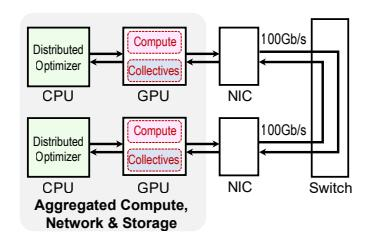

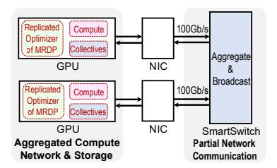

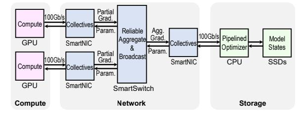

- lectives and computation on GPU.
- to SmartSwitch.
- (a) ZeRO-Infinity: Full aggregation so (b) SwitchML: Partial disaggregation due to (c) DisDP: Fully disaggregates compute, network (i.e., collectives), suffering from interference between col- only offloading in-network aggregation logic and storage (i.e., optimizer) such that GPUs only focus on the computing part to maximize GPU utilization.

Fig. 1. Comparison of different DP architectures. Both ZeRO-Infinity and SwitchML aggregate compute, network, and storage on worker CPU/GPU, leading to severe interference, while DisDP fully disaggregates compute, network, and storage for high GPU utilization.

TABLE I COMPARISON BETWEEN DP ARCHITECTURES. DISDP DISAGGREGATES COMPUTE, NETWORK AND STORAGE, SO GPUS ACHIEVE MAXIMUM UTILIZATION.

| Interference-Free Network | Traffic-Optimal Collective Topology                               | Low-Overhead Optimizer Execution                                                                                                                  |
|------------------------------|----------------------------------------------------------------------|------------------------------------------------------------------------------------------------------------------------------------------------------|
| No                           | No                                                                   | Yes (But colocated CPU optimizer could interfere                                                                                                     |
| (GPU Contention)             | (Peer-Based AG/RS)                                                   | with GPU due to intra-node PCIe contention)                                                                                                          |
| No                           | Vac                                                                  | Yes (But colocated CPU optimizer could interfere                                                                                                     |
| (GPU Contention)             | ies                                                                  | with GPU due to intra-node PCIe contention)                                                                                                          |
| No                           | Yes                                                                  | No (Requiring many additional machines                                                                                                               |
| (GPU Contention)             | (But only for non-colocated PS)                                      | as PSs for aggregation/broadcast)                                                                                                                    |
| Yes                          | Yes                                                                  | Yes (Requiring only 1 additional machine as scalable PS)                                                                                             |
|                              | Network  No (GPU Contention) No (GPU Contention) No (GPU Contention) | Network Collective Topology  No No (GPU Contention) (Peer-Based AG/RS)  No Yes (GPU Contention) Yes (GPU Contention) (But only for non-colocated PS) |

Adam optimizer. In our experiments, 16 GPU workers that run colocated PS processes require at least 13 additional CPU machines as non-colocated PSs to achieve line rate (Figure 5). On the other hand, MiSDP would still suffer from interference between GPU-centric network communication and computation, which leads to low MFU during training.

Our Design: DisDP. Inspired by DeepSeek [63], [70] that argues to use a dedicated network processor for collectives that originally run on GPUs, we propose DisDP, a Fully Disaggregated Distributed Data Parallelism that first disaggregates compute, network (i.e., collectives), and storage (i.e., optimizer) for MSDP to maximize the GPU's utilization in Figure 1(c). The key idea of DisDP is twofold. First, it offloads collectives to SmartNICs to avoid interference between GEMM kernels and collective kernels (network disaggregation). Second, it offloads the optimizer to a scalable PS where a single PS can serve any number of workers (storage disaggregation). As such, GPUs focus on computation for which GPUs are originally designed, and thus maximizing their utilization, as Table I concludes. To do so, DisDP consists of three innovations:

- SmartNIC-Managed Interference-Free Collectives. We propose the first SmartNIC-managed collectives that disaggregate GEMM kernels and collective kernels to completely avoid interference between them.
- SmartSwitch-Assisted Many-to-One Reliable Protocol. To address the incast problem introduced by serving many workers with a few PSs, DisDP uses a SmartSwitch to aggregate gradients from workers to the PS and broadcast parameters reversely. However, each worker has to maintain a reliable connection with the PS, and the number of

extra reliability-related packets increases with the number of workers. As the number of workers increases, reliabilityrelated packets soon exhaust the PS network IOPS and degrade the overall network performance. To this end, we propose the SmartSwitch-assisted reliable protocol, which leverages SmartSwitch to reduce the required reliabilityrelated packets.

Step-Centric Optimizer Pipelining. Unlike traditional MiSDP that features a large number of PSs, DisDP requires only a single PS to perform optimizer computation for massive workers. The challenge is that traditional layercentric pipelining would soon exhaust all available CPU threads on the PS, and thus fails to consume line-rate aggregated gradients. Therefore, we propose a step-centric pipelining on the PS to maximize CPU thread usage, so as to consume the aggregated gradients at line rate.

We prototype the SmartNICs with Xilinx U50 FPGA boards. We evaluate DisDP on eight  $1 \times A100$  GPU machines and 1 CPU machine under a 100Gbps network. Experiment results show that DisDP with 100Gb/s interference-free innetwork collectives achieves 1.17× higher throughput than ZeRO-Offload on the DGX machines (intra-machine GPUs are fully connected with 600GB/s NVLink), while keeping only 60% capex cost of the DGX machines.

## II. BACKGROUND AND MOTIVATION

## A. Issues of Model-Sharded DP (MSDP)

MSDP relies on two optimizations for memory-efficient training: 1) it evenly shards model states and optimizer execution across all workers to aggregate the memory of multiple GPUs, and 2) it offloads the optimizer to CPU memory or

| CUDA Call Sequence: AG1 → GEMM1 → AG2 → RS1 → GEMM2 → RS2                             |      |  |      |      |      |  |
|---------------------------------------------------------------------------------------|------|--|------|------|------|--|
| Block due to Compute Stream GEMM 1 GEMM 2 Dependent SM contention … |      |  |      |      |      |  |
| Collective Stream                                                                     | AG 1 |  | AG 2 | RS 1 | RS 2 |  |

(a) MSDP (w/ and w/o SmartSwitch): 1) A GEMM kernel that occupies all SMs blocks subsequent collective kernels, and 2) AG and RS kernels are on the same GPU stream, thus cannot run concurrently.

| Compute Stream     |        | GEMM 1 | GEMM 2 | GEMM 3 | GEMM 4 |   |
|--------------------|--------|--------|--------|--------|--------|---|
| Pull Param. Stream | Pull 1 | Pull 2 | Pull 3 | Pull 4 | Pull 5 | … |
| Push Grad. Stream  |        |        | Push 1 | Push 2 | Push 3 |   |

(b) DisDP: 1) SmartNIC-managed collectives do not interfere with GEMM, and 2) contention-free primitives enable concurrent push (for partial gradients) and pull (for on-demand new parameters) operations.

Fig. 2. Computing and collective pattern during the backward stage: MSDP vs. DisDP. A darker color indicates more SMs being used, and white indicates no SMs being used.

SSDs to further reduce the GPU memory capacity requirement. Compared to MRDP which performs one AllReduce to exchange gradients for each model layer, MSDP requires one RS and two AG collectives for each layer during forward and backward propagation, thus causing heavy collective traffic, e.g., the collectives take 1.25×~4.5× more time over GPU computation (Figure [3\(a\)\)](#page-2-0). Current MSDP systems employ collective libraries such as NCCL [\[71\]](#page-14-13) to execute RS and AG on GPUs. These systems try to pipeline collectives and model computation (i.e., GEMM), assuming that the two processes utilize distinct hardware resources, thereby enabling their overlapping. However, MSDP's aggregated computation and collectives on GPU cause severe interference, mostly serial execution, thus leading to low GPU utilization, e.g., 15% MFU on eight 1-GPU machines (Figure [16\(a\)\)](#page-9-0).

Even if we enabled to run GEMM and collective kernels concurrently, it still suffers from severe interference from the following two main issues:

1, GPU Computing Unit Contention. GEMM and collective kernels compete for GPU computing units, i.e., streaming multiprocessors (SMs). Collective kernels only require a small portion of SMs (a few percent to 10%) [\[72\]](#page-14-14), and intuitively, we think it is easy to overlap the GEMM and collective kernels to achieve a high GPU SM utilization. However, due to GPUs' non-preemptive scheduling policy, a computeintensive GEMM kernel that occupies all SMs will block subsequent collectives from launching [\[73\]](#page-14-15), even though a collective kernel has the highest priority. Figure [2\(a\)](#page-2-1) shows an example where "GEMM 1" blocks "AG 2" from launching. After "GEMM 1" finishes and "AG 2" starts, "GEMM 2" cannot be launched because it depends on the completion of "AG 2". Consequently, a collective kernel cannot fully overlap with GEMM kernels.

To illustrate the impact of this interference, we break down the execution time for training OPT-175B on 8× 1-GPU machines under a 100Gbps network using ZeRO-Infinity, as shown in Figure [3\(a\).](#page-2-0) Up to 65% of the collective execution time cannot overlap with GEMM at the batch size of 16, incuring 41% more execution time than ideal full overlapping. 2, GPU Memory Bandwidth Contention. GEMM and

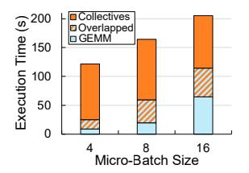

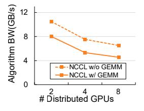

(a) Execution time breakdown in a training iteration.

(b) Impact of concurrent GEMM to NCCL AllReduce.

Fig. 3. Issues of MSDP (ZeRO-Infinity).

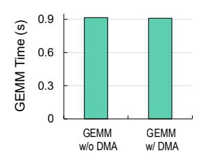

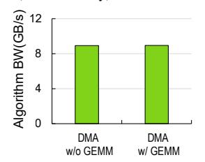

(a) Impact of concurrent DMA to GEMM execution time.

(b) Impact of concurrent GEMM to GPU DMA bandwidth.

Fig. 4. There is barely interference between GPU GEMM kernel and an external device accessing GPU memory.

collective kernels compete for memory bandwidth and L2 cache, leading to performance degradation of the collective kernels [\[73\]](#page-14-15), [\[74\]](#page-14-16). Typically, we use algorithm bandwidth to characterize the collective performance, which is defined as total data size S in a collective operation divided by collective execution time t, i.e., algorithm bandwidth BWalg = t . To show the algorithm bandwidth drop due to contention, we run independent GEMM and NCCL AllReduce kernels on distributed A100 GPUs under 100Gbps network and a typical configuration when training the OPT-175B model, and use CUDA multi-process service (MPS) to statically isolate SMs to avoid the influence of competing SMs.[3](#page-2-2) Figure [3\(b\)](#page-2-3) shows that the GEMM kernel causes a 30% algorithm bandwidth drop to the concurrent NCCL kernel.

Finding. Although the concurrently running GEMM and collectives kernels incur interference regarding SMs and GPU memory subsystem, we observe that there is barely interference when the GEMM kernel is running and the external device is reading/writing GPU memory through the PCIe. To illustrate this, we 1) measure the GEMM execution time with and without a PCIe device (e.g., an FPGA-based NIC) performing DMA requests to read/write GPU memory concurrently; and 2) measure the read/write speed of PCIe devices accessing GPU memory through DMA with/without concurrently running GEMM kernels. Figure [4](#page-2-4) indicates there is barely interference between a GEMM kernel and a DMA task of an external PCIe device. Such a finding motivates us to offload the entire collective stack on SmartNIC (i.e., network and compute disaggregation) to avoid interference.

3Even though MPS is able to partition SMs, we can not adopt it to eliminate the contention for GPU computing units in actual training because MPS only allow partitioning SMs statically, and thus is incompatible with important features like dynamic parallelism and CUDA graph [\[75\]](#page-14-17) that LLM training frameworks heavily rely on.

## B. Issues of SmartSwitch-Enhanced MSDP

To relieve the issue of MSDP, a possible way is to implement in-network computing primitives in SmartSwitch [68], [69], [76]–[80] to reduce the collective traffic via in-switch aggregation and broadcasting. However, current SmartSwitch can only provide AllReduce collective needed by MRDP, while MSDP relies on AG and RS. Even if we enabled SmartSwitch to run AG and RS, we still identify that the naïve solution has the following two issues.

1, Unchanged Collective Time for Separate AG and RS. Considering N workers performing an AG on a total data size S. Without a SmartSwitch, each worker sends its  $\frac{S}{N}$  data to every other worker and receives different  $\frac{S}{N}$  data from every other worker [31]. As such, each worker has to send (or receive)  $\frac{(N-1)S}{N}$  network traffic.

If we enabled SmartSwitch to support AG and RS, for AG, SmartSwitch can help each worker to broadcast its  $\frac{S}{N}$  to every other worker, thus each worker only has to send  $\frac{S}{N}$  network traffic, while the receiving traffic remains at  $\frac{(N-1)S}{N}$ . Similarly, for RS, SmartSwitch allows each worker to receive  $\frac{S}{N}$  traffic, while the sending traffic remains at  $\frac{(N-1)S}{N}$ . Therefore, a SmartSwitch can not reduce the network communication time for separate AG and RS because the communication time is decided by the maximum of the sending traffic and the receiving traffic.

**2, Compute-Collective Interference.** If we enabled SmartSwitch to support AG and RS, they still rely on GPU-centric NCCL for data chunk management, as the existing SHARP-based in-switch aggregation stack [81] does. Consequently, they still suffer from computation-collective interference that is identified in Subsection II-A.

## C. Issues of Model-in-Server DP (MiSDP)

To relieve the issue of MSDP, another possible way is to adopt the model-in-server DP (MiSDP) architecture [33], [34], [39], [43] that offloads the model states onto PSs. Each worker performs 1) a push operation to send its gradients to PSs, which can aggregate gradients from workers and update the corresponding optimizer states, and 2) two pull operations (one in forward stage and one in backward stage) to receive the latest parameters from PSs. Compared to two AG and one RS of MSDP for a layer  $(\frac{3(N-1)S}{N})$  in each direction), MiSDP (2S receive and S send) reduces the network traffic by at mostone-third. However, existing MiSDP systems push the entire model gradients to PS after GPU finishes computation and then pulls the entire model parameters, so that each GPU has to accommodate the full model parameters. Therefore, they fail to train 100B-scale model that cannot fit in GPU memory. Even if MiSDP were enabled to train large models, we identify that MiSDP solutions still suffer from two issues.

**1, Computation-Collective Interference.** To enable large-model training, MiSDP systems need to use GPU-centric network stacks such as IBGDA (InfiniBand with GPUDirect Async) to enable GPU to directly interact with NICs for higher network bandwidth. Therefore, they would still suffer from

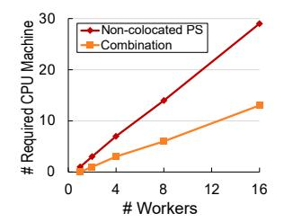

Fig. 5. Overhead of MiSDP: Many extra CPU machines.

interference between GPU computation kernels and collective kernels, as demonstrated in Subsection II-A.

2, Escalating Hardware Requirement to Aggregate Partial **Gradients.** MiSDP requires PS to provide adequate CPU compute power, memory bandwidth, and network bandwidth to perform optimizer, gradient aggregation, and parameter broadcasts. Therefore, a growing number of workers would require many additional CPU machines as PSs to consume their 100Gbps-per-worker partial gradients and produce 100Gbpsper-worker parameters, which is not always acceptable due to their monetary and space costs. To illustrate the machine requirement, we simulate the minimal machine requirement to saturate 100Gbps with different numbers of 1-GPU worker machines, where each GPU machine and each CPU machine has  $1 \times 100$ Gbps NIC. Each server runs a multi-threaded SIMD-optimized loop-unrolled Adam optimizer proposed by ZeRO-Offload [56]. We simulate on both non-colocated PS (PS processes only run on additional CPU machines) and a combination of colocated PS (PS processes run on GPU machines' spare CPUs) and non-colocated PS. Figure 5 shows that a 16-worker cluster requires 29 additional CPU machines in non-colocated PS configuration and 13 machines in a combined colocated and non-colocated PS configuration to achieve line-rate throughput.

**Finding.** We observe from Figure 5 that the scalability inefficiency of PS comes from more pressure on the memory subsystem of the server due to consuming more partial gradients from an increasing number of workers. This motivates us to offload gradient aggregation and parameter broadcasts to SmartSwitch, which produces reliable aggregated gradients to enable only one CPU machine (storage disaggregation) to accommodate 100B Adam states.4 Meanwhile, a SmartNIC would disaggregate the network and compute to eliminate the interference issue. This motivates us to use SmartNIC-SmartSwitch co-optimization to fully disaggregate compute, network, and storage, so as to benefit from reduced network traffic of MiSDP while addressing scalability and interference issues, thus achieving high MFU on scalable FSDP training.

## III. DESIGN AND IMPLEMENTATION OF DISDP

#### A. DisDP Overview

Inspired by the DeepSeek [63], [70], [82] that argues to use a dedicated network processor for collectives, we propose

4ATP [66] only offloads in-network aggregation primitive to SmartSwitch to 1) provide an AllReduce primitive, to aggregate gradients to support small model training, rather than LLM; and 2) updates its optimizer states on GPU workers. Thus, ATP suffers from interference from its partial disaggregation.

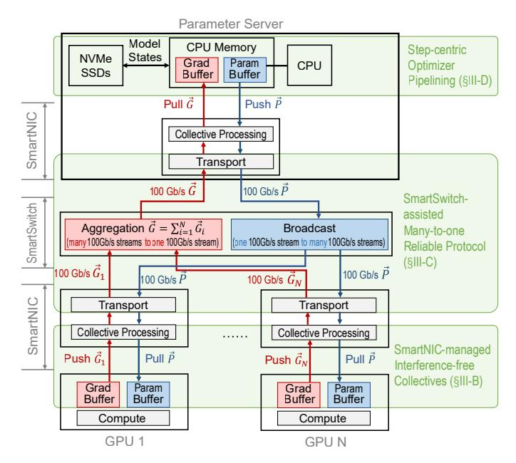

Fig. 6. System overview of DisDP. DisDP offloads collectives and the optimizer to dedicated hardware, such that GPUs only focus on the computing part to maximize their utilization.

DisDP that first fully disaggregates compute, network (i.e., collectives), and storage (i.e., optimizer) to maximize the GPU's utilization in Figure [1\(c\).](#page-1-3) The key idea of DisDP is twofold. First, it offloads collectives to SmartNICs and SmartSwitch to avoid interference between GEMM kernels and collective kernels (network disaggregation). Second, it offloads the optimizer to a scalable PS that can serve any number of workers (storage disaggregation). DisDP leverages SmartSwitch to 1) aggregate line-rate partial gradients from GPU workers to the PS that maintains 100B optimizer states, and 2) broadcast the on-demand parameters reversely. As such, GPUs focus on computation for which GPUs are originally designed, and thus maximize their utilization. However, building DisDP is not trivial, mainly due to three main challenges.

C1: Offloading collectives to SoC-based SmartNICs cannot saturate network line rate. A possible solution to avoid SM contention is to offload collectives to SoC-based SmartNICs like BlueField [\[83\]](#page-14-24). However, an SoC-based SmartNIC fails to process line-rate packets due to its internal switch link and Arm memory bandwidth bottlenecks.

C2: Existing reliable protocols would soon exhaust the asymmetrical PS network IOPS. In DisDP, the single PS has to maintain reliable connections with dozens of workers. Although the gradients/parameter packets can be aggregated/broadcast by the SmartSwitch, other packets to maintain reliable connections would exhaust the limited network IOPS of the PS, resulting in network throughput degradation.

C3: The optimizer computing would soon exhaust the PS computing power. Optimizer on the PS needs to perform Adam on the line-rate aggregated gradients and serve line-rate parameters to GPU workers. DisDP exploits SmartSwitch to reduce the number of parameter servers, which results in computing power contention on the PS. Traditional layer-centric

TABLE II CORE SOFTWARE APIS OF DISDP.

| API                                  | Description                                                        |
|--------------------------------------|--------------------------------------------------------------------|
| handle_t push(void* buf, size_t len) | Issue a contention-free push request to the SmartNIC.           |
| handle_t pull(void* buf, size_t len) | Issue a contention-free pull request to the SmartNIC.           |
| void wait(handle_t request)          | Block CPU/GPU execution until completion of a specific request. |

pipelining of the optimizer would suffer from the limited CPU threads and lead to degraded serving performance.

Overall Architecture. DisDP consists of a series of hardwaresoftware co-designs, as shown in Figure [6.](#page-4-0) The hardware part mainly consists of three components: 1) a per-GPU FPGAbased SmartNIC that provides an interference-free collective library for worker GPUs; 2) a SmartSwitch that aggregates gradients, broadcasts parameters, and maintains many-to-one reliable connections; 3) a single non-colocated PS that performs Adam on line-rate aggregated gradients and serves linerate parameters.

## *B. SmartNIC-Managed Interference-Free Collectives*

To address C1, we propose SmartNIC-managed collectives that perform the entire collectives on FPGA-based SmartNICs, while GPUs only need to perform the model's forward and backward computation. Each SmartNIC is paired with a GPU, as shown in Figure [6.](#page-4-0)

Software API. DisDP provides a two-sided software API for both workers and the PS, so as to enable the PS to prefetch parameters, thus reducing the latency of workers pulling parameters from the PS. Table [II](#page-4-1) lists the core APIs. During initialization, workers and the PS's CPU invoke the register\_buf function to enable direct data movement between the application buffer and SmartNICs. At runtime, DisDP provides *contention-free* push and pull to workers and the PS to enable concurrent push and pull calls to fully exploit the network bandwidth, as shown in Figure [2\(b\).](#page-2-5) Each worker invokes a push request to the SmartNIC to send partial gradients of a whole model layer from GPU memory, meanwhile, the PS invokes a pull request to the SmartNIC to receive gradients aggregated by SmartSwitch to CPU memory. Similarly, the PS issues a push request to send parameters of a whole layer from CPU memory, and each worker issues a pull request to receive parameters broadcast by SmartSwitch to GPU memory. Both push and pull return a handle, so workers and the PS can wait until the completion of the request via the wait function with the handle.

*1) Na¨ıve Solution: SoC-Based SmartNIC-Managed Collective Library:* To avoid interference, a straightforward solution is to offload collectives to SoC-based SmartNICs [\[84\]](#page-14-25)–[\[87\]](#page-15-0) (e.g., Nvidia BlueField-3 [\[83\]](#page-14-24), [\[88\]](#page-15-1)), which allows C/C++ software-programming. However, existing off-the-shelf Smart-NICs suffer from two severe issues, which are also reported by prior work [\[89\]](#page-15-2).

Issue 1: Off-path SmartNIC's Internal Switch Link Contention. Off-path NICs dominate the data center NIC market due to their ease of integration and full operating system

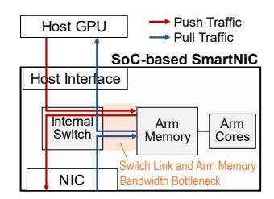

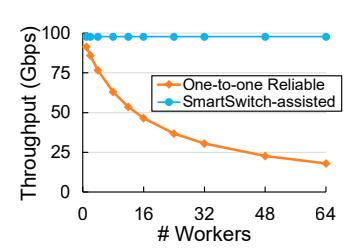

Fig. 7. Push/pull traffic insider a worker-side SoC-based SmartNIC.

Fig. 8. Throughput under different reliable protocols.

support. In an off-path SmartNIC, the host interface, NIC, and Arm are connected by an internal switch, as Figure 7 shows. The Arm core processes traffic between host and network in a lookaside manner. In the case of model training, both push and pull traffic first goes from the internal switch to Arm for processing, then from Arm back to the internal switch. However, this would result in severe Arm-Switch PCIe link contention when serving bi-directional network traffic at linerate. Arm-switch bandwidth is usually only slightly higher than network bandwidth, where push and pull throughput would nearly be halved due to the contention. For example, BlueField-2's per-direction network bandwidth is 200Gbps, concurrent push/pull require 400Gbps per-direction Arm-Switch bandwidth to fully saturate the network bandwidth, while the actual per-direction Arm-Switch is only 250Gbps. Issue 2: Arm Memory Bandwidth Bottleneck. Even if there were no switch link contention introduced by off-path architecture, push/pull performance would still be constrained by

the SoC-based SmartNIC's Arm memory. As traffic is staged to Arm memory rather than being served by cache due to the large working set size (which matches DisDP's case), push traffic first goes from host interface to Arm memory, then from Arm memory to network, and pull traffic first goes from network to Arm memory, then from Arm memory to host interface, which incurs 2× memory access for perdirection traffic, as Figure 7 shows. However, an SoC-based SmartNIC lacks adequate memory bandwidth for this access pattern. For example, an off-the-shelf BlueField-2 SmartNIC requires 800Gbps memory bandwidth to serve 200Gbps packets, while it only provides 204.8Gbps theoretical memory bandwidth [90]. As a result, we only achieve 20% network link utilization when evaluating push/pull in a real BlueField-2 SmartNIC. This memory bandwidth constraint still holds for newer-generation BlueField-3, which requires 1600Gbps memory bandwidth to achieve 400Gbps line-rate throughput, while it only provides 716.8Gbps theoretical memory bandwidth [91]. Due to the constraints of power, chip scaling, and form factor, this issue is unlikely to be resolved by near-future SoC-based SmartNICs [92], [93].

2) Our Solution: FPGA-Based SmartNIC-Managed Collective Library: To address the memory bandwidth issue, we propose the FPGA-based SmartNIC-managed collective library that performs the collectives from GPU/CPU on FPGA-based SmartNICs [94]–[110]. The key insight is that an FPGA-based SmartNIC adopts an on-path architecture that processes packets in hardware pipelines rather than a lookaside SoC,

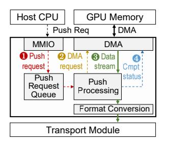

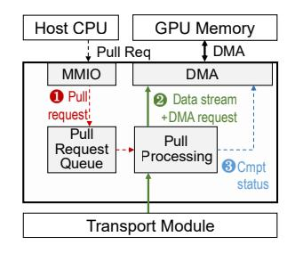

(a) Pushing gradients

(b) Pulling parameters

Fig. 9. Collective processing module of a worker.

which eliminates the internal switch bandwidth contention. Meanwhile, an FPGA-based SmartNIC allows explicitly storing packets between pipeline stages in on-chip SRAM instead of forcing packets to off-chip DRAM, which addresses the memory bandwidth constraints. Therefore, they can serve linerate packets. To this end, we design a *collective processing module* on each FPGA-based SmartNIC to process the collectives. In the following, we describe the detailed procedure for handling push/pull calls.

Handling Contention-Free Push and Pull. Figure 2(b) illustrates the execution pattern of DisDP. Like GPU streams, DisDP's SmartNIC provides two independent SmartNIC streams for pull and push calls, respectively, and each stream has its own hardware modules to avoid interference between push and pull requests.

To achieve this, DisDP provides separate push/pull processing units for push and pull primitives. Figure 9 shows a simplified flow of a worker's collective processing module handling requests, where push and pull are handled by different processing units to execute concurrently. When the host CPU calls push or pull, the software library allocates a request handle and then passes the request with the handle pointer to the SmartNIC via MMIO. Then, the request is enqueued in a push/pull request queue, such that a request called first finishes first. Next, the push/pull processing unit accepts the request from the queue and issues a DMA request to access GPU memory. The push/pull processing unit processes data from/to GPU memory in a pipelined manner to enable concurrent DMA and network data transport. Upon completion of the DMA procedure, the push/pull processing unit writes the execution status to the request handle to finalize the host wait function.

**Enabling Direct Access to GPU Memory.** We follow the existing works [111], [112] to enable SmartNIC to directly access the GPU memory via GPU virtual addresses.

**Format Conversion Unit.** Large-scale model training typically produces gradients in fp16 or bf16 formats [113]. However, current SmartSwitches do not support floating-point arithmetic. To this end, we follow the format conversion strategy of SwitchML [114] and integrate the strategy into the format conversion unit that is hardcoded in SmartNICs.

# DisDP: Disaggregating Compute, Network, and Storage for Model-Sharded Data-Parallel Training

Mo Sun, Zihan Yang, Changyue Liao, Yingtao Li, Jie Zhang, Kaiqi Chen, Fei Wu and Zeke Wang Zhejiang University, China

{sunmo,zihanyang,changyueliao,Li Yingtao,carlzhang4,chiaki cage,wufei,wangzeke}@zju.edu.cn

*Abstract*—Model-sharded data parallelism (MSDP), e.g., ZeRO, evenly shards the model states across all GPUs, and thus has been widely adopted by LLM pre-training, such as Llama and DeepSeek, due to its low GPU memory capacity requirement. However, MSDP introduces severe overhead from additional network communication collectives (i.e., **AllGather** and **ReduceScatter**). Although the collectives themselves only occupy fewer than 10% of GPU SMs, their execution time increases by 41% due to the serial execution of aggregated CPU/GPUmanaged compute (i.e., GEMM), network (i.e., NCCL), and storage (i.e., optimizer states). To this end, we present DisDP, a fully disaggregated distributed data-parallel architecture that first fully disaggregates compute, network, and storage for MSDP, such that GPUs only focus on the computing part, and thus the GPU utilization is maximized. The key idea is 1) fully offloading collectives to SmartNICs and SmartSwitch to avoid interference between GEMM kernels and collective kernels, and 2) fully offloading storage to a SmartSwitch-enhanced parameter server that allows a single PS to serve massive workers with linear scalability. DisDP on 8 distributed GPUs outperforms the stateof-the-art training systems by 3.98× when training on a 175B model, validating the efficiency of disaggregation.

## I. INTRODUCTION

Large language models (LLMs) have made advances in application domains such as natural language processing [\[1\]](#page-13-0), [\[2\]](#page-13-1), programming [\[3\]](#page-13-2), and computer vision [\[4\]](#page-13-3)–[\[6\]](#page-13-4). Along with the advances of LLM are their fast-growing model sizes, from 100M-scale [\[1\]](#page-13-0) to 100B-scale [\[7\]](#page-13-5)–[\[10\]](#page-13-6). Training a large-scale model requires using many GPUs with efficient parallelism strategies [\[11\]](#page-13-7)–[\[29\]](#page-13-8). Among these strategies, model replicated data parallelism (MRDP or DP) [\[30\]](#page-13-9)–[\[48\]](#page-14-0) replicates the model states across GPU workers, and each GPU needs to accommodate the entire model state, including all parameters and auxiliary optimizer states. So, an NVIDIA H100 GPU cluster (each GPU with 80 GB of device memory) even fails to train a 7B model (with 112 GB gradients and model states), regardless of the number of GPUs in the cluster.

Model-Sharded DP (MSDP). To address the limitation of trainable model size, memory-efficient MSDP such as ZeRO [\[49\]](#page-14-1)–[\[62\]](#page-14-2) and PyTorch FSDP [\[51\]](#page-14-3) are proposed to evenly shard the model states across all GPU workers, as shown in Figure [1\(a\).](#page-1-0)[1](#page-0-0) With enough GPUs, MSDP allows training a huge model, and thus has been adopted by DeepSeek [\[63\]](#page-14-4) and Llama [\[64\]](#page-14-5) to pre-train 100B-scale mod-

1 In this paper, we refer to a worker as a GPU paired with a NIC. els.[2](#page-0-1) Therefore, the optimization of MSDP itself is important. However, MSDP comes at the cost of extra collective operations, i.e., AllGather, to fetch on-demand parameters within an iteration. We observe that although network communication itself consumes relatively low GPU resources, its aggregated computation and collectives on GPUs lead to severe interference. In particular, with GPUs' non-preemptive scheduling policy, current-round compute-intensive GEMM kernels would occupy all GPU SMs and block next-round communication kernels from launching, even without dependencies. In our experiment, ZeRO-Infinity [\[57\]](#page-14-6) on 8× 1-GPU machines under a 100Gbps network only achieves 15% Model FLOPS Utilization (MFU) when training a 175B model.

SmartSwitch-Enhanced MSDP. Prior works [\[66\]](#page-14-7), [\[67\]](#page-14-8) adopt a SmartSwitch [\[68\]](#page-14-9), [\[69\]](#page-14-10) in MRDP to optimize AllReduce collectives by aggregating gradients in the SmartSwitch, thus reducing required network traffic and communication time, as shown in Figure [1\(b\).](#page-1-1) However, introducing SmartSwitch further to MSDP can barely reduce the required communication time, as both AllGather (AG) and ReduceScatter (RS) collectives used by MSDP can not be ideally optimized. For AG, SmartSwitch can only reduce the worker sending traffic, while the receiving traffic remains the same and thus bound the overall communication time. Similarly, SmartSwitch can only reduce the worker receiving traffic in RS, while the sending traffic remains the same and thus bound the overall communication time. Existing collective libraries like NCCL cannot efficiently overlap AG and RS due to network bandwidth contention on NIC, thus developers can not run AG and RS concurrently to combine the benefits of SmartSwitchenabled AG and RS to fully exploit duplex network bandwidth, thus reducing communication time.

Model-in-Server DP (MiSDP). Prior works [\[33\]](#page-13-10), [\[34\]](#page-13-11), [\[39\]](#page-13-12) adopt parameter servers (PSs) to minimize network traffic. Each worker only needs to push its gradients to PS and pull parameters from PS, while MiSDP needs PS to aggregate gradients to update parameters. As such, MiSDP reduces onethird of the collective traffic compared to MSDP. However, MiSDP on the one hand requires a large number of additional CPU machines (PSs) to provide adequate CPU compute power and memory bandwidth for heavy gradient aggregation and

2Though DeepSeek and Llama use 3D parallelism, including DP, TP, and PP, MSDP is important, especially in the pertaining phase that takes 80%~95% of the total training steps [\[8\]](#page-13-13), [\[65\]](#page-14-11). For example, Llama 3 applies 128-degree MSDP, while employing 8-degree TP and 16-degree PP [\[64\]](#page-14-5).

- lectives and computation on GPU.
- to SmartSwitch.
- (a) ZeRO-Infinity: Full aggregation so (b) SwitchML: Partial disaggregation due to (c) DisDP: Fully disaggregates compute, network (i.e., collectives), suffering from interference between col- only offloading in-network aggregation logic and storage (i.e., optimizer) such that GPUs only focus on the computing part to maximize GPU utilization.

Fig. 1. Comparison of different DP architectures. Both ZeRO-Infinity and SwitchML aggregate compute, network, and storage on worker CPU/GPU, leading to severe interference, while DisDP fully disaggregates compute, network, and storage for high GPU utilization.

TABLE I COMPARISON BETWEEN DP ARCHITECTURES. DISDP DISAGGREGATES COMPUTE, NETWORK AND STORAGE, SO GPUS ACHIEVE MAXIMUM UTILIZATION.

| Interference-Free Network | Traffic-Optimal Collective Topology                               | Low-Overhead Optimizer Execution                                                                                                                  |
|------------------------------|----------------------------------------------------------------------|------------------------------------------------------------------------------------------------------------------------------------------------------|
| No                           | No                                                                   | Yes (But colocated CPU optimizer could interfere                                                                                                     |
| (GPU Contention)             | (Peer-Based AG/RS)                                                   | with GPU due to intra-node PCIe contention)                                                                                                          |
| No                           | Vac                                                                  | Yes (But colocated CPU optimizer could interfere                                                                                                     |
| (GPU Contention)             | ies                                                                  | with GPU due to intra-node PCIe contention)                                                                                                          |
| No                           | Yes                                                                  | No (Requiring many additional machines                                                                                                               |
| (GPU Contention)             | (But only for non-colocated PS)                                      | as PSs for aggregation/broadcast)                                                                                                                    |
| Yes                          | Yes                                                                  | Yes (Requiring only 1 additional machine as scalable PS)                                                                                             |
|                              | Network  No (GPU Contention) No (GPU Contention) No (GPU Contention) | Network Collective Topology  No No (GPU Contention) (Peer-Based AG/RS)  No Yes (GPU Contention) Yes (GPU Contention) (But only for non-colocated PS) |

Adam optimizer. In our experiments, 16 GPU workers that run colocated PS processes require at least 13 additional CPU machines as non-colocated PSs to achieve line rate (Figure 5). On the other hand, MiSDP would still suffer from interference between GPU-centric network communication and computation, which leads to low MFU during training.

Our Design: DisDP. Inspired by DeepSeek [63], [70] that argues to use a dedicated network processor for collectives that originally run on GPUs, we propose DisDP, a Fully Disaggregated Distributed Data Parallelism that first disaggregates compute, network (i.e., collectives), and storage (i.e., optimizer) for MSDP to maximize the GPU's utilization in Figure 1(c). The key idea of DisDP is twofold. First, it offloads collectives to SmartNICs to avoid interference between GEMM kernels and collective kernels (network disaggregation). Second, it offloads the optimizer to a scalable PS where a single PS can serve any number of workers (storage disaggregation). As such, GPUs focus on computation for which GPUs are originally designed, and thus maximizing their utilization, as Table I concludes. To do so, DisDP consists of three innovations:

- SmartNIC-Managed Interference-Free Collectives. We propose the first SmartNIC-managed collectives that disaggregate GEMM kernels and collective kernels to completely avoid interference between them.
- SmartSwitch-Assisted Many-to-One Reliable Protocol. To address the incast problem introduced by serving many workers with a few PSs, DisDP uses a SmartSwitch to aggregate gradients from workers to the PS and broadcast parameters reversely. However, each worker has to maintain a reliable connection with the PS, and the number of

extra reliability-related packets increases with the number of workers. As the number of workers increases, reliabilityrelated packets soon exhaust the PS network IOPS and degrade the overall network performance. To this end, we propose the SmartSwitch-assisted reliable protocol, which leverages SmartSwitch to reduce the required reliabilityrelated packets.

Step-Centric Optimizer Pipelining. Unlike traditional MiSDP that features a large number of PSs, DisDP requires only a single PS to perform optimizer computation for massive workers. The challenge is that traditional layercentric pipelining would soon exhaust all available CPU threads on the PS, and thus fails to consume line-rate aggregated gradients. Therefore, we propose a step-centric pipelining on the PS to maximize CPU thread usage, so as to consume the aggregated gradients at line rate.

We prototype the SmartNICs with Xilinx U50 FPGA boards. We evaluate DisDP on eight  $1 \times A100$  GPU machines and 1 CPU machine under a 100Gbps network. Experiment results show that DisDP with 100Gb/s interference-free innetwork collectives achieves 1.17× higher throughput than ZeRO-Offload on the DGX machines (intra-machine GPUs are fully connected with 600GB/s NVLink), while keeping only 60% capex cost of the DGX machines.

## II. BACKGROUND AND MOTIVATION

## A. Issues of Model-Sharded DP (MSDP)

MSDP relies on two optimizations for memory-efficient training: 1) it evenly shards model states and optimizer execution across all workers to aggregate the memory of multiple GPUs, and 2) it offloads the optimizer to CPU memory or

| CUDA Call Sequence: AG1 → GEMM1 → AG2 → RS1 → GEMM2 → RS2                             |      |  |      |      |      |  |
|---------------------------------------------------------------------------------------|------|--|------|------|------|--|
| Block due to Compute Stream GEMM 1 GEMM 2 Dependent SM contention … |      |  |      |      |      |  |
| Collective Stream                                                                     | AG 1 |  | AG 2 | RS 1 | RS 2 |  |

(a) MSDP (w/ and w/o SmartSwitch): 1) A GEMM kernel that occupies all SMs blocks subsequent collective kernels, and 2) AG and RS kernels are on the same GPU stream, thus cannot run concurrently.

| Compute Stream     |        | GEMM 1 | GEMM 2 | GEMM 3 | GEMM 4 |   |
|--------------------|--------|--------|--------|--------|--------|---|
| Pull Param. Stream | Pull 1 | Pull 2 | Pull 3 | Pull 4 | Pull 5 | … |
| Push Grad. Stream  |        |        | Push 1 | Push 2 | Push 3 |   |

(b) DisDP: 1) SmartNIC-managed collectives do not interfere with GEMM, and 2) contention-free primitives enable concurrent push (for partial gradients) and pull (for on-demand new parameters) operations.

Fig. 2. Computing and collective pattern during the backward stage: MSDP vs. DisDP. A darker color indicates more SMs being used, and white indicates no SMs being used.

SSDs to further reduce the GPU memory capacity requirement. Compared to MRDP which performs one AllReduce to exchange gradients for each model layer, MSDP requires one RS and two AG collectives for each layer during forward and backward propagation, thus causing heavy collective traffic, e.g., the collectives take 1.25×~4.5× more time over GPU computation (Figure [3\(a\)\)](#page-2-0). Current MSDP systems employ collective libraries such as NCCL [\[71\]](#page-14-13) to execute RS and AG on GPUs. These systems try to pipeline collectives and model computation (i.e., GEMM), assuming that the two processes utilize distinct hardware resources, thereby enabling their overlapping. However, MSDP's aggregated computation and collectives on GPU cause severe interference, mostly serial execution, thus leading to low GPU utilization, e.g., 15% MFU on eight 1-GPU machines (Figure [16\(a\)\)](#page-9-0).

Even if we enabled to run GEMM and collective kernels concurrently, it still suffers from severe interference from the following two main issues:

1, GPU Computing Unit Contention. GEMM and collective kernels compete for GPU computing units, i.e., streaming multiprocessors (SMs). Collective kernels only require a small portion of SMs (a few percent to 10%) [\[72\]](#page-14-14), and intuitively, we think it is easy to overlap the GEMM and collective kernels to achieve a high GPU SM utilization. However, due to GPUs' non-preemptive scheduling policy, a computeintensive GEMM kernel that occupies all SMs will block subsequent collectives from launching [\[73\]](#page-14-15), even though a collective kernel has the highest priority. Figure [2\(a\)](#page-2-1) shows an example where "GEMM 1" blocks "AG 2" from launching. After "GEMM 1" finishes and "AG 2" starts, "GEMM 2" cannot be launched because it depends on the completion of "AG 2". Consequently, a collective kernel cannot fully overlap with GEMM kernels.

To illustrate the impact of this interference, we break down the execution time for training OPT-175B on 8× 1-GPU machines under a 100Gbps network using ZeRO-Infinity, as shown in Figure [3\(a\).](#page-2-0) Up to 65% of the collective execution time cannot overlap with GEMM at the batch size of 16, incuring 41% more execution time than ideal full overlapping. 2, GPU Memory Bandwidth Contention. GEMM and

(a) Execution time breakdown in a training iteration.

(b) Impact of concurrent GEMM to NCCL AllReduce.

Fig. 3. Issues of MSDP (ZeRO-Infinity).

(a) Impact of concurrent DMA to GEMM execution time.

(b) Impact of concurrent GEMM to GPU DMA bandwidth.

Fig. 4. There is barely interference between GPU GEMM kernel and an external device accessing GPU memory.

collective kernels compete for memory bandwidth and L2 cache, leading to performance degradation of the collective kernels [\[73\]](#page-14-15), [\[74\]](#page-14-16). Typically, we use algorithm bandwidth to characterize the collective performance, which is defined as total data size S in a collective operation divided by collective execution time t, i.e., algorithm bandwidth BWalg = t . To show the algorithm bandwidth drop due to contention, we run independent GEMM and NCCL AllReduce kernels on distributed A100 GPUs under 100Gbps network and a typical configuration when training the OPT-175B model, and use CUDA multi-process service (MPS) to statically isolate SMs to avoid the influence of competing SMs.[3](#page-2-2) Figure [3\(b\)](#page-2-3) shows that the GEMM kernel causes a 30% algorithm bandwidth drop to the concurrent NCCL kernel.

Finding. Although the concurrently running GEMM and collectives kernels incur interference regarding SMs and GPU memory subsystem, we observe that there is barely interference when the GEMM kernel is running and the external device is reading/writing GPU memory through the PCIe. To illustrate this, we 1) measure the GEMM execution time with and without a PCIe device (e.g., an FPGA-based NIC) performing DMA requests to read/write GPU memory concurrently; and 2) measure the read/write speed of PCIe devices accessing GPU memory through DMA with/without concurrently running GEMM kernels. Figure [4](#page-2-4) indicates there is barely interference between a GEMM kernel and a DMA task of an external PCIe device. Such a finding motivates us to offload the entire collective stack on SmartNIC (i.e., network and compute disaggregation) to avoid interference.

3Even though MPS is able to partition SMs, we can not adopt it to eliminate the contention for GPU computing units in actual training because MPS only allow partitioning SMs statically, and thus is incompatible with important features like dynamic parallelism and CUDA graph [\[75\]](#page-14-17) that LLM training frameworks heavily rely on.

## B. Issues of SmartSwitch-Enhanced MSDP

To relieve the issue of MSDP, a possible way is to implement in-network computing primitives in SmartSwitch [68], [69], [76]–[80] to reduce the collective traffic via in-switch aggregation and broadcasting. However, current SmartSwitch can only provide AllReduce collective needed by MRDP, while MSDP relies on AG and RS. Even if we enabled SmartSwitch to run AG and RS, we still identify that the naïve solution has the following two issues.

1, Unchanged Collective Time for Separate AG and RS. Considering N workers performing an AG on a total data size S. Without a SmartSwitch, each worker sends its  $\frac{S}{N}$  data to every other worker and receives different  $\frac{S}{N}$  data from every other worker [31]. As such, each worker has to send (or receive)  $\frac{(N-1)S}{N}$  network traffic.

If we enabled SmartSwitch to support AG and RS, for AG, SmartSwitch can help each worker to broadcast its  $\frac{S}{N}$  to every other worker, thus each worker only has to send  $\frac{S}{N}$  network traffic, while the receiving traffic remains at  $\frac{(N-1)S}{N}$ . Similarly, for RS, SmartSwitch allows each worker to receive  $\frac{S}{N}$  traffic, while the sending traffic remains at  $\frac{(N-1)S}{N}$ . Therefore, a SmartSwitch can not reduce the network communication time for separate AG and RS because the communication time is decided by the maximum of the sending traffic and the receiving traffic.

**2, Compute-Collective Interference.** If we enabled SmartSwitch to support AG and RS, they still rely on GPU-centric NCCL for data chunk management, as the existing SHARP-based in-switch aggregation stack [81] does. Consequently, they still suffer from computation-collective interference that is identified in Subsection II-A.

## C. Issues of Model-in-Server DP (MiSDP)

To relieve the issue of MSDP, another possible way is to adopt the model-in-server DP (MiSDP) architecture [33], [34], [39], [43] that offloads the model states onto PSs. Each worker performs 1) a push operation to send its gradients to PSs, which can aggregate gradients from workers and update the corresponding optimizer states, and 2) two pull operations (one in forward stage and one in backward stage) to receive the latest parameters from PSs. Compared to two AG and one RS of MSDP for a layer  $(\frac{3(N-1)S}{N})$  in each direction), MiSDP (2S receive and S send) reduces the network traffic by at mostone-third. However, existing MiSDP systems push the entire model gradients to PS after GPU finishes computation and then pulls the entire model parameters, so that each GPU has to accommodate the full model parameters. Therefore, they fail to train 100B-scale model that cannot fit in GPU memory. Even if MiSDP were enabled to train large models, we identify that MiSDP solutions still suffer from two issues.

**1, Computation-Collective Interference.** To enable large-model training, MiSDP systems need to use GPU-centric network stacks such as IBGDA (InfiniBand with GPUDirect Async) to enable GPU to directly interact with NICs for higher network bandwidth. Therefore, they would still suffer from

Fig. 5. Overhead of MiSDP: Many extra CPU machines.

interference between GPU computation kernels and collective kernels, as demonstrated in Subsection II-A.

2, Escalating Hardware Requirement to Aggregate Partial **Gradients.** MiSDP requires PS to provide adequate CPU compute power, memory bandwidth, and network bandwidth to perform optimizer, gradient aggregation, and parameter broadcasts. Therefore, a growing number of workers would require many additional CPU machines as PSs to consume their 100Gbps-per-worker partial gradients and produce 100Gbpsper-worker parameters, which is not always acceptable due to their monetary and space costs. To illustrate the machine requirement, we simulate the minimal machine requirement to saturate 100Gbps with different numbers of 1-GPU worker machines, where each GPU machine and each CPU machine has  $1 \times 100$ Gbps NIC. Each server runs a multi-threaded SIMD-optimized loop-unrolled Adam optimizer proposed by ZeRO-Offload [56]. We simulate on both non-colocated PS (PS processes only run on additional CPU machines) and a combination of colocated PS (PS processes run on GPU machines' spare CPUs) and non-colocated PS. Figure 5 shows that a 16-worker cluster requires 29 additional CPU machines in non-colocated PS configuration and 13 machines in a combined colocated and non-colocated PS configuration to achieve line-rate throughput.

**Finding.** We observe from Figure 5 that the scalability inefficiency of PS comes from more pressure on the memory subsystem of the server due to consuming more partial gradients from an increasing number of workers. This motivates us to offload gradient aggregation and parameter broadcasts to SmartSwitch, which produces reliable aggregated gradients to enable only one CPU machine (storage disaggregation) to accommodate 100B Adam states.4 Meanwhile, a SmartNIC would disaggregate the network and compute to eliminate the interference issue. This motivates us to use SmartNIC-SmartSwitch co-optimization to fully disaggregate compute, network, and storage, so as to benefit from reduced network traffic of MiSDP while addressing scalability and interference issues, thus achieving high MFU on scalable FSDP training.

## III. DESIGN AND IMPLEMENTATION OF DISDP

#### A. DisDP Overview

Inspired by the DeepSeek [63], [70], [82] that argues to use a dedicated network processor for collectives, we propose

4ATP [66] only offloads in-network aggregation primitive to SmartSwitch to 1) provide an AllReduce primitive, to aggregate gradients to support small model training, rather than LLM; and 2) updates its optimizer states on GPU workers. Thus, ATP suffers from interference from its partial disaggregation.

Fig. 6. System overview of DisDP. DisDP offloads collectives and the optimizer to dedicated hardware, such that GPUs only focus on the computing part to maximize their utilization.

DisDP that first fully disaggregates compute, network (i.e., collectives), and storage (i.e., optimizer) to maximize the GPU's utilization in Figure [1\(c\).](#page-1-3) The key idea of DisDP is twofold. First, it offloads collectives to SmartNICs and SmartSwitch to avoid interference between GEMM kernels and collective kernels (network disaggregation). Second, it offloads the optimizer to a scalable PS that can serve any number of workers (storage disaggregation). DisDP leverages SmartSwitch to 1) aggregate line-rate partial gradients from GPU workers to the PS that maintains 100B optimizer states, and 2) broadcast the on-demand parameters reversely. As such, GPUs focus on computation for which GPUs are originally designed, and thus maximize their utilization. However, building DisDP is not trivial, mainly due to three main challenges.

C1: Offloading collectives to SoC-based SmartNICs cannot saturate network line rate. A possible solution to avoid SM contention is to offload collectives to SoC-based SmartNICs like BlueField [\[83\]](#page-14-24). However, an SoC-based SmartNIC fails to process line-rate packets due to its internal switch link and Arm memory bandwidth bottlenecks.

C2: Existing reliable protocols would soon exhaust the asymmetrical PS network IOPS. In DisDP, the single PS has to maintain reliable connections with dozens of workers. Although the gradients/parameter packets can be aggregated/broadcast by the SmartSwitch, other packets to maintain reliable connections would exhaust the limited network IOPS of the PS, resulting in network throughput degradation.

C3: The optimizer computing would soon exhaust the PS computing power. Optimizer on the PS needs to perform Adam on the line-rate aggregated gradients and serve line-rate parameters to GPU workers. DisDP exploits SmartSwitch to reduce the number of parameter servers, which results in computing power contention on the PS. Traditional layer-centric

TABLE II CORE SOFTWARE APIS OF DISDP.

| API                                  | Description                                                        |
|--------------------------------------|--------------------------------------------------------------------|
| handle_t push(void* buf, size_t len) | Issue a contention-free push request to the SmartNIC.           |
| handle_t pull(void* buf, size_t len) | Issue a contention-free pull request to the SmartNIC.           |
| void wait(handle_t request)          | Block CPU/GPU execution until completion of a specific request. |

pipelining of the optimizer would suffer from the limited CPU threads and lead to degraded serving performance.

Overall Architecture. DisDP consists of a series of hardwaresoftware co-designs, as shown in Figure [6.](#page-4-0) The hardware part mainly consists of three components: 1) a per-GPU FPGAbased SmartNIC that provides an interference-free collective library for worker GPUs; 2) a SmartSwitch that aggregates gradients, broadcasts parameters, and maintains many-to-one reliable connections; 3) a single non-colocated PS that performs Adam on line-rate aggregated gradients and serves linerate parameters.

## *B. SmartNIC-Managed Interference-Free Collectives*

To address C1, we propose SmartNIC-managed collectives that perform the entire collectives on FPGA-based SmartNICs, while GPUs only need to perform the model's forward and backward computation. Each SmartNIC is paired with a GPU, as shown in Figure [6.](#page-4-0)

Software API. DisDP provides a two-sided software API for both workers and the PS, so as to enable the PS to prefetch parameters, thus reducing the latency of workers pulling parameters from the PS. Table [II](#page-4-1) lists the core APIs. During initialization, workers and the PS's CPU invoke the register\_buf function to enable direct data movement between the application buffer and SmartNICs. At runtime, DisDP provides *contention-free* push and pull to workers and the PS to enable concurrent push and pull calls to fully exploit the network bandwidth, as shown in Figure [2\(b\).](#page-2-5) Each worker invokes a push request to the SmartNIC to send partial gradients of a whole model layer from GPU memory, meanwhile, the PS invokes a pull request to the SmartNIC to receive gradients aggregated by SmartSwitch to CPU memory. Similarly, the PS issues a push request to send parameters of a whole layer from CPU memory, and each worker issues a pull request to receive parameters broadcast by SmartSwitch to GPU memory. Both push and pull return a handle, so workers and the PS can wait until the completion of the request via the wait function with the handle.

*1) Na¨ıve Solution: SoC-Based SmartNIC-Managed Collective Library:* To avoid interference, a straightforward solution is to offload collectives to SoC-based SmartNICs [\[84\]](#page-14-25)–[\[87\]](#page-15-0) (e.g., Nvidia BlueField-3 [\[83\]](#page-14-24), [\[88\]](#page-15-1)), which allows C/C++ software-programming. However, existing off-the-shelf Smart-NICs suffer from two severe issues, which are also reported by prior work [\[89\]](#page-15-2).

Issue 1: Off-path SmartNIC's Internal Switch Link Contention. Off-path NICs dominate the data center NIC market due to their ease of integration and full operating system

Fig. 7. Push/pull traffic insider a worker-side SoC-based SmartNIC.

Fig. 8. Throughput under different reliable protocols.

support. In an off-path SmartNIC, the host interface, NIC, and Arm are connected by an internal switch, as Figure 7 shows. The Arm core processes traffic between host and network in a lookaside manner. In the case of model training, both push and pull traffic first goes from the internal switch to Arm for processing, then from Arm back to the internal switch. However, this would result in severe Arm-Switch PCIe link contention when serving bi-directional network traffic at linerate. Arm-switch bandwidth is usually only slightly higher than network bandwidth, where push and pull throughput would nearly be halved due to the contention. For example, BlueField-2's per-direction network bandwidth is 200Gbps, concurrent push/pull require 400Gbps per-direction Arm-Switch bandwidth to fully saturate the network bandwidth, while the actual per-direction Arm-Switch is only 250Gbps. Issue 2: Arm Memory Bandwidth Bottleneck. Even if there were no switch link contention introduced by off-path architecture, push/pull performance would still be constrained by

the SoC-based SmartNIC's Arm memory. As traffic is staged to Arm memory rather than being served by cache due to the large working set size (which matches DisDP's case), push traffic first goes from host interface to Arm memory, then from Arm memory to network, and pull traffic first goes from network to Arm memory, then from Arm memory to host interface, which incurs 2× memory access for perdirection traffic, as Figure 7 shows. However, an SoC-based SmartNIC lacks adequate memory bandwidth for this access pattern. For example, an off-the-shelf BlueField-2 SmartNIC requires 800Gbps memory bandwidth to serve 200Gbps packets, while it only provides 204.8Gbps theoretical memory bandwidth [90]. As a result, we only achieve 20% network link utilization when evaluating push/pull in a real BlueField-2 SmartNIC. This memory bandwidth constraint still holds for newer-generation BlueField-3, which requires 1600Gbps memory bandwidth to achieve 400Gbps line-rate throughput, while it only provides 716.8Gbps theoretical memory bandwidth [91]. Due to the constraints of power, chip scaling, and form factor, this issue is unlikely to be resolved by near-future SoC-based SmartNICs [92], [93].

2) Our Solution: FPGA-Based SmartNIC-Managed Collective Library: To address the memory bandwidth issue, we propose the FPGA-based SmartNIC-managed collective library that performs the collectives from GPU/CPU on FPGA-based SmartNICs [94]–[110]. The key insight is that an FPGA-based SmartNIC adopts an on-path architecture that processes packets in hardware pipelines rather than a lookaside SoC,

(a) Pushing gradients

(b) Pulling parameters

Fig. 9. Collective processing module of a worker.

which eliminates the internal switch bandwidth contention. Meanwhile, an FPGA-based SmartNIC allows explicitly storing packets between pipeline stages in on-chip SRAM instead of forcing packets to off-chip DRAM, which addresses the memory bandwidth constraints. Therefore, they can serve linerate packets. To this end, we design a *collective processing module* on each FPGA-based SmartNIC to process the collectives. In the following, we describe the detailed procedure for handling push/pull calls.

Handling Contention-Free Push and Pull. Figure 2(b) illustrates the execution pattern of DisDP. Like GPU streams, DisDP's SmartNIC provides two independent SmartNIC streams for pull and push calls, respectively, and each stream has its own hardware modules to avoid interference between push and pull requests.

To achieve this, DisDP provides separate push/pull processing units for push and pull primitives. Figure 9 shows a simplified flow of a worker's collective processing module handling requests, where push and pull are handled by different processing units to execute concurrently. When the host CPU calls push or pull, the software library allocates a request handle and then passes the request with the handle pointer to the SmartNIC via MMIO. Then, the request is enqueued in a push/pull request queue, such that a request called first finishes first. Next, the push/pull processing unit accepts the request from the queue and issues a DMA request to access GPU memory. The push/pull processing unit processes data from/to GPU memory in a pipelined manner to enable concurrent DMA and network data transport. Upon completion of the DMA procedure, the push/pull processing unit writes the execution status to the request handle to finalize the host wait function.

**Enabling Direct Access to GPU Memory.** We follow the existing works [111], [112] to enable SmartNIC to directly access the GPU memory via GPU virtual addresses.

**Format Conversion Unit.** Large-scale model training typically produces gradients in fp16 or bf16 formats [113]. However, current SmartSwitches do not support floating-point arithmetic. To this end, we follow the format conversion strategy of SwitchML [114] and integrate the strategy into the format conversion unit that is hardcoded in SmartNICs.

