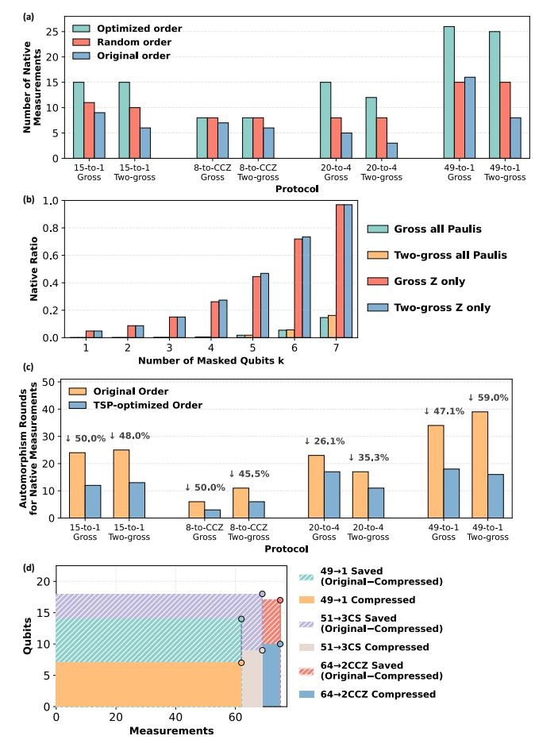
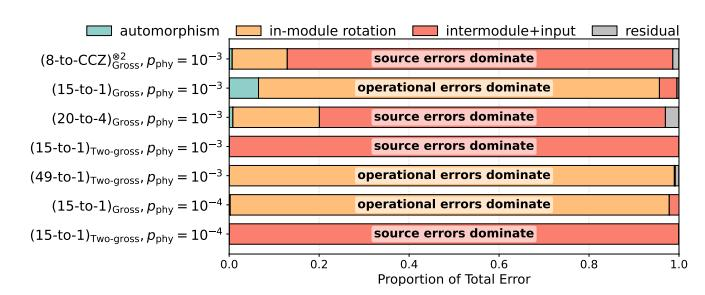
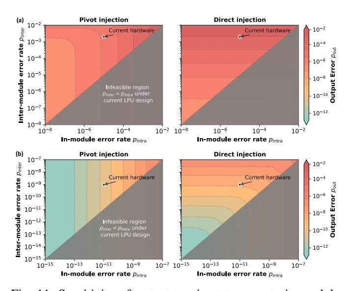

# F. Comparison Between Different Injection Schemes

Table IV highlights a clear throughput-fidelity tradeoff between the two injection families. Direct injection is consistently faster because it avoids additional pivot measurements during T-state injection, but it inherits more logical memory errors from inter-module noise. Pivot injection adds logical measurements and therefore larger  $\tau_i$ , yet confines inter-module noise to the source-pivot interface and yields better  $p_{\rm out}$  when inter-module measurements dominate.

This effect is strongest for factories composed entirely of native measurements. For example, the 15-to-1 gross-code factory at  $p_{\rm phys}=10^{-3}$  improves from  $8.2\times10^{-4}$  with direct injection to  $4.6\times10^{-6}$  with pivot injection. For protocols requiring non-native rotations, such as 49-to-1, the depth advantage of direct injection is less consequential. In some

Fig. 9: (a) Increase in native measurements from co-optimizing logical-qubit mapping and masking. "Original order" uses the circuit-derived mapping, while "random order" samples 10 random candidates and reports the best. (b) Native-measurement ratio versus masking in gross and two-gross codes, for both full-Pauli and I/Z-only operator sets. (c) Reduction in automorphism rounds from TSP-based scheduling, relative to the original gate order in [46]. (d) Qubit-recycling compression reduces logical-qubit counts for large protocols without increasing total measurements.

two-gross cases, where inter-module measurements are cleaner, the performance gap narrows and the preferred choice becomes workload-dependent: direct injection is attractive for high throughput, while pivot injection remains preferable when targeting the lowest output error.

## G. Sensitivity Analysis in Logical Operation Error Rates

Finally, we perform a one-factor-at-a-time sensitivity study around the baseline logical error rates in Table I. We exclude automorphism operations, since their error rates are primarily set by code design and are weakly sensitive to the specific LPU design. For each factory configuration, we sweep one logical operation error parameter at a time (in-module or inter-module measurement), fix the others, and record the resulting change in  $p_{\rm out}$ .

Fig. 10: Dominant error source by distillation protocol. Most factories are limited either by *operational errors* during distillation (e.g., in-module rotation errors) or *source errors* (e.g., input magic state errors or inter-module injection errors).

| Factory                                         | $p_{\rm phys}=p_{\rm in}$ | $\tau_i$ | Space-time Volume   | $p_{\rm out}^{\rm (sim)}$ |
|-------------------------------------------------|---------------------------|----------|---------------------|---------------------------|
| 15-to-1 gross , direct               | $10^{-3}$                 | 2341     | $8.8 \times 10^{5}$ | $8.2 \times 10^{-4}$      |
| 15-to-1 gross , pivot                | $10^{-3}$                 | 6122     | $2.3 \times 10^{6}$ | $4.6 \times 10^{-6}$      |
| 15-to-1 two-gross , direct           | $10^{-3}$                 | 4145     | $3.0 \times 10^{6}$ | $1.1 \times 10^{-8}$      |
| 15-to-1 two-gross , pivot            | $10^{-3}$                 | 11249    | $8.3 \times 10^{6}$ | $1.0 \times 10^{-8}$      |
| 8-to-CCZ gross , direct              | $10^{-3}$                 | 725      | $1.7 \times 10^{5}$ | $2.5 \times 10^{-3}$      |
| 8-to-CCZ gross ⊗2 , pivot | $10^{-3}$                 | 1570     | $5.9 \times 10^{5}$ | $9.8 \times 10^{-5}$      |
| 49-to-1 two-gross , direct           | $10^{-3}$                 | 63651    | $4.7 \times 10^{7}$ | $9.6 \times 10^{-9}$      |
| 49-to-1 two-gross , pivot            | $10^{-3}$                 | 70748    | $5.2 \times 10^{7}$ | $9.7 \times 10^{-11}$     |
| 15-to-1 gross , direct               | $10^{-4}$                 | 2303     | $8.7 \times 10^{5}$ | $2.1 \times 10^{-8}$      |
| 15-to-1 gross , pivot                | $10^{-4}$                 | 5999     | $2.3 \times 10^{6}$ | $4.2 \times 10^{-10}$     |

TABLE IV: Comparison between direct injection (Fig. 4(a),(c)) and pivot injection (Fig. 4(b)) across representative distillation protocols. Direct injection reduces distillation timesteps, while pivot injection suppresses low-fidelity inter-module measurement errors and typically achieves lower output error (detailed discussion in Sec. VII-F).

Figure 11 sweeps in-module and inter-module operation error rates and reports contours of constant output magic-state error. The knee of each contour marks the transition between in-module-dominated and inter-module-dominated regimes. Across the sweep, pivot injection is more robust to inter-module noise, shifting contours toward higher inter-module error rates at fixed output error. Overall, improving either error source helps, with the largest gains from better in-module measurement fidelity combined with pivot injection.

### VIII. DISCUSSION

#### A. Further Reducing Timesteps in BB Architectures

In Section VII, we saw that BB-based distillation schemes achieve strong qubit savings at the cost of larger depth  $\tau_i$ . Here, we explore a simple knob that reduces the number of syndrome-extraction rounds to lower  $\tau_i$  in MSD circuits.

As observed in Ref. [31], the two error modes for in-module measurements, measurement-outcome flips  $p_{\rm meas}$  and logical memory errors  $p_{\rm memory}$ , move in opposite directions as the number of rounds n changes:  $p_{\rm meas}$  decreases roughly exponentially with n, while  $p_{\rm memory}$  grows approximately linearly  $^3$ .

3The syndrome extraction rounds and logical error rates are taken from the results of [31], which is based on an LPU design that differs slightly from that in [27] but yields comparable logical error rates.

Fig. 11: Sensitivity of output magic-state error to in-module and inter-module operation error rates. (a) 15-to-1 protocol for the gross code. (b) 49-to-1 protocol for the two-gross code. Since inter-module operations use in-module measurements as subroutines, we consider the regime  $p_{\rm inter} \ge p_{\rm intra}$ ; the gray region indicates excluded parameters. The current-hardware point corresponds to logical error rates derived at physical error rate  $p = 10^{-3}$  [27].

| Factory                                 | Syndrome Rounds | $p_{\rm meas}$ | $p_{\rm memory}$ | $\tau_i$          | $p_{\rm out}^{\rm (sim)}$ |
|-----------------------------------------|--------------------|----------------|------------------|-------------------|---------------------------|
| 8-to-CCZ ⊗2 gross | $7 \rightarrow 5$  |                | -                |                   | $1.2 \times 10^{-4}$      |
| 15-to-1 gross                | $7 \rightarrow 4$  | $10^{-2.7}$    | $10^{-5.5}$      | $6122 \to [3808]$ | $3.5 \times 10^{-6}$      |
| 20-to-4 gross                | $7 \rightarrow 5$  | $10^{-3.5}$    | $10^{-5.2}$      | $3088 \to [2581]$ | $7.8 \times 10^{-5}$      |

TABLE V: Implementing magic-state distillation protocols in the gross code with fewer syndrome-extraction rounds. Entries of the form  $x \to [y]$  denote the baseline timestep count and the reduced value at smaller n. This can speed up distillation with no or moderate impact on the output fidelity.

General-purpose circuits typically choose n near the balance point that minimizes total logical error. Distillation protocols, however, can tolerate some measurement flips, so their optimal n can be smaller. In Section VII, we benchmarked how the parameter  $\lambda$ , the ratio between measurement error and the total logical operation error rate, affects the overall output error rate. Here, we reduce the number of syndrome-extraction rounds, thereby introducing more but tolerable outcome-flip errors while suppressing memory errors.

Table V reports the resulting estimated timestep reductions (shown in brackets). In the gross-code configuration, reducing n from 7 to 4 for the 15-to-1 protocol cuts  $\tau_i$  from 6122 to [3808] while keeping the output error at  $p_{\rm out}^{\rm (sim)} \approx 3.5 \times 10^{-6}$ . For 8-to-CCZ and 20-to-4, errors are already dominated by source errors, so decreasing n slightly worsens fidelity but still yields substantial savings in  $\tau_i$ . In practice, operation-limited protocols can therefore trade a modest increase in  $p_{\rm meas}$  for noticeably shorter distillation time.

B. Future Directions for Magic Factory Design and Faulttolerant Computing in Bicycle Architecture

Future improvements can be grouped into three directions. First, increasing the fidelity of in-module and inter-module logical operations through improved LPU design would directly lower output magic-state error and increase attainable throughput. Second, improving decoder performance can substantially improve logical operation fidelity and may provide a dominant improvement in practice. Third, it is important to study the impact of reducing the number of syndrome-extraction rounds: fewer rounds can lower latency and space-time cost, but may increase measurement-induced failures; quantifying this tradeoff would make the discussion above more actionable.

#### IX. CONCLUSION

High-fidelity, resource-efficient magic-state distillation is critical for scalable fault-tolerant quantum computing. We introduced practical distillation factories on Bivariate Bicycle codes, which achieve low target error rates with competitive space—time costs while reducing the qubit footprint. When preceded by surface code cultivation, our protocols constitute compelling two-round factories for near-term devices. Looking ahead, our methodology is general and adaptive across protocols and hardware performance. As the bicycle architecture achieves lower logical error rates through better decoding, circuits, or devices, the factory design methodology in our paper delivers even lower output error rates with lower overhead, positioning BB-based magic state distillation as a robust building block for large-scale quantum platforms.

### ACKNOWLEDGMENT

We thank Steven M. Girvin, Andrew Cross, Theodore J Yoder, Tomas Jochym-O'Connor, Shraddha Singh, Zhixin Song, Xiang Fang, Ming Wang, Yue Wu, Shuwen Kan, Sean Garner, Samuel Stein, Chenxu Liu, and Ang Li for fruitful discussions. This work is supported in part by the National Science Foundation (under awards CCF-2312754 and CCF-2338063), in part by the U.S. Department of Energy, Office of Science, National Quantum Information Science Research Center, Co-design Center for Quantum Advantage (C2QA) under Contract No. DE-SC0012704, in part by QuantumCT (under NSF Engines award ITE-2302908), in part by AFOSR MURI (FA9550-26-1-B036). ZH acknowledges support from the MIT Department of Mathematics, the MIT-IBM Watson AI Lab, and the NSF Graduate Research Fellowship Program under Grant No. 2141064. YD acknowledges partial support by Boehringer Ingelheim, and NSF NQVL-ERASE (under award OSI-2435244). External interest disclosure: YD is a scientific advisor to D-Wave Quantum, Inc.

# F. Comparison Between Different Injection Schemes

Table IV highlights a clear throughput-fidelity tradeoff between the two injection families. Direct injection is consistently faster because it avoids additional pivot measurements during T-state injection, but it inherits more logical memory errors from inter-module noise. Pivot injection adds logical measurements and therefore larger  $\tau_i$ , yet confines inter-module noise to the source-pivot interface and yields better  $p_{\rm out}$  when inter-module measurements dominate.

This effect is strongest for factories composed entirely of native measurements. For example, the 15-to-1 gross-code factory at  $p_{\rm phys}=10^{-3}$  improves from  $8.2\times10^{-4}$  with direct injection to  $4.6\times10^{-6}$  with pivot injection. For protocols requiring non-native rotations, such as 49-to-1, the depth advantage of direct injection is less consequential. In some

Fig. 9: (a) Increase in native measurements from co-optimizing logical-qubit mapping and masking. "Original order" uses the circuit-derived mapping, while "random order" samples 10 random candidates and reports the best. (b) Native-measurement ratio versus masking in gross and two-gross codes, for both full-Pauli and I/Z-only operator sets. (c) Reduction in automorphism rounds from TSP-based scheduling, relative to the original gate order in [46]. (d) Qubit-recycling compression reduces logical-qubit counts for large protocols without increasing total measurements.

two-gross cases, where inter-module measurements are cleaner, the performance gap narrows and the preferred choice becomes workload-dependent: direct injection is attractive for high throughput, while pivot injection remains preferable when targeting the lowest output error.

## G. Sensitivity Analysis in Logical Operation Error Rates

Finally, we perform a one-factor-at-a-time sensitivity study around the baseline logical error rates in Table I. We exclude automorphism operations, since their error rates are primarily set by code design and are weakly sensitive to the specific LPU design. For each factory configuration, we sweep one logical operation error parameter at a time (in-module or inter-module measurement), fix the others, and record the resulting change in  $p_{\rm out}$ .

Fig. 10: Dominant error source by distillation protocol. Most factories are limited either by *operational errors* during distillation (e.g., in-module rotation errors) or *source errors* (e.g., input magic state errors or inter-module injection errors).

| Factory                                         | $p_{\rm phys}=p_{\rm in}$ | $\tau_i$ | Space-time Volume   | $p_{\rm out}^{\rm (sim)}$ |
|-------------------------------------------------|---------------------------|----------|---------------------|---------------------------|
| 15-to-1 gross , direct               | $10^{-3}$                 | 2341     | $8.8 \times 10^{5}$ | $8.2 \times 10^{-4}$      |
| 15-to-1 gross , pivot                | $10^{-3}$                 | 6122     | $2.3 \times 10^{6}$ | $4.6 \times 10^{-6}$      |
| 15-to-1 two-gross , direct           | $10^{-3}$                 | 4145     | $3.0 \times 10^{6}$ | $1.1 \times 10^{-8}$      |
| 15-to-1 two-gross , pivot            | $10^{-3}$                 | 11249    | $8.3 \times 10^{6}$ | $1.0 \times 10^{-8}$      |
| 8-to-CCZ gross , direct              | $10^{-3}$                 | 725      | $1.7 \times 10^{5}$ | $2.5 \times 10^{-3}$      |
| 8-to-CCZ gross ⊗2 , pivot | $10^{-3}$                 | 1570     | $5.9 \times 10^{5}$ | $9.8 \times 10^{-5}$      |
| 49-to-1 two-gross , direct           | $10^{-3}$                 | 63651    | $4.7 \times 10^{7}$ | $9.6 \times 10^{-9}$      |
| 49-to-1 two-gross , pivot            | $10^{-3}$                 | 70748    | $5.2 \times 10^{7}$ | $9.7 \times 10^{-11}$     |
| 15-to-1 gross , direct               | $10^{-4}$                 | 2303     | $8.7 \times 10^{5}$ | $2.1 \times 10^{-8}$      |
| 15-to-1 gross , pivot                | $10^{-4}$                 | 5999     | $2.3 \times 10^{6}$ | $4.2 \times 10^{-10}$     |

TABLE IV: Comparison between direct injection (Fig. 4(a),(c)) and pivot injection (Fig. 4(b)) across representative distillation protocols. Direct injection reduces distillation timesteps, while pivot injection suppresses low-fidelity inter-module measurement errors and typically achieves lower output error (detailed discussion in Sec. VII-F).

Figure 11 sweeps in-module and inter-module operation error rates and reports contours of constant output magic-state error. The knee of each contour marks the transition between in-module-dominated and inter-module-dominated regimes. Across the sweep, pivot injection is more robust to inter-module noise, shifting contours toward higher inter-module error rates at fixed output error. Overall, improving either error source helps, with the largest gains from better in-module measurement fidelity combined with pivot injection.

### VIII. DISCUSSION

#### A. Further Reducing Timesteps in BB Architectures

In Section VII, we saw that BB-based distillation schemes achieve strong qubit savings at the cost of larger depth  $\tau_i$ . Here, we explore a simple knob that reduces the number of syndrome-extraction rounds to lower  $\tau_i$  in MSD circuits.

As observed in Ref. [31], the two error modes for in-module measurements, measurement-outcome flips  $p_{\rm meas}$  and logical memory errors  $p_{\rm memory}$ , move in opposite directions as the number of rounds n changes:  $p_{\rm meas}$  decreases roughly exponentially with n, while  $p_{\rm memory}$  grows approximately linearly  $^3$ .

3The syndrome extraction rounds and logical error rates are taken from the results of [31], which is based on an LPU design that differs slightly from that in [27] but yields comparable logical error rates.

Fig. 11: Sensitivity of output magic-state error to in-module and inter-module operation error rates. (a) 15-to-1 protocol for the gross code. (b) 49-to-1 protocol for the two-gross code. Since inter-module operations use in-module measurements as subroutines, we consider the regime  $p_{\rm inter} \ge p_{\rm intra}$ ; the gray region indicates excluded parameters. The current-hardware point corresponds to logical error rates derived at physical error rate  $p = 10^{-3}$  [27].

| Factory                                 | Syndrome Rounds | $p_{\rm meas}$ | $p_{\rm memory}$ | $\tau_i$          | $p_{\rm out}^{\rm (sim)}$ |
|-----------------------------------------|--------------------|----------------|------------------|-------------------|---------------------------|
| 8-to-CCZ ⊗2 gross | $7 \rightarrow 5$  |                | -                |                   | $1.2 \times 10^{-4}$      |
| 15-to-1 gross                | $7 \rightarrow 4$  | $10^{-2.7}$    | $10^{-5.5}$      | $6122 \to [3808]$ | $3.5 \times 10^{-6}$      |
| 20-to-4 gross                | $7 \rightarrow 5$  | $10^{-3.5}$    | $10^{-5.2}$      | $3088 \to [2581]$ | $7.8 \times 10^{-5}$      |

TABLE V: Implementing magic-state distillation protocols in the gross code with fewer syndrome-extraction rounds. Entries of the form  $x \to [y]$  denote the baseline timestep count and the reduced value at smaller n. This can speed up distillation with no or moderate impact on the output fidelity.

General-purpose circuits typically choose n near the balance point that minimizes total logical error. Distillation protocols, however, can tolerate some measurement flips, so their optimal n can be smaller. In Section VII, we benchmarked how the parameter  $\lambda$ , the ratio between measurement error and the total logical operation error rate, affects the overall output error rate. Here, we reduce the number of syndrome-extraction rounds, thereby introducing more but tolerable outcome-flip errors while suppressing memory errors.

Table V reports the resulting estimated timestep reductions (shown in brackets). In the gross-code configuration, reducing n from 7 to 4 for the 15-to-1 protocol cuts  $\tau_i$  from 6122 to [3808] while keeping the output error at  $p_{\rm out}^{\rm (sim)} \approx 3.5 \times 10^{-6}$ . For 8-to-CCZ and 20-to-4, errors are already dominated by source errors, so decreasing n slightly worsens fidelity but still yields substantial savings in  $\tau_i$ . In practice, operation-limited protocols can therefore trade a modest increase in  $p_{\rm meas}$  for noticeably shorter distillation time.

B. Future Directions for Magic Factory Design and Faulttolerant Computing in Bicycle Architecture

Future improvements can be grouped into three directions. First, increasing the fidelity of in-module and inter-module logical operations through improved LPU design would directly lower output magic-state error and increase attainable throughput. Second, improving decoder performance can substantially improve logical operation fidelity and may provide a dominant improvement in practice. Third, it is important to study the impact of reducing the number of syndrome-extraction rounds: fewer rounds can lower latency and space-time cost, but may increase measurement-induced failures; quantifying this tradeoff would make the discussion above more actionable.

#### IX. CONCLUSION

High-fidelity, resource-efficient magic-state distillation is critical for scalable fault-tolerant quantum computing. We introduced practical distillation factories on Bivariate Bicycle codes, which achieve low target error rates with competitive space—time costs while reducing the qubit footprint. When preceded by surface code cultivation, our protocols constitute compelling two-round factories for near-term devices. Looking ahead, our methodology is general and adaptive across protocols and hardware performance. As the bicycle architecture achieves lower logical error rates through better decoding, circuits, or devices, the factory design methodology in our paper delivers even lower output error rates with lower overhead, positioning BB-based magic state distillation as a robust building block for large-scale quantum platforms.

### ACKNOWLEDGMENT

We thank Steven M. Girvin, Andrew Cross, Theodore J Yoder, Tomas Jochym-O'Connor, Shraddha Singh, Zhixin Song, Xiang Fang, Ming Wang, Yue Wu, Shuwen Kan, Sean Garner, Samuel Stein, Chenxu Liu, and Ang Li for fruitful discussions. This work is supported in part by the National Science Foundation (under awards CCF-2312754 and CCF-2338063), in part by the U.S. Department of Energy, Office of Science, National Quantum Information Science Research Center, Co-design Center for Quantum Advantage (C2QA) under Contract No. DE-SC0012704, in part by QuantumCT (under NSF Engines award ITE-2302908), in part by AFOSR MURI (FA9550-26-1-B036). ZH acknowledges support from the MIT Department of Mathematics, the MIT-IBM Watson AI Lab, and the NSF Graduate Research Fellowship Program under Grant No. 2141064. YD acknowledges partial support by Boehringer Ingelheim, and NSF NQVL-ERASE (under award OSI-2435244). External interest disclosure: YD is a scientific advisor to D-Wave Quantum, Inc.

