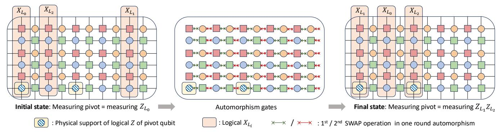
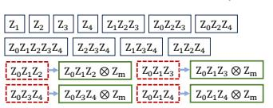
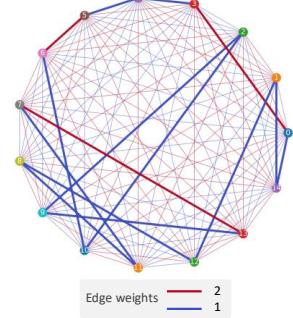

# III. OVERVIEW: MAGIC STATE DISTILLATION IN BB ARCHITECTURES

We design magic state distillation factories tailored to the Bivariate Bicycle (BB) architectures of [27], [31]. Our goal is high-fidelity, low-latency  $|T\rangle$ -state distillation that respects the locality, modular structure, error pathways, and syndrome-extraction capabilities of BB codes. We first show how standard MSD protocols map cleanly onto the BB layout, then present several techniques for implementing the required multi-qubit  $\exp(i\frac{\pi}{8}P)$  rotations via injected  $|T\rangle$  states. Throughout, we highlight how inter-module connectivity, pivot-qubit access, and measurement fidelity influence factory design.

### A. Magic State Distillation with Triorthogonal Matrices

We focus on  $|T\rangle$ -state distillation following the construction of [46], where each protocol is defined by a *triorthogonal* matrix [47]. Let  $G \in \{0,1\}^{m \times n}$  be such a matrix with k rows of odd weight (corresponding to the k output qubits) and m-k rows of even weight (corresponding to ancilla qubits). Each column c specifies a commuting Z-type  $\pi/8$  rotation acting on the set of qubits/rows  $S_c = \{r : G_{rc} = 1\}$ .

Given G, the protocol proceeds as follows:

- 1) Initialize m logical qubits to  $|+\rangle$ . In the BB architecture, this is achieved by preparing all physical qubits in  $|+\rangle$  and running one syndrome-extraction cycle.
- 2) For each column c, consume one noisy  $|T\rangle$  and implement  $e^{i\frac{\pi}{8}P}$ . Here  $P=Z^{\otimes S_c}$  is an m-qubit Pauli with Z on rows in  $S_c$  and identity elsewhere.
- 3) Measure the m-k parity check qubits in the X basis and postselect on the all-|+⟩ outcome. When postselection succeeds, the first k rows contain the distilled |T⟩⊗k. In BB codes, these measurements can be implemented in k+1 logical steps as follows: for each output magic state, fix a target qubit (on another code block) and measure Z⊗Z between the magic state and the target qubit; then measure all physical qubits in the X basis. This procedure projects the output magic states onto their destinations.

This formulation uses only m logical qubits, unlike the original method of [47], which prepared an n-qubit stabilizer state, applied T to each qubit, and unencoded via Clifford operations. It preserves the same distillation performance with far fewer qubits and Clifford gates, making it well-suited to BB codes where logical qubit count is tightly constrained.

#### B. Implementing $\pi/8$ Rotations

Implementing the protocol reduces to realizing  $\exp(i\frac{\pi}{8}P)$ , where  $P=Z^{\otimes S_c}$ . We adapt three approaches from [46] to the BB architecture (Figure 4). The key distinction among them is how they handle the necessary conditional Clifford correction:

Fig. 3: Fault-tolerant implementation of a shift-automorphism generator and its impact on logical operators. Shift automorphisms permute data qubits via successive swap operations (green, then red) between data and check qubits along edges in the connectivity graph. Logical operators  $X_{L_0}, X_{L_1}, X_{L_2}$  supported on shaded regions are permuted so that their overlap with the pivot's  $Z_{L_0}$  support changes. After conjugation, multi-qubit Paulis that were not directly accessible through the pivot become measurable via an LPU  $Z_{L_0}$  measurement.

Fig. 4: (a–c) Magic state injection schemes for implementing  $\exp(i\frac{\pi}{8}P)$  in a BB architecture. The schemes differ in how the magic state is teleported to the target qubits and how the resulting conditional Clifford correction is handled, leading to different latency and error profiles. Inter-module measurements are shown in orange, conditional Clifford corrections in blue. A P label denotes a Pauli operator, which is cheap to track in fault-tolerant architectures. (d) Measurement-to-rotation circuit implementing  $\exp(i\frac{\pi}{4}P)$  using a designated pivot qubit and BB's toric symmetry. We use pivot injection as the default throughout the paper because it achieves a lower error rate, as demonstrated by the detailed benchmarking results in Sections VI-C and VII.

standard injection produces either  $\exp(+i\frac{\pi}{8}P)$  or  $\exp(-i\frac{\pi}{8}P)$  at random, so a corrective  $\exp(i\frac{\pi}{4}P)$  may be required. The three approaches are as follows:

- Direct injection with factory correction: Fig.4(a). The input  $|T\rangle$  is teleported directly onto all target qubits via an inter-module measurement. Any required correction is implemented explicitly using the measurement-to-rotation circuit (Fig. 4(d)). The injection itself does not require the pivot, but the correction does.
- Pivot-based injection with pivot correction: Fig.4(b).
   The |T⟩ state is first teleported onto the pivot qubit, then onto the target qubits using only in-module measurements. This confines the noisy injection step to a single qubit and avoids spreading error across the data block. The correction is absorbed into a conditional X or Y measurement on the pivot.
- Direct injection with source correction: Fig.4(c). If the module supplying the  $|T\rangle$  states supports direct, high-fidelity Y measurements, the correction can be applied by the source qubit itself. In this case, the pivot is not involved at all, and no additional correction step is required. Whether this is viable depends on the native measurement bases of the  $|T\rangle$ -state source.

These three strategies span different hardware assumptions and error models. In Section VI-C, we quantify how their measurement counts, routing demands, and error locations translate into overall factory throughput and logical error rates for realistic BB-code parameters. In Section VII, we present detailed benchmarks showing how different injection schemes can be selected adaptively under different hardware assumptions, and we explore the tradeoff between spacetime volume and output error rate across these schemes.

#### IV. IMPLEMENTATION AND OPTIMIZATIONS

In this section, we present techniques that improve the efficiency and reliability of magic state distillation within the bicycle architectures. These optimizations address bottlenecks from restricted native measurements, limited logical qubits, and architectural error sources. Together, they define a practical workflow for compiling distillation protocols into fault-tolerant BB-code factories with minimal overhead.

### A. Logical Qubit Mapping: Maximizing Native Coverage

Because the native measurement set is limited, not every Pauli *P* required by the protocol can be realized by a single LPU measurement, even after conjugation. However, the protocol uses only a fixed set of logical qubits, which we are free to place within the BB code.

We therefore treat logical-qubit placement as an optimization problem. Given a BB code with k data qubits and an m-qubit distillation protocol, we choose an m-element subset  $S \subseteq [k]$  and assign protocol qubits to S so that the number of native Pauli rotations is maximized. For the small protocol sizes of interest, we can brute-force over S; ties are broken by minimizing routing distance to the pivot.

For example, in the 15-to-1 protocol on the gross code, choosing 5 of the 6 qubits in a logical block yields native realizations for most of the required  $\pi/8$  rotations, with the remainder implemented either by Clifford conjugation [31] or by masking (Section IV-B). This mapping step is lightweight but important: improving native coverage directly reduces factory latency and logical error.

### B. Masking: Enabling More Native Measurements

When m < k, unused logical qubits can be repurposed to expand the effective native measurement set. Suppose a required rotation  $\exp(i\frac{\pi}{8}P)$  is non-native, but there exists a native Pauli Q that matches P on the m active qubits and differs only on a subset of idle qubits. For instance, if those idle qubits are initialized to  $|0\rangle$ , then applying Z on them leaves the state invariant, since  $Z\,|0\rangle=|0\rangle$ . We can therefore replace P by  $Q=P\cdot\prod_{j\in\mathcal{M}}Z_j$ , where  $\mathcal{M}$  is a set of masked qubits chosen so that Q is native.

This *masking* operation is purely logical and adds no depth. It increases the fraction of rotations that can be executed as single native measurements.

In the 15-to-1 protocol, masking fully nativizes all 15 rotations: the four previously non-native Paulis become native when augmented with Z factors on masked qubits. As illustrated in Figure 5, masking allows each rotation to be implemented using a single automorphism sequence and one LPU measurement (up to tracked byproduct Paulis), eliminating the need for additional Clifford conjugation.

## C. Gate Scheduling: Reducing Automorphism Rounds

As above, a measurement of a logical Pauli P is implemented by conjugating an LPU-native measurement with one or more automorphism gates. Different automorphisms incur different

(a) Masking a non-native measurement by allowing Z to apply trivially on idle qubit(s) in |0).

(b) Example native and non-native (but masked) measurements in the 15-to-1 distillation protocol.

(c) Scheduling 15 measurements by finding a min-weight Hamiltonian path.

Fig. 5: (a) Masking technique to nativize a Pauli measurement by allowing Z to act on an idle logical qubit initialized to  $|0\rangle$  within the BB code. (b) Native and non-native measurements in the 15-to-1 distillation circuit, which becomes fully nativized after masking. (c) Scheduling the 15-to-1 rotations in an order that minimizes automorphism rounds between successive measurements.

costs, typically corresponding to one or two automorphism-generator applications. In injection schemes that do not require intermediate pivot measurements between successive  $\exp(i\frac{\pi}{8}P)$  gates, such as direct injections (Figure 4), we can reduce total automorphism cost by optimizing the order of Pauli rotations.

All  $\exp(i\frac{\pi}{8}P)$  gates in a triorthogonal distillation protocol commute, so we are free to reorder them without changing the logical channel. The scheduling problem thus reduces to finding an execution order that minimizes the cumulative automorphism overhead needed to retarget the LPU between consecutive measurements.

We model this as a graph problem. Each distinct Pauli label P in the protocol is represented as a node v in a directed graph G=(V,E). For any ordered pair (u,v), we define the edge weight w(u,v) as the cost of transforming the measurement configuration for u into that for v using automorphisms. This cost can be defined in terms of the number of automorphism rounds, latency, or any hardware-informed metric.

Any ordering of the rotations corresponds to a permutation  $\sigma$  of the nodes in V, with total routing cost

$$C(\sigma) = \sum_{i=1}^{|V|-1} w(v_{\sigma(i)}, v_{\sigma(i+1)}).$$

Minimizing  $C(\sigma)$  is equivalent to finding a minimum-cost Hamiltonian path from  $v_{\sigma(1)}$  to  $v_{\sigma(|V|)}$ , that is, a Traveling Salesman Problem (TSP) instance with fixed endpoints.

The TSP formulation changes only the measurement order, not the gates themselves or their angles. Although TSP is NP-hard in general, our instances are small; for example, the 15-to-1 protocol has only fifteen distinct  $\exp(i\frac{\pi}{8}P)$  rotations. For such sizes, standard heuristics such as nearest-neighbor initialization with 2-opt or 3-opt refinements, or a warm-started mixed-integer linear program, quickly find near-optimal or optimal routes. The automorphism cost matrix can be precomputed

once per BB-code instance and reused across factory cycles, so the marginal scheduling overhead is negligible.

## D. Improving Throughput: Multi-Track Distillations

When the triorthogonal matrix G has small row count m, the BB architecture can host multiple protocol instances in parallel on a single code block. For the 15-to-1 and 8-to-CCZ protocol [29], [46], m=5 (m=4 for 8-to-CCZ) fits comfortably into each six-qubit logical block of the 12-qubit Gross and two-Gross codes. This enables a natural *dual-track* mode: run two copies of the protocol simultaneously on the two ZX-dual blocks, effectively doubling factory throughput without adding code patches.

As discussed in Section II-C3, qubits  $L_0$  and  $L_6$  form a dual pair under ZX-duality, and the LPU is attached to both. The LPU also decomposes into distinct X and Z modules. When both modules operate in the same basis, the architecture supports simultaneous X or Z measurements on  $L_0$  and  $L_6$ . Because the automorphism group acts identically on the two six-qubit blocks, this parallelism extends to more general Pauli measurements, as long as the logical Paulis on the two blocks coincide and are purely X or Z type.

These properties align well with direct-injection schemes (Figure 4), see Fig. 6. For most rotation steps, we can schedule paired measurements on the two blocks with identical logical labels so that one sequence of automorphisms followed by a simultaneous LPU measurement implements both rotations. This yields a near factor-of-two throughput improvement for the same LPU footprint.

The main exception occurs at steps that require Y-basis measurements on the pivot. A Y measurement occupies both the X and Z modules, so the two protocol copies must serialize at those points. In pivot-based injection, the need for a pivot Y measurement is tied to whether a correction is required, which happens with probability 3/4. In these cases, multi-track execution does not reach a strict factor-of-two speedup, but still provides a significant throughput gain, especially when the protocol is dominated by X and Z rotations and when direct injection reduces pivot usage.

# III. OVERVIEW: MAGIC STATE DISTILLATION IN BB ARCHITECTURES

We design magic state distillation factories tailored to the Bivariate Bicycle (BB) architectures of [27], [31]. Our goal is high-fidelity, low-latency  $|T\rangle$ -state distillation that respects the locality, modular structure, error pathways, and syndrome-extraction capabilities of BB codes. We first show how standard MSD protocols map cleanly onto the BB layout, then present several techniques for implementing the required multi-qubit  $\exp(i\frac{\pi}{8}P)$  rotations via injected  $|T\rangle$  states. Throughout, we highlight how inter-module connectivity, pivot-qubit access, and measurement fidelity influence factory design.

### A. Magic State Distillation with Triorthogonal Matrices

We focus on  $|T\rangle$ -state distillation following the construction of [46], where each protocol is defined by a *triorthogonal* matrix [47]. Let  $G \in \{0,1\}^{m \times n}$  be such a matrix with k rows of odd weight (corresponding to the k output qubits) and m-k rows of even weight (corresponding to ancilla qubits). Each column c specifies a commuting Z-type  $\pi/8$  rotation acting on the set of qubits/rows  $S_c = \{r : G_{rc} = 1\}$ .

Given G, the protocol proceeds as follows:

- 1) Initialize m logical qubits to  $|+\rangle$ . In the BB architecture, this is achieved by preparing all physical qubits in  $|+\rangle$  and running one syndrome-extraction cycle.
- 2) For each column c, consume one noisy  $|T\rangle$  and implement  $e^{i\frac{\pi}{8}P}$ . Here  $P=Z^{\otimes S_c}$  is an m-qubit Pauli with Z on rows in  $S_c$  and identity elsewhere.
- 3) Measure the m-k parity check qubits in the X basis and postselect on the all-|+⟩ outcome. When postselection succeeds, the first k rows contain the distilled |T⟩⊗k. In BB codes, these measurements can be implemented in k+1 logical steps as follows: for each output magic state, fix a target qubit (on another code block) and measure Z⊗Z between the magic state and the target qubit; then measure all physical qubits in the X basis. This procedure projects the output magic states onto their destinations.

This formulation uses only m logical qubits, unlike the original method of [47], which prepared an n-qubit stabilizer state, applied T to each qubit, and unencoded via Clifford operations. It preserves the same distillation performance with far fewer qubits and Clifford gates, making it well-suited to BB codes where logical qubit count is tightly constrained.

#### B. Implementing $\pi/8$ Rotations

Implementing the protocol reduces to realizing  $\exp(i\frac{\pi}{8}P)$ , where  $P=Z^{\otimes S_c}$ . We adapt three approaches from [46] to the BB architecture (Figure 4). The key distinction among them is how they handle the necessary conditional Clifford correction:

Fig. 3: Fault-tolerant implementation of a shift-automorphism generator and its impact on logical operators. Shift automorphisms permute data qubits via successive swap operations (green, then red) between data and check qubits along edges in the connectivity graph. Logical operators  $X_{L_0}, X_{L_1}, X_{L_2}$  supported on shaded regions are permuted so that their overlap with the pivot's  $Z_{L_0}$  support changes. After conjugation, multi-qubit Paulis that were not directly accessible through the pivot become measurable via an LPU  $Z_{L_0}$  measurement.

Fig. 4: (a–c) Magic state injection schemes for implementing  $\exp(i\frac{\pi}{8}P)$  in a BB architecture. The schemes differ in how the magic state is teleported to the target qubits and how the resulting conditional Clifford correction is handled, leading to different latency and error profiles. Inter-module measurements are shown in orange, conditional Clifford corrections in blue. A P label denotes a Pauli operator, which is cheap to track in fault-tolerant architectures. (d) Measurement-to-rotation circuit implementing  $\exp(i\frac{\pi}{4}P)$  using a designated pivot qubit and BB's toric symmetry. We use pivot injection as the default throughout the paper because it achieves a lower error rate, as demonstrated by the detailed benchmarking results in Sections VI-C and VII.

standard injection produces either  $\exp(+i\frac{\pi}{8}P)$  or  $\exp(-i\frac{\pi}{8}P)$  at random, so a corrective  $\exp(i\frac{\pi}{4}P)$  may be required. The three approaches are as follows:

- Direct injection with factory correction: Fig.4(a). The input  $|T\rangle$  is teleported directly onto all target qubits via an inter-module measurement. Any required correction is implemented explicitly using the measurement-to-rotation circuit (Fig. 4(d)). The injection itself does not require the pivot, but the correction does.
- Pivot-based injection with pivot correction: Fig.4(b).
   The |T⟩ state is first teleported onto the pivot qubit, then onto the target qubits using only in-module measurements. This confines the noisy injection step to a single qubit and avoids spreading error across the data block. The correction is absorbed into a conditional X or Y measurement on the pivot.
- Direct injection with source correction: Fig.4(c). If the module supplying the  $|T\rangle$  states supports direct, high-fidelity Y measurements, the correction can be applied by the source qubit itself. In this case, the pivot is not involved at all, and no additional correction step is required. Whether this is viable depends on the native measurement bases of the  $|T\rangle$ -state source.

These three strategies span different hardware assumptions and error models. In Section VI-C, we quantify how their measurement counts, routing demands, and error locations translate into overall factory throughput and logical error rates for realistic BB-code parameters. In Section VII, we present detailed benchmarks showing how different injection schemes can be selected adaptively under different hardware assumptions, and we explore the tradeoff between spacetime volume and output error rate across these schemes.

#### IV. IMPLEMENTATION AND OPTIMIZATIONS

In this section, we present techniques that improve the efficiency and reliability of magic state distillation within the bicycle architectures. These optimizations address bottlenecks from restricted native measurements, limited logical qubits, and architectural error sources. Together, they define a practical workflow for compiling distillation protocols into fault-tolerant BB-code factories with minimal overhead.

### A. Logical Qubit Mapping: Maximizing Native Coverage

Because the native measurement set is limited, not every Pauli *P* required by the protocol can be realized by a single LPU measurement, even after conjugation. However, the protocol uses only a fixed set of logical qubits, which we are free to place within the BB code.

We therefore treat logical-qubit placement as an optimization problem. Given a BB code with k data qubits and an m-qubit distillation protocol, we choose an m-element subset  $S \subseteq [k]$  and assign protocol qubits to S so that the number of native Pauli rotations is maximized. For the small protocol sizes of interest, we can brute-force over S; ties are broken by minimizing routing distance to the pivot.

For example, in the 15-to-1 protocol on the gross code, choosing 5 of the 6 qubits in a logical block yields native realizations for most of the required  $\pi/8$  rotations, with the remainder implemented either by Clifford conjugation [31] or by masking (Section IV-B). This mapping step is lightweight but important: improving native coverage directly reduces factory latency and logical error.

### B. Masking: Enabling More Native Measurements

When m < k, unused logical qubits can be repurposed to expand the effective native measurement set. Suppose a required rotation  $\exp(i\frac{\pi}{8}P)$  is non-native, but there exists a native Pauli Q that matches P on the m active qubits and differs only on a subset of idle qubits. For instance, if those idle qubits are initialized to  $|0\rangle$ , then applying Z on them leaves the state invariant, since  $Z\,|0\rangle=|0\rangle$ . We can therefore replace P by  $Q=P\cdot\prod_{j\in\mathcal{M}}Z_j$ , where  $\mathcal{M}$  is a set of masked qubits chosen so that Q is native.

This *masking* operation is purely logical and adds no depth. It increases the fraction of rotations that can be executed as single native measurements.

In the 15-to-1 protocol, masking fully nativizes all 15 rotations: the four previously non-native Paulis become native when augmented with Z factors on masked qubits. As illustrated in Figure 5, masking allows each rotation to be implemented using a single automorphism sequence and one LPU measurement (up to tracked byproduct Paulis), eliminating the need for additional Clifford conjugation.

## C. Gate Scheduling: Reducing Automorphism Rounds

As above, a measurement of a logical Pauli P is implemented by conjugating an LPU-native measurement with one or more automorphism gates. Different automorphisms incur different

(a) Masking a non-native measurement by allowing Z to apply trivially on idle qubit(s) in |0).

(b) Example native and non-native (but masked) measurements in the 15-to-1 distillation protocol.

(c) Scheduling 15 measurements by finding a min-weight Hamiltonian path.

Fig. 5: (a) Masking technique to nativize a Pauli measurement by allowing Z to act on an idle logical qubit initialized to  $|0\rangle$  within the BB code. (b) Native and non-native measurements in the 15-to-1 distillation circuit, which becomes fully nativized after masking. (c) Scheduling the 15-to-1 rotations in an order that minimizes automorphism rounds between successive measurements.

costs, typically corresponding to one or two automorphism-generator applications. In injection schemes that do not require intermediate pivot measurements between successive  $\exp(i\frac{\pi}{8}P)$  gates, such as direct injections (Figure 4), we can reduce total automorphism cost by optimizing the order of Pauli rotations.

All  $\exp(i\frac{\pi}{8}P)$  gates in a triorthogonal distillation protocol commute, so we are free to reorder them without changing the logical channel. The scheduling problem thus reduces to finding an execution order that minimizes the cumulative automorphism overhead needed to retarget the LPU between consecutive measurements.

We model this as a graph problem. Each distinct Pauli label P in the protocol is represented as a node v in a directed graph G=(V,E). For any ordered pair (u,v), we define the edge weight w(u,v) as the cost of transforming the measurement configuration for u into that for v using automorphisms. This cost can be defined in terms of the number of automorphism rounds, latency, or any hardware-informed metric.

Any ordering of the rotations corresponds to a permutation  $\sigma$  of the nodes in V, with total routing cost

$$C(\sigma) = \sum_{i=1}^{|V|-1} w(v_{\sigma(i)}, v_{\sigma(i+1)}).$$

Minimizing  $C(\sigma)$  is equivalent to finding a minimum-cost Hamiltonian path from  $v_{\sigma(1)}$  to  $v_{\sigma(|V|)}$ , that is, a Traveling Salesman Problem (TSP) instance with fixed endpoints.

The TSP formulation changes only the measurement order, not the gates themselves or their angles. Although TSP is NP-hard in general, our instances are small; for example, the 15-to-1 protocol has only fifteen distinct  $\exp(i\frac{\pi}{8}P)$  rotations. For such sizes, standard heuristics such as nearest-neighbor initialization with 2-opt or 3-opt refinements, or a warm-started mixed-integer linear program, quickly find near-optimal or optimal routes. The automorphism cost matrix can be precomputed

once per BB-code instance and reused across factory cycles, so the marginal scheduling overhead is negligible.

## D. Improving Throughput: Multi-Track Distillations

When the triorthogonal matrix G has small row count m, the BB architecture can host multiple protocol instances in parallel on a single code block. For the 15-to-1 and 8-to-CCZ protocol [29], [46], m=5 (m=4 for 8-to-CCZ) fits comfortably into each six-qubit logical block of the 12-qubit Gross and two-Gross codes. This enables a natural *dual-track* mode: run two copies of the protocol simultaneously on the two ZX-dual blocks, effectively doubling factory throughput without adding code patches.

As discussed in Section II-C3, qubits  $L_0$  and  $L_6$  form a dual pair under ZX-duality, and the LPU is attached to both. The LPU also decomposes into distinct X and Z modules. When both modules operate in the same basis, the architecture supports simultaneous X or Z measurements on  $L_0$  and  $L_6$ . Because the automorphism group acts identically on the two six-qubit blocks, this parallelism extends to more general Pauli measurements, as long as the logical Paulis on the two blocks coincide and are purely X or Z type.

These properties align well with direct-injection schemes (Figure 4), see Fig. 6. For most rotation steps, we can schedule paired measurements on the two blocks with identical logical labels so that one sequence of automorphisms followed by a simultaneous LPU measurement implements both rotations. This yields a near factor-of-two throughput improvement for the same LPU footprint.

The main exception occurs at steps that require Y-basis measurements on the pivot. A Y measurement occupies both the X and Z modules, so the two protocol copies must serialize at those points. In pivot-based injection, the need for a pivot Y measurement is tied to whether a correction is required, which happens with probability 3/4. In these cases, multi-track execution does not reach a strict factor-of-two speedup, but still provides a significant throughput gain, especially when the protocol is dominated by X and Z rotations and when direct injection reduces pivot usage.

