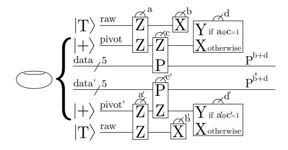
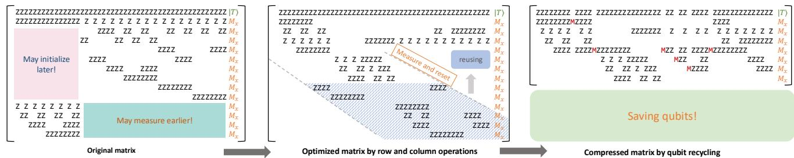

# V. PROTOCOL-LEVEL COMPRESSION OF DISTILLATION FOOTPRINT: RECYCLING LOGICAL QUBITS

The limited number of logical qubits in BB codes makes it challenging to host large distillation protocols within a single patch. Instead, we reduce the protocol's logical-qubit footprint by exploiting structure in its triorthogonal matrix. This optimization does not rely on implementation-specific details of the distillation circuits, and therefore applies to any distillation protocol generated from triorthogonal matrices, including protocols for states such as  $|T\rangle$ ,  $|CS\rangle$ , and  $|CCZ\rangle$ .

We introduce a *protocol compression* technique that lowers the peak number of simultaneously active logical qubits by recycling qubits whose rows become idle. In many triorthogonal constructions, such as the 49-to-1 code of Bravyi and Haah [47], the matrix contains large all-zero subblocks that indicate opportunities to delay initialization or advance measurement.

Fig. 6: Simultaneous realization of two pivot-based injections on blocks  $L_0$  to  $L_5$  and  $L_6$  to  $L_{11}$ . Logical Paulis on the two blocks are chosen to be identical and of pure X or Z type, which is essential for parallelization in *dual-track* distillation. Only pivot Y measurements, which require both LPU modules, must be serialized. Similar patterns apply to the other injection schemes in Figure 4.

Let  $G \in \{0,1\}^{m \times n}$  be a binary triorthogonal matrix. The first k rows have odd Hamming weight and encode the k output logical qubits; the remaining m-k rows have even weight. For each row i, let  $f_i$  denote the index of its first 1 (or  $+\infty$  if the row is all zeros) and  $\ell_i$  the index of its last 1 (or  $-\infty$  if all zeros).

Even rows support stabilizer checks and can both start later and end earlier: if the leftmost nonzero entry is at column  $f_i$ , the row need not be initialized before column  $f_i$ , and if the rightmost nonzero entry is at  $\ell_i$ , the row can be measured and freed after column  $\ell_i$ . Odd rows, in contrast, encode outputs and cannot be freed once initialized; even if an odd row has trailing zeros, we treat it as active on all columns  $j \geq f_i$ .

We say row i is *working* on column j if  $j \ge f_i$  and either (i)  $j \le \ell_i$  and the row is even, or (ii) the row is odd. Let W(j) denote the set of working rows at column j. The required number of simultaneous logical qubits is

$$\mathcal{C}(G) = \max_{j \in [n]} |W(j)|.$$

Our goal is to transform G into an equivalent triorthogonal matrix G' with the same distillation properties but a smaller peak footprint  $\mathcal{C}(G')$ .

We allow three classes of transformations that preserve triorthogonality and the encoded protocol:

- Column permutations, which reorder the commuting  $\pi/8$  rotations.
- Row permutations within blocks, which reorder odd rows among themselves and even rows among themselves.
- Row additions over  $\mathbb{F}_2$ , which add one row to another while maintaining triorthogonality and logical content.

By applying these operations, we reshape G so that many even rows share a right-aligned all-zero submatrix (early measurement) and many rows share a left-aligned all-zero submatrix (delayed initialization). In terms of the intervals  $[f_i, \ell_i]$ , these transformations shorten active windows and reduce the maximum overlap  $\max_j |W(j)|$ .

Fig. 7: (a) Example of a 49-to-1 magic state distillation triorthogonal matrix showing two all-zero subblocks: the left (pink) region corresponds to rows that can be initialized later, and the right (green) region to even rows that can be measured earlier. (b) After row and column operations that preserve triorthogonality, logical qubits freed by early-measured rows are recycled to support later-initialized rows, yielding a compressed matrix with fewer simultaneously active rows. (c) The optimized matrix achieves substantial logical-qubit savings while preserving protocol correctness.

Figure 7 illustrates this process for a 49-to-1 protocol. The original matrix has prominent left- and right-aligned all-zero regions. After suitable row additions and permutations, qubits freed by early-measured rows are recycled to support later-initialized rows. The resulting compressed matrix has a significantly reduced peak logical-qubit footprint while preserving triorthogonality and output error suppression.

Finding the globally optimal compression is computationally hard. Even in the simplified case where k=0 and each even row has Hamming weight two, minimizing  $\mathcal{C}(G)$  reduces to the NP-hard cutwidth problem. For realistic protocols with n in the tens or higher, we therefore rely on heuristics. In our experiments, simple greedy schemes that cluster row starts and ends, combined with targeted row additions, already yield substantial qubit savings and allow otherwise infeasible protocols to fit within a single BB patch.

## VI. EVALUATION METHODOLOGY

### A. Baselines

We compare our proposed distillation factories (GROSS and TWO-GROSS) against two state-of-the-art magic-state factory baselines: a surface-code distillation baseline follows the lattice-surgery factories of Litinski [46], and a cultivation baseline from Gidney's grafted surface code magic state cultivation [30]. Factories are evaluated under two different physical error rates  $p_{\rm phys}$ , with various input magic state error rates  $p_{\rm in}$  and output magic state error rates  $p_{\rm out}$ . Each factory is characterized by its physical-qubit footprint, the number of logical timesteps  $\tau_i$  per batch, and the resulting space-time volume (qubits  $\times$  timesteps). These are the quantities reported and compared in our results.

Distillation baselines are labeled as  $(Protocol)_{Code}$ , and, when the protocol is implemented on the surface code, we further annotate a triple  $(d_X, d_Z, d_m)$  that specifies the code distances used for the data blocks in [46]. Cultivation baselines are written as  $(Cultivation)_{SC\to d}$ , where d is the distance of Gidney's grafted surface-code patch.

## B. Factory Usage Modes

Magic state distillation protocols require a source of raw magic states as input. Our protocols then operate on magic states loaded into logical qubits of a bivariate bicycle code. We consider two settings in which our methods can be applied:

**Two-round distillation.** The bicycle architecture [27] details a promising approach for obtaining magic states by connecting magic state cultivation protocols [30] to a BB memory via a surgery ancilla system called adapter [34]. Magic state cultivation is a compressed hardware-native protocol that can achieve error rates as low as  $10^{-9}$  to  $10^{-11}$  depending on the details of the construction. Novel designs of magic state cultivation are still emerging [48] and may need to be tailored to hardware limitations, but the adapter construction is flexible enough such that any such proposal could be integrated into a bicycle architecture. In this setting, cultivation would act as a first-round protocol, with our distillation protocols implemented in BB memory acting as a second-round protocol achieving suppressed error rates (e.g.,  $35 \cdot (10^{-9})^3 = 3.5 \cdot 10^{-26}$  with a  $10^{-9}$  cultivated state fed into a [[15, 1, 3]] protocol). We also consider more conventional factory designs, where the first and second round protocols are both distillation. In our later results, such configurations are written as a combination of the two round protocols to make the first- and second-round costs explicit.

**One-round distillation.** While magic state cultivation is an optimized, high-performing protocol, we also consider other first-round protocols for adaptability to different architectural settings. An emerging line of work [39], [49], [50] is considering lower-overhead methods that instead inject low-quality magic states (physical error rates  $10^{-2}$  to  $10^{-3}$ ) into the memory directly, in which case our methods would act as a first round of error suppression. These could then be used for applications of early fault-tolerant scale (e.g.,  $35 \cdot (10^{-3})^3 = 3.5 \cdot 10^{-8}$  with a  $10^{-3}$  raw state in a [[15, 1, 3]] protocol).

## C. Noise Model and Error Analysis

A crucial part of magic-state factory design is understanding how each error source affects the final output error rate and the discard (post-selection) rate. Here, we present a detailed noise model and error analysis for our implementation of the distillation circuit in the BB architecture. We explicitly model logical errors, including imperfect logical operation and imperfect measurement outcomes. For both the gross code and the two-gross code, we characterize the combined impact on the delivered state's fidelity and acceptance probability for the following noise resources:

- 1) Magic state input error  $p_{\rm in}$ . This error arises from imperfect preparation of input T magic states. We model it as a depolarizing channel applied to the ideal magic state  $|m\rangle$ . The resulting error should be suppressed polynomially by the distillation protocol.
- 2) Automorphism gate error  $p_{\rm auto}$ . Automorphism errors are introduced by physical CNOT gates (each with physical error rate  $p_{\rm phys}$ ) applied to data and ancilla qubits. We model these gate errors as a uniform depolarizing channel acting on each logical qubit.
- 3) Inter-module measurement error  $p_{inter}$ . This error is introduced by the adapter that connects the distillation BB code patch with the magic state input. In this paper, we assume such error is concentrated on the two qubits measured, modeled as two-qubit depolarizing logical errors. In the bypassing pivot injection scheme in Figure 4(a)(c), the magic state is injected directly into logical qubits of the distillation circuit, so the logical error channel appears in the injection gadget as a multi-qubit depolarizing channel with inter-module logical error rate. While in the pivot injection scheme in Figure 4(b), Pauli errors introduced by the inter-module measurement are modeled as a two-qubit depolarizing channel acting on the source and pivot qubits, and are then propagated to the injected T magic state at the pivot, though at the cost of additional measurement operations. Below we detail how these errors propagate from the magic state resource with a concrete example.
- 4) **In-module measurement error**  $p_{\text{intra}}$ . This error is introduced by the LPU, which is used for logical operations including magic state injection, correction, and final post selection. The total error rate contains two components: measurement error and logical qubit error. The former correspond to flipping of measurement results, and the latter correspond to depolarizing logical errors. We define  $\lambda$  as the ratio between measurement error and the total in-module error rate,  $\lambda = \frac{p_{\text{meas}}}{p_{\text{intra}}}$ .

Not all logical errors harm the output magic state [46]. Figure 8 gives examples of how faults from logical operations propagate through the distillation circuit and contribute to the output error. In Fig. 8(a1), a Pauli Z logical error on qubits 2 to 5 commutes through all rotations and is detected by the final detector. In contrast, a Pauli X error in Fig. 8(a2) flips every measurement outcome it meets and is invisible to the final detector. Even in this case, it does not necessarily cause an output error, since at least three flipped rotations are required to induce a logical fault; the combination of the X-error location and the gate schedule is therefore crucial.

In Fig. 8, logical measurement errors are split into the two models introduced above. Panel (b1) models a two-qubit

Fig. 8: Illustration of how different errors are handled in our simulations. (a1) A Pauli-Z logical error leaves rotations unaffected but may flip final parity checks. (a2) A Pauli-X error flips the sign of rotations, but leaves final measurements unaffected. (b1) A faulty in-module/inter-module measurement introduces logical depolarizing errors to qubits, and (b2) a fault measurement outcome can be interpreted as a faultier input magic state.

depolarizing channel acting on the measured qubits for intermodule measurements and all qubit depolarizing channel for in-module measurements. Specifically, the error on the magic state qubit is less harmful, as any Z component is equivalent to a Z preparation error that introduces an extra  $\pi/2$  rotation, while an X component can be absorbed into the final X-basis measurement. Panel (b2) illustrates a pure measurement-outcome flip, which is equivalent to inserting (or omitting) a  $\pi/4$  rotation (or an input X error on the magic state) and is detectable by the distillation protocol. Finally, errors in the final X-basis measurements at the end are generally less harmful as well: a false positive only increases the discard rate, while a false negative must combine with a preexisting logical error and is therefore a second-order contributor to the final output error rate.

Hence, we report the output error rate by two methods: (i) a union bound calculation, which counts any failure from any logical operation toward the output infidelity; and (ii) a density matrix simulation that models each logical qubit as a single qubit with the prescribed logical level noise rates. In the simulation, parameter  $\lambda$  sets the mix of logical measurement errors (measurement flips versus depolarizing memory faults). Both methods employ error rates from previous simulation results in Table I of [27]. Notably, due to the highly non-Clifford nature of the distillation circuits considered here, endto-end physical-level simulation is computationally impractical in the regime of interest. Exact simulation of generic noisy non-Clifford circuits typically requires dense density-matrix methods rather than efficient stabilizer-based techniques, and is therefore in practice restricted to only tens of qubits, often on the order of  $\sim 20$  qubits. Moreover, a full physicallevel treatment would need to incorporate repeated syndrome extraction, decoding, and memory noise over time in order to

| Logical Operation  | Code Type | Timesteps | Logical Error Rate P     |                          |  |
|--------------------|-----------|-----------|--------------------------|--------------------------|--|
| Logical Operation  | Code Type | $\tau_i$  | $p_{\rm phys} = 10^{-3}$ | $p_{\rm phys} = 10^{-4}$ |  |
| Shift automorphism | Gross     | 14        | $10^{-6.4}$              | $10^{-12.2}$             |  |
| $p_{\rm auto}$     | Two-gross | 14        | $10^{-14.5}$             | $10^{-37}$               |  |
| In-module meas.    | Gross     | 120       | $10^{-5.0}$              | $10^{-9.0}$              |  |
| $p_{\rm intra}$    | Two-gross | 216       | $10^{-11}$               | $10^{-20}$               |  |
| Inter-module meas. | Gross     | 120       | $10^{-2.7}$              | $10^{-7.3}$              |  |
| $p_{\rm inter}$    | Two-gross | 216       | $10^{-9}$                | $10^{-18}$               |  |

TABLE I: Timestep and logical error rate of BB code's logical operations from [27]. The tabulated values are identical to those employed in our simulations.

| Optimization pass               | Runtime                 |
|---------------------------------|-------------------------|
| Logical qubit mapping & masking | $\sim 10  \mathrm{min}$ |
| Automorphism TSP                | $< 3 \mathrm{s}$        |
| Protocol compressor             | $< 5\mathrm{s}$         |

TABLE II: Classical Compilation Overhead of the Optimization Methods in Sec. IV and V for two-gross code and 49-to-1 protocol.

determine the effective logical error rates of the BB operations. Our two-level methodology instead uses prior physical-level studies from [27] determine these hardware-informed logical error rates, and then evaluates the performance of the full distillation circuit at the logical level under the resulting noise model.

### D. Experimental Setup and Classical Compilation Overhead

All simulations were conducted on a Macbook Pro with a 10 core CPU and 32 GB of RAM. We also report the classical running time of each optimization in Table II, using the example of the largest protocol 49-to-1 and largest code two-gross.

## VII. RESULTS

# V. PROTOCOL-LEVEL COMPRESSION OF DISTILLATION FOOTPRINT: RECYCLING LOGICAL QUBITS

The limited number of logical qubits in BB codes makes it challenging to host large distillation protocols within a single patch. Instead, we reduce the protocol's logical-qubit footprint by exploiting structure in its triorthogonal matrix. This optimization does not rely on implementation-specific details of the distillation circuits, and therefore applies to any distillation protocol generated from triorthogonal matrices, including protocols for states such as  $|T\rangle$ ,  $|CS\rangle$ , and  $|CCZ\rangle$ .

We introduce a *protocol compression* technique that lowers the peak number of simultaneously active logical qubits by recycling qubits whose rows become idle. In many triorthogonal constructions, such as the 49-to-1 code of Bravyi and Haah [47], the matrix contains large all-zero subblocks that indicate opportunities to delay initialization or advance measurement.

Fig. 6: Simultaneous realization of two pivot-based injections on blocks  $L_0$  to  $L_5$  and  $L_6$  to  $L_{11}$ . Logical Paulis on the two blocks are chosen to be identical and of pure X or Z type, which is essential for parallelization in *dual-track* distillation. Only pivot Y measurements, which require both LPU modules, must be serialized. Similar patterns apply to the other injection schemes in Figure 4.

Let  $G \in \{0,1\}^{m \times n}$  be a binary triorthogonal matrix. The first k rows have odd Hamming weight and encode the k output logical qubits; the remaining m-k rows have even weight. For each row i, let  $f_i$  denote the index of its first 1 (or  $+\infty$  if the row is all zeros) and  $\ell_i$  the index of its last 1 (or  $-\infty$  if all zeros).

Even rows support stabilizer checks and can both start later and end earlier: if the leftmost nonzero entry is at column  $f_i$ , the row need not be initialized before column  $f_i$ , and if the rightmost nonzero entry is at  $\ell_i$ , the row can be measured and freed after column  $\ell_i$ . Odd rows, in contrast, encode outputs and cannot be freed once initialized; even if an odd row has trailing zeros, we treat it as active on all columns  $j \geq f_i$ .

We say row i is *working* on column j if  $j \ge f_i$  and either (i)  $j \le \ell_i$  and the row is even, or (ii) the row is odd. Let W(j) denote the set of working rows at column j. The required number of simultaneous logical qubits is

$$\mathcal{C}(G) = \max_{j \in [n]} |W(j)|.$$

Our goal is to transform G into an equivalent triorthogonal matrix G' with the same distillation properties but a smaller peak footprint  $\mathcal{C}(G')$ .

We allow three classes of transformations that preserve triorthogonality and the encoded protocol:

- Column permutations, which reorder the commuting  $\pi/8$  rotations.
- Row permutations within blocks, which reorder odd rows among themselves and even rows among themselves.
- Row additions over  $\mathbb{F}_2$ , which add one row to another while maintaining triorthogonality and logical content.

By applying these operations, we reshape G so that many even rows share a right-aligned all-zero submatrix (early measurement) and many rows share a left-aligned all-zero submatrix (delayed initialization). In terms of the intervals  $[f_i, \ell_i]$ , these transformations shorten active windows and reduce the maximum overlap  $\max_j |W(j)|$ .

Fig. 7: (a) Example of a 49-to-1 magic state distillation triorthogonal matrix showing two all-zero subblocks: the left (pink) region corresponds to rows that can be initialized later, and the right (green) region to even rows that can be measured earlier. (b) After row and column operations that preserve triorthogonality, logical qubits freed by early-measured rows are recycled to support later-initialized rows, yielding a compressed matrix with fewer simultaneously active rows. (c) The optimized matrix achieves substantial logical-qubit savings while preserving protocol correctness.

Figure 7 illustrates this process for a 49-to-1 protocol. The original matrix has prominent left- and right-aligned all-zero regions. After suitable row additions and permutations, qubits freed by early-measured rows are recycled to support later-initialized rows. The resulting compressed matrix has a significantly reduced peak logical-qubit footprint while preserving triorthogonality and output error suppression.

Finding the globally optimal compression is computationally hard. Even in the simplified case where k=0 and each even row has Hamming weight two, minimizing  $\mathcal{C}(G)$  reduces to the NP-hard cutwidth problem. For realistic protocols with n in the tens or higher, we therefore rely on heuristics. In our experiments, simple greedy schemes that cluster row starts and ends, combined with targeted row additions, already yield substantial qubit savings and allow otherwise infeasible protocols to fit within a single BB patch.

## VI. EVALUATION METHODOLOGY

### A. Baselines

We compare our proposed distillation factories (GROSS and TWO-GROSS) against two state-of-the-art magic-state factory baselines: a surface-code distillation baseline follows the lattice-surgery factories of Litinski [46], and a cultivation baseline from Gidney's grafted surface code magic state cultivation [30]. Factories are evaluated under two different physical error rates  $p_{\rm phys}$ , with various input magic state error rates  $p_{\rm in}$  and output magic state error rates  $p_{\rm out}$ . Each factory is characterized by its physical-qubit footprint, the number of logical timesteps  $\tau_i$  per batch, and the resulting space-time volume (qubits  $\times$  timesteps). These are the quantities reported and compared in our results.

Distillation baselines are labeled as  $(Protocol)_{Code}$ , and, when the protocol is implemented on the surface code, we further annotate a triple  $(d_X, d_Z, d_m)$  that specifies the code distances used for the data blocks in [46]. Cultivation baselines are written as  $(Cultivation)_{SC\to d}$ , where d is the distance of Gidney's grafted surface-code patch.

## B. Factory Usage Modes

Magic state distillation protocols require a source of raw magic states as input. Our protocols then operate on magic states loaded into logical qubits of a bivariate bicycle code. We consider two settings in which our methods can be applied:

**Two-round distillation.** The bicycle architecture [27] details a promising approach for obtaining magic states by connecting magic state cultivation protocols [30] to a BB memory via a surgery ancilla system called adapter [34]. Magic state cultivation is a compressed hardware-native protocol that can achieve error rates as low as  $10^{-9}$  to  $10^{-11}$  depending on the details of the construction. Novel designs of magic state cultivation are still emerging [48] and may need to be tailored to hardware limitations, but the adapter construction is flexible enough such that any such proposal could be integrated into a bicycle architecture. In this setting, cultivation would act as a first-round protocol, with our distillation protocols implemented in BB memory acting as a second-round protocol achieving suppressed error rates (e.g.,  $35 \cdot (10^{-9})^3 = 3.5 \cdot 10^{-26}$  with a  $10^{-9}$  cultivated state fed into a [[15, 1, 3]] protocol). We also consider more conventional factory designs, where the first and second round protocols are both distillation. In our later results, such configurations are written as a combination of the two round protocols to make the first- and second-round costs explicit.

**One-round distillation.** While magic state cultivation is an optimized, high-performing protocol, we also consider other first-round protocols for adaptability to different architectural settings. An emerging line of work [39], [49], [50] is considering lower-overhead methods that instead inject low-quality magic states (physical error rates  $10^{-2}$  to  $10^{-3}$ ) into the memory directly, in which case our methods would act as a first round of error suppression. These could then be used for applications of early fault-tolerant scale (e.g.,  $35 \cdot (10^{-3})^3 = 3.5 \cdot 10^{-8}$  with a  $10^{-3}$  raw state in a [[15, 1, 3]] protocol).

## C. Noise Model and Error Analysis

A crucial part of magic-state factory design is understanding how each error source affects the final output error rate and the discard (post-selection) rate. Here, we present a detailed noise model and error analysis for our implementation of the distillation circuit in the BB architecture. We explicitly model logical errors, including imperfect logical operation and imperfect measurement outcomes. For both the gross code and the two-gross code, we characterize the combined impact on the delivered state's fidelity and acceptance probability for the following noise resources:

- 1) Magic state input error  $p_{\rm in}$ . This error arises from imperfect preparation of input T magic states. We model it as a depolarizing channel applied to the ideal magic state  $|m\rangle$ . The resulting error should be suppressed polynomially by the distillation protocol.
- 2) Automorphism gate error  $p_{\rm auto}$ . Automorphism errors are introduced by physical CNOT gates (each with physical error rate  $p_{\rm phys}$ ) applied to data and ancilla qubits. We model these gate errors as a uniform depolarizing channel acting on each logical qubit.
- 3) Inter-module measurement error  $p_{inter}$ . This error is introduced by the adapter that connects the distillation BB code patch with the magic state input. In this paper, we assume such error is concentrated on the two qubits measured, modeled as two-qubit depolarizing logical errors. In the bypassing pivot injection scheme in Figure 4(a)(c), the magic state is injected directly into logical qubits of the distillation circuit, so the logical error channel appears in the injection gadget as a multi-qubit depolarizing channel with inter-module logical error rate. While in the pivot injection scheme in Figure 4(b), Pauli errors introduced by the inter-module measurement are modeled as a two-qubit depolarizing channel acting on the source and pivot qubits, and are then propagated to the injected T magic state at the pivot, though at the cost of additional measurement operations. Below we detail how these errors propagate from the magic state resource with a concrete example.
- 4) **In-module measurement error**  $p_{\text{intra}}$ . This error is introduced by the LPU, which is used for logical operations including magic state injection, correction, and final post selection. The total error rate contains two components: measurement error and logical qubit error. The former correspond to flipping of measurement results, and the latter correspond to depolarizing logical errors. We define  $\lambda$  as the ratio between measurement error and the total in-module error rate,  $\lambda = \frac{p_{\text{meas}}}{p_{\text{intra}}}$ .

Not all logical errors harm the output magic state [46]. Figure 8 gives examples of how faults from logical operations propagate through the distillation circuit and contribute to the output error. In Fig. 8(a1), a Pauli Z logical error on qubits 2 to 5 commutes through all rotations and is detected by the final detector. In contrast, a Pauli X error in Fig. 8(a2) flips every measurement outcome it meets and is invisible to the final detector. Even in this case, it does not necessarily cause an output error, since at least three flipped rotations are required to induce a logical fault; the combination of the X-error location and the gate schedule is therefore crucial.

In Fig. 8, logical measurement errors are split into the two models introduced above. Panel (b1) models a two-qubit

Fig. 8: Illustration of how different errors are handled in our simulations. (a1) A Pauli-Z logical error leaves rotations unaffected but may flip final parity checks. (a2) A Pauli-X error flips the sign of rotations, but leaves final measurements unaffected. (b1) A faulty in-module/inter-module measurement introduces logical depolarizing errors to qubits, and (b2) a fault measurement outcome can be interpreted as a faultier input magic state.

depolarizing channel acting on the measured qubits for intermodule measurements and all qubit depolarizing channel for in-module measurements. Specifically, the error on the magic state qubit is less harmful, as any Z component is equivalent to a Z preparation error that introduces an extra  $\pi/2$  rotation, while an X component can be absorbed into the final X-basis measurement. Panel (b2) illustrates a pure measurement-outcome flip, which is equivalent to inserting (or omitting) a  $\pi/4$  rotation (or an input X error on the magic state) and is detectable by the distillation protocol. Finally, errors in the final X-basis measurements at the end are generally less harmful as well: a false positive only increases the discard rate, while a false negative must combine with a preexisting logical error and is therefore a second-order contributor to the final output error rate.

Hence, we report the output error rate by two methods: (i) a union bound calculation, which counts any failure from any logical operation toward the output infidelity; and (ii) a density matrix simulation that models each logical qubit as a single qubit with the prescribed logical level noise rates. In the simulation, parameter  $\lambda$  sets the mix of logical measurement errors (measurement flips versus depolarizing memory faults). Both methods employ error rates from previous simulation results in Table I of [27]. Notably, due to the highly non-Clifford nature of the distillation circuits considered here, endto-end physical-level simulation is computationally impractical in the regime of interest. Exact simulation of generic noisy non-Clifford circuits typically requires dense density-matrix methods rather than efficient stabilizer-based techniques, and is therefore in practice restricted to only tens of qubits, often on the order of  $\sim 20$  qubits. Moreover, a full physicallevel treatment would need to incorporate repeated syndrome extraction, decoding, and memory noise over time in order to

| Logical Operation  | Code Type | Timesteps | Logical Error Rate P     |                          |  |
|--------------------|-----------|-----------|--------------------------|--------------------------|--|
| Logical Operation  | Code Type | $\tau_i$  | $p_{\rm phys} = 10^{-3}$ | $p_{\rm phys} = 10^{-4}$ |  |
| Shift automorphism | Gross     | 14        | $10^{-6.4}$              | $10^{-12.2}$             |  |
| $p_{\rm auto}$     | Two-gross | 14        | $10^{-14.5}$             | $10^{-37}$               |  |
| In-module meas.    | Gross     | 120       | $10^{-5.0}$              | $10^{-9.0}$              |  |
| $p_{\rm intra}$    | Two-gross | 216       | $10^{-11}$               | $10^{-20}$               |  |
| Inter-module meas. | Gross     | 120       | $10^{-2.7}$              | $10^{-7.3}$              |  |
| $p_{\rm inter}$    | Two-gross | 216       | $10^{-9}$                | $10^{-18}$               |  |

TABLE I: Timestep and logical error rate of BB code's logical operations from [27]. The tabulated values are identical to those employed in our simulations.

| Optimization pass               | Runtime                 |
|---------------------------------|-------------------------|
| Logical qubit mapping & masking | $\sim 10  \mathrm{min}$ |
| Automorphism TSP                | $< 3 \mathrm{s}$        |
| Protocol compressor             | $< 5\mathrm{s}$         |

TABLE II: Classical Compilation Overhead of the Optimization Methods in Sec. IV and V for two-gross code and 49-to-1 protocol.

determine the effective logical error rates of the BB operations. Our two-level methodology instead uses prior physical-level studies from [27] determine these hardware-informed logical error rates, and then evaluates the performance of the full distillation circuit at the logical level under the resulting noise model.

### D. Experimental Setup and Classical Compilation Overhead

All simulations were conducted on a Macbook Pro with a 10 core CPU and 32 GB of RAM. We also report the classical running time of each optimization in Table II, using the example of the largest protocol 49-to-1 and largest code two-gross.

## VII. RESULTS

