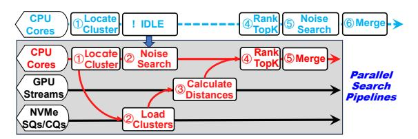

# A. Operators Allocation

First, we run top-10 searches on SIFT1B to measure the number of vectors accessed from clusters per query under varying recall. Figure 7a shows the results (downward error bars are from the pruning strategy like SPANN [32]) and we can see that the number of searched vectors remains within

Fig. 7: Micro benchmarks of computation operators.

Fig. 8: Search pipeline of TRIDENTANN.

a bounded range (e.g., from  $\sim 11 \mathrm{K}$  at 90% recall to  $\sim 43 \mathrm{K}$  at 98% recall). This indicates that such workloads provide a quantitative basis for benchmarking the performance of distance computation and ranking on GPU/CPU.

Then, on platforms in Section VIII, we conduct micro benchmarks within this scale to investigate optimal kernel allocation strategies on the CPU-GPU combination, as Figure 7b. For calculating distance [6], we compare average latencies of cuBLAS [2] on the GPU and SIMD kernels [5] of SPANN on the CPU, with all threads active. For ranking topK, we use the state-of-the-art GPU ranking method AIR-TOPK [76] and the heap-based CPU ranking partial\_sort.

Figure 7b shows that GPU demonstrates a clear advantage over CPU for distance calculation. However, in the ranking stage, low-end GPUs become bottlenecks. This is because current optimal GPU-ranking algorithms (i.e., radix-style selections), heavily rely on GPU device bandwidth [76], which is limited on low-end GPUs. Conversely, CPU-based ranking remains robust and efficient for actual workloads of ANNS.

These findings suggest that assigning distance computation to the GPU and performing ranking on the CPU enables the entire computation of clustering search to be completed within  $\sim 0.1$  ms. This task allocation effectively leverages the complementary strengths of heterogeneous hardware components, maximizing overall efficiency of TRIDENTANN.

## B. Parallel pipelines on heterogeneous hardware

TRIDENTANN further adopts parallel pipelines across CPUs, GPUs, and NVMe SSDs, to overlap search processes of noise and clusters, as illustrated in Figure 8. The CPU first locates the nearest clusters ① and issues NVMe I/O commands to fetch the corresponding cluster lists ②. In the straightforward integration (top line), the process of searching in noise (as ⑤ of the top line) would be performed after searching in clusters is done. It incurs additional overhead due

to separating noise vectors from clusters. We eliminate this inefficiency by exploiting idle CPU to search the in-memory graph index of noise vectors (②) during cluster-loading I/O, thereby overlapping the two search paths.

In addition, clusters are loaded directly from NVMe SSDs into GPU memory, where calculating distances is performed using thread-local GPU streams ③. This allows concurrent kernel executions across queries. Ranking topK based on the computed distances is then executed on the CPU ④, which avoids bottlenecks of low-end GPUs' ranking. Finally, results from the noise and cluster paths are merged to form the final top-k output, as ⑤ of the second line.

# A. Operators Allocation

First, we run top-10 searches on SIFT1B to measure the number of vectors accessed from clusters per query under varying recall. Figure 7a shows the results (downward error bars are from the pruning strategy like SPANN [32]) and we can see that the number of searched vectors remains within

Fig. 7: Micro benchmarks of computation operators.

Fig. 8: Search pipeline of TRIDENTANN.

a bounded range (e.g., from  $\sim 11 \mathrm{K}$  at 90% recall to  $\sim 43 \mathrm{K}$  at 98% recall). This indicates that such workloads provide a quantitative basis for benchmarking the performance of distance computation and ranking on GPU/CPU.

Then, on platforms in Section VIII, we conduct micro benchmarks within this scale to investigate optimal kernel allocation strategies on the CPU-GPU combination, as Figure 7b. For calculating distance [6], we compare average latencies of cuBLAS [2] on the GPU and SIMD kernels [5] of SPANN on the CPU, with all threads active. For ranking topK, we use the state-of-the-art GPU ranking method AIR-TOPK [76] and the heap-based CPU ranking partial\_sort.

Figure 7b shows that GPU demonstrates a clear advantage over CPU for distance calculation. However, in the ranking stage, low-end GPUs become bottlenecks. This is because current optimal GPU-ranking algorithms (i.e., radix-style selections), heavily rely on GPU device bandwidth [76], which is limited on low-end GPUs. Conversely, CPU-based ranking remains robust and efficient for actual workloads of ANNS.

These findings suggest that assigning distance computation to the GPU and performing ranking on the CPU enables the entire computation of clustering search to be completed within  $\sim 0.1$  ms. This task allocation effectively leverages the complementary strengths of heterogeneous hardware components, maximizing overall efficiency of TRIDENTANN.

## B. Parallel pipelines on heterogeneous hardware

TRIDENTANN further adopts parallel pipelines across CPUs, GPUs, and NVMe SSDs, to overlap search processes of noise and clusters, as illustrated in Figure 8. The CPU first locates the nearest clusters ① and issues NVMe I/O commands to fetch the corresponding cluster lists ②. In the straightforward integration (top line), the process of searching in noise (as ⑤ of the top line) would be performed after searching in clusters is done. It incurs additional overhead due

to separating noise vectors from clusters. We eliminate this inefficiency by exploiting idle CPU to search the in-memory graph index of noise vectors (②) during cluster-loading I/O, thereby overlapping the two search paths.

In addition, clusters are loaded directly from NVMe SSDs into GPU memory, where calculating distances is performed using thread-local GPU streams ③. This allows concurrent kernel executions across queries. Ranking topK based on the computed distances is then executed on the CPU ④, which avoids bottlenecks of low-end GPUs' ranking. Finally, results from the noise and cluster paths are merged to form the final top-k output, as ⑤ of the second line.

