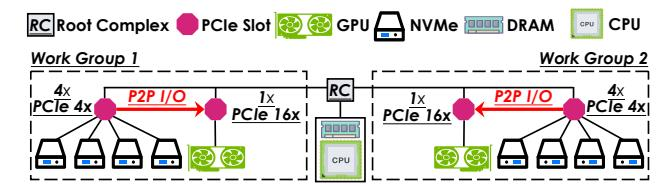
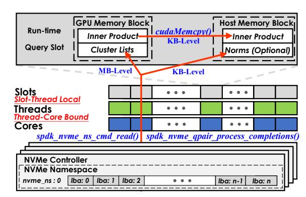

# Algorithm 3 Forming lists and separating noise from clusters

```
 \begin{array}{ll} \textbf{Input:} \ \ \text{dataset} \ X, \ \text{centroids} \ C_{bala}, \ \text{member sets} \ I', \ \text{candidate sets} \ E', \ \text{list} \\ \ \ \ \ \ \ \ \ \ \ \ \ \ \ \ \ \ \
```

## C. Step 3: Forming Hybrid Index

After Step-2, we have obtained balanced clusters, each with a centroid, a set of members and a set of candidates. Now, we are able to separate noise and non-noise clusters, because noise tends to be far away from others and form small clusters with fewer members and candidates. The process is shown in Algorithm 3. We iterate over all clusters to check whether each cluster has a member set size above the threshold n and whether its members and candidates are sufficient (> r) to form a list (lines 2-7). If so (lines 3-6), we select the closest vectors to the centroid, from candidate set, to pad the member set to the list size (line 4). We then recalibrate the centroid based on the final in-list members and append the resulting cluster to the output (line 5). After processing all clusters, we identify vectors that are not included in any cluster list as noise, since smaller clusters are filtered out (line 8). With the final centroids C, cluster lists R, and noise N (line 9), we build the in-memory HNSW [52] for centroids and the in-memory SPTAG-BKT [8] for noise, while cluster lists are stored on SSDs. For billion-scale datasets, our index typically yields  $\sim$ 15M-60M centroids and  $\sim$ 100M noise vectors. Following scale-performance evaluations of [30], we use HNSW for centroids and BKT for noise. Additionally, other indexes can be chosen adaptively for these two in-memory parts as well.


Fig. 4: Steps and states of building a clusters-noise separated hybrid index in TRIDENTANN.

#### D. Example Walkthrough

We now walk through the whole procedure of building the hybrid index, with an example in Figure 4. In Step-1, we sample a subset of the raw dataset in State 0, and then build initial clusters as State 1. As an example, we can see that vector **a** is not only a member of cluster **C1**, but also a candidate of cluster C2. Now, some clusters are also oversized (e.g., C1 in State 1) and we hence split these large ones until no one is above the list size limit r (e.g., r=5 here). For example, C1 is split into C3 and C4 in State 2. Because of candidate inheritance, vectors c and d, candidates of C1 in State 1, are now candidates of both C3 and C4. For b, a member of C3, would not be in the candidate set of the sibling C4. In Step-3, we filter out small clusters with members fewer than n (e.g. n=3 here) and pad clusters reserved to r with candidates (e.g., C3 and C5). In State-3, e is filtered out as noise, and C3, C4, C5 are built as centroids and cluster lists.

#### E. Construction Implementation

To enable fast construction of the hybrid index, we develop both CPU-only and GPU-accelerated pipelines. Following SPANN, we first run hierarchical clustering to generate initial centroids. In the GPU pipeline, we reuse and reorganize FAISS GPU *KMeans* to compose the hierarchical clustering workflow. In early iterations, we use GPUs to generate centroids. After several splits, we maintain a size-ordered deque of clusters: the GPU continues splitting larger clusters, while the CPU processes smaller ones, parallelizing all compute resources (i.e., GPUs and CPUs) in the remaining process.

After obtaining the initial centroids, we accelerate membership assignment and candidate-set allocation by building an HNSW graph over the centroids and approximating the exact KNN search in Algorithm 1 (Line 6) with ANN search. This reduces the large KNN overhead with negligible quality loss (less than 0.1% recall drop on SIFT1B). The KMeans used in the balancing step can also be GPU-accelerated. Finally, we parallelize multi-threaded qualification tests of the step 3 and padding lists from the candidate set. We record clustered vectors using a bitmap and identify missed noise vectors via a single-round scan. Additionally, to support 10B-scale indexes, we store vector IDs as uint64, since existing other opensource systems [32, 40, 66] typically use 32-bit IDs, and thus cannot represent 10B vectors.

## VI. DIRECT GPU-SSD DATA TRANSFER

One important lesson learned from existing ANNS systems is that GPU's processing power can significantly increase QPS.



Fig. 5: Hardware architecture of TRIDENTANN.

However, a naive setup would lead to double transfer overhead (i.e., SSD to host memory and then to GPU). To achieve direct SSD-to-GPU transfer, we customize the hardware architecture and the software stack in TRIDENTANN.

## A. Hardware Architecture

Figure 5 shows TRIDENTANN organizes SSDs and GPUs into *Work Groups*, where each integrates four SSDs and one GPU, occupying a total of  $32\times$  PCIe lanes. Specifically, four NVMe SSDs are connected to a  $16\times$  PCIe slot via 4 individual  $4\times$  lanes, while the GPU is attached through a full  $16\times$  PCIe slot. During running, cluster lists residing in the SSDs of a *Work Group* are transferred via P2P communication to the GPU within the same Work Group for processing. Modern platforms usually have 64-160 PCIe lanes [24, 25], and can be scaled up with PCIe switches. Thus, it can be easily organized to scale up for higher throughput with more PCIe slots of root complex or extra switches on a single node.

## B. Software Implementation

Setting up Work Groups still requires software support to enable P2P transfer, and we initially attempted to use existing GPU-SSD I/O stacks, such as GDS, BaM, CAM, and GeminiFS [17, 59, 61, 65]. However, we found that these cannot fully meet our requirements. To begin with, GDS achieves low practical bandwidth utilization (~40–70%) under small I/O granularity [61] (e.g., ~8–12 KB per cluster read, while a single query requires hundreds of such random reads), due to CPU-side kernel software, leading to suboptimal improvement as Subsection VIII-D. Additionally, BaM, CAM and GeminiFS are overkill for our needs. BaM and CAM target to bypass CPU in multi-round interactions between I/O and GPU kernels, and GeminiFS further provides filesystem API for this GPU-initiated I/O, but TRIDENTANN operates as single-round I/O followed by a single distance kernel. Moreover, GPU-initiated pattern like BaM usually only works on high-end GPUs with large BAR (Base Address Register) space [20], but TRIDENTANN tends to utilize low-end GPUs for cost efficiency, which usually have limited BAR space.



Fig. 6: I/O management of TRIDENTANN.

**On-disk Layout.** In TRIDENTANN, we manage NVMe SSDs directly through the driver-level abstraction as shown in Figure 6. We organize the disk space as a triplet (*nvme\_ns*, *lba*, *block\_cnt*). The *nvme\_ns* refers to an individual SSD, the *lba* is the logical block address on each disk and the *block\_cnt* is the number of blocks to read or write.

**Host/GPU memory layout.** Run-time query slots consist of memory blocks on both GPU and CPU. Each GPU block contains a *Cluster Lists* zone for loading lists from SSDs and an *Inner Product* (IP) for results of distance calculations. Each host block also contains an *Inner Product* for receiving IP distances by *cudaMemcpy()* and an optional *Norm* zone for L2 distances (L2 distances can be derived from IP distances and norms of vectors during ranking [6, 79]).

**P2P procedure.** When loading, TRIDENTANN first locates (*nvme\_ns*, *lba*) of searched cluster lists through a hash map structure, and then gets I/O size (*block\_cnt*) according to list size. I/O requests are submitted directly to NVMe I/O queues, and completions are polled by threads bound one-to-one to cores. Each thread maintains a local run-time query slot. Typically, per-query cluster I/O involves MB-level data transfers (e.g., hundreds of clusters with ~8-12 KB per cluster list), while IP results and norms require only KB-level bandwidth (e.g., 1 FP32 per 128-byte vector). This pattern allows TRIDENTANN to prioritize PCIe bandwidth for SSD-to-GPU transfers of cluster lists, which are bandwidth-critical.

# Algorithm 3 Forming lists and separating noise from clusters

```
 \begin{array}{ll} \textbf{Input:} \ \ \text{dataset} \ X, \ \text{centroids} \ C_{bala}, \ \text{member sets} \ I', \ \text{candidate sets} \ E', \ \text{list} \\ \ \ \ \ \ \ \ \ \ \ \ \ \ \ \ \ \ \
```

## C. Step 3: Forming Hybrid Index

After Step-2, we have obtained balanced clusters, each with a centroid, a set of members and a set of candidates. Now, we are able to separate noise and non-noise clusters, because noise tends to be far away from others and form small clusters with fewer members and candidates. The process is shown in Algorithm 3. We iterate over all clusters to check whether each cluster has a member set size above the threshold n and whether its members and candidates are sufficient (> r) to form a list (lines 2-7). If so (lines 3-6), we select the closest vectors to the centroid, from candidate set, to pad the member set to the list size (line 4). We then recalibrate the centroid based on the final in-list members and append the resulting cluster to the output (line 5). After processing all clusters, we identify vectors that are not included in any cluster list as noise, since smaller clusters are filtered out (line 8). With the final centroids C, cluster lists R, and noise N (line 9), we build the in-memory HNSW [52] for centroids and the in-memory SPTAG-BKT [8] for noise, while cluster lists are stored on SSDs. For billion-scale datasets, our index typically yields  $\sim$ 15M-60M centroids and  $\sim$ 100M noise vectors. Following scale-performance evaluations of [30], we use HNSW for centroids and BKT for noise. Additionally, other indexes can be chosen adaptively for these two in-memory parts as well.


Fig. 4: Steps and states of building a clusters-noise separated hybrid index in TRIDENTANN.

#### D. Example Walkthrough

We now walk through the whole procedure of building the hybrid index, with an example in Figure 4. In Step-1, we sample a subset of the raw dataset in State 0, and then build initial clusters as State 1. As an example, we can see that vector **a** is not only a member of cluster **C1**, but also a candidate of cluster C2. Now, some clusters are also oversized (e.g., C1 in State 1) and we hence split these large ones until no one is above the list size limit r (e.g., r=5 here). For example, C1 is split into C3 and C4 in State 2. Because of candidate inheritance, vectors c and d, candidates of C1 in State 1, are now candidates of both C3 and C4. For b, a member of C3, would not be in the candidate set of the sibling C4. In Step-3, we filter out small clusters with members fewer than n (e.g. n=3 here) and pad clusters reserved to r with candidates (e.g., C3 and C5). In State-3, e is filtered out as noise, and C3, C4, C5 are built as centroids and cluster lists.

#### E. Construction Implementation

To enable fast construction of the hybrid index, we develop both CPU-only and GPU-accelerated pipelines. Following SPANN, we first run hierarchical clustering to generate initial centroids. In the GPU pipeline, we reuse and reorganize FAISS GPU *KMeans* to compose the hierarchical clustering workflow. In early iterations, we use GPUs to generate centroids. After several splits, we maintain a size-ordered deque of clusters: the GPU continues splitting larger clusters, while the CPU processes smaller ones, parallelizing all compute resources (i.e., GPUs and CPUs) in the remaining process.

After obtaining the initial centroids, we accelerate membership assignment and candidate-set allocation by building an HNSW graph over the centroids and approximating the exact KNN search in Algorithm 1 (Line 6) with ANN search. This reduces the large KNN overhead with negligible quality loss (less than 0.1% recall drop on SIFT1B). The KMeans used in the balancing step can also be GPU-accelerated. Finally, we parallelize multi-threaded qualification tests of the step 3 and padding lists from the candidate set. We record clustered vectors using a bitmap and identify missed noise vectors via a single-round scan. Additionally, to support 10B-scale indexes, we store vector IDs as uint64, since existing other opensource systems [32, 40, 66] typically use 32-bit IDs, and thus cannot represent 10B vectors.

## VI. DIRECT GPU-SSD DATA TRANSFER

One important lesson learned from existing ANNS systems is that GPU's processing power can significantly increase QPS.


Fig. 5: Hardware architecture of TRIDENTANN.

However, a naive setup would lead to double transfer overhead (i.e., SSD to host memory and then to GPU). To achieve direct SSD-to-GPU transfer, we customize the hardware architecture and the software stack in TRIDENTANN.

## A. Hardware Architecture

Figure 5 shows TRIDENTANN organizes SSDs and GPUs into *Work Groups*, where each integrates four SSDs and one GPU, occupying a total of  $32\times$  PCIe lanes. Specifically, four NVMe SSDs are connected to a  $16\times$  PCIe slot via 4 individual  $4\times$  lanes, while the GPU is attached through a full  $16\times$  PCIe slot. During running, cluster lists residing in the SSDs of a *Work Group* are transferred via P2P communication to the GPU within the same Work Group for processing. Modern platforms usually have 64-160 PCIe lanes [24, 25], and can be scaled up with PCIe switches. Thus, it can be easily organized to scale up for higher throughput with more PCIe slots of root complex or extra switches on a single node.

## B. Software Implementation

Setting up Work Groups still requires software support to enable P2P transfer, and we initially attempted to use existing GPU-SSD I/O stacks, such as GDS, BaM, CAM, and GeminiFS [17, 59, 61, 65]. However, we found that these cannot fully meet our requirements. To begin with, GDS achieves low practical bandwidth utilization (~40–70%) under small I/O granularity [61] (e.g., ~8–12 KB per cluster read, while a single query requires hundreds of such random reads), due to CPU-side kernel software, leading to suboptimal improvement as Subsection VIII-D. Additionally, BaM, CAM and GeminiFS are overkill for our needs. BaM and CAM target to bypass CPU in multi-round interactions between I/O and GPU kernels, and GeminiFS further provides filesystem API for this GPU-initiated I/O, but TRIDENTANN operates as single-round I/O followed by a single distance kernel. Moreover, GPU-initiated pattern like BaM usually only works on high-end GPUs with large BAR (Base Address Register) space [20], but TRIDENTANN tends to utilize low-end GPUs for cost efficiency, which usually have limited BAR space.


Fig. 6: I/O management of TRIDENTANN.

**On-disk Layout.** In TRIDENTANN, we manage NVMe SSDs directly through the driver-level abstraction as shown in Figure 6. We organize the disk space as a triplet (*nvme\_ns*, *lba*, *block\_cnt*). The *nvme\_ns* refers to an individual SSD, the *lba* is the logical block address on each disk and the *block\_cnt* is the number of blocks to read or write.

**Host/GPU memory layout.** Run-time query slots consist of memory blocks on both GPU and CPU. Each GPU block contains a *Cluster Lists* zone for loading lists from SSDs and an *Inner Product* (IP) for results of distance calculations. Each host block also contains an *Inner Product* for receiving IP distances by *cudaMemcpy()* and an optional *Norm* zone for L2 distances (L2 distances can be derived from IP distances and norms of vectors during ranking [6, 79]).

**P2P procedure.** When loading, TRIDENTANN first locates (*nvme\_ns*, *lba*) of searched cluster lists through a hash map structure, and then gets I/O size (*block\_cnt*) according to list size. I/O requests are submitted directly to NVMe I/O queues, and completions are polled by threads bound one-to-one to cores. Each thread maintains a local run-time query slot. Typically, per-query cluster I/O involves MB-level data transfers (e.g., hundreds of clusters with ~8-12 KB per cluster list), while IP results and norms require only KB-level bandwidth (e.g., 1 FP32 per 128-byte vector). This pattern allows TRIDENTANN to prioritize PCIe bandwidth for SSD-to-GPU transfers of cluster lists, which are bandwidth-critical.

