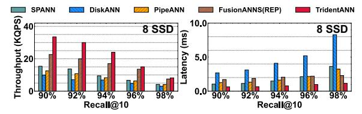
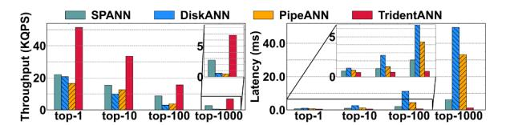

# *B. Overall Evaluation*

First, we compare the peak throughput and latency, as shown in Figure 9, using billion-scale datasets as the number of SSDs varies. Recall is 90% for top-10 search as the qualification from BigANN Benchmark [14]. To measure peak throughput, we gradually increase the number of threads until the throughput saturates. Latency is measured under single-threaded query launching as [40, 69]. We include both FusionANNS' original performance in the paper (i.e., FusionANNS (REF)) and the optimistic reproduction (i.e., FusionANNS (REP)).

Throughput. FusionANNS, DiskANN and PipeANN have low I/O bandwidth consumption, leading to higher QPS than that of clustering-based SPANN and our TRIDENTANN when only a single SSD is equipped. However, with more SSDs, SPANN and TRIDENTANN enable substantial performance gains. Notably, with 8 SSDs, TRIDENTANN performs 1.7- 1.9× QPS of FusionANNS (with high-end GPUs), which achieves the best single-drive performance benefiting from its minimal bandwidth consumption but has no improvements with more SSDs. Moreover, using 8 SSDs, TRIDENTANN

(a) *Performance-recall comparisons with 1 NVMe SSD.*

(b) *Performance-recall comparisons with 8 NVMe SSDs.*

Fig. 10: *Peak throughput and single-threaded latency with 1 SSD and 8 SSDs, using SIFT1B, under different Recall@10.*

achieves ∼1.8-3.4× QPS of others. It indicates that scaling bandwidth with more low-cost SSDs to improve performance is feasible, and our design can leverage this effectively.

Latency. Owing to GPU acceleration and rapid nearestclusters location from separating noise from clusters, TRI-DENTANN achieves the lowest latency under all SSD configurations. It performs only 50-70% latency of latency-oriented SPANN and PipeANN. Compared to DiskANN and Fusion-ANNS (both reference and reproduction), our latency is even lower to 21-38% of theirs.

Second, we report throughput–recall and latency-recall trends at varying recall of 90-98%, as shown in Figure 10. Evaluations are conducted with 1 SSD and 8 NVMe SSDs, representing a bandwidth-limited setting and our bandwidthcentric scaling behavior when increasing the number of SSDs, respectively. Note that at high recall (e.g., 98%), the reproduction of FusionANNS is expected to overestimate significantly its practical performance because GPU-side PQ computations are removed; meanwhile, the workload intensity can increase sharply as the recall target rises.

Results show that under bandwidth limitation, neither SPANN nor our TRIDENTANN exhibits a throughput advantage, but after scaling I/O bandwidth with more SSDs, TRIDENTANN maintains clear throughput advantages (∼1.6– 3.4× over open-source systems). And using only a 28-core CPU, TRIDENTANN even surpasses FusionANNS's theoretical best performance on 56-core CPUs. Moreover, benefiting from our hybrid index, GPU acceleration, and task overlaps, TRIDENTANN consistently achieves the lowest latency and can maintain ∼1–2 ms latency even at 98% recall.

Third, at various top-*k*, we report throughput and latency under 90% recall, using SIFT1B. Results are shown in Figure 11. As the k value for nearest neighbors increases, our TRIDENTANN exhibits greater performance advantages over other systems. For small k values (e.g., top-1), our throughput and latency are 2.3-3.1× and 49-73% that of others. Especially, when the search expands to the nearest 1,000 neighbors,

Fig. 11: *Peak throughput and single-threaded latency using SIFT1B, under different top-k and Recall=90%.*

Fig. 12: *P99.9 latency at peak throughput of varying number of SSDs, using SIFT1B, under Recall@10=90%.*

our throughput exceeds graph-based systems by more than ∼14×. This advantage also holds for latency: TRIDENTANN consistently maintains ∼1-2 ms, whereas graph-based systems can reach up to ∼50 ms. Since FusionANNS did not report performance under varying top-k, we omit it here.

Additionally, we report P99.9 tail latency ranges of multiple experiments, when each system reaches its peak throughput as shown in Figure 12. TRIDENTANN achieves the lowest tail latency when the system runs at saturation. As the number of SSDs increases, all systems show lower tail latency. PipeANN exhibits large fluctuations in tail latency. This behavior arises because PipeANN parallelizes the intra-query search across multiple threads. When the system is under saturation, the increased thread switching can lead to long-tail latency.

# *B. Overall Evaluation*

First, we compare the peak throughput and latency, as shown in Figure 9, using billion-scale datasets as the number of SSDs varies. Recall is 90% for top-10 search as the qualification from BigANN Benchmark [14]. To measure peak throughput, we gradually increase the number of threads until the throughput saturates. Latency is measured under single-threaded query launching as [40, 69]. We include both FusionANNS' original performance in the paper (i.e., FusionANNS (REF)) and the optimistic reproduction (i.e., FusionANNS (REP)).

Throughput. FusionANNS, DiskANN and PipeANN have low I/O bandwidth consumption, leading to higher QPS than that of clustering-based SPANN and our TRIDENTANN when only a single SSD is equipped. However, with more SSDs, SPANN and TRIDENTANN enable substantial performance gains. Notably, with 8 SSDs, TRIDENTANN performs 1.7- 1.9× QPS of FusionANNS (with high-end GPUs), which achieves the best single-drive performance benefiting from its minimal bandwidth consumption but has no improvements with more SSDs. Moreover, using 8 SSDs, TRIDENTANN

(a) *Performance-recall comparisons with 1 NVMe SSD.*

(b) *Performance-recall comparisons with 8 NVMe SSDs.*

Fig. 10: *Peak throughput and single-threaded latency with 1 SSD and 8 SSDs, using SIFT1B, under different Recall@10.*

achieves ∼1.8-3.4× QPS of others. It indicates that scaling bandwidth with more low-cost SSDs to improve performance is feasible, and our design can leverage this effectively.

Latency. Owing to GPU acceleration and rapid nearestclusters location from separating noise from clusters, TRI-DENTANN achieves the lowest latency under all SSD configurations. It performs only 50-70% latency of latency-oriented SPANN and PipeANN. Compared to DiskANN and Fusion-ANNS (both reference and reproduction), our latency is even lower to 21-38% of theirs.

Second, we report throughput–recall and latency-recall trends at varying recall of 90-98%, as shown in Figure 10. Evaluations are conducted with 1 SSD and 8 NVMe SSDs, representing a bandwidth-limited setting and our bandwidthcentric scaling behavior when increasing the number of SSDs, respectively. Note that at high recall (e.g., 98%), the reproduction of FusionANNS is expected to overestimate significantly its practical performance because GPU-side PQ computations are removed; meanwhile, the workload intensity can increase sharply as the recall target rises.

Results show that under bandwidth limitation, neither SPANN nor our TRIDENTANN exhibits a throughput advantage, but after scaling I/O bandwidth with more SSDs, TRIDENTANN maintains clear throughput advantages (∼1.6– 3.4× over open-source systems). And using only a 28-core CPU, TRIDENTANN even surpasses FusionANNS's theoretical best performance on 56-core CPUs. Moreover, benefiting from our hybrid index, GPU acceleration, and task overlaps, TRIDENTANN consistently achieves the lowest latency and can maintain ∼1–2 ms latency even at 98% recall.

Third, at various top-*k*, we report throughput and latency under 90% recall, using SIFT1B. Results are shown in Figure 11. As the k value for nearest neighbors increases, our TRIDENTANN exhibits greater performance advantages over other systems. For small k values (e.g., top-1), our throughput and latency are 2.3-3.1× and 49-73% that of others. Especially, when the search expands to the nearest 1,000 neighbors,

Fig. 11: *Peak throughput and single-threaded latency using SIFT1B, under different top-k and Recall=90%.*

Fig. 12: *P99.9 latency at peak throughput of varying number of SSDs, using SIFT1B, under Recall@10=90%.*

our throughput exceeds graph-based systems by more than ∼14×. This advantage also holds for latency: TRIDENTANN consistently maintains ∼1-2 ms, whereas graph-based systems can reach up to ∼50 ms. Since FusionANNS did not report performance under varying top-k, we omit it here.

Additionally, we report P99.9 tail latency ranges of multiple experiments, when each system reaches its peak throughput as shown in Figure 12. TRIDENTANN achieves the lowest tail latency when the system runs at saturation. As the number of SSDs increases, all systems show lower tail latency. PipeANN exhibits large fluctuations in tail latency. This behavior arises because PipeANN parallelizes the intra-query search across multiple threads. When the system is under saturation, the increased thread switching can lead to long-tail latency.

