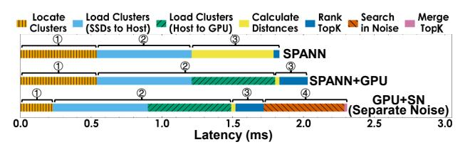

# *C. Bandwidth-Centric Scaling as Architectural Principle*

Based on the above cannikin law, we advocate bandwidthcentric scaling as an architectural principle. Since NVMe SSDs can scale external I/O bandwidth at low cost, a natural strategy is to expand throughput by scaling SSD arrays. However, this is effective only if the *compute-side bandwidth* (especially host memory bandwidth) does not become the new bottleneck that throttles SSD utilization.

Revisiting SPANN's scaling. In Table I, SPANN exhibits near-linear scaling from 1 SSD to 8 SSDs (about 8–9× throughput gain), but increasing from 8 to 16 SSDs yields only 10% additional throughput. Meanwhile, at 8 SSDs, the I/O bandwidth utilization is only 35–40% (around 21 GB/s). While only adding more cores is also useless without higher host bandwidth. This indicates that the limiting factor shifts from I/O bandwidth of SSDs to host-side computational bandwidth.

The bandwidth bill for SPANN. Under SPANN's clustered search, the host must (i) search centroids to locate relevant clusters, (ii) load the selected clusters from SSD into memory, and (iii) scan these clusters for distance computation and final ranking—all of which consume host memory bandwidth. For SIFT1B top-10 search at 90% recall, each 1K QPS roughly costs 2–3 GB/s memory bandwidth for centroid search, plus about 1–2 GB/s to write clusters from SSD into memory, and another 1–2 GB/s to scan clusters for distance and ranking. Overall, this amounts to 4–7 GB/s host memory bandwidth per 1K QPS, but only 1–2 GB/s SSD bandwidth, implying usable SSD bandwidth is bounded at about 25–30% of available memory bandwidth. With 90–100 GB/s sustained DDR4 bandwidth (8 channels) on our platform, the SSD utilization ceiling is thus 20–30 GB/s, consistent with the observed 21 GB/s.

Architectural insights. The bandwidth-centric scaling requires *co-design*: using low-cost NVMe arrays to scale exter-

Fig. 2: *Overhead breakdown under peak throughput.*

nal bandwidth, while preventing compute (e.g., host memory in SPANN) bandwidth from limiting SSDs utilization. In TRI-DENTANN, low-end GPUs (despite limited device memory) can provide abundant and inexpensive compute bandwidth (e.g., an A2000-6GB provides >200 GB/s), as practical complements to CPUs and multi-NVMe SSDs for scaling.

# *C. Bandwidth-Centric Scaling as Architectural Principle*

Based on the above cannikin law, we advocate bandwidthcentric scaling as an architectural principle. Since NVMe SSDs can scale external I/O bandwidth at low cost, a natural strategy is to expand throughput by scaling SSD arrays. However, this is effective only if the *compute-side bandwidth* (especially host memory bandwidth) does not become the new bottleneck that throttles SSD utilization.

Revisiting SPANN's scaling. In Table I, SPANN exhibits near-linear scaling from 1 SSD to 8 SSDs (about 8–9× throughput gain), but increasing from 8 to 16 SSDs yields only 10% additional throughput. Meanwhile, at 8 SSDs, the I/O bandwidth utilization is only 35–40% (around 21 GB/s). While only adding more cores is also useless without higher host bandwidth. This indicates that the limiting factor shifts from I/O bandwidth of SSDs to host-side computational bandwidth.

The bandwidth bill for SPANN. Under SPANN's clustered search, the host must (i) search centroids to locate relevant clusters, (ii) load the selected clusters from SSD into memory, and (iii) scan these clusters for distance computation and final ranking—all of which consume host memory bandwidth. For SIFT1B top-10 search at 90% recall, each 1K QPS roughly costs 2–3 GB/s memory bandwidth for centroid search, plus about 1–2 GB/s to write clusters from SSD into memory, and another 1–2 GB/s to scan clusters for distance and ranking. Overall, this amounts to 4–7 GB/s host memory bandwidth per 1K QPS, but only 1–2 GB/s SSD bandwidth, implying usable SSD bandwidth is bounded at about 25–30% of available memory bandwidth. With 90–100 GB/s sustained DDR4 bandwidth (8 channels) on our platform, the SSD utilization ceiling is thus 20–30 GB/s, consistent with the observed 21 GB/s.

Architectural insights. The bandwidth-centric scaling requires *co-design*: using low-cost NVMe arrays to scale exter-

Fig. 2: *Overhead breakdown under peak throughput.*

nal bandwidth, while preventing compute (e.g., host memory in SPANN) bandwidth from limiting SSDs utilization. In TRI-DENTANN, low-end GPUs (despite limited device memory) can provide abundant and inexpensive compute bandwidth (e.g., an A2000-6GB provides >200 GB/s), as practical complements to CPUs and multi-NVMe SSDs for scaling.

