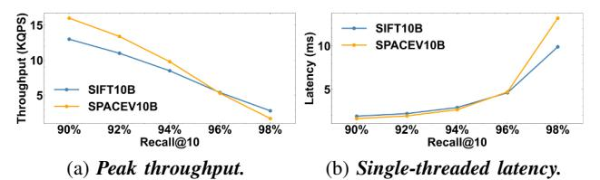

# *D. Ablation Analysis and Sensitivity Study*

Sensitivity study in Figure 14. We analyze the influence of parameters involved in constructing index, including list size

Fig. 13: *Latency vs Throughput with various numbers of NVMe SSDs, under Recall@10=90%. Throughputs are changed by adding search threads on the 28-core CPU of a single socket. Higher throughput with lower latency is better.*

Fig. 14: *Sensitivity analysis of parameters in our hybrid index. "L" and "R" correspond to the left and right y-axes.*

Fig. 15: *Ablation analysis of throughput and bandwidth.*

r, candidate count m, and noise threshold n. First, as leftmost in Figure 14 as an excessively large or small list size fails in optimal performance. A large r (e.g., 512) incurs substantial waste in both I/O and computation, whereas a small r (e.g., 32) results in small I/O granularity with low-bandwidth utilization and generates a large amount of clusters, thereby increasing the overhead of locating nearest clusters.

Second, as 2nd from left in Figure 14, increasing m enlarges the pool of vectors available for list padding, which in turn enhances throughput. Nevertheless, the benefit saturates when m reaches approximately 3 and 4 in two datasets.

Third, n determines the proportion of noise isolated from

the dataset. Typically, we increase n from 0 to ∼40% of r until yielding ∼10% proportion, which can be determined through preliminary testing on 1% of the entire dataset. As 2nd from right in Figure 14, while a higher ratio can improve throughput, it also increases memory usage, as noise is indexed using an in-memory BKT. The rightmost in Figure 14 shows that, compared to 160M clusters for 1B vectors in SPANN, TRIDENTANN locates nearest clusters only in ∼15-40% total cluster counts, shortening its head latency to ∼40-60%.

Ablation analysis in Figure 15. In Figure 15a, we set SPANN as baseline. *+GPU* means using GPUs for calculating distances and ranking in SPANN. *+Separate Noise* means using our hybrid index in addition to *+GPU*. SSD-Host-GPU I/O path and ranking of low-end GPUs make SPANN+GPU show a ∼9% throughput decrease, and serial process of two search paths (noise and clusters) makes it even worse with an extra 10-13% decrease. *(w/o SN)* means not using hybrid index. With NVIDIA GDS [17], the host memory is bypassed during loading clusters to GPUs, but its overhead from kernel makes only a ∼5% improvement. Compared to it, our customized direct I/O performs a ∼30% improvement. Then, after moving ranking to CPU, avoiding limitations of low-end GPUs' bandwidth, the improvement can be up to 54-74%. At last, we make the search processes of noise and clusters in parallel, achieving 2.17-2.43× throughput.

In Figure 15b, based on the 8 NVMe SSDs and 2 A2000- 6GB GPUs, we show the bandwidth utilization of graph-based DiskANN, PipeANN, clustering-based SPANN and ours. Due

Fig. 16: Overall performance using 10B-scale datasets.

Fig. 17: Cost and power efficiency (QPS/\$ and QPS/watt).

to the multi-hop search pattern, graph-based methods are mainly constrained by the I/O latency but not the aggregate bandwidth, hence cannot utilize the high bandwidth of SSD arrays. Compared to SPANN, our designs avoid CPU-only and clustering-only bottlenecks, achieving a higher I/O utilization.

## E. Ultra-large Scale Evaluation

We redundantly copy SIFT1B and SPACEV1B  $10\times$ , as [67], to serve as datasets with the 10B scale. Our system can scale to 10B vectors while maintaining efficiency, as shown in Figure 16. When recall@10 is 90%, it delivers over 15 KQPS with  $\sim$ 2 ms single-thread latency, and still sustains  $\sim$ 2-3 KQPS at 98% recall with latency around 10–12 ms. We limit the noise threshold to meet 256 GB DRAM usage. None of other ANNS system provides open-source 10B-scale construction solution and search implementation so we only report our own results instead of presenting comparisons.

# *D. Ablation Analysis and Sensitivity Study*

Sensitivity study in Figure 14. We analyze the influence of parameters involved in constructing index, including list size

Fig. 13: *Latency vs Throughput with various numbers of NVMe SSDs, under Recall@10=90%. Throughputs are changed by adding search threads on the 28-core CPU of a single socket. Higher throughput with lower latency is better.*

Fig. 14: *Sensitivity analysis of parameters in our hybrid index. "L" and "R" correspond to the left and right y-axes.*

Fig. 15: *Ablation analysis of throughput and bandwidth.*

r, candidate count m, and noise threshold n. First, as leftmost in Figure 14 as an excessively large or small list size fails in optimal performance. A large r (e.g., 512) incurs substantial waste in both I/O and computation, whereas a small r (e.g., 32) results in small I/O granularity with low-bandwidth utilization and generates a large amount of clusters, thereby increasing the overhead of locating nearest clusters.

Second, as 2nd from left in Figure 14, increasing m enlarges the pool of vectors available for list padding, which in turn enhances throughput. Nevertheless, the benefit saturates when m reaches approximately 3 and 4 in two datasets.

Third, n determines the proportion of noise isolated from

the dataset. Typically, we increase n from 0 to ∼40% of r until yielding ∼10% proportion, which can be determined through preliminary testing on 1% of the entire dataset. As 2nd from right in Figure 14, while a higher ratio can improve throughput, it also increases memory usage, as noise is indexed using an in-memory BKT. The rightmost in Figure 14 shows that, compared to 160M clusters for 1B vectors in SPANN, TRIDENTANN locates nearest clusters only in ∼15-40% total cluster counts, shortening its head latency to ∼40-60%.

Ablation analysis in Figure 15. In Figure 15a, we set SPANN as baseline. *+GPU* means using GPUs for calculating distances and ranking in SPANN. *+Separate Noise* means using our hybrid index in addition to *+GPU*. SSD-Host-GPU I/O path and ranking of low-end GPUs make SPANN+GPU show a ∼9% throughput decrease, and serial process of two search paths (noise and clusters) makes it even worse with an extra 10-13% decrease. *(w/o SN)* means not using hybrid index. With NVIDIA GDS [17], the host memory is bypassed during loading clusters to GPUs, but its overhead from kernel makes only a ∼5% improvement. Compared to it, our customized direct I/O performs a ∼30% improvement. Then, after moving ranking to CPU, avoiding limitations of low-end GPUs' bandwidth, the improvement can be up to 54-74%. At last, we make the search processes of noise and clusters in parallel, achieving 2.17-2.43× throughput.

In Figure 15b, based on the 8 NVMe SSDs and 2 A2000- 6GB GPUs, we show the bandwidth utilization of graph-based DiskANN, PipeANN, clustering-based SPANN and ours. Due

Fig. 16: Overall performance using 10B-scale datasets.

Fig. 17: Cost and power efficiency (QPS/\$ and QPS/watt).

to the multi-hop search pattern, graph-based methods are mainly constrained by the I/O latency but not the aggregate bandwidth, hence cannot utilize the high bandwidth of SSD arrays. Compared to SPANN, our designs avoid CPU-only and clustering-only bottlenecks, achieving a higher I/O utilization.

## E. Ultra-large Scale Evaluation

We redundantly copy SIFT1B and SPACEV1B  $10\times$ , as [67], to serve as datasets with the 10B scale. Our system can scale to 10B vectors while maintaining efficiency, as shown in Figure 16. When recall@10 is 90%, it delivers over 15 KQPS with  $\sim$ 2 ms single-thread latency, and still sustains  $\sim$ 2-3 KQPS at 98% recall with latency around 10–12 ms. We limit the noise threshold to meet 256 GB DRAM usage. None of other ANNS system provides open-source 10B-scale construction solution and search implementation so we only report our own results instead of presenting comparisons.

