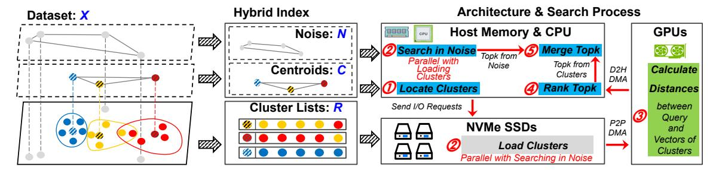

# *D. Issues in Straightforward Integration*

While a combination of low-end GPUs, CPUs, and NVMe SSDs seemingly provides both high performance and cost effectiveness, the next question is how to allocate tasks in ANNS to these resources. We initially attempt to simply integrate GPU-based ANNS acceleration to SPANN with multiple SSDs installed, which works as follows.

First, upon receiving a top-k search query, the CPU locates multiple nearest clusters to the query by searching the inmemory graph index of centroids. Then, we load the raw vectors of these clusters from NVMe SSDs to the host memory, and further transfer them to GPUs. Finally, the GPUs calculate distances between the query vector and the raw vectors, rank, and return the top-k results.

However, this strategy does not work well in practice. Ironically, this setup can even lead to worse performance than the original SPANN. Figure 2 presents the overhead breakdown of peak throughput with the platform of Section VIII. It is tested for top-10 search under 90% recall as the BigANN benchmark [14], using SIFT1B. We analyze the overhead introduced by this integration and identify three key issues.

Issue 1: Noises incur high latency to locate nearest clusters. Latency of locating the nearest clusters (① of SPANN in Figure 2) in original SPANN accounts for up to ∼30- 40% of the overall time. This is because SPANN generates an excessive amount of centroids. For example, the SIFT1B dataset contains 1 billion vectors, and SPANN generates ∼160 million centroids. Among these, many cluster lists are constructed on noise vectors (i.e., vectors belong to lowdensity clusters and are distant from other high-density ones). Ideally, in a hierarchically balanced clustering—each cluster contains ∼100 vectors<sup>3</sup>—it should yield only ∼10 million centroids for 1 billion vectors. Locating nearest clusters in both dense clusters and low-density noise parts significantly leads to unnecessary search space, increases latency of ①, consumes more host bandwidth, and incurs lower QPS.

Issue 2: Adding GPUs incurs extra data movement. SPANN+GPU in Figure 2 shows that the double data move-

<sup>3</sup>For example, sizes of clusters are set as 12 KB for byte vectors in SPANN, for 128-dim uint8 vectors in SIFT1B, each cluster list contains 96 vectors.



Fig. 3: Design overview of TRIDENTANN.

ment (i.e., from SSDs to host memory and then to GPUs) introduces additional overhead (i.e., the green part in ②). Compared to FusionANNS, this is exacerbated in our architecture since we directly search raw vectors on SSDs and need to frequently load them to GPU for processing. As a result, the I/O cost is doubled: the bandwidth consumed when loading clusters from SSDs into host memory remains unavoidable, and the subsequent host-to-GPU copy incurs an additional host memory bandwidth cost that is approximately equal to the original CPU-side cluster scanning. Consequently, the effective end-to-end I/O bandwidth utilization remains only  $\sim \! 30 - \! 40\%$ , despite introducing GPUs in addition.

Issue 3: Suboptimal task assignment for GPUs and serial search pipeline with additional overhead. Referring to GPU acceleration of Faiss, GPUs need to calculate distances, and then rank top-k results. The  $\odot$  of GPU in Figure 2 shows that the distance calculation is greatly accelerated by GPUs, but the subsequent ranking of GPUs is branch-heavy and bandwidthbound, which is suboptimal for low-end GPUs with limited device memory bandwidth. In addition, even if we separate noise to reduce the overhead of locating nearest clusters (i.e., Issue 1 addressed, shortened orange part ① in GPU+SN), it is still necessary to search top-k among noise vectors and merge the results with the top-k from clusters. Otherwise, the potential top-k results from noise vectors would always be excluded. This, in return, introduces a new stage 4, Search in *Noise* and *Merge TopK*, which leads to a longer search pipeline with additional overhead.

## IV. DESIGN OVERVIEW

Figure 3 illustrates TRIDENTANN, our ANNS system that efficiently integrates GPU, CPU, and NVMe SSDs to accelerate the search process with high cost effectiveness. There are three main techniques, including a hybrid index separately indexing noise and dense clusters, a customized GPU-SSD P2P architecture to fully utilize I/O bandwidth, and a redesigned search pipeline to maximize parallel collaboration across CPUs, SSDs, and GPUs.

Indexing clusters and noise separately with the hybrid index (Section V). We propose a hybrid index. Specifically, we build three internal parts from the dataset (X): a graph index for centroids to locate nearest clusters (C), a graph index for noise vectors (N), and cluster lists (R) of dense clusters with redundant placement [32]. The benefits of this design are twofold: (1) it reduces the number of clusters by

separating noise vectors and clusters, which speeds up the process of locating relevant clusters; (2) it decouples the search processes of noise vectors and dense clusters to enable parallel processing of the two parts.

Direct data transfer between GPUs and SSDs (Section VI). TRIDENTANN employs a customized GPU-SSD P2P architecture to accelerate the SSD-GPU data transfer for GPU distance calculation, and avoids host bandwidth consumption from clusters' I/O. The key idea is to maximize I/O efficiency when loading clusters from SSDs to GPUs. On the hardware side, we organize multiple SSDs and a GPU as a workgroup to improve inter-device communication. On the software side, we design a lightweight I/O stack that enables user-space applications to directly issue commands to the NVMe driver, reducing software overhead.

Pipelined and parallel search across GPUs, CPUs, and SSDs (Section VII). We rethink the allocation of tasks in ANNS and build a pipeline that leverages the strengths of both GPUs and CPUs. We keep the distance calculation on GPUs for their superior performance in parallel processing. For the memory-bound GPU ranking, we offload it to the CPU to avoid suffering from low-end GPUs' limited-bandwidth memory. In addition, we overlap the searches in clusters and noise. While SSDs load clusters to GPUs, the CPU searches in the in-memory noise graph in parallel. This avoids additional overhead from decoupled top-k searches, while still preserving fast nearest-cluster locating through our hybrid index.

## V. HYBRID INDEX

To avoid creating an excessive amount of (small) clusters, we now introduce hybrid indexing. The key idea is to separate the raw dataset (X) into noise (N) and non-noise vectors.

Note that building such a process is, however, non-trivial. First, we cannot rely on existing methods like DBSCAN [35] for its excessively high time complexity and demanding hardware requirements (thousands of CPUs or GPUs even for vectors of dimensionality <10 at million-scale) [34, 37, 58, 63]. Second, building clusters can also lead to imbalanced sizes, where some clusters have far more members (i.e., vectors) than others. This can lead to inefficient search performance since large clusters are more likely to be queried and frequently loading them can be costly. Third, another time-consuming procedure in building clusters is handling the boundary issue, where vectors that are close to multiple clusters can be missed during search if only assigned to just one cluster. But, blindly

## **Algorithm 1** Building clusters with members and candidates

```
Input: dataset X, candidate count m, list size r
Output: initial centroids C_{init}, member sets I, candidate sets E
 1: C_{init}, I \leftarrow H\text{-}K(sampling(X), \lceil \frac{sizeof(sampling(X))}{3} \rceil)
     // generate \frac{sizeof(sampling(X))}{r} centroids (C_{init}) with hierarchical
     \overline{KMeans} on vectors \overline{sampling}(X).
2: for c \in C_{init} do
3: I[c] \leftarrow \emptyset, E[c] \leftarrow \emptyset
4: end for
5: for x \in X do
        [c_1, c_2 \dots c_m] \leftarrow KNN(x, C_{init}, m)
6:
        // get top-m nearest vectors to x from C_{init}.
        I[c_1] \leftarrow I[c_1] \cup \{x\}
        for c \in \{c_2, ..., c_m\} do
            E[c] \leftarrow E[c] \cup \{x\}
9:
10.
        end for
11: end for
12: return C_{init}, I, E
```

adding vectors to all neighboring clusters also leads to repeated loading from SSDs, which hampers performance. Therefore, previous works such as SPANN have taken a time-consuming RNG checking [70] process to handle boundary vectors.

## A. Step-1: Building Clusters

To avoid the above issues, we take a three-step process in the hybrid index and choose to build the initial clusters over the entire raw dataset with members and candidates. The detailed procedures are shown in Algorithm 1. First, to expedite the clustering process, we sample a subset of the dataset (optional), and use it to generate the initial centroids via H-K (hierarchical KMeans) (line 1). Second, we go through each vector from the raw dataset (X) and assign it as a member to the nearest centroid (lines 5-7). Together, an initial centroid and its members will form the initial cluster. To efficiently address the boundary issue, we also assign each vector to its top 2 to m (e.g., m=3 for SIFT1B, see Subsection VIII-D for more details) nearest initial centroids as candidates to the corresponding clusters (lines 8-10).

# *D. Issues in Straightforward Integration*

While a combination of low-end GPUs, CPUs, and NVMe SSDs seemingly provides both high performance and cost effectiveness, the next question is how to allocate tasks in ANNS to these resources. We initially attempt to simply integrate GPU-based ANNS acceleration to SPANN with multiple SSDs installed, which works as follows.

First, upon receiving a top-k search query, the CPU locates multiple nearest clusters to the query by searching the inmemory graph index of centroids. Then, we load the raw vectors of these clusters from NVMe SSDs to the host memory, and further transfer them to GPUs. Finally, the GPUs calculate distances between the query vector and the raw vectors, rank, and return the top-k results.

However, this strategy does not work well in practice. Ironically, this setup can even lead to worse performance than the original SPANN. Figure 2 presents the overhead breakdown of peak throughput with the platform of Section VIII. It is tested for top-10 search under 90% recall as the BigANN benchmark [14], using SIFT1B. We analyze the overhead introduced by this integration and identify three key issues.

Issue 1: Noises incur high latency to locate nearest clusters. Latency of locating the nearest clusters (① of SPANN in Figure 2) in original SPANN accounts for up to ∼30- 40% of the overall time. This is because SPANN generates an excessive amount of centroids. For example, the SIFT1B dataset contains 1 billion vectors, and SPANN generates ∼160 million centroids. Among these, many cluster lists are constructed on noise vectors (i.e., vectors belong to lowdensity clusters and are distant from other high-density ones). Ideally, in a hierarchically balanced clustering—each cluster contains ∼100 vectors<sup>3</sup>—it should yield only ∼10 million centroids for 1 billion vectors. Locating nearest clusters in both dense clusters and low-density noise parts significantly leads to unnecessary search space, increases latency of ①, consumes more host bandwidth, and incurs lower QPS.

Issue 2: Adding GPUs incurs extra data movement. SPANN+GPU in Figure 2 shows that the double data move-

<sup>3</sup>For example, sizes of clusters are set as 12 KB for byte vectors in SPANN, for 128-dim uint8 vectors in SIFT1B, each cluster list contains 96 vectors.


Fig. 3: Design overview of TRIDENTANN.

ment (i.e., from SSDs to host memory and then to GPUs) introduces additional overhead (i.e., the green part in ②). Compared to FusionANNS, this is exacerbated in our architecture since we directly search raw vectors on SSDs and need to frequently load them to GPU for processing. As a result, the I/O cost is doubled: the bandwidth consumed when loading clusters from SSDs into host memory remains unavoidable, and the subsequent host-to-GPU copy incurs an additional host memory bandwidth cost that is approximately equal to the original CPU-side cluster scanning. Consequently, the effective end-to-end I/O bandwidth utilization remains only  $\sim \! 30 - \! 40\%$ , despite introducing GPUs in addition.

Issue 3: Suboptimal task assignment for GPUs and serial search pipeline with additional overhead. Referring to GPU acceleration of Faiss, GPUs need to calculate distances, and then rank top-k results. The  $\odot$  of GPU in Figure 2 shows that the distance calculation is greatly accelerated by GPUs, but the subsequent ranking of GPUs is branch-heavy and bandwidthbound, which is suboptimal for low-end GPUs with limited device memory bandwidth. In addition, even if we separate noise to reduce the overhead of locating nearest clusters (i.e., Issue 1 addressed, shortened orange part ① in GPU+SN), it is still necessary to search top-k among noise vectors and merge the results with the top-k from clusters. Otherwise, the potential top-k results from noise vectors would always be excluded. This, in return, introduces a new stage 4, Search in *Noise* and *Merge TopK*, which leads to a longer search pipeline with additional overhead.

## IV. DESIGN OVERVIEW

Figure 3 illustrates TRIDENTANN, our ANNS system that efficiently integrates GPU, CPU, and NVMe SSDs to accelerate the search process with high cost effectiveness. There are three main techniques, including a hybrid index separately indexing noise and dense clusters, a customized GPU-SSD P2P architecture to fully utilize I/O bandwidth, and a redesigned search pipeline to maximize parallel collaboration across CPUs, SSDs, and GPUs.

Indexing clusters and noise separately with the hybrid index (Section V). We propose a hybrid index. Specifically, we build three internal parts from the dataset (X): a graph index for centroids to locate nearest clusters (C), a graph index for noise vectors (N), and cluster lists (R) of dense clusters with redundant placement [32]. The benefits of this design are twofold: (1) it reduces the number of clusters by

separating noise vectors and clusters, which speeds up the process of locating relevant clusters; (2) it decouples the search processes of noise vectors and dense clusters to enable parallel processing of the two parts.

Direct data transfer between GPUs and SSDs (Section VI). TRIDENTANN employs a customized GPU-SSD P2P architecture to accelerate the SSD-GPU data transfer for GPU distance calculation, and avoids host bandwidth consumption from clusters' I/O. The key idea is to maximize I/O efficiency when loading clusters from SSDs to GPUs. On the hardware side, we organize multiple SSDs and a GPU as a workgroup to improve inter-device communication. On the software side, we design a lightweight I/O stack that enables user-space applications to directly issue commands to the NVMe driver, reducing software overhead.

Pipelined and parallel search across GPUs, CPUs, and SSDs (Section VII). We rethink the allocation of tasks in ANNS and build a pipeline that leverages the strengths of both GPUs and CPUs. We keep the distance calculation on GPUs for their superior performance in parallel processing. For the memory-bound GPU ranking, we offload it to the CPU to avoid suffering from low-end GPUs' limited-bandwidth memory. In addition, we overlap the searches in clusters and noise. While SSDs load clusters to GPUs, the CPU searches in the in-memory noise graph in parallel. This avoids additional overhead from decoupled top-k searches, while still preserving fast nearest-cluster locating through our hybrid index.

## V. HYBRID INDEX

To avoid creating an excessive amount of (small) clusters, we now introduce hybrid indexing. The key idea is to separate the raw dataset (X) into noise (N) and non-noise vectors.

Note that building such a process is, however, non-trivial. First, we cannot rely on existing methods like DBSCAN [35] for its excessively high time complexity and demanding hardware requirements (thousands of CPUs or GPUs even for vectors of dimensionality <10 at million-scale) [34, 37, 58, 63]. Second, building clusters can also lead to imbalanced sizes, where some clusters have far more members (i.e., vectors) than others. This can lead to inefficient search performance since large clusters are more likely to be queried and frequently loading them can be costly. Third, another time-consuming procedure in building clusters is handling the boundary issue, where vectors that are close to multiple clusters can be missed during search if only assigned to just one cluster. But, blindly

## **Algorithm 1** Building clusters with members and candidates

```
Input: dataset X, candidate count m, list size r
Output: initial centroids C_{init}, member sets I, candidate sets E
 1: C_{init}, I \leftarrow H\text{-}K(sampling(X), \lceil \frac{sizeof(sampling(X))}{3} \rceil)
     // generate \frac{sizeof(sampling(X))}{r} centroids (C_{init}) with hierarchical
     \overline{KMeans} on vectors \overline{sampling}(X).
2: for c \in C_{init} do
3: I[c] \leftarrow \emptyset, E[c] \leftarrow \emptyset
4: end for
5: for x \in X do
        [c_1, c_2 \dots c_m] \leftarrow KNN(x, C_{init}, m)
6:
        // get top-m nearest vectors to x from C_{init}.
        I[c_1] \leftarrow I[c_1] \cup \{x\}
        for c \in \{c_2, ..., c_m\} do
            E[c] \leftarrow E[c] \cup \{x\}
9:
10.
        end for
11: end for
12: return C_{init}, I, E
```

adding vectors to all neighboring clusters also leads to repeated loading from SSDs, which hampers performance. Therefore, previous works such as SPANN have taken a time-consuming RNG checking [70] process to handle boundary vectors.

## A. Step-1: Building Clusters

To avoid the above issues, we take a three-step process in the hybrid index and choose to build the initial clusters over the entire raw dataset with members and candidates. The detailed procedures are shown in Algorithm 1. First, to expedite the clustering process, we sample a subset of the dataset (optional), and use it to generate the initial centroids via H-K (hierarchical KMeans) (line 1). Second, we go through each vector from the raw dataset (X) and assign it as a member to the nearest centroid (lines 5-7). Together, an initial centroid and its members will form the initial cluster. To efficiently address the boundary issue, we also assign each vector to its top 2 to m (e.g., m=3 for SIFT1B, see Subsection VIII-D for more details) nearest initial centroids as candidates to the corresponding clusters (lines 8-10).

