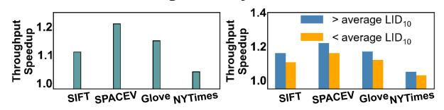

# F. Effectiveness of Cost, Power, and Storage

At last, we compare the cost effectiveness in terms of QPS per dollar (total price of machines) and QPS per watt under optimal hardware configurations and peak loads. Moreover, we also report storage costs from index footprints on SIFT1B, including host memory, GPU memory, and NVMe SSDs. The prices and power consumption of devices are shown in Table II, and the storage cost of indexes is shown in Table III.

FusionANNS refers to specifications reported in their paper (\$8.4K) and our reproduction (\$10.3K). And its power consumptions of reference and reproduction are ~685W (2×200W for CPUs, 250W for the GPU, and 35W for SSD and platform) and 815W. SPANN is configured with 1 CPU and 8 SSDs (\$3.5K). For DiskANN and PipeANN, the configuration on SIFT1B involves 2 SSDs (\$2.9K), while on SPACEV1B they use 8 NVMe SSDs (\$3.5K). This is because, in SPACEV1B, the query distribution increases the likelihood of accessing the same pages, and more SSDs reduce I/O latency by mitigating on-die conflicts. Our TRIDENTANN is configured with 1 CPU and 8 SSDs, in addition to two GPUs

|     | Device | CPU          | NVMe SSD      | GPU                     | System Platform |  |
|-----|--------|--------------|---------------|-------------------------|-----------------|--|
| - [ | SPEC   | 28-Core [13] | 1TB Gen4 [19] | A2000 [10]   A6000 [11] | Single   Dual   |  |
| - [ | Price  | \$1.4K       | \$0.1K        | \$0.4K   \$5.0K         | \$1.3K   \$2.4K |  |
|     | Power  | 240W         | 5W            | 70W   300W              | 30W             |  |

TABLE II: Prices and energy of devices in evaluations.

|                    | SPANN       | DiskANN     | PipeANN     | FusionANNS    | Ours        |
|--------------------|-------------|-------------|-------------|---------------|-------------|
| DDR4 (6 \$/GB)     | 32 GB       | 32 GB       | 32 GB       | 64 GB         | 32 GB       |
| GPU (65-105 \$/GB) | -           | -           | -           | 32 GB         | <1 GB       |
| SSD (0.1 \$/GB)    | 0.5-1 TB    | 0.5-1 TB    | 0.5-1 TB    | 0.1-0.2 TB    | 0.2-0.4 TB  |
| Storage Cost       | \$0.2K-0.3K | \$0.2K-0.3K | \$0.2K-0.3K | \$3.3K-\$3.8K | \$0.2K-0.3K |

TABLE III: Storage costs of billion-scale indexes.

Fig. 18: Throughput ratio of with/without noise separation.

(A2000-6GB)(\$4.3K). System platforms refer to board, host memory, and power. According to recent market prices, DDR4 DRAM costs ~6\$/GB, and PCIe-4.0 SSDs take ~0.1\$/GB. For capacity of GPUs, the low-cost A2000-6GB is about \$65/GB, whereas larger-memory GPUs such as V100-32GB and A6000-48GB cost \$93/GB and \$105/GB, respectively.

Cost efficiency and power efficiency. Results of QPS/\$ and QPS/watt are shown in Figure 17. TRIDENTANN shows 1.8-3.6× QPS/\$ and 1.5-3.7× QPS/watt, compared to other systems on SIFT1B and SPACEV1B respectively. In terms of power efficiency (QPS/watt), TridentANN also achieves the highest QPS per watt on both SIFT1B and SPACEV1B, outperforming FusionANNS, DiskANN, PipeANN, and SPANN with improvements from ~20% to ~210%.

Storage cost. After reducing clusters, thus having fewer lists, TRIDENTANN uses less disk space than SPANN under the same 32 GB memory budget for SIFT1B and SPACEV1B, as shown in Table III. TRIDENTANN keeps no data resident in GPU memory and transfers only the nearest clusters to GPU during search, so its GPU memory usage stays below 1 GB and is largely scale-invariant to datasets. Hence, TRIDENTANN incurs storage costs similar to other GPU-free systems. In contrast, FusionANNS keeps all compressed vectors resident in GPU, requiring 32 GB on billion-scale datasets, and its GPU memory cost can grow more pronounced at larger scales.

# F. Effectiveness of Cost, Power, and Storage

At last, we compare the cost effectiveness in terms of QPS per dollar (total price of machines) and QPS per watt under optimal hardware configurations and peak loads. Moreover, we also report storage costs from index footprints on SIFT1B, including host memory, GPU memory, and NVMe SSDs. The prices and power consumption of devices are shown in Table II, and the storage cost of indexes is shown in Table III.

FusionANNS refers to specifications reported in their paper (\$8.4K) and our reproduction (\$10.3K). And its power consumptions of reference and reproduction are ~685W (2×200W for CPUs, 250W for the GPU, and 35W for SSD and platform) and 815W. SPANN is configured with 1 CPU and 8 SSDs (\$3.5K). For DiskANN and PipeANN, the configuration on SIFT1B involves 2 SSDs (\$2.9K), while on SPACEV1B they use 8 NVMe SSDs (\$3.5K). This is because, in SPACEV1B, the query distribution increases the likelihood of accessing the same pages, and more SSDs reduce I/O latency by mitigating on-die conflicts. Our TRIDENTANN is configured with 1 CPU and 8 SSDs, in addition to two GPUs

|     | Device | CPU          | NVMe SSD      | GPU                     | System Platform |  |
|-----|--------|--------------|---------------|-------------------------|-----------------|--|
| - [ | SPEC   | 28-Core [13] | 1TB Gen4 [19] | A2000 [10]   A6000 [11] | Single   Dual   |  |
| - [ | Price  | \$1.4K       | \$0.1K        | \$0.4K   \$5.0K         | \$1.3K   \$2.4K |  |
|     | Power  | 240W         | 5W            | 70W   300W              | 30W             |  |

TABLE II: Prices and energy of devices in evaluations.

|                    | SPANN       | DiskANN     | PipeANN     | FusionANNS    | Ours        |
|--------------------|-------------|-------------|-------------|---------------|-------------|
| DDR4 (6 \$/GB)     | 32 GB       | 32 GB       | 32 GB       | 64 GB         | 32 GB       |
| GPU (65-105 \$/GB) | -           | -           | -           | 32 GB         | <1 GB       |
| SSD (0.1 \$/GB)    | 0.5-1 TB    | 0.5-1 TB    | 0.5-1 TB    | 0.1-0.2 TB    | 0.2-0.4 TB  |
| Storage Cost       | \$0.2K-0.3K | \$0.2K-0.3K | \$0.2K-0.3K | \$3.3K-\$3.8K | \$0.2K-0.3K |

TABLE III: Storage costs of billion-scale indexes.

Fig. 18: Throughput ratio of with/without noise separation.

(A2000-6GB)(\$4.3K). System platforms refer to board, host memory, and power. According to recent market prices, DDR4 DRAM costs ~6\$/GB, and PCIe-4.0 SSDs take ~0.1\$/GB. For capacity of GPUs, the low-cost A2000-6GB is about \$65/GB, whereas larger-memory GPUs such as V100-32GB and A6000-48GB cost \$93/GB and \$105/GB, respectively.

Cost efficiency and power efficiency. Results of QPS/\$ and QPS/watt are shown in Figure 17. TRIDENTANN shows 1.8-3.6× QPS/\$ and 1.5-3.7× QPS/watt, compared to other systems on SIFT1B and SPACEV1B respectively. In terms of power efficiency (QPS/watt), TridentANN also achieves the highest QPS per watt on both SIFT1B and SPACEV1B, outperforming FusionANNS, DiskANN, PipeANN, and SPANN with improvements from ~20% to ~210%.

Storage cost. After reducing clusters, thus having fewer lists, TRIDENTANN uses less disk space than SPANN under the same 32 GB memory budget for SIFT1B and SPACEV1B, as shown in Table III. TRIDENTANN keeps no data resident in GPU memory and transfers only the nearest clusters to GPU during search, so its GPU memory usage stays below 1 GB and is largely scale-invariant to datasets. Hence, TRIDENTANN incurs storage costs similar to other GPU-free systems. In contrast, FusionANNS keeps all compressed vectors resident in GPU, requiring 32 GB on billion-scale datasets, and its GPU memory cost can grow more pronounced at larger scales.

