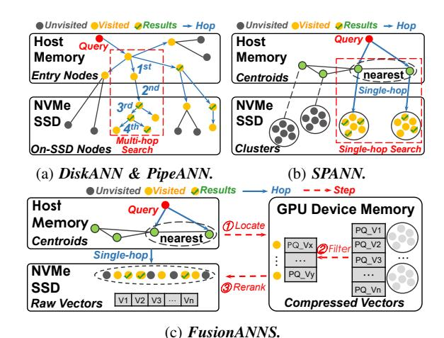

# I. INTRODUCTION

Approximate nearest neighbor search (ANNS) is foundational to a wide range of applications, including recommendation systems [33], search engines [57], and retrievalaugmented generation (RAG) in large language models [60, 74]. While the approximation alleviates the computation burden, the sheer scale of today's billion-scale vector datasets (e.g., search engines in Microsoft [16] and e-commerce in Alibaba [36]) still poses significant challenges. Existing inmemory ANNS solutions [15, 18] can require dozens of nodes to accommodate the large memory footprint of the index, leading to high CapEx and OpEx costs [23, 45, 56].

To lower costs, many solutions, such as DiskANN, SPANN, PipeANN, and FusionANNS [32, 40, 66, 69], have adopted solid-state drives (SSDs) to alleviate memory pressure, which enables billion-scale ANNS processing on a single node. Specifically, DiskANN [66] pioneers the idea of migrating the *graph index* from memory to SSD. SPANN [32] switches to the *clustering index* on the SSD, achieving low-latency (e.g., ∼1-2 ms) single-hop search with batched I/Os. Fusion-ANNS [69] uses the SSD to store the raw dataset (e.g., 128 byte vectors of SIFT1B) and leverages the high-bandwidth memory (HBM) of a GPU to host the compressed dataset (i.e., 32-byte vectors for smaller footprints). These solutions can also deliver competitive performance. As an outstanding example, FusionANNS [69], with the help of a GPU, can achieve ∼18-20K queries per second (QPS).

However, consolidating ANNS onto a single node does not necessarily lead to better cost efficiency (i.e., QPS per dollar, QPS/\$). Regarding the above example, the adoption of expensive GPUs can significantly reduce the cost effectiveness of FusionANNS, which only yields ∼2 QPS/\$. Other solutions, such as DiskANN, PipeANN, and SPANN, do not require GPUs and can achieve better cost effectiveness (e.g., ∼2.5- 4 QPS/\$). Nevertheless, if we intend to further improve their performance, blindly investing more resources often leads to diminishing returns or even backfires in QPS/\$.

Hence, we are motivated by an intuitive question: can we achieve both high performance and low cost in ANNS? Our motivational analysis suggests that building such an ANNS system requires a rethink and a redesign with more affordable hardware. Hence, we propose to *host the raw vectors in an array of NVMe SSDs, and utilize both CPUs and low-end GPUs to search for the top-k vectors*. This approach enables both cost effectiveness and high performance. First, the design alleviates the need for large GPU memory since the GPU only needs to process the retrieved clusters, which are much smaller in size (i.e., hundreds of MiBs) than the compressed dataset (e.g., tens of GiBs). Note that HBM, rather than GPU cores, usually dominates costs of GPUs [21]. For example, an NVIDIA V100-32GB GPU costs around \$3,000 [7], while two NVIDIA A2000-6GB GPUs (with the same processing power but ∼1/3 the device memory capacity) cost only around \$800 [10], less than half the price of the former. Much better cost effectiveness is therefore expected.

Second, the hardware setup of this design is also capable of delivering comparable performance to existing solutions, mainly thanks to the increasing bandwidth of NVMe SSDs. For example, existing solutions like FusionANNS [69] can achieve ∼18-20K QPS in typical real-world ANNS workloads (e.g., 90% recall at top-10 as the qualification [14] in SIFT1B). Since each query consumes around 1-2 MiB of I/O from uncompressed clusters, to achieve the same level of performance, transferring the candidate clusters to the GPU memory only needs to reach 20-40 GiB/s (i.e., throughput × I/O per query). Fortunately, today's array of 8× PCIe-4.0 SSDs can collectively offer around 56 GiB/s raw bandwidth [42, 48], sufficient to meet the requirement.

But, realizing this design is also non-trivial and can face three challenges. First, existing clustering-based ANNS index structures can suffer high latency (e.g.,∼30-40% of total time) in selecting candidate clusters due to the overwhelming number (up to 16% of the dataset size) of clusters, thereby leading to degraded QPS. Second, a straightforward GPU introduction can lead to low practical I/O utilization of SSDs (only  $\sim$ 30-50% of the available bandwidth). Third, when combining various heterogeneous hardware (GPUs, NVMe SSD arrays, and CPUs), improper task scheduling during the searching-fortop-k process can degrade the throughput by up to  $\sim$ 10-30%.

In this paper, we present TRIDENTANN, a fast and costeffective ANNS framework with CPU-GPU-SSD collaboration. It is built upon the following three key techniques.

First, we revisit the index structure of clustering-based ANNS and discover that the improper handling of *noise vectors* (i.e., constructing clusters with very few assigned vectors) can lead to excessive and redundant clusters. Hence, we propose a *hybrid index* that separates the dataset into clusters and noise vectors. This eliminates the redundant clusters constructed from the noise vectors, reducing the overall search space by up to 85% for locating the nearest clusters.

Second, we customize a GPU-SSD Peer-to-Peer (P2P) architecture tailored for ANNS workloads. Based on the GPU-SSD hardware architecture, we design the runtime I/O management during search to reduce bandwidth competition between tasks. TRIDENTANN is capable of fully utilizing the bandwidth of NVMe SSD arrays and achieves throughput scaling proportional to the available bandwidth.

Third, we carefully orchestrate tasks among various hardware. After quantitatively analyzing the performance of operators on CPUs and GPUs during search, TRIDENTANN delegates distance computations to GPUs while offloading the ranking stage to CPUs—leveraging their respective strengths (i.e., branch-intensive ranking on CPUs and parallel algebraic operations on GPUs). Meanwhile, we parallelize noise search and cluster search in pipelines, enabling tasks to overlap.

Evaluations show that, compared to other systems, TRIDENTANN achieves  $1.8\text{-}3.4\times$  throughput and reduces latency to 21-70%. Moreover, it can be deployed on commodity devices, achieving the highest cost efficiency. Specifically, combining low-cost GPUs and multiple SSDs, we can scale up throughput to  $\sim$ 7-9 QPS/\$, around 2-4× that of existing systems.

## II. BACKGROUND

In this section, we introduce two mainstream methodologies of SSD-based ANNS, namely graph-based and cluster-based.

In graph-based ANNS, vectors are constructed as nodes in a graph, and edges between nodes represent neighbor relationships. The search traverses the graph to find the nearest neighbors of a query vector. In-memory graph-based indexes [36, 52, 72] store the entire graph in the memory, enabling fast search but incurring a large memory usage. Recent SSD-based ANNS, such as DiskANN [66] and PipeANN [40], organizes the graph in a hierarchical manner across memory and SSD, keeping frequently accessed entry nodes in memory while placing the remaining nodes on SSD.

These solutions follow a two-step search process, as illustrated in Figure 1a, which first searches the in-memory part to explore the graph from entry nodes (i.e., 1st hop in Figure 1a).

Fig. 1: Billion-scale ANNS based on the NVMe SSD.

Then, the search routes to the SSD to perform the second search stage of on-SSD nodes (i.e., 2nd hop), which iteratively loads predecessor nodes into memory, computes distances, and determines the next-hop neighbors (3rd hop) until the search converges (4th hop). As a result, only a small number of nodes are loaded from the SSD into memory at each hop, leading to low I/O bandwidth usage (e.g.,  $\sim$ 0.2-0.3 MB I/O per query¹). This approach can achieve decent throughput ( $\sim$ 6.9-16.5K QPS) even with just one NVMe SSD.

In clustering-based ANNS, the vectors are grouped into clusters based on their proximity. SSD-based solutions, like SPANN [32], first locate multiple clusters nearest to the query, then load all their vectors into memory, and further identify the top-k results. This approach avoids the graph-based multi-hop search, thereby providing lower latency (within ~2 ms).

The above process can, however, suffer low throughput (only ~ 2K QPS) due to the heavy I/O bandwidth pressure ( $\sim$ 1.5 MB I/O per query). FusionANNS advances SPANN by Product Quantization (PQ) [47] and the reranking strategy [9]. Figure 1c shows that FusionANNS first stores compressed vectors in GPU device memory and leaves raw vectors on the SSD. During search, it first locates multiple nearest clusters as SPANN. Second, FusionANNS filters a wider range of candidate vectors using on-GPU compressed vectors from the identified clusters (e.g., about top-100 for a top-10 query). Third, raw vectors of these candidate clusters are loaded from SSD into memory to be reranked for obtaining topk results. Due to much less data transfer from SSD (only  $\sim$ 0.1-0.4 MB I/O per query) and the processing power of the GPU, FusionANNS achieves a higher throughput (~18K QPS) compared to graph-based systems on a single SSD.

# I. INTRODUCTION

Approximate nearest neighbor search (ANNS) is foundational to a wide range of applications, including recommendation systems [33], search engines [57], and retrievalaugmented generation (RAG) in large language models [60, 74]. While the approximation alleviates the computation burden, the sheer scale of today's billion-scale vector datasets (e.g., search engines in Microsoft [16] and e-commerce in Alibaba [36]) still poses significant challenges. Existing inmemory ANNS solutions [15, 18] can require dozens of nodes to accommodate the large memory footprint of the index, leading to high CapEx and OpEx costs [23, 45, 56].

To lower costs, many solutions, such as DiskANN, SPANN, PipeANN, and FusionANNS [32, 40, 66, 69], have adopted solid-state drives (SSDs) to alleviate memory pressure, which enables billion-scale ANNS processing on a single node. Specifically, DiskANN [66] pioneers the idea of migrating the *graph index* from memory to SSD. SPANN [32] switches to the *clustering index* on the SSD, achieving low-latency (e.g., ∼1-2 ms) single-hop search with batched I/Os. Fusion-ANNS [69] uses the SSD to store the raw dataset (e.g., 128 byte vectors of SIFT1B) and leverages the high-bandwidth memory (HBM) of a GPU to host the compressed dataset (i.e., 32-byte vectors for smaller footprints). These solutions can also deliver competitive performance. As an outstanding example, FusionANNS [69], with the help of a GPU, can achieve ∼18-20K queries per second (QPS).

However, consolidating ANNS onto a single node does not necessarily lead to better cost efficiency (i.e., QPS per dollar, QPS/\$). Regarding the above example, the adoption of expensive GPUs can significantly reduce the cost effectiveness of FusionANNS, which only yields ∼2 QPS/\$. Other solutions, such as DiskANN, PipeANN, and SPANN, do not require GPUs and can achieve better cost effectiveness (e.g., ∼2.5- 4 QPS/\$). Nevertheless, if we intend to further improve their performance, blindly investing more resources often leads to diminishing returns or even backfires in QPS/\$.

Hence, we are motivated by an intuitive question: can we achieve both high performance and low cost in ANNS? Our motivational analysis suggests that building such an ANNS system requires a rethink and a redesign with more affordable hardware. Hence, we propose to *host the raw vectors in an array of NVMe SSDs, and utilize both CPUs and low-end GPUs to search for the top-k vectors*. This approach enables both cost effectiveness and high performance. First, the design alleviates the need for large GPU memory since the GPU only needs to process the retrieved clusters, which are much smaller in size (i.e., hundreds of MiBs) than the compressed dataset (e.g., tens of GiBs). Note that HBM, rather than GPU cores, usually dominates costs of GPUs [21]. For example, an NVIDIA V100-32GB GPU costs around \$3,000 [7], while two NVIDIA A2000-6GB GPUs (with the same processing power but ∼1/3 the device memory capacity) cost only around \$800 [10], less than half the price of the former. Much better cost effectiveness is therefore expected.

Second, the hardware setup of this design is also capable of delivering comparable performance to existing solutions, mainly thanks to the increasing bandwidth of NVMe SSDs. For example, existing solutions like FusionANNS [69] can achieve ∼18-20K QPS in typical real-world ANNS workloads (e.g., 90% recall at top-10 as the qualification [14] in SIFT1B). Since each query consumes around 1-2 MiB of I/O from uncompressed clusters, to achieve the same level of performance, transferring the candidate clusters to the GPU memory only needs to reach 20-40 GiB/s (i.e., throughput × I/O per query). Fortunately, today's array of 8× PCIe-4.0 SSDs can collectively offer around 56 GiB/s raw bandwidth [42, 48], sufficient to meet the requirement.

But, realizing this design is also non-trivial and can face three challenges. First, existing clustering-based ANNS index structures can suffer high latency (e.g.,∼30-40% of total time) in selecting candidate clusters due to the overwhelming number (up to 16% of the dataset size) of clusters, thereby leading to degraded QPS. Second, a straightforward GPU introduction can lead to low practical I/O utilization of SSDs (only  $\sim$ 30-50% of the available bandwidth). Third, when combining various heterogeneous hardware (GPUs, NVMe SSD arrays, and CPUs), improper task scheduling during the searching-fortop-k process can degrade the throughput by up to  $\sim$ 10-30%.

In this paper, we present TRIDENTANN, a fast and costeffective ANNS framework with CPU-GPU-SSD collaboration. It is built upon the following three key techniques.

First, we revisit the index structure of clustering-based ANNS and discover that the improper handling of *noise vectors* (i.e., constructing clusters with very few assigned vectors) can lead to excessive and redundant clusters. Hence, we propose a *hybrid index* that separates the dataset into clusters and noise vectors. This eliminates the redundant clusters constructed from the noise vectors, reducing the overall search space by up to 85% for locating the nearest clusters.

Second, we customize a GPU-SSD Peer-to-Peer (P2P) architecture tailored for ANNS workloads. Based on the GPU-SSD hardware architecture, we design the runtime I/O management during search to reduce bandwidth competition between tasks. TRIDENTANN is capable of fully utilizing the bandwidth of NVMe SSD arrays and achieves throughput scaling proportional to the available bandwidth.

Third, we carefully orchestrate tasks among various hardware. After quantitatively analyzing the performance of operators on CPUs and GPUs during search, TRIDENTANN delegates distance computations to GPUs while offloading the ranking stage to CPUs—leveraging their respective strengths (i.e., branch-intensive ranking on CPUs and parallel algebraic operations on GPUs). Meanwhile, we parallelize noise search and cluster search in pipelines, enabling tasks to overlap.

Evaluations show that, compared to other systems, TRIDENTANN achieves  $1.8\text{-}3.4\times$  throughput and reduces latency to 21-70%. Moreover, it can be deployed on commodity devices, achieving the highest cost efficiency. Specifically, combining low-cost GPUs and multiple SSDs, we can scale up throughput to  $\sim$ 7-9 QPS/\$, around 2-4× that of existing systems.

## II. BACKGROUND

In this section, we introduce two mainstream methodologies of SSD-based ANNS, namely graph-based and cluster-based.

In graph-based ANNS, vectors are constructed as nodes in a graph, and edges between nodes represent neighbor relationships. The search traverses the graph to find the nearest neighbors of a query vector. In-memory graph-based indexes [36, 52, 72] store the entire graph in the memory, enabling fast search but incurring a large memory usage. Recent SSD-based ANNS, such as DiskANN [66] and PipeANN [40], organizes the graph in a hierarchical manner across memory and SSD, keeping frequently accessed entry nodes in memory while placing the remaining nodes on SSD.

These solutions follow a two-step search process, as illustrated in Figure 1a, which first searches the in-memory part to explore the graph from entry nodes (i.e., 1st hop in Figure 1a).

Fig. 1: Billion-scale ANNS based on the NVMe SSD.

Then, the search routes to the SSD to perform the second search stage of on-SSD nodes (i.e., 2nd hop), which iteratively loads predecessor nodes into memory, computes distances, and determines the next-hop neighbors (3rd hop) until the search converges (4th hop). As a result, only a small number of nodes are loaded from the SSD into memory at each hop, leading to low I/O bandwidth usage (e.g.,  $\sim$ 0.2-0.3 MB I/O per query¹). This approach can achieve decent throughput ( $\sim$ 6.9-16.5K QPS) even with just one NVMe SSD.

In clustering-based ANNS, the vectors are grouped into clusters based on their proximity. SSD-based solutions, like SPANN [32], first locate multiple clusters nearest to the query, then load all their vectors into memory, and further identify the top-k results. This approach avoids the graph-based multi-hop search, thereby providing lower latency (within ~2 ms).

The above process can, however, suffer low throughput (only ~ 2K QPS) due to the heavy I/O bandwidth pressure ( $\sim$ 1.5 MB I/O per query). FusionANNS advances SPANN by Product Quantization (PQ) [47] and the reranking strategy [9]. Figure 1c shows that FusionANNS first stores compressed vectors in GPU device memory and leaves raw vectors on the SSD. During search, it first locates multiple nearest clusters as SPANN. Second, FusionANNS filters a wider range of candidate vectors using on-GPU compressed vectors from the identified clusters (e.g., about top-100 for a top-10 query). Third, raw vectors of these candidate clusters are loaded from SSD into memory to be reranked for obtaining topk results. Due to much less data transfer from SSD (only  $\sim$ 0.1-0.4 MB I/O per query) and the processing power of the GPU, FusionANNS achieves a higher throughput (~18K QPS) compared to graph-based systems on a single SSD.

