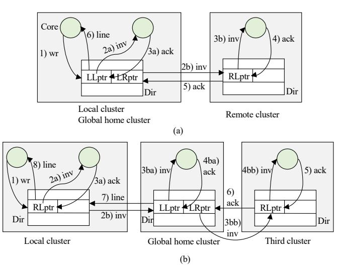

# 3. Core Write Miss in L2 and Line not Modified Anywhere, or Core Write Hit in L1/L2 on a Cached Line in S State.

Table [V](#page-6-2) shows the six transactions possible in this case. The cases are similar to those for a read miss and the line is not modified anywhere (Table [III\)](#page-5-2), except that now, the sharers are invalidated, the dir entries in remote sharer clusters that are not the Global home are removed, and the entry in the local dir and Global home dir are marked D=1.

For illustration, Figure [8\(](#page-6-0)a) shows case *C5*: the local dir entry has LLptrs and LRptrs (and therefore the local cluster is the Global home). The messages are numbered in time order. The requester core issues the write (1). The caches pointed to by LLptrs in the dir entry receive invalidations (2a) and ack them (3a). In parallel, the remote clusters pointed to by LRptrs are visited (2b), their dirs are checked, and the caches pointed to by the RLptrs receive invalidations (3b) and ack them (4). In such clusters, the remote dir entries are removed and acks are sent back to the local cluster (5), which updates the dir entry and supplies the line to requester (6).

Figure [8\(](#page-6-0)b) shows case *C6*: the local dir entry has RLptrs (and thus the local cluster is not the Global home). The requester writes (1). Then, the caches pointed by RLptrs in the local dir receive invals (2a) and ack them (3a). The local dir

#### TABLE V

CORE WRITE MISS IN ITS L2 AND LINE NOT MODIFIED ANYWHERE, OR WRITE HIT IN ITS L1/L2 ON A SHARED (S) LINE.

| C1: Local line and    | Get line from local DRAM. Create dir entry locally. Add         |
|-----------------------|-----------------------------------------------------------------|
| no local dir entry    | LLptr and D=1.                                                  |
| C2: Remote line | Access and do the following in the Global home cluster:         |
| and no local dir en   | {If dir entry does not exist, get line from DRAM, create dir    |
| try                   | entry, and add LRptr and D=1. Otherwise, do: 1)Invalidate       |
|                       | all sharers in the Global home cluster and in third clusters,   |
|                       | 2)Remove dir entry in any third cluster, and 3)in Global        |
|                       | home cluster, update dir entry to have only the requester's     |
|                       | LRptr and D=1}. Bring the line from the Global home to          |
|                       | the local cluster. Create dir entry locally. Add RLptr and      |
|                       | D=1.                                                            |
| C3: Local dir entry   | Get line from LLC or from another local L2. Invalidate          |
| with all LLptrs       | all local sharers. Update local dir entry to have only the      |
|                       | requester's LLptr and D=1.                                      |
| C4: Local dir entry   | Get line from local LLC or from one of the sharer clusters'     |
| with all LRptrs       | LLCs or L2s. Invalidate all the sharers in the sharer clusters. |
|                       | In those clusters, remove the dir entry. In local cluster,      |
|                       | update the dir entry to have only the requester's LLptr and     |
|                       | D=1.                                                            |
| C5: Local dir entry   | Combine the actions in C3 and C4.                               |
| with a combination    |                                                                 |
| of LLptrs, LRptrs     |                                                                 |
| C6: Local dir entry   | Invalidate local sharers and remove local dir entry. Access     |
| with RLptrs           | the Global home and do there: {1)Invalidate all sharers in      |
|                       | the Global home cluster and in third clusters (not including    |
|                       | the local cluster), 2)Remove dir entry in any invalidated       |
|                       | third cluster, and 3)in Global home cluster, update dir entry   |
|                       | to have only the requester's LRptr and D=1}. Bring the line     |
|                       | from the Global home to the local cluster. Create dir entry     |
|                       | locally. Add RLptr and D=1.                                     |

Fig. 8. Write miss transactions to unmodified data: the local cluster is the Global home (a) or it is not (b).

entry is removed. In parallel, the Global home is visited (2b) and its dir entry is checked. Any caches in the cluster pointed to by LLptrs get invals (3ba) and ack them (4ba), while third clusters pointed to by LRptrs (except for the requesting one) are also visited (3bb). In those clusters, the dir entry is checked and any caches pointed to by RLptrs get invals (4bb) and ack them (5). The dir entry in these third clusters is removed and acks are sent to the Global home (6), which updates its dir entry to have only an LRptr pointing to the requester and D=1. The line is sent to the local cluster (7), which creates a dir entry with only the requester's RLptr and D=1. Then, the line is sent to the requester (8).

# 3. Core Write Miss in L2 and Line not Modified Anywhere, or Core Write Hit in L1/L2 on a Cached Line in S State.

Table [V](#page-6-2) shows the six transactions possible in this case. The cases are similar to those for a read miss and the line is not modified anywhere (Table [III\)](#page-5-2), except that now, the sharers are invalidated, the dir entries in remote sharer clusters that are not the Global home are removed, and the entry in the local dir and Global home dir are marked D=1.

For illustration, Figure [8\(](#page-6-0)a) shows case *C5*: the local dir entry has LLptrs and LRptrs (and therefore the local cluster is the Global home). The messages are numbered in time order. The requester core issues the write (1). The caches pointed to by LLptrs in the dir entry receive invalidations (2a) and ack them (3a). In parallel, the remote clusters pointed to by LRptrs are visited (2b), their dirs are checked, and the caches pointed to by the RLptrs receive invalidations (3b) and ack them (4). In such clusters, the remote dir entries are removed and acks are sent back to the local cluster (5), which updates the dir entry and supplies the line to requester (6).

Figure [8\(](#page-6-0)b) shows case *C6*: the local dir entry has RLptrs (and thus the local cluster is not the Global home). The requester writes (1). Then, the caches pointed by RLptrs in the local dir receive invals (2a) and ack them (3a). The local dir

#### TABLE V

CORE WRITE MISS IN ITS L2 AND LINE NOT MODIFIED ANYWHERE, OR WRITE HIT IN ITS L1/L2 ON A SHARED (S) LINE.

| C1: Local line and    | Get line from local DRAM. Create dir entry locally. Add         |
|-----------------------|-----------------------------------------------------------------|
| no local dir entry    | LLptr and D=1.                                                  |
| C2: Remote line | Access and do the following in the Global home cluster:         |
| and no local dir en   | {If dir entry does not exist, get line from DRAM, create dir    |
| try                   | entry, and add LRptr and D=1. Otherwise, do: 1)Invalidate       |
|                       | all sharers in the Global home cluster and in third clusters,   |
|                       | 2)Remove dir entry in any third cluster, and 3)in Global        |
|                       | home cluster, update dir entry to have only the requester's     |
|                       | LRptr and D=1}. Bring the line from the Global home to          |
|                       | the local cluster. Create dir entry locally. Add RLptr and      |
|                       | D=1.                                                            |
| C3: Local dir entry   | Get line from LLC or from another local L2. Invalidate          |
| with all LLptrs       | all local sharers. Update local dir entry to have only the      |
|                       | requester's LLptr and D=1.                                      |
| C4: Local dir entry   | Get line from local LLC or from one of the sharer clusters'     |
| with all LRptrs       | LLCs or L2s. Invalidate all the sharers in the sharer clusters. |
|                       | In those clusters, remove the dir entry. In local cluster,      |
|                       | update the dir entry to have only the requester's LLptr and     |
|                       | D=1.                                                            |
| C5: Local dir entry   | Combine the actions in C3 and C4.                               |
| with a combination    |                                                                 |
| of LLptrs, LRptrs     |                                                                 |
| C6: Local dir entry   | Invalidate local sharers and remove local dir entry. Access     |
| with RLptrs           | the Global home and do there: {1)Invalidate all sharers in      |
|                       | the Global home cluster and in third clusters (not including    |
|                       | the local cluster), 2)Remove dir entry in any invalidated       |
|                       | third cluster, and 3)in Global home cluster, update dir entry   |
|                       | to have only the requester's LRptr and D=1}. Bring the line     |
|                       | from the Global home to the local cluster. Create dir entry     |
|                       | locally. Add RLptr and D=1.                                     |

Fig. 8. Write miss transactions to unmodified data: the local cluster is the Global home (a) or it is not (b).

entry is removed. In parallel, the Global home is visited (2b) and its dir entry is checked. Any caches in the cluster pointed to by LLptrs get invals (3ba) and ack them (4ba), while third clusters pointed to by LRptrs (except for the requesting one) are also visited (3bb). In those clusters, the dir entry is checked and any caches pointed to by RLptrs get invals (4bb) and ack them (5). The dir entry in these third clusters is removed and acks are sent to the Global home (6), which updates its dir entry to have only an LRptr pointing to the requester and D=1. The line is sent to the local cluster (7), which creates a dir entry with only the requester's RLptr and D=1. Then, the line is sent to the requester (8).

