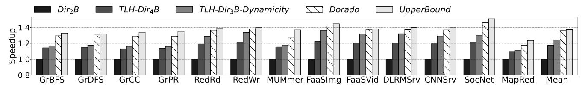
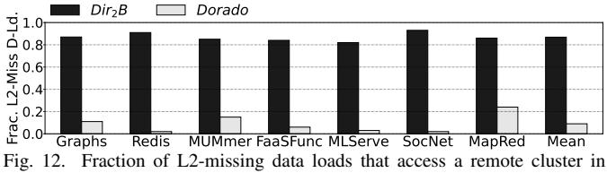
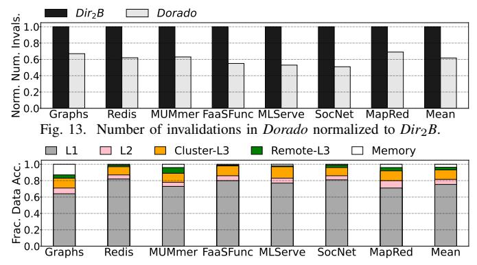
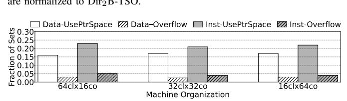

# *A. Performance of Dorado*

Figure [10](#page-10-0) shows the speedup of *TLH-Dir*4*B*, *TLH-Dir*3*B-Dynamicity*, *Dorado*, and *UpperBound* over Dir2B for each application. Reorganizing the flat topology of Dir2B into our two-level homes (*TLH-Dir*4*B*) attains a 1.17× average speedup. With TLH, the system: (1) has fewer remote transactions, as Temporary homes reduce the need to leave the local cluster; (2) has more pointers per directory entry, thanks to the reduced pointer size; and (3) has higher sharer tracking capacity, as each LRptr covers the 32 cores of a remote cluster.

Dynamic Apportioning with *TLH-Dir*3*B-Dynamicity* brings more gains, by allowing applications to adjust directory/LLC space to their access patterns. For codes with low locality like Redis, remote directory entries and lines get more space; for codes with high locality like DLRMSrv and CNNSrv,

Fig. 10. Speedup of different protocols over  $Dir_2B$  for various applications (higher is better).

local directory entries and lines get more space. Dynamic Apportioning boosts the speedup over  $Dir_2B$  to  $1.24\times$ .

The *Dorado* bars add our SetOverflow contribution. The protocol can precisely track more sharers for many-sharer lines. Thus, it minimizes remote transactions, invalidations, and network contention. On average, Dorado achieves a speedup of  $1.36\times$ .

Hence, each of the three contributions of *Dorado* (clustering with TLH, Dynamic Apportioning, and SetOverflow) is effective. Each technique adds speedup to each application—for some applications more than for others, which is expected, given the wide variation in behavior across applications in a large machine. We also see that *Dorado* is within 1% of the performance of *UpperBound*, which uses  $2.75 \times$  more directory storage.

#### B. Comparing Many-Sharer Directory Designs

Figure 11 compares the performance of three many-sharer directory designs. We take TLH-Dir3B-Dynamicity and add either SCD [55], Way Combining [64], or SetOverflow. The results are the SCD, WayC, and Dorado bars, respectively. All designs use the same directory space. *Dorado* implements SetOverflow with 2 pointers in each of the 12 directory ways and 12 pointers in PointerSpace, while Way Combining has 3 pointers in each of the 12 ways. We give Way Combining 3 pointers per entry (rather than the single pointer per entry used in the original proposal) so that its total directory storage matches that of the other designs. With a single pointer per entry, Way Combining reduces its performance by an average of 4.7%. For SCD, we use the design with a set-associative cache as presented in [55] rather than with a ZCache, to keep the design compatible with current caches and for a more fair comparison. The total directory size in each of these designs is the same:  $\approx$ 4.5% of the LLC cache size (including tags and data). This corresponds to 270KB per core.

For reference, the figure also shows  $Dir_1B+SetOv$ , a flat design with SetOverflow. To keep the total size constant, we start with  $Dir_2B$  and take one of the pointers per directory entry and place it in the SharerPointer Array. Since the directory has 12 ways, the SharerPointer Array ends up with 12 pointers as usual. The figure shows speedups over  $Dir_2B$ .

In this figure and all subsequent ones, we combine all the graph applications in a single bar, and do the same for all the Redis, FaaS, and ML serving applications. However, we still show the mean for all 13 applications. We see that the average speedups of SCD, WayC, and Dorado (which adds SetOverflow) over TLH-Dir3B-Dynamicity are 3.1%, 5.8%, and 10.5%, respectively. SCD has a modest speedup because, with set-associate caches, it incurs many evictions due to

Fig. 11. Speedups attained by adding different many-sharer directory designs to TLH-Dir3B-Dynamicity: SCD, Way Combining, and SetOverflow (whose bar is labeled Dorado)

 $Dir_2B$  and Dorado.

directory entry conflicts. This is consistent with the findings in Section 6.4 of the SCD paper.

WayC is limited by the fact that a line is only allowed to steal all the sharer pointers of an unused line in the same cache set. When caches are highly utilized, WayCombining cannot find a free address tag in the same set to steal its directory entry. In contrast, SetOverflow in *Dorado* enables the fine-grained assignment of the extra sharer pointers to multiple lines in the set, and does not need unused cache line entries in the set. Hence, the fine-grain, no-restrictions approach of SetOverflow delivers higher performance.

#### C. Understanding Dorado's Benefits

The combination of TLH and the ability to precisely track more sharers with Dynamic Apportioning and SetOverflow enables Dorado to reduce remote coherence transactions and overall coherence traffic. To gain insight into these issues, Figure 12 shows the fraction of L2-missing data loads that access a remote cluster in  $Dir_2B$  and Dorado. We can see that Dorado enables cores to typically complete a transaction locally. On average, *Dorado* reduces the number of L2-missing data loads that go remote by 89.6%.

Figure 13 shows the number of invalidation messages in Dorado normalized to Dir2B. On average, Dorado issues 39% fewer invalidation messages than Dir2B thanks to its ability to precisely track more sharers. This is enabled by a combination of SetOverflow, which extends the number of pointers, and Dynamic Apportioning, where a single LRptr pointer holds all the sharers in a cluster.

Figure 14 considers all the data loads/stores in Dorado and shows the fraction served by each level of the memory hierarchy. In the figure, Cluster-L3, and Remote-L3 refer to any LLC slice in the local cluster, and in any remote cluster,

Fig. 14. Fraction of data accesses served by each level of the memory hierarchy in *Dorado*.

respectively. With *Dorado*, few requests need to go to remote clusters. It can be shown that *Dorado* reduces the average latency of data loads by 46.1% relative to *Dir2B*.

#### D. Comparison to Hierarchical Machines

Figure 15 shows hierarchical machines of degrees 2, 4, and 16 (*Hier2*, *Hier4*, *Hier16*), each with a total of 1024 cores organized in 32-core clusters. Each core has a 2MB L2, as in Dorado. Each cluster has a cluster-level L3 and directory. The figure shows the sizes of caches used. Since Dorado has 6MB of caching per core beyond L2, to be fair, we set *Hier16* to also have 6MB per core beyond L2. Hierarchical processors need many caches, which become larger as they get closer to the root. Hence, to have a reasonable design, we need to add more caching in *Hier4* and *Hier2*: 8MB and 12MB per core beyond L2, respectively. We set the round trip latency of a request going one level up, crossing to a different chiplet, accessing the directory/cache, and returning, to 60 cycles.

1. **Performance Comparison.** Hierarchical machines work best in applications where most data is read-mostly or most read-write data is shared by threads within a cluster. In these cases, both reads and writes are mostly satisfied within a cluster. Hierarchies work worst when there is a sizable amount of read-write data that is shared among threads in far clusters. In this case, both reads and writes suffer longlatency tree traversals. Specifically, the transaction of a write to a shared line goes up the tree until the level L that covers all sharers, then sends invalidations downward to all sharers, gets acks to level L, and responds to the requester. Similarly, the transaction of a read to data dirty in another core goes up the tree until the level L that covers the requester and the current owner core. In both cases, as the request reaches each directory/cache level, it must look-up the directory/cache and possibly update it. Further, to access the directory/cache, it may contend with other requests that attempt to do so as well.

Figure 16 compares the speedup of Hier2, Hier4, Hier16, and Dorado over  $Dir_2B$ . Hier2, Hier4, and Hier16 attain average speedups of  $1.17 \times 1.20 \times 1.18 \times 1.18 \times 1.18 \times 1.18 \times 1.18 \times 1.18 \times 1.18 \times 1.18 \times 1.18 \times 1.18 \times 1.18 \times 1.18 \times 1.18 \times 1.18 \times 1.18 \times 1.18 \times 1.18 \times 1.18 \times 1.18 \times 1.18 \times 1.18 \times 1.18 \times 1.18 \times 1.18 \times 1.18 \times 1.18 \times 1.18 \times 1.18 \times 1.18 \times 1.18 \times 1.18 \times 1.18 \times 1.18 \times 1.18 \times 1.18 \times 1.18 \times 1.18 \times 1.18 \times 1.18 \times 1.18 \times 1.18 \times 1.18 \times 1.18 \times 1.18 \times 1.18 \times 1.18 \times 1.18 \times 1.18 \times 1.18 \times 1.18 \times 1.18 \times 1.18 \times 1.18 \times 1.18 \times 1.18 \times 1.18 \times 1.18 \times 1.18 \times 1.18 \times 1.18 \times 1.18 \times 1.18 \times 1.18 \times 1.18 \times 1.18 \times 1.18 \times 1.18 \times 1.18 \times 1.18 \times 1.18 \times 1.18 \times 1.18 \times 1.18 \times 1.18 \times 1.18 \times 1.18 \times 1.18 \times 1.18 \times 1.18 \times 1.18 \times 1.18 \times 1.18 \times 1.18 \times 1.18 \times 1.18 \times 1.18 \times 1.18 \times 1.18 \times 1.18 \times 1.18 \times 1.18 \times 1.18 \times 1.18 \times 1.18 \times 1.18 \times 1.18 \times 1.18 \times 1.18 \times 1.18 \times 1.18 \times 1.18 \times 1.18 \times 1.18 \times 1.18 \times 1.18 \times 1.18 \times 1.18 \times 1.18 \times 1.18 \times 1.18 \times 1.18 \times 1.18 \times 1.18 \times 1.18 \times 1.18 \times 1.18 \times 1.18 \times 1.18 \times 1.18 \times 1.18 \times 1.18 \times 1.18 \times 1.18 \times 1.18 \times 1.18 \times 1.18 \times 1.18 \times 1.18 \times 1.18 \times 1.18 \times 1.18 \times 1.18 \times 1.18 \times 1.18 \times 1.18 \times 1.18 \times 1.18 \times 1.18 \times 1.18 \times 1.18 \times 1.18 \times 1.18 \times 1.18 \times 1.18 \times 1.18 \times 1.18 \times 1.18 \times 1.18 \times 1.18 \times 1.18 \times 1.18 \times 1.18 \times 1.18 \times 1.18 \times 1.18 \times 1.18 \times 1.18 \times 1.18 \times 1.18 \times 1.18 \times 1.18 \times 1.18 \times 1.18 \times 1.18 \times 1.18 \times 1.18 \times 1.18 \times 1.18 \times 1.18 \times 1.18 \times 1.18 \times 1.18 \times 1.18 \times 1.18 \times 1.18 \times 1.18 \times 1.18 \times 1.18 \times 1.18 \times 1.18 \times 1.18 \times 1.18 \times 1.18 \times 1.18 \times 1.18 \times 1.18 \times 1.18 \times 1.18 \times 1.18 \times 1.18 \times 1.18 \times 1.18 \times 1.18 \times 1.18 \times 1.18 \times 1.18 \times 1.18 \times 1.18 \times 1.18 \times 1.18 \times 1.18 \times 1.18 \times 1.18 \times 1.18 \times 1.18 \times 1.18 \times 1.18 \times 1.18 \times 1.18 \times 1.18 \times 1.18 \times 1.18 \times 1.18 \times 1.18 \times 1.18 \times 1.18 \times 1.18 \times 1.18 \times 1.18 \times 1.18 \times 1.18 \times 1.18 \times 1.18 \times 1.18 \times 1.18 \times 1.18 \times 1.18 \times 1.18 \times 1.18 \times 1.18 \times 1.18 \times 1.18 \times 1.18 \times 1.18 \times 1.18 \times 1.18 \times 1.18 \times 1.18 \times 1.18 \times 1.18 \times 1.18 \times 1.18 \times 1.18 \times 1.18 \times 1.18 \times 1.18 \times 1.18 \times 1.18 \times 1.18 \times 1.18 \times 1.18 \times 1.18 \times 1.18 \times 1.18 \times 1.18 \times 1.18 \times 1.18 \times 1.18 \times 1.18 \times 1.18 \times 1.18 \times 1.18 \times 1.18 \times 1.18 \times 1.18 \times 1.18 \times 1.18 \times 1.18 \times 1.18 \times$ 

Fig. 15. 1024-core machines with hierarchical or tree-based protocols.

Fig. 16. Speedup of hierarchical protocols and *Dorado* over *Dir2B*.

In MapRed, the dominant sharing pattern is cluster-local and read-mostly. Consider *Hier4*. The percentage of L2-missing writes that are intercepted by L3, by L4 (and hence keep invalidations within the L4 subtree), by L5, and by L6 are 65%, 18%, 7%, and 10%, respectively. Further, 84% of the loads are satisfied within a cluster, and the average latency of an L1-missing load is 53 cycles. In comparison, the average latency of an L1-missing load in *Dorado* is 49 cycles. Given the small difference, both architectures perform similarly.

At the other extreme, SocNet has frequent cross-cluster read-write sharing, and requests must often climb to high directory/cache levels. In *Hier4*, the percentage of L2-missing writes that are intercepted by L3, by L4, by L5, and by L6 are 46%, 21%, 16%, and 17%, respectively. This distribution leads to more level traversals and directory/cache look-ups, causing longer write latencies. In addition, only 68% of loads are satisfied within the cluster, and the average latency of an L1-missing load is 72 cycles. Meanwhile, *Dorado* performs the writes and reads without the multiple steps in the hierarchy. The average latency of an L1-missing load in *Dorado* is 57 cycles. The overall result is that *Dorado* is substantially faster. Hier16's wider tree concentrates traffic in large caches shared among 16 children, causing contention that inflates access times. The average latency of an L1-missing load in *Hier16* is 76 cycles. The result is low performance of SocNet in *Hier16*. 2. Impact of Release Consistency (RC). Figure 17 compares the speedups of Dir2B, Hier4, and Dorado under TSO and RC. In the figure, all bars are normalized to Dir2B-TSO. Recall from Section VI that TSO requires in-order draining of writes from the store buffer, while RC does not. Hence, RC can speed-up execution over TSO when writes are a bottleneck.

We see that RC speeds-up all the architectures over TSO. RC is most effective for  $Dir_2B$ , which has the longest write latencies due to its limited sharer tracking. Its average speedup is  $Dir_2B$ - $RC/Dir_2B$ -TSO=1.06. The other architectures gain relatively less going from TSO to RC. Specifically, *Hier4* goes from a speedup of 1.20 to 1.24, and *Dorado* from 1.36 to 1.38. The speedups are modest because our TSO implementation

Fig. 17. Speedups of *Dir2B*, *Hier4*, and *Dorado* under TSO and RC. All bars are normalized to Dir2B-TSO.

Fig. 18. Fraction of sets that use PointerSpace and fraction that overflow PointerSpace for data and instructions, under different machine organizations.

is well optimized, as it uses both speculation for loads and exclusive prefetches for writes.

The average speedup of *Dorado* over *Hier4* goes from  $1.13 \times$  under TSO to  $1.11 \times$  under RC. The speedup decreases under RC because writes are better overlapped, and *Hier4* benefits more. However, *Dorado*'s performance remains higher than *Hier4* under RC because loads and stores have a lower average latency in *Dorado*, as shown in the previous section.

#### E. Characterizing the Scalability of SetOverflow

We characterize the use of SetOverflow's PointerSpace for different cluster sizes. We measure how often the 12-pointer PointerSpace in each directory set is used, and how often it overflows (thus one or more Broadcast (B) bits in directory entries get set). We consider 3 machines: 64 clusters of 16 cores (64cl\_16co), the default 32 clusters of 32 cores (32cl\_32co), and 16 clusters of 64 cores (16cl\_64co). We consider data and instructions separately because instructions are read-only and, therefore, setting the B bit is harmless. Figure 18 shows the average fraction of sets where the 12pointer PointerSpace is used and the average fraction where PointerSpace overflows, for sets with: (1) at least one data line and (2) all instruction lines. We see that overflows are few. In our default 32cl\_32co, only 2% of sets with data cause PointerSpace to overflow. For clusters of 64 cores (16cl 64co), the number goes up to 3%. Hence, we conclude that scaling the cluster size does not require increasing the PointerSpace.

#### F. Additional Area and Power of the Dorado Directory

We implement the *Dorado* directory in RTL and use OpenROAD [44] to synthesize, place, and route a complete directory-LLC slice. We use Verilator [58] to generate switching activity. We capture switching activity under representative access patterns, including steady-state directory accesses and overflow events, and feed it into post-synthesis power analysis. Compared to  $Dir_2B$ , Dorado increases the directory-LLC slice area by 0.44% and the leakage by 2.3%. Directory-LLC dynamic power rises by 1.8% under representative traces, and by 4.2% under worst-case, repeated overflow activity. These small numbers confirm that the Dorado directory adds negligible area/power costs relative to its performance benefits.

#### VIII. OTHER RELATED WORK

Section I indicated that Dorado is unlike two-level directories like MGS [31] and Cashmere-2L [61]. These schemes have separate intra-cluster and inter-cluster directory types and coherence protocols. Also, their inter-cluster protocol is managed in software and at the page granularity.

The multiple designs of many-sharer directory entries described in Section II have different characteristics. The design of Fang et al. [14] is inflexible: it statically partitions the directory entries in each directory set into limited-pointer entries and full bit-vector entries. The SCD design [55] is more complex than the other designs, as it requires building a hierarchy of directory entries for a line that has many sharers (i.e., a root entry and multiple leaf ones). Traversing, allocating, and modifying such entries requires special logic.

The Pool directory [56] is also a relatively complex design. It has three main differences with SetOverflow. First, it requires an indirection from the tag array to a large, centralized pool of sharer entries. Such pool is shared across all directory sets, requiring arbitration and global bookkeeping. SetOverflow uses indirection to a small, per-set PointerSpace of a few sharer pointers. As PointerSpace is local to a directory set, it avoids cross-set contention and simplifies control logic. Second, in Pool directory, the multiple entries for a line in the pool must be allocated contiguously—otherwise, multiple indirections per line are needed. A special hardware algorithm is used for entry eviction and migration to maintain contiguity. In SetOverflow, OwnerWay entries are claimed independently. No contiguity is required and no compaction or migration logic is needed. Third, the entries for a line in the Pool directory may use different formats (e.g., partial vs. full bit-vectors). This requires specialized logic to encode and decode the sharers on an access, and to refactor on an sharer update. SetOverflow uses a uniform 6-bit pointer format.

Unlike SetOverflow, WayCombining [64] does not require an indirection on overflow into another structure like Pointer-Space. On the other hand, in WayCombining, multiple tags in the directory/L3 may end up having the same address. This requires special hardware on an access to directory/L3 as multiple hits may occur. Handling writes needs special care. Further, since the directory state of a line in multiple ways may use different formats, reading/writing the state and, especially, merging it when space is needed, requires logic.

# *A. Performance of Dorado*

Figure [10](#page-10-0) shows the speedup of *TLH-Dir*4*B*, *TLH-Dir*3*B-Dynamicity*, *Dorado*, and *UpperBound* over Dir2B for each application. Reorganizing the flat topology of Dir2B into our two-level homes (*TLH-Dir*4*B*) attains a 1.17× average speedup. With TLH, the system: (1) has fewer remote transactions, as Temporary homes reduce the need to leave the local cluster; (2) has more pointers per directory entry, thanks to the reduced pointer size; and (3) has higher sharer tracking capacity, as each LRptr covers the 32 cores of a remote cluster.

Dynamic Apportioning with *TLH-Dir*3*B-Dynamicity* brings more gains, by allowing applications to adjust directory/LLC space to their access patterns. For codes with low locality like Redis, remote directory entries and lines get more space; for codes with high locality like DLRMSrv and CNNSrv,

Fig. 10. Speedup of different protocols over  $Dir_2B$  for various applications (higher is better).

local directory entries and lines get more space. Dynamic Apportioning boosts the speedup over  $Dir_2B$  to  $1.24\times$ .

The *Dorado* bars add our SetOverflow contribution. The protocol can precisely track more sharers for many-sharer lines. Thus, it minimizes remote transactions, invalidations, and network contention. On average, Dorado achieves a speedup of  $1.36\times$ .

Hence, each of the three contributions of *Dorado* (clustering with TLH, Dynamic Apportioning, and SetOverflow) is effective. Each technique adds speedup to each application—for some applications more than for others, which is expected, given the wide variation in behavior across applications in a large machine. We also see that *Dorado* is within 1% of the performance of *UpperBound*, which uses  $2.75 \times$  more directory storage.

#### B. Comparing Many-Sharer Directory Designs

Figure 11 compares the performance of three many-sharer directory designs. We take TLH-Dir3B-Dynamicity and add either SCD [55], Way Combining [64], or SetOverflow. The results are the SCD, WayC, and Dorado bars, respectively. All designs use the same directory space. *Dorado* implements SetOverflow with 2 pointers in each of the 12 directory ways and 12 pointers in PointerSpace, while Way Combining has 3 pointers in each of the 12 ways. We give Way Combining 3 pointers per entry (rather than the single pointer per entry used in the original proposal) so that its total directory storage matches that of the other designs. With a single pointer per entry, Way Combining reduces its performance by an average of 4.7%. For SCD, we use the design with a set-associative cache as presented in [55] rather than with a ZCache, to keep the design compatible with current caches and for a more fair comparison. The total directory size in each of these designs is the same:  $\approx$ 4.5% of the LLC cache size (including tags and data). This corresponds to 270KB per core.

For reference, the figure also shows  $Dir_1B+SetOv$ , a flat design with SetOverflow. To keep the total size constant, we start with  $Dir_2B$  and take one of the pointers per directory entry and place it in the SharerPointer Array. Since the directory has 12 ways, the SharerPointer Array ends up with 12 pointers as usual. The figure shows speedups over  $Dir_2B$ .

In this figure and all subsequent ones, we combine all the graph applications in a single bar, and do the same for all the Redis, FaaS, and ML serving applications. However, we still show the mean for all 13 applications. We see that the average speedups of SCD, WayC, and Dorado (which adds SetOverflow) over TLH-Dir3B-Dynamicity are 3.1%, 5.8%, and 10.5%, respectively. SCD has a modest speedup because, with set-associate caches, it incurs many evictions due to

Fig. 11. Speedups attained by adding different many-sharer directory designs to TLH-Dir3B-Dynamicity: SCD, Way Combining, and SetOverflow (whose bar is labeled Dorado)

 $Dir_2B$  and Dorado.

directory entry conflicts. This is consistent with the findings in Section 6.4 of the SCD paper.

WayC is limited by the fact that a line is only allowed to steal all the sharer pointers of an unused line in the same cache set. When caches are highly utilized, WayCombining cannot find a free address tag in the same set to steal its directory entry. In contrast, SetOverflow in *Dorado* enables the fine-grained assignment of the extra sharer pointers to multiple lines in the set, and does not need unused cache line entries in the set. Hence, the fine-grain, no-restrictions approach of SetOverflow delivers higher performance.

#### C. Understanding Dorado's Benefits

The combination of TLH and the ability to precisely track more sharers with Dynamic Apportioning and SetOverflow enables Dorado to reduce remote coherence transactions and overall coherence traffic. To gain insight into these issues, Figure 12 shows the fraction of L2-missing data loads that access a remote cluster in  $Dir_2B$  and Dorado. We can see that Dorado enables cores to typically complete a transaction locally. On average, *Dorado* reduces the number of L2-missing data loads that go remote by 89.6%.

Figure 13 shows the number of invalidation messages in Dorado normalized to Dir2B. On average, Dorado issues 39% fewer invalidation messages than Dir2B thanks to its ability to precisely track more sharers. This is enabled by a combination of SetOverflow, which extends the number of pointers, and Dynamic Apportioning, where a single LRptr pointer holds all the sharers in a cluster.

Figure 14 considers all the data loads/stores in Dorado and shows the fraction served by each level of the memory hierarchy. In the figure, Cluster-L3, and Remote-L3 refer to any LLC slice in the local cluster, and in any remote cluster,

Fig. 14. Fraction of data accesses served by each level of the memory hierarchy in *Dorado*.

respectively. With *Dorado*, few requests need to go to remote clusters. It can be shown that *Dorado* reduces the average latency of data loads by 46.1% relative to *Dir2B*.

#### D. Comparison to Hierarchical Machines

Figure 15 shows hierarchical machines of degrees 2, 4, and 16 (*Hier2*, *Hier4*, *Hier16*), each with a total of 1024 cores organized in 32-core clusters. Each core has a 2MB L2, as in Dorado. Each cluster has a cluster-level L3 and directory. The figure shows the sizes of caches used. Since Dorado has 6MB of caching per core beyond L2, to be fair, we set *Hier16* to also have 6MB per core beyond L2. Hierarchical processors need many caches, which become larger as they get closer to the root. Hence, to have a reasonable design, we need to add more caching in *Hier4* and *Hier2*: 8MB and 12MB per core beyond L2, respectively. We set the round trip latency of a request going one level up, crossing to a different chiplet, accessing the directory/cache, and returning, to 60 cycles.

1. **Performance Comparison.** Hierarchical machines work best in applications where most data is read-mostly or most read-write data is shared by threads within a cluster. In these cases, both reads and writes are mostly satisfied within a cluster. Hierarchies work worst when there is a sizable amount of read-write data that is shared among threads in far clusters. In this case, both reads and writes suffer longlatency tree traversals. Specifically, the transaction of a write to a shared line goes up the tree until the level L that covers all sharers, then sends invalidations downward to all sharers, gets acks to level L, and responds to the requester. Similarly, the transaction of a read to data dirty in another core goes up the tree until the level L that covers the requester and the current owner core. In both cases, as the request reaches each directory/cache level, it must look-up the directory/cache and possibly update it. Further, to access the directory/cache, it may contend with other requests that attempt to do so as well.

Figure 16 compares the speedup of Hier2, Hier4, Hier16, and Dorado over  $Dir_2B$ . Hier2, Hier4, and Hier16 attain average speedups of  $1.17 \times 1.20 \times 1.18 \times 1.18 \times 1.18 \times 1.18 \times 1.18 \times 1.18 \times 1.18 \times 1.18 \times 1.18 \times 1.18 \times 1.18 \times 1.18 \times 1.18 \times 1.18 \times 1.18 \times 1.18 \times 1.18 \times 1.18 \times 1.18 \times 1.18 \times 1.18 \times 1.18 \times 1.18 \times 1.18 \times 1.18 \times 1.18 \times 1.18 \times 1.18 \times 1.18 \times 1.18 \times 1.18 \times 1.18 \times 1.18 \times 1.18 \times 1.18 \times 1.18 \times 1.18 \times 1.18 \times 1.18 \times 1.18 \times 1.18 \times 1.18 \times 1.18 \times 1.18 \times 1.18 \times 1.18 \times 1.18 \times 1.18 \times 1.18 \times 1.18 \times 1.18 \times 1.18 \times 1.18 \times 1.18 \times 1.18 \times 1.18 \times 1.18 \times 1.18 \times 1.18 \times 1.18 \times 1.18 \times 1.18 \times 1.18 \times 1.18 \times 1.18 \times 1.18 \times 1.18 \times 1.18 \times 1.18 \times 1.18 \times 1.18 \times 1.18 \times 1.18 \times 1.18 \times 1.18 \times 1.18 \times 1.18 \times 1.18 \times 1.18 \times 1.18 \times 1.18 \times 1.18 \times 1.18 \times 1.18 \times 1.18 \times 1.18 \times 1.18 \times 1.18 \times 1.18 \times 1.18 \times 1.18 \times 1.18 \times 1.18 \times 1.18 \times 1.18 \times 1.18 \times 1.18 \times 1.18 \times 1.18 \times 1.18 \times 1.18 \times 1.18 \times 1.18 \times 1.18 \times 1.18 \times 1.18 \times 1.18 \times 1.18 \times 1.18 \times 1.18 \times 1.18 \times 1.18 \times 1.18 \times 1.18 \times 1.18 \times 1.18 \times 1.18 \times 1.18 \times 1.18 \times 1.18 \times 1.18 \times 1.18 \times 1.18 \times 1.18 \times 1.18 \times 1.18 \times 1.18 \times 1.18 \times 1.18 \times 1.18 \times 1.18 \times 1.18 \times 1.18 \times 1.18 \times 1.18 \times 1.18 \times 1.18 \times 1.18 \times 1.18 \times 1.18 \times 1.18 \times 1.18 \times 1.18 \times 1.18 \times 1.18 \times 1.18 \times 1.18 \times 1.18 \times 1.18 \times 1.18 \times 1.18 \times 1.18 \times 1.18 \times 1.18 \times 1.18 \times 1.18 \times 1.18 \times 1.18 \times 1.18 \times 1.18 \times 1.18 \times 1.18 \times 1.18 \times 1.18 \times 1.18 \times 1.18 \times 1.18 \times 1.18 \times 1.18 \times 1.18 \times 1.18 \times 1.18 \times 1.18 \times 1.18 \times 1.18 \times 1.18 \times 1.18 \times 1.18 \times 1.18 \times 1.18 \times 1.18 \times 1.18 \times 1.18 \times 1.18 \times 1.18 \times 1.18 \times 1.18 \times 1.18 \times 1.18 \times 1.18 \times 1.18 \times 1.18 \times 1.18 \times 1.18 \times 1.18 \times 1.18 \times 1.18 \times 1.18 \times 1.18 \times 1.18 \times 1.18 \times 1.18 \times 1.18 \times 1.18 \times 1.18 \times 1.18 \times 1.18 \times 1.18 \times 1.18 \times 1.18 \times 1.18 \times 1.18 \times 1.18 \times 1.18 \times 1.18 \times 1.18 \times 1.18 \times 1.18 \times 1.18 \times 1.18 \times 1.18 \times 1.18 \times 1.18 \times 1.18 \times 1.18 \times 1.18 \times 1.18 \times 1.18 \times 1.18 \times 1.18 \times 1.18 \times 1.18 \times 1.18 \times 1.18 \times 1.18 \times 1.18 \times 1.18 \times 1.18 \times 1.18 \times 1.18 \times 1.18 \times 1.18 \times 1.18 \times 1.18 \times 1.18 \times 1.18 \times 1.18 \times 1.18 \times 1.18 \times 1.18 \times 1.18 \times 1.18 \times 1.18 \times 1.18 \times 1.18 \times 1.18 \times 1.18 \times 1.18 \times 1.18 \times 1.18 \times 1.18 \times 1.18 \times 1.18 \times 1.18 \times 1.18 \times 1.18 \times 1.18 \times 1.18 \times 1.18 \times$ 

Fig. 15. 1024-core machines with hierarchical or tree-based protocols.

Fig. 16. Speedup of hierarchical protocols and *Dorado* over *Dir2B*.

In MapRed, the dominant sharing pattern is cluster-local and read-mostly. Consider *Hier4*. The percentage of L2-missing writes that are intercepted by L3, by L4 (and hence keep invalidations within the L4 subtree), by L5, and by L6 are 65%, 18%, 7%, and 10%, respectively. Further, 84% of the loads are satisfied within a cluster, and the average latency of an L1-missing load is 53 cycles. In comparison, the average latency of an L1-missing load in *Dorado* is 49 cycles. Given the small difference, both architectures perform similarly.

At the other extreme, SocNet has frequent cross-cluster read-write sharing, and requests must often climb to high directory/cache levels. In *Hier4*, the percentage of L2-missing writes that are intercepted by L3, by L4, by L5, and by L6 are 46%, 21%, 16%, and 17%, respectively. This distribution leads to more level traversals and directory/cache look-ups, causing longer write latencies. In addition, only 68% of loads are satisfied within the cluster, and the average latency of an L1-missing load is 72 cycles. Meanwhile, *Dorado* performs the writes and reads without the multiple steps in the hierarchy. The average latency of an L1-missing load in *Dorado* is 57 cycles. The overall result is that *Dorado* is substantially faster. Hier16's wider tree concentrates traffic in large caches shared among 16 children, causing contention that inflates access times. The average latency of an L1-missing load in *Hier16* is 76 cycles. The result is low performance of SocNet in *Hier16*. 2. Impact of Release Consistency (RC). Figure 17 compares the speedups of Dir2B, Hier4, and Dorado under TSO and RC. In the figure, all bars are normalized to Dir2B-TSO. Recall from Section VI that TSO requires in-order draining of writes from the store buffer, while RC does not. Hence, RC can speed-up execution over TSO when writes are a bottleneck.

We see that RC speeds-up all the architectures over TSO. RC is most effective for  $Dir_2B$ , which has the longest write latencies due to its limited sharer tracking. Its average speedup is  $Dir_2B$ - $RC/Dir_2B$ -TSO=1.06. The other architectures gain relatively less going from TSO to RC. Specifically, *Hier4* goes from a speedup of 1.20 to 1.24, and *Dorado* from 1.36 to 1.38. The speedups are modest because our TSO implementation

Fig. 17. Speedups of *Dir2B*, *Hier4*, and *Dorado* under TSO and RC. All bars are normalized to Dir2B-TSO.

Fig. 18. Fraction of sets that use PointerSpace and fraction that overflow PointerSpace for data and instructions, under different machine organizations.

is well optimized, as it uses both speculation for loads and exclusive prefetches for writes.

The average speedup of *Dorado* over *Hier4* goes from  $1.13 \times$  under TSO to  $1.11 \times$  under RC. The speedup decreases under RC because writes are better overlapped, and *Hier4* benefits more. However, *Dorado*'s performance remains higher than *Hier4* under RC because loads and stores have a lower average latency in *Dorado*, as shown in the previous section.

#### E. Characterizing the Scalability of SetOverflow

We characterize the use of SetOverflow's PointerSpace for different cluster sizes. We measure how often the 12-pointer PointerSpace in each directory set is used, and how often it overflows (thus one or more Broadcast (B) bits in directory entries get set). We consider 3 machines: 64 clusters of 16 cores (64cl\_16co), the default 32 clusters of 32 cores (32cl\_32co), and 16 clusters of 64 cores (16cl\_64co). We consider data and instructions separately because instructions are read-only and, therefore, setting the B bit is harmless. Figure 18 shows the average fraction of sets where the 12pointer PointerSpace is used and the average fraction where PointerSpace overflows, for sets with: (1) at least one data line and (2) all instruction lines. We see that overflows are few. In our default 32cl\_32co, only 2% of sets with data cause PointerSpace to overflow. For clusters of 64 cores (16cl 64co), the number goes up to 3%. Hence, we conclude that scaling the cluster size does not require increasing the PointerSpace.

#### F. Additional Area and Power of the Dorado Directory

We implement the *Dorado* directory in RTL and use OpenROAD [44] to synthesize, place, and route a complete directory-LLC slice. We use Verilator [58] to generate switching activity. We capture switching activity under representative access patterns, including steady-state directory accesses and overflow events, and feed it into post-synthesis power analysis. Compared to  $Dir_2B$ , Dorado increases the directory-LLC slice area by 0.44% and the leakage by 2.3%. Directory-LLC dynamic power rises by 1.8% under representative traces, and by 4.2% under worst-case, repeated overflow activity. These small numbers confirm that the Dorado directory adds negligible area/power costs relative to its performance benefits.

#### VIII. OTHER RELATED WORK

Section I indicated that Dorado is unlike two-level directories like MGS [31] and Cashmere-2L [61]. These schemes have separate intra-cluster and inter-cluster directory types and coherence protocols. Also, their inter-cluster protocol is managed in software and at the page granularity.

The multiple designs of many-sharer directory entries described in Section II have different characteristics. The design of Fang et al. [14] is inflexible: it statically partitions the directory entries in each directory set into limited-pointer entries and full bit-vector entries. The SCD design [55] is more complex than the other designs, as it requires building a hierarchy of directory entries for a line that has many sharers (i.e., a root entry and multiple leaf ones). Traversing, allocating, and modifying such entries requires special logic.

The Pool directory [56] is also a relatively complex design. It has three main differences with SetOverflow. First, it requires an indirection from the tag array to a large, centralized pool of sharer entries. Such pool is shared across all directory sets, requiring arbitration and global bookkeeping. SetOverflow uses indirection to a small, per-set PointerSpace of a few sharer pointers. As PointerSpace is local to a directory set, it avoids cross-set contention and simplifies control logic. Second, in Pool directory, the multiple entries for a line in the pool must be allocated contiguously—otherwise, multiple indirections per line are needed. A special hardware algorithm is used for entry eviction and migration to maintain contiguity. In SetOverflow, OwnerWay entries are claimed independently. No contiguity is required and no compaction or migration logic is needed. Third, the entries for a line in the Pool directory may use different formats (e.g., partial vs. full bit-vectors). This requires specialized logic to encode and decode the sharers on an access, and to refactor on an sharer update. SetOverflow uses a uniform 6-bit pointer format.

Unlike SetOverflow, WayCombining [64] does not require an indirection on overflow into another structure like Pointer-Space. On the other hand, in WayCombining, multiple tags in the directory/L3 may end up having the same address. This requires special hardware on an access to directory/L3 as multiple hits may occur. Handling writes needs special care. Further, since the directory state of a line in multiple ways may use different formats, reading/writing the state and, especially, merging it when space is needed, requires logic.

