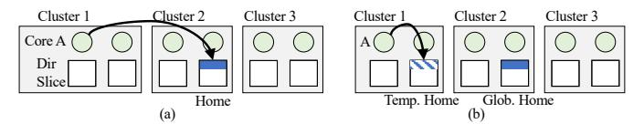
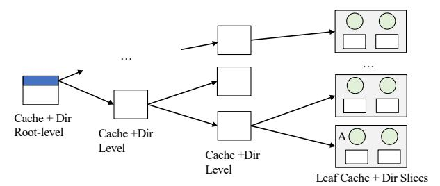
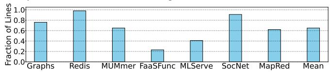
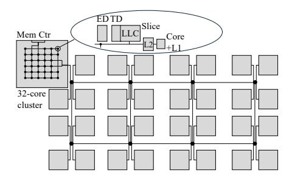

# Dorado: Clustered Hardware Cache Coherence for 1,000+ Cores

Jovan Stojkovic, Abraham Farrell, Gerasimos Gerogiannis, Zhangxiaowen Gong\*, Christopher J. Hughes\*, Josep Torrellas {jovans2, af28, gg24, torrella}@illinois.edu, {zhangxiaowen.gong, christopher.j.hughes}@intel.com

Abstract—As processors continue to grow in size, they will soon include over one thousand cores and, in at least some markets, require hardware cache coherence over all of the cores. In these systems, the costs of coherence transaction latency/traffic and directory storage will escalate. An intuitive way to contain these costs is to group cores into clusters and exploit intra-cluster locality. However, latency/traffic gains are thwarted by the need to access home directories in remote clusters, and storage reductions are limited by having to track many sharers.

To address these obstacles, this paper introduces *Dorado*, a new directory-based coherence protocol for 1,000+ cores that exploits clusters. Dorado makes three contributions. First, while each line has a Global home directory slice, it can also have Temporary home directory slices in each of the clusters where and while it is referenced. This minimizes high-latency/traffic transactions. Second, a directory can contain different types of entries and sharer pointers, each behaving differently. To use space efficiently, Dorado allows them all to dynamically share the same hardware structures—adapting their relative space to the workload sharing patterns. Third, to support manysharer lines with modest directory storage, Dorado introduces a simple mechanism for directory entries to grow into a shared area. Simulations of 1024 cores running a variety of workloads show that Dorado is effective. It attains an average speedup of  $1.36 \times$  over a same-area limited-pointer protocol by reducing the average load latency by 46.1%. Further, Dorado stays within 1% of the performance of a full bit vector protocol while using  $2.75\times$ less directory storage.

#### I. Introduction

Data center processors continue to grow in core count, due to increased computing demand by workloads, and the desire to amortize system cost across more cores. Recent systems include AMD's 128-core Bergamo [4], AmpereOne's 192-core system [5], and Intel's 288-core Sierra Forest [3]. These processors support the cache-coherent shared-memory paradigm. This is because most software systems expect it, including key workloads such as graph analytics, in-memory key-value stores, scientific computations, and many ML inference applications.

Supporting a single coherence domain across potentially thousands of cores can add significant overheads. Two important sources of overhead are the long latency and traffic induced by coherence transactions, and the directory storage required to track data sharers [38]. To support coherence, processors typically use a physically-distributed directory, where each core is located close to a slice of the directory and Last Level Cache (LLC). Each memory line is logically associated with a specific *home* directory slice. Typically, a

coherence transaction accesses the home directory slice of the line, which is possibly located far from the requesting core. Then, the directory may send messages to various caches that must respond before the transaction ends. A transaction's latency and traffic can be high and grows with the core count.

Directories need storage to track, for each memory line, which caches store it and in what state. To track data sharing precisely, the directory size scales quadratically with the core count. More cores generally implies more total cache capacity. Thus, there are more lines to track in directories and, for each line, more potential pointers to sharers of the line.

An intuitive way to contain the latency and traffic costs of coherence is to design the protocol to enable clusters of cores to operate on shared lines mostly locally, without requiring remote transactions. For this, one has to minimize the need for coherence transactions on a line to access the line's home directory slice—which may be in a remote cluster. This is shown in Figure 1(a), where Core A in Cluster 1 accesses a line whose home directory slice is in Cluster 2. The directory entry is shown in dark blue.

Fig. 1. Distributed directory organizations.

Even if one can localize transactions within clusters, there is still the obstacle that a line may be shared by many cores and clusters and, thus, the directory needs substantial storage. Since most lines are not widely shared [22], researchers have proposed low-storage directories (e.g., [1], [23]). However, *some* entries still need to track many sharers [14], [55], [56]. This is likely to get worse for 1,000+ core machines.

To address both latency/traffic and storage overheads, this paper presents *Dorado*, a new directory-based cache coherence protocol for 1,000+ cores that exploits clusters. Dorado introduces three ideas. First, Dorado introduces a new approach that enables clusters of cores to operate on lines locally, reducing the number of remote transactions needed. The idea is that, while each line still has a home directory slice (called *Global home*), it can also have a *Temporary home* directory slice in each of the clusters where and while it is referenced. The directory entry in a Temporary home is allocated/deallocated on demand. Figure 1(b) shows the Global and Temporary home slices and directory entries for the line accessed by core

TABLE I
PARTIAL LIST OF THE TECHNIQUES THAT CAN IMPROVE THE SCALABILITY OF DIRECTORY-BASED CACHE COHERENCE PROTOCOLS.

| Technique                                    | Reduce Storage? | Reduce Latency? | Reduce Traffic?     | Main Cost                                          |
|----------------------------------------------|--------------------|--------------------|------------------------|----------------------------------------------------|
| Bloom-filter directory [67], [70]            | ✓                  | ×                  | ×                      | Longer-latency directory-entry lookup and eviction |
| Coarse-grain tracking [8], [41]              | ×                  | _                  | $\checkmark$           | Region tracking hardware                           |
| Multi-grain coherence [12], [14], [66]       | $\checkmark$       | ×                  | ✓                      | Multi-grain tracking hardware                      |
| Cuckoo directory [16]                        | $\checkmark$       | _                  | _                      | Directory insertion                                |
| OS alternative [13], [15], [28], [31], [61]  | $\checkmark$       | ×                  | ×                      | OS invocations                                     |
| Overflow dir into LLC [10], [29], [57]       | $\checkmark$       | ×                  | _                      | Costly directory operations & less LLC capacity    |
| Home delegation [11], [50], [51]             | ×                  | $\checkmark$       | ✓                      | Hardware metadata to locate delegated homes        |
| Reduce invalidation ACKs [33]                | $\checkmark$       | _                  | ×                      | Broadcast and no silent evictions                  |
| Duplication of directories and memory [45]   | ×                  | $\checkmark$       | ×                      | Reduced main-memory capacity                       |
| Network optimization [26]                    | ×                  | $\checkmark$       | $\checkmark$           | Tables to keep owners and multicast trees          |
| Transaction prediction [24], [46]            | ×                  | $\checkmark$       | $\checkmark$           | Hardware to record and predict transactions        |
| Various optimizations [32], [35], [60], [62] | $\sqrt{-\times}$   | $\sqrt{-\times}$   | $\checkmark$ $ \times$ | Additional hardware                                |

A. We call this idea *Two-Level Homes* (TLH). TLH enables many transactions to be satisfied locally within a cluster.

Second, because of the Global and Temporary homes and other design decisions, a directory slice can now have different types of entries and different types of sharer pointers. Hence, one must decide how to provision the storage. To address this question, Dorado uses *a single directory entry structure*. It allows all types of entries and pointers to dynamically compete for the same storage space, adapting to the workload's sharing patterns—an idea we call *Dynamic Apportioning*.

The third idea in Dorado supports the set of lines that have many concurrent sharers. Dorado extends prior work with a new scheme that allows the directory entries in a directory set to compete for additional sharer pointers dynamically and with fine grain. We call this scheme *SetOverflow*.

TLH is different from a two-level directory [31], [61], where there is an intra-cluster directory tracking local sharers and an inter-cluster directory tracking sharing at the grain of clusters. With TLH, there is only one type of directory that records both sharer clusters and local sharer cores; there is a single protocol, not an intra-cluster protocol and an intercluster protocol. Further, TLH is different from a hierarchical directory [21], [38], [43], [52], where the machine is organized in a multi-level hierarchy of cache and directory layers.

**Results.** Simulations of 1024 cores running a variety of workloads show that Dorado attains high performance. It achieves an average speedup of  $1.36\times$  over a same-area conventional limited-pointer protocol by: (1) reducing the average load latency by 46.1%, and (2) reducing the average number of invalidation messages by 39%. In addition, Dorado stays within 1% of the performance of a full bit vector protocol while using  $2.75\times$  less directory storage.

Contributions. The contributions of this work are:

- The Dorado clustered protocol that enables low-latency/traffic coherence transactions via *Two-Level Homes*.
- *Dynamic Apportioning* the directory space between different types of entries and pointers.
- The SetOverflow design for many-sharer directory entries.
- • An evaluation of Dorado comparing it to other designs.

#### II. BACKGROUND

A simple organization of a directory entry has a bit vector with as many bits as cores, denoting which cores cache the line, plus a Dirty (D) bit specifying if the line is dirty in the cache(s). To reduce the size of a directory entry, limited-pointer schemes [1], [9], [23] store only a few pointers per directory entry. Schemes with n pointers per entry are called  $Dir_n$ , and lose the ability to track more than n sharers for a line. Hence, the  $Dir_nB$  scheme [1] sets a Broadcast (B) bit when the number of sharers exceeds n. The coarse vector approach [23] reorganizes the pointers to track groups of cores.

- 1. Main Lines of Research in Scalable Coherence. To improve scalability, a technique can reduce memory access latency, traffic, or directory storage. Typically, a technique improves 1-2 of these measures at the expense of the other(s). Table I lists some of these techniques, marking their positive  $(\checkmark)$ , negative  $(\times)$ , or neutral (-) impact on these measures, and their main cost. Many can be combined with Dorado.
- Tagless coherence directory [67] and SPATL [70] use bloom filters as directory entries. They reduce directory storage but increase traffic due to false positives in filters. SPATL [70] has a table of sharing patterns to further reduce space at the cost of extra traffic due to imprecise tracking. Both designs increase the latency of directory lookups and evictions.
- Coarse-grain coherence tracking [8], [41] keeps additional information used to optimize accesses when the sharing patterns for all the lines within a region (e.g., a page) are similar. Then, traffic is reduced at the expense of additional storage. The main cost is region tracking hardware.
- In multi-grain coherence [12], [14], [66], coherence is tracked at granularities coarser than a cache line. It reduces storage and traffic, but increases latency due to extra checks.
- Cuckoo directory [16] organizes the directory as a cuckoo hash table. Compared to a conventional directory, this design can support the same number of directory entries with a smaller size, but it has longer directory entry insertions.
- Some designs offload part of the functionality to keep cache coherence to the OS [13], [15], [28], [31], [61]. Some support line-level coherence in hardware within nodes and page-level coherence by the OS across nodes, while others use the OS to remap pages dynamically. While they may reduce storage size, they often increase traffic/latency due to the OS overheads.
- Some techniques overflow directory information into the LLC. In WayPoint [29], the sharer pointers of a directory entry can overflow into the LLC; in ZeroDEV [10] and Tiny

Directory [57] full directory entries can overflow into the LLC. Although this approach reduces storage, accessing the directory, processing invalidations, and evicting or inserting directory entries are more expensive.

- Home delegation techniques [11], [50], [51] avoid the indirection of accessing the home directory. Instead, messages are sent directly from node to node. These techniques reduce access latency and traffic. Some of them require hardware to detect and record sharing patterns [11], while others need extra storage for additional metadata [50], [51].
- $\bullet$  A directory entry in ACKwise [33] keeps few sharer pointers but, when it overflows, it records the number of sharers N. On a write, it broadcasts an invalidation but only expects N ACKs. While it saves directory storage, it increases traffic through broadcasting and by making clean line evictions not silent.
- To recover from DRAM failures, Dvé [45] duplicates every memory and directory entry in two nodes of a NUMA machine. Replication helps reduce latency, as a cache accesses the closer of the two directory/memory entries, but doubles the memory storage needed and creates traffic (both home and replica need to be updated on a write back).
- As an example of network optimization, Virtual Tree Coherence [26] adds hardware to multicast a message to all sharers. Messages are sent to the sharer at the root of the tree and multicast to all sharers following a virtual tree using hardware stored in routers. This scheme saves latency and traffic but adds storage and special hardware.
- Some techniques use prediction to reduce transaction latency or traffic. PATCH [46] uses prediction to improve the performance of directory lookups, and Push Multicast [24] speculatively sends shared data from the LLC to predicted sharers. The cost is hardware to record and predict transactions.
- Other techniques optimize a certain type of transaction or sharing pattern. They include optimizations for migratory sharing [60], for data accessed in a one-off manner [32] (i.e., the requested word can only be used it once), or for various sharing patterns [35]. They also include creating linked lists of sharing caches [62]. These techniques have different impact on storage, latency, and traffic, but they all need extra hardware.

There are techniques that address a related but different problem from enhancing the scalability of a single cache coherence domain. Victim Replication [69] stashes a copy of a core's private cache victims into the closest partition of a shared cache; if stashed data is reused before eviction, it saves latency. CDR [17] adds an extra translation layer in a multiprocessor that enables a virtual machine (VM) to limit its coherence domain to a few physically-close cores and directories. Then, the threads of an application communicate with low latency. DiCo-Providers/Arin [19] are coherence protocols for server consolidation that reduce directory overhead by partitioning the chip into fixed, per-VM areas and managing coherence within each area. They provide a mechanism to communicate across areas at a higher cost. Virtual Hierarchies [39] is an environment of multiple VMs, where each VM owns a set of cores. The cores of a VM share a cache coherence protocol. If a VM needs data from another VM, it sends

Fig. 2. Hierarchical or tree-based coherence.

a request to a global second-level directory. The last two schemes are different from Dorado in that they introduce new, more expensive transaction types to communicate across VMs.

2. Hierarchical Coherence Protocols. Some work organizes the machine in a hierarchy of cache layers [21], [38], [43], [52] (Figure 2). Each cache entry includes a directory entry that records which caches in the next lower layer have the line. As cores reference lines, lines migrate to the appropriate subtrees. If the sharing pattern has good locality and includes many reads, many accesses are satisfied without going to the upper tree levels.

While interesting, this design has limitations. First, it needs a large total cache capacity. Second, tree traversals suffer long latencies due to multi-level cache look-ups—especially for writes, which must go up the hierarchy and then down to identify and invalidate copies. Third, it is hard to integrate this organization into mainstream directories for two reasons. First, the structure of protocol messaging in hierarchical machines is different from in mainstream flat protocols. In the latter (like Dorado, as we will see) the traffic directly flows from a cluster to the home, which acts as the serialization point. In a hierarchical directory, coherence messages follow the tree hierarchy of directories up and down, serializing at roots of subtrees. Second, the hardware in mainstream flat protocols is more modular: one increases the size of the machine by adding more clusters (Figure 1). All the hardware is exactly the same. In hierarchical protocols, when one adds more compute leaves (i.e, additional clusters), one also needs to add a different type of hardware: more cache/directory levels (Figure 2).

3. Supporting Many Sharers for a Small Fraction of **Directory Entries.** Several works provide a combination of many directory entries with few pointers and few directory entries with many pointers. Fang et al. [14] statically partition the entries in each directory set into limited-pointer entries and full bit-vector entries. They migrate entries between ways as needed. Way Combining [64] allows multiple directory entries in the same set to be assigned to a single line address, combining their sharer pointer space for extended coverage. SCD [55] dynamically creates directory entries with many sharers by having "root" entries, pointing to multiple "leaf" directory entries in other locations in the directory. Each leaf points to a set of sharer cores in a specific core-group. SCD uses the nonstandard ZCaches [54], which increase directory associativity and, therefore, reduce directory conflicts, at the cost of a more complex design. SpongeDirectory [68] is similar. The Pool directory [56] supports many-sharer directory entries by

Fig. 3. L2-missing data reads to lines with remote homes that can be satisfied locally. We show the number of cores per cluster.

Fig. 4. Fraction of cache lines accessed by a core that have the home in a remote cluster.

dynamically allocating structures with sharer information from a centralized global pool of sharer pointers. Dorado adds to all this work with the *SetOverflow* technique that we believe is simple and flexible. We evaluate *SetOverflow* for 1024 cores, while all prior works except SCD were evaluated with at most 128 cores.

#### III. SHARING CHARACTERISTICS WITH 1,000+ CORES

To build a coherence protocol for 1,000+ cores, we analyze the sharing patterns of several cloud workloads described in Section VI. Here, we model a vanilla MESI protocol in a flat directory with no sharer pointer limitations. We model 1024 cores organized by default in 32-core clusters. The organization, shown in Figure 5, will be described later. Each core sits next to a slice of the directory and LLC, and each line has its home in a directory slice. We use first-touch page allocation (Section VI), and trace instruction and data accesses. We focus on two aspects of cache coherence.

• Due to locality, the cores in a cluster may be able to satisfy most data load misses locally. We refer to hardware inside a cluster as local, and outside as remote. On a load miss, the hardware checks the line's home, which may be in a remote cluster. However, when a requester accesses a line with a remote home and a local core has the line, the requester can get the line from the local cluster, avoiding a remote access.

Figure 3 shows how often this case occurs. For different cluster sizes, it shows the fraction of L2-missing reads to data lines whose home is remote but that could be provided locally (if they have not been evicted from local caches). For clusters of 32 cores and beyond, on average over 91% of these transactions can be satisfied locally. Hence, if the protocol is enhanced to create a "local temporary" directory in addition to the home directory, nearly all loads from clusters of 32 cores and beyond can be handled locally.

This behavior is not due to the application being written in a "clustered" manner, with groups of threads having special affinity for common data. Instead, it is mostly due to the presence of many lines that are read-mostly and accessed by many threads. After a local core accesses and brings such a line locally, subsequent local cores access the line locally.

• Different workloads have different fractions of local- and remote-homed accesses. If we allow a cluster's directory slices

Fig. 5. 1024-core organization that supports Dorado.

to also include entries for accessed lines whose home is remote, how do we partition the directory space between entries for remotely- and locally-homed lines? Figure 4 shows the fraction of data cache lines accessed by a core that have a remote home (for 32-core clusters). We see varied workload behavior: the Redis key-value store (*Redis*) accesses mostly remote data, while the serverless workload (*FaaSFunc*) accesses mostly local data. Hence, a fixed partition between local and remote directory entries is suboptimal. A directory should be *dynamically* partitioned between both entry types.

#### IV. DORADO: A SCALABLE DIRECTORY PROTOCOL

Based on the previous observations, we design *Dorado*, a directory-based cache coherence protocol for 1,000+ cores that exploits clusters to contain the costs of coherence.

#### A. Processor Organization and Main Idea

Dorado is built on a processor where cores are physically organized in clusters. Figure 5 shows a possible organization, with 32 clusters of 32 cores, for a total of 1024 cores. Each cluster has a local network, where each switch is connected to one slice of the directory-LLC and a core with its private caches. Each directory slice is composed of a *Traditional Directory* (TD) and an *Extended Directory* (ED) [65]. The TD entries are associated one-to-one with the LLC entries. The ED (also called *snoop filter*), is needed to support a non-inclusive cache hierarchy [25]. The ED has directory entries for lines that are in private caches (i.e., L2) but not in the LLC. The ED and TD can have a different number of entries.

The physical address of a line determines the cluster and the directory slice within the cluster that is the *home* of the line. The directory entry of the line can be in either the TD or the ED of the home. We call this slice the *Global home* of the line. By extension, the cluster with the Global home slice is called the Global home cluster of the line, and the directory entry is called the Global home directory entry.

To reduce the latency of accessing directory entries in such a large machine, Dorado introduces the concept of *Temporary home* directory slices and *Temporary home* directory entries. When a core accesses a line whose Global home is remote, Dorado sets one of the local directory slices to be the Temporary home of the line. The chosen slice is determined by hashing the physical address of the line. In that slice, Dorado allocates a Temporary home directory entry for the line. The entry remains there for as long as it is not evicted. A line can have Temporary home directory entries in multiple clusters.

TABLE II TYPES OF SHARER POINTERS IN DORADO.

| Pointer Type | Global Home of the Line | Sharer of the Line | Contents of the Pointer | Type of Data in the Line |
|-----------------|----------------------------|-----------------------|----------------------------|-----------------------------|
| LLptr           | Local                      | Local                 | Local Core ID              | Local data                  |
| LRptr           | Local                      | Remote                | Remote Cluster ID          | Local data                  |
| RLptr           | Remote                     | Local                 | Local Core ID              | Remote data                 |

Dorado keeps the directory entries of a line in the Global and Temporary homes consistent.

We call the notion of having a Global and multiple dynamic Temporary homes for a line *Two-Level Homes* (TLH). Multiplicity of homes for a line takes extra space, but each home has a different purpose: Temporary homes reduce access latency and bandwidth, while the Global home acts as the final serialization point of the coherence transactions to the line.

# Dorado: Clustered Hardware Cache Coherence for 1,000+ Cores

Jovan Stojkovic, Abraham Farrell, Gerasimos Gerogiannis, Zhangxiaowen Gong\*, Christopher J. Hughes\*, Josep Torrellas {jovans2, af28, gg24, torrella}@illinois.edu, {zhangxiaowen.gong, christopher.j.hughes}@intel.com

Abstract—As processors continue to grow in size, they will soon include over one thousand cores and, in at least some markets, require hardware cache coherence over all of the cores. In these systems, the costs of coherence transaction latency/traffic and directory storage will escalate. An intuitive way to contain these costs is to group cores into clusters and exploit intra-cluster locality. However, latency/traffic gains are thwarted by the need to access home directories in remote clusters, and storage reductions are limited by having to track many sharers.

To address these obstacles, this paper introduces *Dorado*, a new directory-based coherence protocol for 1,000+ cores that exploits clusters. Dorado makes three contributions. First, while each line has a Global home directory slice, it can also have Temporary home directory slices in each of the clusters where and while it is referenced. This minimizes high-latency/traffic transactions. Second, a directory can contain different types of entries and sharer pointers, each behaving differently. To use space efficiently, Dorado allows them all to dynamically share the same hardware structures—adapting their relative space to the workload sharing patterns. Third, to support manysharer lines with modest directory storage, Dorado introduces a simple mechanism for directory entries to grow into a shared area. Simulations of 1024 cores running a variety of workloads show that Dorado is effective. It attains an average speedup of  $1.36 \times$  over a same-area limited-pointer protocol by reducing the average load latency by 46.1%. Further, Dorado stays within 1% of the performance of a full bit vector protocol while using  $2.75\times$ less directory storage.

#### I. Introduction

Data center processors continue to grow in core count, due to increased computing demand by workloads, and the desire to amortize system cost across more cores. Recent systems include AMD's 128-core Bergamo [4], AmpereOne's 192-core system [5], and Intel's 288-core Sierra Forest [3]. These processors support the cache-coherent shared-memory paradigm. This is because most software systems expect it, including key workloads such as graph analytics, in-memory key-value stores, scientific computations, and many ML inference applications.

Supporting a single coherence domain across potentially thousands of cores can add significant overheads. Two important sources of overhead are the long latency and traffic induced by coherence transactions, and the directory storage required to track data sharers [38]. To support coherence, processors typically use a physically-distributed directory, where each core is located close to a slice of the directory and Last Level Cache (LLC). Each memory line is logically associated with a specific *home* directory slice. Typically, a

coherence transaction accesses the home directory slice of the line, which is possibly located far from the requesting core. Then, the directory may send messages to various caches that must respond before the transaction ends. A transaction's latency and traffic can be high and grows with the core count.

Directories need storage to track, for each memory line, which caches store it and in what state. To track data sharing precisely, the directory size scales quadratically with the core count. More cores generally implies more total cache capacity. Thus, there are more lines to track in directories and, for each line, more potential pointers to sharers of the line.

An intuitive way to contain the latency and traffic costs of coherence is to design the protocol to enable clusters of cores to operate on shared lines mostly locally, without requiring remote transactions. For this, one has to minimize the need for coherence transactions on a line to access the line's home directory slice—which may be in a remote cluster. This is shown in Figure 1(a), where Core A in Cluster 1 accesses a line whose home directory slice is in Cluster 2. The directory entry is shown in dark blue.

Fig. 1. Distributed directory organizations.

Even if one can localize transactions within clusters, there is still the obstacle that a line may be shared by many cores and clusters and, thus, the directory needs substantial storage. Since most lines are not widely shared [22], researchers have proposed low-storage directories (e.g., [1], [23]). However, *some* entries still need to track many sharers [14], [55], [56]. This is likely to get worse for 1,000+ core machines.

To address both latency/traffic and storage overheads, this paper presents *Dorado*, a new directory-based cache coherence protocol for 1,000+ cores that exploits clusters. Dorado introduces three ideas. First, Dorado introduces a new approach that enables clusters of cores to operate on lines locally, reducing the number of remote transactions needed. The idea is that, while each line still has a home directory slice (called *Global home*), it can also have a *Temporary home* directory slice in each of the clusters where and while it is referenced. The directory entry in a Temporary home is allocated/deallocated on demand. Figure 1(b) shows the Global and Temporary home slices and directory entries for the line accessed by core

TABLE I
PARTIAL LIST OF THE TECHNIQUES THAT CAN IMPROVE THE SCALABILITY OF DIRECTORY-BASED CACHE COHERENCE PROTOCOLS.

| Technique                                    | Reduce Storage? | Reduce Latency? | Reduce Traffic?     | Main Cost                                          |
|----------------------------------------------|--------------------|--------------------|------------------------|----------------------------------------------------|
| Bloom-filter directory [67], [70]            | ✓                  | ×                  | ×                      | Longer-latency directory-entry lookup and eviction |
| Coarse-grain tracking [8], [41]              | ×                  | _                  | $\checkmark$           | Region tracking hardware                           |
| Multi-grain coherence [12], [14], [66]       | $\checkmark$       | ×                  | ✓                      | Multi-grain tracking hardware                      |
| Cuckoo directory [16]                        | $\checkmark$       | _                  | _                      | Directory insertion                                |
| OS alternative [13], [15], [28], [31], [61]  | $\checkmark$       | ×                  | ×                      | OS invocations                                     |
| Overflow dir into LLC [10], [29], [57]       | $\checkmark$       | ×                  | _                      | Costly directory operations & less LLC capacity    |
| Home delegation [11], [50], [51]             | ×                  | $\checkmark$       | ✓                      | Hardware metadata to locate delegated homes        |
| Reduce invalidation ACKs [33]                | $\checkmark$       | _                  | ×                      | Broadcast and no silent evictions                  |
| Duplication of directories and memory [45]   | ×                  | $\checkmark$       | ×                      | Reduced main-memory capacity                       |
| Network optimization [26]                    | ×                  | $\checkmark$       | $\checkmark$           | Tables to keep owners and multicast trees          |
| Transaction prediction [24], [46]            | ×                  | $\checkmark$       | $\checkmark$           | Hardware to record and predict transactions        |
| Various optimizations [32], [35], [60], [62] | $\sqrt{-\times}$   | $\sqrt{-\times}$   | $\checkmark$ $ \times$ | Additional hardware                                |

A. We call this idea *Two-Level Homes* (TLH). TLH enables many transactions to be satisfied locally within a cluster.

Second, because of the Global and Temporary homes and other design decisions, a directory slice can now have different types of entries and different types of sharer pointers. Hence, one must decide how to provision the storage. To address this question, Dorado uses *a single directory entry structure*. It allows all types of entries and pointers to dynamically compete for the same storage space, adapting to the workload's sharing patterns—an idea we call *Dynamic Apportioning*.

The third idea in Dorado supports the set of lines that have many concurrent sharers. Dorado extends prior work with a new scheme that allows the directory entries in a directory set to compete for additional sharer pointers dynamically and with fine grain. We call this scheme *SetOverflow*.

TLH is different from a two-level directory [31], [61], where there is an intra-cluster directory tracking local sharers and an inter-cluster directory tracking sharing at the grain of clusters. With TLH, there is only one type of directory that records both sharer clusters and local sharer cores; there is a single protocol, not an intra-cluster protocol and an intercluster protocol. Further, TLH is different from a hierarchical directory [21], [38], [43], [52], where the machine is organized in a multi-level hierarchy of cache and directory layers.

**Results.** Simulations of 1024 cores running a variety of workloads show that Dorado attains high performance. It achieves an average speedup of  $1.36\times$  over a same-area conventional limited-pointer protocol by: (1) reducing the average load latency by 46.1%, and (2) reducing the average number of invalidation messages by 39%. In addition, Dorado stays within 1% of the performance of a full bit vector protocol while using  $2.75\times$  less directory storage.

Contributions. The contributions of this work are:

- The Dorado clustered protocol that enables low-latency/traffic coherence transactions via *Two-Level Homes*.
- *Dynamic Apportioning* the directory space between different types of entries and pointers.
- The SetOverflow design for many-sharer directory entries.
- • An evaluation of Dorado comparing it to other designs.

#### II. BACKGROUND

A simple organization of a directory entry has a bit vector with as many bits as cores, denoting which cores cache the line, plus a Dirty (D) bit specifying if the line is dirty in the cache(s). To reduce the size of a directory entry, limited-pointer schemes [1], [9], [23] store only a few pointers per directory entry. Schemes with n pointers per entry are called  $Dir_n$ , and lose the ability to track more than n sharers for a line. Hence, the  $Dir_nB$  scheme [1] sets a Broadcast (B) bit when the number of sharers exceeds n. The coarse vector approach [23] reorganizes the pointers to track groups of cores.

- 1. Main Lines of Research in Scalable Coherence. To improve scalability, a technique can reduce memory access latency, traffic, or directory storage. Typically, a technique improves 1-2 of these measures at the expense of the other(s). Table I lists some of these techniques, marking their positive  $(\checkmark)$ , negative  $(\times)$ , or neutral (-) impact on these measures, and their main cost. Many can be combined with Dorado.
- Tagless coherence directory [67] and SPATL [70] use bloom filters as directory entries. They reduce directory storage but increase traffic due to false positives in filters. SPATL [70] has a table of sharing patterns to further reduce space at the cost of extra traffic due to imprecise tracking. Both designs increase the latency of directory lookups and evictions.
- Coarse-grain coherence tracking [8], [41] keeps additional information used to optimize accesses when the sharing patterns for all the lines within a region (e.g., a page) are similar. Then, traffic is reduced at the expense of additional storage. The main cost is region tracking hardware.
- In multi-grain coherence [12], [14], [66], coherence is tracked at granularities coarser than a cache line. It reduces storage and traffic, but increases latency due to extra checks.
- Cuckoo directory [16] organizes the directory as a cuckoo hash table. Compared to a conventional directory, this design can support the same number of directory entries with a smaller size, but it has longer directory entry insertions.
- Some designs offload part of the functionality to keep cache coherence to the OS [13], [15], [28], [31], [61]. Some support line-level coherence in hardware within nodes and page-level coherence by the OS across nodes, while others use the OS to remap pages dynamically. While they may reduce storage size, they often increase traffic/latency due to the OS overheads.
- Some techniques overflow directory information into the LLC. In WayPoint [29], the sharer pointers of a directory entry can overflow into the LLC; in ZeroDEV [10] and Tiny

Directory [57] full directory entries can overflow into the LLC. Although this approach reduces storage, accessing the directory, processing invalidations, and evicting or inserting directory entries are more expensive.

- Home delegation techniques [11], [50], [51] avoid the indirection of accessing the home directory. Instead, messages are sent directly from node to node. These techniques reduce access latency and traffic. Some of them require hardware to detect and record sharing patterns [11], while others need extra storage for additional metadata [50], [51].
- $\bullet$  A directory entry in ACKwise [33] keeps few sharer pointers but, when it overflows, it records the number of sharers N. On a write, it broadcasts an invalidation but only expects N ACKs. While it saves directory storage, it increases traffic through broadcasting and by making clean line evictions not silent.
- To recover from DRAM failures, Dvé [45] duplicates every memory and directory entry in two nodes of a NUMA machine. Replication helps reduce latency, as a cache accesses the closer of the two directory/memory entries, but doubles the memory storage needed and creates traffic (both home and replica need to be updated on a write back).
- As an example of network optimization, Virtual Tree Coherence [26] adds hardware to multicast a message to all sharers. Messages are sent to the sharer at the root of the tree and multicast to all sharers following a virtual tree using hardware stored in routers. This scheme saves latency and traffic but adds storage and special hardware.
- Some techniques use prediction to reduce transaction latency or traffic. PATCH [46] uses prediction to improve the performance of directory lookups, and Push Multicast [24] speculatively sends shared data from the LLC to predicted sharers. The cost is hardware to record and predict transactions.
- Other techniques optimize a certain type of transaction or sharing pattern. They include optimizations for migratory sharing [60], for data accessed in a one-off manner [32] (i.e., the requested word can only be used it once), or for various sharing patterns [35]. They also include creating linked lists of sharing caches [62]. These techniques have different impact on storage, latency, and traffic, but they all need extra hardware.

There are techniques that address a related but different problem from enhancing the scalability of a single cache coherence domain. Victim Replication [69] stashes a copy of a core's private cache victims into the closest partition of a shared cache; if stashed data is reused before eviction, it saves latency. CDR [17] adds an extra translation layer in a multiprocessor that enables a virtual machine (VM) to limit its coherence domain to a few physically-close cores and directories. Then, the threads of an application communicate with low latency. DiCo-Providers/Arin [19] are coherence protocols for server consolidation that reduce directory overhead by partitioning the chip into fixed, per-VM areas and managing coherence within each area. They provide a mechanism to communicate across areas at a higher cost. Virtual Hierarchies [39] is an environment of multiple VMs, where each VM owns a set of cores. The cores of a VM share a cache coherence protocol. If a VM needs data from another VM, it sends

Fig. 2. Hierarchical or tree-based coherence.

a request to a global second-level directory. The last two schemes are different from Dorado in that they introduce new, more expensive transaction types to communicate across VMs.

2. Hierarchical Coherence Protocols. Some work organizes the machine in a hierarchy of cache layers [21], [38], [43], [52] (Figure 2). Each cache entry includes a directory entry that records which caches in the next lower layer have the line. As cores reference lines, lines migrate to the appropriate subtrees. If the sharing pattern has good locality and includes many reads, many accesses are satisfied without going to the upper tree levels.

While interesting, this design has limitations. First, it needs a large total cache capacity. Second, tree traversals suffer long latencies due to multi-level cache look-ups—especially for writes, which must go up the hierarchy and then down to identify and invalidate copies. Third, it is hard to integrate this organization into mainstream directories for two reasons. First, the structure of protocol messaging in hierarchical machines is different from in mainstream flat protocols. In the latter (like Dorado, as we will see) the traffic directly flows from a cluster to the home, which acts as the serialization point. In a hierarchical directory, coherence messages follow the tree hierarchy of directories up and down, serializing at roots of subtrees. Second, the hardware in mainstream flat protocols is more modular: one increases the size of the machine by adding more clusters (Figure 1). All the hardware is exactly the same. In hierarchical protocols, when one adds more compute leaves (i.e, additional clusters), one also needs to add a different type of hardware: more cache/directory levels (Figure 2).

3. Supporting Many Sharers for a Small Fraction of **Directory Entries.** Several works provide a combination of many directory entries with few pointers and few directory entries with many pointers. Fang et al. [14] statically partition the entries in each directory set into limited-pointer entries and full bit-vector entries. They migrate entries between ways as needed. Way Combining [64] allows multiple directory entries in the same set to be assigned to a single line address, combining their sharer pointer space for extended coverage. SCD [55] dynamically creates directory entries with many sharers by having "root" entries, pointing to multiple "leaf" directory entries in other locations in the directory. Each leaf points to a set of sharer cores in a specific core-group. SCD uses the nonstandard ZCaches [54], which increase directory associativity and, therefore, reduce directory conflicts, at the cost of a more complex design. SpongeDirectory [68] is similar. The Pool directory [56] supports many-sharer directory entries by

Fig. 3. L2-missing data reads to lines with remote homes that can be satisfied locally. We show the number of cores per cluster.

Fig. 4. Fraction of cache lines accessed by a core that have the home in a remote cluster.

dynamically allocating structures with sharer information from a centralized global pool of sharer pointers. Dorado adds to all this work with the *SetOverflow* technique that we believe is simple and flexible. We evaluate *SetOverflow* for 1024 cores, while all prior works except SCD were evaluated with at most 128 cores.

#### III. SHARING CHARACTERISTICS WITH 1,000+ CORES

To build a coherence protocol for 1,000+ cores, we analyze the sharing patterns of several cloud workloads described in Section VI. Here, we model a vanilla MESI protocol in a flat directory with no sharer pointer limitations. We model 1024 cores organized by default in 32-core clusters. The organization, shown in Figure 5, will be described later. Each core sits next to a slice of the directory and LLC, and each line has its home in a directory slice. We use first-touch page allocation (Section VI), and trace instruction and data accesses. We focus on two aspects of cache coherence.

• Due to locality, the cores in a cluster may be able to satisfy most data load misses locally. We refer to hardware inside a cluster as local, and outside as remote. On a load miss, the hardware checks the line's home, which may be in a remote cluster. However, when a requester accesses a line with a remote home and a local core has the line, the requester can get the line from the local cluster, avoiding a remote access.

Figure 3 shows how often this case occurs. For different cluster sizes, it shows the fraction of L2-missing reads to data lines whose home is remote but that could be provided locally (if they have not been evicted from local caches). For clusters of 32 cores and beyond, on average over 91% of these transactions can be satisfied locally. Hence, if the protocol is enhanced to create a "local temporary" directory in addition to the home directory, nearly all loads from clusters of 32 cores and beyond can be handled locally.

This behavior is not due to the application being written in a "clustered" manner, with groups of threads having special affinity for common data. Instead, it is mostly due to the presence of many lines that are read-mostly and accessed by many threads. After a local core accesses and brings such a line locally, subsequent local cores access the line locally.

• Different workloads have different fractions of local- and remote-homed accesses. If we allow a cluster's directory slices

Fig. 5. 1024-core organization that supports Dorado.

to also include entries for accessed lines whose home is remote, how do we partition the directory space between entries for remotely- and locally-homed lines? Figure 4 shows the fraction of data cache lines accessed by a core that have a remote home (for 32-core clusters). We see varied workload behavior: the Redis key-value store (*Redis*) accesses mostly remote data, while the serverless workload (*FaaSFunc*) accesses mostly local data. Hence, a fixed partition between local and remote directory entries is suboptimal. A directory should be *dynamically* partitioned between both entry types.

#### IV. DORADO: A SCALABLE DIRECTORY PROTOCOL

Based on the previous observations, we design *Dorado*, a directory-based cache coherence protocol for 1,000+ cores that exploits clusters to contain the costs of coherence.

#### A. Processor Organization and Main Idea

Dorado is built on a processor where cores are physically organized in clusters. Figure 5 shows a possible organization, with 32 clusters of 32 cores, for a total of 1024 cores. Each cluster has a local network, where each switch is connected to one slice of the directory-LLC and a core with its private caches. Each directory slice is composed of a *Traditional Directory* (TD) and an *Extended Directory* (ED) [65]. The TD entries are associated one-to-one with the LLC entries. The ED (also called *snoop filter*), is needed to support a non-inclusive cache hierarchy [25]. The ED has directory entries for lines that are in private caches (i.e., L2) but not in the LLC. The ED and TD can have a different number of entries.

The physical address of a line determines the cluster and the directory slice within the cluster that is the *home* of the line. The directory entry of the line can be in either the TD or the ED of the home. We call this slice the *Global home* of the line. By extension, the cluster with the Global home slice is called the Global home cluster of the line, and the directory entry is called the Global home directory entry.

To reduce the latency of accessing directory entries in such a large machine, Dorado introduces the concept of *Temporary home* directory slices and *Temporary home* directory entries. When a core accesses a line whose Global home is remote, Dorado sets one of the local directory slices to be the Temporary home of the line. The chosen slice is determined by hashing the physical address of the line. In that slice, Dorado allocates a Temporary home directory entry for the line. The entry remains there for as long as it is not evicted. A line can have Temporary home directory entries in multiple clusters.

TABLE II TYPES OF SHARER POINTERS IN DORADO.

| Pointer Type | Global Home of the Line | Sharer of the Line | Contents of the Pointer | Type of Data in the Line |
|-----------------|----------------------------|-----------------------|----------------------------|-----------------------------|
| LLptr           | Local                      | Local                 | Local Core ID              | Local data                  |
| LRptr           | Local                      | Remote                | Remote Cluster ID          | Local data                  |
| RLptr           | Remote                     | Local                 | Local Core ID              | Remote data                 |

Dorado keeps the directory entries of a line in the Global and Temporary homes consistent.

We call the notion of having a Global and multiple dynamic Temporary homes for a line *Two-Level Homes* (TLH). Multiplicity of homes for a line takes extra space, but each home has a different purpose: Temporary homes reduce access latency and bandwidth, while the Global home acts as the final serialization point of the coherence transactions to the line.

