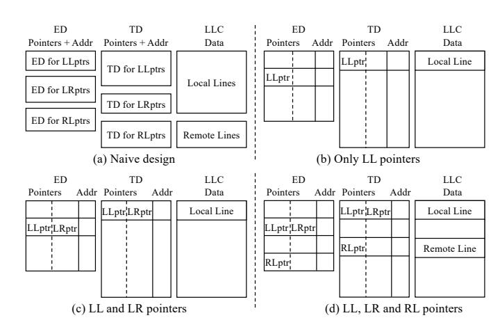

# *B. Basics of the Dorado Coherence Protocol*

A directory slice S in a cluster may need to maintain the following different types of sharer pointers:

- *Local-Local pointer (LLptr) for a local line cached in a local core.* This is a line whose Global home slice is S and is cached in a core in the local cluster. As shown in Table [II,](#page-4-0) the sharer pointer in S that tracks the sharer of the line contains a local core ID.
- *Local-Remote pointer (LRptr) for a local line cached in a remote core.* This is a line whose Global home slice is S and is cached in a core at a remote cluster. The line has a directory entry both in S (its Global home) and in the cluster of the sharer core (a Temporary home). The pointer in S is an *LRptr* and contains a remote cluster ID (Table [II\)](#page-4-0).
- *Remote-Local pointer (RLptr) for a remote line cached in a local core.* This is a line whose Global home slice is in a remote cluster and is cached in a core in the local cluster. S is a Temporary home slice for the line. The line has a directory entry in S and in its (remote) Global home slice. The pointer in S is called *RLptr* and contains a local core ID (Table [II\)](#page-4-0).
- 1. Dynamic Apportioning: Combining Different Data and Pointer Types. A naive design would break a directory-LLC slice into several structures, one for each of the types of data and pointers that exist in Dorado: EDs for LLptrs, LRptrs, and RLptrs; TDs for LLptrs, LRptrs, and RLptrs; and even LLC partitions for local and remote lines. This is shown in Figure [6\(](#page-4-1)a). Unfortunately, it would be hard to size each structure. Given the variation that exists across applications (Figure [4\)](#page-3-2), any sizes we pick would be suboptimal for many applications. Instead, Dorado assigns all the types of data and pointers to the same hardware structure, and lets each type of data and pointer *compete* for space dynamically. During execution, space will be continuously re-assigned dynamically. We call this idea *Dynamic Apportioning*.

To see how this works, assume that a local core accesses a local line. A local directory slice creates an entry with an LLptr. Depending on the directory allocation algorithm, the entry is created in either TD or ED. Figure [6\(](#page-4-1)b) shows both cases: a TD entry with LLptr and associated LLC entry with the local line, and an ED entry with LLptr without any associated LLC entry. Now, suppose that the lines tracked by

Fig. 6. A directory-LLC slice in *Dorado*.

these directory entries are also accessed by a remote core. The directories need to record this with an LRptr. Hence, we place the LRptr in one of the unused pointers of the same directory entries. This is shown in Figure [6\(](#page-4-1)c). All we need is a way to distinguish the two pointer types, since one is a local core ID and the other a remote cluster ID. We do so with one extra bit per pointer. For example, if the machine has 32 clusters with 32 cores each, each pointer is 6 bits: 1 to tell the pointer type and 5 to tell the core ID or cluster ID.

Suppose a core accesses a remote line. Dorado allocates a Temporary home directory entry in one of the local slices (e.g., the one we have considered in the example) and tracks the sharer with an RLptr. Again, the new directory entry can go to TD or ED. Figure [6\(](#page-4-1)d) shows the two cases.

For the TD and ED, sizing the total number of pointers per directory entry is less onerous than sizing the number of LLptrs and the number of LRptrs separately in two structures. Given a total number of pointers, workloads with mostly local sharers will fill them with LLptrs, while those with mostly remote sharers will fill them with LRptrs. Similarly, sizing the total number of TD (and ED) entries is easier than sizing the number of entries with local data and the number of entries with remote data separately in two structures. We can size the total number of entries based on the estimated working set of the local threads, and dynamically handle workloads with mostly local or with mostly remote lines in it.

2. Operation with Two-Level Homes (TLH). To understand how the TLH idea works, consider the clustered machine of Figure [7\(](#page-5-0)a). While each cluster has multiple directory-LLC slices, for simplicity, we only show one in each cluster. A core in the left cluster initiates a write miss to a line whose Global home is remote.

Dorado first checks the local directory-LLC slice that may contain the Temporary home entry for the line. If there is no entry for the line (or its state is such that the transaction cannot be satisfied locally), the Global home is accessed. When the Global home responds, a directory entry for the line is created in the Temporary home if it did not exist. In this transaction, the directory-LLC entries for the line in *both* the Temporary and Global homes are updated, so that future accesses to the line from local cores have a higher chance of being satisfied

Fig. 7. Operation of the Two-Level Homes (TLH) in Dorado.

by the Temporary home: e.g., if the line is brought locally in state Modified (M), a future write from *another* local core does not access the Global home (Figure 7(b)).

Some transactions require accesses to third clusters—e.g., writing to a remote line that is cached in M state in a third cluster (Figure 7(c)). In this case, there is a Temporary home directory entry for the line in that cluster, and is also accessed. This is a 4-cluster crossing transaction that can be optimized to 3 crossings like prior NUMA protocols [36]. The directories in the Global and the two Temporary homes are updated.

Accessing multiple directory entries (Temporary and Global homes) for a line in a transaction does not cause inconsistency or deadlock. Inconsistency is avoided since, when accessing multiple homes, the serialization point is the directory entry in the Global home. Deadlock is avoided since, given a transaction T that may change the state of the Global home, T cannot lock any resource in a Temporary home until T has reached and successfully locked the entry in the Global home. An example is shown in the write of Figure 8(b) in Section IV-C.3. The reason is that such transaction may be unable to lock the Global home entry because another transaction to the same line has already locked it.

#### C. Detailed Operation of Dorado

Given a requester core in a cluster C, we say that a line is local if its Global home is in C. Also, local L2s, LLC, and directory are those in C. We do not use the word slice when referring to the directory and LLC, but it is implied. Further, we use directory to mean the combined ED and TD. Due to the ED, it is possible that a line has a directory entry in a cluster but the line is not present in the LLC of that cluster.

For simplicity, we describe Dorado using MSI coherence, although our evaluation uses MESI. Also for simplicity, when a core writes to a cached line in Shared (S) state, the transaction is similar to a write miss—i.e., the response brings the line rather than just a *grant*.

Dorado introduces a change to MSI/MESI. Specifically, consider a core that writes to a remote line, after which Dorado creates a Temporary home entry in the local directory with D=1. If a second local core reads the line, one could transfer

| A1: Local line and | Get line from local DRAM. Create dir entry locally. Add       |
|--------------------|---------------------------------------------------------------|
| no local dir entry | LLptr and D=0.                                                |
| A2: Remote line    | Access the Global home and do: {If dir entry does not exist,  |
| and no local dir   | get line from DRAM and create dir entry with D=0. Always,     |
| entry              | add LRptr to dir entry}. Bring line from remote cluster.      |
|                    | Create dir entry locally. Add RLptr and D=0.                  |
| A3: Local dir en-  | Get line from local LLC, another local L2, or one of the      |
| try with any com-  | remote sharer clusters. In local dir entry, add LLptr.        |
| bination of LLptrs |                                                               |
| and LRptrs         |                                                               |
| A4: Local dir en-  | Get line from local LLC, another local L2, the Global home,   |
| try with RLptrs    | or one of the remote sharer clusters. In local dir entry, add |
|                    | RLptr.                                                        |

the updated line to the Global home to update memory, and change both the Global and Temporary home directory entries of the line to D=0. To avoid this transfer, Dorado instead keeps D=1 in the Temporary home directory entry, but marks both local cores as keeping the dirty line (with RLptrs pointers). Both cores mark the line in their cache with a new cache state: ModifiedShared (MS). We say that they are sharers of the dirty remote line. If one of the cores later writes the line, it invalidates the other and sets its cache to the conventional M state. This design avoids remote transfers.

We now describe the protocol by considering all 4 types of misses in the last level of private cache (i.e., L2). When we create a Global or a Temporary home entry in a TD, we always insert the data line into the corresponding LLC entry. For brevity, this is not explicitly repeated every time.

1. Core Read Miss in L2 and Line not Modified Anywhere. Table III shows the four possible transactions. If the requested line is local and there is no local directory (dir) entry for it, the L2 gets the line from the local DRAM, and the hardware creates a dir entry locally, setting the Dirty (D) bit to 0 and adding an LLptr. If, instead, the line is remote and there is no local dir entry for it, the transaction accesses the Global home of the line and creates a Global dir entry if none exists. The Global dir entry adds an LRptr. Then, the transaction brings the line to the local cluster, where it creates a Temporary home: a dir entry with an RLptr and D=0.

The other cases are when there is already a local dir entry for the line. If the entry has any combination of LLptrs and LRptrs, the L2 gets the line from either the local LLC, another local L2, or one of the remote sharer clusters, in that priority order. In the local dir entry, the hardware adds an LLptr. If, instead, the entry has RLptrs, the L2 gets the line from either the local LLC, another local L2, the Global home, or one of the remote sharer clusters, in that priority order. In the local dir entry, the hardware adds an RLptr.

# *B. Basics of the Dorado Coherence Protocol*

A directory slice S in a cluster may need to maintain the following different types of sharer pointers:

- *Local-Local pointer (LLptr) for a local line cached in a local core.* This is a line whose Global home slice is S and is cached in a core in the local cluster. As shown in Table [II,](#page-4-0) the sharer pointer in S that tracks the sharer of the line contains a local core ID.
- *Local-Remote pointer (LRptr) for a local line cached in a remote core.* This is a line whose Global home slice is S and is cached in a core at a remote cluster. The line has a directory entry both in S (its Global home) and in the cluster of the sharer core (a Temporary home). The pointer in S is an *LRptr* and contains a remote cluster ID (Table [II\)](#page-4-0).
- *Remote-Local pointer (RLptr) for a remote line cached in a local core.* This is a line whose Global home slice is in a remote cluster and is cached in a core in the local cluster. S is a Temporary home slice for the line. The line has a directory entry in S and in its (remote) Global home slice. The pointer in S is called *RLptr* and contains a local core ID (Table [II\)](#page-4-0).
- 1. Dynamic Apportioning: Combining Different Data and Pointer Types. A naive design would break a directory-LLC slice into several structures, one for each of the types of data and pointers that exist in Dorado: EDs for LLptrs, LRptrs, and RLptrs; TDs for LLptrs, LRptrs, and RLptrs; and even LLC partitions for local and remote lines. This is shown in Figure [6\(](#page-4-1)a). Unfortunately, it would be hard to size each structure. Given the variation that exists across applications (Figure [4\)](#page-3-2), any sizes we pick would be suboptimal for many applications. Instead, Dorado assigns all the types of data and pointers to the same hardware structure, and lets each type of data and pointer *compete* for space dynamically. During execution, space will be continuously re-assigned dynamically. We call this idea *Dynamic Apportioning*.

To see how this works, assume that a local core accesses a local line. A local directory slice creates an entry with an LLptr. Depending on the directory allocation algorithm, the entry is created in either TD or ED. Figure [6\(](#page-4-1)b) shows both cases: a TD entry with LLptr and associated LLC entry with the local line, and an ED entry with LLptr without any associated LLC entry. Now, suppose that the lines tracked by

Fig. 6. A directory-LLC slice in *Dorado*.

these directory entries are also accessed by a remote core. The directories need to record this with an LRptr. Hence, we place the LRptr in one of the unused pointers of the same directory entries. This is shown in Figure [6\(](#page-4-1)c). All we need is a way to distinguish the two pointer types, since one is a local core ID and the other a remote cluster ID. We do so with one extra bit per pointer. For example, if the machine has 32 clusters with 32 cores each, each pointer is 6 bits: 1 to tell the pointer type and 5 to tell the core ID or cluster ID.

Suppose a core accesses a remote line. Dorado allocates a Temporary home directory entry in one of the local slices (e.g., the one we have considered in the example) and tracks the sharer with an RLptr. Again, the new directory entry can go to TD or ED. Figure [6\(](#page-4-1)d) shows the two cases.

For the TD and ED, sizing the total number of pointers per directory entry is less onerous than sizing the number of LLptrs and the number of LRptrs separately in two structures. Given a total number of pointers, workloads with mostly local sharers will fill them with LLptrs, while those with mostly remote sharers will fill them with LRptrs. Similarly, sizing the total number of TD (and ED) entries is easier than sizing the number of entries with local data and the number of entries with remote data separately in two structures. We can size the total number of entries based on the estimated working set of the local threads, and dynamically handle workloads with mostly local or with mostly remote lines in it.

2. Operation with Two-Level Homes (TLH). To understand how the TLH idea works, consider the clustered machine of Figure [7\(](#page-5-0)a). While each cluster has multiple directory-LLC slices, for simplicity, we only show one in each cluster. A core in the left cluster initiates a write miss to a line whose Global home is remote.

Dorado first checks the local directory-LLC slice that may contain the Temporary home entry for the line. If there is no entry for the line (or its state is such that the transaction cannot be satisfied locally), the Global home is accessed. When the Global home responds, a directory entry for the line is created in the Temporary home if it did not exist. In this transaction, the directory-LLC entries for the line in *both* the Temporary and Global homes are updated, so that future accesses to the line from local cores have a higher chance of being satisfied

Fig. 7. Operation of the Two-Level Homes (TLH) in Dorado.

by the Temporary home: e.g., if the line is brought locally in state Modified (M), a future write from *another* local core does not access the Global home (Figure 7(b)).

Some transactions require accesses to third clusters—e.g., writing to a remote line that is cached in M state in a third cluster (Figure 7(c)). In this case, there is a Temporary home directory entry for the line in that cluster, and is also accessed. This is a 4-cluster crossing transaction that can be optimized to 3 crossings like prior NUMA protocols [36]. The directories in the Global and the two Temporary homes are updated.

Accessing multiple directory entries (Temporary and Global homes) for a line in a transaction does not cause inconsistency or deadlock. Inconsistency is avoided since, when accessing multiple homes, the serialization point is the directory entry in the Global home. Deadlock is avoided since, given a transaction T that may change the state of the Global home, T cannot lock any resource in a Temporary home until T has reached and successfully locked the entry in the Global home. An example is shown in the write of Figure 8(b) in Section IV-C.3. The reason is that such transaction may be unable to lock the Global home entry because another transaction to the same line has already locked it.

#### C. Detailed Operation of Dorado

Given a requester core in a cluster C, we say that a line is local if its Global home is in C. Also, local L2s, LLC, and directory are those in C. We do not use the word slice when referring to the directory and LLC, but it is implied. Further, we use directory to mean the combined ED and TD. Due to the ED, it is possible that a line has a directory entry in a cluster but the line is not present in the LLC of that cluster.

For simplicity, we describe Dorado using MSI coherence, although our evaluation uses MESI. Also for simplicity, when a core writes to a cached line in Shared (S) state, the transaction is similar to a write miss—i.e., the response brings the line rather than just a *grant*.

Dorado introduces a change to MSI/MESI. Specifically, consider a core that writes to a remote line, after which Dorado creates a Temporary home entry in the local directory with D=1. If a second local core reads the line, one could transfer

| A1: Local line and | Get line from local DRAM. Create dir entry locally. Add       |
|--------------------|---------------------------------------------------------------|
| no local dir entry | LLptr and D=0.                                                |
| A2: Remote line    | Access the Global home and do: {If dir entry does not exist,  |
| and no local dir   | get line from DRAM and create dir entry with D=0. Always,     |
| entry              | add LRptr to dir entry}. Bring line from remote cluster.      |
|                    | Create dir entry locally. Add RLptr and D=0.                  |
| A3: Local dir en-  | Get line from local LLC, another local L2, or one of the      |
| try with any com-  | remote sharer clusters. In local dir entry, add LLptr.        |
| bination of LLptrs |                                                               |
| and LRptrs         |                                                               |
| A4: Local dir en-  | Get line from local LLC, another local L2, the Global home,   |
| try with RLptrs    | or one of the remote sharer clusters. In local dir entry, add |
|                    | RLptr.                                                        |

the updated line to the Global home to update memory, and change both the Global and Temporary home directory entries of the line to D=0. To avoid this transfer, Dorado instead keeps D=1 in the Temporary home directory entry, but marks both local cores as keeping the dirty line (with RLptrs pointers). Both cores mark the line in their cache with a new cache state: ModifiedShared (MS). We say that they are sharers of the dirty remote line. If one of the cores later writes the line, it invalidates the other and sets its cache to the conventional M state. This design avoids remote transfers.

We now describe the protocol by considering all 4 types of misses in the last level of private cache (i.e., L2). When we create a Global or a Temporary home entry in a TD, we always insert the data line into the corresponding LLC entry. For brevity, this is not explicitly repeated every time.

1. Core Read Miss in L2 and Line not Modified Anywhere. Table III shows the four possible transactions. If the requested line is local and there is no local directory (dir) entry for it, the L2 gets the line from the local DRAM, and the hardware creates a dir entry locally, setting the Dirty (D) bit to 0 and adding an LLptr. If, instead, the line is remote and there is no local dir entry for it, the transaction accesses the Global home of the line and creates a Global dir entry if none exists. The Global dir entry adds an LRptr. Then, the transaction brings the line to the local cluster, where it creates a Temporary home: a dir entry with an RLptr and D=0.

The other cases are when there is already a local dir entry for the line. If the entry has any combination of LLptrs and LRptrs, the L2 gets the line from either the local LLC, another local L2, or one of the remote sharer clusters, in that priority order. In the local dir entry, the hardware adds an LLptr. If, instead, the entry has RLptrs, the L2 gets the line from either the local LLC, another local L2, the Global home, or one of the remote sharer clusters, in that priority order. In the local dir entry, the hardware adds an RLptr.

