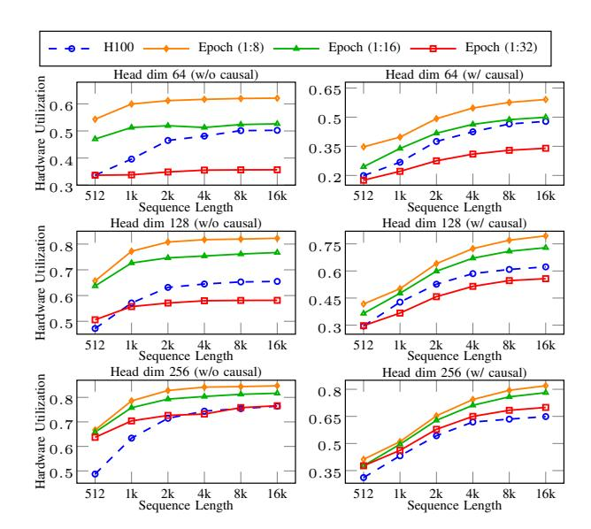

# *B. Case Study: FlashAttention-3 Pseudocode*

To demonstrate TISA's benefits, we will use the FlashAttention-3 kernel as an illustrative schematic. Figure 5 compares the CUDA pseudocode (left) with our TISAgenerated Epoch pseudocode (right).

The CUDA kernel fuses the QK⊤ multiply, scaling/masking, softmax, and V projection into a single kernel. It relies on manual thread-block decomposition, shared-memory staging, warp-level collectives, explicit barriers, and hand-tuned prefetching to form a static pipeline.

In contrast, the Epoch TISA kernel is automatically generated by the compiler and expressed entirely in TISA instructions. Each instruction is annotated with OpType, dependency descriptors, and resource mappings. At runtime, the per-core scheduler dynamically orchestrates ME/VE/DE execution by evaluating instruction readiness, implicitly managing synchronization, double-buffering, and heterogeneous overlap within the core-local memory hierarchy.

This case study highlights the paradigm shift from imperative, barrier-centric GPU programming to declarative, semantics-preserving TISA execution. In practice, the GPU kernel corresponds to the static execution patterns in Figure 2(b,d), while the TISA kernel achieves the dynamically overlapped patterns in Figure 2(c,e), attaining higher instruction-level parallelism. Quantitatively, the TISA kernel reduces code size by 30%, synchronization frequency by 50%, and achieves performance within 5% of hand-tuned baselines, all while being compiler-generated. By embedding synchronization semantics directly into the ISA, TISA eliminates manual orchestration and enables compiler-driven, architecture-independent performance portability.

#### VIII. EXPERIMENTAL VALIDATION

We evaluate the effectiveness of our framework across four representative deep learning workloads, including ResNet50, BERT-Base, GPT-J-6B, LLaMA2-13B and DeepSeek-R1-16B. We implement two backends (CPU and Epoch) but conduct experiments on four hardware platforms: Epoch(Silicon), NVIDIA H100, NVIDIA A100, and Intel Xeon. Table V summarizes the platform specifications. For NVIDIA GPUs, we use driver 550.127.0, CUDA 12.1, cuDNN 9.1.0, TensorRT 10.3.0 (for ResNet50/BERT-Base), and TensorRT-LLM 0.12.0 (for GPT-J/LLaMA2/DeepSeek-R1).

TABLE V: Experimental platform specifications.

| Platform  | Epoch      | H100      | A100      | Xeon 6348  |
|-----------|------------|-----------|-----------|------------|
| Arch      | X          | Hopper    | Ampere    | x86_64     |
| Cores     | 32 Cores   | 132 SMs   | 108 SMs   | 56 Cores   |
| Compute   | 256T FP16  | 989T FP16 | 312T FP16 | 9.2T FP32  |
| Memory    | 48GB GDDR6 | 80GB HBM3 | 40GB HBM2 | 512GB DDR4 |
| Bandwidth | 1TB/s      | 3.35TB/s  | 1.55TB/s  | 204.8GB/s  |

#### A. Results on the Epoch Platform

We first report results on the Epoch accelerator, where TISA serves as the standard software–hardware interface. Three configurations are compared to isolate the effects of semantic preservation and dynamic scheduling: (1) Naive TISA, which uses TISA only as a software–hardware interface and relies on explicit fence instructions to manually enforce dependencies between execution units, without reordering instructions; (2) TISA + Static, where TISA instructions are scheduled statically at compile time, as in conventional compiler flows, also employing fence-based manual dependency management but reordering instructions to improve parallelism across execution units; and (3) TISA + Dynamic, where TISA instructions are scheduled by our semantics-aware dynamic scheduler (Section V).

Naive employs basic optimization without hardwaremediated cross-unit scheduling. Static enforces multi-stage software pipelining (Figure 2(b,d)), representing the optimal compile-time strategy optimized for Epoch. *Dynamic* applies identical compiler optimizations but delegates execution tracking to the hardware scheduler, strictly isolating the benefit of latency-tolerant runtime issuance. All configurations share identical compiler-level optimizations (including instruction-level pipelining) and use the same underlying operator library to ensure fair comparison, isolating only the contribution of scheduling strategies. Table VI reports total execution cycles.

TABLE VI: Execution cycles on Epoch (smaller is better). M: million cycles; N: Naive; S: Static; D: Dynamic.

| Model          | Naive  | Static | Dynamic | S vs N        | D vs N        | D vs S        |
|----------------|--------|--------|---------|---------------|---------------|---------------|
| ResNet50       | 8.98M  | 8.72M  | 5.92M   | 1.03×         | 1.52×         | 1.47×         |
| BERT           | 13.16M | 11.94M | 7.37M   | $1.10 \times$ | $1.79 \times$ | $1.62 \times$ |
| GPTJ(oneblk)   | 14.44M | 13.54M | 8.30M   | $1.07 \times$ | $1.74 \times$ | $1.63 \times$ |
| LLaMA2(oneblk) | 25.85M | 15.29M | 13.47M  | 1.69×         | 1.92×         | $1.14 \times$ |

The Naive baseline confirms that our framework can correctly lower end-to-end workloads to executable TISA binaries, establishing functional correctness. Integrating a static scheduler (TISA+Static) reduces execution cycles by  $1.03-1.69\times$ , demonstrating that the semantic information retained by TISA can already assist compile-time optimization.

However, when combined with our dynamic scheduler (TISA+Dynamic), the benefits amplify significantly, yielding an additional  $1.14-1.63\times$  speedup over the static version. Overall, TISA with dynamic scheduling achieves  $1.52-1.92\times$  end-to-end performance improvement over the naive baseline. These results confirm that semantic preservation enables optimization at both compile-time and runtime, and that dynamic schedule can further exploit runtime variability beyond static.

Furthermore, the Accumulated Overlap Score in Table VII and Table VIII quantifies concurrency density by summing overlaps across pair-wise categories (DM, DV, MV, DMV); effectively exceeding total execution cycles owing to simultaneous three-way unit activation. Multi-core results report the arithmetic mean across all cores. These tables show that our dynamic scheduler consistently enables more cross-unit overlap than static pipeline scheduling, adapting decisions at runtime to actual data dependencies, memory availability, and execution readiness.

While static pipeline methods theoretically plan such offsets, identifying optimal bounds requires exhaustive multiparametric compile-time exploration or trades the search overhead via heuristics at the cost of sub-optimality. In contrast, dynamic scheduling leverages runtime semantics to opportunistically exploit safe parallelism, delivering superior utilization of heterogeneous compute units.

## B. Comparison with GPU Baselines

1) End-to-End Execution Latency: While the Epoch results in Section VIII-A demonstrate the internal contributions of TISA and dynamic scheduling, they do not directly quantify the advantage over state-of-the-art GPU systems. Meanwhile, although our dynamic scheduler conceptually generalizes to any heterogeneous accelerator, it cannot be directly

TABLE VII: Accumulated Overlap Score on engine (larger is better). N: Naive; S: Static; D: Dynamic; DM: data-matrix engine overlap; DV: data-vector engine overlap; MV: matrix-vector engine overlap; DMV: data-matrix-vector overlap. Because a single physical cycle where multiple units are simultaneously active contributes to multiple overlap categories, the accumulated score can exceed total execution cycles reported in Table VI.

| Model          | Naive  |        |        | Static |         |        | Dynamic |        |         |         |         |         |
|----------------|--------|--------|--------|--------|---------|--------|---------|--------|---------|---------|---------|---------|
|                | DM     | DV     | MV     | DMV    | DM      | DV     | MV      | DMV    | DM      | DV      | MV      | DMV     |
| ResNet50       | 723707 | 76864  | 291879 | 0      | 1320131 | 87160  | 321727  | 80877  | 1727358 | 306680  | 671217  | 130234  |
| BERT           | 24133  | 142857 | 243664 | 0      | 959895  | 198540 | 259273  | 33370  | 3033524 | 1469712 | 1867914 | 1129011 |
| GPTJ(oneblk)   | 45468  | 5581   | 84332  | 0      | 858258  | 67693  | 84115   | 0      | 4160114 | 190218  | 149977  | 67171   |
| LLaMA2(oneblk) | 111659 | 187473 | 233095 | 0      | 8472512 | 706636 | 636877  | 450134 | 9173782 | 811941  | 750138  | 566249  |

TABLE VIII: Accumulated Overlap Score on Epoch (larger is better). M: million cycles; N: Naive; S: Static; D: Dynamic. Values represent DM+DV+MV+DMV from Table VII.

| Model          | Naive | Static | Dynamic | S vs N         | D vs N         | D vs S        |
|----------------|-------|--------|---------|----------------|----------------|---------------|
| ResNet50       | 1.09M | 1.81M  | 2.84M   | 1.66×          | 2.60×          | 1.57×         |
| BERT           | 0.41M | 1.45M  | 7.50M   | $3.54 \times$  | $18.29 \times$ | 5.17×         |
| GPTJ(oneblk)   | 0.14M | 1.01M  | 4.57M   | $7.21 \times$  | $32.64 \times$ | $4.52 \times$ |
| LLaMA2(oneblk) | 0.53M | 10.27M | 11.30M  | $19.38 \times$ | $21.32 \times$ | $1.10 \times$ |

deployed on commercial GPUs. Contemporary GPUs expose only coarse-grained kernel and stream scheduling via fixed-function warp schedulers, which lack visibility into operator-or tile-level semantics. Their synchronization and dependency mechanisms (e.g., CUDA streams and barriers) are statically defined and inaccessible at runtime, preventing dynamic dependency resolution or per-unit arbitration. In contrast, our Epoch platform provides fine-grained control at tile granularity and exposes programmable issue queues, making it suitable for implementing our semantics-aware runtime scheduler.

To establish a fair performance baseline, we compare the execution latency of our TISA implementation on Epoch against NVIDIA A100 and H100 GPUs running optimized TensorRT configurations. Table IX summarizes the results.

TABLE IX: Execution latency comparison (lower is better).

| Model           | Configuration                    | Epoch   | A100    | Speedup |
|-----------------|----------------------------------|---------|---------|---------|
| ResNet50        | FP16, batch=128, 224×224         | 6.2ms   | 9.3ms   | 1.50×   |
| BERT-Base       | FP16, batch=64, seq=128          | 7.5ms   | 9.8ms   | 1.31×   |
| GPT-J-6B        | FP16, batch=1, seq=512, prefill  | 29.9ms  | 37.3ms  | 1.25×   |
| LLaMA2-13B      | FP16, batch=1, seq=512, prefill  | 54.0ms  | 77.1ms  | 1.43×   |
| DeepSeek-R1-16B | BF16, batch=50, seq=100, prefill | 213.5ms | 412.3ms | 1.93×   |
| DeepSeek-R1-16B | BF16, batch=50, seq=700, decode  | 51.2ms  | 69.0ms  | 1.35×   |

As shown in Table V, the NVIDIA A100 offers substantially higher peak compute throughput than Epoch. Consequently, conventional wisdom suggests that A100, especially under TensorRT's advanced static scheduler, should outperform a smaller accelerator. Despite this hardware disadvantage, our TISA framework on Epoch achieves an average  $1.46 \times$  latency reduction compared to TensorRT on the A100.

This result highlights a key insight: dynamic scheduling can unlock runtime parallelism beyond what even state-of-the-art static GPU schedulers can expose. By reacting to instantaneous hardware conditions and typed dependency readiness, our runtime overlaps tensor, vector, and DMA tiles

more effectively, translating into shorter end-to-end latency despite lower peak FLOPs.

2) FlashAttention-3 Performance Analysis: We further evaluate the framework on FlashAttention-3 [33], a hand-optimized GPU kernel that represents the state of the art for transformer attention workloads. This benchmark is especially relevant as it stresses cross-unit coordination between GEMM, softmax, and memory operations, an ideal testbed for assessing the benefits of semantics-aware dynamic scheduling.

We compare the sustained BF16 throughput of FlashAttention-3 on Epoch (TISA-based implementation) and NVIDIA H100 across sequence lengths from 512 to 16K tokens, both with and without causal masking. Epoch is evaluated under multiple vector-to-matrix dense compute ratios (1:8, 1:16, 1:32), while H100 operates at its native 1:8 ratio. The results (Hardware utilization =  $\frac{Achieved\ GFLOPs}{Peak\ GFLOPs}$ ) are illustrated in Figure 6.

Fig. 6: Performance comparison of FlashAttention-3 on Epoch and H100. Hardware utilization is measured across varying sequence lengths and head dimensions. Left: non-causal attention; Right: causal attention. H100 results are from FlashAttention-3 [33], a highly optimized implementation.

Under the matched 1:8 BF16 ratio, the TISA implementa-

tion on Epoch achieves over 10% higher hardware utilization across all evaluated sequence lengths, and 26.4% higher utilization in the mainstream configuration (head dim 128). Even when the compute ratio is reduced to 1:16, Epoch maintains a 15.7% advantage, while at 1:32, utilization remains comparable to H100 in several configurations.

These gains are achieved despite Epoch's significantly lower memory bandwidth (1.0 TB/s vs. 3.35 TB/s on H100), demonstrating that improved scheduling efficiency, not raw hardware capability, drives the performance improvement. The TISA runtime effectively overlaps GEMM–Softmax–GEMM tiles across iterations, whereas FlashAttention-3's static fusion pipeline enforces strict per-iteration synchronization. This confirms that TISA's semantic descriptors and dynamic scheduler realize the execution pattern illustrated in Figure 2(e), achieving parallelism that is unattainable for current statically pipelined fused GPU kernels(Figure 2(d)).

While H100 FA3 employs advanced mechanisms (TMA, WGMMA, bar.sync) to maintain a warp-specialized pipeline [33], its synchronization remains *statically fixed*. If TMA operations stall natively, dependent consumer sequences unconditionally block. By contrast, TISA adapts sequence issuance to precise readiness trajectories, delivering superior normalized utilization despite an architectural 3.35× memory bandwidth disadvantage relative to H100. The TISA scheduling principles are applicable to other accelerators.

These results collectively show that TISA's semantics-aware dynamic scheduling bridges the gap between static compiler fusion and true runtime adaptability. Even when operating on hardware with lower theoretical FLOPs and memory bandwidth, the Epoch achieves competitive or superior performance compared to high-end GPUs, validating that semantics-guided runtime scheduling (not brute-force compute density) is the key to sustained utilization at scale.

## C. Portability

Building on Section VIII-A, this section evaluates TISA's applicability on CPUs, where dynamic scheduling is unavailable. This study isolates the benefits of semantic-guided compilation from runtime scheduling, confirming that TISA's design principles remain architecture-agnostic. Even in homogeneous CPU environments, preserving operator semantics can inform compile-time optimizations, yielding measurable performance improvements.

We compare two CPU implementations: (1) Torch-Manual, which uses the standard PyTorch operator composition without semantic guidance, representing conventional framework-based execution; and (2) Triton-TISA, which introduces TISA's semantic abstraction layer to inform compile-time optimizations such as kernel fusion, loop ordering, and memory locality. Both implementations rely on the same PyTorch operator library, ensuring a fair comparison that isolates the contribution of semantic guidance. We measure execution time across three representative workloads (ResNet50, BERT, and LLaMA2) at both layer and full-model granularity. For decoder-only Transformer architectures, we select LLaMA2 as

the representative workload, as its architectural optimizations (e.g., RMSNorm, SwiGLU activation, and rotary positional embeddings) make it more efficient than GPT-J while maintaining comparable model complexity. Figure 7 reports the execution time of these two implementations.

Fig. 7: Comparison of execution times (in milliseconds) between Triton-TISA and Torch-Manual.

Across all workloads, TISA-guided compilation achieves consistent improvements: ResNet50 gains 1.13–1.19×, BERT 1.02–1.20×, and LLaMA2 1.14–1.18× speedups over Torch-Manual. These results confirm that TISA's semantic information effectively guides compile-time optimizations even in the absence of runtime scheduling.

This result resonates with GPU-side tile programming frameworks such as Triton [40], TileLang [43], and ThunderKittens [34], which use tile abstractions to enhance efficiency and programmability. On CPUs, TISA serves an analogous role by leveraging semantics to inform the compiler's optimization passes, thereby improving performance through structured, tile-level reasoning rather than specialized hardware features.

## IX. RELATED WORK

This section positions our framework within the broader landscape of AI accelerator research. We analyze three key areas: instruction-level parallelism, dynamic scheduling approaches, and semantics-aware compilation frameworks, with particular focus on semantic granularity and runtime scheduling capabilities that distinguish TISA from prior work.

Classical ILP schedulers, e.g., Tomasulo [41] and score-boarding [39], enable dynamic scheduling in CPUs but rely on register-level dependency tracking insufficient for AI accelerators. Recent ILP approaches targeting AI accelerator like Mosaic [44], LLVA [2], SISA [4], TPP [14] and Cambricon [9] achieve limited improvements through reconfigurable architectures and manual optimizations but remain fundamentally static. Our framework differs by enabling dynamic tile scheduling through semantics-aware instruction formats that preserve operator context, typed dependencies, and resource requirements for runtime decision-making.

Existing dynamic scheduling approaches have fundamental limitations: GPU hardware scheduling (warp/CTA) [21] operates at thread-level with limited cross-unit semantic visibility, while task-based tensor systems [45] use compile-time static solutions to compensate for hardware's inability to perform

cross-unit scheduling dynamically. This static approach inherently limits runtime adaptability.

Modulo scheduling [32] overlaps fixed loop components gracefully on predictable CPU architectures with hardware predication [5]. TISA tackles the contrasting non-deterministic latency constraints intrinsic to modern multi-engine AI accelerators, where purely static methods inevitably falter.

Task Superscalar [12] implements coarse-grained, dependence-driven execution as a hardware out-of-order task pipeline on homogeneous CPU cores. TISA addresses a different target and setting: AI accelerators, where a tile-level ISA lets hardware automatically schedule concurrent work across heterogeneous tensor, vector, and DMA engines as dependences become ready. Our work enables runtime cross-unit coordination through co-designed instruction format, semantic interface, and hardware scheduler operating at instruction granularity with operator-level semantic context.

Our TISA abstraction differs fundamentally from virtual ISAs like NVIDIA PTX [29] in abstraction granularity. PTX operates at fine-grained instruction level (e.g., add.f32, ld.global), abstracting hardware differences beneath the instruction level through driver translation to native ISA. In contrast, TISA operates at tile level, with each instruction representing semantically rich computational tiles (e.g., tisa::gemm<me>, tisa::softmax<ve>) that preserve operator semantics, dependencies, and resource requirements. This allows our work to maintain scheduling-critical semantics that fine-grained ISAs necessarily erase, making dynamic cross-operator scheduling feasible.

Domain-specific ISAs (Cambricon [9], TPU [20], IPU [19]) specify what runs where; cross-tile ordering is enforced with fences or BSP-style barriers. cuTile [30] is likewise compile-time fixed: barriers (e.g., bar.sync) pin issue order, so hardware cannot reorder on readiness. TISA adds scheduling semantics consumed by the scheduler to issue tiles when dependences clear, not only at static barrier positions.

As a summary, Table X compares TISA with existing approaches across dimensions affecting scheduling capabilities.

TABLE X: TISA's position in the field of ILP scheduling.

| Approach        | Semantic at | Schedule at | Runtime | Cross-Unit  | HW Require    |
|-----------------|-------------|-------------|---------|-------------|---------------|
| CPU             | Register    | Instruction | Yes     | Single unit | Complex logic |
| Triton/TileLang | Tile        | Warp/CTA    | No      | No          | Minimal       |
| ThunderKittens  | Tile        | Warp/CTA    | No      | No          | Minimal       |
| TensorIR/TVM    | Operator    | Thread      | No      | No          | Minimal       |
| MLIR HLO        | Operator    | Kernel      | No      | No          | Minimal       |
| GPU Sched       | Thread      | Warp/CTA    | Yes     | Limited     | HW scheduler  |
| TISA            | Tile        | Instruction | Yes     | Yes         | HW scheduler  |

We categorize existing approaches into two groups: (1) coarse-grained programming approaches like Triton [40], Tile-Lang [43], and ThunderKittens [34] preserve semantics but lack runtime adaptation, and (2) fine-grained hardware methods (CPU or GPU warp schedulers) offer runtime adaptation but insufficient semantic context for cross-unit coordination. Our framework uniquely combines tile-level semantic preservation with instruction-granularity runtime scheduling, enabling cross-heterogeneous unit coordination that existing

approaches cannot achieve due to semantic limitations or granularity mismatches.

Additionally, the semantic interface and scheduler of our framework are retrofittable to other architectures. On NVIDIA GPUs, a semantics-aware coordinator can sit above the warp/CTA scheduler to manage cross-unit dependencies without changing warp scheduling. For domain-specific accelerators, TISA can serve as a thin hardware wrapper over the native ISA: native per-unit instructions run unchanged, while TISA supplies semantics for dynamic scheduling.

#### X. CONCLUSION

We addressed underutilization rooted in static scheduling by co-designing three pieces that expose runtime-visible scheduling semantics: a tile-level instruction set (TISA, Section IV), a semantics-aware dynamic tile scheduler (Section V), and a semantics-preserving compiler (Section VI). This makes operator/tile boundaries, typed dependencies with readiness, resource intents, and tile memory ranges consumable at runtime for overlap and reordering across heterogeneous units.

Across ResNet50, BERT, GPT-J, LLaMA2 and DeepSeek-R1 on Epoch, NVIDIA H100, and A100 GPUs, the approach delivers 1.52–1.92× over the baselines; on FlashAttention-3 it achieves approximately 26.4% higher matrix-unit utilization at head dim 128. These results indicate that restoring scheduling semantics enables cross-operator and crossiteration overlap beyond fixed-template static approaches at runtime (Section IX), and that shifting a constrained slice of scheduling to runtime improves usability: runtime-visible semantics remove most manual barriers and cross-unit pipelines, while the scheduler absorbs hardware/workload drift to ease retuning and portability across accelerators.

Our approach introduces modest per-core hardware overhead: a dedicated scheduler occupies a small amount of silicon area, reflecting a deliberate trade-off of scheduling logic versus additional compute units for higher utilization and simpler software. End-to-end performance also depends on the quality of the underlying tile-level operator library, which can limit realized gains from dynamic scheduling. Nevertheless, these trade-offs are acceptable given the substantial utilization improvements and programming simplicity demonstrated.

Our framework has two limitations. First, *tile-level granularity* may be insufficient for operations that need sub-tile control (e.g., irregular sparse patterns), in which case execution may fall back to native per-unit instructions. Second, purely memory-bound workloads with minimal cross-unit overlap see limited benefit. We plan to expand TileMem support for stride access and dependence analysis in the scheduler, broaden workload coverage, and extend the work to training and distributed settings, as well as tighter integration with emerging compiler stacks and autotuning frameworks.

#### XI. ACKNOWLEDGMENTS

We thank reviewers for constructive feedback and coauthors for contributions and discussions. This work was partially supported by the National Natural Science Foundation of China under Grant Nos. T2422007 and U24A20235.

# *B. Case Study: FlashAttention-3 Pseudocode*

To demonstrate TISA's benefits, we will use the FlashAttention-3 kernel as an illustrative schematic. Figure 5 compares the CUDA pseudocode (left) with our TISAgenerated Epoch pseudocode (right).

The CUDA kernel fuses the QK⊤ multiply, scaling/masking, softmax, and V projection into a single kernel. It relies on manual thread-block decomposition, shared-memory staging, warp-level collectives, explicit barriers, and hand-tuned prefetching to form a static pipeline.

In contrast, the Epoch TISA kernel is automatically generated by the compiler and expressed entirely in TISA instructions. Each instruction is annotated with OpType, dependency descriptors, and resource mappings. At runtime, the per-core scheduler dynamically orchestrates ME/VE/DE execution by evaluating instruction readiness, implicitly managing synchronization, double-buffering, and heterogeneous overlap within the core-local memory hierarchy.

This case study highlights the paradigm shift from imperative, barrier-centric GPU programming to declarative, semantics-preserving TISA execution. In practice, the GPU kernel corresponds to the static execution patterns in Figure 2(b,d), while the TISA kernel achieves the dynamically overlapped patterns in Figure 2(c,e), attaining higher instruction-level parallelism. Quantitatively, the TISA kernel reduces code size by 30%, synchronization frequency by 50%, and achieves performance within 5% of hand-tuned baselines, all while being compiler-generated. By embedding synchronization semantics directly into the ISA, TISA eliminates manual orchestration and enables compiler-driven, architecture-independent performance portability.

#### VIII. EXPERIMENTAL VALIDATION

We evaluate the effectiveness of our framework across four representative deep learning workloads, including ResNet50, BERT-Base, GPT-J-6B, LLaMA2-13B and DeepSeek-R1-16B. We implement two backends (CPU and Epoch) but conduct experiments on four hardware platforms: Epoch(Silicon), NVIDIA H100, NVIDIA A100, and Intel Xeon. Table V summarizes the platform specifications. For NVIDIA GPUs, we use driver 550.127.0, CUDA 12.1, cuDNN 9.1.0, TensorRT 10.3.0 (for ResNet50/BERT-Base), and TensorRT-LLM 0.12.0 (for GPT-J/LLaMA2/DeepSeek-R1).

TABLE V: Experimental platform specifications.

| Platform  | Epoch      | H100      | A100      | Xeon 6348  |
|-----------|------------|-----------|-----------|------------|
| Arch      | X          | Hopper    | Ampere    | x86_64     |
| Cores     | 32 Cores   | 132 SMs   | 108 SMs   | 56 Cores   |
| Compute   | 256T FP16  | 989T FP16 | 312T FP16 | 9.2T FP32  |
| Memory    | 48GB GDDR6 | 80GB HBM3 | 40GB HBM2 | 512GB DDR4 |
| Bandwidth | 1TB/s      | 3.35TB/s  | 1.55TB/s  | 204.8GB/s  |

#### A. Results on the Epoch Platform

We first report results on the Epoch accelerator, where TISA serves as the standard software–hardware interface. Three configurations are compared to isolate the effects of semantic preservation and dynamic scheduling: (1) Naive TISA, which uses TISA only as a software–hardware interface and relies on explicit fence instructions to manually enforce dependencies between execution units, without reordering instructions; (2) TISA + Static, where TISA instructions are scheduled statically at compile time, as in conventional compiler flows, also employing fence-based manual dependency management but reordering instructions to improve parallelism across execution units; and (3) TISA + Dynamic, where TISA instructions are scheduled by our semantics-aware dynamic scheduler (Section V).

Naive employs basic optimization without hardwaremediated cross-unit scheduling. Static enforces multi-stage software pipelining (Figure 2(b,d)), representing the optimal compile-time strategy optimized for Epoch. *Dynamic* applies identical compiler optimizations but delegates execution tracking to the hardware scheduler, strictly isolating the benefit of latency-tolerant runtime issuance. All configurations share identical compiler-level optimizations (including instruction-level pipelining) and use the same underlying operator library to ensure fair comparison, isolating only the contribution of scheduling strategies. Table VI reports total execution cycles.

TABLE VI: Execution cycles on Epoch (smaller is better). M: million cycles; N: Naive; S: Static; D: Dynamic.

| Model          | Naive  | Static | Dynamic | S vs N        | D vs N        | D vs S        |
|----------------|--------|--------|---------|---------------|---------------|---------------|
| ResNet50       | 8.98M  | 8.72M  | 5.92M   | 1.03×         | 1.52×         | 1.47×         |
| BERT           | 13.16M | 11.94M | 7.37M   | $1.10 \times$ | $1.79 \times$ | $1.62 \times$ |
| GPTJ(oneblk)   | 14.44M | 13.54M | 8.30M   | $1.07 \times$ | $1.74 \times$ | $1.63 \times$ |
| LLaMA2(oneblk) | 25.85M | 15.29M | 13.47M  | 1.69×         | 1.92×         | $1.14 \times$ |

The Naive baseline confirms that our framework can correctly lower end-to-end workloads to executable TISA binaries, establishing functional correctness. Integrating a static scheduler (TISA+Static) reduces execution cycles by  $1.03-1.69\times$ , demonstrating that the semantic information retained by TISA can already assist compile-time optimization.

However, when combined with our dynamic scheduler (TISA+Dynamic), the benefits amplify significantly, yielding an additional  $1.14-1.63\times$  speedup over the static version. Overall, TISA with dynamic scheduling achieves  $1.52-1.92\times$  end-to-end performance improvement over the naive baseline. These results confirm that semantic preservation enables optimization at both compile-time and runtime, and that dynamic schedule can further exploit runtime variability beyond static.

Furthermore, the Accumulated Overlap Score in Table VII and Table VIII quantifies concurrency density by summing overlaps across pair-wise categories (DM, DV, MV, DMV); effectively exceeding total execution cycles owing to simultaneous three-way unit activation. Multi-core results report the arithmetic mean across all cores. These tables show that our dynamic scheduler consistently enables more cross-unit overlap than static pipeline scheduling, adapting decisions at runtime to actual data dependencies, memory availability, and execution readiness.

While static pipeline methods theoretically plan such offsets, identifying optimal bounds requires exhaustive multiparametric compile-time exploration or trades the search overhead via heuristics at the cost of sub-optimality. In contrast, dynamic scheduling leverages runtime semantics to opportunistically exploit safe parallelism, delivering superior utilization of heterogeneous compute units.

## B. Comparison with GPU Baselines

1) End-to-End Execution Latency: While the Epoch results in Section VIII-A demonstrate the internal contributions of TISA and dynamic scheduling, they do not directly quantify the advantage over state-of-the-art GPU systems. Meanwhile, although our dynamic scheduler conceptually generalizes to any heterogeneous accelerator, it cannot be directly

TABLE VII: Accumulated Overlap Score on engine (larger is better). N: Naive; S: Static; D: Dynamic; DM: data-matrix engine overlap; DV: data-vector engine overlap; MV: matrix-vector engine overlap; DMV: data-matrix-vector overlap. Because a single physical cycle where multiple units are simultaneously active contributes to multiple overlap categories, the accumulated score can exceed total execution cycles reported in Table VI.

| Model          | Naive  |        |        | Static |         |        | Dynamic |        |         |         |         |         |
|----------------|--------|--------|--------|--------|---------|--------|---------|--------|---------|---------|---------|---------|
|                | DM     | DV     | MV     | DMV    | DM      | DV     | MV      | DMV    | DM      | DV      | MV      | DMV     |
| ResNet50       | 723707 | 76864  | 291879 | 0      | 1320131 | 87160  | 321727  | 80877  | 1727358 | 306680  | 671217  | 130234  |
| BERT           | 24133  | 142857 | 243664 | 0      | 959895  | 198540 | 259273  | 33370  | 3033524 | 1469712 | 1867914 | 1129011 |
| GPTJ(oneblk)   | 45468  | 5581   | 84332  | 0      | 858258  | 67693  | 84115   | 0      | 4160114 | 190218  | 149977  | 67171   |
| LLaMA2(oneblk) | 111659 | 187473 | 233095 | 0      | 8472512 | 706636 | 636877  | 450134 | 9173782 | 811941  | 750138  | 566249  |

TABLE VIII: Accumulated Overlap Score on Epoch (larger is better). M: million cycles; N: Naive; S: Static; D: Dynamic. Values represent DM+DV+MV+DMV from Table VII.

| Model          | Naive | Static | Dynamic | S vs N         | D vs N         | D vs S        |
|----------------|-------|--------|---------|----------------|----------------|---------------|
| ResNet50       | 1.09M | 1.81M  | 2.84M   | 1.66×          | 2.60×          | 1.57×         |
| BERT           | 0.41M | 1.45M  | 7.50M   | $3.54 \times$  | $18.29 \times$ | 5.17×         |
| GPTJ(oneblk)   | 0.14M | 1.01M  | 4.57M   | $7.21 \times$  | $32.64 \times$ | $4.52 \times$ |
| LLaMA2(oneblk) | 0.53M | 10.27M | 11.30M  | $19.38 \times$ | $21.32 \times$ | $1.10 \times$ |

deployed on commercial GPUs. Contemporary GPUs expose only coarse-grained kernel and stream scheduling via fixed-function warp schedulers, which lack visibility into operator-or tile-level semantics. Their synchronization and dependency mechanisms (e.g., CUDA streams and barriers) are statically defined and inaccessible at runtime, preventing dynamic dependency resolution or per-unit arbitration. In contrast, our Epoch platform provides fine-grained control at tile granularity and exposes programmable issue queues, making it suitable for implementing our semantics-aware runtime scheduler.

To establish a fair performance baseline, we compare the execution latency of our TISA implementation on Epoch against NVIDIA A100 and H100 GPUs running optimized TensorRT configurations. Table IX summarizes the results.

TABLE IX: Execution latency comparison (lower is better).

| Model           | Configuration                    | Epoch   | A100    | Speedup |
|-----------------|----------------------------------|---------|---------|---------|
| ResNet50        | FP16, batch=128, 224×224         | 6.2ms   | 9.3ms   | 1.50×   |
| BERT-Base       | FP16, batch=64, seq=128          | 7.5ms   | 9.8ms   | 1.31×   |
| GPT-J-6B        | FP16, batch=1, seq=512, prefill  | 29.9ms  | 37.3ms  | 1.25×   |
| LLaMA2-13B      | FP16, batch=1, seq=512, prefill  | 54.0ms  | 77.1ms  | 1.43×   |
| DeepSeek-R1-16B | BF16, batch=50, seq=100, prefill | 213.5ms | 412.3ms | 1.93×   |
| DeepSeek-R1-16B | BF16, batch=50, seq=700, decode  | 51.2ms  | 69.0ms  | 1.35×   |

As shown in Table V, the NVIDIA A100 offers substantially higher peak compute throughput than Epoch. Consequently, conventional wisdom suggests that A100, especially under TensorRT's advanced static scheduler, should outperform a smaller accelerator. Despite this hardware disadvantage, our TISA framework on Epoch achieves an average  $1.46 \times$  latency reduction compared to TensorRT on the A100.

This result highlights a key insight: dynamic scheduling can unlock runtime parallelism beyond what even state-of-the-art static GPU schedulers can expose. By reacting to instantaneous hardware conditions and typed dependency readiness, our runtime overlaps tensor, vector, and DMA tiles

more effectively, translating into shorter end-to-end latency despite lower peak FLOPs.

2) FlashAttention-3 Performance Analysis: We further evaluate the framework on FlashAttention-3 [33], a hand-optimized GPU kernel that represents the state of the art for transformer attention workloads. This benchmark is especially relevant as it stresses cross-unit coordination between GEMM, softmax, and memory operations, an ideal testbed for assessing the benefits of semantics-aware dynamic scheduling.

We compare the sustained BF16 throughput of FlashAttention-3 on Epoch (TISA-based implementation) and NVIDIA H100 across sequence lengths from 512 to 16K tokens, both with and without causal masking. Epoch is evaluated under multiple vector-to-matrix dense compute ratios (1:8, 1:16, 1:32), while H100 operates at its native 1:8 ratio. The results (Hardware utilization =  $\frac{Achieved\ GFLOPs}{Peak\ GFLOPs}$ ) are illustrated in Figure 6.

Fig. 6: Performance comparison of FlashAttention-3 on Epoch and H100. Hardware utilization is measured across varying sequence lengths and head dimensions. Left: non-causal attention; Right: causal attention. H100 results are from FlashAttention-3 [33], a highly optimized implementation.

Under the matched 1:8 BF16 ratio, the TISA implementa-

tion on Epoch achieves over 10% higher hardware utilization across all evaluated sequence lengths, and 26.4% higher utilization in the mainstream configuration (head dim 128). Even when the compute ratio is reduced to 1:16, Epoch maintains a 15.7% advantage, while at 1:32, utilization remains comparable to H100 in several configurations.

These gains are achieved despite Epoch's significantly lower memory bandwidth (1.0 TB/s vs. 3.35 TB/s on H100), demonstrating that improved scheduling efficiency, not raw hardware capability, drives the performance improvement. The TISA runtime effectively overlaps GEMM–Softmax–GEMM tiles across iterations, whereas FlashAttention-3's static fusion pipeline enforces strict per-iteration synchronization. This confirms that TISA's semantic descriptors and dynamic scheduler realize the execution pattern illustrated in Figure 2(e), achieving parallelism that is unattainable for current statically pipelined fused GPU kernels(Figure 2(d)).

While H100 FA3 employs advanced mechanisms (TMA, WGMMA, bar.sync) to maintain a warp-specialized pipeline [33], its synchronization remains *statically fixed*. If TMA operations stall natively, dependent consumer sequences unconditionally block. By contrast, TISA adapts sequence issuance to precise readiness trajectories, delivering superior normalized utilization despite an architectural 3.35× memory bandwidth disadvantage relative to H100. The TISA scheduling principles are applicable to other accelerators.

These results collectively show that TISA's semantics-aware dynamic scheduling bridges the gap between static compiler fusion and true runtime adaptability. Even when operating on hardware with lower theoretical FLOPs and memory bandwidth, the Epoch achieves competitive or superior performance compared to high-end GPUs, validating that semantics-guided runtime scheduling (not brute-force compute density) is the key to sustained utilization at scale.

## C. Portability

Building on Section VIII-A, this section evaluates TISA's applicability on CPUs, where dynamic scheduling is unavailable. This study isolates the benefits of semantic-guided compilation from runtime scheduling, confirming that TISA's design principles remain architecture-agnostic. Even in homogeneous CPU environments, preserving operator semantics can inform compile-time optimizations, yielding measurable performance improvements.

We compare two CPU implementations: (1) Torch-Manual, which uses the standard PyTorch operator composition without semantic guidance, representing conventional framework-based execution; and (2) Triton-TISA, which introduces TISA's semantic abstraction layer to inform compile-time optimizations such as kernel fusion, loop ordering, and memory locality. Both implementations rely on the same PyTorch operator library, ensuring a fair comparison that isolates the contribution of semantic guidance. We measure execution time across three representative workloads (ResNet50, BERT, and LLaMA2) at both layer and full-model granularity. For decoder-only Transformer architectures, we select LLaMA2 as

the representative workload, as its architectural optimizations (e.g., RMSNorm, SwiGLU activation, and rotary positional embeddings) make it more efficient than GPT-J while maintaining comparable model complexity. Figure 7 reports the execution time of these two implementations.

Fig. 7: Comparison of execution times (in milliseconds) between Triton-TISA and Torch-Manual.

Across all workloads, TISA-guided compilation achieves consistent improvements: ResNet50 gains 1.13–1.19×, BERT 1.02–1.20×, and LLaMA2 1.14–1.18× speedups over Torch-Manual. These results confirm that TISA's semantic information effectively guides compile-time optimizations even in the absence of runtime scheduling.

This result resonates with GPU-side tile programming frameworks such as Triton [40], TileLang [43], and ThunderKittens [34], which use tile abstractions to enhance efficiency and programmability. On CPUs, TISA serves an analogous role by leveraging semantics to inform the compiler's optimization passes, thereby improving performance through structured, tile-level reasoning rather than specialized hardware features.

## IX. RELATED WORK

This section positions our framework within the broader landscape of AI accelerator research. We analyze three key areas: instruction-level parallelism, dynamic scheduling approaches, and semantics-aware compilation frameworks, with particular focus on semantic granularity and runtime scheduling capabilities that distinguish TISA from prior work.

Classical ILP schedulers, e.g., Tomasulo [41] and score-boarding [39], enable dynamic scheduling in CPUs but rely on register-level dependency tracking insufficient for AI accelerators. Recent ILP approaches targeting AI accelerator like Mosaic [44], LLVA [2], SISA [4], TPP [14] and Cambricon [9] achieve limited improvements through reconfigurable architectures and manual optimizations but remain fundamentally static. Our framework differs by enabling dynamic tile scheduling through semantics-aware instruction formats that preserve operator context, typed dependencies, and resource requirements for runtime decision-making.

Existing dynamic scheduling approaches have fundamental limitations: GPU hardware scheduling (warp/CTA) [21] operates at thread-level with limited cross-unit semantic visibility, while task-based tensor systems [45] use compile-time static solutions to compensate for hardware's inability to perform

cross-unit scheduling dynamically. This static approach inherently limits runtime adaptability.

Modulo scheduling [32] overlaps fixed loop components gracefully on predictable CPU architectures with hardware predication [5]. TISA tackles the contrasting non-deterministic latency constraints intrinsic to modern multi-engine AI accelerators, where purely static methods inevitably falter.

Task Superscalar [12] implements coarse-grained, dependence-driven execution as a hardware out-of-order task pipeline on homogeneous CPU cores. TISA addresses a different target and setting: AI accelerators, where a tile-level ISA lets hardware automatically schedule concurrent work across heterogeneous tensor, vector, and DMA engines as dependences become ready. Our work enables runtime cross-unit coordination through co-designed instruction format, semantic interface, and hardware scheduler operating at instruction granularity with operator-level semantic context.

Our TISA abstraction differs fundamentally from virtual ISAs like NVIDIA PTX [29] in abstraction granularity. PTX operates at fine-grained instruction level (e.g., add.f32, ld.global), abstracting hardware differences beneath the instruction level through driver translation to native ISA. In contrast, TISA operates at tile level, with each instruction representing semantically rich computational tiles (e.g., tisa::gemm<me>, tisa::softmax<ve>) that preserve operator semantics, dependencies, and resource requirements. This allows our work to maintain scheduling-critical semantics that fine-grained ISAs necessarily erase, making dynamic cross-operator scheduling feasible.

Domain-specific ISAs (Cambricon [9], TPU [20], IPU [19]) specify what runs where; cross-tile ordering is enforced with fences or BSP-style barriers. cuTile [30] is likewise compile-time fixed: barriers (e.g., bar.sync) pin issue order, so hardware cannot reorder on readiness. TISA adds scheduling semantics consumed by the scheduler to issue tiles when dependences clear, not only at static barrier positions.

As a summary, Table X compares TISA with existing approaches across dimensions affecting scheduling capabilities.

TABLE X: TISA's position in the field of ILP scheduling.

| Approach        | Semantic at | Schedule at | Runtime | Cross-Unit  | HW Require    |
|-----------------|-------------|-------------|---------|-------------|---------------|
| CPU             | Register    | Instruction | Yes     | Single unit | Complex logic |
| Triton/TileLang | Tile        | Warp/CTA    | No      | No          | Minimal       |
| ThunderKittens  | Tile        | Warp/CTA    | No      | No          | Minimal       |
| TensorIR/TVM    | Operator    | Thread      | No      | No          | Minimal       |
| MLIR HLO        | Operator    | Kernel      | No      | No          | Minimal       |
| GPU Sched       | Thread      | Warp/CTA    | Yes     | Limited     | HW scheduler  |
| TISA            | Tile        | Instruction | Yes     | Yes         | HW scheduler  |

We categorize existing approaches into two groups: (1) coarse-grained programming approaches like Triton [40], Tile-Lang [43], and ThunderKittens [34] preserve semantics but lack runtime adaptation, and (2) fine-grained hardware methods (CPU or GPU warp schedulers) offer runtime adaptation but insufficient semantic context for cross-unit coordination. Our framework uniquely combines tile-level semantic preservation with instruction-granularity runtime scheduling, enabling cross-heterogeneous unit coordination that existing

approaches cannot achieve due to semantic limitations or granularity mismatches.

Additionally, the semantic interface and scheduler of our framework are retrofittable to other architectures. On NVIDIA GPUs, a semantics-aware coordinator can sit above the warp/CTA scheduler to manage cross-unit dependencies without changing warp scheduling. For domain-specific accelerators, TISA can serve as a thin hardware wrapper over the native ISA: native per-unit instructions run unchanged, while TISA supplies semantics for dynamic scheduling.

#### X. CONCLUSION

We addressed underutilization rooted in static scheduling by co-designing three pieces that expose runtime-visible scheduling semantics: a tile-level instruction set (TISA, Section IV), a semantics-aware dynamic tile scheduler (Section V), and a semantics-preserving compiler (Section VI). This makes operator/tile boundaries, typed dependencies with readiness, resource intents, and tile memory ranges consumable at runtime for overlap and reordering across heterogeneous units.

Across ResNet50, BERT, GPT-J, LLaMA2 and DeepSeek-R1 on Epoch, NVIDIA H100, and A100 GPUs, the approach delivers 1.52–1.92× over the baselines; on FlashAttention-3 it achieves approximately 26.4% higher matrix-unit utilization at head dim 128. These results indicate that restoring scheduling semantics enables cross-operator and crossiteration overlap beyond fixed-template static approaches at runtime (Section IX), and that shifting a constrained slice of scheduling to runtime improves usability: runtime-visible semantics remove most manual barriers and cross-unit pipelines, while the scheduler absorbs hardware/workload drift to ease retuning and portability across accelerators.

Our approach introduces modest per-core hardware overhead: a dedicated scheduler occupies a small amount of silicon area, reflecting a deliberate trade-off of scheduling logic versus additional compute units for higher utilization and simpler software. End-to-end performance also depends on the quality of the underlying tile-level operator library, which can limit realized gains from dynamic scheduling. Nevertheless, these trade-offs are acceptable given the substantial utilization improvements and programming simplicity demonstrated.

Our framework has two limitations. First, *tile-level granularity* may be insufficient for operations that need sub-tile control (e.g., irregular sparse patterns), in which case execution may fall back to native per-unit instructions. Second, purely memory-bound workloads with minimal cross-unit overlap see limited benefit. We plan to expand TileMem support for stride access and dependence analysis in the scheduler, broaden workload coverage, and extend the work to training and distributed settings, as well as tighter integration with emerging compiler stacks and autotuning frameworks.

#### XI. ACKNOWLEDGMENTS

We thank reviewers for constructive feedback and coauthors for contributions and discussions. This work was partially supported by the National Natural Science Foundation of China under Grant Nos. T2422007 and U24A20235.

