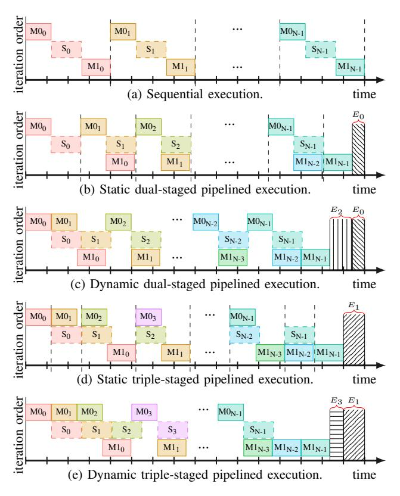
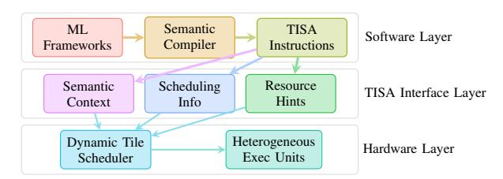

# II. TILE SCHEDULING CHALLENGES

This section elaborates on the challenges outlined above. Dynamically scheduling tiled computations must reason about two intertwined forms of conflict, i.e., structural contention and data dependencies, whose interaction determines when tiles can safely execute in parallel. We illustrate this using the fused tiles in FlashAttention-3 [33], as shown in Figure 1.

Fig. 1: The fused and tiled computations in FlashAttention-3. After tiling, the three operations involved in the attention pattern are fused and executed iteratively along the horizontal direction. Each iteration (shown in a distinct color) comprises three tiles: solid-outlined boxes represent tensor-unit executions, and dashed-outlined boxes represent vector-unit softmax computations. Vertical arrows indicate intra-iteration data dependencies.

The attention mechanism is decomposed into three heterogeneous tile types: M0, S, and M1, corresponding to the tiled computations of GEMM0 (QK⊤), Softmax, and GEMM1 (Attention · V ), respectively. Each vertical sequence of tiles denotes one iteration, containing three operations: two tensorunit GEMMs (M0 and M1) and one vector-unit Softmax (S). The arrows indicate data dependencies within an iteration.

Structural contention. Tensor and vector units are distinct but complementary resources. The two GEMM stages exclusively occupy tensor units, while the Softmax stage uses vector units. Static tile-level pipeline schedulers used by both compiler-generated and hand-tuned kernels like FlashAttention-3 exploit this heterogeneity within an iteration: while the vector units execute Si , tensor units can concurrently begin the next GEMM on the same iteration (e.g., overlapping Si with M1i). This intra-iteration parallelism is already well utilized by static pipelines.

Data dependencies. However, the three tiled operations are linked by producer-consumer edges. Si depends on the outputs of M0i , and M1i depends on the outputs of Si . These dependencies are correctly enforced by static compilation through ordered fusion or loop-carried synchronization. Yet this enforcement introduces an *implicit barrier* between iterations: the next iteration (i+1) cannot begin until all dependent results from iteration i are completed and synchronized.

Implication: Implicit synchronization and missed compact inter-iteration concurrency. Although structural heterogeneity allows tensor and vector units to run in parallel, the implicit synchronization across iterations prevents them from achieving more compact pipeline parallelism. For example, Si and M0i+1 are data-independent and use disjoint resources, but static schedules serialize them through global ordering. As a result, both tensor and vector units periodically idle: tensor units stall during Si , and vector units stall during M0i+1 even though true dependencies do not require it. Figure 2 illustrates this implicit synchronization. Figure 2(a) shows the sequential execution of fused tiles from Figure 1, where resource underutilization is evident across heterogeneous units.

Figure 2(b) demonstrates a statically pipelined approach that partitions the three tiled operations into two stages: M0i and Si in the first, and M1i in the second. This dual-stage structure improves utilization, eliminating some idle periods (E0). However, the tile launch sequence is precomputed and fixed at compile time, enforced through explicit synchronization barriers (e.g., PTX-level bar.sync in GPU kernels or compiler-placed fences in NPU kernels). Such a schedule assumes deterministic execution timing; any runtime variances like cache misses, DMA backpressure, or desynchronized warps break the alignment and degrades utilization.

A more aggressive static pipeline, shown in Figure 2(d), increases the number of stages by treating each tiled operation as a separate stage. This triple-stage design overlaps adjacent operations and achieves larger savings (E1). Yet its dependence on compile-time ordering still enforces synchronization between iterations; the fixed sequencing prevents Si from overlapping with M0i+1, despite their independence.

While advanced software pipelining (e.g., modulo scheduling [23], [32]) can achieve inter-iteration overlap by exploiting predictable latencies and control-flow predication, modern AI accelerators and GPUs face fundamentally different constraints: (1) non-deterministic execution latencies due to DMA backpressure, shared memory bank conflicts, and thermal throttling; (2) the absence of hardware predication for

Fig. 2: Different execution manners of the fused tiles shown in Figure 1. Shaded regions (Ex) represent latency saved through scheduling. Vertical dashed lines denote synchronization barriers between iterations imposed by static scheduling. E0 + E2 = E1 + E3 illustrates the equivalent latency savings achievable by dual-stage or triple-stage dynamic scheduling.

heavyweight tensor and vector units; and (3) heterogeneous multi-unit coordination requirements that exceed the scope of classical modulo scheduling. Moreover, such advanced software pipelining primarily overlaps fine-grained instructions, whereas accelerator kernels operate on coarse-grained tiles coordinated across multiple specialized units. As a result, instruction-level software pipelining can at best slightly smooth pipeline bubbles within the static stage structure illustrated in Fig. 2(b,d), but it does not fundamentally change the stage-ordered execution template. Consequently, state-ofthe-art GPU kernels such as FlashAttention-3 rely on fixed synchronization barriers, locking execution into static overlapping templates and precluding readiness-driven dynamic crossiteration reordering.

These static schedules expose a central inefficiency: compile-time assumptions erase semantic information about operator type, resource affinity, and dependency direction, forcing conservative synchronization that guards correctness at the cost of performance. By contrast, a semantics-aware runtime retains this information and makes scheduling decisions based on the instantaneous hardware state. As shown in Figure 2(c) and (e), the runtime scheduler observes which units are free and which tiles' inputs are ready, then dynamically issues the next eligible tile. This allows more compact interiteration overlap, e.g., executing  $S_i$  concurrently with  $M0_{i+1}$  or  $M1_i$  with  $S_{i+1}$ , and adapts naturally to runtime variation, achieving the cumulative latency reduction of  $E_0+E_2$  or  $E_1+E_3$  without relying on rigid stage definitions.

**Key insight.** The fundamental distinction lies in *information preservation*. Static tile-level pipeline scheduling in current accelerator compilation flows loses operator semantics once tiling and fusion lower the program into opaque instruction streams; as a result, the hardware sees only ordered instruction sequences and cannot distinguish true from artificial dependencies. Our semantics-aware approach preserves these relationships at runtime, enabling the hardware to discriminate between genuine resource conflicts (both units busy) and recoverable stalls (one unit waiting). By dynamically reordering tiles based on readiness and resource availability, it eliminates unnecessary synchronization and recovers the idle time that statically-pipelined accelerator kernels (e.g., FlashAttention in Figure 2(b,d)) must conservatively surrender.

#### III. DESIGN OVERVIEW

Having identified the loss of semantics by scheduling at an inappropriate level and may enforces synchronizations due to conservative compile-time assumptions, we now present the design of our solution. Our goal is to restore runtimevisible semantics, the minimal set of information required for the hardware to safely and adaptively schedule tiles, while preserving compatibility with existing compilation workflows.

On one hand, the compilation of a deep learning workload is inherently a hierarchical decomposition process that lowers a network from high-level operators to hardware-executable instructions. During this process, both operator and data granularities are progressively refined to align with the target hardware ISA. While this hierarchical lowering is essential for efficiency, it inevitably discards critical semantic information (e.g., operator boundaries, resource affinities, and dependency types) that is indispensable for dynamic scheduling. On the other hand, existing ISAs are not designed around tile-level execution, making it difficult to preserve or express such semantics even if the compiler attempts to do so.

This semantic loss creates a key gap between software and hardware: once operators are decomposed into flat instruction streams, the runtime no longer knows which instructions belong to which operator or which functional units they should occupy. Superscalar CPUs overcome a much simpler version of this problem through register-based dependency tracking, but AI accelerators require richer semantic interfaces that describe operator-level dependencies, heterogeneous resource bindings, and tile-level memory regions. Bridging this semantic gap requires an intermediate abstraction layer: one that is finer-grained than kernel streams yet coarser than raw instructions, precisely the role of a tile-level ISA.

Based on these observations, we design TISA, a semanticspreserving abstraction that forms a bridge between software decomposition and hardware scheduling. This abstraction allows us to develop a dynamic tile scheduler that can preserve compatibility with existing compilation workflows. Figure 3 illustrates the overall architecture of our approach.

Unlike traditional CPU ISAs that encode both execution semantics (e.g., what an ADD computes) and scheduling semantics (via register names enabling scoreboard-based dependency tracking), existing domain-specific ISAs (e.g., Cambricon [9], TPU [20], Graphcore IPU [19]) primarily define execution semantics—what a tensor operation computes and on which unit—but omit scheduling semantics. This leads to them typically encoding inter-unit coordination through explicit barriers or ordering constraints rather than exposing structured hardware-consumable scheduling semantics. TISA bridges this gap by acting as a hardware-consumed scheduling-semantics layer: its OpType, UnitMap, and TileMem fields are analogous to register names in CPU ISAs, but at tile granularity across heterogeneous units, which differ with the multi-core CPU task-level dynamic scheduling of Task Superscalar [12].

Fig. 3: The overall architecture of our integrated framework.

Notably, this functionality cannot be realized in software. At the AI-core tile level, the dispatch budget is strictly in the nanosecond range: our RTL synthesis measures  $7\sim 9$  cycles (at 1 GHz) per tile dispatch. A software runtime executing on a control processor would require instruction fetch, decode, branch evaluation, and memory accesses for dependency checking, typically incurring microsecond-level overhead ( $100-1000\times$  slower). This would negate the benefits of tile-level scheduling, where tile execution itself often ranges from  $10^3$  to  $10^5$  cycles. A hardware ISA interface is therefore mandatory for nanosecond-level, opportunistic overlap.

Working as a higher level ISA than traditional instructionlevel ISA, TISA integrates three co-designed components that together restore semantic information to the runtime:

- TISA Abstraction defines a tile-level instruction format that encodes operator type, dependency semantics, and resource requirements. It establishes a semantic contract between the compiler and the runtime scheduler.
- Semantics-Aware Runtime Scheduler interprets the TISA metadata to dynamically dispatch tiles across heterogeneous execution units, enabling adaptive overlap, load balancing, and conflict resolution at runtime.
- Semantics-Preserving Compiler retains operator semantics throughout the compilation pipeline and emits TISA instructions as the target intermediate representation.

Together, these components close the semantic gap between compilation and execution. The TISA layer ensures that operator intent and dependency semantics survive the lowering process, empowering the runtime scheduler to make informed, adaptive decisions that current fixed-template static scheduling approaches do not exploit at runtime. We now detail each component in turn.

## IV. TISA: A SEMANTICS-PRESERVING TILE-LEVEL ISA

To support dynamic scheduling, TISA must encode all scheduling-relevant semantics (what is computed, which resources it requires, and how its data interacts with other tiles) within a lightweight instruction format. This design yields two complementary data structures: the operand structure, which specifies data properties and memory scope, and the TISA instruction structure, which captures the semantic and resource-level metadata for each tile. Together, these structures form the complete semantic contract between the compiler and the runtime scheduler. The detailed definitions of these two structures are depicted in Table II and III respectively.

TABLE II: Operand structure definition.

| Field                                                                                                                              | Туре                              | Description                                         |  |  |  |  |  |
|------------------------------------------------------------------------------------------------------------------------------------|-----------------------------------|-----------------------------------------------------|--|--|--|--|--|
| Operand = (TileShape, TileMem, AccessType)                                                                                         |                                   |                                                     |  |  |  |  |  |
| TileShape Symbolic/Parametric Computational bounds TileMem (base, scope) Memory specification AccessType {R, W, RW} Access pattern |                                   |                                                     |  |  |  |  |  |
|                                                                                                                                    | TileMem = (base                   | , scope)                                            |  |  |  |  |  |
| base scope                                                                                                                      | Address {Private,Local,Shared} | Symbolic/Constant address Memory hierarchy level |  |  |  |  |  |

TABLE III: TISA instruction structure definition.

| Field      | Type/Constraints            | Description            |
|------------|-----------------------------|------------------------|
| TISA_I     | nst = (OpType, Operands, A  | ttributes, UnitMap)    |
| ОрТуре     | {GEMM, SOFTMAX,}            | Semantic identifier    |
| Operands   | $[op_1, op_2,]$             | Array of Operand       |
|            | $ outs  \le 3,  ins  \le 7$ | Hardware constraints   |
| Attributes | Op Attrs,Schedule Params    | Reorder constraints,   |
|            |                             | sync requirements      |
| UnitMap    | (unit, quantity, affinity)  | Resource specification |

Each TISA instruction preserves three classes of semantics that static instruction streams typically erase:

- Computation semantics, represented by OpType, identify the operator and its expected execution class (e.g., tensor, vector, or scalar unit). This enables the scheduler to associate instructions with compatible hardware units.
- Data semantics, captured by Operands and TileMem, define the spatial and temporal scope of data usage, allowing fine-grained conflict detection across tiles.
- Scheduling semantics, encoded in Attributes and UnitMap, constrain reordering and specify resource affinities to ensure correctness under heterogeneity.

These fields collectively enable the runtime to make informed, legality-checked scheduling decisions that were previously locked at compile time. More detailed scheduling mechanisms are described in Section V, but a brief summary is useful here: OpType guides structural mapping, Deps and TileMem ensure data correctness, and UnitMap enables distributed per-unit arbitration.

Dependencies among TISA instructions are expressed as  $Deps = \{(src, type, condition)\}$ , where  $type \in \{RAW, WAR, WAW\}$  denotes read-after-write, write-after-read, and write-after-write relationships. These dependencies are automatically derived through interval-based overlap analysis on the TileMem fields of each operand. For example, if two tiles reference overlapping address ranges and one writes while another reads, a RAW dependency is created and enforced until the writer commits. The condition field expresses partial or conditional readiness (e.g., partial-tile availability), allowing the scheduler to issue dependent tiles early once their required subregion becomes valid. This model allows fine-grained dependency resolution and overlap across iterations while guaranteeing memory safety.

Our current design employs interval-based overlap analysis using contiguous [start\_addr, end\_addr] ranges. For non-contiguous or strided accesses (e.g., column vectors), this model is conservative: it may flag false hazards for gaps within the stride, but never misses true conflicts. Regular non-contiguous accesses are generally converted into contiguous accesses through operations such as transpose at higher compilation levels. Extending TileMem descriptors with explicit stride metadata remains a future work.

The dynamic scheduler consumes the semantic fields of each TISA instruction to coordinate execution across heterogeneous units. It first performs RAW/WAR/WAW validation using Deps and TileMem to detect conflicts. Then, guided by UnitMap and OpType, it assigns ready tiles to unit-local queues for tensor, vector, or DMA engines, resolving structural contention dynamically. Finally, it evaluates dependency conditions to opportunistically issue instructions as soon as data is ready, rather than at fixed compile-time synchronization points. This process maximizes overlap across both operators and iterations while maintaining correctness.

The TISA abstraction thus closes the software-hardware semantic gap by cleanly separating *what* is computed (operator intent) from *when and where* it executes (scheduling). Unlike opaque kernel streams or flat instruction sequences, TISA exposes typed dependencies, explicit resource mappings (UnitMap), and tile-level memory regions (TileMem) to the runtime, enabling rule-based legality checks and adaptive scheduling, as will be introduced in Section V-A.

As we introduced in section III, TISA defines a hardware-consumed scheduling contract analogous to how register names in CPU ISAs constitute an architectural contract for scoreboard-based scheduling. The hardware scheduler directly reads TISA fields (OpType, TileMem, UnitMap) to make dispatch decisions—these fields are not interpreted by software. While violating or omitting TISA semantics results in conser-

vative (not incorrect) execution–similar to bypassing a CPU scoreboard and falling back to in-order issue–the scheduling semantics are *architecturally visible* and hardware-consumed, satisfying the essential property of an ISA-level abstraction. In particular, TISA has a concrete binary encoding on Epoch, the AI accelerator that will be evaluated in section VIII. The encoding details are omitted due to the page limitation. It is best understood as a *scheduling-semantics ISA extension* that supplements existing per-unit execution ISAs.

For upstream compilers, TISA provides a semantic target IR: frameworks can emit TISA instructions while preserving operator identity, dependency relationships, and resource requirements. The runtime then leverages this information to ensure correctness through typed-dependency readiness, interval-based conflict tests, and dynamic per-unit arbitration, eliminating the need for costly opaque-stream analysis. For downstream hardware, TISA abstracts over heterogeneous execution backends: both general-purpose GPUs and domainspecific NPUs can be supported under the same contract, where OpType may correspond to either a software-level operator or a coarse-grained hardware instruction. This unified abstraction enables semantic-aware scheduling on diverse hardware without rearchitecting the runtime.

Overall, TISA provides the missing semantic interface that allows dynamic scheduling to reason about both operator intent and hardware resource state, forming the foundation of our semantics-aware runtime framework.

# II. TILE SCHEDULING CHALLENGES

This section elaborates on the challenges outlined above. Dynamically scheduling tiled computations must reason about two intertwined forms of conflict, i.e., structural contention and data dependencies, whose interaction determines when tiles can safely execute in parallel. We illustrate this using the fused tiles in FlashAttention-3 [33], as shown in Figure 1.

Fig. 1: The fused and tiled computations in FlashAttention-3. After tiling, the three operations involved in the attention pattern are fused and executed iteratively along the horizontal direction. Each iteration (shown in a distinct color) comprises three tiles: solid-outlined boxes represent tensor-unit executions, and dashed-outlined boxes represent vector-unit softmax computations. Vertical arrows indicate intra-iteration data dependencies.

The attention mechanism is decomposed into three heterogeneous tile types: M0, S, and M1, corresponding to the tiled computations of GEMM0 (QK⊤), Softmax, and GEMM1 (Attention · V ), respectively. Each vertical sequence of tiles denotes one iteration, containing three operations: two tensorunit GEMMs (M0 and M1) and one vector-unit Softmax (S). The arrows indicate data dependencies within an iteration.

Structural contention. Tensor and vector units are distinct but complementary resources. The two GEMM stages exclusively occupy tensor units, while the Softmax stage uses vector units. Static tile-level pipeline schedulers used by both compiler-generated and hand-tuned kernels like FlashAttention-3 exploit this heterogeneity within an iteration: while the vector units execute Si , tensor units can concurrently begin the next GEMM on the same iteration (e.g., overlapping Si with M1i). This intra-iteration parallelism is already well utilized by static pipelines.

Data dependencies. However, the three tiled operations are linked by producer-consumer edges. Si depends on the outputs of M0i , and M1i depends on the outputs of Si . These dependencies are correctly enforced by static compilation through ordered fusion or loop-carried synchronization. Yet this enforcement introduces an *implicit barrier* between iterations: the next iteration (i+1) cannot begin until all dependent results from iteration i are completed and synchronized.

Implication: Implicit synchronization and missed compact inter-iteration concurrency. Although structural heterogeneity allows tensor and vector units to run in parallel, the implicit synchronization across iterations prevents them from achieving more compact pipeline parallelism. For example, Si and M0i+1 are data-independent and use disjoint resources, but static schedules serialize them through global ordering. As a result, both tensor and vector units periodically idle: tensor units stall during Si , and vector units stall during M0i+1 even though true dependencies do not require it. Figure 2 illustrates this implicit synchronization. Figure 2(a) shows the sequential execution of fused tiles from Figure 1, where resource underutilization is evident across heterogeneous units.

Figure 2(b) demonstrates a statically pipelined approach that partitions the three tiled operations into two stages: M0i and Si in the first, and M1i in the second. This dual-stage structure improves utilization, eliminating some idle periods (E0). However, the tile launch sequence is precomputed and fixed at compile time, enforced through explicit synchronization barriers (e.g., PTX-level bar.sync in GPU kernels or compiler-placed fences in NPU kernels). Such a schedule assumes deterministic execution timing; any runtime variances like cache misses, DMA backpressure, or desynchronized warps break the alignment and degrades utilization.

A more aggressive static pipeline, shown in Figure 2(d), increases the number of stages by treating each tiled operation as a separate stage. This triple-stage design overlaps adjacent operations and achieves larger savings (E1). Yet its dependence on compile-time ordering still enforces synchronization between iterations; the fixed sequencing prevents Si from overlapping with M0i+1, despite their independence.

While advanced software pipelining (e.g., modulo scheduling [23], [32]) can achieve inter-iteration overlap by exploiting predictable latencies and control-flow predication, modern AI accelerators and GPUs face fundamentally different constraints: (1) non-deterministic execution latencies due to DMA backpressure, shared memory bank conflicts, and thermal throttling; (2) the absence of hardware predication for

Fig. 2: Different execution manners of the fused tiles shown in Figure 1. Shaded regions (Ex) represent latency saved through scheduling. Vertical dashed lines denote synchronization barriers between iterations imposed by static scheduling. E0 + E2 = E1 + E3 illustrates the equivalent latency savings achievable by dual-stage or triple-stage dynamic scheduling.

heavyweight tensor and vector units; and (3) heterogeneous multi-unit coordination requirements that exceed the scope of classical modulo scheduling. Moreover, such advanced software pipelining primarily overlaps fine-grained instructions, whereas accelerator kernels operate on coarse-grained tiles coordinated across multiple specialized units. As a result, instruction-level software pipelining can at best slightly smooth pipeline bubbles within the static stage structure illustrated in Fig. 2(b,d), but it does not fundamentally change the stage-ordered execution template. Consequently, state-ofthe-art GPU kernels such as FlashAttention-3 rely on fixed synchronization barriers, locking execution into static overlapping templates and precluding readiness-driven dynamic crossiteration reordering.

These static schedules expose a central inefficiency: compile-time assumptions erase semantic information about operator type, resource affinity, and dependency direction, forcing conservative synchronization that guards correctness at the cost of performance. By contrast, a semantics-aware runtime retains this information and makes scheduling decisions based on the instantaneous hardware state. As shown in Figure 2(c) and (e), the runtime scheduler observes which units are free and which tiles' inputs are ready, then dynamically issues the next eligible tile. This allows more compact interiteration overlap, e.g., executing  $S_i$  concurrently with  $M0_{i+1}$  or  $M1_i$  with  $S_{i+1}$ , and adapts naturally to runtime variation, achieving the cumulative latency reduction of  $E_0+E_2$  or  $E_1+E_3$  without relying on rigid stage definitions.

**Key insight.** The fundamental distinction lies in *information preservation*. Static tile-level pipeline scheduling in current accelerator compilation flows loses operator semantics once tiling and fusion lower the program into opaque instruction streams; as a result, the hardware sees only ordered instruction sequences and cannot distinguish true from artificial dependencies. Our semantics-aware approach preserves these relationships at runtime, enabling the hardware to discriminate between genuine resource conflicts (both units busy) and recoverable stalls (one unit waiting). By dynamically reordering tiles based on readiness and resource availability, it eliminates unnecessary synchronization and recovers the idle time that statically-pipelined accelerator kernels (e.g., FlashAttention in Figure 2(b,d)) must conservatively surrender.

#### III. DESIGN OVERVIEW

Having identified the loss of semantics by scheduling at an inappropriate level and may enforces synchronizations due to conservative compile-time assumptions, we now present the design of our solution. Our goal is to restore runtimevisible semantics, the minimal set of information required for the hardware to safely and adaptively schedule tiles, while preserving compatibility with existing compilation workflows.

On one hand, the compilation of a deep learning workload is inherently a hierarchical decomposition process that lowers a network from high-level operators to hardware-executable instructions. During this process, both operator and data granularities are progressively refined to align with the target hardware ISA. While this hierarchical lowering is essential for efficiency, it inevitably discards critical semantic information (e.g., operator boundaries, resource affinities, and dependency types) that is indispensable for dynamic scheduling. On the other hand, existing ISAs are not designed around tile-level execution, making it difficult to preserve or express such semantics even if the compiler attempts to do so.

This semantic loss creates a key gap between software and hardware: once operators are decomposed into flat instruction streams, the runtime no longer knows which instructions belong to which operator or which functional units they should occupy. Superscalar CPUs overcome a much simpler version of this problem through register-based dependency tracking, but AI accelerators require richer semantic interfaces that describe operator-level dependencies, heterogeneous resource bindings, and tile-level memory regions. Bridging this semantic gap requires an intermediate abstraction layer: one that is finer-grained than kernel streams yet coarser than raw instructions, precisely the role of a tile-level ISA.

Based on these observations, we design TISA, a semanticspreserving abstraction that forms a bridge between software decomposition and hardware scheduling. This abstraction allows us to develop a dynamic tile scheduler that can preserve compatibility with existing compilation workflows. Figure 3 illustrates the overall architecture of our approach.

Unlike traditional CPU ISAs that encode both execution semantics (e.g., what an ADD computes) and scheduling semantics (via register names enabling scoreboard-based dependency tracking), existing domain-specific ISAs (e.g., Cambricon [9], TPU [20], Graphcore IPU [19]) primarily define execution semantics—what a tensor operation computes and on which unit—but omit scheduling semantics. This leads to them typically encoding inter-unit coordination through explicit barriers or ordering constraints rather than exposing structured hardware-consumable scheduling semantics. TISA bridges this gap by acting as a hardware-consumed scheduling-semantics layer: its OpType, UnitMap, and TileMem fields are analogous to register names in CPU ISAs, but at tile granularity across heterogeneous units, which differ with the multi-core CPU task-level dynamic scheduling of Task Superscalar [12].

Fig. 3: The overall architecture of our integrated framework.

Notably, this functionality cannot be realized in software. At the AI-core tile level, the dispatch budget is strictly in the nanosecond range: our RTL synthesis measures  $7\sim 9$  cycles (at 1 GHz) per tile dispatch. A software runtime executing on a control processor would require instruction fetch, decode, branch evaluation, and memory accesses for dependency checking, typically incurring microsecond-level overhead ( $100-1000\times$  slower). This would negate the benefits of tile-level scheduling, where tile execution itself often ranges from  $10^3$  to  $10^5$  cycles. A hardware ISA interface is therefore mandatory for nanosecond-level, opportunistic overlap.

Working as a higher level ISA than traditional instructionlevel ISA, TISA integrates three co-designed components that together restore semantic information to the runtime:

- TISA Abstraction defines a tile-level instruction format that encodes operator type, dependency semantics, and resource requirements. It establishes a semantic contract between the compiler and the runtime scheduler.
- Semantics-Aware Runtime Scheduler interprets the TISA metadata to dynamically dispatch tiles across heterogeneous execution units, enabling adaptive overlap, load balancing, and conflict resolution at runtime.
- Semantics-Preserving Compiler retains operator semantics throughout the compilation pipeline and emits TISA instructions as the target intermediate representation.

Together, these components close the semantic gap between compilation and execution. The TISA layer ensures that operator intent and dependency semantics survive the lowering process, empowering the runtime scheduler to make informed, adaptive decisions that current fixed-template static scheduling approaches do not exploit at runtime. We now detail each component in turn.

## IV. TISA: A SEMANTICS-PRESERVING TILE-LEVEL ISA

To support dynamic scheduling, TISA must encode all scheduling-relevant semantics (what is computed, which resources it requires, and how its data interacts with other tiles) within a lightweight instruction format. This design yields two complementary data structures: the operand structure, which specifies data properties and memory scope, and the TISA instruction structure, which captures the semantic and resource-level metadata for each tile. Together, these structures form the complete semantic contract between the compiler and the runtime scheduler. The detailed definitions of these two structures are depicted in Table II and III respectively.

TABLE II: Operand structure definition.

| Field                                                                                                                              | Туре                              | Description                                         |  |  |  |  |  |
|------------------------------------------------------------------------------------------------------------------------------------|-----------------------------------|-----------------------------------------------------|--|--|--|--|--|
| Operand = (TileShape, TileMem, AccessType)                                                                                         |                                   |                                                     |  |  |  |  |  |
| TileShape Symbolic/Parametric Computational bounds TileMem (base, scope) Memory specification AccessType {R, W, RW} Access pattern |                                   |                                                     |  |  |  |  |  |
|                                                                                                                                    | TileMem = (base                   | , scope)                                            |  |  |  |  |  |
| base scope                                                                                                                      | Address {Private,Local,Shared} | Symbolic/Constant address Memory hierarchy level |  |  |  |  |  |

TABLE III: TISA instruction structure definition.

| Field      | Type/Constraints            | Description            |
|------------|-----------------------------|------------------------|
| TISA_I     | nst = (OpType, Operands, A  | ttributes, UnitMap)    |
| ОрТуре     | {GEMM, SOFTMAX,}            | Semantic identifier    |
| Operands   | $[op_1, op_2,]$             | Array of Operand       |
|            | $ outs  \le 3,  ins  \le 7$ | Hardware constraints   |
| Attributes | Op Attrs,Schedule Params    | Reorder constraints,   |
|            |                             | sync requirements      |
| UnitMap    | (unit, quantity, affinity)  | Resource specification |

Each TISA instruction preserves three classes of semantics that static instruction streams typically erase:

- Computation semantics, represented by OpType, identify the operator and its expected execution class (e.g., tensor, vector, or scalar unit). This enables the scheduler to associate instructions with compatible hardware units.
- Data semantics, captured by Operands and TileMem, define the spatial and temporal scope of data usage, allowing fine-grained conflict detection across tiles.
- Scheduling semantics, encoded in Attributes and UnitMap, constrain reordering and specify resource affinities to ensure correctness under heterogeneity.

These fields collectively enable the runtime to make informed, legality-checked scheduling decisions that were previously locked at compile time. More detailed scheduling mechanisms are described in Section V, but a brief summary is useful here: OpType guides structural mapping, Deps and TileMem ensure data correctness, and UnitMap enables distributed per-unit arbitration.

Dependencies among TISA instructions are expressed as  $Deps = \{(src, type, condition)\}$ , where  $type \in \{RAW, WAR, WAW\}$  denotes read-after-write, write-after-read, and write-after-write relationships. These dependencies are automatically derived through interval-based overlap analysis on the TileMem fields of each operand. For example, if two tiles reference overlapping address ranges and one writes while another reads, a RAW dependency is created and enforced until the writer commits. The condition field expresses partial or conditional readiness (e.g., partial-tile availability), allowing the scheduler to issue dependent tiles early once their required subregion becomes valid. This model allows fine-grained dependency resolution and overlap across iterations while guaranteeing memory safety.

Our current design employs interval-based overlap analysis using contiguous [start\_addr, end\_addr] ranges. For non-contiguous or strided accesses (e.g., column vectors), this model is conservative: it may flag false hazards for gaps within the stride, but never misses true conflicts. Regular non-contiguous accesses are generally converted into contiguous accesses through operations such as transpose at higher compilation levels. Extending TileMem descriptors with explicit stride metadata remains a future work.

The dynamic scheduler consumes the semantic fields of each TISA instruction to coordinate execution across heterogeneous units. It first performs RAW/WAR/WAW validation using Deps and TileMem to detect conflicts. Then, guided by UnitMap and OpType, it assigns ready tiles to unit-local queues for tensor, vector, or DMA engines, resolving structural contention dynamically. Finally, it evaluates dependency conditions to opportunistically issue instructions as soon as data is ready, rather than at fixed compile-time synchronization points. This process maximizes overlap across both operators and iterations while maintaining correctness.

The TISA abstraction thus closes the software-hardware semantic gap by cleanly separating *what* is computed (operator intent) from *when and where* it executes (scheduling). Unlike opaque kernel streams or flat instruction sequences, TISA exposes typed dependencies, explicit resource mappings (UnitMap), and tile-level memory regions (TileMem) to the runtime, enabling rule-based legality checks and adaptive scheduling, as will be introduced in Section V-A.

As we introduced in section III, TISA defines a hardware-consumed scheduling contract analogous to how register names in CPU ISAs constitute an architectural contract for scoreboard-based scheduling. The hardware scheduler directly reads TISA fields (OpType, TileMem, UnitMap) to make dispatch decisions—these fields are not interpreted by software. While violating or omitting TISA semantics results in conser-

vative (not incorrect) execution–similar to bypassing a CPU scoreboard and falling back to in-order issue–the scheduling semantics are *architecturally visible* and hardware-consumed, satisfying the essential property of an ISA-level abstraction. In particular, TISA has a concrete binary encoding on Epoch, the AI accelerator that will be evaluated in section VIII. The encoding details are omitted due to the page limitation. It is best understood as a *scheduling-semantics ISA extension* that supplements existing per-unit execution ISAs.

For upstream compilers, TISA provides a semantic target IR: frameworks can emit TISA instructions while preserving operator identity, dependency relationships, and resource requirements. The runtime then leverages this information to ensure correctness through typed-dependency readiness, interval-based conflict tests, and dynamic per-unit arbitration, eliminating the need for costly opaque-stream analysis. For downstream hardware, TISA abstracts over heterogeneous execution backends: both general-purpose GPUs and domainspecific NPUs can be supported under the same contract, where OpType may correspond to either a software-level operator or a coarse-grained hardware instruction. This unified abstraction enables semantic-aware scheduling on diverse hardware without rearchitecting the runtime.

Overall, TISA provides the missing semantic interface that allows dynamic scheduling to reason about both operator intent and hardware resource state, forming the foundation of our semantics-aware runtime framework.

