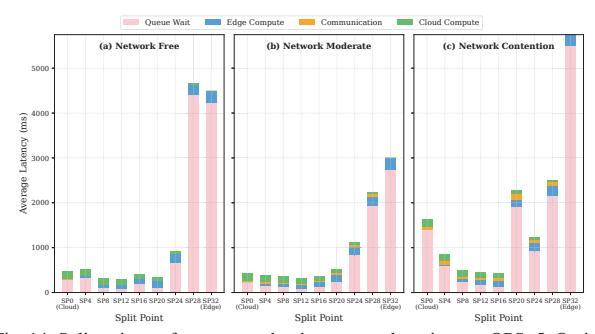
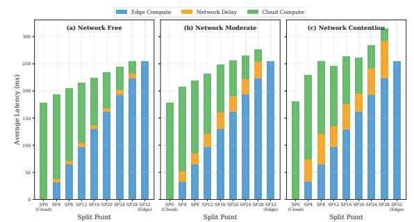
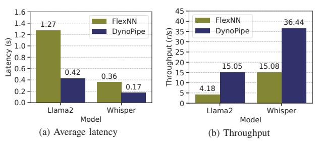

# *1) Cloud-Only vs. Collaborative Performance*

Fig. 3 compares end-to-end latency and throughput across split points under increasing load. At QPS=5 with unconstrained network, cloud-only execution (SP=0) achieves 478ms average latency and 2.09 requests/second (rps) throughput, while the optimal collaborative configuration (SP=12) achieves 292ms latency and 3.43 rps—a 39% latency reduction and 64% throughput improvement over cloud-only.

The mechanism is pipeline parallelism: cloud-only (SP=0) has a mean service time of 179 ms (∼5.6 rps capacity), so at QPS=5 the server operates at 89% utilization where Poisson arrivals and service-time variance cause nonlinear queueing buildup. SP=12 splits execution into concurrent edge (96 ms) and cloud (112 ms) stages, raising effective capacity to ∼8.9 rps and reducing utilization to 56%, which is why collaborative execution substantially reduces queueing.

Edge-only execution (SP=32) is catastrophic under load: with 30% edge GPU slowdown, each request takes 256ms on the slower edge device, yielding capacity of only 3.9 rps. At QPS=5, the system is severely overloaded, producing 4498ms average latency—**15.4**× worse than SP=12.

Fig. 13: Latency breakdown by component (queue/edge/network/cloud) across split points at QPS=5, Network Free. Queueing dominates cloud-only (SP=0) and edge-only (SP=32); collaborative split points minimize total latency by balancing pipeline stages.

TABLE III: Optimal split point and latency (ms) under varying load and network conditions for LLaMA2-7B.

| QPS | Net. Free |      | Net. Moderate |      | Net. Contention |      |
|-----|-----------|------|---------------|------|-----------------|------|
|     | SP        | Lat. | SP            | Lat. | SP              | Lat. |
| 3   | 4         | 246  | 12            | 254  | 4               | 274  |
| 4   | 12        | 252  | 12            | 261  | 16              | 315  |
| 5   | 12        | 292  | 12            | 308  | 8               | 372  |

## *2) Latency Breakdown Analysis*

Fig. 13 decomposes end-to-end latency into queueing, edge computation, network transfer, and cloud computation, revealing DynoPipe's performance gains. At QPS=5, cloud-only (SP=0) suffers 295ms queueing (62% of 478ms total), while SP=12 reduces queueing to 76ms (26% of 292ms total). The 186ms improvement stems primarily from pipeline parallelism nearly doubling system capacity, despite modest edge-cloud traversal overhead (7ms network + 96ms edge vs. 178ms cloud-only). This result also explains why cloud-only degrades sharply near QPS=5: once the single-GPU server approaches saturation, bursty arrivals and service-time variability quickly translate into queue buildup.

This explains the TPOT trade-off in Table II: while per-token decode time increases slightly, queueing reduction from 62% to 26% of total latency produces substantially better end-to-end performance under realistic load.

## *3) Dynamic Split-Point Necessity*

The optimal split point shifts with both load intensity and network conditions (Fig. 14), validating the need for dynamic boundary adaptation. Table III shows that no single static split point is universally optimal: a static SP=12 incurs 36% degradation under Network Contention at QPS=4 (428ms vs. optimal SP=16 at 315ms), while a static SP=4 is 82% worse than optimal at QPS=5 (532ms vs. 292ms). These results validate DynoPipe's multi-configuration portfolio: the 3–5 pre-computed configurations correspond to distinct operating regimes, and a single offline-optimal boundary can suffer up to 82% penalty when conditions shift, justifying dynamic portfoliobased selection.

**Portfolio Saturation Analysis.** We verify the bound from

Fig. 14: Split-point performance under three network regimes at QPS=5. Optimal split point shifts from SP=12 (Network Free) to SP=8 (Network Contention), demonstrating the necessity of dynamic boundary adaptation.

§4.1 empirically: across the 9 operating conditions in Table III (3 load levels × 3 network regimes), only 4 distinct optimal split points emerge ({4, 8, 12, 16}) out of 32 candidate layers. A portfolio of size 2 (e.g. {4, 12}) misses SP=16 at QPS=4 under contention (315 ms optimal vs. 428 ms with SP=12, a 36% penalty) and SP=8 at QPS=5 under contention. A portfolio of size 4 covers all observed optima with zero residual gap; adding a fifth configuration yields no further improvement across all tested conditions. This is consistent with the theoretical prediction: for uniform transformer blocks, the monotonicity collapse is strong enough that || = 4 = 32. Models with heterogeneous layer structures may require larger portfolios, but the growth remains bounded by rather than .

### *4) Heterogeneous Edge Impact*

Under realistic hardware heterogeneity with 30% edge GPU throughput reduction (Fig. 15), SP=12 achieves 215ms latency versus 179ms for cloud-only (SP=0), while edge-only (SP=32) takes 255ms—42% slower as the throughput penalty accumulates across all layers. Under load, however, the edge throughput disadvantage is dominated by the queueing benefit of pipeline parallelism. At QPS=5, the pipeline service rate at SP=12 ( ≈ 8.9 rps) far exceeds both cloud-only ( ≈ 5.6 rps) and edge-only ( ≈ 3.9 rps), making the per-layer edge overhead a minor factor compared to the 64% throughput gain from collaboration. This validates DynoPipe's computation-balanced boundary selection: the LRP algorithm accounts for device-specific throughput asymmetry when computing optimal boundaries, ensuring the pipeline bottleneck (max(edge, cloud)) is minimized despite hardware heterogeneity.

**Sensitivity to Heuristic Choices.** We verify LRP parameter robustness with the multi-regime ablation and portfolio analysis above. Portfolios with fewer than four candidates lose adaptability (e.g., missing SP=16 leads to 36% penalty at QPS=4; see Table III), while more than four brings no extra benefit, consistent with the || ≤ min(, ) bound. A hysteresis threshold ∈ [15%, 20%] strikes a good balance: lowering it causes excessive switching for minor fluctuations, while raising it only slightly delays necessary changes. Overall, these results across nine operating conditions show that the finite-portfolio approach is robust in realistic edge-cloud scenarios.

Fig. 15: Latency breakdown with heterogeneous edge GPU (30% slowdown). Edge computation penalty accumulates with more layers assigned to edge, making cloud-heavy split points more efficient for single requests while pipeline parallelism favors balanced splits under load.

Fig. 16: Performance comparison of DynoPipe and FlexNN in edge-only deployment. (a) Average latency reduction, (b) Throughput improvement.

## **5.7 Network Optimization**

We isolate network effects by comparing DynoPipe against FlexNN in edge-only deployment using ApacheBench [45] under identical resource constraints (Fig. 16). Unlike FlexNN's memory-driven operator sharding, DynoPipe jointly optimizes communication and computation-communication overlap through network-aware pipeline construction. Fig. 16a shows DynoPipe reduces average inference time by 66.9% (LLaMA2- 7B) and 52.8% (Whisper), while Fig. 16b demonstrates 3.6× and 2.4× throughput gains, confirming that strategic operator placement—not merely additional resources—drives performance improvement. EdgeShard is excluded because it inherently requires a cloud partition.

