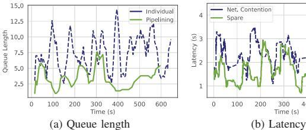
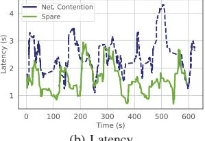
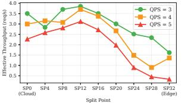

# **2. Background and Motivation**

Large language models face fundamental deployment challenges across the edge-cloud continuum. Edge deployments suffer from memory wall constraints [21], while cloud-only solutions suffer from prohibitive network latency [1, 7, 8] and privacy risks [4, 5]. Pipeline parallelism emerges as a natural solution partitioning computation so that privacy-sensitive operations remain local while compute-intensive tasks leverage cloud resources—but applying it across heterogeneous edge-cloud boundaries introduces three critical challenges.

#### **2.1 Resource Competition for Online Workloads**

Pipeline parallelism partitions computation across heterogeneous nodes, enabling edge devices to handle privacy-sensitive operations while cloud resources execute compute-intensive tasks [18, 26, 27]. However, edge deployments face fundamental constraints: limited GPU memory restricts model capacity, concurrent request handling intensifies memory pressure and bandwidth contention, and these resource boundaries fluctuate continuously, invalidating static partitioning assumptions [28, 29].

*Multi-model deployment constraints* exacerbate resource competition. Edge devices often require simultaneous support for

Fig. 2: The latency and queue length of the LLaMA2-7B inference process. (a) Queue length of model inference individually vs. pipeline parallelism. (b) Latency of model inference in network contention and spare bandwidth.

diverse tasks (speech recognition, image processing, NLP), but resource limitations make concurrent high-performance model deployment impractical, and frequent model loading/unloading further increases latency.

*The effectiveness of caching is reduced* due to the continuous growth of KV caches in LLMs. Models with chain-of-thought (CoT) phases generate thousands of tokens as context before producing output, demanding substantial memory for intermediate storage. Edge devices with limited capacity frequently trigger cache eviction, causing pipeline stalls for KV reconstruction. Pipeline parallelism addresses this by partitioning models into stages and enabling concurrent batch processing, reducing queue length by approximately 79.8% (Fig. 2a).

*Bandwidth contention* is exacerbated by concurrent multi-task inference. Edge LLM services typically share the same router, so concurrent tasks compete for bandwidth: with four concurrent inference tasks, effective per-task bandwidth drops from 10 Gbps to below 2.5 Gbps, increasing activation transmission latency by 4.9× (from 1.68 ms to 8.2 ms). This invalidates the communication latency assumptions underlying static pipeline design. Our case study shows that alleviating bandwidth contention reduces end-to-end latency by 43% (Fig. 2b).

*Cloud-only deployment limitations* emerge under realistic load conditions. While cloud-only execution (all layers on cloud GPU) achieves optimal single-request latency (179ms for LLaMA2-7B), it degrades catastrophically under concurrent load: at QPS=5, queueing accounts for 62% of total latency (295ms out of 478ms) due to single-GPU serialization. In contrast, edge-cloud pipeline collaboration (split at layer 12) reduces queueing to 26% of total latency through pipeline parallelism, achieving 39% lower end-to-end latency and 64% higher throughput despite introducing network transfer overhead (Fig. 3). This demonstrates that the fundamental advantage of edge-cloud collaboration lies not in resource augmentation but in the throughput multiplier effect of pipeline parallelism under load.

**Insight 1.** *Dynamic resource contention at the edge, due to concurrent multi-model deployment and bandwidth competition, invalidates static partitioning assumptions. This necessitates adaptive edge-cloud orchestration that dynamically responds to real-time resource availability and workload characteristics.*

- (a) Average latency across split points
- (b) Throughput across split points

Fig. 3: Split-point (SP) study on LLaMA2-7B under Poisson arrivals (QPS=3/4/5). Cloud-only (SP=0) and edge-only (SP=32) are consistently suboptimal; intermediate split points achieve the best latency-throughput tradeoff through pipeline parallelism.

#### **2.2 Heterogeneous Architecture Constraints**

Edge-cloud architectures exhibit fundamental resource asymmetries that create structural constraints on pipeline design. These three-dimensional disparities—computation (0.48×), memory (2.5×), and communication (80×)—fundamentally constrain pipeline adaptability through cascading effects that compound across system layers.

*Computation imbalance* creates stage latency skew that prevents efficient pipeline balancing. H100 GPUs (989 TFLOPS) versus NVIDIA Thor at the edge (2070 TOPS) reflect a 0.48× compute disparity. During LLaMA2-70B prefilling, this disparity manifests as asymmetric execution patterns: attention layers exhibit 2.7× latency variance between domains, while feed-forward networks show 1.8× variance. The critical insight is that different operator types experience varying degrees of heterogeneity amplification—attention operations suffer disproportionately on edge devices due to memory bandwidth limitations, while embedding layers show minimal performance degradation. This operator-specific heterogeneity creates irregular pipeline bubbles that resist traditional load balancing, producing up to 67% theoretical idle time as fast stages wait for heterogeneityamplified slow stages.

*Memory hierarchy mismatch* forces architectural rigidity through constrained stage granularity. Edge DRAM (64GB, 51.2 GB/s) versus cloud HBM (140GB, 3.35 TB/s) creates a 65× bandwidth disparity that compounds memory capacity constraints. This mismatch manifests in two critical ways: (1) *Stage fragmentation*—edge memory constraints force fine-grained partitioning that reduces computation-communication overlap opportunities, and (2) *Cache hierarchy violations*—KV cache access patterns optimized for HBM exhibit severe performance degradation on DRAM, creating 4.2× latency penalties for longcontext inference. The hierarchy mismatch prevents flexible stage reassignment: stages optimized for HBM access patterns cannot efficiently migrate to DRAM-based edge nodes without fundamental algorithmic restructuring.

*Communication topology asymmetry* creates bandwidthlatency trade-offs that dominate runtime characteristics. Edgecloud links (10 Gbps, 15ms RTT) versus cloud interconnects (800 Gbps RDMA, 1.5s RTT) exhibit 80× bandwidth and 10,000× latency disparities. This asymmetry makes tensor parallelism prohibitively expensive across edge-cloud boundaries: AllReduce overhead increases from 0.8ms (NVLink) to 25ms (edge-cloud) for LLaMA2-70B attention, yielding 94% efficiency degradation. The topology asymmetry also creates *activation accumulation effects* where boundary stages buffer increasing intermediate results during network congestion, causing memory pressure cascades throughout the pipeline.

These constraints exhibit *multiplicative interaction effects* that severely limit pipeline adaptability. Computation imbalance amplifies memory pressure; memory constraints reduce communication overlap; communication latency prevents load redistribution. This creates a constraint satisfaction problem with limited feasible solutions, fundamentally restricting adaptability compared to homogeneous environments.

**Insight 2.** *Heterogeneous edge-cloud architectures create architectural rigidity through multiplicative constraint interactions—computation imbalance, memory hierarchy mismatches, and communication asymmetries—that severely limit pipeline adaptability.*

