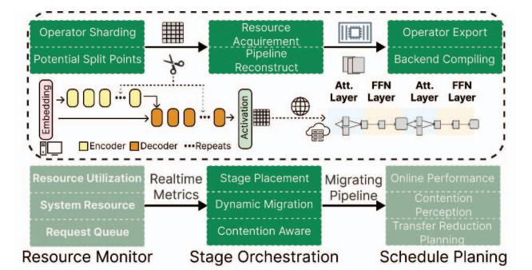

# **2.3 Performance Bottlenecks at Boundary Stage**

Edge-cloud pipelines exhibit dynamic bottleneck migration that compounds the structural constraints from §2.2. Unlike homogeneous systems where bottlenecks remain localized, heterogeneous edge-cloud architectures create shifting performance constraints that invalidate static optimization approaches.

*Edge node bottlenecks* emerge from memory pressure amplified by concurrent workloads. When multiple LLM tasks compete for limited edge memory, cache eviction triggers pipeline stalls for KV reconstruction. Our measurements show 43% latency increases during peak load with four concurrent tasks. The computation imbalance (0.48× disparity) dynamically amplifies: attention-heavy workloads saturate edge compute while embedding operations underutilize cloud resources, creating asymmetric pipeline bubbles.

*Boundary stage bottlenecks* occur at edge-cloud transition points where structural asymmetries concentrate. These stages accumulate the compounded effects of computation imbalance, memory constraints, and communication latency. During LLaMA2-70B prefilling, boundary stages experience up to 82% idle time as edge-cloud execution mismatches are amplified by dynamic load variations. The boundary becomes a convergence point for multiple constraint violations, creating cascading pipeline stalls.

*Network link bottlenecks* arise from bandwidth contention that transforms the 80× communication disparity into a dynamic constraint. Concurrent tasks reduce effective bandwidth from 10 Gbps to 2.5 Gbps, increasing activation transmission latency from 1.68 ms to 8.2 ms (4.9× increase). This dynamic degradation invalidates static pipeline assumptions, as boundary stages must buffer increasing activation volumes while waiting for congested network transfers.

The critical insight is bottleneck migration: performance constraints shift dynamically among edge nodes, boundary stages, and network links based on workload characteristics

Fig. 4: DynoPipe architecture: (1) Heterogeneous Pipeline Construction profiles operators and builds boundary-optimized pipelines offline; (2) Dynamic Orchestration monitors resource conditions and switches between pre-computed configurations; (3) Hierarchical State Management preserves KV cache continuity during reconfiguration through predictive staging.

and resource contention. This migration, combined with the architectural rigidity from three-dimensional constraints, prevents reactive adaptation strategies that assume fixed bottleneck locations.

**Insight 3.** *Performance bottlenecks in edge-cloud pipelines migrate dynamically across system components, amplified by structural constraints. This dynamic migration, combined with architectural rigidity, necessitates proactive multi-configuration orchestration rather than reactive adaptation.*

### **3. System Overview**

DynoPipe (Fig. 4) addresses the three challenges identified in §2 through three co-designed mechanisms.

**Boundary-Aware Pipeline Construction** (§4.1) formulates edge-cloud partitioning as a boundary-constrained optimization (Eq. 1) and uses dynamic programming to generate a compact portfolio of split-point configurations—each targeting a distinct resource regime (bandwidth-, compute-, or memory-constrained). A formal bound shows the portfolio size scales with the number of resource regimes rather than model depth, keeping it small in practice.

**Proactive Multi-Configuration Orchestration** (§4.2) selects among pre-computed configurations at runtime via the Latency-Regulated Placement (LRP) algorithm. LRP adapts a weighting parameter to the current bottleneck (network, compute, or memory), with hysteresis and cooldown mechanisms to prevent oscillatory switching while maintaining sub-millisecond decision latency.

**Hierarchical State Management** (§4.3) decomposes pipeline state into three tiers by migration criticality (KV caches, intermediate activations, auxiliary metadata) and pre-stages parameters through L1/L2/L3 memory hierarchy using predictive boundary estimation. When bandwidth drops below 1 Gbps, an adaptive recomputation fallback trades modest compute overhead for 90% bandwidth reduction, bounding worst-case migration to <120 ms.

