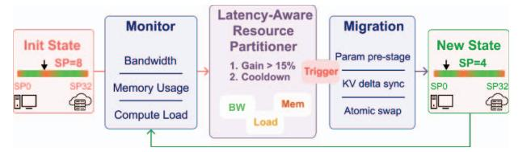

# *4) Boundary Configuration Portfolio*

DynoPipe pre-computes 3-5 boundary configurations targeting distinct heterogeneous scenarios (Fig. 5). The bandwidthconstrained configuration places boundaries after attention layers where tensor sparsity minimizes communication volume. The compute-optimized configuration leverages abundant cloud resources through early boundary placement, accepting larger activation transfers for superior throughput. The memoryconstrained configuration optimizes for minimal edge footprint when memory pressure exceeds 90%.

The orchestration module monitors heterogeneous resource conditions through lightweight telemetry, switching configurations when performance thresholds are violated. This proactive approach avoids the high reconstruction overhead of reactive reconfiguration while maintaining service availability under varying heterogeneous conditions.

**Portfolio Size Bound.** For a single edge-cloud boundary (§4.2), the DP recurrence (Eq. 1) maps each resource state R = (, , ) to an optimal split point ∗ (R) ∈ {0, 1,...,}, where is the number of candidate split points (model-dependent; equal to the number of transformer blocks for decoder-only LLMs). Because and vary continuously with resource conditions while ∗ is discrete, ∗ (R) is piecewise-constant: the resource space partitions into contiguous cells that each map to a single optimal SP. With resource dimensions and at most qualitatively distinct regimes per dimension (e.g. free / moderate / contention for bandwidth), the number of cells is at most . Monotonic relationships between resource constraints and boundary placement—higher bandwidth favors earlier SP (more cloud utilization), higher memory pressure favors later SP (smaller edge footprint) collapse many cells to the same ∗. The set of distinct optimal configurations therefore satisfies || ≤ min(, ). For architectures with uniform transformer blocks (e.g. LLaMA), per-layer cost functions are near-identical, so the monotonicity collapse is strong and || in practice. For models with

Fig. 6: DynoPipe's dynamic boundary optimization decision flow. The system monitors resource conditions to select optimal split points from pre-computed configurations, triggering reconfiguration when performance thresholds are violated.

heterogeneous layer types (e.g. MoE, mixed vision–language encoders), per-layer cost variation may increase ||, but the bound still grows with resource-regime count rather than linearly with model depth .

**Residual Connections and Boundary Placement.** Modern LLMs (e.g., LLaMA) employ residual connections *within* each transformer block ( = + Attn() + FFN(·)), but these residuals resolve at block boundaries. DynoPipe places split points exclusively *between* complete transformer blocks (Fig. 5), so the output tensor at each candidate boundary is a fully resolved hidden state with no outstanding skip connections. This eliminates cross-domain residual synchronization and keeps the activation tensor transmitted to the cloud identical in shape and semantics regardless of placement, requiring no additional buffering or recomputation.

**Privacy Risk Analysis.** Achieving full privacy requires either edge-only deployment (limited by device memory) or homomorphic encryption (with impractical latency [30–32]). DynoPipe takes a practical approach: sensitive embeddings stay on the edge, and only deeper activations are sent to the cloud. While intermediate representations could leak partial input data in theory [10], effective attacks are rare in real deployments given the need for detailed model knowledge and representative data [33]. Using multi-boundary splits (locally computing both input and output layers) may slightly improve privacy, but doubles edge work and network cost without eliminating the residual risk from intermediate activations [10].

#### **4.2 Dynamic Orchestration of Stages**

Dynamic orchestration enables adaptive boundary placement in edge-cloud environments facing fluctuating resources—such as network bandwidth drops during congestion, computational load imbalance, and up to 10× variation in activation sizes across model layers due to structural sparsity (Fig. 6). The key insight is that LLMs have heterogeneous communication cost: attention layers benefit from structured sparsity [34, 35] and quantization yields varying compression ratios [11, 36]. Communication-efficient layers appear at different locations in the model, creating trade-offs between transfer reduction and edge compute load. Systematic orchestration is thus required to allocate stages dynamically across edge and cloud, optimizing overall performance under changing conditions (Fig. 7).

## 1) Adaptive Boundary Selection Framework

The dynamic orchestration problem constitutes a constrained optimization challenge that must simultaneously balance performance, communication overhead, and resource utilization while respecting computational graph dependencies. We formulate this as a boundary-constrained placement optimization where the objective minimizes the maximum communication time across pipeline stages:

$$\min \left\{ \max_{1 \le i \le D} \left\{ \sum_{1 \le j \le G_i} T_{req}(i, j) + \lambda \cdot T_{comm}(i, j) \right\} \right\}$$
(3)

where  $T_{req}(i,j)$  represents the computational time for processing request j on device i,  $T_{comm}(i,j)$  captures the communication overhead for stage transitions, and  $\lambda$  is a dynamic weighting factor that adapts to current network conditions. The inner summation aggregates computational and communication costs across all stages  $G_i$  assigned to device i, while the outer maximization identifies the critical bottleneck device.

To manage the exponential complexity of this optimization, we leverage domain-specific constraints inherent to edge-cloud architectures. Since edge-to-cloud communication latency significantly exceeds intra-cloud communication (typically 10-50× higher), we constrain the system to a single edge-to-cloud boundary per request. This transforms the complex multi-boundary optimization into an efficient single split-point selection problem: stages before the boundary execute at the edge, while subsequent stages run in the cloud. Exact runtime solving of Eq. 3 is too costly: evaluating all n split points incurs O(n) overhead, which exceeds the sub-millisecond latency budget needed for online serving. Instead, we use a heuristic portfolio-selection approach, narrowing each decision to O(|K|) table lookups ( $|K| \le 5$ ), balancing efficiency and coverage of practical deployment regimes (§5.6).

The boundary selection framework operates through three interconnected optimization criteria:

**Communication-Minimal Boundaries:** Identify split points that minimize activation transfer volume by exploiting attention sparsity, quantization compression, and layer-specific activation patterns. These boundaries target natural compression points where  $|A_b| \ll |A_{avg}|$ , reducing cross-domain transfer costs.

**Load-Balanced Boundaries:** Distribute computational workload proportionally to device capabilities, ensuring  $T_{edge}(1,b) \approx \alpha \cdot T_{cloud}(b+1,n)$  where  $\alpha$  reflects the empirically observed edge-cloud computational asymmetry (0.4-0.6).

**Resource-Constrained Boundaries:** Respect edge device limitations while maximizing local computation, ensuring  $\sum_{i=1}^b M_i \leq M_{edge}^{max}$  and  $\sum_{i=1}^b C_i \leq C_{edge}^{available}$ .

