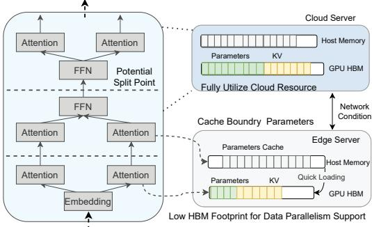

# 4.1 Edge-Cloud Collaborative Parallelism

Edge-cloud collaborative parallelism requires *boundary-aware* pipeline construction that explicitly models cross-domain transition costs. The core innovation centers on *boundary stages*—transition points where computation migrates between edge and cloud domains. Unlike homogeneous pipelines, boundary stages must reconcile computational asymmetry (0.48× disparity), memory hierarchy mismatch (65× bandwidth gap), and communication overhead (80× disparity), making boundary placement the primary performance determinant.

Boundary placement governs the privacy-efficiency tradeoff: edge-heavy configurations preserve privacy but sacrifice performance, while cloud-aggressive offloading maximizes efficiency at privacy cost. This distinguishes collaborative parallelism from traditional homogeneous optimization that assumes uniform resources.

#### 1) Heterogeneity-Aware Pipeline Formulation

We formulate collaborative parallelism as a boundary-constrained optimization problem that explicitly models heterogeneous resource transitions. Consider model stages  $\{l_1, l_2, \ldots, l_n\}$  distributed across edge domain  $\mathcal{E}$  and cloud domain C, where execution time  $T_{exec}(l_i)$  varies dramatically based on resource domain assignment. The boundary stage at position  $l_B$  incurs additional heterogeneous transition overhead  $T_{boundary}(l_B)$  encompassing cross-domain communication and state synchronization.

The optimization objective captures the essence of boundaryaware collaborative parallelism:

$$\min \left\{ \max_{1 \le i \le n} \left\{ T_{exec}(l_i) + \mathbb{I}_{boundary}(l_i) \cdot T_{boundary}(l_i) \right\} \right\}$$
 (1)

where  $\mathbb{I}_{boundary}(l_i) = 1$  if stage  $l_i$  crosses the edge-cloud boundary, and 0 otherwise. This formulation explicitly accounts for heterogeneous transition overhead that dominates collaborative parallelism performance, distinguishing it from homogeneous pipeline optimization.

The boundary overhead  $T_{boundary}(l_i)$  encompasses three heterogeneity-specific components: activation tensor serialization and deserialization, cross-domain transfer across heterogeneous network links, and state synchronization requirements between edge and cloud domains. Additionally, potential data format conversion between heterogeneous accelerators (e.g., CPU tensors to GPU format) contributes to the overall boundary transition cost.

Traditional pipeline optimization fails in edge-cloud environments due to resource asymmetry. Homogeneous approaches assume uniform resources, but edge devices exhibit only 52% computational efficiency versus cloud GPUs. This imbalance creates cascading stalls, degrading throughput by up to  $3.2\times$  compared to optimal boundary placement.

#### 2) Multi-Configuration Boundary Optimization

Traditional pipeline systems generate a single optimal configuration, but edge-cloud heterogeneity demands multiple boundary configurations to adapt to dynamic resource conditions. DynoPipe constructs a portfolio of boundary configurations, each optimized for different heterogeneous scenarios: bandwidth-constrained configurations minimize activation transfers; compute-constrained configurations maximize cloud utilization; memory-constrained configurations respect edge device limitations.

The boundary optimization employs dynamic programming to efficiently explore the exponential search space of heterogeneous resource assignments. We define  $F(d,l;\mathcal{R})$  as the optimal execution time for stages [1,l] using d heterogeneous domains under resource constraint set  $\mathcal{R}$ :

$$F(d, l; \mathcal{R}) = \min_{1 \le i \le l} \left\{ \max\{F(d-1, i-1; \mathcal{R}), \right.$$

$$T_{exec}(i, l) + T_{boundary}(i) \right\}$$

$$\left. \mid \mathcal{R}_{constraint}(l) \right\}$$
(2)

This recurrence explicitly models boundary stage overhead when transitioning between heterogeneous domains, enabling precise optimization under resource asymmetry. The constraint set  $\mathcal{R}_{constraint}(l)$  ensures that each configuration respects domain-specific limitations: edge memory bounds, cloud GPU availability, and network bandwidth thresholds.

The multi-configuration approach addresses static pipeline systems' inability to adapt to dynamic heterogeneous conditions. Edge-cloud environments exhibit temporal variations that shift optimal boundary placement within minutes: bandwidth fluctuations reduce capacity by 60-80% during peak usage, while thermal throttling decreases edge performance by 25-40%. Static configurations optimized for average conditions lead to resource underutilization or performance degradation under these dynamic scenarios.

#### 3) Activation-Aware Boundary Selection

The boundary selection algorithm evaluates heterogeneous transition costs through three domain-specific criteria. Activation-minimal boundaries (min  $|A_b|$ ) target tensor compression points where attention sparsity or quantization reduces cross-domain transfer volumes. Computation-balanced boundaries distribute workload proportionally to device capabilities  $(T_{edge}(1,b) \approx 0.48 \cdot T_{cloud}(b+1,n))$ , reflecting empirically observed edge-cloud computational asymmetry. Memory-aware boundaries respect edge constraints  $(\sum_{i=1}^b M_i \leq M_{edge}^{max})$  while maximizing local computation to minimize cloud dependency.

The algorithm integrates these criteria through adaptive weighting that responds to resource conditions: bandwidth contention prioritizes activation-minimal boundaries, compu-

Fig. 5: Potential split points in the LLM computational graph.

tational stress emphasizes computation-balanced placement, and memory pressure favors memory-aware configurations. This eliminates exhaustive boundary search while maintaining optimal performance across heterogeneous scenarios.

