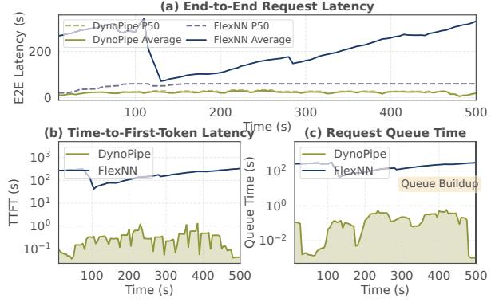
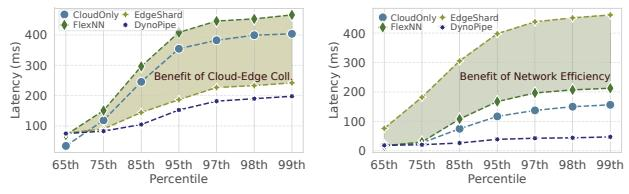

# 4.3 State Orchestration in Heterogeneous Pipelines

Hierarchical State Decomposition and Predictive Staging. DynoPipe introduces a state decomposition framework that categorizes pipeline state into three distinct tiers based on migration criticality and reconstruction complexity. *Critical frontier states* encompass KV caches and attention weights essential for maintaining generation coherence across boundary transitions. *Intermediate activations* represent layer outputs that can be selectively recomputed with bounded overhead. *Auxiliary metadata* includes normalization statistics and positional encodings that exhibit high spatial locality.

DynoPipe employs predictive parameter staging that exploits

Algorithm 1: Latency-Regulated Placement (LRP)

```
Input: Model stages S_1, \ldots, S_n; Edge devices E; Cloud devices C;
          Network state N
   Result: Heuristic stage placement minimizing pipeline latency
  Function ComputeCost (S_i, D_j, \lambda):
   return \alpha \cdot T_{comp}(S_i, D_j) + \beta \cdot T_{mem}(S_i, D_j) + \lambda \cdot T_{comm}(S_i);
{\tt 3} Function SelectBoundary ({\tt system\_state}):
4
       if bandwidth < \tau_{bw} then
           return boundaryactivation_minimal
       end
       if edge\_load > \tau_{compute} then
           return boundaryearly cloud
10
       if memory\_pressure > \tau_{mem} then
        return boundarymemory_aware
11
       end
12
13
       return boundarybalanced;
14 Pre-compute boundary configurations for resource scenarios;
15 while System active do
       state = monitor network, compute, memory conditions;
17
       target_boundary = SelectBoundary(state);
       if Boundary change AND improvement > \delta then
18
            \lambda = adapt weighting to dominant bottleneck;
19
            foreach stage Si do
20
                Find device D^* minimizing ComputeCost (S_i, D_j,
21
                Assign S_i \to D^* with hysteresis threshold \delta;
22
23
            Execute boundary migration;
       end
25
26 end
```

reconfiguration locality through a three-tier memory hierarchy. L1 staging caches hot boundary configurations with sub-millisecond access; L2 maintains secondary transition candidates; L3 provides demand-driven fallback. This anticipatory positioning eliminates cold-start penalties by pre-staging critical parameters at likely transition boundaries, reducing migration overhead from seconds to microseconds.

Single- vs. Multi-User KV Cache Management: Under single-user serving, KV caches grow linearly with context length and reside entirely within the assigned domain (edge or cloud). Under multi-user concurrent serving, per-request KV caches compete for edge GPU memory, which may trigger earlier boundary shifts to cloud-heavy configurations that reduce edge memory pressure. DynoPipe's state orchestration handles both regimes uniformly: the hierarchical tier structure evicts cold per-request caches (LRU policy) while preserving hot caches for active requests, and boundary selection accounts for aggregate KV memory via the memory-pressure trigger (>90%) in Algorithm 1.

Adaptive Recomputation Scheduling: When uplink bandwidth drops below 1Gbps, DynoPipe dynamically switches to a recomputation-based recovery mode. The system maintains lightweight checkpoints at strategic layer boundaries and reconstructs intermediate states through selective forward passes, trading modest compute overhead (15-25% increase) for dramatic bandwidth reduction (90% decrease).

## **5. Evaluation**

## **5.1 Experimental Setup**

We evaluate DynoPipe on a production-representative testbed that mirrors real-world edge-cloud deployments, using real request traces to stress-test dynamic orchestration under realistic workload variability. The testbed comprises a cloud cluster and a geographically distributed edge tier. The cloud cluster consists of 12 servers equipped with 16 NVIDIA A40 GPUs (48GB HBM2 each), interconnected via 100 Gbps RDMA-capable InfiniBand for low-latency inter-GPU communication. Each cloud server runs Ubuntu 22.04 with 512GB DDR4 memory, providing sufficient host resources for batched request processing and state management.

**Edge Environment.** The edge tier consists of NVIDIA RTX 3090 GPUs (24GB GDDR6X) deployed at geographically distributed edge locations. Edge devices connect to the cloud cluster through a shared 10 Gbps uplink (measured RTT: 5–50ms depending on cross-region routing and congestion), reflecting realistic WAN conditions for edge deployments. Edge-to-edge communication uses a local 1 Gbps LAN (RTT <3ms).

**Workload.** We evaluate DynoPipe using the Microsoft Azure Functions (MAF) trace [37], which captures production-scale request patterns with coefficient of variation exceeding 2.5 and inter-arrival times spanning four orders of magnitude. This workload's inherent burstiness and temporal clustering stress-tests dynamic resource allocation mechanisms critical for edge-cloud LLM serving [8, 38–41]. We map MAF invocations to LLM inference requests while preserving temporal correlations, with request parameters (prompt length, output tokens, temperature) sampled from the Splitwise distribution [42] to reflect realistic generation workloads.

**Baselines.** We benchmark DynoPipe against FlexNN [43] and EdgeShard [27], representing distinct paradigms in distributed LLM inference. FlexNN uses edge-centric pipeline parallelism with static layer allocation, exposing memory-compute constraints in edge-only deployments. EdgeShard implements fixed edge-cloud partitioning with offline optimization, revealing penalties of static allocation under dynamic conditions. We include a **Cloud-only** baseline (SP=0) to isolate pure-cloud performance and demonstrate that DynoPipe's gains arise from pipeline parallelism rather than cloud augmentation. These baselines isolate DynoPipe's dynamic orchestration contributions.

**Evaluation Metrics.** We evaluate DynoPipe using standard LLM serving metrics [44]: time to first token (TTFT), token throughput (Tput), and end-to-end (E2E) latency (mean, P50, P99) across batched requests.

### **5.2 System Performance**

Controlled workload evaluation (Table I) exposes fundamental scalability limits in edge-only architectures. FlexNN suffers catastrophic degradation as load increases: TTFT latency increases sharply from 19.68s to 68.53s between 2-8 QPS, with memory exhaustion rendering it unusable beyond 8

TABLE I: Performance of DynoPipe and FlexNN in LLaMA3.1-8B.

| QPS | Queue (s) |        | TTFT (s) |        | Tput (tok/s) |        |
|-----|-----------|--------|----------|--------|--------------|--------|
|     | DynoPipe  | FlexNN | DynoPipe | FlexNN | DynoPipe     | FlexNN |
| 2   | 0.30      | 43.86  | 0.10     | 19.68  | 922          | 277    |
| 4   | 0.40      | 55.78  | 0.47     | 27.03  | 1118         | 291    |
| 8   | 0.91      | 110.06 | 0.74     | 68.53  | 1327         | 304    |
| 16  | 1.25      | -      | 1.56     | -      | 1857         | -      |
| 24  | 1.49      | -      | 2.56     | -      | 2471         | -      |

*QPS: query/second.*

*Config: Temp=0.7, max out=4096 toks, max in=16392 toks, timeout=5s.*

TABLE II: Performance in different scale of models.

| Model       | Act.(M) Type |             | Throughput |                                 | TPOT (ms) |     |
|-------------|--------------|-------------|------------|---------------------------------|-----------|-----|
|             |              |             |            | FlexNN DynoPipe FlexNN DynoPipe |           |     |
| Whisper-V2  |              | 0.32 Speech | 1545       | 3900                            | 30        | 36  |
| LLaMA2-7B   |              | 1.2 Chat    | 263        | 2645                            | 54        | 73  |
| LLaMA3.1-8B |              | 1.45 Chat   | 290        | 1857                            | 68        | 65  |
| Qwen-14B-VL |              | 2.1 MM      | -          | 1640                            | -         | 84  |
| Qwen-32B-VL |              | 4.8 MM      | -          | 1309                            | -         | 134 |
| LLaMA3-70B  |              | 8.2 MM      | -          | 830                             | -         | 160 |

TPOT (Time Per Output Token) is calculated as the average decode time. MM refers to the multimodal model using LLM as the backbone. - indicates that the model cannot be deployed on the edge due to memory constraints.

QPS. DynoPipe maintains sub-second performance throughout, delivering 98.5% TTFT reduction and 4.4× throughput gains.

The root cause is edge memory-compute mismatch: efficient batching demands longer contexts, yet memory constraints force choosing between context length and concurrency. DynoPipe breaks this constraint through strategic layer placement—retaining input embeddings and initial attention at the edge while offloading memory-intensive operations to cloud. This enables 128K+ context processing with 16+ concurrent requests on resource-constrained edge hardware.

Scalability advantages amplify with model complexity (Table II). While FlexNN cannot deploy beyond 8B parameters, DynoPipe serves 70B models at 830 tokens/second with 160ms per-token latency. Performance gains scale with activation complexity: from 2.5× throughput improvement for WhisperV2 to 10.1× for LLaMA2-7B, demonstrating DynoPipe's fundamental advantage of edge-cloud workload distribution.

**TPOT vs. Throughput Trade-off.** The apparent contradiction between higher TPOT and lower mean latency in Table II arises from the distinction between per-token decode time and end-to-end request latency. DynoPipe's pipeline parallelism introduces modest per-token overhead from edge-to-cloud traversal (network transfer + cross-domain synchronization), increasing TPOT from 54ms to 73ms for LLaMA2-7B. However, this pipeline structure enables concurrent request processing that dramatically reduces queueing delay—the dominant latency component under load. Pipeline parallelism overlaps edge and cloud stages, allowing multiple simultaneous requests and reducing waiting time far more than per-token overhead adds. The 10.1× throughput gain reflects concurrent processing across pipeline stages, while TPOT measures sequential per-token decode latency. Detailed latency breakdown appears in §5.6.



Fig. 8: Latency comparison of DynoPipe and FlexNN in LLaMA3.1-8B model under MAF workload. (a) End-to-end latency. (b) Time to First Token Latency. (c) Queue latency.


Fig. 9: E2E latency comparison across systems for LLaMA2-7B and Whisper-v2 models under the MAF workload. DynoPipe provides the lowest tail latency across both models and the best or near-best average latency.

#### **5.3 Real-World Workload Performance**

We evaluate DynoPipe under the production MAF trace using LLaMA2-7B and Whisper-v2, and compare against CloudOnly, FlexNN, and EdgeShard [27]. CloudOnly runs the full model in the cloud, FlexNN keeps execution on the edge, EdgeShard uses a static split, and DynoPipe adapts the split online.

As shown in Fig. 9, DynoPipe mainly improves robustness under bursty arrivals. For LLaMA2-7B, it reduces P99 latency by 54%, 60%, and 16% compared with CloudOnly, FlexNN, and EdgeShard, while keeping mean latency close to the best baseline. For Whisper-v2, DynoPipe achieves the best overall performance, lowering mean latency by 19%, 15%, and 70%, and P99 latency by 66%, 76%, and 90%, respectively. These results show that online split adaptation is most beneficial for controlling tail latency under realistic edge-cloud workloads.

#### **5.4 Latency Distribution and Tail Performance Analysis**

We analyze DynoPipe's latency characteristics under the MAF workload to understand its tail performance behavior—a critical metric for production deployments. The latency distribution analysis (Fig. 10) reveals fundamental architectural differences. Edge-only deployment (FlexNN) exhibits catastrophic tail latency degradation—latency increases 6.7× from the 65th to 99th percentile for LLaMA2-7B due to resource exhaustion. EdgeShard's static partitioning provides marginal improvement (2.9× increase) but remains vulnerable to load spikes.



(a) Quantile of Latency of LLaMA2 (b) Quantile of Latency of Whisper Fig. 10: Quantile of latency of LLaMA2 and Whisper in MAF workload. (a). LLaMA2-7B. (b). Whisper. The shaded areas respectively show the performance improvements brought by edge-cloud collaborative inference and communication reduction.


Fig. 11: Average end-to-end latency under concurrent multi-task execution as the number of invokers increases from 2 to 4. (a) LLaMA2-7B. (b) Whisper-V2.

DynoPipe achieves superior tail latency control with only 2.2× variation across quantiles through dynamic load balancing and adaptive pipeline partitioning. For Whisper, DynoPipe achieves 99.8% lower P99 latency than EdgeShard and 85.3% lower than FlexNN. These results demonstrate that DynoPipe's adaptive optimization provides predictable performance guarantees essential for production systems, where tail latency directly impacts user satisfaction and service reliability.

