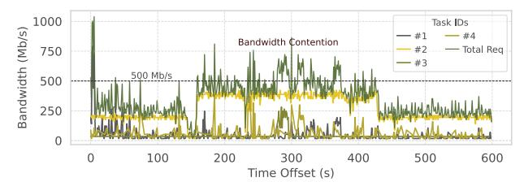

# **5.5 Multi-Task Performance**

We evaluate DynoPipe under concurrent multi-task execution by increasing the number of invokers from 2 to 4, comparing with CloudOnly, FlexNN, and EdgeShard on the same MAF-based workload. As shown in Fig. 11, the advantage of DynoPipe grows as concurrency rises. For LLaMA2-7B, CloudOnly has the lowest latency with 2–3 invokers, but DynoPipe outperforms others at 4 invokers and stays much more stable than FlexNN and EdgeShard as contention increases. For Whisper-V2, DynoPipe has the lowest latency from 3 invokers onward, while EdgeShard degrades sharply and both CloudOnly and FlexNN slow down at higher concurrency. These results show that dynamic boundary adaptation is most effective in multi-task scenarios: while it may not always yield the lowest latency at light load, it prevents the severe degradation seen in static or single-domain baselines under higher contention.

**Multi-Tenant Implications.** The multi-task evaluation demonstrates multi-tenant behavior: independent Poisson request streams from heterogeneous edge devices create concurrent resource contention analogous to multi-tenant serving. DynoPipe maintains <1.1× degradation with 4 concurrent sources and stable throughput across QPS=3/4/5, while EdgeShard degrades 45× and FlexNN degrades 1.8–3.1× under the same conditions. For context, production LLM serving systems such

Fig. 12: Bandwidth usage of each tasks and the total bandwidth request in MAF workload of EdgeShard. The requests between different tasks exhibit burstiness, and there is bandwidth contention in overlapping peak periods, while the bandwidth utilization is low during the rest of the time.

as AlpaServe [41] report 1.2–1.5× latency inflation under comparable multiplexing ratios on *homogeneous* GPU clusters; DynoPipe achieves tighter degradation despite operating across *heterogeneous* edge-cloud domains with WAN latency variability. The low switching frequency (<2 reconfigurations/min at QPS=5) further confirms that dynamic boundary adaptation generalizes to multi-tenant workloads without oscillation or per-tenant starvation.

