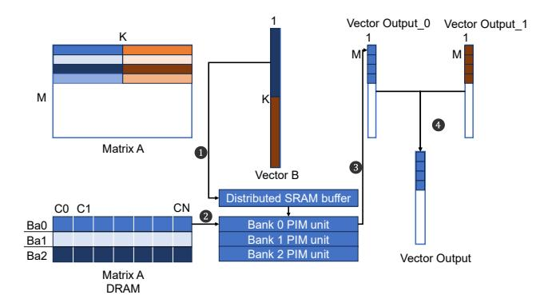

# D. PIM Applications and Access Patterns

PIMs exploit high internal bandwidth to accelerate memory-bound kernels but can be less effective for compute-heavy kernels due to area and power constraints. Efficient PIM execution is often achieved by distributing large, read-once data across banks while placing small, reused data in PIM SRAM buffers. This access pattern appears in LLMs [13], [33], [75], [76], [78], [83], various machine learning tasks, and data processing workloads [17], [18]. Although access patterns can be irregular, Recommendation models (RMs) [58] can benefit when large embedding vectors yield sequential memory accesses. Accordingly, both academia and industry have increasingly targeted these workloads for PIM deployment [11], [12], [17], [18], [30], [44], [59].

2We use the term PIM broadly to refer to both processing-in-memory and processing-near-memory architectures with digital logic. In this work, we categorize them as bank-PIM and rank-PIM.

Fig. 3: GEMV operation flow in bank-PIM.

Recent works have focused on memory-bound kernels such as GEMV, a core operation in LLMs, RMs, and other datacentric workloads. We use GEMV as a representative example, as illustrated in Figure 3. The host transfers operands to PIM buffers from host cache or DRAM. Compute units read from local DRAM and compute vector inner products. The compute units store results in local DRAM for future use or transfer them to the host. The host aggregates results across compute units to perform a reduction operation.

#### III. PIM RELIABILITY CHALLENGES

During standard DRAM reads, the host memory controller accesses multiple chips within a rank concurrently and reconstructs an ECC codeword from their collective output. It then performs error detection and correction on the codeword before forwarding data to the core. Because the codeword spans multiple devices, a fault confined to a single chip manifests as localized bit errors rather than corrupting the entire codeword.

Rank-PIMs operate at the same rank granularity as the host and therefore inherit the strong protection of rank-level ECC. Such redundancy can tolerate multi-bit and device-level faults; for example, chipkill-level ECC corrects the complete failure of one x4 device. However, operating at rank-level prevents compute units from independently exploiting each chip's internal bandwidth, fundamentally constraining performance.

In contrast, bank-PIMs place compute units within individual banks to maximize internal bandwidth. Redundancy is therefore typically confined within each bank rather than distributed across chips. Recent DRAM architectures incorporate on-die ECC; for example, DDR5 protects 128-bit data with 8 bits of redundancy and corrects single-bit errors [26] but cannot reliably detect or correct multi-bit errors. HBM3 employs symbol-based ECC whose correction capability depends on predefined fault isolation boundaries (e.g., subwordline-bounded, MAT-kill style ECC) [22], [25]. However, this design requires 2× the redundancy of DDR5 and does not guarantee correction or detection for fault modes that exceed these isolation boundaries (see subsection VI-A).

If bank-PIMs rely solely on on-die ECC, multi-bit faults can propagate as silent data corruptions (SDCs), weakening

overall system reliability. Designing robust ECC in bank-PIM is non-trivial because it requires carefully balancing this fundamental performance-reliability trade-off. To overcome this limitation, bank-PIMs must solve two challenges. First, even with limited redundancy, they must detect multi-bit errors to prevent SDCs. Second, because single-bit VRT errors can become dominant [9], they require lightweight mechanisms that handle frequent single-bit VRT errors without negating the performance advantages of near-bank execution.

