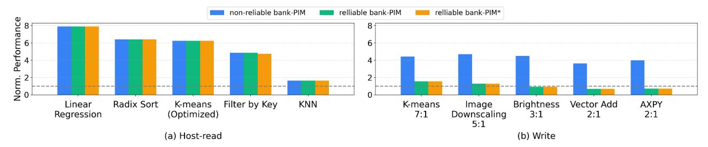

# E. Energy Comparison with HBM3 On-Die ECC

Unlike HBM3's on-die RS correction, which requires no additional DRAM accesses, our CRC-based scheme triggers rank-level correction that traverses the full bank-to-channel I/O path consuming 3.5× the energy per bit of a bank-local PIM operation in the all-bank PIM architecture we model [48]. Even for the kernel with the largest rank-level correction overhead (Filter by Key; subsection VI-D), the correction energy overhead is only 0.06% relative to the HBM3 bank-PIM (considering both PIM operations and host readouts). On the other hand, HBM3's RS decoder invokes finite-field multiplications and inversions on *every* access [49], [69] (subsection IV-D), whereas our CRC decoder is XOR-only.

## VII. DISCUSSION

While our reliable bank-PIM is evaluated with an all-bank PIM, it easily extends to other PIM variants. Systems utilizing long execution kernels instead of all-bank commands [12], [28] can implement our two-tier ECC with Codeword Flip if

Fig. 15: Performance comparison of the OPT13B LLM across configurations for latency (batch size 1) and throughput (batch size bound by KV cache capacity) optimized execution. The bottom (patterned) portion of each throughput bar shows the fraction of execution time spent on feed-forward GEMM operations while the top (solid) is the GEMV self-attention portion.

Fig. 16: Performance of bank-PIMs normalized to a rank-PIM under general bank-PIM friendly kernels [1]. (a) Kernels requiring host-side readouts. (b) Write-heavy kernels with read-and-execute to write ratio noted. Reliable bank-PIM refers to error-free performance, while reliable bank-PIM\* corresponds to a VRT error rate of  $10^{-5}$  performance.

the controller accurately tracks bank state to initiate rank-level recovery if necessary. Architectures like UpMem [3] require additional coordination mechanisms because each PIM unit performs independent control not coordinated with the host.

We evaluate reliable bank-PIM for DDR because DDR-based rank-level ECC is well understood and DDR maximizes the capacity benefits of off-package memory. However, the two-tier approach combined with Codeword Flip will be effective in any rank configuration, including ranks comprising LPDDR memories. In fact, the CRC16 variant we evaluate matches the on-die ECC redundancy of LPDDR5x indicated by Micron's Direct Link ECC Protocol (DLEP) [52], [53].

## VIII. RELATED WORK

To the best of our knowledge, this is the first paper to address reliability issues for bank-PIMs. Prior research in bank-PIM has largely overlooked reliability concerns, often suggesting recomputation as a solution [59]. However, given the challenges and frequency of VRT errors, and that they persist for a while once they appear [67], such recomputation solutions do not ensure progress. Additionally, multi-bit errors may go undetected during computation.

Recent industrial PIM implementations primarily use GDDR and HBM, which offer high external bandwidth [33], [43], [48]. While an HBM-PIM can leverage HBM3 RAS feature [22], it suffers from a high DUE rate and cannot match the reliability level offered by our reliable DDR5 bank-PIM.

Several studies have aimed to improve DRAM reliability, proposing solutions such as larger codewords [15], [34], codesigning on-die and rank-level ECC [20], [32], [56], and other mechanisms [35], [36], [73]. However, these approaches are tailored for conventional servers, where all accesses are at the rank level and cannot exploit bank-level locality.

#### IX. CONCLUSION

We propose a reliable bank-PIM featuring an ECC mechanism tailored specifically for bank-PIM configurations with DDR5 memory. We showed that the conventional ECC approaches for DDR5, relying on simple SEC, are insufficient to address SDC. To tackle this issue, we use CRC, which has better detection coverage. Furthermore, we introduced a novel codeword-flip VRT error masking mechanism. This approach ensures that a reliable bank-PIM architecture operates efficiently by using extensive multi-bit error detection coverage and efficient VRT single-bit error correction even under severe VRT errors and rare multi-bit errors in DRAM.

