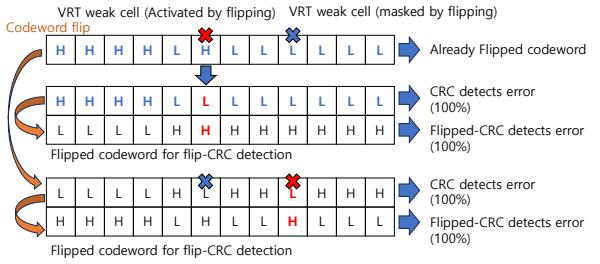
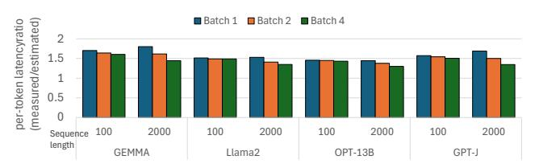

# IV. ECC ENABLED RELIABLE BANK-PIM

We present *reliable bank-PIM*, an architecture that preserves bank-local computation while achieving reliability comparable to rank-level ECC. Reliable bank-PIM builds on existing "all-bank" PIM architectures [43], [48] (see subsection II-C) and is implemented as a DDR5 bank-PIM. In our design, the dedicated ECC chips are not engaged in PIM computation, preserving their capacity for host-controlled reads that perform rank-level error correction.

We choose a DDR-based PIM rather than LPDDR- or HBM-based designs for two reasons. First, DDR offers the highest capacity-to-external-bandwidth ratio, increasing the benefit of exploiting internal PIM bandwidth. Second, we show that attaining high reliability requires a rank organization, which aligns naturally with DDR's rank structure; extensions to other DRAM PIM architectures are discussed in section VII.

Our design comprises two main components: (1) a two-tier ECC tailored for bank-PIMs, combining a detection-focused first-tier ECC (subsection IV-A) and a correction-focused second-tier ECC (subsection IV-B), (2) *Codeword Flip*, which mitigates scaling-induced VRT errors and reduces the need for frequent correction (subsection IV-C).

#### A. Near-Bank PIM Error Detection

Given the limited redundancy available at the bank level, reliable bank-PIM prioritizes error detection over local correction to maximize detection coverage. We therefore employ an on-die CRC that detects both single-bit errors from VRT cells and multi-bit errors from operational faults. Our primary design uses CRC83 (or simply CRC), which protects 128 bits of data with 8 bits of redundancy, matching the DDR5 on-die ECC configuration. We later evaluate CRC16 (128-bit data + 16-bit redundancy) to match the higher redundancy of HBM3 on-die ECC.

During PIM accesses, the CRC operates strictly in detectonly mode. When it detects an error, the rank-level correction is triggered by asserting an existing ALERT\_n pin to the memory controller. During non-PIM full-rank accesses, the same CRC is decoded as single-bit correction mode. Although enabling correction reduces detection coverage, these accesses always rely on rank-level ECC for multi-bit detection and correction. Local single-bit correction improves reliability by resolving isolated single-bit errors without exposing them to rank-level ECC, preserving the baseline reliability model. This

Fig. 4: Host memory controller rank-level correction flow. dual-mode approach allows the same code to both correct scaling-induced errors for host accesses, consistent with the original purpose of on-die ECC, and achieve higher detection coverage for PIM accesses.

To select between the two decoding modes, the ECC logic reads the PIM/non-PIM mode signal. This signal is already exposed through the configuration registers of the PIM unit [48], allowing the ECC logic to determine the current mode without requiring additional cycles. All-bank PIM switches between PIM and non-PIM modes through writes to these memory-mapped configuration registers. Further details of the ECC engine design are described in subsection IV-C.

## B. Rank-Level Error Correction

When bank-level CRC operating in detect-only mode identifies an error during PIM execution, the memory controller is notified and attempts rank-level correction. This correction uses the same rank-level ECC employed during normal host accesses. However, because bank-PIM activates multiple banks concurrently, the controller cannot immediately identify the faulty bank. It therefore follows the procedure illustrated in Figure 4, issuing sequential reads to each bank involved in the error-triggering all-bank PIM command using the original row and column addresses. Each read reconstructs a full rank-level codeword and applies chip-kill ECC.

After each sequential access, the controller writes back corrected data to DRAM. It then retries issuing the PIM command under the assumption that the error was transient or subsequently masked by the Codeword Flip mechanism described in subsection IV-C. This procedure can be implemented either in software (within the PIM driver) or in hardware (as a memory controller state machine). The software implementation introduces additional latency and limits parallelism due to memory fences required for operation reordering, whereas a synchronous hardware implementation avoids these overheads (evaluated in subsection VI-B).

&lt;sup>3E.g., the 8-bit CRC with polynomial  $x^8 + x^4 + x^3 + x^2 + 1$ .

If rank-level correction is triggered again after initial recovery, the memory controller escalates handling. It retries the access using a non-PIM decoding in a single-bit correction mode, relieving pressure on the rank-level ECC and reducing DUE rates; initial accesses use detection-only decoding to support Codeword Flip. If the correction still fails, the system emulates the PIM command on the host and may also trigger memory retirement.

Retirement mechanisms are used to prevent detectable multibit errors from escalating into SDCs as the on-die CRC provides weaker detection than rank-level ECC. Reliable bank-PIM retires memory more aggressively once certain multibit operational faults are observed. Specifically, we retire any memory page that overlaps with more than one faulty logical row or column, even if the fault can still be tolerated at the rank level. Our evaluation leads to two observations regarding such retirement. First, the cases that warrant retirement are easily identified using the detection-only on-die CRC. These faults are likely to trigger repeated rank-level corrections before an SDC is observed after an additional overlapping fault or VRT accumulates. Second, retirement is still rare, and overall system PIM throughput only degrades by 2% over 5 years of operation. Retirement is handled by the host.

#### C. Codeword Flip

Frequently triggering rank-level correction can severely undermine the performance gains of bank-PIMs. While retirement can be used to handle such cases from inherently-rare operational faults, VRT errors are too numerous and may manifest randomly at any location. On-die ECC in non-PIM mode handles VRT errors, but the detect-only CRC in PIM mode does not. To address this, we introduce the Codeword Flip mechanism, which masks VRT errors to prevent repeated corrections while retaining the CRC multi-bit error detection.

Codeword Flip exploits the key insight that an erroneous VRT cell will not produce subsequent errors if its state is flipped due to the unidirectional nature of VRT errors [41], [42], [66]. Individually identifying and flipping specific bits in response to a VRT is impractical and costly. Codeword Flip takes the simple approach of flipping the entire bank-level codeword, including both the data and redundancy bits on a bank that required correction at the rank level. While this whole-codeword flipping could potentially expose previously masked VRT cells that initially held a '0', our evaluations show that multiple VRT errors within a single codeword occur extremely rarely.

**Dual Flipped/Unflipped Decoding.** Flipping the codeword is simple and low-cost: after a rank-level correction, the corrected codeword is written back to DRAM, but with those bits that are mapped to the faulting chip(s) inverted by the memory controller. The memory controller still computes the rank-level ECC with no inversion.

We avoid metadata for tracking flip state, which would complicate decoding and require additional redundancy, by instead implementing parallel decoding using two hardware CRC decoders. Each decoder performs the same check: one

TABLE I: Dual decoding of CRC and F\_CRC identifies whether a codeword is flipped.

| CRC            | F_CRC          | Result                             |
|----------------|----------------|------------------------------------|
| Error detected | Not detected   | Codeword is Flipped                |
| Not detected   | Error detected | Codeword is Not Flipped            |
| Error detected | Error detected | 1 or more bit errors exist (Alert) |
| Not detected   | Not detected   | 1 or more bit errors exist (Alert) |

Fig. 5: ECC engine design using the CRC decoder of an adjacent bank as the dual decoder.

uses the codeword as stored and the other first inverts (flips) the codeword (F\_CRC) (Figure 5). The CRC we choose is one that, in cases of no single-bit errors or a masked single-bit VRT error, exactly one decoder reports no error.

The dual CRC and F\_CRC decoding results in four possible outcomes (Table I). For the cases of single-bit VRT errors or no errors at all, exactly one of the two decoders reports an "error", while the other does not. This specific result indicates whether the codeword was flipped and a single VRT error successfully masked. If an error exists, both decoders are likely to detect errors, and an alarm is raised to trigger rank-level correction. This is true both for the case of two VRT errors and also for most of the single-/multi- bit errors caused by operational faults. If neither decoder detects an error then both missed detection of a multi-bit error and rank-level correction is triggered. It is also possible, though highly improbable, that a multi-bit error is incorrectly interpreted as a correct flipped or unflipped decoding. These cases are included in our reliability evaluation (subsection VI-A).

**Dual Decoder Design.** Figure 5 shows an ECC engine shared by a bank pair that enables our tailored solution for reliable bank-PIM, supporting both the two-tier ECC scheme and Codeword Flip. To keep the ECC engine overhead low, we implement one CRC decoder per bank and use the paired bank's decoder as the flipped dual decoder. The only difference for F\_CRC decoding is that it operates on an inverted input; thus, we route one bank's codeword to the paired bank's CRC decoder input instead of building two separate CRC engines per bank.

(a) Flip-CRC detection and masking process for one VRT weak cell, showing error detection before and after Codeword Flip.

(c) Flip-CRC detection when two VRT weak cells are in the same state, demonstrating error detection capability.

(b) Flip-CRC detection when two VRT weak cells are in different states, demonstrating error detection capability.

(d) Hamming(136,128) code performance on single and double bit errors, highlighting significant error rate challenges.

Fig. 6: The Flip-CRC mechanism compared with the Hamming code under one and two VRT weak cells.

#### D. DRAM Hardware Changes and Overheads

The proposed design introduces limited modifications to the DRAM datapath while reusing existing DDR5 and all-bank PIM mechanisms. We summarize the changes below. We do not discuss changes needed for the baseline all-bank PIM.

Per-bank ECC Engines. Current on-die ECC designs likely place ECC engines at the chip or bank-group level. The reliable bank-PIM requires two ECC engines per PIM unit (one per bank). Prior work estimates the area overhead of an ECC engine per bank-group at 0.65% [9]. Extending this estimate to a per-bank engine yields a total overhead of 2.6%. Routing Across Paired Banks. To support dual decoding for Codeword Flip, ECC engines are placed near the per-bank-pair PIM unit at the bank I/O (Figure 5). Each ECC engine pair is shared by each two banks: a codeword from one bank is processed by the paired bank's CRC engines during PIM execution to support Codeword Flip, requiring cross-bank routing. The timing between all-bank PIM column commands is longer than that of standard column commands [48], providing sufficient slack for this routing.

Communicating Detected Errors With ALERT\_n pins. Bank-level error detection reuses the existing DDR5 ALERT\_n pin [26] to notify the memory controller without introducing additional interface signals. Since this pin is defined to report write CRC errors in DDR5, it can be reused to signal read-path error detection during PIM execution. This requires additional wiring from the error detection logic associated with each bank-pair engine to the ALERT n pin.

**Timing Overhead of Dual CRC Detection.** A parallel CRC decoder computes each syndrome bit as a fixed XOR combination of the codeword bits, requiring no finite-field

multiplications [49], [54]. For CRC8(136,128), the critical path totals 11 two-input gate levels.4 The SEC(136,128) Hamming decoder [26] shares the same syndrome depth but additionally requires error-position decoding and a corrective XOR, reaching an estimated 12-13 levels [49]. Dual CRC for Codeword Flip adds one inverter and one comparison gate in parallel with the primary decoder, for a total of approximately 13 levels—comparable to SEC. The HBM3 ondie ECC design in [22], [68] employs RS codes over GF(28) or  $GF(2^{16})$ , whose decoder requires finite-field multiplications and inversions [49]. Optimized RS decoder architectures report a per-stage critical path of at least one finite-field multiplier plus one adder [69], with each GF(28) inversion sub-circuit alone requiring approximately 10 gate levels [77], placing the overall RS correction path substantially deeper than dual CRC or DDR5 SEC.

## E. Detection and Correction Example

Figure 6a illustrates the process for detecting and masking a single VRT cell within a codeword using two CRC decoders with rank-level correction. This method involves flipping the codeword before storage, eliminating the need for repeated error corrections. Figure 6b shows the situation in which a masked VRT cell suffers another VRT error, resulting in rank-ECC overhead for each access due to persistent errors. However, it can be detected with 100% probability. Figure 6c explores the challenges of detecting two concurrent VRT faulty cells. It highlights the higher probability of detection achieved by the proposed mechanism compared to the conventional Hamming code used for on-die ECC in DDR5. Figure 6d

 $^4\text{An XOR}$  reduction tree of depth  $\lceil\log_2136\rceil=8$  levels followed by an 8-bit zero-check of depth  $\lceil\log_28\rceil=3$  levels.

Fig. 7: Odd/even bank pipelining.

shows the Hamming code correction and detection capability that detects with a probability of only 53.7%. However, our mechanism detects these errors with 99.5% probability.

The dual CRC decoding of the flipped codeword can detect more errors than the current DDR5 and HBM3 ECC implementation. In subsection VI-A, we discuss the reliability evaluation of our mechanism in comparison to Hamming and Reed-Solomon codes which are implemented for DDR5 and in HBM3. This comparative analysis demonstrates our mechanism's superior reliability over SEC code-based bank-PIMs. If 16-bit redundancy is offered on-die (as with HBM3), protection is even stronger as other faults can also be detected, including faulty decoders and word line drivers.

## F. Odd/Even Bank Pipelining and Energy Considerations

All-bank PIM architectures are constrained by the four-activation window (tFAW), which limits the number of concurrent row activations. As a result, the controller must wait for the rows of all banks to be activated before issuing an all-bank command, introducing idle bubbles during PIM execution. These bubbles can be eliminated either by relaxing the tFAW constraint at the circuit level [23], [43], or by activating a subgroup of banks and pipelining activations with accesses. We adopt the latter approach: we partition banks into odd and even groups and explicitly interleave their execution by activating one group while accessing the other (Figure 7).

Although not strictly necessary for reliability, odd/even bank pipelining enhances our rank-level correction mechanism. When receiving an error alert, the controller needs to scan only half of the banks. While prior work (e.g., [28]) proposes internally pipelining all-bank commands within the PIM, our mechanism achieves comparable performance (results not shown), and explicit bank grouping simplifies identifying the exact column PIM command that triggered correction. It also improves overall performance, increasing PIM utilization from 55% to 91%.

Odd/even bank pipelining additionally mitigates energy overhead. Because correction occurs while the row remains open for PIM execution, the design avoids additional row activations for ECC updates. Prior studies [43], [48] report that PIM-enabled memory increases overall power by approximately 5%. Our design introduces no additional off-chip

communication and reuses already open rows for correction, so its incremental energy impact remains similarly low.

## G. ECC Update Overheads for Rank-Level ECC

In reliable bank-PIM, any write requires updating the corresponding rank-level ECC redundancy, which incurs a read-modify-write (RMW) cycle because the memory must read the existing codeword before recomputing redundancy. However, for read-dominant PIM workloads (see subsection II-D), the system can avoid RMWs by buffering intermediate outputs in local PIM SRAM and allowing the host processor to read them only when the final result is required. Recent industrial PIM prototypes [43], [48] demonstrate that high performance remains achievable even without explicit PIM store commands. This approach preserves the inherent advantages of near-bank computation while deferring complex rank-level ECC updates to the host, thereby maintaining both performance and reliability.

#### V. METHODOLOGY

## A. Reliability Modeling

We evaluate the reliability of reliable bank-PIM under realistic fault models using a DRAM reliability simulator based on prior work [27], extended to incorporate our CRC and error correction logic. The simulator models both inherent faults and operational faults, including intermittent and permanent faults. We model burst fault modes (column, row, pin, and chip faults) and capture their overlap with VRT-induced errors. The simulator tracks miscorrections due to bit flips at the bank and rank levels under CRC and Codeword Flip.

We implement a page retirement policy that retires any page overlapping an operational fault affecting more than a single row or column, even if the fault is correctable at the rank level. Due to this retirement policy, the performance impact of the all-bank rank-level correction procedure is measured over short windows dominated by VRT errors.

We report SDC and DUE probabilities over 5 years of operation for a 20-chip x4 16Gb DDR5 DIMM (two sub-channels) with one PIM unit per two banks. Each PIM unit uses on-die ECC locally to detect or correct errors, and we vary ECC redundancy to match DDR5 and HBM3 configurations. Ranklevel ECC provides chip-kill correction with two redundant chips per rank. For HBM-PIM comparison with HBM3 RAS features, we also model a system with two 8-hi 16Gb HBM3 stacks, excluding the additional 16-bit metadata reserved for system-level uses. For rank-PIMs, we model on-die ECC with bounded-fault support [14], [26] and chip-kill-style ECC [34].

#### B. VRT Error Rate Range

DRAM vendors do not publicly disclose raw VRT error rates, which creates uncertainty when selecting optimal ECC schemes with respect to VRT error magnitude. To estimate a realistic VRT range, we derive a bound using data reported in a recent industrial study [46] by Samsung. The study reports that enabling on-die ECC in DDR5 increases refresh time by more than  $4\times$  and improves the observed bit error

TABLE II: Evaluation Parameters.

|                                                                                                        | DRAM timing parameters (DDR5-6400, 16Gb, x4)              |                                                 |                                        |             |          |  |
|--------------------------------------------------------------------------------------------------------|-----------------------------------------------------------|-------------------------------------------------|----------------------------------------|-------------|----------|--|
| tBL=8                                                                                                  | tCCDS=8                                                   | tCCDL=16                                        | tCCDL_WR=64                            | tCL=48      |          |  |
| tRC=150                                                                                                | tWR=96                                                    | tFAW=40                                         | tRCD=48                                | tRAS=104    |          |  |
|                                                                                                        | PIM configuration                                         |                                                 |                                        |             |          |  |
|                                                                                                        | 4 MUL/ADD FPU                                             | Js                                              | 1KB scratch pad                        |             |          |  |
| Datapath width: 64bit                                                                                  |                                                           |                                                 |                                        |             |          |  |
|                                                                                                        | Off chip bandwidth per rank: 25.6GB/s                     |                                                 |                                        |             |          |  |
| On chip bandwidth per rank: 204.8GB/s                                                                  |                                                           |                                                 |                                        |             |          |  |
| # of ranks:                                                                                            | 4                                                         | # of channels:                                  | 8                                      | # of banks: | 32       |  |
| Short term reliability and performance simulation                                                      |                                                           |                                                 |                                        |             |          |  |
| Microbench                                                                                             | GEMV                                                      | C stationary, blocked BLAS computation          |                                        |             |          |  |
| Error model Assume stationary VRT errors for a short period (<1 hour) Inject errors in N bit positions |                                                           |                                                 |                                        |             |          |  |
| Long term reliability simulation                                                                       |                                                           |                                                 |                                        |             |          |  |
| Error model   Inject errors based on an open-source DDR5 DRAM FIT rate and error patterns [27]         |                                                           |                                                 |                                        |             |          |  |
| End-to-end performance simulation                                                                      |                                                           |                                                 |                                        |             |          |  |
|                                                                                                        | GEMMA [75] 7B parameters, 15.5GFLOPs per token generation |                                                 |                                        |             | neration |  |
| LLM                                                                                                    | Llama 2 [76]                                              | 7B pa                                           | ameters, 13GFLOPs per token generation |             |          |  |
| LLM                                                                                                    | OPT-13B [83]                                              | 13B parameters, 25.2GFLOPs per token generation |                                        |             |          |  |
|                                                                                                        | GPT-J [78]                                                | 6B parameters, 11.3GFLOPs per token generation  |                                        |             |          |  |

rate by  $10^{-6}\times$ . Without on-die SEC, a single-bit VRT error results in a failure, whereas with on-die SEC, failures occur only when two or more bits fail. Following prior empirical methodology [64], [65], we model VRT retention errors as independent, uniformly distributed bit failures and therefore apply binomial statistics to estimate failure probabilities.

Let *X* denote the per-bit VRT retention error probability within a refresh window. Assuming independent bit failures, the probability of a single-bit failure in a 128-bit data block without ECC is:

$$P_{\text{1-bit, noECC}} = \binom{128}{1} X (1 - X)^{127} \tag{1}$$

With on-die SEC, failure occurs only when two or more bits fail within a 136-bit codeword (128 data + 8 redundancy bits). The dominant term is the two-bit failure probability:

$$P_{\text{2-bit, ECC}} = \binom{136}{2} X^2 (1 - X)^{134}$$
 (2)

With the reported  $10^{-6}$  failure-rate reduction, we equate:

$$P_{\text{1-bit, noECC}} \cdot 10^{-6} = P_{\text{2-bit, ECC}} \tag{3}$$

Solving Equation 3 yields  $X \approx 1.4 \times 10^{-8}$ . We use this value as a lower bound in our evaluation and additionally sweep higher VRT rates to account for scaling trends. Plugging in the derived value of X, the probability of multiple VRT errors in a codeword is dominated by  $P_{\text{2-bit, ECC}} \approx 10^{-12}$ , which is about  $10^{-6}$  times smaller than the probability of a single VRT error. We model VRT using a per-bit VRT error rate rather than assuming a single VRT cell per codeword, thereby naturally capturing the possibility of multiple VRT errors within the same codeword in subsection VI-B.

Fig. 8: Measured vs. modeled average per-token decoding latencies for four LLM models on A100 for sequence lengths of 100 and 2000 tokens and a 200-token input.

## C. Performance Modeling

PIM Simulator. We extend Ramulator2 [51] to model our DDR5 bank-PIM and the overheads of the proposed ECC mechanisms. We implement all-bank commands with DDR5 timing parameters (Table II), odd/even bank pipelining, and rank-level error correction controlled either by hardware in the memory controller or by a software handler that inserts fences to ensure host–PIM visibility and serialization of correction. For each kernel, we collect a trace of PIM commands and feed it to the modified Ramulator2 to estimate execution time, including kernel execution and all data transfers to and from the host. Replication and reduction operations are performed at the host and included in the timing model.

**GPU Performance Model.** We model GPU performance analytically by estimating the execution time of data transfers and GEMV/GEMM kernels. Using a first-order roofline model, we assume peak utilization of memory bandwidth and compute throughput for each GPU configuration (A100, A100\*, and a weak GPU host). We compute the expected execution time for the main self-attention and feed-forward layers, including associated data transfers and communication, while excluding minor vector and scalar computation layers.

We validate the analytical model on an A100 PCIe 40GB system running TensorRT-LLM v0.8.0 [2] with CUDA 12.0. We generate sequences of 100 and 2,000 tokens for four LLMs: GEMMA [75], Llama 2 [76], OPT-13B [83], and GPT-J [78]. Figure 8 reports the ratio of measured to modeled average per-token latency. The roofline model underestimates per-token latency by approximately  $1.5\times$  across all models and sequence lengths. The model consistently underestimates GPU latency to favor the GPU baseline, and therefore offers a reasonable approximation for end-to-end LLM PIM benefits within the scope of this study.

## D. System Configurations

We evaluate reliable bank-PIM on a DDR5-6400 system with eight channels, each containing four ranks (timing parameters in Table II). Each DDR5 chip has 32 banks, with one PIM unit per every two banks. Each PIM unit integrates four BF16/FP16 mul/add FPUs on a 64-bit datapath. Following Samsung's HBM-PIM and SK Hynix's AiM designs, we issue one PIM instruction per tCCDL window. This configuration provides  $8 \times$  higher internal PIM bandwidth than the per-chip

&lt;sup>5Initial experiments on H100 exhibit similar accuracy trends.

external bandwidth, enabling up to  $32\times$  theoretical speedup per channel.

In addition to evaluating reliability and kernel performance in isolation, we evaluate end-to-end application performance under six configurations: (1) an A100 GPU (311 TFLOPs, 1.5 TB/s HBM2e), (2) A100\*, an idealized variant that combines A100 compute and bandwidth with DDR5 capacity, (3) fully offloading computation to reliable bank-PIM (6.4 TB/s internal bandwidth), (4) a lightweight GPU host (41 TFLOPs) with reliable bank-PIM using 204 GB/s eight-channel DDR5 external bandwidth, (5) the lightweight GPU with rank-PIM on DDR5, and (6) HBM\_PIM with 8× higher internal bandwidth than HBM2e (12 TB/s internal bandwidth).

## E. Applications

We focus our evaluation on generative LLMs, as self-attention in long-sequence generation is well suited for PIM acceleration [13], [31], [33], [60]. We evaluate a GEMV kernel as a microbenchmark using matrix dimensions matching recent LLMs [83], and model end-to-end sequence generation with OPT-13B [83]. We discuss the relevance to other PIM operations in section VII. We follow the transformer-based LLM described by Kim et al. [31] to do PIM mapping. In this mapping, self-attention layers are expressed as GEMV operations that can be offloaded to PIM. In contrast, fully connected feedforward layers can be batched across concurrent queries and executed more efficiently as GEMM on the host (although they can also run on PIM when optimizing for batch-1 latency).

While our primary case study focuses on LLM inference, the proposed reliability mechanisms are applicable to other PIM kernels as well. Many PIM kernels are read-intensive and make heavy use of local buffers and registers, but we also evaluate workloads with higher write intensity and different ratios between PIM operations and host reads. We implement and evaluate kernels from PIMBench [71] in our simulator, closely following their public implementation [1]. We only evaluate those benchmarks for which Siddique et al. report positive speedup with an all-bank PIM [71]. To support the PIMBench applications, we augmented the simulated architecture with several simple instructions that we model as having the same latency as multiply-add, including: absolute value, less-than, clamp, and bit-level operations. We do not use instructions that require cross-bank communication and perform such reduction operations on the host.

We add one optimized kernel on top of the original PIM-Bench implementation (K-means Optimized), where we utilize the local buffer in each PIM unit to track the minimum distance and centroid for each sample. With this optimization, reductions are performed within each PIM unit, with only centroid membership written for each sample and cross-bank reduction performed by the host at the end of the kernel.

