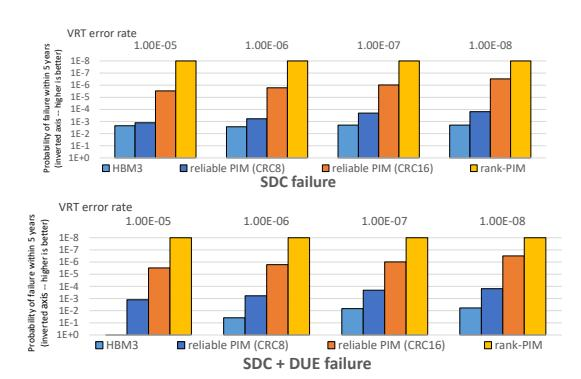
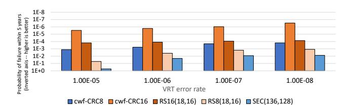
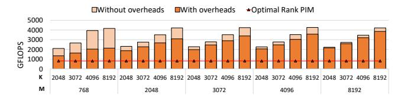
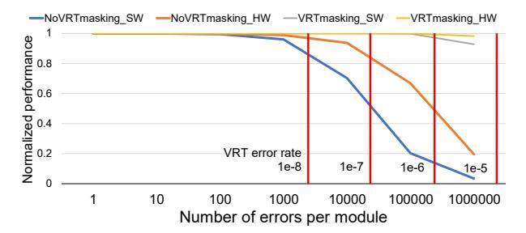
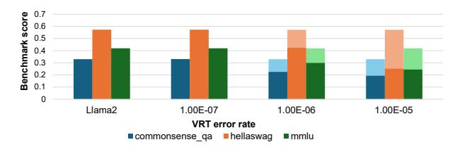

# VI. EVALUATION RESULTS

## A. Reliability Analysis

We evaluate reliability by simulating expected failure rates over five years of operation while sweeping VRT error rates.

Fig. 9: SDC and SDC+DUE rates over 5 years comparing a reliable bank-PIM, an HBM3 bank-PIM, and a rank-PIM (inverted y-axis—higher bars indicate better reliability).

Fig. 10: SDC failure rates with various types of on-die codes: cwf-CRC8 and cwf-CRC16 use our Codeword Flip mechanism with 8-bit or 16-bit CRC dual decoding to both detect and

with 8-bit or 16-bit CRC dual decoding to both detect and mask VRT errors (after rank-level correction). The other codes attempt error correction in DRAM, but still rely on the second-tier rank ECC for better reliability.

Failure modes are categorized as detected uncorrectable errors (DUE), silent data corruptions (SDC), and *total failures* (SDC + DUE). We evaluate both CRC8 and CRC16 configurations. **Overall Reliability.** Figure 9 shows the expected SDC and total failure rates over five years, comparing reliable bank-PIM (with on-die CRC8 and CRC16) against DDR5 rank-PIM and HBM3 bank-PIM (with on-die RS(19,17) ECC [22]).

Reliable bank-PIM with CRC16 achieves a  $2\text{--}10\times$  lower SDC rate and a  $30\text{--}80\text{K}\times$  lower total failure rate than HBM3 bank-PIM with comparable redundancy. Rank-level correction keeps the DUE rate low in reliable bank-PIM, whereas HBM3 bank-PIM has significantly higher DUE rates. Reliable bank-PIM with CRC8 maintains a substantial reliability advantage while using half the redundancy of CRC16. This demonstrates that our reliable bank-PIM effectively balances the reliability-performance tradeoff. We later show that this balance better aligns with LLM-based AI workload requirements.

We also evaluate repurposing HBM3's system-level metadata redundancy to improve HBM3 bank-PIM reliability (not shown in the figure). With the more expensive RS(19,16) ECC, HBM3 bank-PIM matches rank-PIM's SDC rate; however, the total failure rate remains elevated due to DUEs from operational faults in internal structures (e.g., decoders which fall outside the MAT-level protection boundaries).

**On-Die ECC and CRC Reliability Analysis.** Figure 10 reports the expected SDC rate over five years for reliable

TABLE III: Detection and correction accuracy across varying faulty cell counts and burst errors using cwf-CRC8(136,128), cwf-CRC16(144,128), DDR5 in-DRAM SEC(136,128), and HBM3 RS16(18,16).

|                   | cwf-CRC8(136,128) | cwf-CRC16(144,128) | SEC(136,128) | RS16(18,16) |
|-------------------|-------------------|--------------------|--------------|-------------|
| 1b (1-bit)        | 100%              | 100%               | 100%         | 100%        |
| 2b (2-bit)        | 99.5%             | 100%               | 53.7%        | 98.2%       |
| 3b (3-bit)        | 99.5%             | 99.998%            | 42.3%        | 95.6%       |
| 8b aligned burst  | 99.8%             | 100%               | 35.0%        | 100%        |
| 16b aligned burst | 99.5%             | 99.9995%           | 27.8%        | 100%        |

bank-PIM under different on-die ECC/CRC mechanisms, all combined with second-tier rank-level ECC. We focus on SDCs because they dominate total failures.

SEC(136,128), used in DDR5 on-die ECC [26], protects 128-bit data with 8 bits of redundancy. RS8(18,16), which uses 16 bits of redundancy (similar to RS16(19,17) in HBM3), improves detection coverage, but is still limited. Increasing the codeword granularity to 256 bits with RS16(18,16) strengthens detection by roughly an order of magnitude, but requires a wider internal fetch than supported in DDR5. We evaluate Codeword Flip with CRC8 (cwf-CRC8(136,128)) and CRC16 (cwf-CRC16(144,128)). CRC8 protects 128-bit data with 8 bits of redundancy, while CRC16 uses 16 bits. Codeword Flip requires an additional flipped codeword.

Using CRC to prioritize detection expands the reliability-cost trade-off space. CRC8 improves SDC coverage by an order of magnitude over RS8(18,16) and approaches the reliability of RS16(18,16) despite using half the redundancy. CRC16 further improves detection and exceeds RS16(18,16) by more than an order of magnitude at the same redundancy level. Recall that this benefit arises from a PIM-specific optimization that exploits the read-dominant DRAM access pattern commonly exhibited by PIM applications that perform their writes to an SRAM buffer.

Table III summarizes detection and correction probabilities under different error scenarios. This explicitly considers the accuracy for both the detection and correction accounting for rank-level correction. The cwf-CRC8 and cwf-CRC16 schemes use dual decoding with Codeword Flip. Codeword Flip might yield multi-bit error patterns; for example, two VRT cells may manifest as a 2-bit error in the regular decoder and no errors in the flipped codeword, or a 1-bit error in each, or a 2-bit error in the flipped decoder input. We consistently assume the worst-case in Table III.

Two conclusions emerge. First, prioritizing detection over local correction substantially improves detection coverage. Second, CRC with 16-bit redundancy achieves high detection and masking accuracy, exceeding both DDR5 SEC and HBM3 symbol-based ECC.

Using CRC for Single-Bit Error Correction. As described in subsection IV-B, we attempt local single-bit correction using CRC decoding (in non-PIM mode) after rank-level correction fails. This secondary correction may introduce additional bit flips—particularly in burst-error regions—but remains benefi-

Fig. 11: Reliable bank-PIM SDC, DUE, and SDC + DUE 5-year failure rates; Using the CRC for single-bit correction improves DUE rates substantially.

cial overall. It resolves isolated single-bit faults and mitigates overlapping error patterns (e.g., burst errors combined with single-bit faults) that rank-level ECC alone cannot handle. Even if it accidentally adds a flip within a bursty region, rank-level correction still corrects errors from the erroneous chip.

Figure 11 shows the impact of enabling single-bit CRC correction on failure rates for CRC8 and CRC16. CRC8 yields limited improvement in total failure rate due to its already high SDC rate. In contrast, CRC16 benefits substantially, delivering over  $100\times$  improvement in overall reliability. This mechanism reduces DUE incidence and may prevent forward progress before page retirement.

## B. Performance Analysis

We analyze performance in two phases: (1) the short-term impact of PIM error correction and (2) the long-term impact of correction combined with page retirement. We first compare reliable bank-PIM and rank-PIM under error-free conditions. We then quantify the overhead of our correction mechanism and show that it preserves the performance advantage of bank-PIM in both short- and long-term operation.

Error-Free Performance. Recall that a DDR5 bank-PIM is  $8\times$  faster than a DDR5 rank-PIM. In practice, pre- and post-kernel data movement for replication and reduction (section IV) reduces this advantage. Figure 12 shows that bank-PIM consistently outperforms rank-PIM across GEMV dimensions representative of common LLMs. Bank-PIM achieves  $1.5\text{--}4\times$  higher performance, with the advantage increasing as matrix and vector sizes increase. Larger output dimensions (M) improve buffer residency and PIM utilization, while larger input dimensions (K) amortize replication and reduction overheads, reducing their relative overheads.

**Short-Term Performance Impact.** We quantify the performance overhead of rank-level correction triggered by ondie CRC error detection and evaluate how Codeword Flip mitigates this overhead. Figure 13 compares reliable bank-PIM against error-free bank-PIM while varying the number of VRT cells per rank. We evaluate four correction configurations: software-handler correction (requiring memory fences) with

Fig. 12: PIM GEMV microbenchmark performance with various matrix sizes: A is  $M \times K$ , B is  $K \times 1$ , and C is  $M \times 1$ 

Fig. 13: Reliable-PIM performance across varying VRT error rates; the vertical lines correspond to the VRT error ratios used for the reliability evaluation (Figure 9).

and without VRT masking, and hardware-based correction with and without VRT masking.

Three observations follow. First, directly applying conventional two-tier ECC (e.g., XED [56]) to bank-PIM—detecting at the bank level and correcting at the rank level—significantly degrades performance. Without VRT masking, even 10,000 VRT cells ( $\approx$  1 per  $10^7$  DRAM bits) reduce PIM performance by > 20%. We also note that enabling two-tier ECC for bank-PIM also requires additional architectural enhancements (section IV).

Second, Codeword Flip effectively mitigates this performance loss. With VRT masking enabled, the correction overhead remains <2% even with a large number of VRT errors per rank. Third, hardware-based correction sustains higher performance than software-handler correction because the latter requires memory fences to synchronize with the controller. Hardware-controlled rank-level correction requires only a small state machine. However, this advantage narrows once Codeword Flip reduces the correction frequency.

Long-Term Performance Impact. Over time, DRAM accrues permanent operational faults. These faults trigger repeated corrections and may overlap with VRT-induced errors, increasing SDC risk. Reliable bank-PIM retires pages that exhibit operational faults affecting more than one logical row or column. Even under a conservative policy that retires an entire DRAM module rather than a single page, system-wide PIM throughput decreases by less than 2% over five years. This limited impact reflects the low expected DDR5 fault rate of approximately 45 FIT per chip [27].

**Host-Side Correction Path Overhead.** Rank-level correction incurs host-side overhead when the memory controller switches from PIM execution to host-side correction and completes the correction sequence across the affected banks. Table IV breaks down the latency per PIM access that triggers

TABLE IV: Host-side correction latency per PIM access that triggers correction under the worst-case VRT rate of  $10^{-5}$ . The baseline single-chip, single-bank correction sequence covers 99.9998% at the nominal VRT rate.

| Num. of | Num. of          | Additional                      | Correction                      | Occurrence  |
|---------|------------------|---------------------------------|---------------------------------|-------------|
| Faulty  | Banks            | Requests                        | Latency                         | Probability |
| Chips   | w/ Alerts        | vs. Baseline                    |                                 |             |
|         | 1                | =                               | 63.75 ns                        | 84.988%     |
| 1       | 2                | 1 write                         | 66.25 ns                        | 13.071%     |
|         | $3 \le N \le 16$ | (N-1) writes                    | Min: 68.75 ns Max: 101.25 ns | 0.981%      |
| 2       | 1                | 1 read                          | 66.25 ns                        | 0.762%      |
| 2       | $2 \le N \le 16$ | 1 to $N$ reads + $(N-1)$ writes | Min: 68.75 ns Max: 141.25 ns | 0.195%      |
| ≥ 3     | $1 \le N \le 16$ | 1 to $N$ reads + $(N-1)$ writes | Min: 66.25 ns Max: 141.25 ns | 0.003%      |

correction. The common baseline case is a single alerting bank with an error confined to one chip within the codeword; it requires 63.75 ns, corresponding to 17 single-bank requests under our timing configuration (subsection V-D).

Higher-latency cases occur only when multiple alerts or faulty chips overlap within the same affected rank-level codeword. Even under the worst-case VRT rate of  $10^{-5}$ , correction-triggering accesses remain concentrated in the lowest-latency cases: 84.988% follow the baseline 63.75 ns sequence, and another 13.833% complete in 66.25 ns. The remaining 1.179% enter longer multi-bank or multi-chip correction paths, which can reach up to 141.25 ns but are statistically rare. At the nominal VRT rate, 99.9998% of correction-triggering accesses fall into the baseline case. The correction sequence can be overlapped with the PIM-host mode switch (which incurs 37.5 ns on Samsung's all-bank PIM prototype [33]) and the memory controller can also interleave host memory requests if necessary to meet any QoS constraints during correction.

## C. LLM Accuracy and End-to-End Performance

We evaluate the impact of VRT errors on LLM inference accuracy to quantify the importance of reliability even for errortolerant AI workloads. We measure Llama2 accuracy on three language understanding benchmarks: CommonSenseQA [74], HellaSwag [82], and MMLU [24]. During inference, we inject synthesized VRT errors uniformly at random into model weights and the KV-cache. We compare a reliable bank-PIM with a baseline bank-PIM with on-die SEC(136,128) ECC. Although our experiments focus on VRT errors, the conclusions extend to other fault modes because multi-bit faults further amplify accuracy degradation.

Figure 14 reports benchmark scores for varying VRT error rates using Llama2-7B. The darker region at the bottom represents the baseline bank-PIM accuracy, while the lighter region at the top shows reliable bank-PIM. At low VRT rates, the accuracy remains unchanged because the SDC rate is negligible. As the VRT rate increases to  $10^{-6}$ , baseline bank-PIM accuracy degrades significantly, and at  $10^{-5}$  it approaches random-guess performance. In contrast, reliable bank-PIM maintains error-free inference accuracy across the entire range.

Fig. 14: Benchmark accuracy across varying VRT error rates, with Llama2 baseline. Light and dark bars denote reliable bank-PIM, and dark bars denote bank-PIM with SEC ondie ECC. Random-guess accuracy: commonsense\_qa (0.2), hellaswag and mmlu (0.25).

We evaluate the throughput and latency of the OPT-13B LLM across different configurations using our analytical GPU performance model and the PIM simulator. Our analysis examines both latency-optimized (batch 1) and throughput-optimized (maximum batch) scenarios for sequences of 2K, 8K, and 16K tokens, with a fixed input prompt of 200 tokens.

Figure 15(a) shows token generation latency without batching, where performance is bandwidth-bound. Reliable bank-PIM and HBM3 bank-PIM, with the highest effective bandwidth, achieve the lowest latency. At a 2K sequence, reliable bank-PIM achieves 9 ms latency, vs. 17 ms on the A100, due to its higher bandwidth (6.4 TB/s vs. 1.5 TB/s). This advantage grows with longer sequences as GEMV demand increases.

Figure 15(b) reports throughput with batching. Our weak GPU + reliable bank-PIM hybrid outperforms both the A100 and the idealized A100\* for long sequences. At a 16K sequence length, it achieves 200 tokens/s—2× the A100—thanks to both higher GEMV bandwidth and more efficient GEMM at larger batches unconstrained by GPU memory. Reliable bank-PIM also surpasses the idealized A100\* by 1.3×. While A100\* benefits from idealized memory capacity, its performance is bottlenecked by the GEMV-heavy self-attention layers, where PIM excels.

The weak GPU + rank-PIM configuration performs worse than the reliable bank-PIM due to its lower bandwidth. The HBM3 bank-PIM outperforms our hybrid approach in latency-optimized scenarios due to superior internal bandwidth. It also shows a small advantage at the longest sequence lengths in throughput-optimized mode. However, our reliable bank-PIM uses cheaper off-package memory and better balances the cost-performance and reliability-performance tradeoffs.

