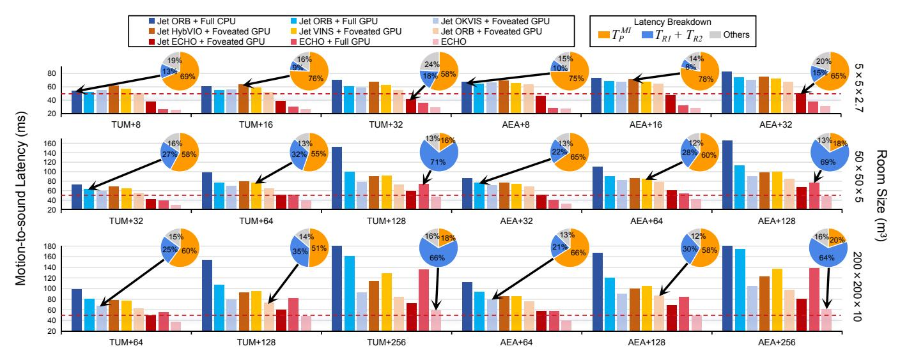
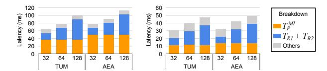
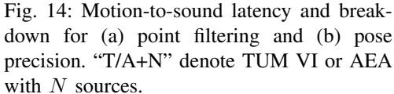
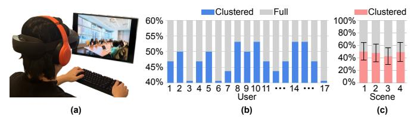

# *C. RNN Generalization Study*

The high-frequency pose estimation RNN is used to predict poses between successive MI updates. Any short-term prediction drift is periodically corrected, and the final pose is dominated by the subsequent SLAM-optimized MI outputs, so the RNN does not act as a standalone tracker. To study generalization across datasets and motion behaviors, we trained the same RNN under three configurations: (i) a *Combined* training set that includes both AEA and TUM VI training sets, (ii) *AEA-only* training, and (iii) *TUM-only* training. Each trained model is then evaluated on the combined AEA and TUM VI test sets, and we report ATE and RRE averaged over all test sets. All results are measured under ECHO's Hybrid mode, keeping the pipeline unchanged and replacing only the pose estimation RNN with the corresponding re-trained variant.

As shown in Table VI, ECHO is largely insensitive to the RNN training dataset. Relative to the default ECHO configuration (ATE/RRE = 0.033/1.014 in Table II), Combined training achieves 0.0332/1.0194, while single-dataset training remains comparable at 0.0338/1.0237 (AEA-only) and 0.0337/1.0206 (TUM-only). Overall, the variation is small across all settings, indicating that the RNN mainly models short-horizon inertial motion that transfers across datasets with different motion patterns and sampling characteristics.

## VI. ECHO ACCELERATOR EVALUATION

This section evaluates the performance of the ECHO accelerator in Section IV. The ECHO accelerator is implemented in Verilog and synthesized using Synopsys Design Compiler [6] with a 45 nm CMOS technology [43] to evaluate area, timing, and power. The design operates at a target frequency of 1 GHz, with on-chip buffers modeled using CACTI [5]. To align with contemporary VR SoC technology, we further scale the results to a 22 nm process using DeepScaleTool [87]. The ECHO accelerator operates in Hybrid mode by interleaving IO mode within MI mode. In MI mode, the accelerator supports SLAMbased pose estimation, while in IO mode it performs IMUbased RNN pose estimation to provide high-frequency poses. It has an area of 0.24 mm2 and a peak power of 0.13 W. The majority of the area is attributed to the Computational Engine (69%), followed by the ORB Extractor (31%).

As described in Section IV-C, the system's motion-to-sound latency is governed by the MI mode, since it incurs the longer end-to-end latency and therefore determines the latest pose that can be applied to audio rendering. The motion-to-sound latency is modeled by decomposing the MI pipeline as:

$$T_{m-s} = T_{IN} + T_S^{MI} + T_P^{MI} + T_{R1} + T_{R2} + T_O$$
 (8)

where each component is evaluated separately according to its execution placement in the pipeline and then summed to obtain the end-to-end latency. Specifically,  $T_{IN}$  is fixed to 5 ms. With a 100 Hz update rate (10 ms period) in Hybrid mode, the sampling delay lies in [0,10] ms, and we use the expected delay 5 ms as a representative  $T_{IN}$  in our model.  $T_S^{MI}$  includes the camera and IMU sensing latencies, as well as the corresponding sensor-to-SoC data transfer latency. Specifically, the camera and IMU sensing latencies are set according to the AEA dataset documentation [79] to reflect the timing characteristics of typical AR and VR devices, while the camera-to-SoC communication latency follows the MIPI CSI interface model in [56]. For  $T_O$ , we model the output stage latency as the sum of the audio device output latency and a buffering-induced delay. The buffering delay arises because

TABLE VII: Detailed description of the algorithms and the hardware platforms used for each evaluation setting.

| Method                    | Pose E         | stimation        | Audio Rendering |            |  |
|---------------------------|----------------|------------------|-----------------|------------|--|
| Method                    | Algorithm      | Device           | Algorithm       | Device     |  |
| Jet ORB + Full CPU        | ORB-SLAM3      | Jetson CPU       | Full            | Jetson CPU |  |
| Jet ORB + Full GPU        | ORB-SLAM3      | Jetson CPU       | Full            | Jetson GPU |  |
| Jet OKVIS + Foveated GPU  | OKVIS          | Jetson CPU       | Foveated        | Jetson GPU |  |
| Jet HybVIO + Foveated GPU | HybVIO         | Jetson CPU       | Foveated        | Jetson GPU |  |
| Jet VINS + Foveated GPU   | VINS-Fusion    | Jetson CPU       | Foveated        | Jetson GPU |  |
| Jet ORB + Foveated GPU    | ORB-SLAM3      | Jetson CPU       | Foveated        | Jetson GPU |  |
| Jet ECHO + Foveated GPU   | ECHO Algorithm | Jetson CPU       | Foveated        | Jetson GPU |  |
| ECHO + Full GPU           | ECHO Algorithm | ECHO Accelerator | Full            | Jetson GPU |  |
| ECHO                      | ECHO Algorithm | ECHO Accelerator | Foveated        | Jetson GPU |  |

audio rendering and playback are asynchronous: a rendered block may wait in the playback buffer for up to one buffer period before it is consumed [3], [69], [98]. Accordingly, we include a 5 ms buffer delay, determined by the audio block length [3], [69], in addition to a 1 ms audio output latency [98].

Audio rendering performance is evaluated using two ISMbased [1] implementations: Pyroomacoustics (CPU) [89] and gpuRIR (GPU) [20]. Latency  $(T_{R1} + T_{R2})$  is measured under varying room sizes, numbers of audio sources, and source distributions. Specifically, we consider three room sizes:  $5 \times 5 \times$  $2.7, 50 \times 50 \times 5$ , and  $200 \times 200 \times 10$  meters, representing typical scenarios of a living room, conference room, and exhibition hall, respectively [23], [25], [33]. Reverberation times are set such that sound energy decays by 30 dB in 0.4, 1.5, and 1.7 seconds, with ISM reflection order adjusted accordingly, following prior work [33]. Wall absorption coefficients are kept at default values in Pyroomacoustics and gpuRIR. The number of audio sources varies from 8 to 256: 8/16/32 in the  $5 \times 5 \times 2.7$  room, 32/64/128 in the  $50 \times 50 \times 5$  room, and 64/128/256 in the  $200 \times 200 \times 10$  room. Source positions are sampled either from a uniform random distribution or a Poisson Cluster process [16], consistent with prior studies [11], [30], [35], [59], [100], [114].

Pose estimation is evaluated on AEA [61] and TUM VI [92] as described in Section V. For acoustic foveation, we implement MAA as a piecewise azimuth function fitted to the perceptual curve from [77] and account for pose estimation error as described in Section III-E. We model VR device compute using the CPU and GPU of an Nvidia Jetson Orin NX with sixteen gigabytes of memory, a platform commonly adopted in recent VR performance studies [36], [38], [75], [109], [112], [113]. For audio rendering, Pyroomacoustics executes on the CPU and gpuRIR on the GPU.

We evaluate motion-to-sound latency across nine configurations, as shown in Table VII, that vary the pose algorithm, audio pipeline, and hardware mapping. 'Jet' refers to the Jetson device; 'Full' denotes spatial audio without acoustic foveation, and 'Foveated' applies our foveation scheme. In particular, **Jet ORB + Full CPU** and **Jet ORB + Full GPU** indicate configurations that run ORB-SLAM3 on the Jetson CPU with full audio rendering executed on the Jetson CPU and Jetson GPU, respectively. **Jet OKVIS + Foveated GPU**, **Jet HybVIO + Foveated GPU**, **Jet VINS + Foveated GPU**, and **Jet ORB + Foveated GPU** keep pose estimation execution on the Jetson CPU and foveated audio rendering implementation on the Jetson GPU while varying

Fig. 12: Latency evaluation across different methods. The notation "Dataset+N" (e.g., "AEA+32") indicates evaluation on the specified dataset with N audio sources. Pie charts present the latency breakdown of the corresponding columns.

the pose estimation algorithm, which enables fair algorithm-level comparisons. **Jet ECHO + Foveated GPU** replaces the pose estimation algorithm with the ECHO algorithm, isolating ECHO's algorithmic gains. Finally, **ECHO + Full GPU** and **ECHO** migrate the compute-intensive kernels, especially the FAST corner detection of ORB Extraction stage and the coordinate transformation and Jacobian computation of Local Map Tracking stage in pose estimation pipeline, from the Jetson CPU to the ECHO accelerator, with the Jetson GPU performing full and foveated audio rendering, respectively. These two settings highlight the additional speed and energy benefits provided by the ECHO accelerator.  $T_P^{MI}$ ,  $T_{R1}$ , and  $T_{R2}$  correspond to the measured latency contributions of their respective operations under their actual execution placement.

## A. Evaluation Results on Motion-to-Sound Latency

ECHO integrates both algorithmic and hardware optimizations, and the baselines allow us to disentangle their contributions to motion-to-sound latency. Figure 12 reports motionto-sound latency evaluation under the ECHO Hybrid mode on AEA and TUM VI with different room sizes, with average latencies reported for audio sources distributed under both uniform and Poisson patterns. Results show that Jet ORB + Full CPU consistently exceeds the 50 ms limit, driven by the high computational cost of full audio rendering and the significant latency introduced by pose estimation. This underscores the necessity of both algorithmic and hardware optimizations to achieve real-time SS. In contrast, acoustic foveation significantly alleviates the rendering bottleneck. Specifically, Jet ORB + Foveated GPU achieves an average 1.29× latency reduction compared to Jet ORB + Full GPU. The benefit grows with the number of audio sources, showing that ECHO scales effectively to complex VR scenes.

Among the pose estimation algorithms, ORB-SLAM3 provides the lowest latency, outperforming VINS-Fusion, Hyb-VIO, and OKVIS. With the algorithmic improvements intro-

Fig. 13: Left: Jet ORB + Full GPU baseline. Right: ECHO.

duced in Section III, ECHO further reduces latency by an average of 1.28× compared to ORB-SLAM3, as seen in Jet ORB + Foveated GPU versus Jet ECHO + Foveated GPU. This enables Jet ECHO + Foveated GPU to meet the sub-50 ms requirement in simple VR scenes. Although ECHO's algorithmic improvements and acoustic foveation greatly reduce latency, scenes with more than 128 audio sources still exceed the 50 to 60 ms limit, indicating that software optimizations alone are insufficient for heavy workloads. To address this limitation, we introduce the ECHO accelerator described in Section IV, which provides an additional 1.41× speedup over Jet ECHO + Foveated GPU. This reduces the average latency to 39.2 ms, comfortably meeting the 50 ms real-time requirement for SS, and lowers the maximum latency with 256 audio sources to below 60 ms. Relative to the unoptimized baseline (Jet ORB+Full GPU), the largest gains occur at 256 audio sources, with speedups of  $2.79\times$  on TUM VI and  $2.91\times$  on AEA. These results indicate that acoustic foveation scales effectively with source count and show ECHO's strong overall scalability.

Figure 13 illustrates motion-to-sound latency as the number of sources increases from 32 to 128 in the middle-room setting, along with the latency breakdown. We compare two configurations: Jet ORB + Full GPU (left) and ECHO (right). For both methods,  $T_P^{MI}$  and the remaining overheads ("Others") stay nearly constant with source count, while AEA shows a slightly higher  $T_P$  than TUM VI due to its larger image resolution (640×480 vs. 512×512) and more complex scenes. ECHO reduces  $T_P^{MI}$  by  $3.4\times$  on average across the two datasets. Meanwhile, the baseline's audio rendering latency increases nearly linearly with the number of sources, pushing the total

Fig. 15: (a) Energy comparison and breakdown (OE: ORB extractor, CE: computational engine). (b) Impact of audio source distribution on latencies (ms).

Fig. 16: Motion-to-sound latency and its breakdown in the low-source scenario.

latency far beyond the perceptual budget. In contrast, ECHO's robust acoustic foveation reduces the effective number of sources and flattens the rendering growth trend, keeping the latency within perceptual requirements.

## B. Ablation Studies on Hardware Performance

In this section, we analyze the impact of different ECHO settings on the hardware performance.

- 1) Impact of Point Filtering: In Jet ECHO + Foveated GPU, the ECHO algorithm integrates point filtering as described in Section III-C. To assess its impact, we compare Jet ECHO + Foveated GPU with Jet ORB + Foveated GPU across multiple datasets. As shown in Figure 14 (a), point filtering accelerates local map tracking and reduces overall motion-to-sound latency by an average of 1.26×. This gain is achieved by discarding roughly 75% of points before optimization, averaged across AEA and TUM VI, thereby substantially lowering the computational cost.
- 2) Impact of Pose Estimation Precision: The low-precision module is integrated into the computational engine (Sections III-B and IV-B), while the ECHO accelerator further improves efficiency by coupling the ORB extractor with a customized processing pipeline. To isolate their contributions, we evaluate three baselines: (1) Jet ECHO, which runs the ECHO algorithm in full-precision FP32 on Jetson; (2) ACC, which executes the ECHO algorithm on the full-precision accelerator, constructed by replacing ECHO's mixed-precision PEs and quantization units with FP32 PEs while leaving all other components unchanged, thereby capturing the benefits of accelerator customization; and (3) ECHO, which employs the accelerator with low-precision computation. As shown in Figure 14 (b), the FP32 accelerator achieves an average 1.24× speedup over the Jetson CPU. With low-precision optimization, ECHO provides an additional 1.10× improvement, reducing the average motion-to-sound latency to 39.2 ms.
- 3) Energy Evaluation of ECHO Accelerator: To assess energy efficiency, we measure the average per–frame energy consumption of pose estimation on the ECHO accelerator using the AEA dataset. As shown in Figure 15 (a), the ACC design without point filtering (No F) uses  $2.39 \times$  the energy of ECHO, and the full–precision ACC with filtering uses  $1.27 \times$ . The low–precision design lowers both power and latency, and point filtering further reduces latency, together providing substantial energy savings.

- 4) Impact of Audio Source Distribution: Acoustic foveation reduces rendering cost by clustering audio sources, with the clustering pattern determined by the spatial distribution of sources. To evaluate this effect, we consider two layouts: Poisson Cluster Process (PD) and uniform random distribution (UD), keeping all other settings consistent with Section VI. Figure 12 reports averages over PD and UD layouts. Latency remains under the 50 ms budget up to 128 sources, but rises to 60 ms at 256. Figure 15 (b) disaggregates the two layouts across 64, 128, and 256 sources, revealing a consistent advantage for PD: it generates substantially fewer clusters than UD (26 vs. 44, 42 vs. 76, and 70 vs. 129 on average). This tighter spatial grouping enables more aggressive foveation, allowing PD to maintain latency within 50 ms even at 256 sources, whereas UD climbs to nearly 70 ms.
- 5) Impact of Audio Source Amount: To evaluate the impact of the number of audio sources on ECHO performance, we consider a scenario with 2–8 sources in the smallest room, representing applications with only a few active audio sources. We compare the Jet ORB + Foveated GPU baseline and ECHO on the AEA dataset. As shown in Figure 16, when the number of sources is small, the audio rendering stage is no longer the dominant contributor to motion-to-sound latency. However, the Jet ORB + Foveated GPU baseline still incurs substantial latency from the pose estimation stage which by itself exceeds 50 ms. In contrast, ECHO significantly reduces the pose estimation cost through its co-optimized algorithm and accelerator, resulting in consistently lower end-to-end motion-to-sound latency even on the less-source scenario.
- 6) Comparison with Other SLAM Accelerators: eS-LAM [57], HcveACC [55], and FSLAM [102] are representative ORB-SLAM accelerators. Concretely, these baselines primarily accelerate the ORB Extraction stage via hardware design. In contrast, ECHO targets the two dominant bottlenecks in the ORB-SLAM3 front-end, namely ORB Extraction and Local Map Tracking. Therefore, ECHO is orthogonal to the aforementioned methods. On the TUM VI dataset, ECHO reduces per-frame tracking latency to 11.0 ms. We further implement eSLAM, HcveACC, and FSLAM and evaluate their per-frame tracking latency on TUM VI. The results show eSLAM, HcveACC, and FSLAM achieve 23.3 ms, 20.0 ms, and 20.1 ms, respectively. Although these baselines substantially speed up the ORB Extraction stage, ECHO achieves additional gains by also reducing the Local Map Tracking cost.

Fig. 17: (a) Participants comparing audio clips (visual content cast to the monitor). (b) Per-participant preference rates for clustered vs. full rendering across all scenes. (c) Per-scene preference rates. Error bars represent the standard deviation.

## C. User Study

To assess the practical spatial audio quality rendered by ECHO with robust acoustic foveation, we conduct a perceptual study comparing full spatial rendering with our clustered spatial rendering integrated in the ECHO pipeline, as described in Section III-E and Section IV-C.

Four representative acoustic environments are created to span different spatial scales and source densities: (1)  $5 \times 5 \times 2.7$  m with 16 sources, (2)  $50 \times 50 \times 5$  m with 32 sources, (3)  $200 \times 200 \times 10$  m with 64 sources, and (4)  $200 \times 200 \times 10$  m with 128 sources. Both the source distribution and acoustic foveation procedures follow the configurations described in Section VI, including the Poisson Cluster Process and the error-aware acoustic foveation based on ECHO's average pose estimation error. Visually, the first two scenes correspond to compact indoor rooms, while the latter two depict large-scale, high-density environments resembling exhibition halls.

Each source was assigned a unique speech signal synthesized using the edge-tts library [82]. Text was sampled from the LibriSpeech corpus [76], and speaker voices were varied to ensure diversity in linguistic content and vocal timbre. Utterances averaged 6–8 s. Signals were spatialized by convolution with binaural room impulse responses in Pyroomacoustics [89], producing clips of about 10 s. For each scene, we generated two audio versions: full rendering with all sources and clustered rendering with acoustic foveation. The reference clip in each trial was always the full rendering.

Seventeen participants with normal hearing were recruited. As shown in Figure 17 (a), they remain seated in a quiet room, viewing the visual scene through a Meta Quest Pro HMD [67] and listening via wired over-ear headphones. Head orientation is fixed during playback to isolate the perceptual impact of clustering. In each trial, participants are presented with three clips of the same scene: a clean reference (full rendering) and two test clips. One test clip is full rendering and the other clustered, with assignment randomized. Participants hear the reference and both test clips at least once, may replay them as needed, and then select which test clip has better spatial quality using a two-interval forced-choice procedure [110].

Each participant completed 4 (scenes)  $\times$  2 (assignment orders)  $\times$  4 (repeats) = 32 trials, with randomized order. Figure 17 (b) reports the participant-level preference rates aggregated across all scenes. We further summarize these rates as mean  $\pm$  1 standard deviation across participants. Across  $17 \times 32 = 544$  total trials, clustered rendering with acoustic

foveation was preferred in  $47\% \pm 4\%$  of cases. Scene-level preferences were  $50\% \pm 13\%$  (scene 1),  $48\% \pm 13\%$  (scene 2),  $43\% \pm 12\%$  (scene 3), and  $49\% \pm 15\%$  (scene 4), as shown in Figure 17 (c). A two-sided binomial test on the aggregated count, with clustered rendering selected in 258 out of 544 trials, showed no significant deviation from the 50% chance level ( $p \approx 0.25$ , well above the 0.05 threshold), indicating that clustered rendering is perceptually indistinguishable from full spatial rendering. These results demonstrate that ECHO's acoustic foveation preserves spatial audio fidelity while substantially reducing computational cost.

Nine of the seventeen recruited participants additionally completed a follow-up study to evaluate the perceptual impact of head orientation changes. Using the same scenes, audio sources, and listener positions as above, we re-rendered a new pair of clips by rotating the listener's head orientation by 90° to the right in yaw, generating a new full-rendering reference clip and a corresponding full/clustered rendering test pair under the rotated pose, where clustering is recomputed via acoustic foveation conditioned on the rotated orientation. In each trial, participants first listened to the original reference audio, were then guided to rotate their head by 90° to the right, and finally compared the newly rendered reference with the new test pair. All other procedures and the number of trials remained unchanged.

Figure 18 reports the participant-level preference rates across all scenes. Across 288 trials under 90° head rotation, clustered rendering was preferred by  $49\% \pm 3\%$ . Scenelevel preferences were  $47\% \pm 14\%$  (scene 1),  $50\% \pm 16\%$  (scene 2),  $48\% \pm 12\%$  (scene 3), and  $51\% \pm 15\%$  (scene 4). A two-sided binomial test, with clustered rendering selected

Fig. 18: Preference rates.

in 142 out of 288 trials, showed no significant deviation from the 50% chance level ( $p \approx 0.82$ ), indicating clustered rendering remains perceptually indistinguishable from full rendering even under substantial head orientation changes. These results further confirm the robustness of ECHO's acoustic foveation.

## D. Comparison with Other Pose Estimation Methods

While integrated with ORB-SLAM3, our optimizations are largely transferable to other SLAM/VIO front-ends. Many pipelines share similar front-end structures and operations, such as feature detection and reprojection-based pose estimation. For example, VINS-Fusion [80], OKVIS [54], and others adopt similar corner- and reprojection-based pipelines. Our design targets these recurring compute-intensive kernels and dataflow patterns rather than ORB-specific semantics.

## VII. CONCLUSION

In this work, we introduce ECHO, a hardware–algorithm cooptimization framework for real-time SS in VR. Experimental results show that ECHO significantly reduces motion-to-sound latency while preserving spatial audio fidelity, thereby enhancing the user's auditory experience. These results show ECHO's potential as a practical foundation for future SS solution in VR.

