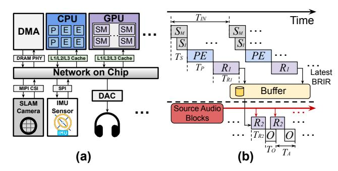

# *D. Sound Spatialization in VR System*

A typical VR HMD [\[22\]](#page-13-23), [\[67\]](#page-14-14) features a compact stacked architecture that integrates multiple sensors and compute components, including a CPU, GPU, and memory subsystem, as illustrated in Figure [6](#page-3-1) (a). The device incorporates an IMU for motion sensing, a SLAM camera for capturing high-resolution environmental images, and additional sensors such as eyetracking cameras and microphones. To track user movement, the SLAM camera and IMU capture visual and inertial data, which are stored in DRAM and processed by the CPU to run a real-time pose estimation algorithm (e.g., ORB-SLAM3). The resulting pose estimates are then used by the CPU or GPU to render graphics or spatial audio, enabling an immersive experience in the virtual environment.

In real-time systems, source audio is generated and segmented into fixed-length blocks, typically 5–20 ms [\[101\]](#page-15-18). Each block is rendered using the latest head pose and processed through the pipeline in Figure [6](#page-3-1) (b). Here, SM and SI denote monocular SLAM image capture and IMU sensing, respectively, while PE represents pose estimation. Let TIN be the interval between consecutive sensor captures. Stage R1 performs sound propagation and BRIR generation and writes the results to a buffer, while stage R2 reads the buffered BRIRs and executes auralization. During operation, inputs from SM and SI are processed by P E to estimate the current pose, which is then consumed by R1. In parallel, audio blocks arriving every TA are processed by R2, which uses the most recently generated BRIRs for auralization. These stages are pipelined to improve steady-state throughput, but pipelining does not shorten the end-to-end motion-to-sound critical path. The motion-to-sound latency Tm-s is defined as the time between a user's movement and the moment the headphones output sound reflecting that movement. It is given by:

$$T_{m-s} = T_{IN} + T_S + T_P + T_{R1} + T_{R2} + T_O$$
 (1)

where TS, TP , TR1, TR2, and TO denote sensing, pose estimation, sound propagation and BRIR generation, auralization,

Fig. 4: The steps of the audio rendering process.

Fig. 5: Overview of ORB-SLAM3.

TABLE I: Latency breakdown of ORB-SLAM3 tracking.

23.92

0.45

1.81

24.09

0.23

50.49

Fig. 6: (a) The architecture of VR HMD. (b) Asynchronous BRIR generation and auralization.

and audio output latency. In practice,  $T_S$  and  $T_O$  are small (a few milliseconds) [22], [98].  $T_{R1}$  is typically much larger than  $T_{R2}$  because it must perform sound propagation and generate BRIRs for all active sources, while  $T_{R2}$  mainly performs convolution with the computed BRIRs. As shown in Figure 2 (a),  $T_P$ ,  $T_{R1}$ , and  $T_{R2}$  dominate total latency, while  $T_{IN}$  adds overhead based on pose estimation frequency. We next describe how ECHO accelerates each component.

## III. ECHO ALGORITHMS

As shown in Table I, ORB extraction and LM tracking dominate pose estimation latency. We next introduce techniques to accelerate these stages (Sections III-B–III-D), followed by audio rendering acceleration in Section III-E.

## A. Preliminary

We first review the key details of ORB-SLAM3 shown in Figure 5. The high latency of ORB [85] extraction stems from multi-scale feature detection and orientation assignment. For each input frame, an 8-level image pyramid is built by iteratively downsampling the original image, enabling scale-invariant feature detection. At each level, the image is partitioned into non-overlapping  $35 \times 35$  pixel cells, and the FAST [84] corner detector scans every pixel, comparing its intensity I(p) against those of 16 surrounding pixels. A pixel is classified as a corner if  $n \ge 12$  consecutive neighbors are all significantly brighter or darker than I(p). Each detected corner, as a 2D keypoint, is then assigned a dominant orientation based on the intensity moments of its local patch to ensure rotation invariance. Exhaustive per-pixel operations across the pyramid make this step highly time-consuming.

Another major computational bottleneck is LM tracking, which refines the head pose by matching current-frame features to 3D map points. As shown in Figure 5, an estimated pose is first initialized using IMU preintegration and pose

estimation, then a set of nearby keyframes are selected, and 2D–3D correspondences are established by matching BRIEF descriptors [85] between current-frame 2D keypoints and 3D map points, followed by RANSAC [26] to reject outliers. The user's head pose is parameterized by rotation  $\mathbf{R} \in \mathbb{R}^{3\times 3}$  and translation  $\mathbf{t} \in \mathbb{R}^3$  in six degrees of freedom. The refined pose is obtained by minimizing the *reprojection error* [74]:

$$\min_{\mathbf{R}, \mathbf{t}} \sum_{i} \|\mathbf{r}_{i}\|^{2} = \min_{\mathbf{R}, \mathbf{t}} \sum_{i} \|\mathbf{u}_{i} - \pi(\mathbf{R}\mathbf{x}_{i} + \mathbf{t})\|^{2}$$
 (2)

where  $\mathbf{x}_i$  is the *i*-th 3D map point in the world frame,  $\mathbf{u}_i \in \mathbb{R}^2$  is its corresponding 2D keypoint, and  $\pi(\cdot)$  is the camera projection function. The term  $\mathbf{R}\mathbf{x}_i + \mathbf{t} = \mathbf{x}_i^c$  represents the transformation from the world frame to the camera frame.

In VR devices, SLAM cameras often employ fisheye lenses with strong radial distortion, necessitating a non-linear projection model  $\pi(\cdot)$ . ORB-SLAM3 adopts the Kannala-Brandt (KB) model [44] to project 3D points into fisheye image coordinates and obtain the corresponding Jacobians. Given a 3D point  $\mathbf{x}^c = [x, y, z]^{\mathsf{T}}$  in the camera frame, define:  $\rho = \sqrt{x^2 + y^2}, \quad \theta = \arctan(\rho/z), \quad \varphi = \arctan 2(y, x).$  The radial distortion function is:  $d(\theta) = \theta + k_1 \theta^3 + k_2 \theta^5 + k_3 \theta^7 + k_4 \theta^9$ , and the projection is:

$$\pi(\mathbf{x}^c) = \begin{bmatrix} f_x \cdot d(\theta) \cos \varphi + c_x \\ f_y \cdot d(\theta) \sin \varphi + c_y \end{bmatrix}$$
(3)

where  $k_1, \ldots, k_4$  are the radial distortion coefficients,  $f_x, f_y$  are focal lengths, and  $c_x, c_y$  are the principal point coordinates of the fisheye camera. This model involves trigonometric and high-order polynomial terms, leading to high computation cost. Moreover, to refine the initialized pose, ORB-SLAM3 minimizes the reprojection error via iterative Gauss-Newton optimization [104], where the pose is gradually optimized in the Lie algebra over 40 iterations. Each iteration applies the on-manifold pose update formulation [10] and evaluates the fisheye projection and its Jacobians [44] to compute reprojection errors and pose gradients for the next update.

## B. Low-precision Pose Estimation Module

In this section, we propose a low-precision pose estimation module to reduce the LM Tracking latency shown as  $T_P$  in Equation (1). In each optimization iteration, every 3D map point is projected multiple times for residual and Jacobian evaluation, making the projection step a primary computational bottleneck. This step,  $\mathbf{x}_i^c = \mathbf{R}\mathbf{x}_i + \mathbf{t}$ , is a large-batch matrix-vector multiplication executed in FP64 on CPU and contributes substantially to the overall latency. To alleviate this cost, we employ low-precision approximations that reduce

arithmetic complexity while maintaining sufficient numerical accuracy for pose optimization. Specifically, given that the rotation matrix  $\mathbf{R}$  is orthonormal with entries constrained to the range [-1,1], and the world-coordinate map point  $\mathbf{x}_i$  typically has limited dynamic range, we propose a *low-precision pose estimation module* that replaces high-precision arithmetic with hybrid-precision alternatives in the coordinate transformation and Jacobian computation steps.

Specifically, for the rotation matrix R, each element is multiplied by a scale of 8 and then rounded to the nearest integer, producing a 4-bit signed-integer representation. Although many systems use a scale of 7, choosing 8 makes on-the-fly quantization more hardware friendly because the scaling step can be carried out through a simple adjustment of the floating point exponent rather than a full multiplication. For the 3D point  $x_i$ , we apply the FP8 E4M3 format, which supports values from -448 to +448. This range, with a total span of 896 meters, is more than sufficient for typical indoor VR scenes. Quantization operators  $Q_{\text{INT4}}(\cdot)$  and  $Q_{\text{FP8}}(\cdot)$ are defined as:  $Q_{\text{INT4}}(r) = \text{clamp}[\text{round}(8 \cdot r), -8, 7]$  and  $Q_{\rm FP8}(x) = {\rm FP8}_{\rm E4M3}(x)$ , where clamp[·] ensures the result lies in the representable range, and  $FP8_{E4M3}(\cdot)$  casts a floating-point value to the E4M3 format. The coordinate transformation in low precision is then expressed as:

$$\mathbf{x}_{i}^{c} = Q_{\text{INT4}}(\mathbf{R}) \cdot Q_{\text{FP8}}(\mathbf{x}_{i})/8 + \mathbf{t}.$$
 (4)

Finally, given the high nonlinearity and sensitivity of the fisheye projection function [44] and its derivative, both are computed entirely in FP32 to avoid accuracy degradation.

## C. Quantization-aware Point Filtering

In addition to adopting low-precision arithmetic for pose estimation, we further reduce the LM Tracking latency within  $T_P$  by filtering out low-quality correspondences before optimization. Our *quantization-aware point filtering* strategy targets points that may introduce instability under quantized operations. Specifically, we evaluate the FP8 quantization error of each 3D map point  $\mathbf{x}_i$ , defined as:

$$E_1 = \|\mathbf{x}_i - Q_{\text{FP8}}(\mathbf{x}_i)\| \tag{5}$$

Map points with  $E_1 > \alpha$  are excluded from subsequent operations. To improve stability, we further perform a one-time error check before the iterative optimization. Specifically, the *stability check* is performed by computing:

$$E_2^q = \left\| \mathbf{u}_i - \pi \left( Q_{\text{INT4}}(\mathbf{R}) \cdot Q_{\text{FP8}}(\mathbf{x}_i) / 8 + \mathbf{t} \right) \right\|^2$$
 (6)

according to Equation (2). If  $E_2^q > \beta$ , the correspondence is deemed unstable and is discarded from further operations for computational savings. Because this check runs only once and does not involve Jacobian and Hessian computations, it adds minimal overhead while improving robustness.

Empirically, we find that, especially when the back-end modules (e.g., local mapping, loop closure) have already refined the global map and poses, most 2D–3D correspondences that pass the first filter in  $E_1$  exhibit small errors in  $E_2^q$ . In such cases, the current pose is already near-optimal, yet

Fig. 7: (a) The SLAM system outputs 10 Hz poses (red), while the RNN interpolates 100 Hz intermediate poses in real time from SLAM and IMU data (blue). (b) Architecture of RNN-based pose estimation module.

a large number of point correspondences may still enter the optimization process. To avoid unnecessary computation, we introduce a *selective sampling* strategy: if the proportion of correspondences rejected by the  $E_2^q$  criterion is less than a threshold  $r_1$ , we infer that the pose is accurate and randomly discard a proportion  $r_2$  of the remaining pairs. The retained subset is then used for Gauss–Newton optimization. By combining quantization-aware point filtering, stability check, and selective sampling, ECHO greatly reduces the number of map points used in optimization, lowering computational cost and latency  $T_P$  while preserving geometric accuracy.

#### D. IMU-based High-Frequency Pose Estimation

As shown in Figure 6 (b), the relatively low SLAM camera rate, typically around 10 to 30 Hz, produces a large intercapture interval  $T_{IN}$ , which delays motion detection and ultimately increases the latency as expressed in Equation (1). In contrast, IMU sensors in VR devices can operate at frequencies up to 1000 Hz, enabling smoother and more frequent motion detection, which triggers SS more promptly. However, IMU data is less informative than visual input, and relying solely on it for pose estimation causes drift over time.

To address this, we introduce a lightweight recurrent neural network (RNN) that estimates high-rate poses between SLAM-based pose updates. As shown in Figure 7 (a), the RNN takes the current IMU data along with the latest optimized pose, velocity, and sensor bias estimates from SLAM to generate high-frequency head pose outputs at 100 Hz, represented as a 7D vector containing 3D translation and a 4D quaternion [94]. To further lower inference overhead, we apply mixed-precision quantization, using per-channel INT4 for the weights and FP8 for the input activations, and train the model with quantization-aware training to maintain accuracy. This high-frequency pose estimation shortens the inter-capture interval, mitigating the additional latency caused by infrequent sensor captures, i.e.,  $T_{IN}$ , while quantization reduces the pose estimation time, ensuring low latency and stable SS.

## E. Robust Acoustic Foveation under Tracking Error

As shown in Figure 2 (a), the audio rendering time increases substantially with the number of audio sources. To further reduce audio rendering latency,  $T_{R1}$  and  $T_{R2}$ , we decrease the number of active sources before the audio rendering stage by exploiting properties of human auditory perception

Fig. 8: (a) The room is divided into horizontal layers (red dashed lines). In the top-down view, the listener's orientation (Ori.) defines each source's azimuth θ, and the corresponding MAA sets the angular threshold for clustering. (b) Angular deviation ∆θr caused by rotation error. (c) Angular deviation ∆θt caused by translation error at distance r. (d) Stricter clustering threshold based on θeff.

to group acoustically similar ones. This approach, referred to as *acoustic foveation* [\[77\]](#page-14-15), leverages the fact that listeners cannot distinguish between sources lying within a small angular range, known as the *Minimum Audible Angle* (MAA). Psychophysical studies [\[77\]](#page-14-15) show that the MAA increases monotonically with azimuth θ (Figure [8](#page-5-0) (b)): it can be as low as 3 ◦ in the frontal direction (θ ≈ 0 ◦ ), but rises to nearly 40◦ at lateral positions (θ ≈ 90◦ ). This trend reflects the decreasing spatial resolution of human auditory perception away from the frontal axis. Similarly, in the radial dimension, human auditory perception does not estimate source distance as a precise value, but rather as a range of possible distances. The width of this perceptual range increases approximately in proportion to the actual distance, so that two sources falling within the same range are perceived as being at the same distance. Prior studies [\[2\]](#page-13-28), [\[111\]](#page-15-22) indicate that the standard deviation of distance judgments exceeds 20% of the source distance, implying that sources separated by less than this threshold are generally indistinguishable in perceived depth.

Based on these perceptual constraints, and using the listener's pose from the pose estimation stage, we cluster audio sources to reduce rendering load. Following prior work, we adopt a generic far-field HRTF [\[12\]](#page-13-16), [\[32\]](#page-13-18), assuming source distances ≥ 1 m, and the clustering scheme remains independent of this HRTF choice. As shown in Figure [8](#page-5-0) (a), the 3D room is segmented along the height dimension into multiple chunks, converting the task into several 2D subproblems. Within each layer, source azimuths relative to head orientation are compared, and those with angular separation below the MAA threshold are merged into angular groups. Each angular group is then refined in the radial dimension: sources within 20% of the farthest one's distance to the listener are treated as perceptually indistinguishable and clustered [\[2\]](#page-13-28), [\[111\]](#page-15-22).

The audio source clustering scheme described above relies on accurate head pose estimation. However, pose estimation may include errors. To mitigate this impact, we further adapt the clustering scheme of acoustic foveation accordingly. Let the angular and translational pose tracking errors be denoted by ∆θr and ∆t, respectively. These errors create uncertainty in the user's pose, thereby reducing MAA for audio source clustering. By the principle of relative motion, pose tracking errors translate into deviations in the perceived locations of audio sources. As shown in Figure [8](#page-5-0) (b) and (c), each audio source experiences an angular deviation of ∆θr and a spatial displacement within a circular region of radius ∥∆t∥. Since the MAA increases monotonically with azimuth θ, we conservatively estimate a lower bound on the effective azimuth:

$$\theta_{\rm eff} = \theta - \Delta\theta_r - \Delta\theta_t \tag{7}$$

where ∆θt ≈ ∥∆t∥/r approximates the angular deviation caused by a relatively small translation error at source distance r. As illustrated in Figure [8](#page-5-0) (d), when audio sources are combined, the MAA is evaluated at θeff, imposing a stricter clustering criterion that preserves perceptual validity even under pose estimation errors. Once clusters are determined, all sources within each cluster are replaced by a single virtual source positioned at the centroid of the original sources, which is then used for subsequent audio rendering. Our erroraware acoustic foveation preserves spatial fidelity and comfort (Section [VI-C\)](#page-12-0) while reducing active sources, thus shortening TR1 and TR2 without loss of perceptual quality.

