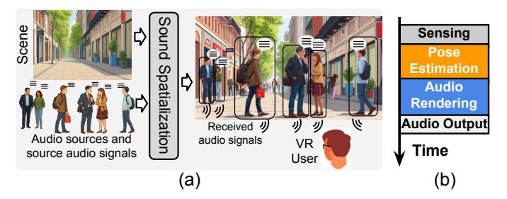

# I. INTRODUCTION

Virtual Reality (VR) is revolutionizing the way we interact with digital content. It enables users to engage with simulated environments in ways that closely mirror real-world interactions, enhancing presence, understanding, and engagement. These technologies are increasingly important across a wide range of sectors, from entertainment and gaming [\[18\]](#page-13-0), [\[19\]](#page-13-1), [\[115\]](#page-15-0) to education [\[27\]](#page-13-2), [\[39\]](#page-13-3), [\[42\]](#page-14-0), [\[63\]](#page-14-1), healthcare [\[48\]](#page-14-2), [\[71\]](#page-14-3), [\[78\]](#page-14-4), [\[83\]](#page-14-5), and beyond [\[50\]](#page-14-6), [\[66\]](#page-14-7). Rendering, whether visual, audio, or multimodal, is arguably one of the most critical applications in VR, as it directly determines the quality of the immersive experience. To provide a seamless and responsive user interaction, these rendering tasks must be completed within strict latency requirements. However, the high computational demands of delivering high-fidelity rendering often surpass the capabilities of current hardware, especially in compact and resource-limited VR HMDs. Among the various forms of rendering, image rendering has been extensively studied in VR systems, with numerous advanced techniques having been developed to improve visual realism [\[24\]](#page-13-4), [\[31\]](#page-13-5), [\[34\]](#page-13-6), [\[45\]](#page-14-8), [\[70\]](#page-14-9), [\[96\]](#page-15-1), [\[97\]](#page-15-2), [\[103\]](#page-15-3), [\[105\]](#page-15-4).

In contrast, sound spatialization (SS) transforms source audio into the binaural signals that would reach the listener's ears at a given position and orientation, explicitly modeling

Fig. 1: (a) Sound Spatialization in VR. (b) Stages of SS.

how sound propagates through the environment. This process links room acoustics and source layout to the listener's motion, and it is critical for immersion and spatial awareness in AR/VR [\[49\]](#page-14-10). Although computationally intensive, SS has not received the same level of architectural attention. An overview is provided in Figure [1](#page-0-0) (a). A collection of audio assets and the source signal are rendered according to the user's position and the spatial configuration of the scene, producing the final perceived binaural audio signal. In contrast to conventional audio rendering, which primarily focuses on decoding, mixing, panning, and simple reverberation effects, SS must account for complex acoustic factors such as scene geometry, surface materials, occlusions, reflections, and reverberation. These elements jointly determine how sound waves reach the listener's ears and significantly increase the computational cost.

The SS is continuously driven by active audio sources in the scene, and incorporates the latest user pose estimates to spatialize the audio, as shown in Figure [1](#page-0-0) (b). In the sensing stage, data is collected from sensors such as inertial measurement units (IMUs) and cameras. The pose estimation stage uses this data to estimate the user's six-degree-of-freedom (6DoF) head pose, both position and orientation, in real time. After that, audio rendering produces binaural audio based on this pose and the spatial arrangement of audio sources. Finally, the binaural audio signal is converted into analog signals via a Digital-to-Analog Converter (DAC) and delivered to the headphones. The end-to-end latency, also known as the *motion-to-sound latency* [\[68\]](#page-14-11), must remain below 50-60 ms to preserve immersion [\[13\]](#page-13-7), [\[108\]](#page-15-5).

To analyze the computational cost of these stages, we profile their latency on the Nvidia Jetson Orin NX 16GB's edge

Fig. 2: (a) Total latency with different numbers of audio sources. (b) Depending on the head pose, nearby audio sources can be grouped together as a single source.

CPU [17], which has been frequently used in prior work to model rendering performance in VR devices [36], [38], [75], [86], [109], [112], [113]. For pose estimation, we adopt ORB-SLAM3 [14], a Simultaneous Localization and Mapping (SLAM) framework recognized for robustness and accuracy, which we use as a representative of commercial VR [67] tracking pipelines. We assume an indoor environment with room dimensions of 50 m in length and width, and 5 m in height, resembling a typical conference room. Audio rendering is performed using the Pyroomacoustics library [89] with the image source method (ISM) [1], simulating varying numbers of randomly placed audio sources in the room, consistent with the setup used in prior work [77]. As shown in Figure 2 (a), pose estimation and audio rendering dominate the end-to-end delay. The ORB-SLAM3 tracking module alone introduces roughly 51 ms of latency, and when combined with the audio-rendering workload, the total SS latency far exceeds the threshold to preserve immersion. Although the algorithmic complexity of multi-source rendering is approximately linear in the number of sources, deviations from linearity can arise from hardware and runtime effects that increase the effective per-source cost as the source count grows, such as cache and bandwidth contention. This underscores the need for acceleration on resource-constrained VR headsets.

In addition to pose estimation latency, audio rendering is also a major contributor to overall delay. Prior work has leveraged this perceptual characteristic to enable acoustic foveation [77], [90], [100]. Human auditory perception is inherently spatial and is strongly influenced by the listener's head position and orientation. As audio sources move farther from the central azimuth, spatial resolution decreases, which reduces sensitivity in peripheral regions. The audio sources in areas of lower perceptual importance, as determined by head pose, can be grouped and rendered as a single source by summing their source audio signals. As illustrated in Figure 2 (b), the six audio sources in Figure 1 (a) are clustered into four groups. This perceptually informed simplification lowers the computational cost of audio rendering by reducing the number of distinct audio sources, while maintaining spatial accuracy in the regions most critical to human perception.

Motivated by this, in this work, we address the high computational cost of real-time SS in VR with an <u>EffiCient Head-Orientation</u>-guided Sound Spatialization (ECHO). As shown in Figure 3, ECHO co-optimizes pose estimation, audio

Fig. 3: An overview of ECHO framework.

rendering, and the underlying hardware platform to achieve efficient SS in VR. Our key contributions are summarized as follows:

- We reduce SS overhead by exploiting natural head dynamics, combining audio sources based on head orientation, and applying algorithm and hardware co-design for better efficiency.
- To increase the prediction frequency of the pose estimation, ECHO incorporates a lightweight neural network to process IMU data at extremely low cost. Additionally, we propose a feature point filtering and quantization method to accelerate the tracking process.
- We also propose a hardware accelerator to shorten the long-latency pose estimation stage. Integrated as a plugin within VR HMD SoCs, the ECHO accelerator reduces overall SS latency by up to 2.91× while preserving highquality auditory experiences.

## II. BACKGROUND AND LITERATURE REVIEW

#### A. Audio Rendering in VR

As shown in Figure 2 (a), audio rendering is a core component of the SS pipeline. The detailed architecture, illustrated in Figure 4, comprises three stages [15], [64], [88], [90], [91]: Sound Propagation, BRIR (Binaural Room Impulse Response) Generation, and Auralization.

Sound Propagation models how sound waves travel through the environment before reaching the listener's ears [65], [81], [88], [90], [91]. It is typically implemented using the Image Source Method (ISM) [1], [33], [52], [53], which mirrors audio sources across scene boundaries to efficiently approximate early reflections in indoor spaces. The system computes room impulse responses (RIRs) by simulating propagation based on listener pose, source location, and scene geometry and materials [15], [64], [91]. This simulation accounts for key acoustic phenomena including reflection, diffraction, and reverberation to derive the transfer paths between source and listener.

In the BRIR Generation stage, room impulse responses (RIRs) are converted into binaural room impulse responses (BRIRs) using listener-specific or generic head-related transfer functions (HRTFs) [9], [64], [89], [91]. This step models sound filtering by the head, torso, and ears, producing distinct left-and right-ear responses. HRTFs are commonly categorized as far-field or near-field [12], [28], [32], [62]. In the Auralization stage, source audio is convolved with BRIRs to generate spatialized signals [4], [7], [99], [106]. For sources at different positions, all three stages must be executed independently,

so rendering cost increases with the number of sources [\[90\]](#page-15-10), [\[91\]](#page-15-13). In acoustic foveation, nearby sources can be mixed and processed once to reduce overall computation [\[77\]](#page-14-15).

