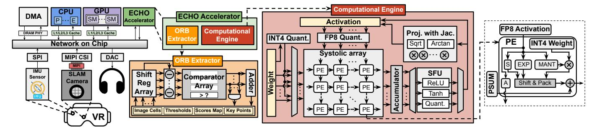

# *A. ORB Extractor Module*

The architectural design of the ORB Extractor is shown in the center-left of Figure [9.](#page-6-0) The module integrates an onchip buffer, a shift-register array and a comparator array to accelerate FAST corner detection in ORB extraction, as shown in Section [III-B.](#page-3-2) For each 35 × 35 8-bit grayscale image cell, all pixels are first loaded into the buffer. The shift-register array maintains a 7 × 7 sliding detection window, enabling single-cycle access to the pixels required for the current test location without redundant buffer reads.

FAST corner detection is realized with a decision-tree [\[95\]](#page-15-23) and implemented by a comparator array. The comparator array first checks the four cardinal pixels (top, bottom, left, right) against the center pixel intensity; only if these differences exceed the corner threshold is the evaluation extended to the remaining pixels in groups of four. This progressive evaluation enables early termination for non-corner pixels. For each pixel classified as a corner, a response score is computed by summing the absolute intensity differences between the center pixel and contiguous circle pixels whose differences exceed the threshold. After detection, the same shift-register and comparator hardware is time-multiplexed for non-maximum suppression (NMS). Response scores are buffered on-chip, and the shift-register array slides a neighborhood window across the score map to identify local maxima. The comparator array outputs only the coordinates of these maxima, suppressing

Fig. 9: Overall architecture of the VR SoC, with the ECHO accelerator integrated as a plug-in module.

Fig. 10: Hybrid update pattern of Monocular–Inertial (MI) mode and Inertial–Only (IO) mode in ECHO.

all others. This resource-sharing design minimizes additional hardware cost and sustains high-throughput corner extraction. The tightly coupled pipeline streams image cells through detection and NMS continuously without stalls, delivering low-latency ORB extraction for SLAM-based pose estimation.

## B. Computational Engine

The computational engine executes the low-precision pose estimation described in Section III-B and performs quantized RNN-based high-frequency pose estimation in Section III-D. As shown in Figure 9, it integrates two on-chip buffers, an INT4–FP8 mixed-precision systolic array with 8×8 processing elements (PEs), a floating-point accumulator, a *Special Function Unit* (SFU) for nonlinear operations in neural networks, and a custom *Projection with Jacobian* (PJ) module.

The systolic array adopts a weight-stationary dataflow for both the matrix multiplications in the RNN and the matrix-vector multiplications in pose optimization. RNN weights are per-channel quantized offline, retained in the on-chip buffer, and loaded into the array at runtime. An INT4 quantization unit before the systolic array handles rotation matrices, which are updated dynamically during optimization and require online quantization. Since rotation matrix elements lie within the range [-1,1], we apply a uniform scaling factor of 8 and implement quantization/dequantization by adjusting the exponent bits by  $\pm 3$  in the floating-point format. A dedicated FP8 E4M3 quantization unit casts 3D coordinates and RNN activations. Both modules achieve low-latency conversion via exponent manipulation or direct casting. The SFU implements ReLU through sign-bit comparison, and approximates Tanh using a piecewise-linear model for efficiency-accuracy balance. The PJ module directly accelerates the fisheye camera projection and its derivative.

Since both computations share the transformed 3D point in the camera frame as input and reuse intermediate values such as  $\rho = \sqrt{x^2 + y^2}$ ,  $\theta = \arctan(\rho/z)$ , and the polynomial distortion terms, we design a unified hardware module that computes both results in a single pass. By reusing datapaths and shared expressions, the module minimizes redundant computations and hardware cost.

To further improve efficiency, we introduce a set of hardware-oriented arithmetic optimizations. First, instead of explicitly computing  $\varphi = \arctan 2(y,x)$  followed by evaluating  $\cos \varphi$  and  $\sin \varphi$  in Equation (3), we reformulate these terms as  $\cos \varphi = x/\rho$  and  $\sin \varphi = y/\rho$ , where  $\rho = \sqrt{x^2 + y^2}$ , eliminating costly trigonometric computations. The square root operation in  $\rho$  is approximated using a reciprocal square root method inspired by fast inverse square root [60]. The distortion function  $d(\theta)$ , a 9th-order odd polynomial, is computed by Horner's method [41] to reduce the number of multiplications. The angle  $\theta = \arctan(\rho/z)$  is approximated using a signaware polynomial method, combining domain normalization with low-order polynomial evaluation. Together, these designs allow a division–free, low–latency implementation without reducing accuracy.

While projection and its derivative share most intermediates, the derivative computation further requires partial derivatives of these quantities with respect to the 3D point. This involves applying the chain rule to obtain terms such as  $\partial\theta/\partial x$ ,  $\partial\theta/\partial y$ , and  $\partial\theta/\partial z$ , as well as the derivatives of the distortion terms. To improve efficiency, the PJ module pipelines the computation of all shared intermediates so that they are generated once and reused by both projection and derivative paths. The derivative path then performs only the incremental operations necessary to assemble the Jacobian, thereby avoiding redundant processing and lowering the overall latency.

