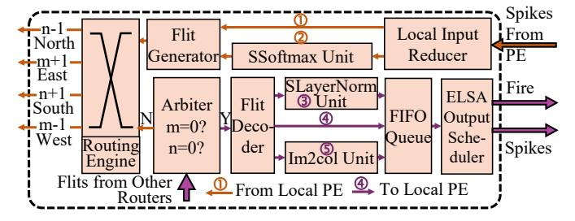
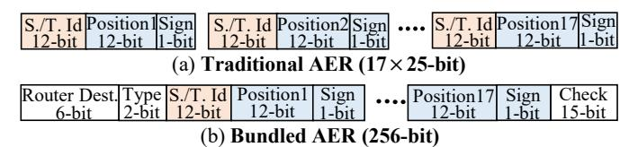
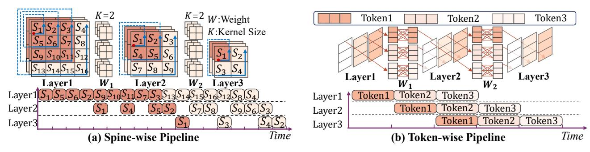

# A. Microarchitecture of Processing Element

Our PE is designed to execute MM-sc as listed in Tab. I via mini-batch spiking Gustavson-product. As shown in Fig. 8(b), each PE contains 128 ST-BIF neuron circuits, a control module, and massive SRAMs (*i.e.*, an *N*-way weight buffer, a membrane buffer, and a spike tracer buffer). The ST-BIF neuron circuit, illustrated in Fig. 9, consists of a 16-input adder tree, a fire component, and an update component. In total, each PE can perform 1024 addition operations per cycle.

- 1) Operations per Spike: For each incoming spike, the PE executes three steps in the ST-BIF neuron (Sec. II-A2), including 1) spike integration, 2) neuron firing, and 3) updating. The dataflows of three steps are marked by (1), (2), (3)in Fig. 8(b), respectively. For spike integration (step-1), the control module receives spikes  $\{x, y_i, q_i\}_{i=0}^N$  from the router and extracts the encoded positions  $x, y_i$  as SRAM addresses. Here,  $q_i$  denotes the spike polarity (i.e.,  $q_i = 1$  for negative and  $q_i = 0$  for positive). x, y denotes the spike position ( $x^{\text{th}}$ row and  $y^{\rm th}$  column) in spike matrix. The control module then sends  $\{y_i,q_i\}_{i=0}^N$  to the N-way weight buffer and x to the membrane buffer, so that the corresponding weights can be accumulated into membrane through the adder tree. For neuron firing (step-2), the firing component reads the spike tracer  $s_t$  at address x together with the integrated membrane  $V_t$ , and evaluates the decision function in Eq. (2). For updating (step-3), the update component updates the membrane state  $v_{t+1}$  and spike tracer rows  $s_{t+1}$  based on the firing result.
- 2) Mini-batch Spiking Gustavson-product in PE: The perspike execution described above is illustrated in Fig. 10(b). A spike at  $(x_i, y_i)$  causes the  $y_i$ -th row of synaptic weights w to be accumulated into the  $x_i$ -th row of the membrane state  $v_t$ . For a negative spike  $(q_i = 1)$ , the corresponding weight

<span id="page-4-0"></span>

Fig. 10: **Process of MM-sc with Mini-batch Gustavson- Product.** (a) The MM-sc in ELSA. (b). Operations per Spike. (c). An example of MM-sc. (d) Tiling Strategy. The process of negative spikes is highlighted in blue.

row is negated (using two's complement) before accumulation. For MM-sc, ELSA processes one BAER packet at a time. As shown in step-1, spikes  $\{\{x,y_i,q_i\}_{i=0}^N\}$  share a common row address x but have different column IDs  $y_i$ . This row alignment allows the N-way weight buffer to process the N spikes in one cycle, which reads N weight rows according to spike addresses  $\{y_i\}_{i=0}^N$  and forwards them to the adder trees.

Fig. 10(c) presents an MM-sc example based on the minibatch Gustavson-product, with negative-spike handling highlighted in blue. The first spike batch (0,1),(0,3) triggers the weight buffer to read the  $2^{nd}$  ([2,2,3,3]) and  $4^{th}$  ([1,3,1,1]) rows. Then, the adder tree accumulates these weight rows to produce the  $1^{st}$  row of membrane potential ([3,5,4,4]). Finally, the fire component receives the integrated results together with the  $1^{st}$  row of spike tracer, performs spike firing, then writes the updated membrane potential and spike tracer back to the membrane and spike tracer buffer, respectively.

- <span id="page-4-5"></span>3) MM-sc Tiling: As illustrated in Fig. 10 (d), we columnwise divide the synaptic weight and membrane (1<sup>st</sup> and 2<sup>nd</sup> column to PE1 and 3<sup>rd</sup> and 4<sup>th</sup> column to PE2) rather than dividing them block-wise in traditional accelerators. With the tiling strategy, spikes are broadcast to all PEs. The synaptic weights and membrane potentials are distributed into PEs without overlapping, thus improving the area utilization.
- 4) Multiple MM-sc in Single Neural Core: ELSA can map multiple SNN layers with multiple MM-sc into one neural core. When a neural core is assigned P MM-sc, it divides the ST-BIF neuron circuits and memories in PE into P groups and allocates them to perform these allocated MM-sc, respectively.

#### <span id="page-4-4"></span>B. Router Design and Bundled AER

The router in ELSA is responsible for flit generation, communication, and decoding for neighboring neural cores. Note that *our router also supports the execution of miscellaneous multiplication operators* summarized in Tab. I. Moreover, we propose a novel *bundled address-event-representation* (BAER) to reduce the communication traffic compared to vanilla AER.

1) Micro-architecture of Router: As depicted in Fig. 11, the router contains multiple modules and five distinct data paths. Each SNN layer is mapped to one router, with a local path

<span id="page-4-1"></span>

Fig. 11: **ELSA Router Design.** ELSA router contains five data paths, two paths ① ② to process spikes from local PEs and three paths ③ ④ ⑤ to receive the flits from neural cores. SSoftmax & SLayerNorm Unit performs the ssoftmax and slayernorm summarized in Tab. I. m, n are the hop counts in flits (Fig. 12),  $x, y_i$  are the positions in spike matrix.

<span id="page-4-2"></span>

Fig. 12: (a) Traditional AER and (b) Bundled AER (aka. BAER). "S./T." denotes Spine/Token; "Dest." is destination. "Type" is the flit position within a spine/token.

chosen from ① or ② for spikes from its PEs and a remote path chosen from ③, ④, or ⑤ for flits from other cores. Such an assignment prevents contention across the five data paths. On the local path, Local Input Reducer gathers spikes until Flit Generator can bundle them into a BAER flit. If there are too few spikes when computation finishes, the flit is zero-padded. On the remote path, Arbiter monitors each flit's hop counts m, n. When both reach zero, Flit Decoder decodes the flit back to spikes and enqueues them in FIFO Queue. These spikes feed the spine/token-wise pipeline under the control of ELSA Output Scheduler. For routing, we adopt a static algorithm described in Sec. VI, where Routing Engine computes the transmission port for each flit and stores the transmission probability of all ports.

- 2) SNN Operators in Router: Router uses SSoftmax and SLayerNorm Units to perform ssoftmax and slayernorm as summarized in Tab. I. We inherit the integer-only softmax and layernorm from [24] to realize ssoftmax and slayernorm. Since the outputs of these units are also spikes, a small number of ST-BIF neuron circuits, along with memory units to store neural states, are integrated to support these operators. To support convolution layers, ELSA router uses im2col Unit to perform image-to-column<sup>2</sup> broadcasting for each spike.
- 3) Bundled AER (BAER): Fig. 12 highlights the differences when flits are encoded in traditional AER and our BAER. While traditional AER uses independent spine/token ID, position, and sign (e.g., 17 spikes and each consumes 25-bit, thus 425 bits total), BAER can reduce the flit to 256-bit. In BAER, the router destination (6-bit) records the hop count (m,n) for

<span id="page-4-3"></span><sup>&</sup>lt;sup>2</sup>The image-to-column operator is a transformation used in CNNs, to rearrange image data for efficient matrix multiplications.

<span id="page-5-1"></span>

Fig. 13: **Details of fine-grained spine/token-wise pipelines.** (a) Spine-wise pipeline in convolution layers. The data dependence of the 1<sup>st</sup> spine  $(S_1)$  in layer-3 is highlighted in dark orange. (b) Token-wise pipeline in a multi-layer perceptron.

**Algorithm 1:** The control algorithm in Output Scheduler for spine-wise pipeline in CNN.

```
1 Input: kernel height H_k, kernel width W_k, convolution stride
    S, convolution padding P, height and width of input
    feature H_I, W_I, position (row, column) of input spine i, j.
 2 Output: list L storing the position of output spines.
i \leftarrow i + P; j \leftarrow j + P; // \text{ considering padding}
4 // If all the data-dependent spines arrive.
5 if i < j and (j - i + 1) > H_k and i, j \equiv 0 \pmod{S} then
        // The processing order is from right to left.
        L \leftarrow L \cup \{(i/S, (j - W_k + 1)/S)\};
 7
8 end
 9 if i > j and i > 0 and i, j \equiv 0 \pmod{S} then
        // The processing order is from bottom to top.
10
        L \leftarrow L \cup \{((i - H_k + 1)/S, (j - W_k + 1)/S)\};
11
12 end
13 // If the last spine arrives, process padding.
14 if i = P and j = P + W_I - 1 then
        for p \leftarrow 0 to P do
15
            L \leftarrow L \cup \{(ii/S, (j+p-W_k+1)/S)\}_{ii=0}^{i+p};
16
            L \leftarrow L \cup \{((i+p)/S, (jj-W_k+1)/S)\}_{jj=0}^{j+p};
17
18
        end
19 end
```

inter-core transmission. The type (2-bit) is the position (*i.e.*, beginning, body, and ending) of the flit within a spine/token. Spine/Token ID (12-bit) is the index for each spine/token. Position (12-bit) is the spike position within a spine/token. Sign (1-bit) is the polarity of the spike. Check (15-bit) records error correcting code for NoC communication. Last but not least, our BAER naturally aligns with the computation and pipelining granularity in ELSA.

#### V. SPINE/TOKEN-WISE PIPELINE SCHEDULE

By using mini-batch spiking Gustavson-product (Sec. III-C) and bundled AER (Sec. IV-B), ELSA explores a spine/tokenwise pipeline scheduling to further enhance elastic inference.

