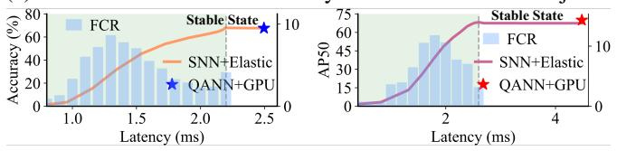
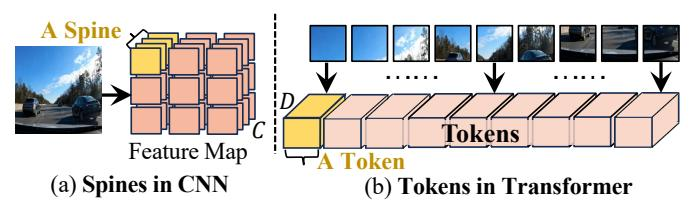

# ELSA: An <u>EL</u>astic <u>SNN</u> Inference <u>Architecture</u> for Efficient Neuromorphic Computing

Kang You\*†, Chen Nie\*†, Lee Jun Yan\*, Ziling Wei\*†, Cheng Zou\*, Zekai Xu\*, Yu Feng‡, Honglan Jiang§, Zhezhi He\*†¶

\*Intelligent Computing Research Group, School of Computer Science, Shanghai Jiao Tong University, Shanghai, CN 

†Shanghai AI Laboratory, Shanghai, CN, ‡School of Computer Science, Shanghai Jiao Tong University, Shanghai, CN

§Institute of Chip Design and EDA, School of Integrated Circuits, Shanghai Jiao Tong University, Shanghai, CN

¶Corresponding author

Abstract—Spiking neural networks (SNNs) exploit event-driven and addition-only computation to substantially improve efficiency for intelligent computation. A key temporal property of SNNs, elastic inference, allows outputs to emerge progressively, enabling responses to salient inputs much earlier than full evaluation. However, existing SNN-specific accelerators cannot capitalize on this property. Layer-by-layer designs emit outputs only after all layers are complete, while time-step-by-time-step designs rely on coarse-grained, layer-wise pipelines that require synchronizing all spines/tokens within a layer. This barrier prevents results from being forwarded immediately, delaying the earliest possible response and forfeiting the benefits of elastic inference.

To address these challenges, we propose ELSA, a near-SRAM dataflow architecture that realizes true elastic inference through a fine-grained spine/token-wise pipeline and hardware optimizations tailored to SNNs. ELSA forwards each spine/token immediately upon production, forming a continuous streaming pipeline that substantially reduces the latency to the first response. To enhance this lightweight execution, ELSA introduces a bundled address event representation protocol to lower communication traffic of network-on-chip (NoC), and leverages mini-batch spiking Gustavson-product to cut memory access and exploit inherent sparsity. Combined with mapping and scheduling optimizations, ELSA achieves efficient, event-driven computation without compromising accuracy. Experiments show that SNNs can outperform quantized artificial neural networks (QANNs) while maintaining on-par accuracy. For a 4-bit ResNet-50, ELSA achieves 3.4× speedup and 13.6× higher energy efficiency over the SOTA QANN accelerator (ANT), and  $2.9\times$  speedup and  $22.1\times$  energy efficiency gains over the SOTA SNN accelerator (PAICORE).

#### I. INTRODUCTION

Spiking neural networks (SNNs) [1]–[4] encode information using discrete binary or ternary spikes, closely mimicking the dynamics of biological neurons. Compared with artificial neural networks (ANNs), SNNs feature event-driven and additiononly computation [5] with notably higher activation sparsity (e.g., 98% [6]), enabling efficient processing [7]–[14]. This work focuses on a previously unexploited property of SNNs, elastic inference, unlocking new opportunities to further boost the performance of SNN-specific hardware.

*Elastic inference* is a unique temporal property of SNNs, where outputs emerge progressively, allowing earlier responses to salient inputs. Given sufficient inference time, the final predictions converge to those obtained from full execution. For

The work is supported in part by the National Key R&D Program of China under Grant 2022YFB4500200 and Shanghai Artificial Intelligence Laboratory.

Wallclock: 1.32ms

Wallclock: 1.77ms

Wallclock: 2.38ms

(a) Elastic inference enables early detection of salient objects.

(b) Classification accuracy on ImageNet and detection AP50 on COCO2017 improve progressively with latency.

Fig. 1: **Illustration of elastic inference.** Bars denote first-correct-response (FCR) latency, dashed lines mark stable-state outputs, and stars show QANN execution on an A100 GPU.

instance, in Fig. 1a, visually prominent vehicles are recognized earlier, while distant ones require additional inference time. This phenomenon is consistent with early decision-making in biological neural systems [15], where *salient stimuli trigger faster neural responses*. Such temporal elasticity is particularly valuable for real-time tasks such as autonomous driving [16], where the first correct response can arrive up to 82% earlier than the stable-state output, as shown in Fig. 1b.

Nevertheless, existing SNN accelerators [8]–[14], [17] barely exploit elastic inference. Their execution can be broadly categorized as *layer-by-layer* (LBL) and *time-step-by-time-step* (TBT), distinguished by how they traverse the three intrinsic dimensions of SNNs: time-steps1, layers, and spines/tokens within each layer (defined in Fig. 4). LBL-based accelerators [8]–[10] process all time-steps of one layer before moving to the next, producing outputs only after the full network completes. Thus, they are inherently incompatible with elastic inference. TBT-based accelerators [11]–[14], [17] evaluate all layers at every time-step, thus allowing progressively emerging outputs and supporting elastic inference.

However, existing TBT-based accelerators [11]-[14], [17]

&lt;sup>1A time-step [4] is a discrete interval in which synaptic transmissions occur and neurons integrate inputs and generate spikes once.

Fig. 2: Overall architecture and execution flow of ELSA.

Fig. 3: Neural dynamics of (left) IF and (right) ST-BIF neuron.

still adopt coarse-grained layer-wise pipelines, where computation advances only after all N spines/tokens in a layer are buffered and synchronized. This prevents completed spines/tokens from being forwarded immediately. Consequently, early responses can emerge only after the final layer is reached. Such layer-level synchronization substantially delays the first possible response compared with an ideal fine-grained spine/token-wise pipeline, as illustrated in Fig. 5. These limitations motivate an SNN accelerator that supports true fine-grained spine/token-wise pipelining for elastic inference.

This work proposes ELSA, a near-SRAM dataflow architecture that exploits elastic inference in convolutional and transformer-based SNNs. ELSA introduces a fine-grained spine/token-wise pipeline, supported by dedicated mapping algorithms, that allows each completed spine/token to advance to the next layer immediately. This fine-grained processing is essential for achieving low-latency elastic inference. Fig. 2 illustrates the overall architecture and execution flow. Input spikes encoded across time-steps are continuously processed by neural cores and delivered through the network-on-chip (NoC). To further improve efficiency, ELSA incorporates SNN-specific hardware optimizations, including bundled AER for compact spike communication and mini-batch spiking Gustavson-product for sparse, memory-efficient computation. The key contributions are as follows:

- ▶ Fine-grained pipeline for elastic inference: ELSA introduces a spine/token-wise pipeline that forwards each completed spine/token to the next layer immediately. Such streaming execution exploits elastic inference to reduce the latency to the first response and improve throughput.
- SNN-aware hardware optimizations: We propose a bundled AER protocol that packs multiple spikes into one flit, reducing NoC traffic under fine-grained pipelining. We further design a mini-batch spiking Gustavson-product dataflow to reduce memory accesses while exploiting spike sparsity. Together, these optimizations lower on-chip communication and computation energy.
- ▶ High-performance elastic inference: ELSA is the first SNN accelerator explicitly optimized for elastic inference. It achieves on-par accuracy while delivering a 3.4× speedup and 13.6× energy savings over the SOTA QANN accel-

TABLE I: SNN operators supported by ELSA.

| Category      | Model              | Operators                                                                     |
|---------------|--------------------|-------------------------------------------------------------------------------|
| Matrix Mult.  | CNN Transformer | MM-sc MM-sc, MM-ss                                                         |
| Miscellaneous | CNN Transformer | residual addition, image-to-column ssoftmax, slayernorm, residual addition |

erator (ANT [18]), and  $2.9 \times$  speedup and  $22.1 \times$  energy savings over the SOTA SNN accelerator (PAICORE [13]).

#### II. PRELIMINARY OF SNN

#### A. Neural Dynamics of Spiking Neurons

- 1) Integrate-and-Fire (IF) Neuron: The IF neuron is widely used in SNNs and has been adopted by many neuromorphic chips [7], [11], [12], [19]. Unlike continuous activations (e.g., ReLU), IF neurons communicate via binary spike trains ({0,1}), enabling event-driven and addition-only computation. However, IF-based SNNs incur an accuracy loss relative to ANN counterparts due to conversion errors [2], [4].
- 2) Bipolar Integrate-and-Fire with Spike Tracer (ST-BIF) Neuron: The ST-BIF neuron can be mathematically equivalent to quantized ReLU under specific conditions [4]. As shown in Fig. 3, ST-BIF emits ternary spikes ({-1,0,1}) via three steps:

**Step-1: Spikes Integration.** The neuron receives and integrates pre-synaptic spikes  $x_{i,t} \in \{-1,0,1\}$  into the membrane  $V_t$  at t time-step through synaptic weight  $w_i$ :

$$\hat{V}_t = V_{t-1} + \sum_{i=1}^{N} x_{i,t} \cdot w_i \tag{1}$$

where  $V_{t-1}$  is the membrane potential before integration,  $\hat{V}_t$  is the membrane potential after integration, t is the time-step.

**Step-2: Neuron Firing.** After integration, the neuron emits a spike according to the decision function  $\Theta$ :

$$y_{t} = \Theta(\hat{V}_{t}, V_{\text{thr}}, S_{t}) = \begin{cases} 1; & \hat{V}_{t} \ge V_{\text{thr}} \& S_{t} < S_{\text{max}} \\ 0; & \text{other} \\ -1; & \hat{V}_{t} < 0 \& S_{t} > S_{\text{min}} \end{cases}$$
(2)

where  $S_t$  is a memory unit in the ST-BIF neuron (*aka.*, spike tracer) that records the accumulated sum of emitted spikes.  $S_{\text{max}}$  and  $S_{\text{min}}$  denote its upper and lower bounds, respectively.  $V_{\text{thr}}$  is the firing threshold.

**Step-3: Membrane Update.** After firing, the ST-BIF neuron updates its membrane potential and spike tracer:

$$V_t = \hat{V}_t - y_t \cdot V_{\text{thr}}; \quad S_t = S_{t-1} + \Theta(\hat{V}_t, V_{\text{thr}}, S_{t-1})$$
 (3)

The membrane update follows the "soft reset" rule [20], while the spike tracer is updated by accumulating the emitted spikes.

Fig. 4: The definitions of pipeline granularity. (a) Spine  $(\mathbb{Z}^{1\times 1\times C})$  for CNN and (2) Token  $(\mathbb{Z}^{1\times D})$  for Transformer.

Fig. 5: Comparison of pipeline schemes. Colors denote different time-steps, and  $P_{1\sim N}$  denotes individual spines/tokens. The finer-grained pipeline enables substantially earlier first responses, thus better exploiting elastic inference.

