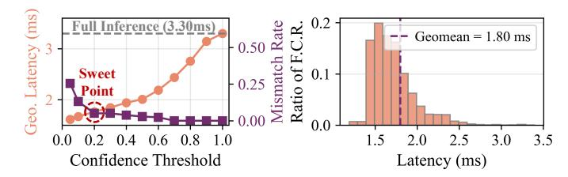
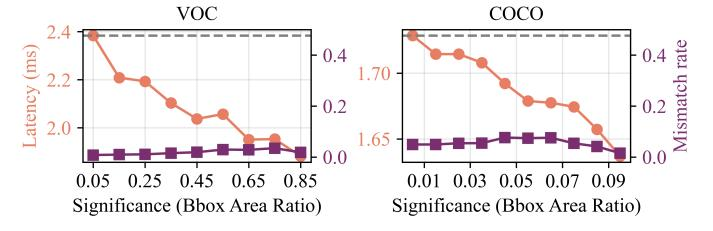

# F. Accuracy and Mismatch Analysis for Elastic Inference

Accuracy analysis for elastic inference is in Tab. VII, where we provide the accuracies of ANN, QANN, SNN, and SNN with elastic inference. QANN Accuracy degradation (e.g., from 78.17% to 75.60% on ResNet-50) is common due to quantization and has been widely reported in prior QANN accelerators [18], [36], [61]. Since the SNN, comprised of ST-BIF neurons, is equivalent to QANN (Sec. II-A2), the accuracies of QANNs and SNNs in ELSA are identical. With early termination in elastic inference (SNN+E.T.), it achieves an average 21.9% latency reduction with negligible accuracy loss (< 0.2% in all benchmarks). With an aggressive confidence threshold choice, ELSA achieves 30.6% latency reduction with mild accuracy degradation (<3.3%).

**Mismatch analysis** on COCO2017 with YOLOv2 is provided in Fig. 18. If an early-terminated detection has the same class and an IoU (Intersection over Union) greater than 0.5 with the corresponding final detection, we consider it a

Fig. 18: Mismatch rate (%) and latency (ms) with different confidence thresholds (left) and latency breakdown (right) under sweet point on COCO2017 dataset with YOLOv2. "F.C.R." is first-correct-response.

Fig. 19: Latency v.s. Significance (area ratio of bounding box prediction) in VOC2007 [49] and COCO2017 [48]. More salient objects with larger area ratios tend to terminate earlier. *match.* The definition of confidence and termination criterion is introduced in the experimental setup. As shown in the Fig. 18 (left), with the increasing confidence threshold, the mismatch rate decreases while the average latency increases. A sweet point is 0.2 confidence, where the match rate is 94.9% while achieving 45.4% geometric-mean latency reduction (1.83× speedup). Importantly, the outputs of elastic inference are progressively refined as computation proceeds. Therefore, with longer inference time, the mismatch rate is reduced to zero. We also provide the latency breakdown for the first-correctresponse sample at the sweet point (confidence threshold = 0.2) in Fig. 18 (right). The earliest first-correct-response is 1.19 ms, achieving 2.76× speedup compared to the full inference, demonstrating that ELSA is well-suited for the latency-critical applications, such as autonomous driving.

#### G. Significance Analysis for Elastic Inference

We further analyze the impact of object significance, defined as the ratio between the bounding box area and the image area, in Fig. 19. As objects become more prominent (area ratio increasing from 0.05 to 0.85 on VOC2007 and from 0.01 to 0.1 on COCO2017), detection terminates earlier. The latency decreases from 2.38 ms to 1.88 ms on VOC2007 and from 1.73 ms to 1.64 ms on COCO2017, indicating that ELSA responds faster to more salient objects. Meanwhile, the mismatch rate remains below 8% across all object size ranges.

