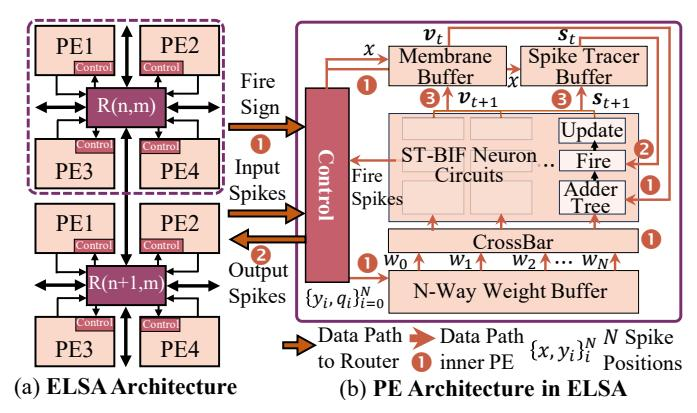

# IV. ELSA ARCHITECTURE

Fig. 8(a) illustrates the scalable architecture of ELSA, which consists of multiple neural cores (dotted frame) interconnected via 2D-mesh NoC [23]. Each neural core integrates a customized router for communication and four processing elements (PEs) for computation. Similar to previous TBT-based accelerator [11]–[14], [17], ELSA takes near-SRAM execution, addition-only computation, and event-driven sparsity as the fundamental techniques.

Fig. 8: **Overview of ELSA architecture,** consisting of multiple neural cores interconnected by our customized NoC.

Fig. 9: **ST-BIF neuron circuit**, which consists of an adder tree, a fire component, and an update component.

